# AI服务集成

<cite>
**本文档引用的文件**
- [app.py](file://app.py)
- [config.py](file://config.py)
- [utils/llm_client.py](file://utils/llm_client.py)
- [utils/context_manager.py](file://utils/context_manager.py)
- [utils/state_manager.py](file://utils/state_manager.py)
- [utils/reference_manager.py](file://utils/reference_manager.py)
- [utils/text_analyzer.py](file://utils/text_analyzer.py)
- [utils/file_manager.py](file://utils/file_manager.py)
- [utils/extractor.py](file://utils/extractor.py)
- [test_company_api.py](file://test_company_api.py)
- [.env](file://.env)
- [requirements.txt](file://requirements.txt)
</cite>

## 目录
1. [简介](#简介)
2. [项目结构](#项目结构)
3. [核心组件](#核心组件)
4. [架构总览](#架构总览)
5. [详细组件分析](#详细组件分析)
6. [依赖关系分析](#依赖关系分析)
7. [性能考虑](#性能考虑)
8. [故障排除指南](#故障排除指南)
9. [结论](#结论)
10. [附录](#附录)

## 简介
本项目是一个基于Streamlit的AI小说创作引擎，集成了多种AI服务提供商，包括Gemini官方API、OpenAI兼容服务、SiliconFlow、公司内部测试平台等。该系统通过统一的LLM客户端抽象层，为用户提供了一致的AI服务体验，支持智能设定探讨、剧情细纲讨论、正文续写、冲突检测等功能。

## 项目结构
项目采用模块化设计，主要分为以下几个部分：

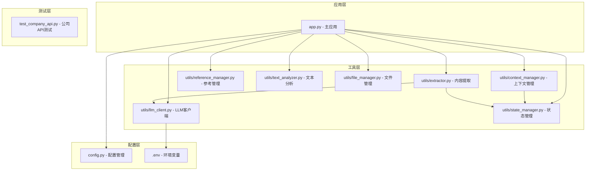

**图表来源**
- [app.py](file://app.py#L1-L690)
- [config.py](file://config.py#L1-L24)
- [utils/llm_client.py](file://utils/llm_client.py#L1-L189)

**章节来源**
- [app.py](file://app.py#L1-L690)
- [config.py](file://config.py#L1-L24)

## 核心组件
系统的核心由以下关键组件构成：

### LLM客户端抽象层
统一的LLM客户端抽象层是整个系统的核心，负责：
- 支持多种AI服务提供商
- 统一的请求处理和响应解析
- 错误处理和重试机制
- 模型选择和配置管理

### 配置管理系统
通过环境变量和配置文件管理：
- API密钥管理
- 模型选择
- 服务提供商切换
- 默认参数配置

### 上下文管理器
智能构建AI调用所需的上下文：
- 角色状态管理
- 伏笔追踪
- 设定信息整合
- 最近剧情回顾

**章节来源**
- [utils/llm_client.py](file://utils/llm_client.py#L1-L189)
- [.env](file://.env#L1-L16)

## 架构总览

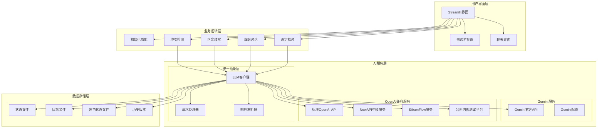

**图表来源**
- [app.py](file://app.py#L28-L278)
- [utils/llm_client.py](file://utils/llm_client.py#L9-L129)
- [utils/context_manager.py](file://utils/context_manager.py#L43-L92)

## 详细组件分析

### LLM客户端抽象层设计

#### 统一接口设计
LLM客户端提供了两个核心接口：
- `generate_content()`: 单次内容生成
- `chat_with_model()`: 对话式交互

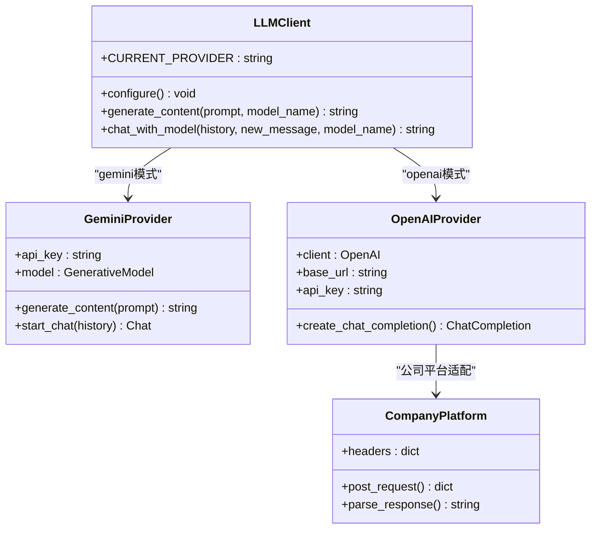

**图表来源**
- [utils/llm_client.py](file://utils/llm_client.py#L9-L189)

#### 请求处理流程

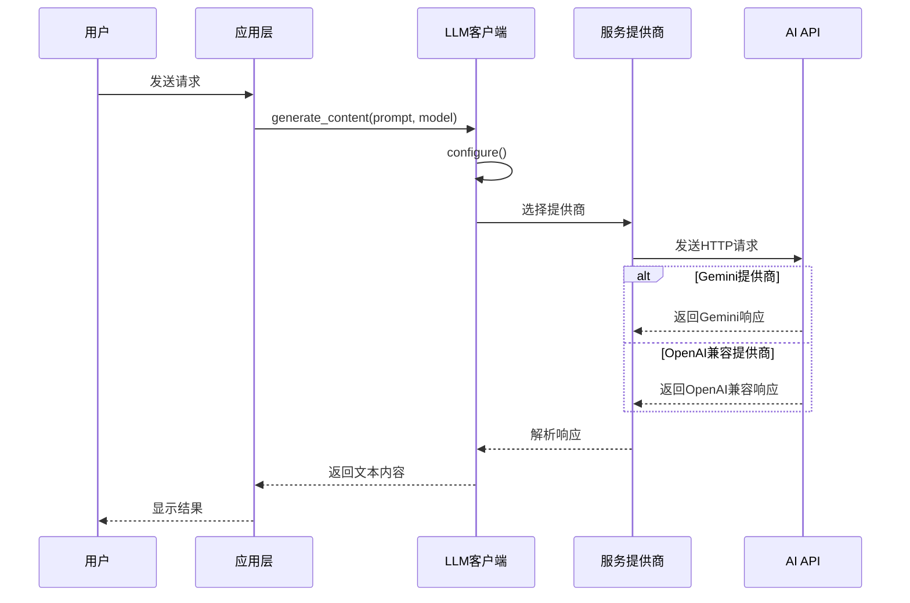

**图表来源**
- [utils/llm_client.py](file://utils/llm_client.py#L29-L129)

#### 错误处理机制
系统实现了多层次的错误处理：
- 环境变量验证
- API调用重试机制
- 详细错误日志记录
- 异常传播和恢复

**章节来源**
- [utils/llm_client.py](file://utils/llm_client.py#L9-L129)

### 配置管理系统

#### 环境变量配置
系统支持多种配置方式：

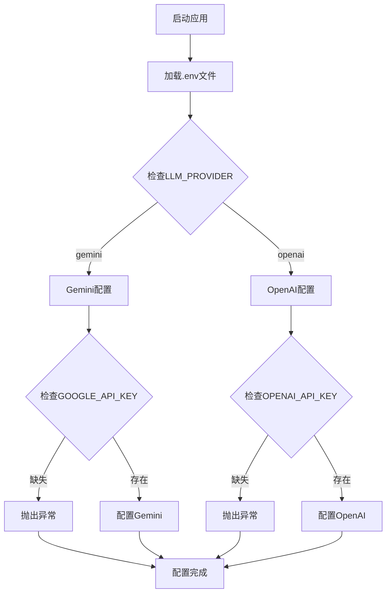

**图表来源**
- [.env](file://.env#L1-L16)
- [utils/llm_client.py](file://utils/llm_client.py#L9-L28)

#### 服务提供商支持

| 服务提供商 | 环境变量 | 默认模型 | 特殊配置 |
|-----------|----------|----------|----------|
| Gemini官方 | LLM_PROVIDER=gemini<br/>GOOGLE_API_KEY | gemini-1.5-flash | 需要Google API密钥 |
| NewAPI中转 | LLM_PROVIDER=openai<br/>OPENAI_BASE_URL=https://api.newapi.ai/v1 | gpt-3.5-turbo | 支持多模型聚合 |
| OpenAI兼容 | LLM_PROVIDER=openai<br/>OPENAI_BASE_URL | gpt-3.5-turbo | 自定义Base URL |
| SiliconFlow | LLM_PROVIDER=openai<br/>OPENAI_BASE_URL=https://api.siliconflow.com/v1 | zai-org/GLM-4.7 | 开源模型平台 |
| 公司测试平台 | LLM_PROVIDER=openai<br/>OPENAI_BASE_URL=http://45.78.235.165:9005/v1 | gemini-3-flash-preview | 内部私有部署 |

**章节来源**
- [app.py](file://app.py#L44-L78)
- [.env](file://.env#L1-L16)

### 上下文管理器

#### 上下文构建算法

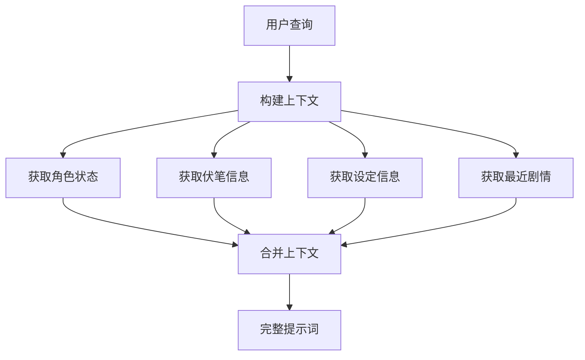

**图表来源**
- [utils/context_manager.py](file://utils/context_manager.py#L43-L92)

#### 状态管理机制

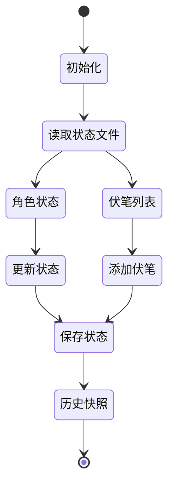

**图表来源**
- [utils/state_manager.py](file://utils/state_manager.py#L33-L49)

**章节来源**
- [utils/context_manager.py](file://utils/context_manager.py#L1-L93)
- [utils/state_manager.py](file://utils/state_manager.py#L1-L77)

### 功能模块分析

#### 设定探讨模块
该模块支持智能设定生成和管理：

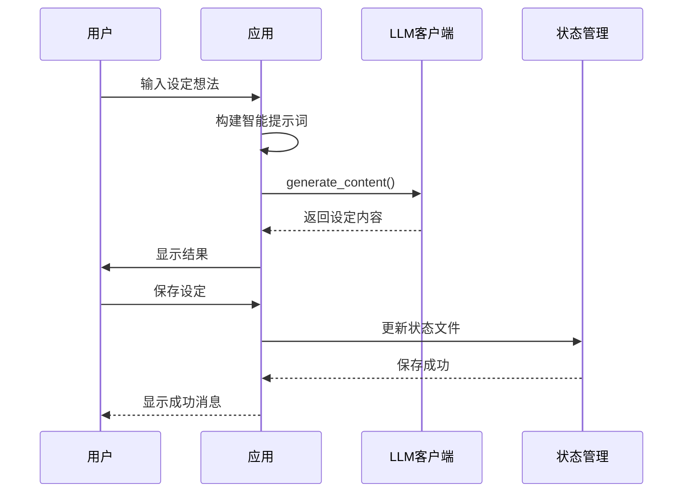

**图表来源**
- [app.py](file://app.py#L398-L475)

#### 正文续写模块
支持基于细纲和文风参考的智能续写：

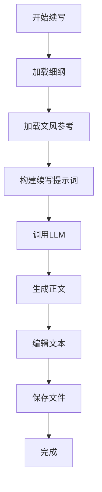

**图表来源**
- [app.py](file://app.py#L517-L597)

**章节来源**
- [app.py](file://app.py#L398-L597)

## 依赖关系分析

### 外部依赖

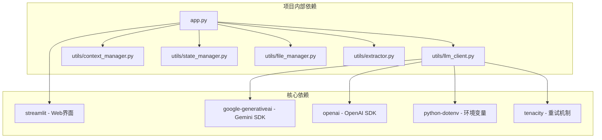

**图表来源**
- [requirements.txt](file://requirements.txt#L1-L6)
- [app.py](file://app.py#L1-L11)

### 内部模块依赖

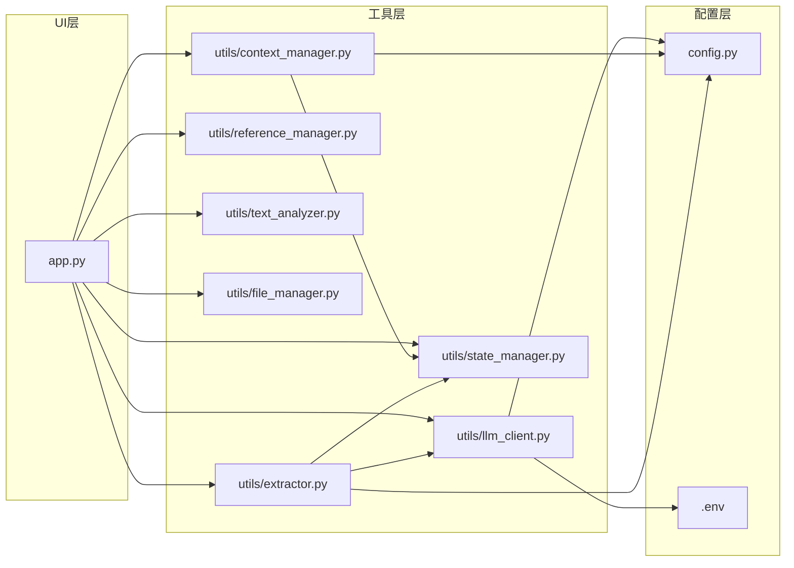

**图表来源**
- [app.py](file://app.py#L11)
- [utils/llm_client.py](file://utils/llm_client.py#L1-L5)

**章节来源**
- [requirements.txt](file://requirements.txt#L1-L6)

## 性能考虑

### API调用优化策略

#### 连接池和超时设置
- 设置合理的超时时间（默认5分钟）
- 实现连接复用
- 优化请求频率控制

#### 缓存机制
- 上下文内容缓存
- 模型响应缓存
- 配置信息缓存

#### 错误重试策略
- 指数退避重试
- 最大重试次数限制
- 不同错误类型的差异化处理

### 成本优化建议

#### 模型选择策略
- **Gemini官方**: 适合多模态和高质量文本生成
- **SiliconFlow**: 成本较低，适合大规模文本处理
- **NewAPI**: 聚合多家服务，可根据实时价格选择最优
- **公司测试平台**: 内部部署，成本最低但功能有限

#### Token使用优化
- 合理设置max_tokens参数
- 优化提示词长度
- 实现上下文压缩

## 故障排除指南

### 常见问题诊断

#### API密钥问题
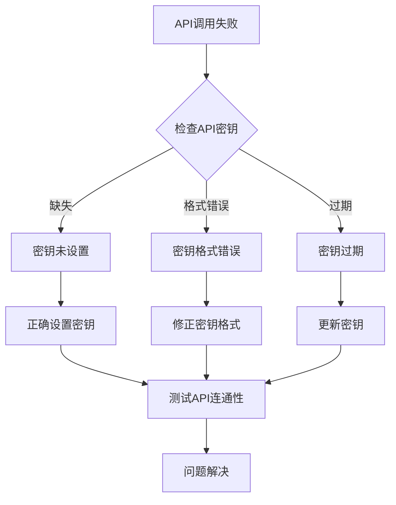

**图表来源**
- [utils/llm_client.py](file://utils/llm_client.py#L17-L27)

#### 网络连接问题
- 检查网络连接状态
- 验证代理设置
- 测试DNS解析

#### 模型兼容性问题
- 确认模型名称正确
- 检查模型可用性
- 验证模型权限

### 调试工具

#### 公司测试平台专用测试脚本
系统提供了专门的测试脚本用于调试公司内部测试平台：

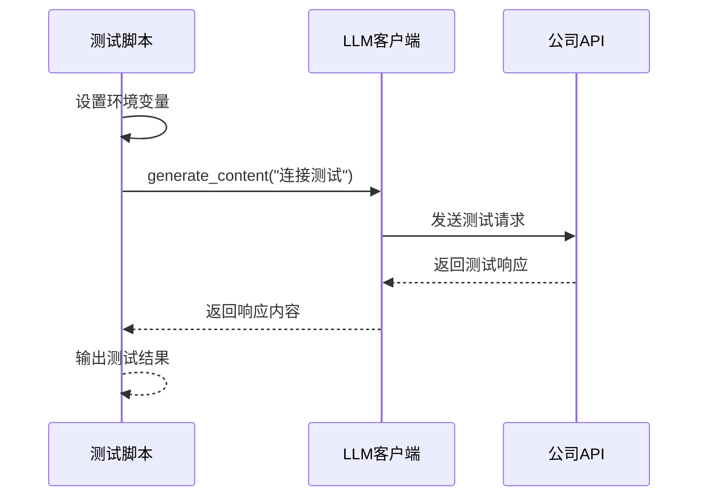

**图表来源**
- [test_company_api.py](file://test_company_api.py#L17-L25)

**章节来源**
- [test_company_api.py](file://test_company_api.py#L1-L25)

## 结论
本AI服务集成系统通过统一的抽象层设计，成功整合了多种AI服务提供商，为用户提供了一致且灵活的AI创作体验。系统的主要优势包括：

1. **统一抽象层**: 通过LLM客户端抽象层，实现了对多种服务提供商的一致访问
2. **灵活配置**: 支持多种配置方式，便于在不同环境间切换
3. **智能上下文**: 通过上下文管理器，实现了复杂的创作辅助功能
4. **完善的错误处理**: 提供了多层次的错误处理和调试机制

未来可以进一步扩展的方向包括：
- 支持更多AI服务提供商
- 实现更智能的模型选择算法
- 增强缓存和性能优化
- 扩展更多创作辅助功能

## 附录

### API调用示例

#### 基本内容生成
```python
# 设置环境变量
os.environ["LLM_PROVIDER"] = "gemini"
os.environ["GOOGLE_API_KEY"] = "your_api_key"

# 调用LLM
response = llm_client.generate_content("你好，世界！", model_name="gemini-1.5-flash")
```

#### 对话式交互
```python
history = [
    {"role": "user", "content": "你好"},
    {"role": "assistant", "content": "你好！有什么可以帮助你的吗？"}
]

response = llm_client.chat_with_model(
    history, 
    "请帮我写一段关于AI创作的故事", 
    model_name="gemini-1.5-pro"
)
```

### 配置模板

#### .env文件模板
```env
# 基础配置
LLM_PROVIDER=gemini
GOOGLE_API_KEY=your_gemini_api_key_here
GEMINI_MODEL_NAME=gemini-1.5-flash

# SiliconFlow配置示例
# LLM_PROVIDER=openai
# OPENAI_BASE_URL=https://api.siliconflow.com/v1
# OPENAI_API_KEY=your_siliconflow_key
# OPENAI_MODEL_NAME=zai-org/GLM-4.7

# 公司测试平台配置示例
# LLM_PROVIDER=openai
# OPENAI_BASE_URL=http://45.78.235.165:9005/v1
# OPENAI_API_KEY=Bearer sk-...
# OPENAI_MODEL_NAME=gemini-3-flash-preview
```

### 适用场景建议

#### Gemini官方API
- **适用场景**: 高质量文本生成、多模态内容处理
- **优势**: API稳定性好、响应质量高
- **劣势**: 成本相对较高

#### SiliconFlow
- **适用场景**: 大规模文本处理、成本敏感场景
- **优势**: 价格实惠、支持多种开源模型
- **劣势**: 功能相对简单

#### NewAPI中转服务
- **适用场景**: 需要聚合多家服务的场景
- **优势**: 服务多样、价格透明
- **劣势**: 可能存在服务不稳定的情况

#### 公司内部测试平台
- **适用场景**: 内部开发和测试
- **优势**: 成本最低、部署方便
- **劣势**: 功能有限、稳定性不确定

### 扩展新服务提供商指南

#### 添加新AI服务提供商的步骤

1. **创建配置函数**
```python
def configure_new_provider():
    """配置新服务提供商"""
    # 检查环境变量
    # 设置全局配置
    pass
```

2. **实现请求处理**
```python
def generate_content_new_provider(prompt, model_name):
    """实现新提供商的请求处理"""
    # 创建客户端
    # 发送请求
    # 解析响应
    pass
```

3. **更新主配置逻辑**
```python
elif CURRENT_PROVIDER == "new_provider":
    # 新提供商特定处理
    pass
```

4. **添加UI配置选项**
在app.py中添加新的服务提供商选项和配置界面

#### 扩展点设计

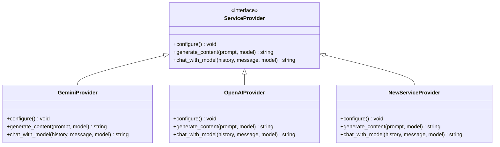

**图表来源**
- [utils/llm_client.py](file://utils/llm_client.py#L9-L189)

通过遵循这些设计原则和扩展指南，可以轻松地添加新的AI服务提供商，同时保持系统的稳定性和一致性。