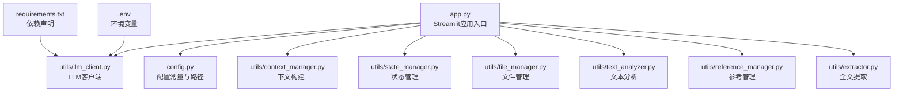
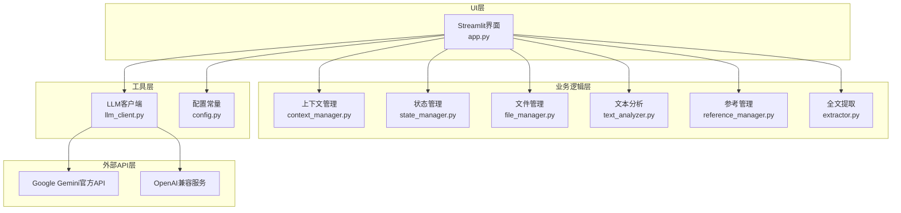
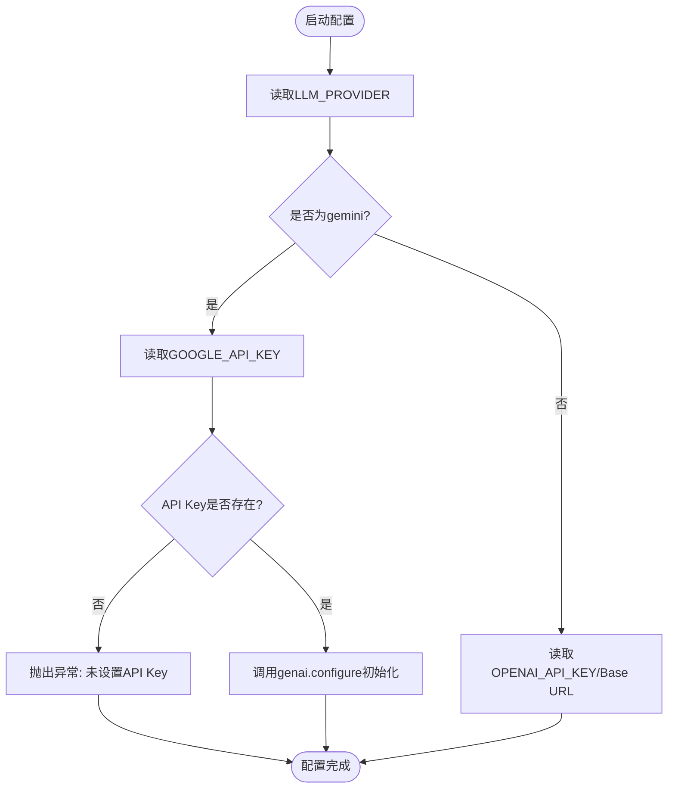
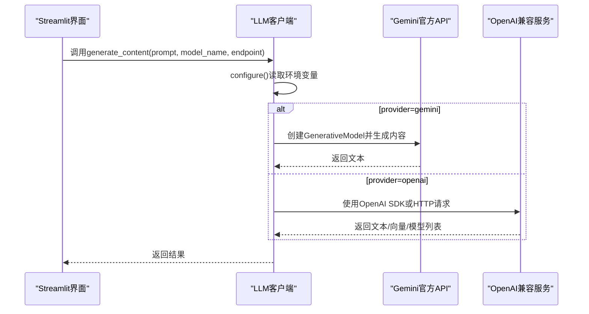
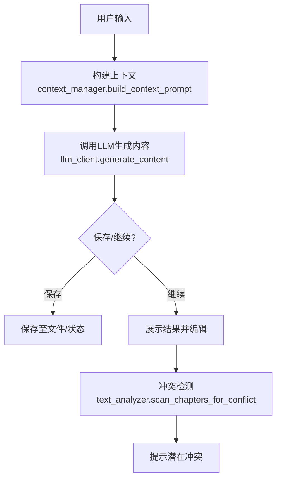
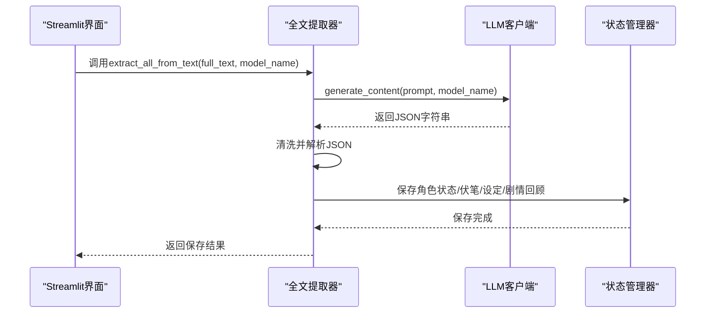
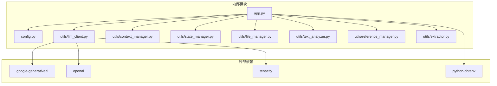

# Gemini官方API集成

<cite>
**本文档引用的文件**
- [app.py](file://app.py)
- [config.py](file://config.py)
- [utils/llm_client.py](file://utils/llm_client.py)
- [requirements.txt](file://requirements.txt)
- [.env](file://.env)
- [utils/context_manager.py](file://utils/context_manager.py)
- [utils/text_analyzer.py](file://utils/text_analyzer.py)
- [utils/reference_manager.py](file://utils/reference_manager.py)
- [utils/state_manager.py](file://utils/state_manager.py)
- [utils/file_manager.py](file://utils/file_manager.py)
- [utils/extractor.py](file://utils/extractor.py)
- [test_company_api.py](file://test_company_api.py)
</cite>

## 目录
1. [简介](#简介)
2. [项目结构](#项目结构)
3. [核心组件](#核心组件)
4. [架构总览](#架构总览)
5. [详细组件分析](#详细组件分析)
6. [依赖关系分析](#依赖关系分析)
7. [性能考虑](#性能考虑)
8. [故障排除指南](#故障排除指南)
9. [结论](#结论)
10. [附录](#附录)

## 简介
本项目是一个面向小说创作的智能辅助引擎，集成了Google Gemini官方API，支持多模态、长上下文、多模型选择与统一的调用接口。通过Streamlit构建了可视化界面，涵盖设定探讨、细纲讨论、正文续写、冲突检测与状态管理等功能模块。本文档将详细说明Gemini官方API的配置方法、特性优势、配置示例、最佳实践以及在小说创作中的应用场景与使用技巧。

## 项目结构
项目采用功能模块化组织，核心入口为Streamlit应用，通过配置文件与环境变量控制模型提供商与模型名称；工具模块封装了LLM客户端、上下文管理、状态管理、文件管理、文本分析与参考管理等能力。

图表来源
- [app.py](file://app.py#L1-L711)
- [config.py](file://config.py#L1-L24)
- [utils/llm_client.py](file://utils/llm_client.py#L1-L303)
- [.env](file://.env#L1-L16)
- [requirements.txt](file://requirements.txt#L1-L6)

章节来源
- [app.py](file://app.py#L1-L711)
- [config.py](file://config.py#L1-L24)

## 核心组件
- Streamlit应用入口：负责UI交互、模型提供商选择、API配置、端点测试与各功能模块的调度。
- LLM客户端：统一封装Gemini与OpenAI兼容API的调用，支持动态端点、批量处理与重试机制。
- 上下文管理器：整合角色状态、伏笔、设定与近期章节内容，构建创作上下文。
- 状态管理器：维护角色状态与伏笔列表的持久化存储。
- 文件管理器：确保目录结构、解析正文章节并保存到独立文件。
- 文本分析器：基于差异算法检测章节改动并扫描后续章节潜在冲突。
- 参考管理器：解析素材样本并定位原著中的参考片段。
- 全文提取器：调用LLM从全文中抽取角色状态、伏笔、设定与剧情回顾。

章节来源
- [app.py](file://app.py#L1-L711)
- [utils/llm_client.py](file://utils/llm_client.py#L1-L303)
- [utils/context_manager.py](file://utils/context_manager.py#L1-L93)
- [utils/state_manager.py](file://utils/state_manager.py#L1-L77)
- [utils/file_manager.py](file://utils/file_manager.py#L1-L108)
- [utils/text_analyzer.py](file://utils/text_analyzer.py#L1-L63)
- [utils/reference_manager.py](file://utils/reference_manager.py#L1-L94)
- [utils/extractor.py](file://utils/extractor.py#L1-L106)

## 架构总览
系统采用“UI层-业务逻辑层-工具层-外部API层”的分层架构。UI层由Streamlit提供，业务逻辑层负责流程编排，工具层封装通用能力，外部API层通过LLM客户端适配Gemini与OpenAI兼容服务。

图表来源
- [app.py](file://app.py#L1-L711)
- [utils/llm_client.py](file://utils/llm_client.py#L1-L303)
- [utils/context_manager.py](file://utils/context_manager.py#L1-L93)
- [utils/state_manager.py](file://utils/state_manager.py#L1-L77)
- [utils/file_manager.py](file://utils/file_manager.py#L1-L108)
- [utils/text_analyzer.py](file://utils/text_analyzer.py#L1-L63)
- [utils/reference_manager.py](file://utils/reference_manager.py#L1-L94)
- [utils/extractor.py](file://utils/extractor.py#L1-L106)
- [config.py](file://config.py#L1-L24)

## 详细组件分析

### Gemini官方API配置与模型选择
- 环境变量配置
  - LLM_PROVIDER：默认为gemini，用于切换模型提供商。
  - GOOGLE_API_KEY：Gemini官方API密钥，必须设置。
  - GEMINI_MODEL_NAME：默认模型名称，如gemini-1.5-flash。
- UI配置界面
  - 在侧边栏提供“Gemini API配置”区域，支持输入API Key与选择模型。
  - 默认模型选项包括gemini-1.5-flash、gemini-1.5-pro、gemini-1.0-pro。
- 客户端配置
  - LLM客户端根据LLM_PROVIDER读取环境变量，若为gemini则调用genai.configure进行初始化。
  - 未设置API Key时抛出异常，确保安全与正确性。

图表来源
- [utils/llm_client.py](file://utils/llm_client.py#L9-L28)
- [.env](file://.env#L1-L3)

章节来源
- [utils/llm_client.py](file://utils/llm_client.py#L9-L28)
- [.env](file://.env#L1-L3)
- [app.py](file://app.py#L80-L106)

### LLM客户端与统一调用接口
- 统一生成函数
  - generate_content：支持动态端点（chat/completions、embeddings、models等），根据当前提供商调用相应API。
  - 对于Gemini：使用genai.GenerativeModel生成内容。
  - 对于OpenAI兼容：使用OpenAI SDK或自定义HTTP请求（针对特定平台）。
- 聊天接口
  - chat_with_model：支持历史消息传递，Gemini端将历史映射为parts与角色。
- 批量处理与端点测试
  - batch_process_content：批量处理提示词，便于全量状态提取。
  - test_endpoint_connectivity：测试指定端点连通性，返回布尔值与预览结果。

图表来源
- [utils/llm_client.py](file://utils/llm_client.py#L29-L187)

章节来源
- [utils/llm_client.py](file://utils/llm_client.py#L29-L187)

### 小说创作工作流与上下文构建
- 探讨设定
  - 用户输入设定想法，系统构建提示词并调用LLM生成详细设定，支持保存至对应文件。
- 探讨细纲
  - 自动加载最近N章正文、角色状态、伏笔与相关设定，构建上下文并生成细纲。
- 续写正文
  - 结合当前细纲与文风参考（来自素材样本），调用LLM生成章节内容并保存。
- 改文与冲突检测
  - 编辑章节后对比差异，扫描后续章节是否存在被删除/修改的关键字，提示潜在冲突。

图表来源
- [utils/context_manager.py](file://utils/context_manager.py#L43-L92)
- [utils/llm_client.py](file://utils/llm_client.py#L29-L50)
- [utils/text_analyzer.py](file://utils/text_analyzer.py#L39-L62)

章节来源
- [app.py](file://app.py#L419-L527)
- [utils/context_manager.py](file://utils/context_manager.py#L43-L92)
- [utils/text_analyzer.py](file://utils/text_analyzer.py#L39-L62)

### 全文提取与状态管理
- 全文提取
  - 通过提示词引导LLM返回JSON结构的角色状态、伏笔列表、设定总结与剧情回顾。
  - 清洗响应文本并解析为JSON，保存到对应文件。
- 状态管理
  - 维护角色状态与伏笔列表的JSON文件，支持快照与增量更新。

图表来源
- [utils/extractor.py](file://utils/extractor.py#L6-L55)
- [utils/llm_client.py](file://utils/llm_client.py#L29-L50)
- [utils/state_manager.py](file://utils/state_manager.py#L17-L31)

章节来源
- [utils/extractor.py](file://utils/extractor.py#L6-L106)
- [utils/state_manager.py](file://utils/state_manager.py#L17-L31)

## 依赖关系分析
- 外部依赖
  - google-generativeai：用于调用Gemini官方API。
  - openai：用于调用OpenAI兼容服务。
  - python-dotenv：加载.env中的环境变量。
  - tenacity：提供重试机制。
- 内部依赖
  - app.py依赖config.py、dotenv、utils包中的所有模块。
  - utils/llm_client.py依赖genai与openai，同时通过环境变量决定调用路径。
  - 各工具模块相互独立，通过config.py共享路径与文件名常量。

图表来源
- [requirements.txt](file://requirements.txt#L1-L6)
- [app.py](file://app.py#L1-L11)
- [utils/llm_client.py](file://utils/llm_client.py#L1-L5)
- [config.py](file://config.py#L1-L24)

章节来源
- [requirements.txt](file://requirements.txt#L1-L6)
- [app.py](file://app.py#L1-L11)

## 性能考虑
- 超时与重试
  - OpenAI兼容客户端设置较长超时时间，减少网络波动导致的失败。
  - 使用tenacity实现重试策略，提升稳定性。
- 批量处理
  - 批量处理接口支持逐条记录结果，便于监控与恢复。
- 上下文长度
  - 细纲讨论与正文续写通过上下文管理器限制最近N章内容，避免超出模型上下文上限。
- 端点测试
  - 提供端点连通性测试，提前发现配置问题，降低运行时失败概率。

章节来源
- [utils/llm_client.py](file://utils/llm_client.py#L160-L186)
- [utils/llm_client.py](file://utils/llm_client.py#L29-L30)
- [utils/context_manager.py](file://utils/context_manager.py#L22-L32)

## 故障排除指南
- API密钥未设置
  - 症状：启动时报错提示未设置API Key。
  - 处理：在.env中设置GOOGLE_API_KEY或OPENAI_API_KEY，并确保LLM_PROVIDER正确。
- 端点连通性失败
  - 症状：端点测试返回失败。
  - 处理：检查Base URL、API Key、网络连通性；使用端点测试功能查看预览错误信息。
- 公司测试平台调用异常
  - 症状：特定平台调用失败并打印详细日志。
  - 处理：查看终端输出的详细堆栈与参数，确认模型名称、端点与请求体格式。
- 全文提取失败
  - 症状：提取返回None或JSON解析异常。
  - 处理：检查模型输出格式，确保返回纯JSON；必要时调整提示词或更换模型。

章节来源
- [utils/llm_client.py](file://utils/llm_client.py#L17-L28)
- [utils/llm_client.py](file://utils/llm_client.py#L143-L157)
- [utils/llm_client.py](file://utils/llm_client.py#L52-L157)
- [utils/extractor.py](file://utils/extractor.py#L35-L55)

## 结论
本项目通过统一的LLM客户端与完善的工具链，实现了对Gemini官方API的无缝集成，覆盖了小说创作的全流程：设定探讨、细纲构建、正文续写、冲突检测与状态管理。通过环境变量与UI配置，用户可以灵活切换模型提供商与模型名称，并借助端点测试与错误日志快速定位问题。建议在生产环境中结合重试机制与上下文长度控制，进一步提升稳定性与性能。

## 附录

### Gemini特性优势与适用场景
- 多模态支持：适合图文混排、图像理解与生成的扩展场景。
- 长上下文处理：适合大规模文本的摘要、分析与续写。
- 多模型选择：根据任务复杂度选择合适模型，平衡速度与质量。
- 统一接口：通过LLM客户端抽象，实现多提供商切换与一致性体验。

### 配置示例与最佳实践
- 环境变量
  - LLM_PROVIDER=gemini
  - GOOGLE_API_KEY=your_gemini_api_key_here
  - GEMINI_MODEL_NAME=gemini-1.5-flash
- 模型参数调优
  - 根据任务复杂度选择gemini-1.5-pro或gemini-1.5-flash。
  - 在OpenAI兼容服务中，合理设置温度、top_p、max_tokens等参数。
- 性能优化建议
  - 使用端点测试与重试机制，减少网络波动影响。
  - 控制上下文长度，避免超出模型上下文限制。
  - 对批量处理任务使用批处理接口，提高吞吐量。

### 小说创作应用场景与使用技巧
- 探讨设定：提供具体、生动的设定细节，融合多种设定元素。
- 探讨细纲：自动加载最近章节与角色状态，确保剧情连贯。
- 续写正文：结合文风参考与当前细纲，生成符合风格的章节内容。
- 冲突检测：通过差异分析与后续章节扫描，及时发现潜在冲突。

章节来源
- [app.py](file://app.py#L443-L451)
- [app.py](file://app.py#L517-L521)
- [app.py](file://app.py#L581-L591)
- [utils/text_analyzer.py](file://utils/text_analyzer.py#L39-L62)