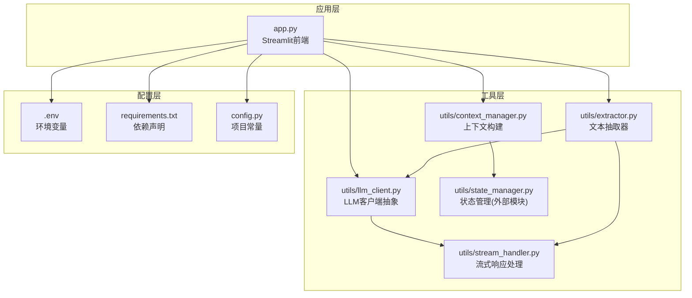
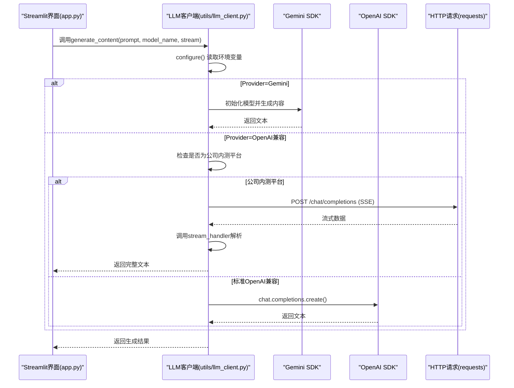
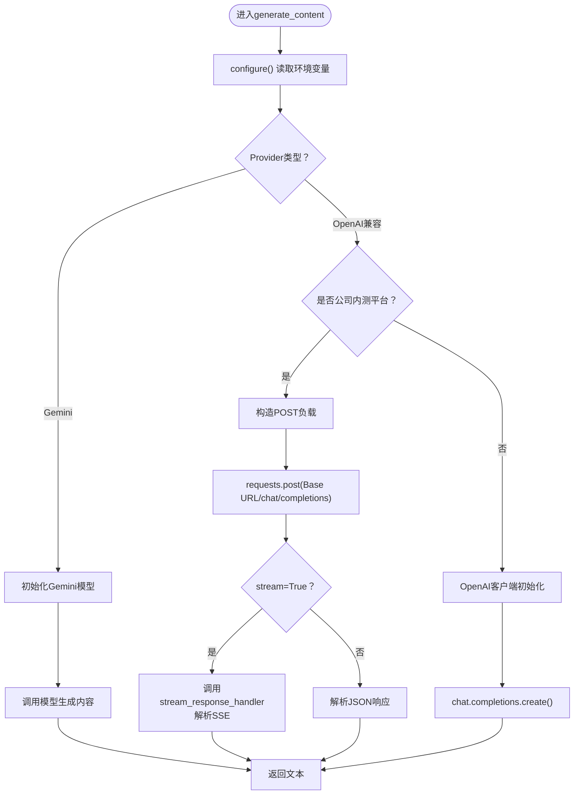
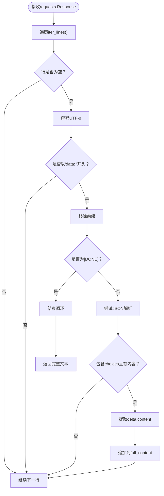
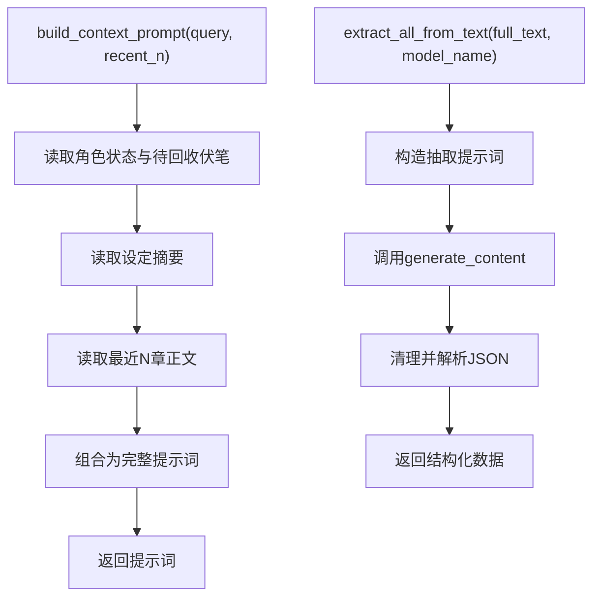
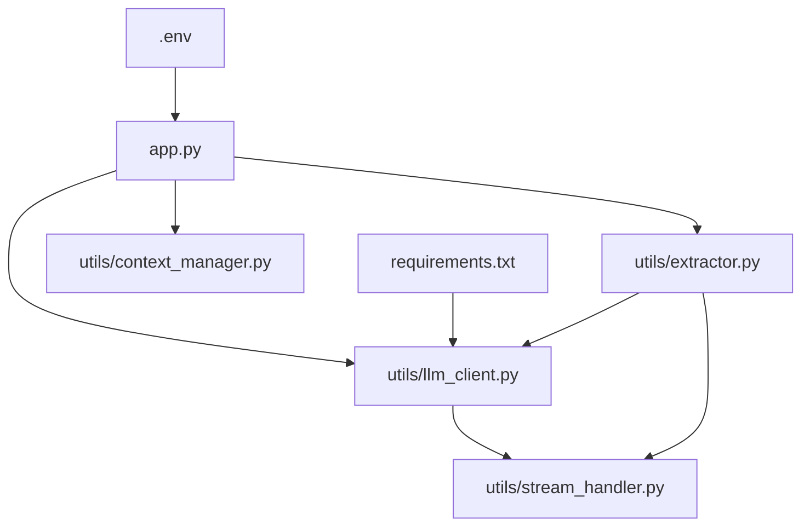

# LLM客户端抽象层设计

<cite>
**本文档引用的文件**
- [utils/llm_client.py](file://utils/llm_client.py)
- [app.py](file://app.py)
- [config.py](file://config.py)
- [requirements.txt](file://requirements.txt)
- [.env](file://.env)
- [utils/stream_handler.py](file://utils/stream_handler.py)
- [utils/context_manager.py](file://utils/context_manager.py)
- [utils/extractor.py](file://utils/extractor.py)
- [test_company_api.py](file://test_company_api.py)
</cite>

## 目录
1. [引言](#引言)
2. [项目结构](#项目结构)
3. [核心组件](#核心组件)
4. [架构总览](#架构总览)
5. [详细组件分析](#详细组件分析)
6. [依赖关系分析](#依赖关系分析)
7. [性能考虑](#性能考虑)
8. [故障排除指南](#故障排除指南)
9. [结论](#结论)
10. [附录](#附录)

## 引言
本技术文档围绕LLM客户端抽象层设计展开，重点阐述统一LLM客户端的架构设计、Provider模式实现、配置管理机制、错误处理策略，以及generate_content与chat_with_model两个核心函数的设计思路与实现细节。同时提供扩展新AI服务提供商的指南与最佳实践，包含集成步骤与注意事项。

## 项目结构
该项目采用“应用层 + 工具层”的分层架构：
- 应用层：Streamlit前端应用，负责用户交互与业务流程编排
- 工具层：LLM客户端抽象、上下文管理、抽取器、流式处理等工具模块
- 配置层：环境变量与常量配置

图表来源
- [app.py](file://app.py#L1-L719)
- [utils/llm_client.py](file://utils/llm_client.py#L1-L203)
- [utils/stream_handler.py](file://utils/stream_handler.py#L1-L114)
- [utils/context_manager.py](file://utils/context_manager.py#L1-L93)
- [utils/extractor.py](file://utils/extractor.py#L1-L194)
- [.env](file://.env#L1-L16)
- [requirements.txt](file://requirements.txt#L1-L6)
- [config.py](file://config.py#L1-L24)

章节来源
- [app.py](file://app.py#L1-L719)
- [config.py](file://config.py#L1-L24)

## 核心组件
- LLM客户端抽象层：提供统一的generate_content与chat_with_model接口，屏蔽不同Provider的差异
- Provider模式：通过环境变量切换Gemini与OpenAI兼容服务（含公司内测平台）
- 配置管理：集中管理API Key、Base URL、模型名称等配置项
- 错误处理：统一异常捕获与调试信息输出
- 流式处理：支持SSE流式响应的解析与拼接
- 上下文构建：整合角色状态、伏笔、设定与近期剧情，形成完整的提示词上下文

章节来源
- [utils/llm_client.py](file://utils/llm_client.py#L1-L203)
- [utils/stream_handler.py](file://utils/stream_handler.py#L1-L114)
- [utils/context_manager.py](file://utils/context_manager.py#L1-L93)
- [utils/extractor.py](file://utils/extractor.py#L1-L194)

## 架构总览
LLM客户端抽象层采用“统一入口 + Provider分支”的设计，通过全局CURRENT_PROVIDER控制当前使用的AI服务。应用层通过环境变量与UI交互配置Provider与模型，LLM客户端根据Provider分支调用相应SDK或HTTP接口。

图表来源
- [app.py](file://app.py#L449-L471)
- [utils/llm_client.py](file://utils/llm_client.py#L29-L142)
- [utils/stream_handler.py](file://utils/stream_handler.py#L1-L39)

## 详细组件分析

### LLM客户端抽象层
- 统一接口
  - generate_content：支持普通与流式两种模式，返回纯文本
  - chat_with_model：基于历史消息进行对话，返回纯文本
- Provider分支
  - Gemini：使用google-generativeai SDK
  - OpenAI兼容：支持标准OpenAI接口与公司内测平台（HTTP直连）
- 配置管理
  - 通过环境变量LLM_PROVIDER选择Provider
  - Gemini：GOOGLE_API_KEY
  - OpenAI兼容：OPENAI_API_KEY、OPENAI_BASE_URL、OPENAI_MODEL_NAME
- 错误处理
  - 统一捕获异常并打印详细调试信息（模型名、Base URL、API Key长度、错误类型、堆栈）
  - 公司内测平台额外打印完整URL与请求头信息
- 重试机制
  - 使用tenacity装饰器对generate_content进行最多3次重试，每次固定等待2秒
- 超时处理
  - OpenAI兼容默认超时300秒；公司内测平台显式设置timeout=300

图表来源
- [utils/llm_client.py](file://utils/llm_client.py#L29-L142)
- [utils/stream_handler.py](file://utils/stream_handler.py#L1-L39)

章节来源
- [utils/llm_client.py](file://utils/llm_client.py#L1-L203)
- [utils/stream_handler.py](file://utils/stream_handler.py#L1-L114)

### 流式响应处理
- stream_response_handler：解析SSE流式响应，逐块提取content并拼接完整文本
- streaming_extractor：将大文本分块，逐块调用generate_content(stream=True)并合并结果
- chunked_text_processor：按指定字符数切分文本，降低内存占用

图表来源
- [utils/stream_handler.py](file://utils/stream_handler.py#L1-L39)

章节来源
- [utils/stream_handler.py](file://utils/stream_handler.py#L1-L114)

### 上下文构建与抽取器
- build_context_prompt：整合角色状态、待回收伏笔、设定摘要与最近N章正文，形成完整提示词
- extract_all_from_text：一次性抽取角色状态、伏笔、设定与剧情回顾，返回结构化JSON
- extract_all_from_text_streaming：大文本分块流式抽取，降低内存压力

图表来源
- [utils/context_manager.py](file://utils/context_manager.py#L43-L92)
- [utils/extractor.py](file://utils/extractor.py#L6-L55)

章节来源
- [utils/context_manager.py](file://utils/context_manager.py#L1-L93)
- [utils/extractor.py](file://utils/extractor.py#L1-L194)

### 应用层集成
- Streamlit界面通过环境变量与UI控件配置Provider与模型
- 在“探讨设定”、“探讨细纲”、“续写正文”等功能模块中调用LLM客户端
- 统一的异常处理与调试提示，便于定位问题

章节来源
- [app.py](file://app.py#L427-L544)

## 依赖关系分析
- 外部依赖
  - google-generativeai：Gemini SDK
  - openai：OpenAI SDK
  - tenacity：重试装饰器
  - python-dotenv：环境变量加载
  - requests：公司内测平台HTTP请求
- 内部依赖
  - llm_client依赖stream_handler进行流式解析
  - extractor依赖llm_client与stream_handler进行抽取
  - app.py依赖llm_client、context_manager、extractor等

图表来源
- [utils/llm_client.py](file://utils/llm_client.py#L1-L203)
- [utils/stream_handler.py](file://utils/stream_handler.py#L1-L114)
- [utils/extractor.py](file://utils/extractor.py#L1-L194)
- [app.py](file://app.py#L1-L719)
- [.env](file://.env#L1-L16)
- [requirements.txt](file://requirements.txt#L1-L6)

章节来源
- [requirements.txt](file://requirements.txt#L1-L6)
- [app.py](file://app.py#L1-L719)

## 性能考虑
- 流式处理：在大文本抽取场景中，通过分块与流式响应显著降低内存占用
- 超时设置：OpenAI兼容默认300秒，公司内测平台显式设置，避免长时间阻塞
- 重试策略：generate_content具备最多3次重试，固定间隔2秒，提升稳定性
- 模型选择：通过环境变量与UI选择不同模型，平衡速度与质量

## 故障排除指南
- Provider未配置或Key缺失
  - 检查LLM_PROVIDER、GOOGLE_API_KEY或OPENAI_API_KEY是否正确设置
  - 查看错误输出中的API Key长度与Base URL信息
- 公司内测平台调用失败
  - 确认OPENAI_BASE_URL包含“45.78.235.165”，并检查完整URL构造
  - 关注详细堆栈与请求头信息，验证Authorization与Content-Type
- OpenAI兼容接口异常
  - 检查OPENAI_BASE_URL与模型名称是否匹配
  - 注意超时时间与网络状况
- 流式响应解析错误
  - 确认SSE数据格式与JSON结构
  - 检查增量内容字段是否存在

章节来源
- [utils/llm_client.py](file://utils/llm_client.py#L83-L141)
- [utils/stream_handler.py](file://utils/stream_handler.py#L37-L39)

## 结论
该LLM客户端抽象层通过Provider模式实现了对不同AI服务的统一接入，结合环境变量与UI配置，提供了灵活的部署与切换能力。流式处理与重试机制提升了大文本处理与网络不稳定场景下的可靠性。建议在生产环境中进一步完善日志系统、指标监控与更细粒度的错误分类。

## 附录

### 扩展新AI服务提供商指南
- 步骤
  1. 在LLM客户端新增Provider分支，实现generate_content与chat_with_model的适配逻辑
  2. 在configure中增加环境变量校验与SDK初始化
  3. 若为HTTP接口，参考公司内测平台的requests实现方式，注意SSE与非SSE的差异
  4. 在应用层UI中增加Provider选项与配置项
  5. 编写单元测试与集成测试，覆盖正常与异常路径
- 最佳实践
  - 明确环境变量命名规范与默认值
  - 对外暴露统一的异常类型，便于上层捕获与处理
  - 为流式接口提供可插拔的解析器，便于扩展新的SSE格式
  - 记录详细的调试信息，包括请求参数、响应状态与堆栈

章节来源
- [utils/llm_client.py](file://utils/llm_client.py#L9-L28)
- [app.py](file://app.py#L36-L78)

### 配置清单
- 环境变量
  - LLM_PROVIDER：选择"gemini"或"openai"
  - GOOGLE_API_KEY：Gemini API Key
  - OPENAI_API_KEY：OpenAI兼容API Key
  - OPENAI_BASE_URL：OpenAI兼容Base URL
  - OPENAI_MODEL_NAME：OpenAI兼容模型名称
  - GEMINI_MODEL_NAME：Gemini模型名称
- 示例
  - .env文件中包含Gemini与SiliconFlow、公司内测平台的配置示例

章节来源
- [.env](file://.env#L1-L16)
- [app.py](file://app.py#L82-L278)

### 测试用例
- 公司内测平台测试脚本
  - 设置环境变量后直接调用generate_content进行连通性测试
  - 输出响应内容的前100字符作为验证

章节来源
- [test_company_api.py](file://test_company_api.py#L1-L25)