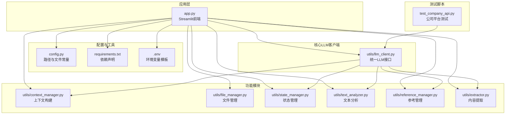
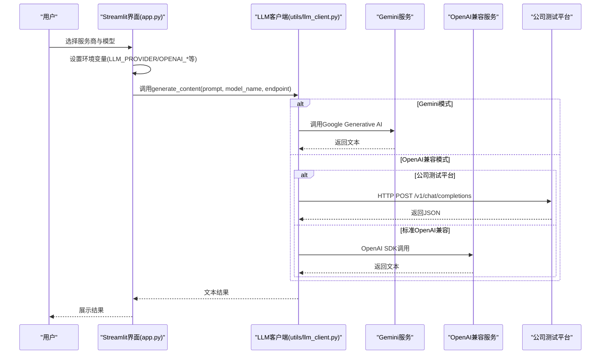
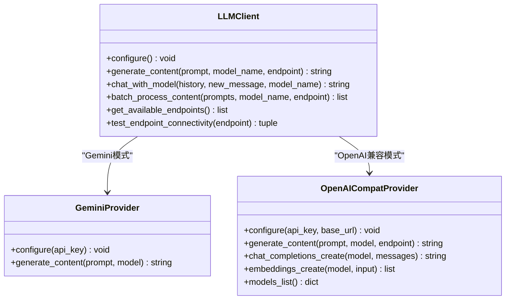
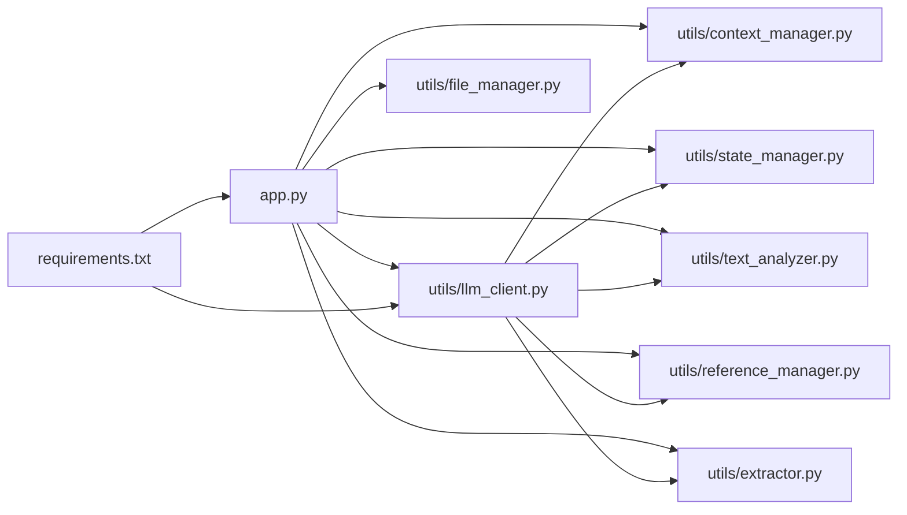

# OpenAI兼容服务集成

<cite>
**本文档引用的文件**
- [app.py](file://app.py)
- [config.py](file://config.py)
- [utils/llm_client.py](file://utils/llm_client.py)
- [test_company_api.py](file://test_company_api.py)
- [.env](file://.env)
- [requirements.txt](file://requirements.txt)
- [utils/context_manager.py](file://utils/context_manager.py)
- [utils/file_manager.py](file://utils/file_manager.py)
- [utils/state_manager.py](file://utils/state_manager.py)
- [utils/text_analyzer.py](file://utils/text_analyzer.py)
- [utils/reference_manager.py](file://utils/reference_manager.py)
- [utils/extractor.py](file://utils/extractor.py)
</cite>

## 目录
1. [简介](#简介)
2. [项目结构](#项目结构)
3. [核心组件](#核心组件)
4. [架构总览](#架构总览)
5. [详细组件分析](#详细组件分析)
6. [依赖关系分析](#依赖关系分析)
7. [性能考虑](#性能考虑)
8. [故障排除指南](#故障排除指南)
9. [结论](#结论)
10. [附录](#附录)

## 简介
本项目提供了一个面向小说创作的智能写作引擎，集成了多种大语言模型服务，包括Google Gemini官方API与多种OpenAI兼容服务。通过统一的LLM客户端接口，用户可以在Streamlit界面中灵活切换不同的服务商与模型，进行设定探讨、剧情细纲讨论、正文续写以及冲突检测等功能。本文档将详细介绍如何配置OpenAI官方API与第三方兼容服务，包括API密钥设置、Base URL配置、自定义服务接入，以及不同服务的配置模板与连接测试方法。

## 项目结构
项目采用模块化设计，围绕LLM客户端为核心，配合文件管理、状态管理、上下文构建、文本分析等工具模块协同工作。Streamlit应用作为前端入口，负责用户交互与配置展示。



图表来源
- [app.py](file://app.py#L1-L711)
- [config.py](file://config.py#L1-L24)
- [utils/llm_client.py](file://utils/llm_client.py#L1-L303)
- [test_company_api.py](file://test_company_api.py#L1-L25)

章节来源
- [app.py](file://app.py#L1-L711)
- [config.py](file://config.py#L1-L24)

## 核心组件
- Streamlit前端应用：提供图形化界面，支持多服务商选择、模型配置、端点测试与功能导航。
- LLM客户端：封装Gemini与OpenAI兼容API调用，支持动态端点、批量处理与连接测试。
- 配置模块：集中管理项目路径、文件常量与目录结构。
- 工具模块：文件管理、状态管理、上下文构建、文本分析、参考管理、内容提取。

章节来源
- [app.py](file://app.py#L1-L711)
- [utils/llm_client.py](file://utils/llm_client.py#L1-L303)
- [config.py](file://config.py#L1-L24)

## 架构总览
系统通过统一的LLM客户端抽象，屏蔽不同服务商的差异，实现“一次配置，多处使用”。前端根据用户选择设置环境变量，LLM客户端据此路由到相应的API实现。



图表来源
- [app.py](file://app.py#L32-L298)
- [utils/llm_client.py](file://utils/llm_client.py#L9-L186)

## 详细组件分析

### LLM客户端：统一接口与多服务商适配
- 统一配置函数：根据环境变量决定当前提供商（Gemini或OpenAI兼容），并校验必要密钥。
- 生成内容函数：支持动态端点（chat/completions、embeddings、models等），在OpenAI兼容模式下可针对特定平台（如公司测试平台）进行URL拼接与请求头定制。
- 聊天接口：支持历史消息传递，Gemini与OpenAI兼容模式分别映射消息格式。
- 批量处理：对多个提示词进行顺序处理，便于全量状态提取等场景。
- 端点测试：提供连通性测试，返回成功与否与响应预览。



图表来源
- [utils/llm_client.py](file://utils/llm_client.py#L9-L186)

章节来源
- [utils/llm_client.py](file://utils/llm_client.py#L1-L303)

### Streamlit前端：多服务商配置与端点测试
- 服务商选择：支持Gemini官方、NewAPI中转服务、SiliconFlow、公司内部测试平台及其他OpenAI兼容服务。
- 配置项：
  - API密钥：Gemini使用GOOGLE_API_KEY；OpenAI兼容使用OPENAI_API_KEY。
  - Base URL：OpenAI兼容服务的基础地址，可选，用于指向第三方API。
  - 模型选择：根据服务商提供模型列表或允许自定义模型名称。
- 端点测试：列出可用端点（chat/completions、embeddings、models等），一键测试连通性并显示响应预览。

```mermaid
flowchart TD
Start(["进入配置页面"]) --> ChooseProvider["选择服务商"]
ChooseProvider --> |Gemini| GeminiConfig["配置GOOGLE_API_KEY<br/>选择GEMINI_MODEL_NAME"]
ChooseProvider --> |OpenAI兼容(NewAPI/SiliconFlow/其他)| OpenAIConfig["配置OPENAI_API_KEY<br/>可选OPENAI_BASE_URL<br/>选择OPENAI_MODEL_NAME"]
ChooseProvider --> |公司测试平台| CompanyConfig["配置OPENAI_API_KEY(Bearer)<br/>固定OPENAI_BASE_URL<br/>选择测试模型"]
GeminiConfig --> SaveEnv["写入环境变量"]
OpenAIConfig --> SaveEnv
CompanyConfig --> SaveEnv
SaveEnv --> TestEndpoints["列出可用端点并测试"]
TestEndpoints --> End(["完成"])
```

图表来源
- [app.py](file://app.py#L32-L298)
- [utils/llm_client.py](file://utils/llm_client.py#L279-L303)

章节来源
- [app.py](file://app.py#L32-L298)
- [utils/llm_client.py](file://utils/llm_client.py#L279-L303)

### 配置模板与连接测试

#### 环境变量模板
- Gemini官方API
  - LLM_PROVIDER=gemini
  - GOOGLE_API_KEY=your_gemini_api_key_here
  - GEMINI_MODEL_NAME=gemini-1.5-flash
- SiliconFlow
  - LLM_PROVIDER=openai
  - OPENAI_BASE_URL=https://api.siliconflow.com/v1
  - OPENAI_API_KEY=sk-...
  - OPENAI_MODEL_NAME=zai-org/GLM-4.7
- 公司内部测试平台
  - LLM_PROVIDER=openai
  - OPENAI_BASE_URL=http://45.78.235.165:9005/v1
  - OPENAI_API_KEY=Bearer sk-...
  - OPENAI_MODEL_NAME=gemini-3-flash-preview

章节来源
- [.env](file://.env#L1-L16)

#### 连接测试方法
- 在Streamlit界面中选择对应服务商，配置密钥与Base URL后，使用“端点测试”功能选择任意端点进行连通性测试。
- 也可使用独立测试脚本对特定平台进行验证。

章节来源
- [app.py](file://app.py#L267-L287)
- [test_company_api.py](file://test_company_api.py#L1-L25)

### OpenAI兼容服务特性与限制
- 模型选择：支持从服务商提供的模型列表中选择，或在通用配置中自定义模型名称。
- 参数配置：默认模型名称与端点由LLM客户端统一管理；对于公司测试平台，客户端会根据端点动态拼接URL并构造请求体。
- 成本控制策略：
  - 通过选择较低参数的模型（如gpt-3.5-turbo）与合理设置max_tokens，降低Token消耗。
  - 使用批量处理时注意并发与重试策略，避免重复请求导致的成本增加。
  - 对于第三方平台，建议优先使用免费额度或按量付费的模型。

章节来源
- [utils/llm_client.py](file://utils/llm_client.py#L46-L186)

## 依赖关系分析
- 应用依赖：Streamlit用于界面，dotenv用于加载环境变量，tenacity用于重试，openai用于OpenAI SDK调用，google-generativeai用于Gemini调用。
- 模块耦合：LLM客户端是核心，其他模块通过其进行API调用；上下文构建与状态管理依赖LLM客户端进行内容提取与分析。



图表来源
- [requirements.txt](file://requirements.txt#L1-L6)
- [app.py](file://app.py#L1-L11)
- [utils/llm_client.py](file://utils/llm_client.py#L1-L5)

章节来源
- [requirements.txt](file://requirements.txt#L1-L6)
- [app.py](file://app.py#L1-L11)

## 性能考虑
- 超时设置：OpenAI兼容客户端设置了较长的超时时间（5分钟），适用于长文本或复杂推理任务。
- 重试机制：使用tenacity进行有限次数的重试，提升网络波动下的稳定性。
- 批量处理：批量处理函数逐条处理提示词，便于监控进度与异常定位。
- 端点选择：根据需求选择合适的端点（chat/completions用于对话，embeddings用于向量化），避免不必要的开销。

章节来源
- [utils/llm_client.py](file://utils/llm_client.py#L29-L303)

## 故障排除指南
- API密钥缺失：当未设置相应密钥时，配置函数会抛出错误。请检查.env中的密钥是否正确。
- Base URL错误：若Base URL格式不正确或不可达，端点测试会返回错误信息。请核对服务商提供的地址。
- 公司测试平台问题：该平台对请求头有特殊要求，客户端会自动构造请求头与URL。若失败，请查看详细错误日志与堆栈信息。
- 网络超时：长时间无响应时，检查网络连接与服务商限流情况。
- 模型不可用：确保所选模型在目标服务商上可用，或在通用配置中使用受支持的模型名称。

章节来源
- [utils/llm_client.py](file://utils/llm_client.py#L9-L28)
- [utils/llm_client.py](file://utils/llm_client.py#L143-L157)
- [utils/llm_client.py](file://utils/llm_client.py#L172-L186)

## 结论
本项目通过统一的LLM客户端实现了对Gemini与多种OpenAI兼容服务的无缝集成，配合Streamlit界面提供了便捷的配置与测试体验。通过合理的环境变量配置与端点测试，用户可以快速接入不同服务商并进行创作流程的自动化。建议在生产环境中结合成本控制策略与监控机制，持续优化模型选择与参数配置。

## 附录
- 依赖安装：使用requirements.txt安装所需包。
- 目录结构：config.py中定义了项目所需的目录与文件路径，首次运行时可自动创建。
- 功能扩展：可根据需要新增服务商或端点，只需在LLM客户端中扩展对应的分支逻辑。

章节来源
- [requirements.txt](file://requirements.txt#L1-L6)
- [config.py](file://config.py#L6-L24)