# SiliconFlow集成

<cite>
**本文档引用的文件**
- [app.py](file://app.py)
- [.env](file://.env)
- [requirements.txt](file://requirements.txt)
- [config.py](file://config.py)
- [utils/llm_client.py](file://utils/llm_client.py)
- [utils/context_manager.py](file://utils/context_manager.py)
- [utils/reference_manager.py](file://utils/reference_manager.py)
- [utils/text_analyzer.py](file://utils/text_analyzer.py)
- [utils/state_manager.py](file://utils/state_manager.py)
- [utils/extractor.py](file://utils/extractor.py)
</cite>

## 目录
1. [简介](#简介)
2. [项目结构](#项目结构)
3. [核心组件](#核心组件)
4. [架构概览](#架构概览)
5. [详细组件分析](#详细组件分析)
6. [依赖关系分析](#依赖关系分析)
7. [性能考虑](#性能考虑)
8. [故障排除指南](#故障排除指南)
9. [结论](#结论)

## 简介

本文档详细介绍如何在ZhenYaoYu创作引擎项目中集成SiliconFlow开源模型平台。SiliconFlow是一个优秀的开源模型服务平台，提供多种高质量的大语言模型，包括中文对话模型、开源模型系列等。该平台支持成本效益高的API调用，特别适合中文内容创作和网文写作场景。

项目采用Streamlit构建的交互式创作工具，集成了多种AI模型提供商，包括Gemini、SiliconFlow、NewAPI和其他OpenAI兼容服务。通过统一的LLM客户端接口，用户可以在不同的模型提供商之间无缝切换。

## 项目结构

该项目采用模块化设计，主要分为以下几个核心部分：

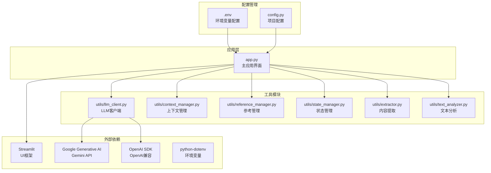

**图表来源**
- [app.py](file://app.py#L1-L690)
- [utils/llm_client.py](file://utils/llm_client.py#L1-L203)
- [config.py](file://config.py#L1-L24)

**章节来源**
- [app.py](file://app.py#L1-L690)
- [config.py](file://config.py#L1-L24)

## 核心组件

### SiliconFlow集成架构

项目中的SiliconFlow集成采用了统一的LLM客户端架构，支持多种模型提供商的无缝切换：

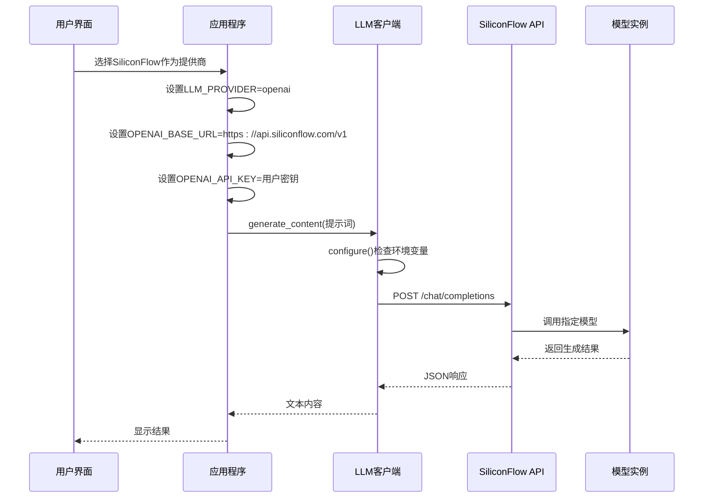

**图表来源**
- [app.py](file://app.py#L107-L152)
- [utils/llm_client.py](file://utils/llm_client.py#L29-L142)

### 模型选择与配置

SiliconFlow平台提供了丰富的开源模型选择，每个模型都有其特定的应用场景和优势：

| 模型名称 | 模型标识 | 主要特点 | 适用场景 |
|---------|----------|----------|----------|
| 智谱GLM-4.7 | zai-org/GLM-4.7 | 强大的中文对话能力 | 中文内容创作、对话场景 |
| 清华GLM-4 | THUDM/glm-4-9b-chat | 性能优异的中文模型 | 复杂中文任务、学术写作 |
| 通义千问2代 | Qwen/Qwen2-7B-Instruct | 阿里出品的高性能模型 | 多语言内容、技术文档 |
| Meta Llama3 | meta-llama/Meta-Llama-3-8B-Instruct | 最新Llama系列 | 英文内容、编程辅助 |
| 零一Yi系列 | 01-ai/Yi-1.5-9B-Chat | 开源精品模型 | 多语言对话、创意写作 |
| DeepSeek | deepseek-ai/deepseek-llm-67b-chat | 大参数量模型 | 复杂推理、数据分析 |

**章节来源**
- [app.py](file://app.py#L128-L152)
- [app.py](file://app.py#L144-L152)

## 架构概览

### 系统架构图

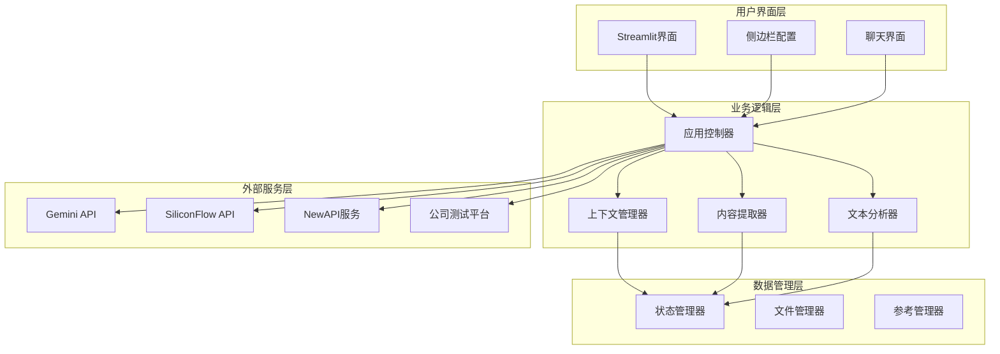

**图表来源**
- [app.py](file://app.py#L1-L690)
- [utils/context_manager.py](file://utils/context_manager.py#L1-L93)
- [utils/state_manager.py](file://utils/state_manager.py#L1-L77)

### 配置流程图

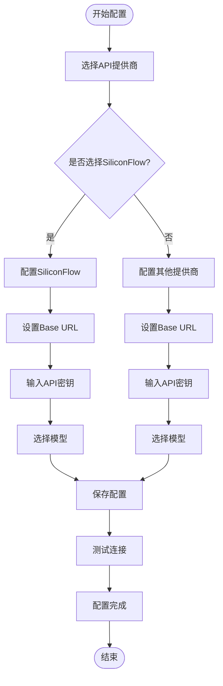

**图表来源**
- [app.py](file://app.py#L107-L152)
- [app.py](file://app.py#L198-L260)

## 详细组件分析

### LLM客户端组件

LLM客户端是整个系统的核心组件，负责统一管理不同提供商的API调用：

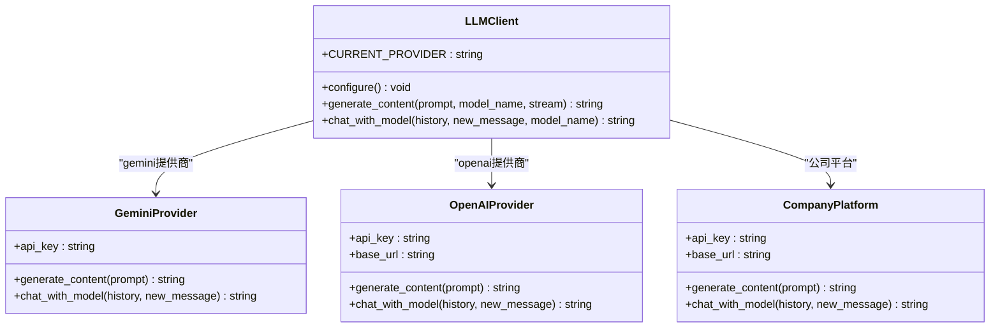

**图表来源**
- [utils/llm_client.py](file://utils/llm_client.py#L1-L203)

#### 配置管理机制

LLM客户端采用环境变量驱动的配置管理方式：

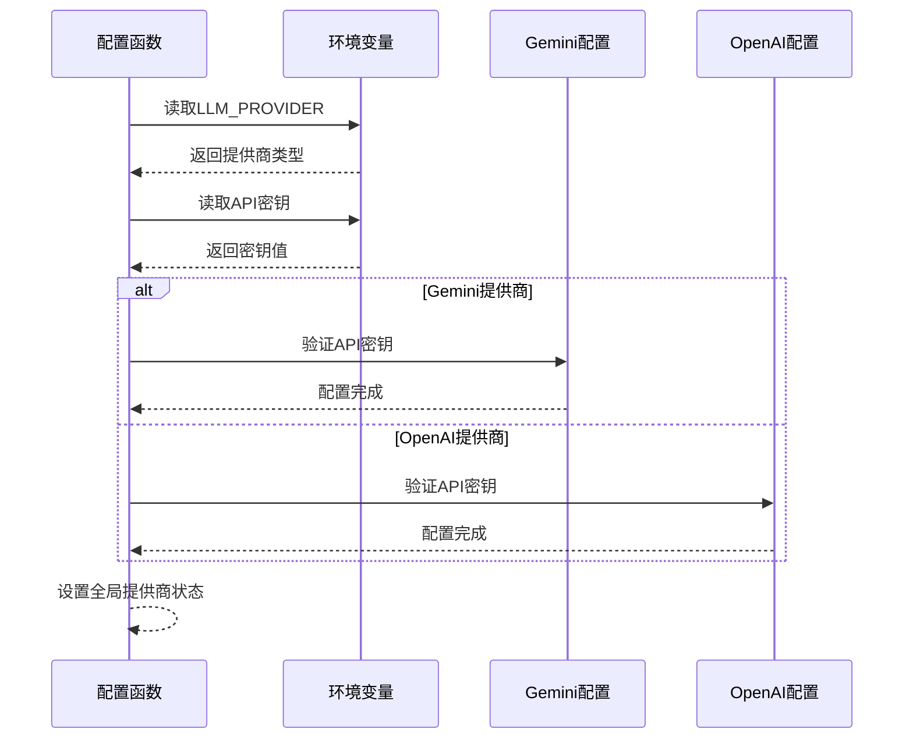

**图表来源**
- [utils/llm_client.py](file://utils/llm_client.py#L9-L28)

**章节来源**
- [utils/llm_client.py](file://utils/llm_client.py#L1-L203)

### SiliconFlow集成实现

#### API配置流程

SiliconFlow的集成实现了完整的API配置流程：

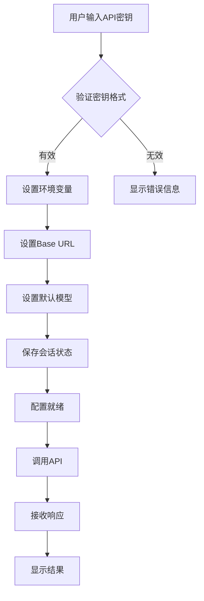

**图表来源**
- [app.py](file://app.py#L117-L124)
- [app.py](file://app.py#L113-L115)

#### 模型选择机制

SiliconFlow提供了多种开源模型供用户选择，每种模型都有其特定的优势：

| 模型系列 | 参数规模 | 适用场景 | 性能特点 |
|---------|----------|----------|----------|
| GLM系列 | 4.7B/9B | 中文对话、内容创作 | 中文能力强，推理能力优秀 |
| Qwen系列 | 7B | 多语言、技术文档 | 多语言支持好，知识丰富 |
| Llama系列 | 8B | 英文内容、编程辅助 | 开源生态完善，社区活跃 |
| Yi系列 | 9B | 创意写作、对话 | 开源精品，性价比高 |
| DeepSeek | 67B | 复杂推理、数据分析 | 参数量大，性能强劲 |

**章节来源**
- [app.py](file://app.py#L128-L152)

### 上下文管理组件

上下文管理器负责构建和维护AI对话所需的上下文信息：

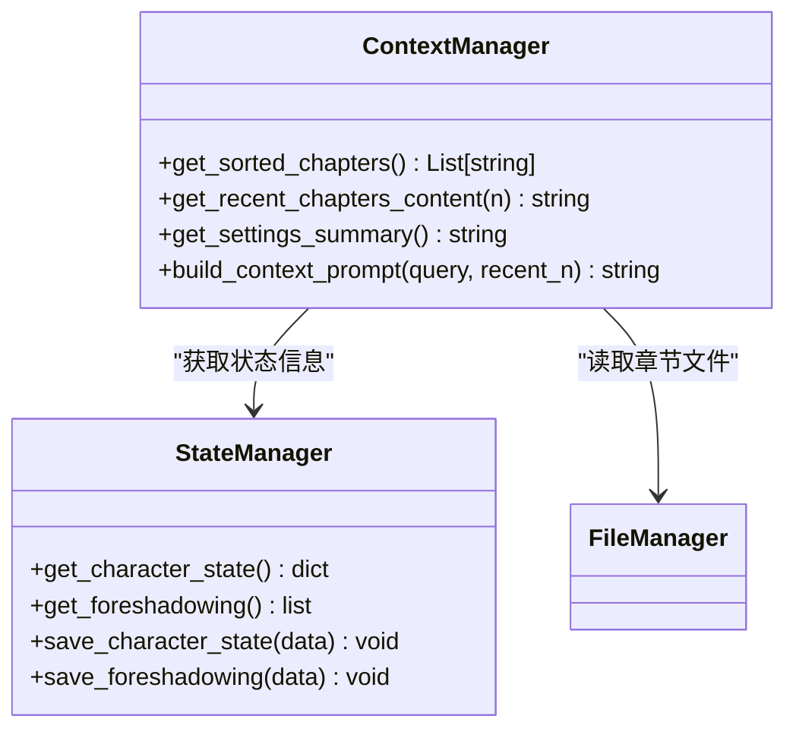

**图表来源**
- [utils/context_manager.py](file://utils/context_manager.py#L1-L93)
- [utils/state_manager.py](file://utils/state_manager.py#L1-L77)

**章节来源**
- [utils/context_manager.py](file://utils/context_manager.py#L1-L93)
- [utils/state_manager.py](file://utils/state_manager.py#L1-L77)

## 依赖关系分析

### 外部依赖管理

项目使用requirements.txt管理所有外部依赖：

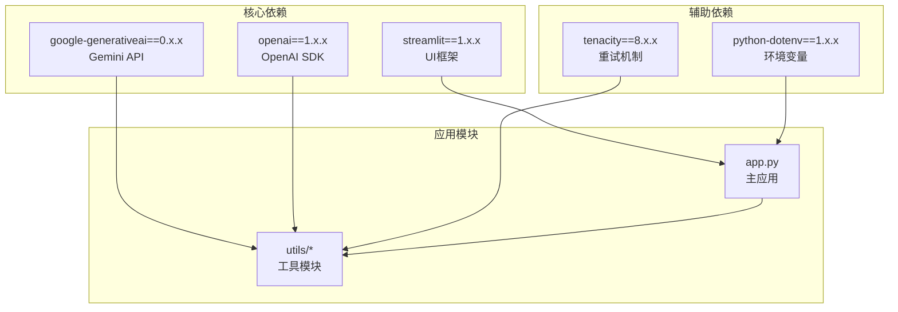

**图表来源**
- [requirements.txt](file://requirements.txt#L1-L6)

### 环境变量配置

项目使用.env文件管理敏感配置信息：

| 环境变量 | 默认值 | 用途 | 示例 |
|---------|--------|------|------|
| LLM_PROVIDER | gemini | 指定LLM提供商 | openai |
| GOOGLE_API_KEY | your_gemini_api_key_here | Gemini API密钥 | sk-... |
| GEMINI_MODEL_NAME | gemini-1.5-flash | 默认Gemini模型 | gemini-1.5-pro |
| OPENAI_BASE_URL | https://api.siliconflow.com/v1 | SiliconFlow API基础URL | https://api.newapi.ai/v1 |
| OPENAI_API_KEY | sk-... | OpenAI兼容API密钥 | sk-... |
| OPENAI_MODEL_NAME | zai-org/GLM-4.7 | 默认OpenAI兼容模型 | gpt-4 |

**章节来源**
- [.env](file://.env#L1-L16)

## 性能考虑

### API调用优化

系统在API调用方面采用了多项优化策略：

1. **超时配置**：所有API调用设置300秒超时时间，确保长时间处理不会阻塞
2. **重试机制**：使用tenacity库实现自动重试，最多重试3次
3. **流式处理**：支持流式响应处理，提高用户体验
4. **连接池**：OpenAI SDK自动管理连接池，减少连接开销

### 内存管理

对于大型文本处理，系统提供了流式处理模式：

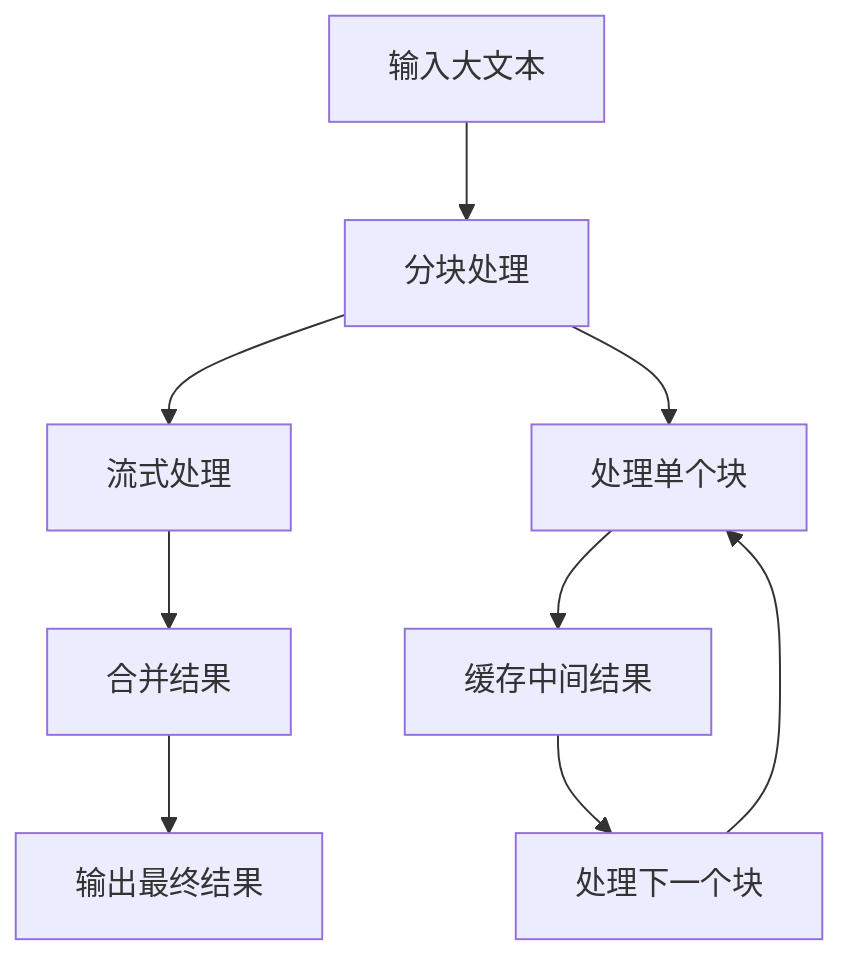

**图表来源**
- [utils/extractor.py](file://utils/extractor.py#L57-L74)

## 故障排除指南

### 常见问题诊断

#### API密钥问题

**问题症状**：
- "Google API Key is not set" 或 "OpenAI API Key is not set"
- API调用返回401或403错误

**解决方案**：
1. 检查.env文件中的API密钥配置
2. 确认密钥格式正确（SiliconFlow使用sk-开头）
3. 验证网络连接和防火墙设置

#### 模型选择问题

**问题症状**：
- 选择的模型无法使用
- 返回"model not found"错误

**解决方案**：
1. 确认选择的模型名称在SiliconFlow平台上可用
2. 检查模型配额和使用限制
3. 尝试使用其他兼容模型

#### 连接超时问题

**问题症状**：
- API调用超时
- 页面无响应

**解决方案**：
1. 检查网络连接稳定性
2. 增加超时时间设置
3. 尝试在非高峰时段使用

### 调试信息收集

系统提供了详细的错误日志输出：

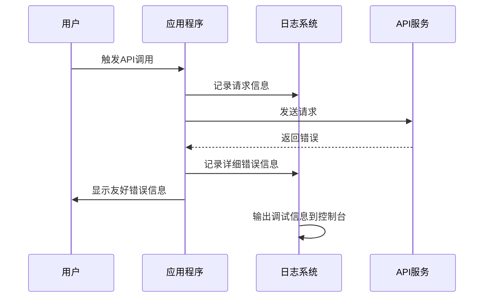

**图表来源**
- [utils/llm_client.py](file://utils/llm_client.py#L99-L113)
- [utils/llm_client.py](file://utils/llm_client.py#L128-L142)

**章节来源**
- [utils/llm_client.py](file://utils/llm_client.py#L99-L142)

## 结论

SiliconFlow集成为ZhenYaoYu创作引擎提供了强大的开源模型支持。通过统一的LLM客户端架构，用户可以轻松地在不同的模型提供商之间切换，享受SiliconFlow提供的多种高质量开源模型。

### 主要优势

1. **开源模型支持**：SiliconFlow提供多种开源模型，满足不同类型的创作需求
2. **成本效益**：相比专有模型服务，SiliconFlow提供了更具成本效益的解决方案
3. **中文优化**：多个中文模型专门针对中文内容进行了优化
4. **易用性**：通过Streamlit界面，用户可以直观地配置和使用

### 最佳实践建议

1. **模型选择**：根据具体应用场景选择合适的模型
2. **配置管理**：合理使用环境变量管理配置信息
3. **错误处理**：建立完善的错误处理和日志记录机制
4. **性能监控**：定期监控API使用情况和性能指标

通过本集成方案，用户可以充分利用SiliconFlow的开源模型优势，提升创作效率和质量。