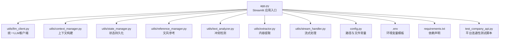
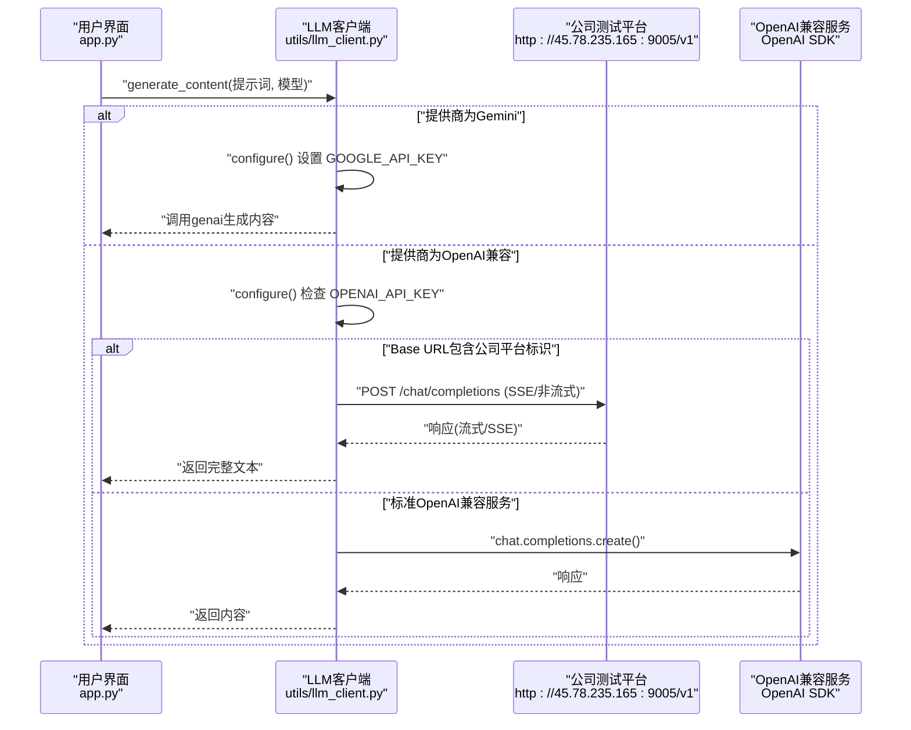
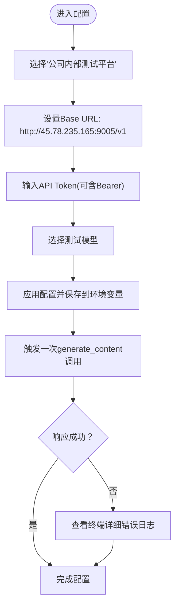
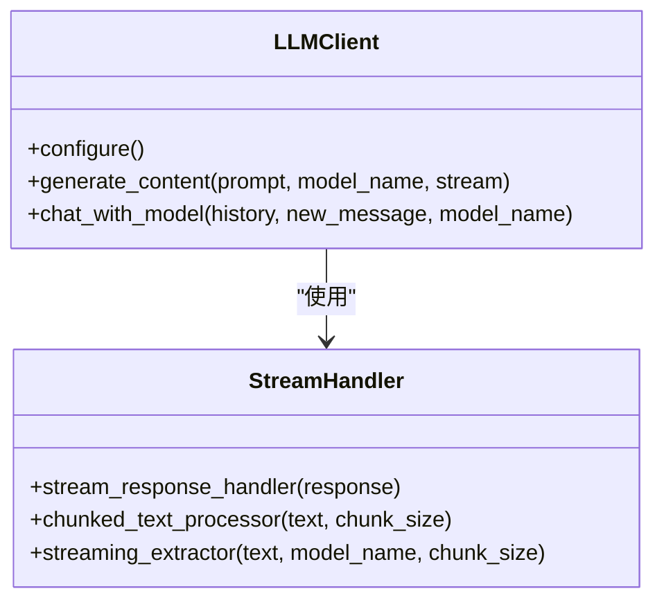
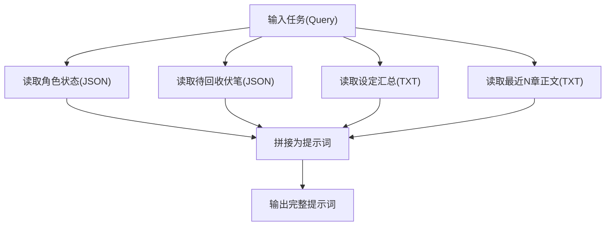
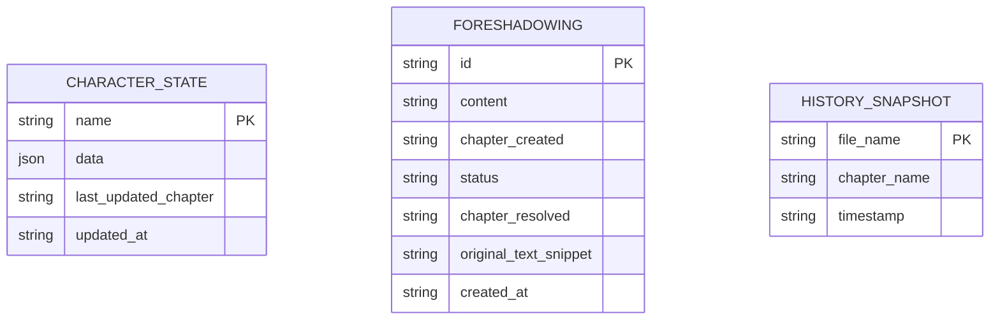
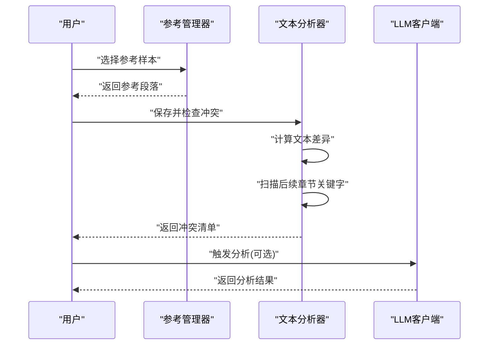
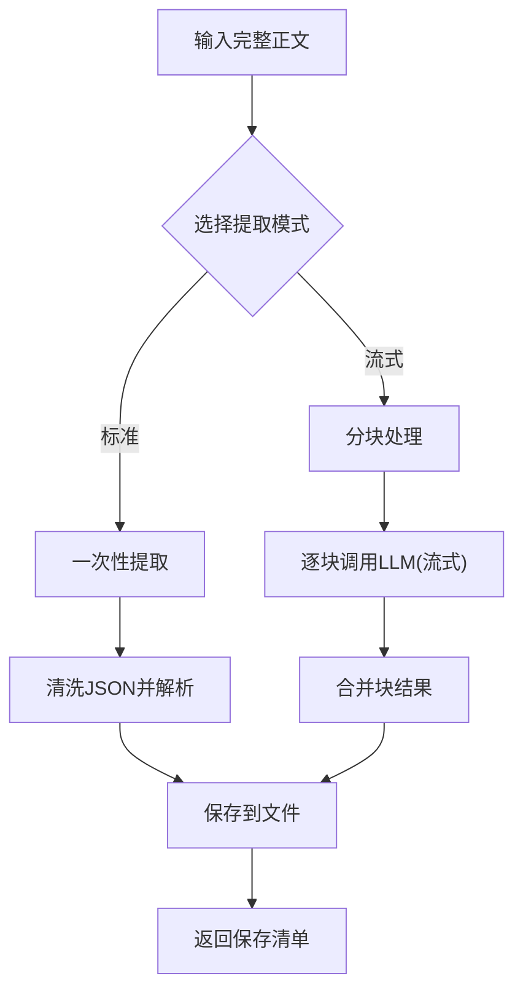
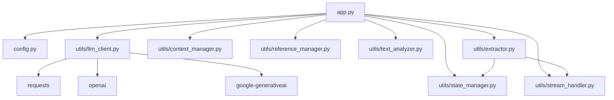

# 公司内部测试平台

<cite>
**本文引用的文件**
- [app.py](file://app.py)
- [config.py](file://config.py)
- [test_company_api.py](file://test_company_api.py)
- [requirements.txt](file://requirements.txt)
- [.env](file://.env)
- [utils/llm_client.py](file://utils/llm_client.py)
- [utils/stream_handler.py](file://utils/stream_handler.py)
- [utils/context_manager.py](file://utils/context_manager.py)
- [utils/state_manager.py](file://utils/state_manager.py)
- [utils/reference_manager.py](file://utils/reference_manager.py)
- [utils/text_analyzer.py](file://utils/text_analyzer.py)
- [utils/extractor.py](file://utils/extractor.py)
</cite>

## 目录
1. [简介](#简介)
2. [项目结构](#项目结构)
3. [核心组件](#核心组件)
4. [架构总览](#架构总览)
5. [详细组件分析](#详细组件分析)
6. [依赖关系分析](#依赖关系分析)
7. [性能考量](#性能考量)
8. [故障排除指南](#故障排除指南)
9. [结论](#结论)
10. [附录](#附录)

## 简介
本文件面向公司内部测试平台的集成与使用，重点说明如何在本项目中配置与使用公司内部的AI测试API服务。内容涵盖：
- 权限申请与认证配置（API Token、Base URL、模型选择）
- 与外部服务（如NewAPI、SiliconFlow、Gemini官方）的区别与适用场景
- 内网安全与稳定性保障等平台特点
- 完整配置示例与测试脚本使用方法
- 故障排除与调试技巧

## 项目结构
该项目采用功能模块化组织，围绕Streamlit应用入口进行功能编排，核心逻辑集中在utils子包中，便于复用与扩展。

图表来源
- [app.py](file://app.py#L1-L713)
- [utils/llm_client.py](file://utils/llm_client.py#L1-L203)
- [utils/context_manager.py](file://utils/context_manager.py#L1-L93)
- [utils/state_manager.py](file://utils/state_manager.py#L1-L77)
- [utils/reference_manager.py](file://utils/reference_manager.py#L1-L94)
- [utils/text_analyzer.py](file://utils/text_analyzer.py#L1-L63)
- [utils/extractor.py](file://utils/extractor.py#L1-L194)
- [utils/stream_handler.py](file://utils/stream_handler.py#L1-L114)
- [config.py](file://config.py#L1-L24)
- [.env](file://.env#L1-L16)
- [requirements.txt](file://requirements.txt#L1-L6)
- [test_company_api.py](file://test_company_api.py#L1-L25)

章节来源
- [app.py](file://app.py#L1-L713)
- [config.py](file://config.py#L1-L24)

## 核心组件
- Streamlit应用入口：提供侧边栏配置面板与多模式创作流程（初始化、探讨设定、探讨细纲、续写正文、改文与冲突提示）。
- LLM客户端：统一管理Gemini与OpenAI兼容接口，内置公司测试平台特例处理与流式响应支持。
- 上下文管理器：整合角色状态、伏笔、设定与近期章节，构建高质量提示词。
- 状态管理器：负责JSON文件的读写与快照，支撑冲突检测与历史追踪。
- 文风参考与文本分析：提供参考段落检索与章节间冲突扫描。
- 内容提取器：基于LLM进行全量/流式提取，产出角色状态、伏笔、设定与剧情回顾。
- 流式处理器：解析SSE流式响应，支持长文本实时增量输出。

章节来源
- [app.py](file://app.py#L1-L713)
- [utils/llm_client.py](file://utils/llm_client.py#L1-L203)
- [utils/context_manager.py](file://utils/context_manager.py#L1-L93)
- [utils/state_manager.py](file://utils/state_manager.py#L1-L77)
- [utils/reference_manager.py](file://utils/reference_manager.py#L1-L94)
- [utils/text_analyzer.py](file://utils/text_analyzer.py#L1-L63)
- [utils/extractor.py](file://utils/extractor.py#L1-L194)
- [utils/stream_handler.py](file://utils/stream_handler.py#L1-L114)

## 架构总览
下图展示应用与LLM客户端之间的交互关系，以及公司测试平台的特例分支。

图表来源
- [app.py](file://app.py#L456-L460)
- [utils/llm_client.py](file://utils/llm_client.py#L9-L142)

## 详细组件分析

### 公司内部测试平台配置与使用
- 选择服务商：在侧边栏选择“🏢 公司内部测试平台”，系统会自动设置Base URL与模型选项。
- Base URL：固定为 http://45.78.235.165:9005/v1，客户端会自动补齐/chat/completions端点。
- API Token：支持带Bearer前缀或不带前缀两种形式；系统会原样透传至请求头。
- 模型选择：提供gemini-3-flash-preview、deepseek-v3.2-251201-hs、gpt-3.5-turbo、gpt-4、claude-3-haiku等。
- 特殊处理：当检测到公司平台Base URL时，客户端通过requests直连，支持SSE流式输出与详细错误日志打印。

图表来源
- [app.py](file://app.py#L154-L196)
- [utils/llm_client.py](file://utils/llm_client.py#L52-L113)

章节来源
- [app.py](file://app.py#L154-L196)
- [utils/llm_client.py](file://utils/llm_client.py#L52-L113)

### LLM客户端设计与实现要点
- 统一入口：generate_content根据LLM_PROVIDER自动切换Gemini或OpenAI兼容路径。
- 兼容适配：OpenAI兼容模式下，若Base URL包含公司平台标识，则走requests直连；否则使用OpenAI SDK。
- 错误诊断：捕获异常并打印模型名、完整URL、API Key长度、错误类型与堆栈，便于快速定位问题。
- 流式支持：通过stream_handler解析SSE流，适用于长文本生成与实时输出。

图表来源
- [utils/llm_client.py](file://utils/llm_client.py#L9-L142)
- [utils/stream_handler.py](file://utils/stream_handler.py#L1-L114)

章节来源
- [utils/llm_client.py](file://utils/llm_client.py#L9-L142)
- [utils/stream_handler.py](file://utils/stream_handler.py#L1-L114)

### 上下文构建与提示词工程
- 上下文来源：角色状态、待回收伏笔、设定汇总、最近N章正文。
- 构建策略：按模块拼接，形成结构化提示词，确保模型具备充分背景信息。
- 使用场景：细纲探讨、正文续写、冲突检测分析等。

图表来源
- [utils/context_manager.py](file://utils/context_manager.py#L43-L92)

章节来源
- [utils/context_manager.py](file://utils/context_manager.py#L43-L92)

### 状态管理与历史快照
- 文件结构：角色状态与伏笔分别存储为独立JSON文件。
- 快照机制：章节保存后可创建状态快照，命名包含章节名与时间戳，便于回溯。
- 更新策略：新增伏笔与角色状态变更时，自动合并并持久化。

图表来源
- [utils/state_manager.py](file://utils/state_manager.py#L21-L76)

章节来源
- [utils/state_manager.py](file://utils/state_manager.py#L21-L76)

### 文风参考与冲突检测
- 文风参考：解析“大神素材样本.txt”，提取章节提示与关键词，支持在续写时作为文风参考。
- 冲突检测：对比编辑前后文本差异，扫描后续章节是否仍包含被删除的关键字，辅助避免显式冲突。

图表来源
- [utils/reference_manager.py](file://utils/reference_manager.py#L49-L93)
- [utils/text_analyzer.py](file://utils/text_analyzer.py#L39-L62)
- [app.py](file://app.py#L681-L712)

章节来源
- [utils/reference_manager.py](file://utils/reference_manager.py#L49-L93)
- [utils/text_analyzer.py](file://utils/text_analyzer.py#L39-L62)
- [app.py](file://app.py#L681-L712)

### 内容提取与流式处理
- 全量提取：一次性提交全文，返回角色状态、伏笔、设定与剧情回顾。
- 流式提取：将长文本分块，逐块调用模型并合并结果，降低内存占用。
- 结果保存：自动清洗JSON并写入对应文件，便于后续使用。

图表来源
- [utils/extractor.py](file://utils/extractor.py#L6-L193)
- [utils/stream_handler.py](file://utils/stream_handler.py#L58-L114)

章节来源
- [utils/extractor.py](file://utils/extractor.py#L6-L193)
- [utils/stream_handler.py](file://utils/stream_handler.py#L58-L114)

## 依赖关系分析
- 应用层依赖：app.py依赖utils各模块与config常量，负责UI与业务流程编排。
- 客户端依赖：llm_client依赖openai与google-generativeai，同时在公司平台分支使用requests。
- 工具链依赖：stream_handler依赖llm_client与json解析，extractor依赖llm_client与state_manager。
- 环境依赖：.env提供默认示例，requirements.txt声明运行所需包。

图表来源
- [app.py](file://app.py#L1-L11)
- [utils/llm_client.py](file://utils/llm_client.py#L1-L4)
- [requirements.txt](file://requirements.txt#L1-L6)

章节来源
- [app.py](file://app.py#L1-L11)
- [utils/llm_client.py](file://utils/llm_client.py#L1-L4)
- [requirements.txt](file://requirements.txt#L1-L6)

## 性能考量
- 流式处理：在长文本场景下，优先使用流式提取与流式响应，减少内存峰值与等待时间。
- 超时与重试：OpenAI SDK与requests均设置较长超时；llm_client对关键调用使用重试装饰器，提升稳定性。
- 模型选择：根据任务复杂度选择合适模型，避免不必要的高成本推理。
- 目录与文件：确保必要目录与文件存在，避免运行时IO开销。

## 故障排除指南
- 认证失败
  - 确认OPENAI_API_KEY或GOOGLE_API_KEY已正确设置。
  - 公司平台Token支持带Bearer前缀，系统会原样透传。
- 连接超时或不稳定
  - 检查网络与Base URL可达性。
  - 调整模型或降低分块大小，减少单次请求负载。
- 响应为空或错误
  - 查看终端打印的详细错误日志（包含模型名、完整URL、API Key长度、错误类型与堆栈）。
  - 对比.env与实际运行环境变量，确保一致。
- 流式输出异常
  - 确认平台支持SSE且未被代理/防火墙拦截。
  - 检查stream_handler对SSE数据帧的解析逻辑是否匹配平台实现。
- 环境变量与配置
  - 使用.test_company_api.py进行最小化验证，确认Base URL、Token与模型组合可用。
  - 参考.env中的注释示例，按需取消注释并填写真实值。

章节来源
- [utils/llm_client.py](file://utils/llm_client.py#L99-L113)
- [test_company_api.py](file://test_company_api.py#L1-L25)
- [.env](file://.env#L11-L15)

## 结论
本项目提供了完整的公司内部测试平台集成方案：通过统一的LLM客户端与Streamlit界面，用户可以便捷地切换不同服务商、配置API Token与模型，并在多种创作场景中获得稳定的AI支持。平台强调内网安全与可控性，结合详细的错误日志与流式处理能力，能够满足日常创作与内容提取的多样化需求。

## 附录

### 配置示例与使用步骤
- 在侧边栏选择“🏢 公司内部测试平台”，设置Base URL与API Token，选择模型并保存。
- 打开“初始化”页面，可一键创建目录结构与空白状态文件。
- 使用“全量状态提取”功能，选择标准或流式模式，触发AI分析并保存结果。
- 在“探讨细纲/续写正文/改文与冲突提示”中，结合上下文与状态文件进行创作。

章节来源
- [app.py](file://app.py#L309-L418)
- [app.py](file://app.py#L500-L538)
- [app.py](file://app.py#L540-L620)
- [app.py](file://app.py#L622-L712)

### 测试脚本使用方法
- 使用test_company_api.py进行最小化连通性测试，验证Base URL、模型与Token组合是否正确。
- 若测试失败，依据终端打印的详细错误信息进行排查。

章节来源
- [test_company_api.py](file://test_company_api.py#L1-L25)