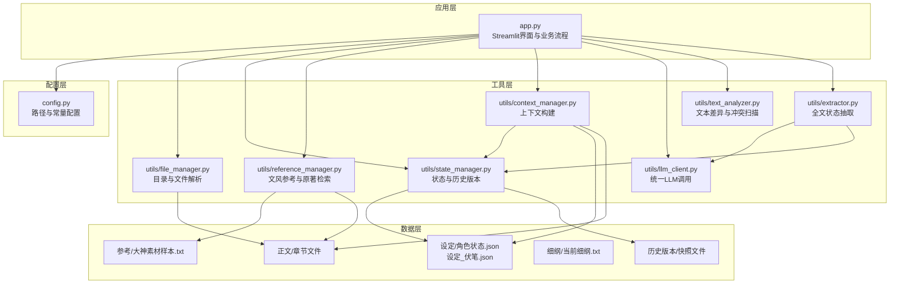
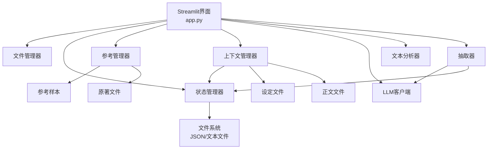
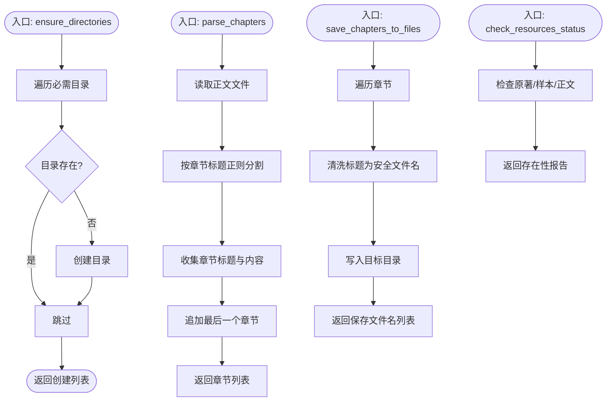
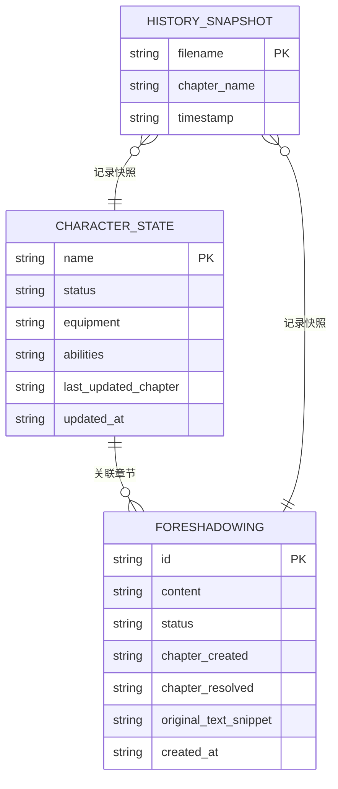
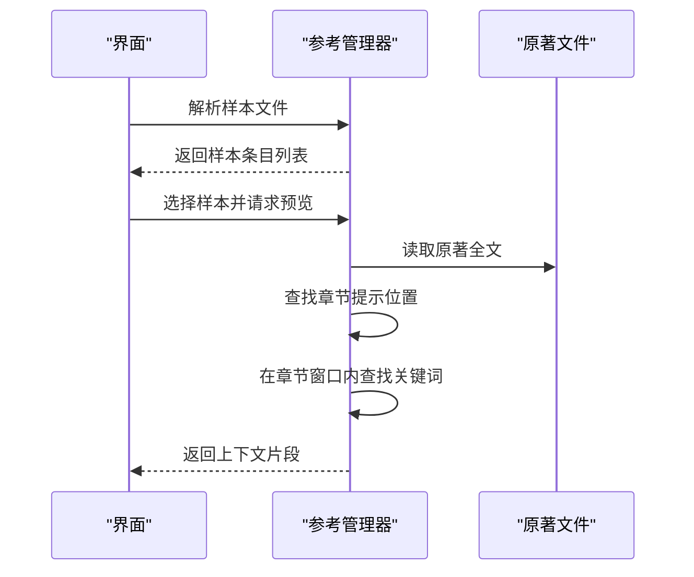
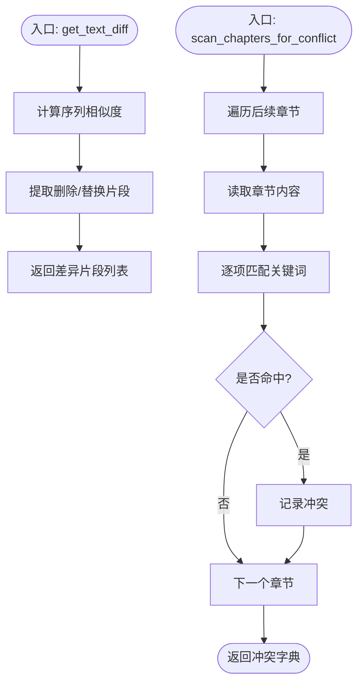
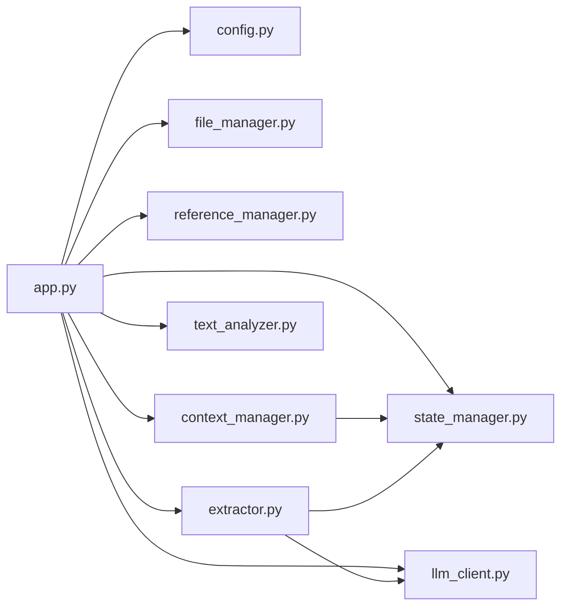

# 内容管理系统

<cite>
**本文档引用的文件**
- [app.py](file://app.py)
- [config.py](file://config.py)
- [requirements.txt](file://requirements.txt)
- [utils/context_manager.py](file://utils/context_manager.py)
- [utils/file_manager.py](file://utils/file_manager.py)
- [utils/state_manager.py](file://utils/state_manager.py)
- [utils/reference_manager.py](file://utils/reference_manager.py)
- [utils/llm_client.py](file://utils/llm_client.py)
- [utils/text_analyzer.py](file://utils/text_analyzer.py)
- [utils/extractor.py](file://utils/extractor.py)
- [参考/大神素材样本.txt](file://参考/大神素材样本.txt)
- [设定/设定_角色状态.json](file://设定/设定_角色状态.json)
- [设定/设定_伏笔.json](file://设定/设定_伏笔.json)
</cite>

## 目录
1. [简介](#简介)
2. [项目结构](#项目结构)
3. [核心组件](#核心组件)
4. [架构总览](#架构总览)
5. [详细组件分析](#详细组件分析)
6. [依赖关系分析](#依赖关系分析)
7. [性能考虑](#性能考虑)
8. [故障排除指南](#故障排除指南)
9. [结论](#结论)
10. [附录](#附录)

## 简介
本系统是一个基于 Streamlit 的内容管理系统，专为网络小说创作提供智能化支持。系统围绕“正文管理、状态跟踪、文风参考、AI辅助”四大核心能力构建，提供从初始化、设定探讨、细纲制定到正文续写与冲突检测的全流程创作体验。系统采用模块化设计，通过统一的配置中心管理目录结构与文件路径，通过状态管理器维护角色状态与伏笔列表，并通过参考管理器提供文风样本与原著定位检索。

## 项目结构
项目采用按功能域划分的模块化组织方式：
- 应用入口与界面逻辑：app.py
- 配置中心：config.py
- 工具模块：utils/（文件管理、状态管理、参考管理、LLM客户端、文本分析、上下文管理、抽取器）
- 数据与资源：参考/、设定/、正文/、细纲/、历史版本/
- 依赖声明：requirements.txt

图表来源
- [app.py](file://app.py#L1-L690)
- [config.py](file://config.py#L1-L24)
- [utils/file_manager.py](file://utils/file_manager.py#L1-L108)
- [utils/state_manager.py](file://utils/state_manager.py#L1-L77)
- [utils/reference_manager.py](file://utils/reference_manager.py#L1-L94)
- [utils/context_manager.py](file://utils/context_manager.py#L1-L93)
- [utils/llm_client.py](file://utils/llm_client.py#L1-L192)
- [utils/text_analyzer.py](file://utils/text_analyzer.py#L1-L63)
- [utils/extractor.py](file://utils/extractor.py#L1-L106)

章节来源
- [app.py](file://app.py#L1-L690)
- [config.py](file://config.py#L1-L24)

## 核心组件
- 文件管理器：负责目录结构确保、正文章节解析与保存、资源状态检查。
- 状态管理器：负责角色状态与伏笔列表的读写、历史版本快照创建。
- 参考管理器：负责文风样本解析、原著章节与关键词检索。
- 上下文管理器：负责构建AI提示所需的上下文（角色状态、伏笔、设定、近期正文）。
- LLM客户端：统一适配Gemini与OpenAI兼容服务，提供内容生成与聊天接口。
- 文本分析器：负责章节差异检测与后续章节冲突扫描。
- 抽取器：基于LLM对全文进行状态抽取并保存到相应文件。

章节来源
- [utils/file_manager.py](file://utils/file_manager.py#L1-L108)
- [utils/state_manager.py](file://utils/state_manager.py#L1-L77)
- [utils/reference_manager.py](file://utils/reference_manager.py#L1-L94)
- [utils/context_manager.py](file://utils/context_manager.py#L1-L93)
- [utils/llm_client.py](file://utils/llm_client.py#L1-L192)
- [utils/text_analyzer.py](file://utils/text_analyzer.py#L1-L63)
- [utils/extractor.py](file://utils/extractor.py#L1-L106)

## 架构总览
系统采用“界面层-工具层-数据层”三层架构：
- 界面层：Streamlit页面与交互控件，负责用户输入与结果展示。
- 工具层：各功能模块封装业务逻辑，提供统一接口。
- 数据层：本地文件系统存储正文、设定、状态、历史版本与参考样本。

图表来源
- [app.py](file://app.py#L1-L690)
- [utils/state_manager.py](file://utils/state_manager.py#L1-L77)
- [utils/reference_manager.py](file://utils/reference_manager.py#L1-L94)
- [utils/context_manager.py](file://utils/context_manager.py#L1-L93)
- [utils/extractor.py](file://utils/extractor.py#L1-L106)

## 详细组件分析

### 文件管理器（文件与目录结构管理）
职责
- 确保必需目录存在（参考、设定、正文、细纲、历史版本）。
- 解析单文件正文为章节集合（支持标题模式匹配与内容分割）。
- 将解析后的章节保存为独立文本文件，文件名安全化处理。
- 检查关键资源文件是否存在（原著、样本、正文）。

设计要点
- 目录创建采用遍历配置中心的必需目录列表，保证一致性。
- 章节解析使用正则表达式匹配标题模式，支持章节标题清洗与内容拼接。
- 文件保存时对标题进行非法字符过滤，确保跨平台兼容。
- 资源状态检查用于引导用户准备必要素材。

图表来源
- [utils/file_manager.py](file://utils/file_manager.py#L1-L108)

章节来源
- [utils/file_manager.py](file://utils/file_manager.py#L1-L108)
- [config.py](file://config.py#L1-L24)

### 状态管理器（JSON格式与历史版本）
职责
- 读写角色状态与伏笔列表（JSON格式）。
- 创建历史版本快照（复制当前状态文件到历史目录，带时间戳）。
- 添加新伏笔（生成唯一ID、记录创建章节与时间）。
- 更新角色状态（合并字段、记录最后更新章节与时间）。

JSON格式设计
- 角色状态：键为角色名，值为包含状态、装备、能力等字段的对象。
- 伏笔列表：数组元素包含内容、状态、创建章节、唯一ID、创建时间等字段。
- 历史版本：以“章节名_时间戳”命名，分别保存伏笔与角色状态。

历史版本控制策略
- 每次章节保存或状态更新后触发快照创建。
- 历史文件命名规范明确，便于检索与回溯。
- 快照文件与当前状态文件分离，避免覆盖风险。

图表来源
- [utils/state_manager.py](file://utils/state_manager.py#L1-L77)

章节来源
- [utils/state_manager.py](file://utils/state_manager.py#L1-L77)
- [config.py](file://config.py#L1-L24)

### 参考管理器（文风参考与原著检索）
职责
- 解析“大神素材样本.txt”，提取章节提示与关键词指引。
- 在原著文件中定位关键词所在段落，返回上下文片段。

文风参考建立
- 样本文件采用固定格式，包含“出自哪一章”与“关键词”指引。
- 系统解析后生成可选项供用户选择，支持预览参考段落。

原著文件处理流程
- 通过章节提示在原著中定位章节范围，限制搜索窗口。
- 在章节范围内查找关键词，返回前后若干字符的上下文。
- 对大文件场景提供搜索窗口限制，避免全文件扫描带来的性能问题。

图表来源
- [utils/reference_manager.py](file://utils/reference_manager.py#L1-L94)
- [参考/大神素材样本.txt](file://参考/大神素材样本.txt#L1-L614)

章节来源
- [utils/reference_manager.py](file://utils/reference_manager.py#L1-L94)
- [参考/大神素材样本.txt](file://参考/大神素材样本.txt#L1-L614)

### 上下文管理器（提示构建与状态整合）
职责
- 获取最近N章正文内容，作为故事上下文。
- 汇总所有设定文件，形成设定背景。
- 融合角色状态、待回收伏笔、设定与近期正文，构建完整提示。

提示构建策略
- 优先读取当前活跃伏笔（status为pending），突出待处理线索。
- 将设定文件内容与正文片段组合，形成多维度上下文。
- 通过统一的提示模板，确保LLM理解任务与背景。

章节来源
- [utils/context_manager.py](file://utils/context_manager.py#L1-L93)
- [utils/state_manager.py](file://utils/state_manager.py#L1-L77)

### LLM客户端（统一模型适配）
职责
- 统一配置Gemini与OpenAI兼容服务，支持多提供商切换。
- 提供一次性生成与聊天两种接口，适配不同工作流。
- 对公司内部测试平台进行特殊处理（动态端点与头部构造）。

错误处理与重试
- 对OpenAI兼容接口使用指数退避重试，提升稳定性。
- 输出详细的错误日志（模型名、URL、Key长度、异常类型与堆栈）。

章节来源
- [utils/llm_client.py](file://utils/llm_client.py#L1-L192)

### 文本分析器（差异检测与冲突扫描）
职责
- 计算旧文本与新文本的差异，返回被删除/替换的片段。
- 在后续章节中扫描这些关键词，检测潜在冲突。

算法流程
- 使用序列相似度计算，识别删除与替换片段。
- 对后续章节进行关键词匹配，返回冲突清单。

图表来源
- [utils/text_analyzer.py](file://utils/text_analyzer.py#L1-L63)

章节来源
- [utils/text_analyzer.py](file://utils/text_analyzer.py#L1-L63)

### 抽取器（全文状态抽取）
职责
- 基于LLM对全文进行综合抽取，生成角色状态、伏笔列表、设定总结与剧情回顾。
- 将抽取结果保存到对应文件，自动补全ID与时间戳。

章节来源
- [utils/extractor.py](file://utils/extractor.py#L1-L106)
- [utils/llm_client.py](file://utils/llm_client.py#L1-L192)

## 依赖关系分析
- 应用层依赖配置中心与各工具模块。
- 工具模块之间存在清晰的单向依赖：上下文管理器依赖状态管理器与设定文件；抽取器依赖LLM客户端与状态管理器。
- 数据层通过文件系统耦合，状态管理器与历史版本目录形成闭环。

图表来源
- [app.py](file://app.py#L1-L690)
- [config.py](file://config.py#L1-L24)
- [utils/context_manager.py](file://utils/context_manager.py#L1-L93)
- [utils/extractor.py](file://utils/extractor.py#L1-L106)

章节来源
- [app.py](file://app.py#L1-L690)
- [config.py](file://config.py#L1-L24)

## 性能考虑
- 文件解析与保存：章节解析采用正则分割，建议在大文件场景下限制标题格式一致性，减少回溯成本。
- 历史版本：快照复制操作在频繁保存时可能带来IO压力，建议定期清理过期快照或采用增量备份策略。
- 原著检索：对大文件采用窗口限制搜索，避免全文件扫描；可引入章节偏移缓存以进一步优化。
- LLM调用：统一重试机制与超时设置，合理控制提示长度，避免超出上下文限制。
- 文本分析：差异检测与冲突扫描为O(N*M)复杂度，建议对关键词列表进行去重与长度过滤。

## 故障排除指南
常见问题与解决建议
- API密钥未配置：检查环境变量（GOOGLE_API_KEY或OPENAI_API_KEY），并在界面中正确填写。
- 目录缺失：使用“创建/修复目录结构”按钮，确保参考、设定、正文、细纲、历史版本目录存在。
- 正文解析失败：确认单文件正文使用“[第x章 标题]”格式，且章节标题前后无多余空格。
- 原著检索不到：检查原著文件是否存在，章节提示与关键词是否匹配。
- LLM调用异常：查看终端输出的详细错误日志，核对模型名、Base URL与Token有效性。
- 冲突检测无结果：确认删除/修改的关键词长度大于等于2，且后续章节确实包含该关键词。

章节来源
- [app.py](file://app.py#L1-L690)
- [utils/llm_client.py](file://utils/llm_client.py#L1-L192)
- [utils/reference_manager.py](file://utils/reference_manager.py#L1-L94)

## 结论
本系统通过模块化设计实现了从文件管理、状态跟踪到文风参考与AI辅助的完整创作链路。配置中心统一管理路径与常量，工具模块职责清晰，数据层以JSON与文本文件为主，具备良好的可维护性与扩展性。建议在后续迭代中引入更完善的错误监控、历史版本压缩与缓存机制，以进一步提升性能与用户体验。

## 附录

### 配置管理最佳实践
- 使用环境变量管理API密钥与模型名，避免硬编码。
- 通过配置中心集中管理目录与文件路径，确保跨平台兼容。
- 为不同提供商提供默认模型与Base URL，减少用户配置负担。

### 文件命名规范
- 章节文件名采用“第x章 标题.txt”，确保排序与可读性。
- 历史版本文件名采用“类型_章节名_时间戳.json”，便于检索。
- 设定文件采用“设定_类别.txt”或“设定_类别.json”，语义明确。

### 备份与恢复机制
- 历史版本目录用于快照备份，建议定期清理过期快照。
- 关键状态文件（角色状态、伏笔列表）应保持JSON格式，便于版本对比与合并。

### 扩展开发指南
- 新增工具模块时，遵循单一职责原则，尽量减少跨模块依赖。
- 对外部接口（LLM、文件系统）进行抽象，便于替换与测试。
- 为关键流程添加单元测试与集成测试，确保稳定性。

### API使用示例（路径引用）
- 初始化与目录创建：[app.py](file://app.py#L315-L320)
- 全量状态提取：[app.py](file://app.py#L344-L380)
- 续写正文与文风参考：[app.py](file://app.py#L553-L596)
- 冲突检测与状态更新：[app.py](file://app.py#L658-L689)
- 文件解析与保存：[utils/file_manager.py](file://utils/file_manager.py#L16-L99)
- 状态读写与快照：[utils/state_manager.py](file://utils/state_manager.py#L21-L49)
- 参考样本解析与原著检索：[utils/reference_manager.py](file://utils/reference_manager.py#L5-L93)
- 上下文构建：[utils/context_manager.py](file://utils/context_manager.py#L43-L92)
- LLM调用与聊天：[utils/llm_client.py](file://utils/llm_client.py#L29-L131)
- 文本差异与冲突扫描：[utils/text_analyzer.py](file://utils/text_analyzer.py#L7-L62)
- 全文状态抽取：[utils/extractor.py](file://utils/extractor.py#L6-L105)