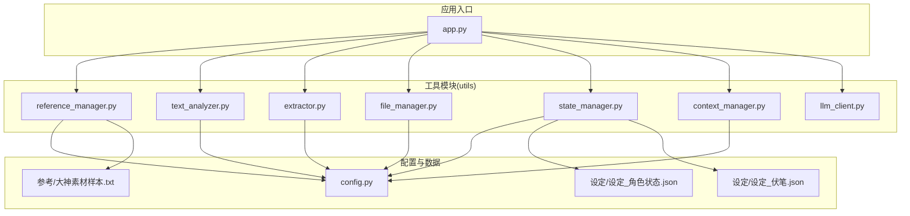
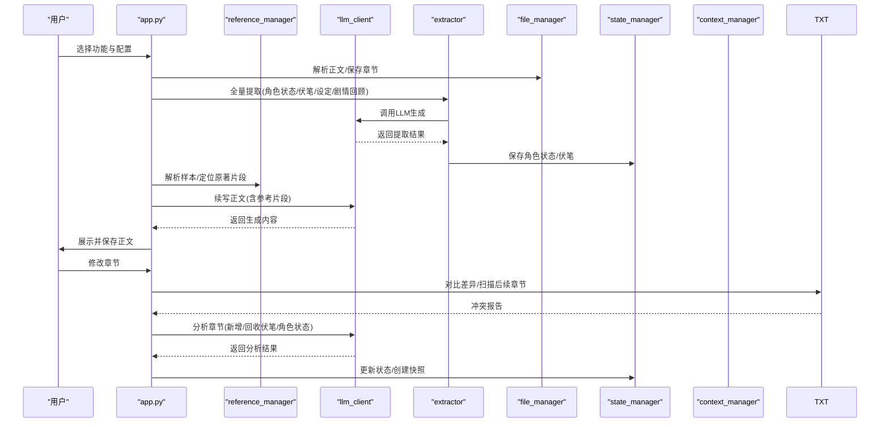
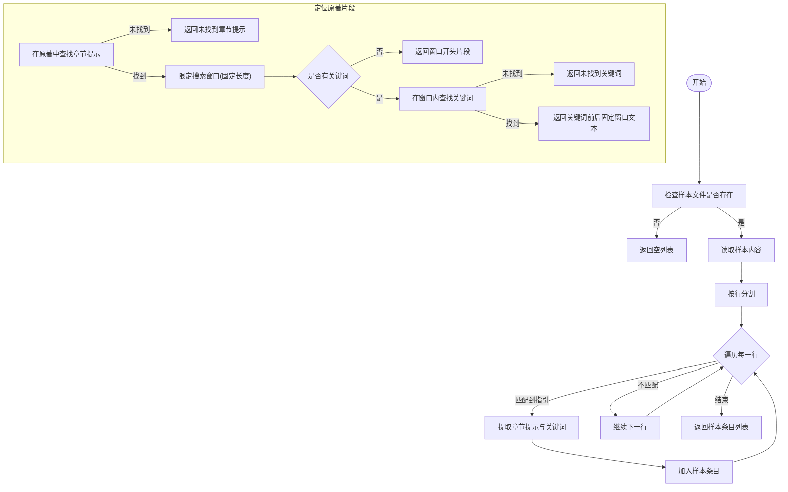
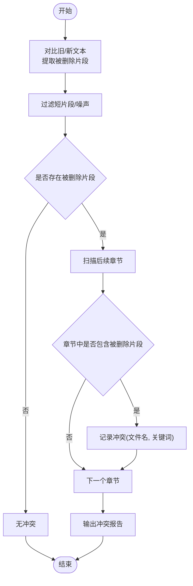
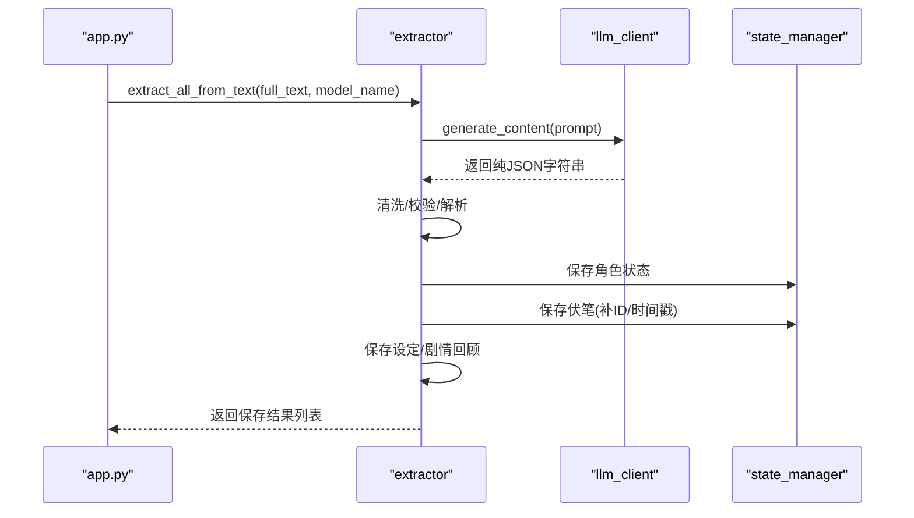
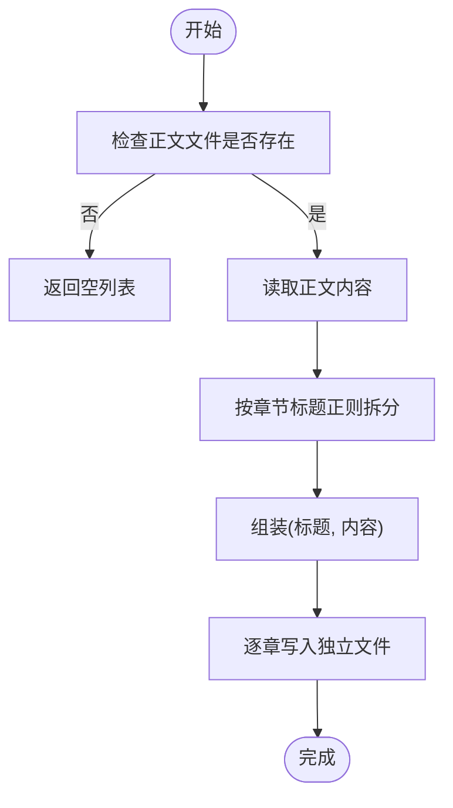
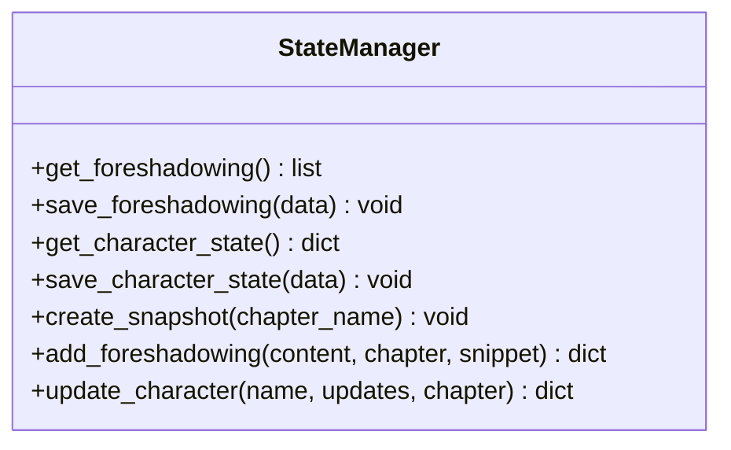
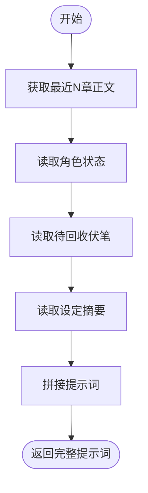
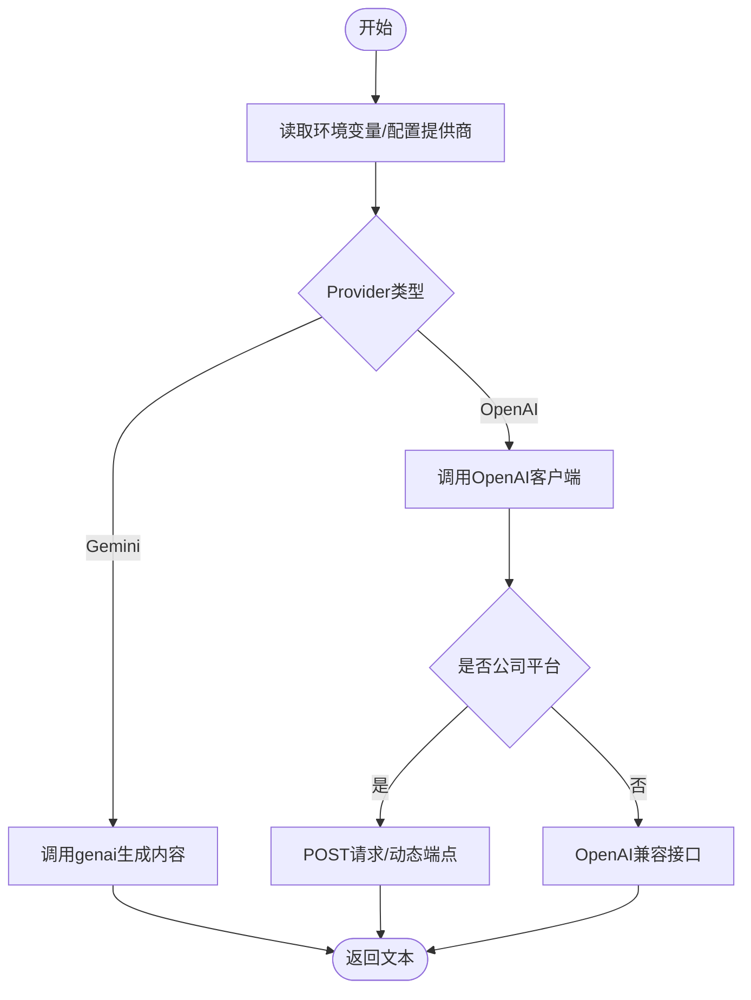
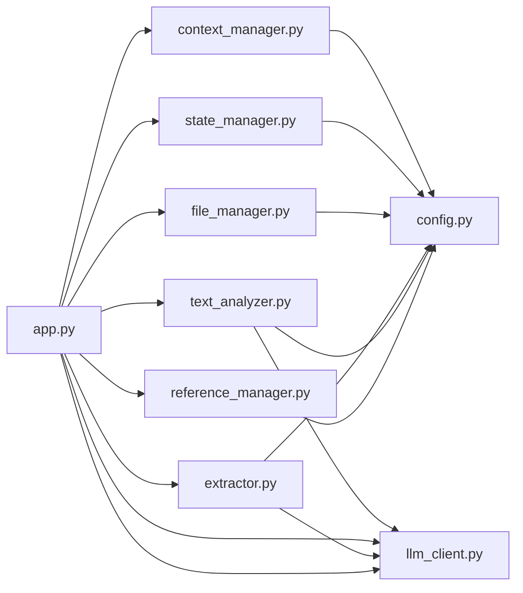

# 参考管理器

<cite>
**本文档引用的文件**
- [app.py](file://app.py)
- [config.py](file://config.py)
- [utils/reference_manager.py](file://utils/reference_manager.py)
- [utils/text_analyzer.py](file://utils/text_analyzer.py)
- [utils/extractor.py](file://utils/extractor.py)
- [utils/file_manager.py](file://utils/file_manager.py)
- [utils/state_manager.py](file://utils/state_manager.py)
- [utils/context_manager.py](file://utils/context_manager.py)
- [utils/llm_client.py](file://utils/llm_client.py)
- [requirements.txt](file://requirements.txt)
- [参考/大神素材样本.txt](file://参考/大神素材样本.txt)
- [设定/设定_角色状态.json](file://设定/设定_角色状态.json)
- [设定/设定_伏笔.json](file://设定/设定_伏笔.json)
</cite>

## 目录
1. [简介](#简介)
2. [项目结构](#项目结构)
3. [核心组件](#核心组件)
4. [架构总览](#架构总览)
5. [详细组件分析](#详细组件分析)
6. [依赖关系分析](#依赖关系分析)
7. [性能考量](#性能考量)
8. [故障排查指南](#故障排查指南)
9. [结论](#结论)
10. [附录](#附录)

## 简介
本项目围绕“参考管理器”构建，目标是支撑网文创作中的文风参考与素材管理。系统提供以下能力：
- 文风参考建立流程：参考素材收集、文本预处理、特征提取与相似度计算
- 素材样本管理：样本分类、标签系统、检索优化策略
- 原著文件处理：格式识别、内容解析、结构化存储
- 参考数据组织：引用关系管理、相似度计算、权重分配机制
- 质量评估与维护：质量评估标准、更新策略、维护方法
- 使用示例、配置选项、扩展开发指南
- 与上下文、状态、LLM等模块的集成与数据流转

## 项目结构
项目采用模块化设计，核心逻辑集中在 utils 子包，应用入口为 app.py，配置集中于 config.py，参考素材与状态文件位于参考、设定、正文、细纲等目录。

图表来源
- [app.py](file://app.py#L1-L690)
- [config.py](file://config.py#L1-L24)
- [utils/reference_manager.py](file://utils/reference_manager.py#L1-L94)
- [utils/text_analyzer.py](file://utils/text_analyzer.py#L1-L63)
- [utils/extractor.py](file://utils/extractor.py#L1-L106)
- [utils/file_manager.py](file://utils/file_manager.py#L1-L108)
- [utils/state_manager.py](file://utils/state_manager.py#L1-L77)
- [utils/context_manager.py](file://utils/context_manager.py#L1-L93)
- [utils/llm_client.py](file://utils/llm_client.py#L1-L202)
- [参考/大神素材样本.txt](file://参考/大神素材样本.txt#L1-L614)
- [设定/设定_角色状态.json](file://设定/设定_角色状态.json#L1-L17)
- [设定/设定_伏笔.json](file://设定/设定_伏笔.json#L1-L23)

章节来源
- [app.py](file://app.py#L1-L690)
- [config.py](file://config.py#L1-L24)

## 核心组件
- 参考管理器：负责解析“大神素材样本”、定位原著片段、返回上下文片段
- 文本分析器：对比旧/新文本差异，扫描后续章节是否存在被删除/修改的关键字
- 提取器：调用LLM从全文提取角色状态、伏笔、设定、剧情回顾，并持久化
- 文件管理器：解析单文件正文为章节、保存章节到独立文件
- 状态管理器：读写角色状态与伏笔列表，支持快照与增量更新
- 上下文管理器：聚合最近章节、角色状态、待回收伏笔、设定摘要，构建LLM提示词
- LLM 客户端：统一配置与调用 Gemini/OpenAI 兼容接口，支持重试与错误日志

章节来源
- [utils/reference_manager.py](file://utils/reference_manager.py#L1-L94)
- [utils/text_analyzer.py](file://utils/text_analyzer.py#L1-L63)
- [utils/extractor.py](file://utils/extractor.py#L1-L106)
- [utils/file_manager.py](file://utils/file_manager.py#L1-L108)
- [utils/state_manager.py](file://utils/state_manager.py#L1-L77)
- [utils/context_manager.py](file://utils/context_manager.py#L1-L93)
- [utils/llm_client.py](file://utils/llm_client.py#L1-L202)

## 架构总览
参考管理器在应用层通过 Streamlit 提供交互界面，核心流程如下：
- 初始化阶段：创建目录、生成空状态文件、导入正文、全量提取
- 文风参考：选择样本，定位原著片段，作为续写正文的文风参考
- 续写正文：结合细纲与参考片段生成正文，支持保存到正文目录
- 改文与冲突提示：对比修改前后文本，扫描后续章节潜在冲突
- 状态与伏笔更新：基于LLM分析章节内容，更新角色状态与伏笔

图表来源
- [app.py](file://app.py#L309-L690)
- [utils/reference_manager.py](file://utils/reference_manager.py#L1-L94)
- [utils/extractor.py](file://utils/extractor.py#L1-L106)
- [utils/file_manager.py](file://utils/file_manager.py#L1-L108)
- [utils/state_manager.py](file://utils/state_manager.py#L1-L77)
- [utils/context_manager.py](file://utils/context_manager.py#L1-L93)
- [utils/llm_client.py](file://utils/llm_client.py#L1-L202)

## 详细组件分析

### 参考管理器（文风参考）
职责与流程
- 解析“大神素材样本”：从样本文件中抽取“出自哪一章”与“搜索关键词”，形成样本条目
- 定位原著片段：在原著文件中根据章节提示与关键词定位上下文片段，返回固定窗口的文本

图表来源
- [utils/reference_manager.py](file://utils/reference_manager.py#L5-L47)
- [utils/reference_manager.py](file://utils/reference_manager.py#L49-L94)

章节来源
- [utils/reference_manager.py](file://utils/reference_manager.py#L1-L94)
- [参考/大神素材样本.txt](file://参考/大神素材样本.txt#L1-L614)

### 文本分析器（冲突检测）
职责与流程
- 文本差异对比：基于序列相似度，提取被删除/替换的片段
- 后续章节扫描：对后续章节逐个扫描，匹配被删除/修改的关键字，输出冲突清单

图表来源
- [utils/text_analyzer.py](file://utils/text_analyzer.py#L7-L37)
- [utils/text_analyzer.py](file://utils/text_analyzer.py#L39-L63)

章节来源
- [utils/text_analyzer.py](file://utils/text_analyzer.py#L1-L63)

### 提取器（AI 全量提取）
职责与流程
- 构造提示词：从全文提取角色状态、伏笔、设定、剧情回顾
- 调用 LLM：生成纯 JSON 字符串，清洗与校验后解析
- 保存结果：分别写入角色状态、伏笔、设定、剧情回顾文件

图表来源
- [utils/extractor.py](file://utils/extractor.py#L6-L56)
- [utils/extractor.py](file://utils/extractor.py#L57-L106)
- [utils/state_manager.py](file://utils/state_manager.py#L17-L31)

章节来源
- [utils/extractor.py](file://utils/extractor.py#L1-L106)
- [utils/state_manager.py](file://utils/state_manager.py#L1-L77)

### 文件管理器（正文拆分与保存）
职责与流程
- 解析正文：按章节标题模式拆分为章节元组
- 保存章节：将每个章节写入独立文件，文件名安全化

图表来源
- [utils/file_manager.py](file://utils/file_manager.py#L16-L80)
- [utils/file_manager.py](file://utils/file_manager.py#L82-L99)

章节来源
- [utils/file_manager.py](file://utils/file_manager.py#L1-L108)

### 状态管理器（角色状态与伏笔）
职责与流程
- 读写 JSON：封装加载/保存函数
- 快照：章节完成后复制当前状态文件到历史目录
- 增量更新：添加新伏笔、更新角色状态字段

图表来源
- [utils/state_manager.py](file://utils/state_manager.py#L1-L77)

章节来源
- [utils/state_manager.py](file://utils/state_manager.py#L1-L77)
- [设定/设定_角色状态.json](file://设定/设定_角色状态.json#L1-L17)
- [设定/设定_伏笔.json](file://设定/设定_伏笔.json#L1-L23)

### 上下文管理器（提示词构建）
职责与流程
- 获取最近章节：按编号排序读取正文章节
- 聚合设定：读取所有设定文件
- 构建提示词：拼接角色状态、待回收伏笔、最近剧情、任务描述

图表来源
- [utils/context_manager.py](file://utils/context_manager.py#L6-L20)
- [utils/context_manager.py](file://utils/context_manager.py#L22-L32)
- [utils/context_manager.py](file://utils/context_manager.py#L34-L41)
- [utils/context_manager.py](file://utils/context_manager.py#L43-L92)

章节来源
- [utils/context_manager.py](file://utils/context_manager.py#L1-L93)

### LLM 客户端（统一调用）
职责与流程
- 配置：根据环境变量选择提供商（Gemini/OpenAI 兼容）
- 生成：统一 generate_content/chat_with_model 接口，支持重试与详细错误日志
- 平台适配：公司测试平台动态构造端点与请求头

图表来源
- [utils/llm_client.py](file://utils/llm_client.py#L9-L28)
- [utils/llm_client.py](file://utils/llm_client.py#L29-L141)
- [utils/llm_client.py](file://utils/llm_client.py#L143-L201)

章节来源
- [utils/llm_client.py](file://utils/llm_client.py#L1-L202)

## 依赖关系分析
- 应用层依赖：app.py 统一导入并调度各工具模块
- 配置依赖：config.py 提供路径与文件名常量，被各模块引用
- 数据依赖：参考管理器依赖样本文件；状态管理器依赖 JSON 文件；上下文管理器依赖正文与设定文件
- LLM 依赖：extractor 与 app 的“探讨细纲/续写正文/冲突分析”均依赖 llm_client

图表来源
- [app.py](file://app.py#L11-L11)
- [config.py](file://config.py#L1-L24)

章节来源
- [app.py](file://app.py#L1-L690)
- [config.py](file://config.py#L1-L24)

## 性能考量
- 原著片段定位：当前实现为全文扫描并限定窗口，适合中小规模文本；对于超大文件建议引入章节偏移缓存与二分查找
- 文本差异：difflib 的 get_opcodes 为 O((M+N)K) 复杂度，建议对长文本分段处理或使用更高效的 LCS 实现
- LLM 调用：统一重试与超时控制，建议在批量提取时增加并发队列与令牌配额限制
- 文件拆分：正则拆分章节，建议对异常格式增加容错与回退策略

## 故障排查指南
常见问题与定位
- LLM API Key 未配置：llm_client 在配置阶段会抛出异常，检查环境变量
- 提取失败：extractor 捕获异常并打印堆栈，检查网络与模型可用性
- 样本解析为空：确认参考/大神素材样本.txt 存在且格式正确
- 正文拆分失败：检查正文文件格式与章节标题正则
- 冲突检测无结果：确认删除片段非短词或噪声，必要时调整过滤阈值

章节来源
- [utils/llm_client.py](file://utils/llm_client.py#L9-L28)
- [utils/llm_client.py](file://utils/llm_client.py#L53-L112)
- [utils/extractor.py](file://utils/extractor.py#L51-L55)
- [utils/reference_manager.py](file://utils/reference_manager.py#L11-L12)
- [utils/file_manager.py](file://utils/file_manager.py#L22-L23)

## 结论
本参考管理器以模块化方式实现了文风参考、素材管理、原著解析、状态与上下文整合、冲突检测与LLM驱动的提取与续写。通过清晰的职责划分与可扩展的接口，能够满足网文创作中对参考素材的收集、组织与复用需求。建议后续在性能与稳定性方面进一步优化，如引入章节索引、差异算法优化与更完善的错误恢复机制。

## 附录

### 使用示例
- 初始化
  - 创建目录结构与空状态文件
  - 全量提取：读取正文并调用 LLM 生成角色状态、伏笔、设定、剧情回顾
  - 导入正文：将单文件正文拆分为章节并保存
- 文风参考
  - 选择样本条目，预览原著片段，作为续写正文的文风参考
- 续写正文
  - 输入细纲，结合参考片段生成正文，支持保存到正文目录
- 改文与冲突提示
  - 编辑章节后保存，系统对比差异并扫描后续章节潜在冲突
  - 基于 LLM 分析章节内容，更新角色状态与伏笔

章节来源
- [app.py](file://app.py#L309-L690)

### 配置选项
- LLM 提供商与模型
  - 支持 Gemini、NewAPI、SiliconFlow、公司测试平台等
  - 通过环境变量配置 API Key 与 Base URL
- 目录与文件
  - 参考、设定、正文、细纲、历史版本目录
  - 原著文件、样本文件、正文文件、状态文件路径

章节来源
- [app.py](file://app.py#L32-L278)
- [config.py](file://config.py#L6-L24)

### 扩展开发指南
- 新增参考样本格式
  - 在样本文件中遵循“出自哪一章”与“搜索关键词”的指引格式
- 自定义章节标题正则
  - 修改 file_manager 的章节拆分正则以适配不同正文格式
- 优化冲突检测
  - 引入更精细的关键词过滤、停用词表与语义相似度
- LLM 提示词工程
  - 在 extractor 与 context_manager 中调整提示词模板，提升提取与续写质量
- 性能优化
  - 为 reference_manager 引入章节偏移缓存；为 text_analyzer 引入分段差异与增量扫描

章节来源
- [utils/reference_manager.py](file://utils/reference_manager.py#L18-L47)
- [utils/file_manager.py](file://utils/file_manager.py#L36-L78)
- [utils/text_analyzer.py](file://utils/text_analyzer.py#L39-L63)
- [utils/extractor.py](file://utils/extractor.py#L11-L33)
- [utils/context_manager.py](file://utils/context_manager.py#L43-L92)