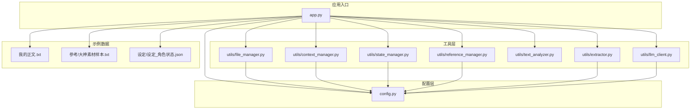
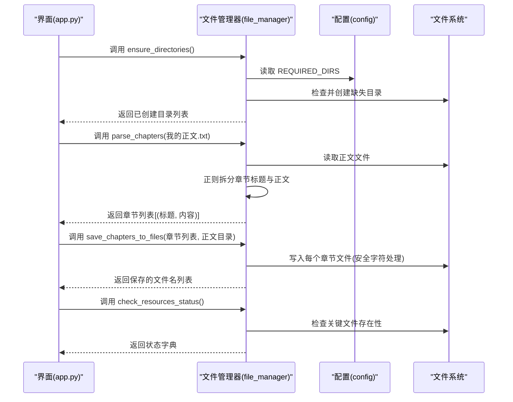
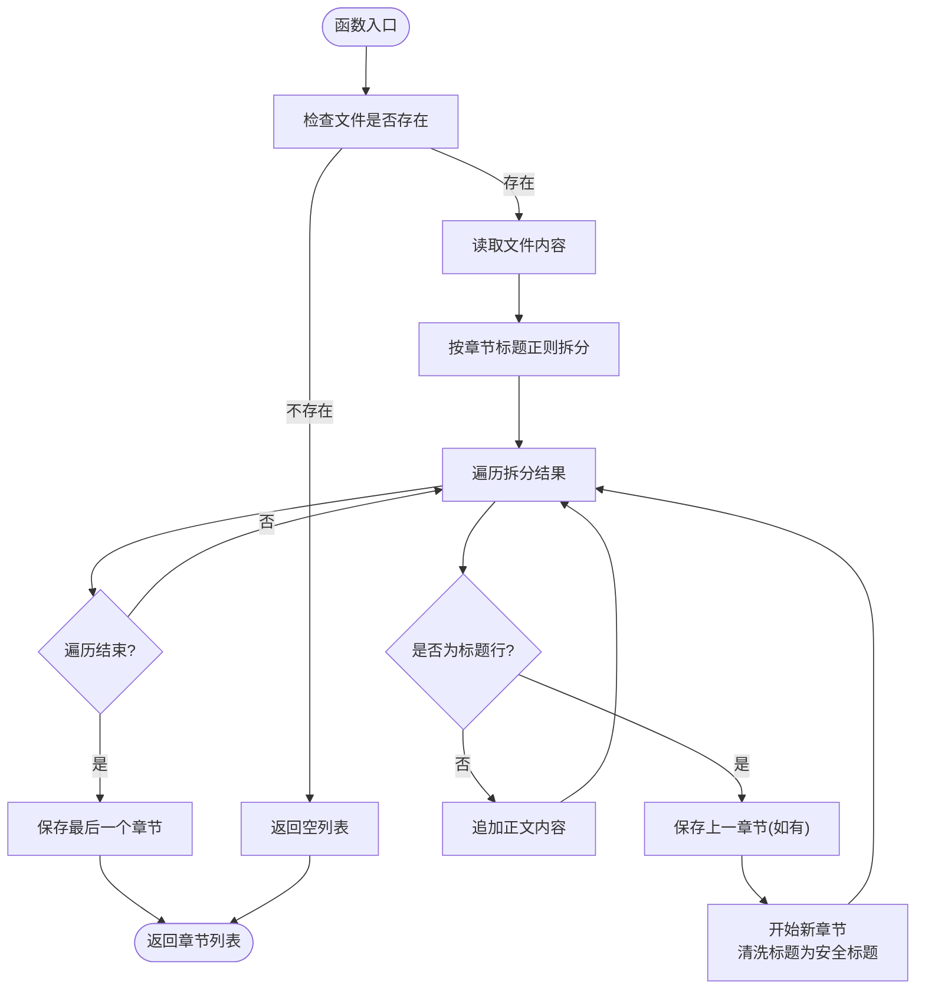
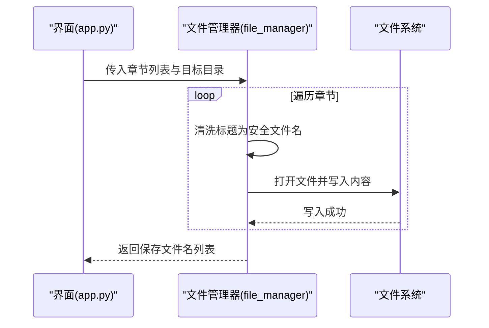
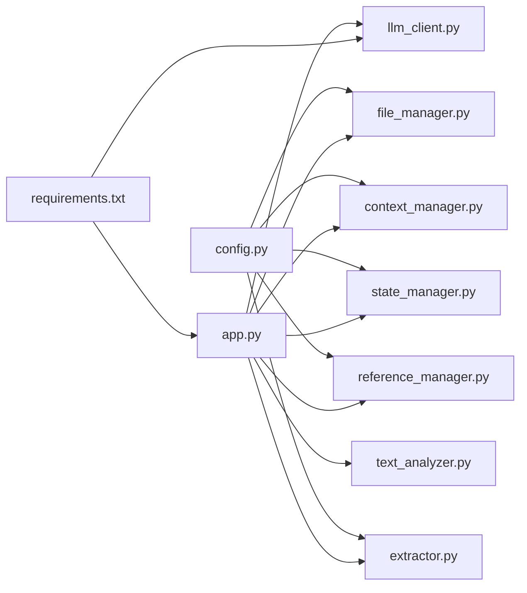

# 文件管理器

<cite>
**本文引用的文件**
- [utils/file_manager.py](file://utils/file_manager.py)
- [app.py](file://app.py)
- [config.py](file://config.py)
- [utils/context_manager.py](file://utils/context_manager.py)
- [utils/state_manager.py](file://utils/state_manager.py)
- [utils/reference_manager.py](file://utils/reference_manager.py)
- [utils/text_analyzer.py](file://utils/text_analyzer.py)
- [utils/extractor.py](file://utils/extractor.py)
- [utils/llm_client.py](file://utils/llm_client.py)
- [requirements.txt](file://requirements.txt)
- [我的正文.txt](file://我的正文.txt)
- [参考/大神素材样本.txt](file://参考/大神素材样本.txt)
- [设定/设定_角色状态.json](file://设定/设定_角色状态.json)
</cite>

## 目录
1. [简介](#简介)
2. [项目结构](#项目结构)
3. [核心组件](#核心组件)
4. [架构总览](#架构总览)
5. [详细组件分析](#详细组件分析)
6. [依赖分析](#依赖分析)
7. [性能考量](#性能考量)
8. [故障排查指南](#故障排查指南)
9. [结论](#结论)
10. [附录](#附录)

## 简介
本技术文档聚焦于“文件管理器”模块，围绕以下目标展开：
- 目录结构管理机制：ensure_directories() 如何确保必需目录的存在与创建
- 章节解析功能：parse_chapters() 的正则匹配逻辑、章节标题提取算法、内容分割策略
- 章节保存功能：save_chapters_to_files() 的文件命名规范、安全字符处理、批量写入机制
- 资源状态检查：check_resources_status() 的文件存在性验证
- 使用示例、错误处理策略与性能优化建议
- 配置文件与实际文件操作的映射关系

## 项目结构
该项目采用“功能分层 + 配置集中”的组织方式：
- 配置层：config.py 统一管理项目根目录、各业务目录与关键文件路径
- 工具层：utils/* 提供文件管理、状态管理、LLM交互、文本分析等工具
- 应用入口：app.py 作为 Streamlit 应用入口，整合工具层功能
- 示例数据：我的正文.txt、参考/大神素材样本.txt、设定/设定_角色状态.json

图表来源
- [app.py](file://app.py#L1-L711)
- [config.py](file://config.py#L1-L24)
- [utils/file_manager.py](file://utils/file_manager.py#L1-L108)
- [utils/context_manager.py](file://utils/context_manager.py#L1-L93)
- [utils/state_manager.py](file://utils/state_manager.py#L1-L77)
- [utils/reference_manager.py](file://utils/reference_manager.py#L1-L94)
- [utils/text_analyzer.py](file://utils/text_analyzer.py#L1-L63)
- [utils/extractor.py](file://utils/extractor.py#L1-L106)
- [utils/llm_client.py](file://utils/llm_client.py#L1-L303)

章节来源
- [app.py](file://app.py#L1-L711)
- [config.py](file://config.py#L1-L24)

## 核心组件
- 目录管理：ensure_directories() 确保 REQUIRED_DIRS 存在
- 章节解析：parse_chapters() 基于正则拆分正文，提取章节标题与正文内容
- 章节保存：save_chapters_to_files() 将章节写入目标目录，进行安全字符处理
- 资源检查：check_resources_status() 检查关键文件是否存在
- 上下文与状态：context_manager、state_manager 提供章节排序、状态读写与快照
- LLM 与抽取：llm_client、extractor 提供 AI 抽取与保存
- 参考与文本分析：reference_manager、text_analyzer 提供参考段落检索与冲突扫描

章节来源
- [utils/file_manager.py](file://utils/file_manager.py#L7-L108)
- [utils/context_manager.py](file://utils/context_manager.py#L6-L21)
- [utils/state_manager.py](file://utils/state_manager.py#L21-L77)
- [utils/reference_manager.py](file://utils/reference_manager.py#L5-L94)
- [utils/text_analyzer.py](file://utils/text_analyzer.py#L7-L63)
- [utils/extractor.py](file://utils/extractor.py#L6-L106)
- [utils/llm_client.py](file://utils/llm_client.py#L9-L303)

## 架构总览
文件管理器在应用中的工作流如下：
- 初始化阶段：调用 ensure_directories() 创建必要目录
- 导入正文：parse_chapters() 解析单文件正文为章节元组列表
- 保存章节：save_chapters_to_files() 将章节写入正文目录
- 资源监控：check_resources_status() 展示关键文件存在性
- 上下文与状态：context_manager 与 state_manager 提供章节排序与状态持久化

图表来源
- [app.py](file://app.py#L330-L417)
- [utils/file_manager.py](file://utils/file_manager.py#L7-L108)
- [config.py](file://config.py#L22-L24)

## 详细组件分析

### 目录结构管理：ensure_directories()
- 功能概述
  - 读取配置中的 REQUIRED_DIRS，逐项检查是否存在，不存在则创建
  - 返回新建目录列表，便于 UI 反馈
- 关键实现点
  - 依赖 config.REQUIRED_DIRS
  - 使用 os.path.exists 与 os.makedirs
- 使用示例
  - 在“初始化”页面点击“创建/修复目录结构”，触发该函数
- 错误处理
  - 若目录已存在，不重复创建
  - 若创建失败，需检查权限与磁盘空间
- 性能与优化
  - 单次批量创建，IO 次数少
  - 建议在应用启动时统一调用，避免运行期频繁创建

章节来源
- [utils/file_manager.py](file://utils/file_manager.py#L7-L14)
- [config.py](file://config.py#L22-L24)
- [app.py](file://app.py#L330-L342)

### 章节解析：parse_chapters()
- 功能概述
  - 将单文件正文解析为章节列表，每个元素为 (标题, 内容) 元组
- 正则匹配逻辑
  - 使用 re.split(pattern, content)，pattern 匹配章节标题行格式
  - 保留分隔符，便于后续重组章节
- 标题提取算法
  - 识别标题行后，去除方括号与多余空白，形成安全标题
  - 作为后续文件名与内容的依据
- 内容分割策略
  - 以标题为界，将正文按顺序拼接至当前章节
  - 支持文件开头无标题的前言处理
- 边界与异常
  - 若文件不存在，返回空列表
  - 若标题格式不符合预期，可能影响分割准确性
- 使用示例
  - 在“初始化”页面点击“执行正文导入”，触发该函数
- 性能与优化
  - 单文件读取与一次正则拆分，整体 O(n) 时间复杂度
  - 对于超大文件，可考虑分块读取与增量处理

图表来源
- [utils/file_manager.py](file://utils/file_manager.py#L16-L80)

章节来源
- [utils/file_manager.py](file://utils/file_manager.py#L16-L80)
- [app.py](file://app.py#L407-L416)

### 章节保存：save_chapters_to_files()
- 功能概述
  - 将章节列表写入目标目录，生成独立 txt 文件
- 文件命名规范
  - 使用章节标题作为文件名，去除非法 Windows 字符
  - 文件扩展名为 .txt
- 安全字符处理
  - 使用正则替换非法字符，保证文件名可安全写入
- 批量文件写入机制
  - 逐个章节打开文件并写入内容
  - 返回保存成功的文件名列表
- 使用示例
  - 在“初始化”页面导入正文后，调用该函数保存章节
- 错误处理
  - 若写入失败，需检查目标目录权限与磁盘空间
  - 建议在 UI 中提示保存进度与结果

图表来源
- [utils/file_manager.py](file://utils/file_manager.py#L82-L99)
- [app.py](file://app.py#L407-L416)

章节来源
- [utils/file_manager.py](file://utils/file_manager.py#L82-L99)
- [app.py](file://app.py#L407-L416)

### 资源状态检查：check_resources_status()
- 功能概述
  - 检查关键文件是否存在，返回布尔状态字典
- 关键文件
  - 我的正文.txt、参考原著、大神素材样本
- 使用示例
  - 在侧边栏“资源状态”区域显示检查结果
- 错误处理
  - 缺失文件时，UI 显示提示与期望路径

章节来源
- [utils/file_manager.py](file://utils/file_manager.py#L101-L108)
- [app.py](file://app.py#L310-L328)

### 配置文件与实际文件操作的映射关系
- 目录映射
  - 参考、设定、正文、细纲、历史版本目录均基于 PROJECT_ROOT 计算
  - REQUIRED_DIRS 统一管理，ensure_directories() 保证存在
- 文件映射
  - 我的正文.txt、参考原著、大神素材样本、角色状态 JSON、伏笔 JSON
  - 与 UI 中“资源状态”检查一一对应
- 上下文与状态
  - context_manager 读取正文目录中的章节文件，按标题数字排序
  - state_manager 读写角色状态与伏笔 JSON，支持快照到历史版本目录

章节来源
- [config.py](file://config.py#L6-L24)
- [utils/context_manager.py](file://utils/context_manager.py#L6-L21)
- [utils/state_manager.py](file://utils/state_manager.py#L33-L49)
- [app.py](file://app.py#L310-L328)

## 依赖分析
- 模块耦合
  - file_manager 依赖 config 提供路径与目录集合
  - app.py 依赖 file_manager、context_manager、state_manager 等工具
  - extractor、llm_client 依赖外部 API，但与文件管理器无直接耦合
- 外部依赖
  - Streamlit、Google Generative AI、OpenAI、python-dotenv、tenacity
- 潜在风险
  - 正则匹配依赖标题格式一致性
  - 文件写入依赖目标目录权限与磁盘空间
  - LLM 调用依赖网络与密钥配置

图表来源
- [config.py](file://config.py#L1-L24)
- [utils/file_manager.py](file://utils/file_manager.py#L1-L6)
- [utils/context_manager.py](file://utils/context_manager.py#L1-L4)
- [utils/state_manager.py](file://utils/state_manager.py#L1-L7)
- [utils/reference_manager.py](file://utils/reference_manager.py#L1-L4)
- [utils/text_analyzer.py](file://utils/text_analyzer.py#L1-L6)
- [utils/extractor.py](file://utils/extractor.py#L1-L5)
- [utils/llm_client.py](file://utils/llm_client.py#L1-L8)
- [requirements.txt](file://requirements.txt#L1-L6)

章节来源
- [requirements.txt](file://requirements.txt#L1-L6)
- [app.py](file://app.py#L1-L12)

## 性能考量
- 目录创建：一次性批量创建，避免重复 IO
- 正文解析：单次读取与一次正则拆分，时间复杂度 O(n)
- 章节保存：顺序写入，建议在 UI 中显示进度
- LLM 调用：带重试与超时控制，避免阻塞 UI
- 建议
  - 对超大正文文件，考虑分块读取与增量写入
  - 对频繁调用的解析与保存，可引入缓存与去重
  - 对 LLM 调用进行并发限制与队列管理

[本节为通用性能建议，无需特定文件来源]

## 故障排查指南
- 目录创建失败
  - 检查权限与磁盘空间
  - 确认 config.REQUIRED_DIRS 路径正确
- 正文解析为空
  - 检查“我的正文.txt”是否存在
  - 确认章节标题格式符合正则预期
- 章节保存失败
  - 检查正文目录权限
  - 确认标题中不含非法字符
- 资源状态异常
  - 检查参考原著与大神素材样本路径
  - 在 UI 中查看“资源状态”提示
- LLM 调用错误
  - 检查 API Key 与 Base URL
  - 查看详细错误日志与堆栈

章节来源
- [utils/file_manager.py](file://utils/file_manager.py#L7-L108)
- [utils/llm_client.py](file://utils/llm_client.py#L29-L187)
- [app.py](file://app.py#L310-L328)

## 结论
文件管理器模块通过简洁的函数职责划分，实现了目录创建、正文解析、章节保存与资源状态检查等核心能力。结合配置层的集中管理与工具层的可复用设计，为上层应用提供了稳定可靠的文件操作支撑。建议在生产环境中进一步完善错误日志、并发控制与性能监控，以提升稳定性与用户体验。

[本节为总结性内容，无需特定文件来源]

## 附录
- 示例数据
  - 我的正文.txt：包含多章节正文，用于演示解析与保存
  - 参考/大神素材样本.txt：包含参考段落与关键词指引
  - 设定/设定_角色状态.json：角色状态与能力的 JSON 数据
- 依赖安装
  - 使用 requirements.txt 安装所需依赖

章节来源
- [我的正文.txt](file://我的正文.txt#L1-L947)
- [参考/大神素材样本.txt](file://参考/大神素材样本.txt#L1-L614)
- [设定/设定_角色状态.json](file://设定/设定_角色状态.json#L1-L17)
- [requirements.txt](file://requirements.txt#L1-L6)