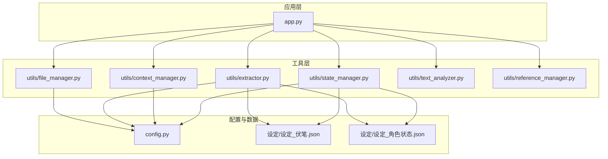
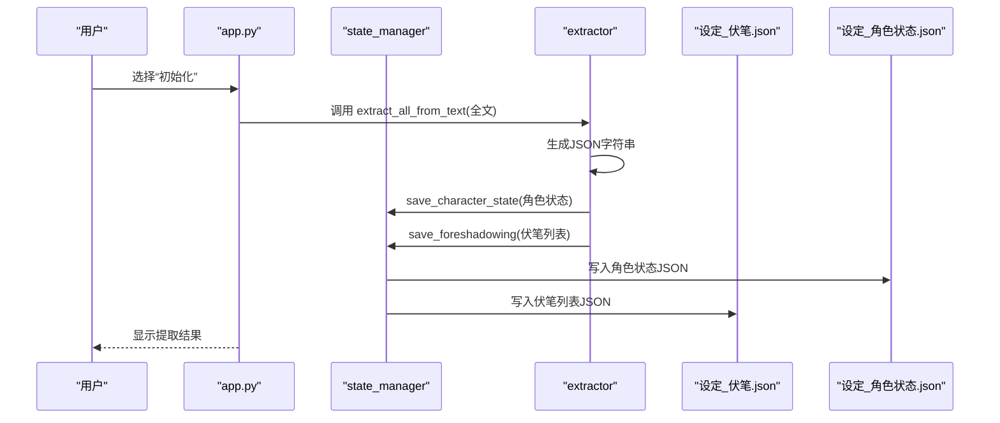
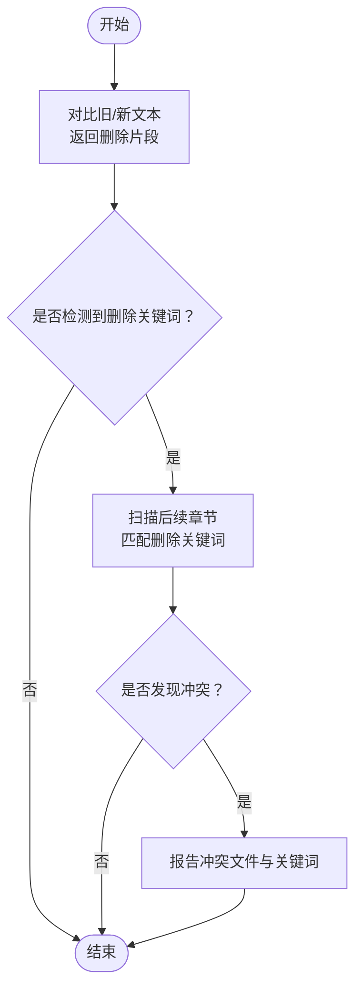
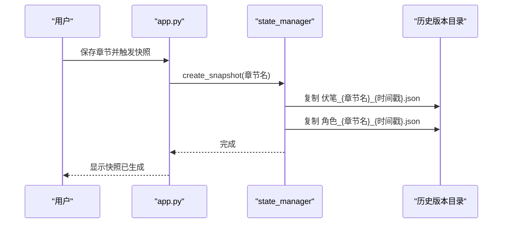
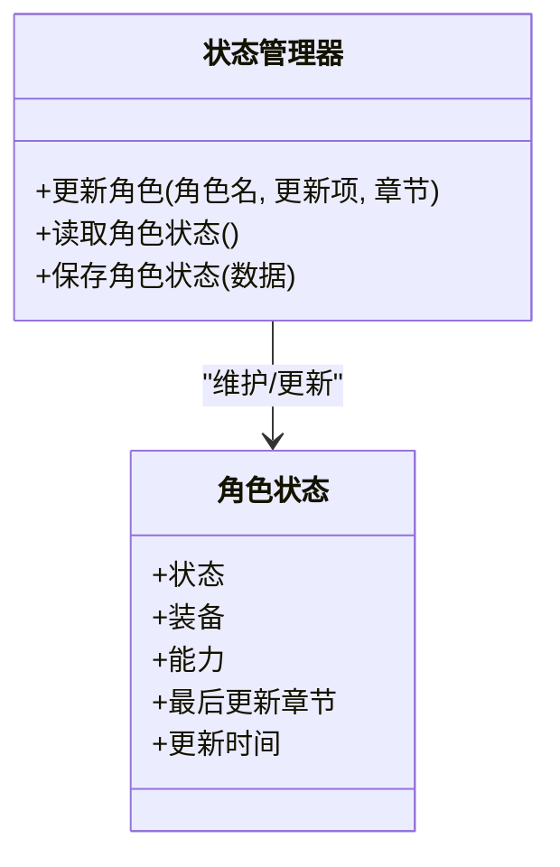
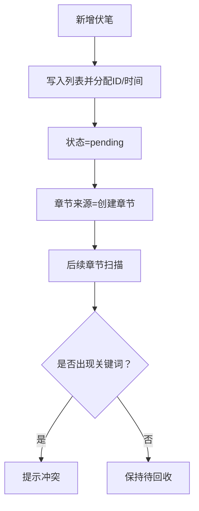
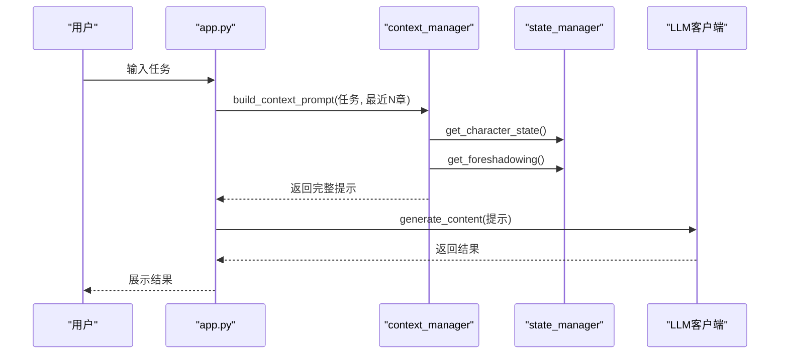
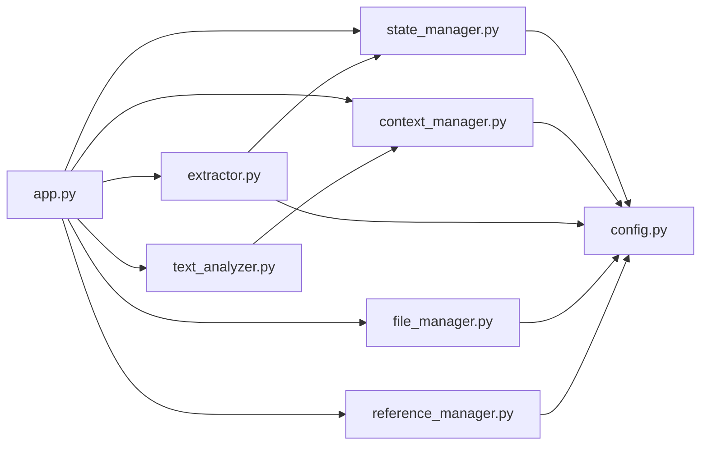

# 状态管理器

<cite>
**本文引用的文件**
- [utils/state_manager.py](file://utils/state_manager.py)
- [utils/context_manager.py](file://utils/context_manager.py)
- [app.py](file://app.py)
- [config.py](file://config.py)
- [设定/设定_角色状态.json](file://设定/设定_角色状态.json)
- [设定/设定_伏笔.json](file://设定/设定_伏笔.json)
- [utils/file_manager.py](file://utils/file_manager.py)
- [utils/extractor.py](file://utils/extractor.py)
- [utils/text_analyzer.py](file://utils/text_analyzer.py)
- [utils/reference_manager.py](file://utils/reference_manager.py)
- [requirements.txt](file://requirements.txt)
</cite>

## 目录
1. [简介](#简介)
2. [项目结构](#项目结构)
3. [核心组件](#核心组件)
4. [架构总览](#架构总览)
5. [详细组件分析](#详细组件分析)
6. [依赖关系分析](#依赖关系分析)
7. [性能考量](#性能考量)
8. [故障排查指南](#故障排查指南)
9. [结论](#结论)
10. [附录](#附录)

## 简介
本技术文档围绕状态管理器进行系统化梳理，重点覆盖：
- JSON格式的状态存储设计：状态数据结构、字段含义、数据类型规范
- 状态更新机制：变更检测、增量更新策略、并发控制方法
- 历史版本控制：版本快照生成、版本比较与回滚思路
- 角色状态管理：属性跟踪、状态继承关系、动态更新机制
- 伏笔管理系统：伏笔列表维护、状态跟踪、执行监控
- 状态持久化最佳实践、数据迁移策略、备份恢复方案
- API使用示例与错误处理机制

## 项目结构
项目采用模块化组织，核心状态管理集中在工具模块中，应用入口负责交互与流程编排，配置文件统一管理路径与常量。

图表来源
- [app.py](file://app.py#L1-L711)
- [utils/state_manager.py](file://utils/state_manager.py#L1-L77)
- [utils/context_manager.py](file://utils/context_manager.py#L1-L93)
- [utils/file_manager.py](file://utils/file_manager.py#L1-L108)
- [utils/extractor.py](file://utils/extractor.py#L1-L106)
- [utils/text_analyzer.py](file://utils/text_analyzer.py#L1-L63)
- [utils/reference_manager.py](file://utils/reference_manager.py#L1-L94)
- [config.py](file://config.py#L1-L24)
- [设定/设定_伏笔.json](file://设定/设定_伏笔.json#L1-L23)
- [设定/设定_角色状态.json](file://设定/设定_角色状态.json#L1-L17)

章节来源
- [app.py](file://app.py#L1-L711)
- [config.py](file://config.py#L1-L24)

## 核心组件
- 状态管理器（utils/state_manager.py）
  - 提供JSON读写封装、角色状态与伏笔列表的读取与保存
  - 提供快照创建、新增伏笔、角色状态更新等接口
- 上下文构建器（utils/context_manager.py）
  - 聚合角色状态、待回收伏笔、设定与近期章节，构建LLM上下文提示
- 文件管理器（utils/file_manager.py）
  - 创建目录、解析正文为章节、保存章节文件
- 提取器（utils/extractor.py）
  - 通过LLM抽取角色状态、伏笔、设定与剧情回顾，并落地到JSON
- 文本分析器（utils/text_analyzer.py）
  - 对比前后文本差异，扫描后续章节是否存在被删除关键词
- 引用管理器（utils/reference_manager.py）
  - 解析大神素材样本，定位原著中的参考片段
- 应用入口（app.py）
  - Streamlit界面、API配置、功能模块（初始化、探讨设定、探讨细纲、续写正文、改文与冲突提示）

章节来源
- [utils/state_manager.py](file://utils/state_manager.py#L1-L77)
- [utils/context_manager.py](file://utils/context_manager.py#L1-L93)
- [utils/file_manager.py](file://utils/file_manager.py#L1-L108)
- [utils/extractor.py](file://utils/extractor.py#L1-L106)
- [utils/text_analyzer.py](file://utils/text_analyzer.py#L1-L63)
- [utils/reference_manager.py](file://utils/reference_manager.py#L1-L94)
- [app.py](file://app.py#L1-L711)

## 架构总览
状态管理器围绕“JSON文件 + 工具函数”的轻量架构运行，通过配置文件集中管理路径，通过应用入口串联各模块。

图表来源
- [app.py](file://app.py#L365-L401)
- [utils/extractor.py](file://utils/extractor.py#L6-L56)
- [utils/state_manager.py](file://utils/state_manager.py#L17-L31)
- [设定/设定_角色状态.json](file://设定/设定_角色状态.json#L1-L17)
- [设定/设定_伏笔.json](file://设定/设定_伏笔.json#L1-L23)

## 详细组件分析

### JSON状态存储设计
- 存储位置与命名
  - 伏笔列表：设定/设定_伏笔.json
  - 角色状态：设定/设定_角色状态.json
- 数据结构与字段
  - 伏笔列表：数组，元素为对象，包含内容、状态、创建章节、唯一ID、创建时间等
  - 角色状态：对象，键为角色名，值为包含状态、装备、能力等字段的对象
- 数据类型规范
  - 字符串：内容、状态、章节、ID、时间
  - 数组：章节来源（如“第4章、第9章”）
  - 对象：角色属性集合
- 读写封装
  - 读取：若文件不存在或读取异常，返回默认空结构
  - 写入：统一缩进与编码，确保一致性

章节来源
- [config.py](file://config.py#L18-L21)
- [utils/state_manager.py](file://utils/state_manager.py#L8-L19)
- [设定/设定_伏笔.json](file://设定/设定_伏笔.json#L1-L23)
- [设定/设定_角色状态.json](file://设定/设定_角色状态.json#L1-L17)

### 状态更新机制
- 变更检测
  - 文本差异：基于序列匹配计算删除/替换片段，返回被移除的文本块
  - 后续章节扫描：对后续章节检索被删除关键词，发现潜在冲突
- 增量更新策略
  - 新增伏笔：追加到列表，自动分配ID与时间戳
  - 角色状态：按角色名建立或更新条目，合并传入更新，记录最后更新章节与时间
- 并发控制方法
  - 当前实现为单进程文件读写，无显式锁；建议在多线程/多进程场景引入文件锁或原子写入策略

图表来源
- [utils/text_analyzer.py](file://utils/text_analyzer.py#L7-L37)
- [utils/text_analyzer.py](file://utils/text_analyzer.py#L39-L62)

章节来源
- [utils/text_analyzer.py](file://utils/text_analyzer.py#L1-L63)
- [app.py](file://app.py#L649-L674)

### 历史版本控制策略
- 快照生成
  - 在“历史版本”目录按章节名与时间戳复制当前状态文件，形成快照
- 版本比较与回滚
  - 当前未实现版本比较算法与自动回滚；可通过快照文件进行人工比对与恢复
- 建议
  - 引入版本元数据（如摘要、变更摘要）便于自动化比较
  - 提供回滚脚本或UI操作，支持按章节/时间点回退

图表来源
- [utils/state_manager.py](file://utils/state_manager.py#L33-L48)
- [config.py](file://config.py#L11)

章节来源
- [utils/state_manager.py](file://utils/state_manager.py#L33-L48)
- [config.py](file://config.py#L11)

### 角色状态管理
- 属性跟踪
  - 状态、装备、能力等字段按需扩展；更新时保留最后更新章节与时间
- 状态继承关系
  - 当前未实现跨章节继承；可在后续扩展中引入“继承链”或“状态模板”
- 动态更新机制
  - 通过角色名键值映射实现动态增删改查；支持增量合并

图表来源
- [utils/state_manager.py](file://utils/state_manager.py#L65-L76)
- [设定/设定_角色状态.json](file://设定/设定_角色状态.json#L1-L17)

章节来源
- [utils/state_manager.py](file://utils/state_manager.py#L65-L76)
- [设定/设定_角色状态.json](file://设定/设定_角色状态.json#L1-L17)

### 伏笔管理系统
- 列表维护
  - 新增：自动分配UUID与创建时间，状态初始为“待回收”
  - 查询：可按状态过滤（如仅显示待回收）
- 状态跟踪
  - 记录创建章节与回收章节；支持多章节来源
- 执行监控
  - 通过文本分析扫描后续章节，发现被删除关键词即提示潜在冲突

图表来源
- [utils/state_manager.py](file://utils/state_manager.py#L50-L63)
- [utils/text_analyzer.py](file://utils/text_analyzer.py#L39-L62)
- [设定/设定_伏笔.json](file://设定/设定_伏笔.json#L1-L23)

章节来源
- [utils/state_manager.py](file://utils/state_manager.py#L50-L63)
- [utils/text_analyzer.py](file://utils/text_analyzer.py#L39-L62)
- [设定/设定_伏笔.json](file://设定/设定_伏笔.json#L1-L23)

### 上下文构建与提示工程
- 上下文聚合
  - 角色状态JSON、待回收伏笔JSON、设定文本、最近N章正文
- 提示模板
  - 将任务描述与上下文拼接，作为LLM输入
- 使用场景
  - 探讨细纲、智能设定探讨、续写正文等模块均依赖该上下文

图表来源
- [utils/context_manager.py](file://utils/context_manager.py#L43-L92)
- [utils/state_manager.py](file://utils/state_manager.py#L27-L31)
- [app.py](file://app.py#L514-L526)

章节来源
- [utils/context_manager.py](file://utils/context_manager.py#L43-L92)
- [app.py](file://app.py#L514-L526)

### 数据持久化最佳实践
- 文件组织
  - 使用配置文件集中管理路径，确保跨平台一致性
- 写入策略
  - 统一编码与缩进，避免手写JSON导致的格式问题
- 备份与恢复
  - 快照目录用于版本备份；建议定期归档
- 迁移策略
  - 新增字段时保持向后兼容；读取时提供默认值

章节来源
- [config.py](file://config.py#L1-L24)
- [utils/state_manager.py](file://utils/state_manager.py#L17-L19)
- [utils/state_manager.py](file://utils/state_manager.py#L33-L48)

### API使用示例与错误处理
- 初始化与状态文件
  - 在“初始化”模式下创建空的JSON文件
- 全量提取
  - 读取正文，调用提取器生成JSON并保存
- 文本差异与冲突检测
  - 编辑章节后保存，系统计算差异并扫描后续章节
- 错误处理
  - 文件读取异常返回默认空结构
  - LLM调用异常捕获并提示用户查看终端输出

章节来源
- [app.py](file://app.py#L344-L401)
- [app.py](file://app.py#L649-L674)
- [utils/state_manager.py](file://utils/state_manager.py#L8-L15)

## 依赖关系分析
- 模块耦合
  - app.py依赖所有工具模块与配置
  - 工具模块之间低耦合，通过配置文件共享路径
- 外部依赖
  - Streamlit用于界面
  - LLM SDK用于内容生成
  - Python标准库用于文件与时间处理

图表来源
- [app.py](file://app.py#L1-L11)
- [utils/state_manager.py](file://utils/state_manager.py#L1-L6)
- [utils/context_manager.py](file://utils/context_manager.py#L1-L4)
- [utils/file_manager.py](file://utils/file_manager.py#L1-L5)
- [utils/extractor.py](file://utils/extractor.py#L1-L4)
- [utils/text_analyzer.py](file://utils/text_analyzer.py#L1-L5)
- [utils/reference_manager.py](file://utils/reference_manager.py#L1-L3)
- [config.py](file://config.py#L1-L24)

章节来源
- [requirements.txt](file://requirements.txt#L1-L6)
- [app.py](file://app.py#L1-L11)

## 性能考量
- 文件I/O
  - JSON读写为小文件，性能影响有限；建议批量写入减少磁盘抖动
- 文本扫描
  - 后续章节扫描为线性匹配，建议对关键词建立索引或限制扫描范围
- LLM调用
  - 控制上下文长度与模型选择，避免超时与高成本

## 故障排查指南
- 文件读取失败
  - 检查文件是否存在与编码；读取异常时返回默认空结构
- LLM连接失败
  - 检查API密钥、Base URL与网络连通性
- 快照未生成
  - 确认历史版本目录存在且可写
- 冲突检测无效
  - 确认删除关键词长度与后续章节包含相应文本

章节来源
- [utils/state_manager.py](file://utils/state_manager.py#L8-L15)
- [app.py](file://app.py#L275-L286)
- [app.py](file://app.py#L649-L674)

## 结论
本状态管理器以轻量JSON为核心，结合工具模块实现了角色状态与伏笔的维护、上下文构建与冲突检测。建议后续增强版本比较与自动回滚、引入并发控制与索引优化，以提升稳定性与可维护性。

## 附录
- 目录与文件清单
  - 参考/、设定/、正文/、细纲/、历史版本/
  - 设定_伏笔.json、设定_角色状态.json
- 关键路径
  - 项目根目录、各模块文件、JSON数据文件

章节来源
- [config.py](file://config.py#L6-L24)
- [设定/设定_伏笔.json](file://设定/设定_伏笔.json#L1-L23)
- [设定/设定_角色状态.json](file://设定/设定_角色状态.json#L1-L17)