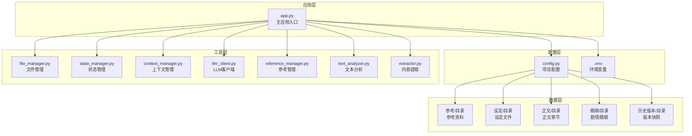
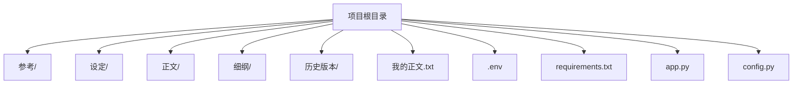
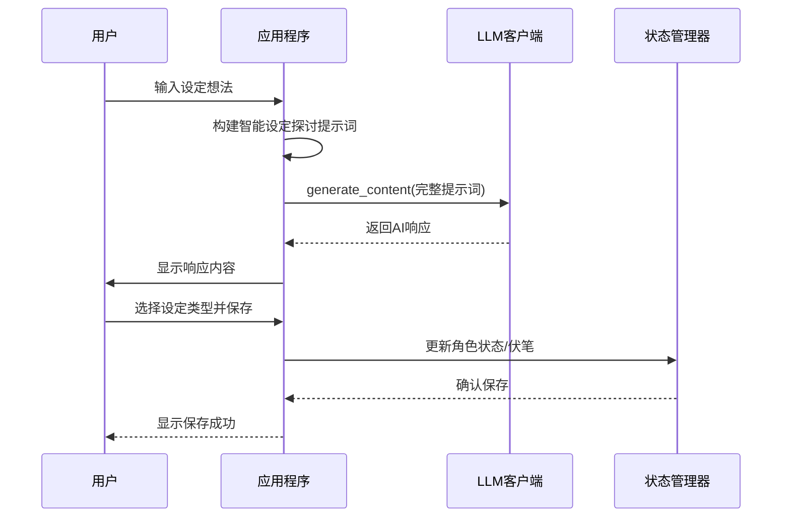
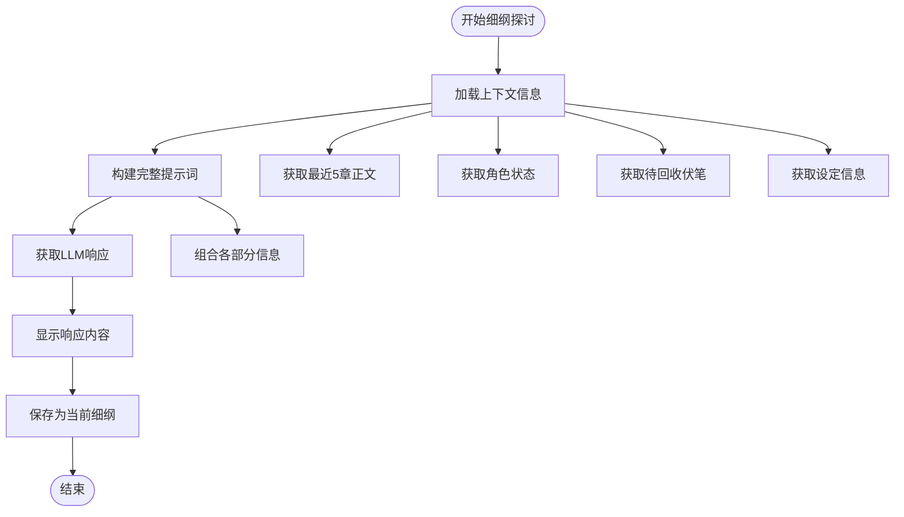
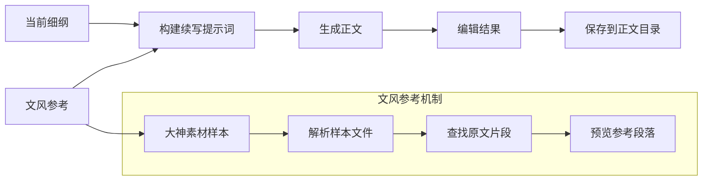
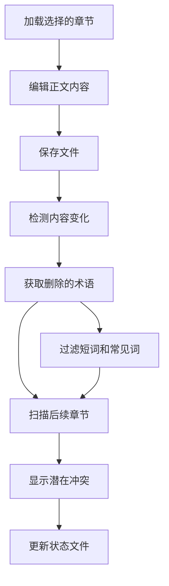

# 快速开始

<cite>
**本文档引用的文件**
- [app.py](file://app.py)
- [config.py](file://config.py)
- [requirements.txt](file://requirements.txt)
- [.env](file://.env)
- [utils/state_manager.py](file://utils/state_manager.py)
- [utils/file_manager.py](file://utils/file_manager.py)
- [utils/context_manager.py](file://utils/context_manager.py)
- [utils/llm_client.py](file://utils/llm_client.py)
- [utils/reference_manager.py](file://utils/reference_manager.py)
- [utils/text_analyzer.py](file://utils/text_analyzer.py)
- [utils/extractor.py](file://utils/extractor.py)
- [test_company_api.py](file://test_company_api.py)
</cite>

## 目录
1. [简介](#简介)
2. [项目结构](#项目结构)
3. [安装准备](#安装准备)
4. [环境配置](#环境配置)
5. [API密钥配置](#api密钥配置)
6. [首次使用流程](#首次使用流程)
7. [核心功能详解](#核心功能详解)
8. [常见问题解决](#常见问题解决)
9. [故障排除指南](#故障排除指南)
10. [最佳实践建议](#最佳实践建议)

## 简介

镇妖狱创作引擎是一个基于AI的网络小说创作辅助工具，专为中文网络文学作者设计。该系统集成了多种AI服务提供商，提供了从设定探讨、剧情细纲到正文续写的完整创作流程支持。

**核心特性：**
- 多AI服务提供商支持（Gemini、OpenAI兼容、SiliconFlow等）
- 智能设定探讨和状态管理
- 剧情细纲生成和冲突检测
- 正文续写和文风参考
- 自动化状态跟踪和历史版本管理

## 项目结构

项目采用清晰的模块化架构，主要分为以下几个部分：



**图表来源**
- [app.py](file://app.py#L1-L690)
- [config.py](file://config.py#L1-L24)

**章节来源**
- [app.py](file://app.py#L1-L690)
- [config.py](file://config.py#L1-L24)

## 安装准备

### 系统要求

- **Python版本**: Python 3.8 或更高版本
- **操作系统**: Windows/Linux/macOS
- **内存**: 至少4GB RAM（建议8GB+）
- **存储空间**: 至少2GB可用空间

### 依赖包安装

1. **创建虚拟环境**（推荐）
```bash
python -m venv zyy_env
# Windows:
zyy_env\Scripts\activate
# Linux/macOS:
source zyy_env/bin/activate
```

2. **安装依赖包**
```bash
pip install -r requirements.txt
```

3. **验证安装**
```bash
pip list | grep -E "(streamlit|google-generativeai|openai)"
```

**章节来源**
- [requirements.txt](file://requirements.txt#L1-L6)

## 环境配置

### 目录结构创建

项目需要以下标准目录结构：



**图表来源**
- [config.py](file://config.py#L6-L24)

### 环境变量配置

创建或编辑 `.env` 文件，配置基础环境变量：

```env
# 默认AI提供商（gemini/openai）
LLM_PROVIDER=gemini

# Gemini API配置
GOOGLE_API_KEY=your_gemini_api_key_here
GEMINI_MODEL_NAME=gemini-1.5-flash

# SiliconFlow配置示例
# LLM_PROVIDER=openai
# OPENAI_BASE_URL=https://api.siliconflow.com/v1
# OPENAI_API_KEY=sk-xxxxxxxxxxxxxxxxxxxx
# OPENAI_MODEL_NAME=zai-org/GLM-4.7

# 公司测试平台配置示例
# LLM_PROVIDER=openai
# OPENAI_BASE_URL=http://45.78.235.165:9005/v1
# OPENAI_API_KEY=Bearer sk-xxxxxxxxxxxxxxxxxxxx
# OPENAI_MODEL_NAME=gemini-3-flash-preview
```

**章节来源**
- [.env](file://.env#L1-L16)
- [config.py](file://config.py#L1-L24)

## API密钥配置

### Gemini官方API

1. **获取API密钥**
   - 访问 https://aistudio.google.com/app/apikey
   - 创建新的API密钥
   - 复制并粘贴到 `.env` 文件中的 `GOOGLE_API_KEY`

2. **模型选择**
   - `gemini-1.5-flash`: 快速响应，适合日常对话
   - `gemini-1.5-pro`: 强推理能力，适合复杂创作
   - `gemini-1.0-pro`: 稳定版本，性价比高

### OpenAI兼容服务

#### NewAPI中转服务
```env
LLM_PROVIDER=openai
OPENAI_BASE_URL=https://api.newapi.ai/v1
OPENAI_API_KEY=your_newapi_key_here
OPENAI_MODEL_NAME=gpt-3.5-turbo
```

#### SiliconFlow服务
```env
LLM_PROVIDER=openai
OPENAI_BASE_URL=https://api.siliconflow.com/v1
OPENAI_API_KEY=your_siliconflow_key_here
OPENAI_MODEL_NAME=zai-org/GLM-4.7
```

#### 公司内部测试平台
```env
LLM_PROVIDER=openai
OPENAI_BASE_URL=http://45.78.235.165:9005/v1
OPENAI_API_KEY=Bearer sk-xxxxxxxxxxxxxxxxxxxx
OPENAI_MODEL_NAME=gemini-3-flash-preview
```

**章节来源**
- [app.py](file://app.py#L81-L277)
- [utils/llm_client.py](file://utils/llm_client.py#L9-L28)

## 首次使用流程

### 启动应用程序

1. **激活虚拟环境**
```bash
# Windows:
zyy_env\Scripts\activate
# Linux/macOS:
source zyy_env/bin/activate
```

2. **启动Streamlit应用**
```bash
streamlit run app.py
```

3. **访问应用**
   - 打开浏览器访问 `http://localhost:8501`
   - 首次启动会显示配置界面

### 初始化项目

#### 步骤1：创建目录结构
1. 在左侧边栏点击"初始化"
2. 点击"创建/修复目录结构"
3. 系统会自动创建所有必需的目录

#### 步骤2：初始化状态文件
1. 点击"初始化空白状态文件"
2. 系统会创建：
   - `设定/设定_伏笔.json`
   - `设定/设定_角色状态.json`

#### 步骤3：导入正文内容
1. 准备你的原始正文文件命名为 `我的正文.txt`
2. 将单文件正文拆分并导入到 `正文/` 目录
3. 点击"执行正文导入"

#### 步骤4：全量状态提取
1. 点击"🚀 开始全量提取 (消耗 Token)"
2. 系统会分析全文并生成：
   - 角色状态
   - 伏笔列表
   - 世界观设定
   - 剧情回顾

**章节来源**
- [app.py](file://app.py#L309-L396)
- [utils/file_manager.py](file://utils/file_manager.py#L7-L14)
- [utils/state_manager.py](file://utils/state_manager.py#L21-L31)

## 核心功能详解

### 设定探讨功能



**图表来源**
- [app.py](file://app.py#L398-L475)
- [utils/llm_client.py](file://utils/llm_client.py#L30-L40)
- [utils/state_manager.py](file://utils/state_manager.py#L65-L76)

### 剧情细纲探讨



**图表来源**
- [app.py](file://app.py#L477-L515)
- [utils/context_manager.py](file://utils/context_manager.py#L43-L92)

### 正文续写功能



**图表来源**
- [app.py](file://app.py#L517-L597)
- [utils/reference_manager.py](file://utils/reference_manager.py#L49-L94)

### 冲突检测功能



**图表来源**
- [app.py](file://app.py#L599-L690)
- [utils/text_analyzer.py](file://utils/text_analyzer.py#L39-L62)

**章节来源**
- [app.py](file://app.py#L398-L690)

## 常见问题解决

### 环境配置问题

**问题1：Python版本不兼容**
- **症状**: 安装时出现版本错误
- **解决方案**: 确保使用Python 3.8+版本
- **验证命令**: `python --version`

**问题2：依赖包安装失败**
- **症状**: pip安装时报错
- **解决方案**: 
  1. 升级pip: `python -m pip install --upgrade pip`
  2. 使用国内镜像源: `pip install -r requirements.txt -i https://pypi.tuna.tsinghua.edu.cn/simple/`
  3. 清理缓存: `pip cache purge`

**问题3：虚拟环境无法激活**
- **症状**: 激活命令无效
- **解决方案**: 
  1. 确认路径正确
  2. Windows使用 `zyy_env\Scripts\activate`
  3. Linux/macOS使用 `source zyy_env/bin/activate`

### API密钥问题

**问题4：Gemini API密钥无效**
- **症状**: 显示"Google API Key is not set"
- **解决方案**:
  1. 确认API密钥格式正确
  2. 检查网络连接
  3. 验证API配额是否充足

**问题5：OpenAI兼容服务连接失败**
- **症状**: 连接超时或认证失败
- **解决方案**:
  1. 检查Base URL是否正确
  2. 验证API Key格式
  3. 确认服务端口可达

**问题6：SiliconFlow API密钥错误**
- **症状**: 返回"Invalid API Key"
- **解决方案**:
  1. 重新申请API Key
  2. 检查Key是否过期
  3. 确认模型名称正确

### 应用启动问题

**问题7：Streamlit应用无法启动**
- **症状**: 启动后页面空白或报错
- **解决方案**:
  1. 检查端口占用: `netstat -an | grep 8501`
  2. 关闭占用端口的进程
  3. 使用其他端口: `streamlit run app.py --server.port 8502`

**问题8：目录结构创建失败**
- **症状**: 目录创建权限不足
- **解决方案**:
  1. 以管理员权限运行
  2. 检查磁盘空间
  3. 确认路径权限

### 功能使用问题

**问题9：状态文件无法保存**
- **症状**: 保存时出现IO错误
- **解决方案**:
  1. 检查文件权限
  2. 确认磁盘空间充足
  3. 关闭文件占用程序

**问题10：正文导入失败**
- **症状**: 解析章节标题失败
- **解决方案**:
  1. 检查文件编码为UTF-8
  2. 确认章节标题格式正确
  3. 参考标准格式: `[第01章 开端]`

**章节来源**
- [app.py](file://app.py#L309-L396)
- [utils/llm_client.py](file://utils/llm_client.py#L62-L74)

## 故障排除指南

### 调试模式启用

1. **查看详细错误信息**
   - 在应用界面查看错误提示
   - 查看终端输出的完整堆栈信息

2. **测试API连接**
```bash
python test_company_api.py
```

3. **检查环境变量**
```python
import os
print("LLM_PROVIDER:", os.getenv("LLM_PROVIDER"))
print("GOOGLE_API_KEY:", os.getenv("GOOGLE_API_KEY", "Not Set"))
print("OPENAI_API_KEY:", os.getenv("OPENAI_API_KEY", "Not Set"))
```

### 性能优化建议

**内存使用优化**：
- 对于大型文本处理，考虑分块读取
- 及时清理临时文件
- 合理设置模型参数

**网络连接优化**：
- 使用稳定的网络环境
- 配置适当的超时时间
- 考虑使用代理服务

**文件操作优化**：
- 批量文件操作时使用异步处理
- 合理安排文件读写顺序
- 避免重复打开关闭文件

### 数据备份策略

1. **定期备份状态文件**
   - 备份 `设定/设定_伏笔.json`
   - 备份 `设定/设定_角色状态.json`

2. **版本控制**
   - 使用Git管理项目文件
   - 定期提交重要版本

3. **历史版本管理**
   - 利用 `历史版本/` 目录
   - 定期清理过期快照

**章节来源**
- [utils/state_manager.py](file://utils/state_manager.py#L33-L48)
- [test_company_api.py](file://test_company_api.py#L1-L25)

## 最佳实践建议

### 项目组织建议

1. **文件命名规范**
   - 使用 `[第XX章 名称].txt` 格式
   - 章节编号使用两位数字填充（如 `01`, `02`）

2. **目录结构维护**
   - 定期清理无用文件
   - 保持目录结构整洁
   - 使用子目录组织不同类型文件

3. **版本管理**
   - 使用Git进行版本控制
   - 重要版本添加标签
   - 记录每次重大修改

### AI使用建议

1. **模型选择策略**
   - 简单任务使用 `gemini-1.5-flash`
   - 复杂创作使用 `gemini-1.5-pro`
   - 成本敏感场景使用 `gemini-1.0-pro`

2. **提示词优化**
   - 提供清晰的任务描述
   - 包含必要的上下文信息
   - 使用具体的指令格式

3. **成本控制**
   - 合理设置Token限制
   - 避免不必要的重复调用
   - 使用缓存机制

### 工作流程建议

1. **设定阶段**
   - 先进行智能设定探讨
   - 保存重要设定到专门文件
   - 建立统一的设定模板

2. **创作阶段**
   - 先制定剧情细纲
   - 使用文风参考保持一致性
   - 定期进行冲突检测

3. **修订阶段**
   - 使用冲突检测功能
   - 保存历史版本
   - 建立修订记录

### 团队协作建议

1. **多人协作**
   - 建立统一的文件命名约定
   - 使用版本控制系统
   - 定期同步状态文件

2. **知识管理**
   - 建立设定数据库
   - 归档重要的创作经验
   - 分享最佳实践案例

通过遵循这些指导原则，您可以更高效地使用镇妖狱创作引擎，提升网络小说创作的质量和效率。记住，熟练使用AI工具需要时间和实践，建议从简单的功能开始，逐步探索更高级的特性。