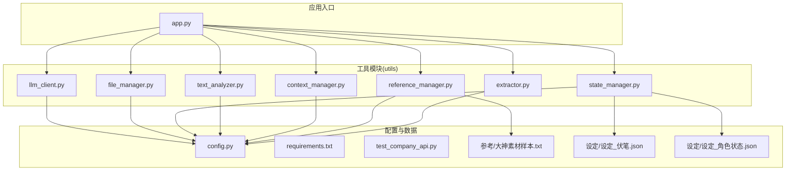
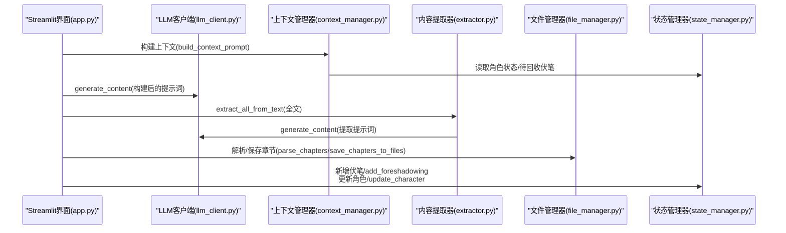
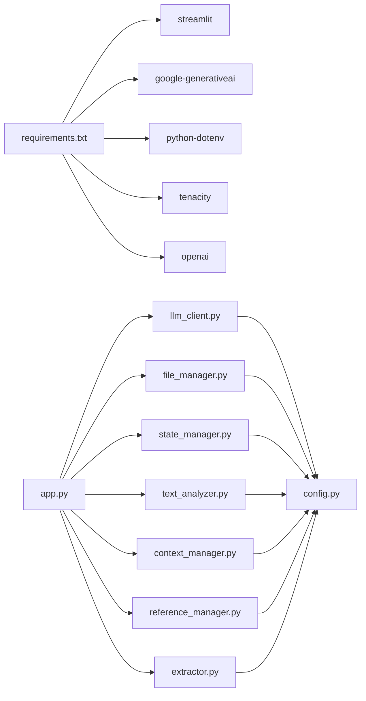

# API参考

<cite>
**本文引用的文件**
- [app.py](file://app.py)
- [config.py](file://config.py)
- [requirements.txt](file://requirements.txt)
- [test_company_api.py](file://test_company_api.py)
- [utils/llm_client.py](file://utils/llm_client.py)
- [utils/file_manager.py](file://utils/file_manager.py)
- [utils/state_manager.py](file://utils/state_manager.py)
- [utils/text_analyzer.py](file://utils/text_analyzer.py)
- [utils/context_manager.py](file://utils/context_manager.py)
- [utils/reference_manager.py](file://utils/reference_manager.py)
- [utils/extractor.py](file://utils/extractor.py)
- [参考/大神素材样本.txt](file://参考/大神素材样本.txt)
- [设定/设定_伏笔.json](file://设定/设定_伏笔.json)
- [设定/设定_角色状态.json](file://设定/设定_角色状态.json)
</cite>

## 目录
1. [简介](#简介)
2. [项目结构](#项目结构)
3. [核心组件](#核心组件)
4. [架构总览](#架构总览)
5. [详细组件分析](#详细组件分析)
6. [依赖分析](#依赖分析)
7. [性能考量](#性能考量)
8. [故障排查指南](#故障排查指南)
9. [结论](#结论)
10. [附录](#附录)

## 简介
本文件为“镇妖狱创作引擎”的完整API参考，面向开发者与运营人员，系统梳理各工具模块的公共接口、参数规范、返回值结构、错误处理、性能与最佳实践。涵盖以下模块：
- LLM客户端API：统一生成接口、聊天接口、批量处理、端点连通性测试
- 文件管理器API：目录确保、章节解析、章节保存、资源状态检查
- 状态管理器API：伏笔与角色状态的读取、保存、快照、新增与更新
- 文本分析器API：文本差异检测、后续章节冲突扫描
- 上下文管理器API：章节排序、近期章节内容拼接、设定摘要、上下文提示构建
- 参考管理器API：样本解析、原著片段检索
- 内容提取器API：全文状态提取、提取数据保存

## 项目结构
项目采用模块化设计，核心逻辑集中在utils目录，应用入口为app.py，配置集中于config.py，依赖声明在requirements.txt。

图表来源
- [app.py](file://app.py#L1-L711)
- [config.py](file://config.py#L1-L24)
- [requirements.txt](file://requirements.txt#L1-L6)
- [test_company_api.py](file://test_company_api.py#L1-L25)
- [utils/llm_client.py](file://utils/llm_client.py#L1-L303)
- [utils/file_manager.py](file://utils/file_manager.py#L1-L108)
- [utils/state_manager.py](file://utils/state_manager.py#L1-L77)
- [utils/text_analyzer.py](file://utils/text_analyzer.py#L1-L63)
- [utils/context_manager.py](file://utils/context_manager.py#L1-L93)
- [utils/reference_manager.py](file://utils/reference_manager.py#L1-L94)
- [utils/extractor.py](file://utils/extractor.py#L1-L106)
- [参考/大神素材样本.txt](file://参考/大神素材样本.txt#L1-L614)
- [设定/设定_伏笔.json](file://设定/设定_伏笔.json#L1-L23)
- [设定/设定_角色状态.json](file://设定/设定_角色状态.json#L1-L17)

章节来源
- [app.py](file://app.py#L1-L711)
- [config.py](file://config.py#L1-L24)

## 核心组件
- LLM客户端：统一生成、聊天、批量处理、端点连通性测试
- 文件管理器：目录确保、章节解析、章节保存、资源状态检查
- 状态管理器：伏笔与角色状态的读取、保存、快照、新增与更新
- 文本分析器：文本差异检测、后续章节冲突扫描
- 上下文管理器：章节排序、近期章节内容拼接、设定摘要、上下文提示构建
- 参考管理器：样本解析、原著片段检索
- 内容提取器：全文状态提取、提取数据保存

章节来源
- [utils/llm_client.py](file://utils/llm_client.py#L1-L303)
- [utils/file_manager.py](file://utils/file_manager.py#L1-L108)
- [utils/state_manager.py](file://utils/state_manager.py#L1-L77)
- [utils/text_analyzer.py](file://utils/text_analyzer.py#L1-L63)
- [utils/context_manager.py](file://utils/context_manager.py#L1-L93)
- [utils/reference_manager.py](file://utils/reference_manager.py#L1-L94)
- [utils/extractor.py](file://utils/extractor.py#L1-L106)

## 架构总览
应用通过Streamlit提供交互界面，调用各工具模块完成创作流程：初始化、设定探讨、细纲探讨、正文续写、改文与冲突提示、状态与伏笔更新。

图表来源
- [app.py](file://app.py#L1-L711)
- [utils/llm_client.py](file://utils/llm_client.py#L1-L303)
- [utils/context_manager.py](file://utils/context_manager.py#L1-L93)
- [utils/extractor.py](file://utils/extractor.py#L1-L106)
- [utils/file_manager.py](file://utils/file_manager.py#L1-L108)
- [utils/state_manager.py](file://utils/state_manager.py#L1-L77)

## 详细组件分析

### LLM客户端API
- 方法：generate_content(prompt, model_name=None, endpoint="chat/completions")
  - 参数
    - prompt: 输入提示词（字符串）
    - model_name: 模型名称（字符串，可选）
    - endpoint: API端点（字符串，默认"chat/completions"，可选"embeddings"/"models"等）
  - 返回
    - 文本字符串（标准聊天完成）或特定端点的结构化结果（嵌入向量/模型列表/原始响应）
  - 行为
    - 自动根据环境变量选择提供商（gemini/openai兼容）
    - 对公司测试平台进行动态URL构造与请求
    - 超时默认5分钟，兼容OpenAI兼容服务
  - 错误处理
    - 抛出异常并打印详细错误信息（包含模型、URL、Key长度、错误类型、堆栈）
  - 示例
    - 通过app.py的“API端点测试”功能进行连通性测试
    - 通过test_company_api.py演示公司平台调用
  - 性能与最佳实践
    - 长文本建议分段或使用嵌入端点
    - 公司平台请求建议固定endpoint并复用会话
    - 批量处理使用batch_process_content

章节来源
- [utils/llm_client.py](file://utils/llm_client.py#L1-L303)
- [app.py](file://app.py#L267-L286)
- [test_company_api.py](file://test_company_api.py#L1-L25)

### 文件管理器API
- 方法：ensure_directories()
  - 返回：已创建的目录列表
- 方法：parse_chapters(file_path: str) -> List[Tuple[str, str]]
  - 参数：正文文件路径
  - 返回：章节标题与内容的元组列表
  - 行为：基于章节标题模式进行分割
- 方法：save_chapters_to_files(chapters: List[Tuple[str, str]], target_dir: str) -> List[str]
  - 参数：章节列表、目标目录
  - 返回：保存的文件名列表
- 方法：check_resources_status()
  - 返回：字典，包含关键文件是否存在

章节来源
- [utils/file_manager.py](file://utils/file_manager.py#L1-L108)
- [config.py](file://config.py#L1-L24)

### 状态管理器API
- 方法：get_foreshadowing() -> List[Dict]
- 方法：save_foreshadowing(data: List[Dict])
- 方法：get_character_state() -> Dict
- 方法：save_character_state(data: Dict)
- 方法：create_snapshot(chapter_name: str)
  - 将当前伏笔与角色状态复制到历史目录
- 方法：add_foreshadowing(content: str, chapter: str, snippet: str="")
  - 返回新增的伏笔项（包含自动生成id、状态、时间戳等）
- 方法：update_character(name: str, updates: Dict, chapter: str) -> Dict
  - 返回更新后的角色状态

章节来源
- [utils/state_manager.py](file://utils/state_manager.py#L1-L77)
- [设定/设定_伏笔.json](file://设定/设定_伏笔.json#L1-L23)
- [设定/设定_角色状态.json](file://设定/设定_角色状态.json#L1-L17)

### 文本分析器API
- 方法：get_text_diff(old_text: str, new_text: str) -> List[str]
  - 返回：被删除/替换的片段列表
- 方法：scan_chapters_for_conflict(search_terms: List[str], start_chapter_index: int, all_chapters: List[str]) -> Dict[str, List[str]]
  - 返回：后续章节中出现的关键词映射

章节来源
- [utils/text_analyzer.py](file://utils/text_analyzer.py#L1-L63)

### 上下文管理器API
- 方法：get_sorted_chapters() -> List[str]
  - 返回按章节编号排序的文件路径列表
- 方法：get_recent_chapters_content(n: int=5) -> str
  - 返回最近n章的拼接内容
- 方法：get_settings_summary() -> str
  - 返回设定目录下所有设定文件的拼接内容
- 方法：build_context_prompt(query: str, recent_n: int=5) -> str
  - 返回包含角色状态、待回收伏笔、设定摘要、最近剧情回顾与当前任务的完整提示词

章节来源
- [utils/context_manager.py](file://utils/context_manager.py#L1-L93)

### 参考管理器API
- 方法：parse_sample_file() -> List[Dict]
  - 返回样本条目列表（包含章节提示、关键词、原始行）
- 方法：find_original_segment(chapter_hint: str, keyword: str) -> str
  - 返回原著中章节窗口内的上下文片段（默认限制搜索范围）

章节来源
- [utils/reference_manager.py](file://utils/reference_manager.py#L1-L94)
- [参考/大神素材样本.txt](file://参考/大神素材样本.txt#L1-L614)

### 内容提取器API
- 方法：extract_all_from_text(full_text: str, model_name: str=None) -> Dict | None
  - 返回包含以下键的字典：
    - character_state: 角色状态对象
    - foreshadowing_list: 伏笔数组
    - settings: 世界设定文本
    - outline: 剧情回顾文本
- 方法：save_extracted_data(data: Dict) -> List[str]
  - 保存角色状态、伏笔、设定、剧情回顾到对应文件
  - 返回保存结果列表

章节来源
- [utils/extractor.py](file://utils/extractor.py#L1-L106)

## 依赖分析
- 外部依赖
  - Streamlit：UI框架
  - google-generativeai：Gemini官方SDK
  - python-dotenv：环境变量加载
  - tenacity：重试装饰器
  - openai：OpenAI兼容客户端
- 内部模块依赖
  - app.py依赖所有utils模块与config
  - 各utils模块依赖config进行路径与文件名管理
  - extractor依赖llm_client与state_manager

图表来源
- [requirements.txt](file://requirements.txt#L1-L6)
- [app.py](file://app.py#L1-L711)
- [config.py](file://config.py#L1-L24)

章节来源
- [requirements.txt](file://requirements.txt#L1-L6)
- [app.py](file://app.py#L1-L711)

## 性能考量
- LLM调用
  - 默认超时5分钟，建议对长文本分段或使用嵌入端点
  - 公司平台动态URL构造，建议固定endpoint并复用会话
  - 批量处理使用batch_process_content，便于并发与错误隔离
- 文件与目录
  - parse_chapters使用正则分割，建议确保章节标题格式一致
  - save_chapters_to_files逐章写入，注意磁盘IO开销
- 状态与上下文
  - get_sorted_chapters按章节编号排序，建议章节命名规范化
  - build_context_prompt拼接多源内容，建议控制recent_n大小
- 文本分析
  - scan_chapters_for_conflict遍历后续章节，建议对关键词进行去噪与长度过滤

[本节为通用指导，无需特定文件来源]

## 故障排查指南
- LLM端点测试
  - 使用app.py侧边栏的“API端点测试”按钮，选择端点并触发测试
  - 使用test_company_api.py直接调用公司平台进行连通性验证
- 错误日志
  - llm_client在异常时打印详细信息（模型、URL、Key长度、错误类型、堆栈）
- 资源状态
  - 使用file_manager.check_resources_status检查关键文件是否存在
- 状态文件
  - 确认设定目录下的状态文件存在且格式正确

章节来源
- [app.py](file://app.py#L267-L286)
- [test_company_api.py](file://test_company_api.py#L1-L25)
- [utils/llm_client.py](file://utils/llm_client.py#L143-L157)
- [utils/file_manager.py](file://utils/file_manager.py#L101-L108)

## 结论
本API参考文档系统化梳理了“镇妖狱创作引擎”的工具模块接口，明确了参数、返回值、错误处理与最佳实践。建议在生产环境中：
- 明确环境变量配置（LLM_PROVIDER、API Key、Base URL）
- 规范章节命名与文件格式
- 对长文本与批量任务进行分段与并发优化
- 建立完善的日志与监控机制

[本节为总结，无需特定文件来源]

## 附录

### 调用示例与最佳实践
- LLM客户端
  - 通过app.py侧边栏选择提供商与模型，使用“API端点测试”验证连通性
  - 使用batch_process_content进行批量状态提取
- 文件管理器
  - 初始化阶段调用ensure_directories与parse_chapters
  - 保存章节时确保目标目录存在
- 状态管理器
  - 新增伏笔时提供章节来源与上下文片段
  - 更新角色状态时合并增量字段并记录章节与时间
- 文本分析器
  - 修改章节后调用get_text_diff与scan_chapters_for_conflict进行冲突检测
- 上下文管理器
  - 细纲探讨时使用build_context_prompt构建完整提示词
- 参考管理器
  - 使用parse_sample_file获取样本条目，结合find_original_segment定位原著片段
- 内容提取器
  - 全量提取时传入DEFAULT_MODEL_NAME，保存后核对生成的设定文件

章节来源
- [app.py](file://app.py#L365-L401)
- [app.py](file://app.py#L517-L526)
- [app.py](file://app.py#L574-L617)
- [app.py](file://app.py#L643-L673)
- [app.py](file://app.py#L679-L710)

### 参数验证与异常类型
- 环境变量
  - LLM_PROVIDER: "gemini" 或 "openai"
  - GOOGLE_API_KEY: 配置Gemini时必需
  - OPENAI_API_KEY: 配置OpenAI兼容时必需
  - OPENAI_BASE_URL: 可选，用于第三方服务或公司平台
- 文件路径
  - 确保config.py中目录与文件路径存在且可读写
- 异常
  - llm_client在请求失败时抛出异常并打印详细信息
  - 文件操作异常由Python内置异常处理

章节来源
- [utils/llm_client.py](file://utils/llm_client.py#L9-L28)
- [config.py](file://config.py#L1-L24)