# 开发指南

<cite>
**本文档引用的文件**
- [app.py](file://app.py)
- [config.py](file://config.py)
- [requirements.txt](file://requirements.txt)
- [test_company_api.py](file://test_company_api.py)
- [utils/context_manager.py](file://utils/context_manager.py)
- [utils/extractor.py](file://utils/extractor.py)
- [utils/file_manager.py](file://utils/file_manager.py)
- [utils/llm_client.py](file://utils/llm_client.py)
- [utils/reference_manager.py](file://utils/reference_manager.py)
- [utils/state_manager.py](file://utils/state_manager.py)
- [utils/text_analyzer.py](file://utils/text_analyzer.py)
- [utils/stream_handler.py](file://utils/stream_handler.py)
</cite>

## 目录
1. [简介](#简介)
2. [项目结构](#项目结构)
3. [核心组件](#核心组件)
4. [架构总览](#架构总览)
5. [详细组件分析](#详细组件分析)
6. [依赖关系分析](#依赖关系分析)
7. [性能考虑](#性能考虑)
8. [调试指南](#调试指南)
9. [测试指南](#测试指南)
10. [代码规范](#代码规范)
11. [版本控制与发布](#版本控制与发布)
12. [部署与运维](#部署与运维)
13. [故障排除](#故障排除)
14. [结论](#结论)

## 简介

镇妖狱创作引擎是一个基于大语言模型的小说创作辅助系统，旨在为网络小说作者提供智能化的创作支持。该系统通过集成多种大模型服务提供商，提供设定探讨、细纲制定、正文续写、冲突检测等功能，帮助作者构建完整的世界观和连贯的故事情节。

## 项目结构

项目采用模块化设计，主要分为以下几个部分：

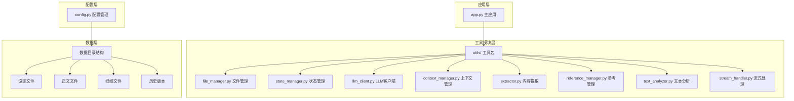

**图表来源**
- [app.py](file://app.py#L1-L713)
- [config.py](file://config.py#L1-L24)

**章节来源**
- [app.py](file://app.py#L1-L713)
- [config.py](file://config.py#L1-L24)

## 核心组件

### 应用入口 (app.py)

主应用文件是整个系统的入口点，基于Streamlit框架构建，提供了完整的用户界面和业务逻辑。

**主要功能模块：**
- API提供商配置管理
- 用户界面交互
- 业务流程编排
- 数据持久化

**章节来源**
- [app.py](file://app.py#L1-L713)

### 配置管理 (config.py)

统一管理项目的目录结构和文件路径配置。

**核心配置项：**
- 目录结构定义
- 关键文件路径
- 必需目录清单

**章节来源**
- [config.py](file://config.py#L1-L24)

## 架构总览

系统采用分层架构设计，各层职责明确，耦合度低：

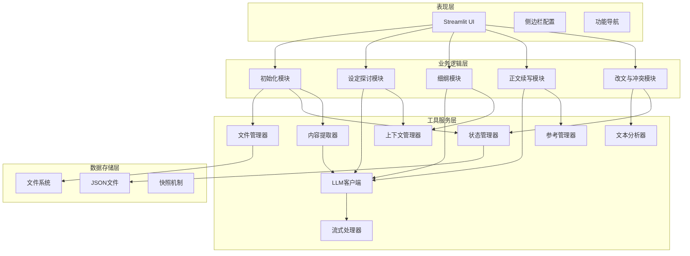

**图表来源**
- [app.py](file://app.py#L309-L713)
- [utils/llm_client.py](file://utils/llm_client.py#L1-L203)
- [utils/file_manager.py](file://utils/file_manager.py#L1-L108)

## 详细组件分析

### LLM客户端 (llm_client.py)

统一的大语言模型客户端，支持多种提供商：

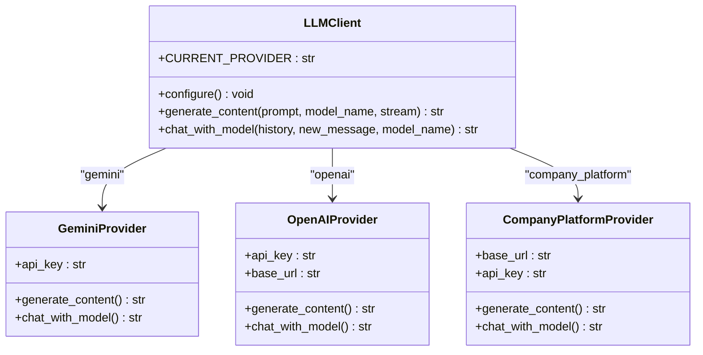

**图表来源**
- [utils/llm_client.py](file://utils/llm_client.py#L1-L203)

**实现特点：**
- 统一接口设计
- 多提供商支持
- 错误重试机制
- 流式处理支持

**章节来源**
- [utils/llm_client.py](file://utils/llm_client.py#L1-L203)

### 文件管理器 (file_manager.py)

负责文件系统的操作和管理：

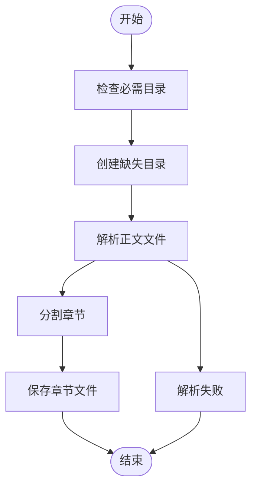

**图表来源**
- [utils/file_manager.py](file://utils/file_manager.py#L16-L108)

**核心功能：**
- 目录结构管理
- 正文文件解析
- 章节分割与保存
- 资源状态检查

**章节来源**
- [utils/file_manager.py](file://utils/file_manager.py#L1-L108)

### 状态管理器 (state_manager.py)

管理创作过程中的各种状态信息：

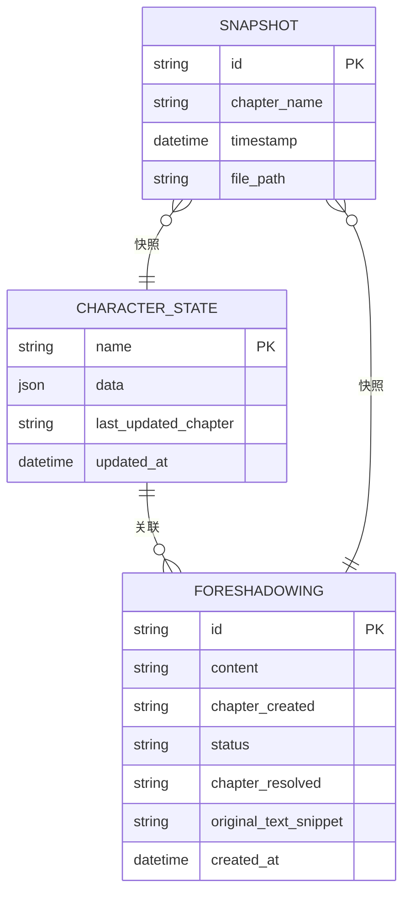

**图表来源**
- [utils/state_manager.py](file://utils/state_manager.py#L50-L77)

**功能特性：**
- JSON文件读写
- 伏笔管理
- 角色状态跟踪
- 历史版本快照

**章节来源**
- [utils/state_manager.py](file://utils/state_manager.py#L1-L77)

### 上下文管理器 (context_manager.py)

构建LLM调用所需的上下文信息：

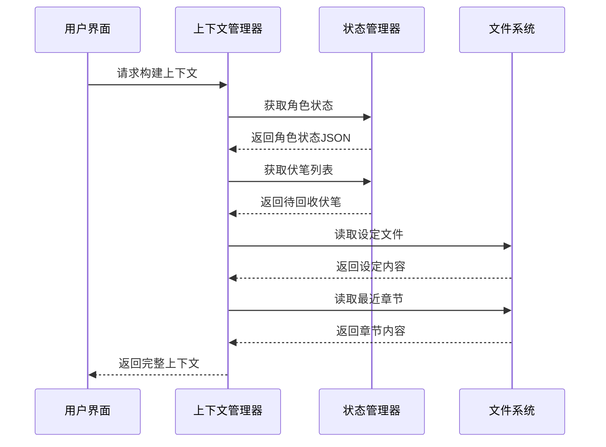

**图表来源**
- [utils/context_manager.py](file://utils/context_manager.py#L43-L92)

**章节来源**
- [utils/context_manager.py](file://utils/context_manager.py#L1-L93)

### 内容提取器 (extractor.py)

从文本中提取关键信息：

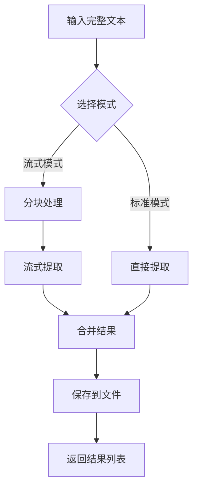

**图表来源**
- [utils/extractor.py](file://utils/extractor.py#L6-L194)

**章节来源**
- [utils/extractor.py](file://utils/extractor.py#L1-L194)

### 参考管理器 (reference_manager.py)

管理文风参考和素材样本：

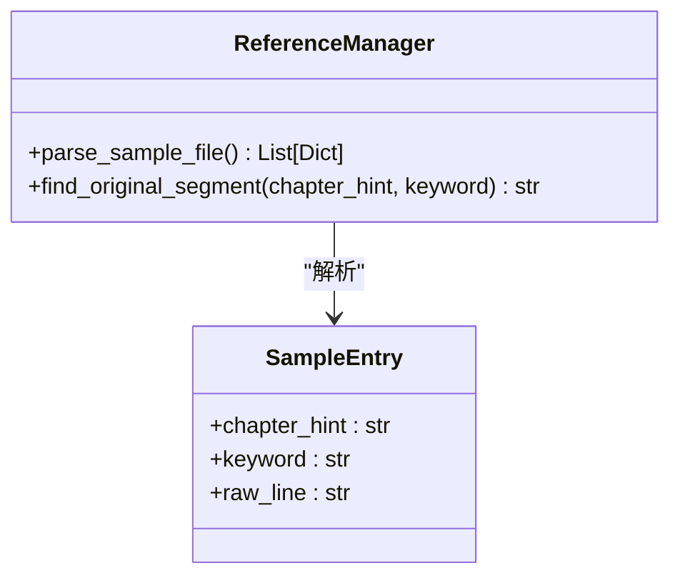

**图表来源**
- [utils/reference_manager.py](file://utils/reference_manager.py#L5-L94)

**章节来源**
- [utils/reference_manager.py](file://utils/reference_manager.py#L1-L94)

### 文本分析器 (text_analyzer.py)

提供文本差异分析和冲突检测：

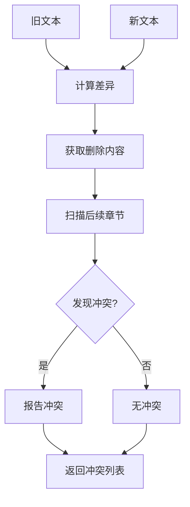

**图表来源**
- [utils/text_analyzer.py](file://utils/text_analyzer.py#L7-L63)

**章节来源**
- [utils/text_analyzer.py](file://utils/text_analyzer.py#L1-L63)

### 流式处理器 (stream_handler.py)

处理大文本的流式处理：

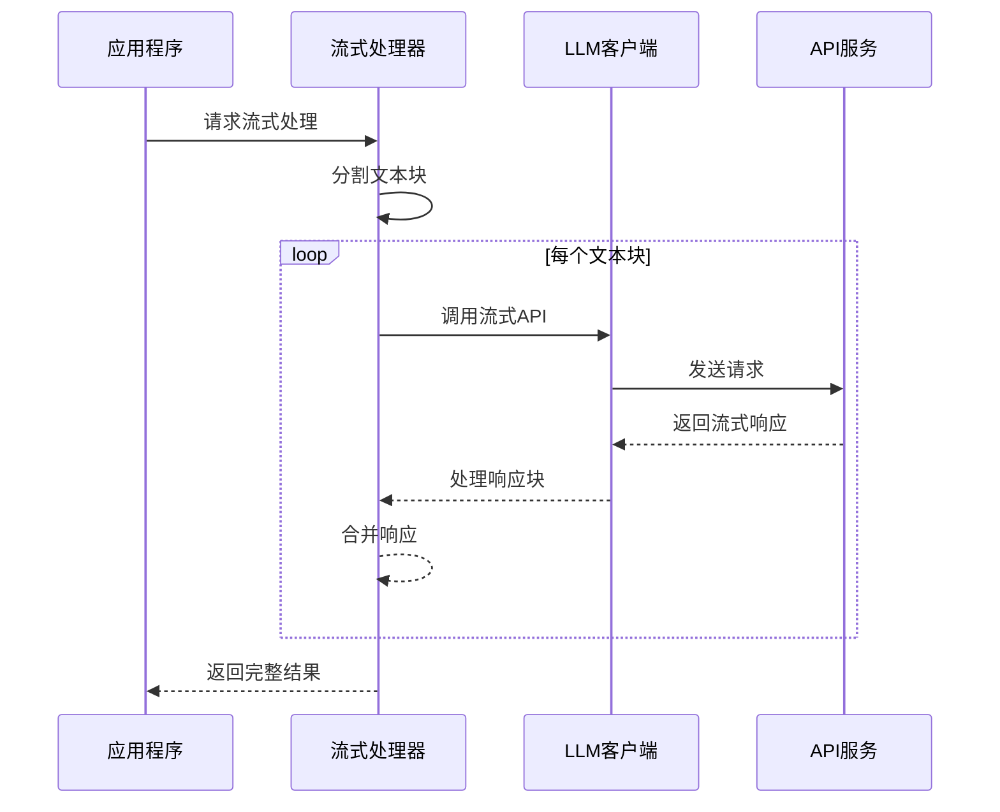

**图表来源**
- [utils/stream_handler.py](file://utils/stream_handler.py#L58-L114)

**章节来源**
- [utils/stream_handler.py](file://utils/stream_handler.py#L1-L114)

## 依赖关系分析

系统依赖关系清晰，模块间耦合度低：

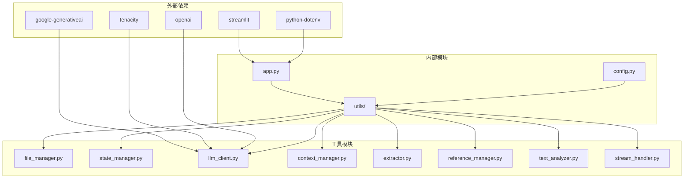

**图表来源**
- [requirements.txt](file://requirements.txt#L1-L6)
- [app.py](file://app.py#L1-L11)

**章节来源**
- [requirements.txt](file://requirements.txt#L1-L6)

## 性能考虑

### 内存优化策略

1. **流式处理**：对于大文本采用分块处理，避免内存溢出
2. **延迟加载**：只在需要时加载文件内容
3. **增量更新**：状态文件采用增量更新方式

### 网络性能优化

1. **连接复用**：OpenAI客户端支持连接池
2. **超时控制**：设置合理的超时时间
3. **重试机制**：自动重试失败的请求

### 缓存策略

1. **会话状态**：使用Streamlit会话状态缓存用户输入
2. **文件缓存**：避免重复读取相同文件
3. **API响应缓存**：对相同请求进行缓存

## 调试指南

### 开发环境调试

1. **环境变量配置**
   - 设置LLM_PROVIDER为gemini或openai
   - 配置相应的API密钥
   - 设置模型名称

2. **日志输出**
   - LLM调用错误会输出详细信息
   - 流式处理过程有进度提示
   - 文件操作异常有明确错误信息

### 常见调试场景

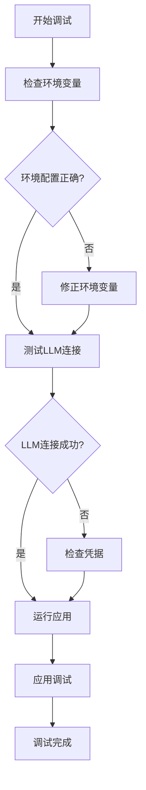

**章节来源**
- [test_company_api.py](file://test_company_api.py#L1-L25)

### 错误处理机制

系统实现了多层次的错误处理：

1. **LLM调用错误**：捕获并打印详细错误信息
2. **文件操作错误**：提供友好的错误提示
3. **网络请求错误**：包含完整的请求细节

## 测试指南

### 单元测试

建议为每个模块编写单元测试：

```python
# 示例测试结构
def test_file_manager():
    # 测试文件解析功能
    pass

def test_state_manager():
    # 测试状态保存和加载
    pass

def test_llm_client():
    # 测试LLM调用功能
    pass
```

### 集成测试

1. **端到端流程测试**
   - 完整的创作流程验证
   - 数据一致性检查
   - 错误场景模拟

2. **API集成测试**
   - 不同提供商的兼容性测试
   - 流式处理功能测试
   - 性能基准测试

### 性能测试

1. **大文本处理测试**
   - 流式处理性能
   - 内存使用情况
   - 处理速度评估

2. **并发测试**
   - 多用户同时使用
   - 资源竞争情况
   - 系统稳定性

## 代码规范

### Python编码规范

1. **命名约定**
   - 模块名：小写下划线
   - 函数名：小写下划线
   - 类名：驼峰命名
   - 常量：全大写

2. **代码格式**
   - 使用4空格缩进
   - 行宽不超过88字符
   - 适当的空行分隔逻辑块

3. **注释规范**
   - 函数必须有docstring
   - 复杂逻辑需要注释说明
   - TODO标记需要明确截止日期

### 模块设计原则

1. **单一职责**：每个模块只负责一个功能领域
2. **高内聚**：相关功能紧密组合
3. **低耦合**：模块间依赖关系清晰
4. **可测试性**：易于编写单元测试

### 错误处理规范

1. **异常类型选择**
   - 使用具体的异常类型
   - 避免捕获所有异常
   - 提供有意义的错误消息

2. **资源管理**
   - 使用with语句管理文件
   - 及时释放网络连接
   - 清理临时文件

## 版本控制与发布

### Git工作流程

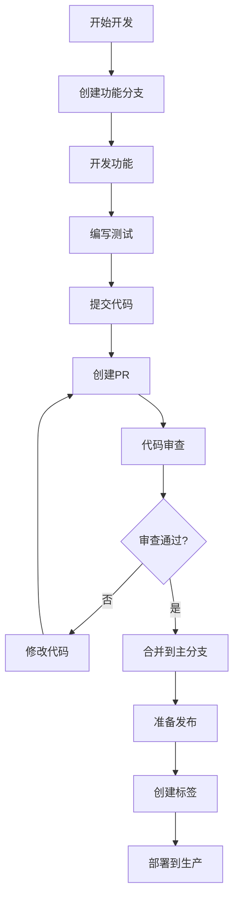

### 分支管理策略

1. **主分支保护**
   - master/main分支受保护
   - 需要审查才能合并
   - CI/CD自动化检查

2. **功能分支**
   - 功能开发在独立分支
   - 及时同步主分支更新
   - 功能完成后清理分支

### 发布策略

1. **版本号管理**
   - 遵循语义化版本
   - 明确版本发布计划
   - 变更日志维护

2. **部署流程**
   - 自动化构建和测试
   - 多环境部署策略
   - 回滚机制

## 部署与运维

### 开发环境部署

1. **环境准备**
   - Python 3.8+
   - 安装依赖包
   - 配置环境变量

2. **本地运行**
   ```bash
   streamlit run app.py
   ```

### 生产环境部署

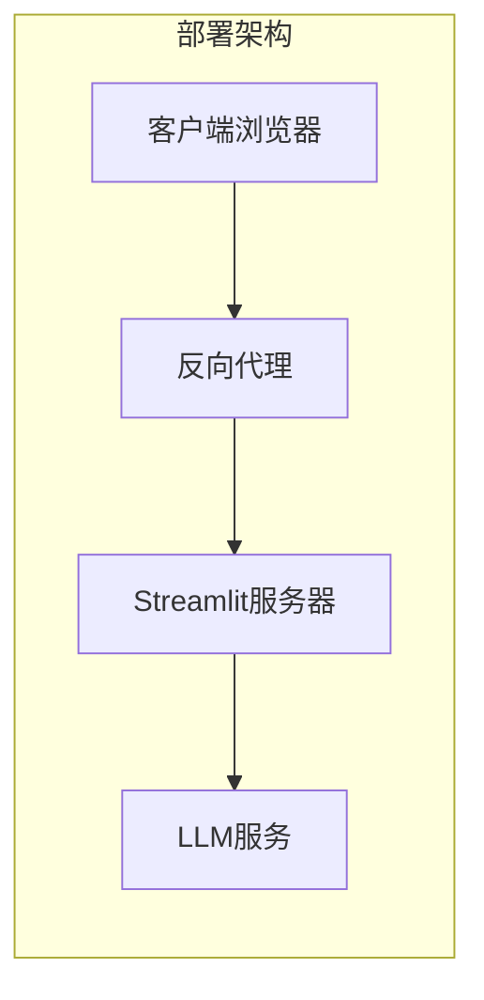

### 监控方案

1. **应用监控**
   - 响应时间监控
   - 错误率统计
   - 用户行为分析

2. **LLM服务监控**
   - API调用统计
   - 成本分析
   - 性能指标

### 日志管理

1. **日志级别**
   - DEBUG：详细调试信息
   - INFO：一般运行信息
   - WARNING：警告信息
   - ERROR：错误信息

2. **日志轮转**
   - 文件大小限制
   - 时间轮转
   - 异常邮件通知

## 故障排除

### 常见问题及解决方案

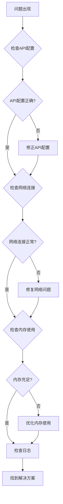

### 错误诊断步骤

1. **基本信息收集**
   - 系统版本和配置
   - 错误发生的具体步骤
   - 相关的日志信息

2. **环境检查**
   - Python版本和依赖
   - 环境变量设置
   - 网络连接状态

3. **代码审查**
   - 相关代码逻辑
   - 异常处理机制
   - 资源管理情况

### 性能问题排查

1. **内存泄漏检测**
   - 监控内存使用趋势
   - 查找未释放的对象
   - 优化数据结构

2. **CPU使用率分析**
   - 识别热点函数
   - 优化算法复杂度
   - 并行化改进

3. **I/O瓶颈分析**
   - 文件读写性能
   - 网络请求延迟
   - 缓存命中率

## 结论

镇妖狱创作引擎是一个设计良好的小说创作辅助系统，具有以下特点：

1. **模块化设计**：清晰的分层架构和模块划分
2. **多提供商支持**：灵活的LLM服务集成
3. **用户体验友好**：直观的Streamlit界面
4. **可扩展性强**：易于添加新功能和新提供商

通过遵循本文档的开发指南，开发者可以有效地参与项目开发，确保代码质量和系统稳定性。建议在开发过程中重点关注模块间的协作关系，保持代码的可维护性和可测试性。