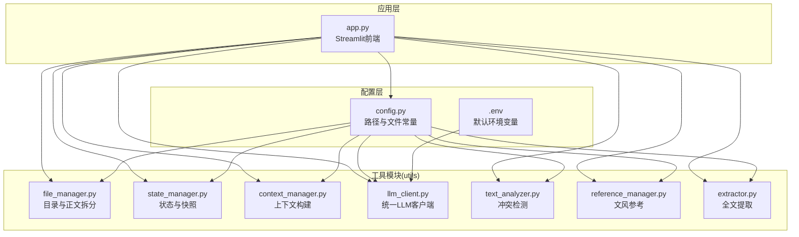
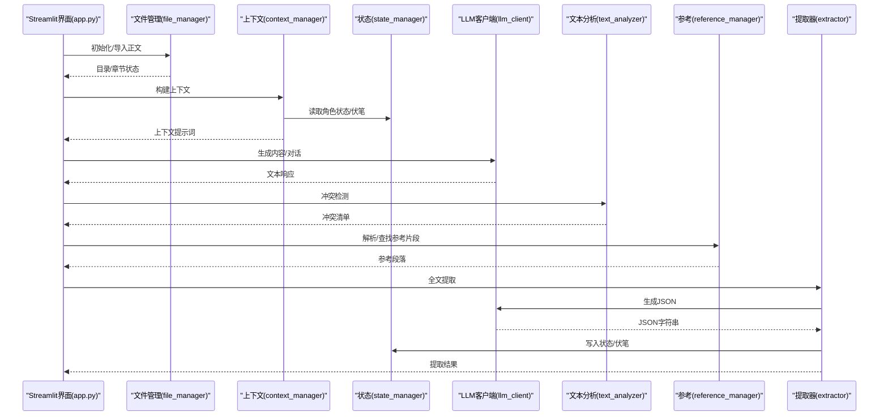
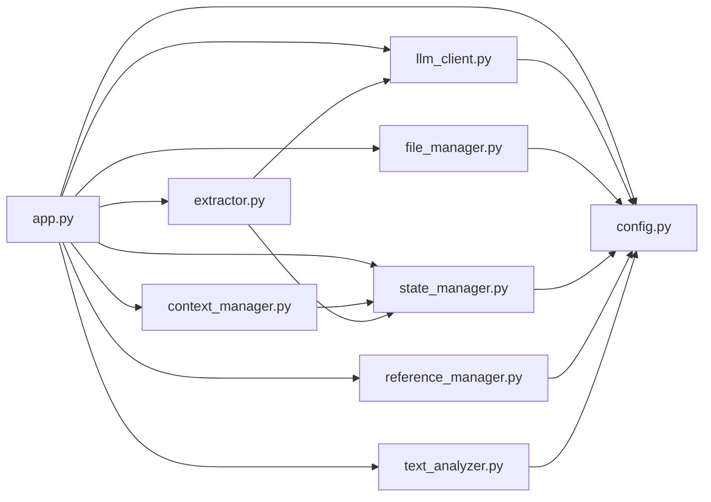

# 技术参考

<cite>
**本文引用的文件**
- [app.py](file://app.py)
- [config.py](file://config.py)
- [requirements.txt](file://requirements.txt)
- [test_company_api.py](file://test_company_api.py)
- [.env](file://.env)
- [utils/context_manager.py](file://utils/context_manager.py)
- [utils/file_manager.py](file://utils/file_manager.py)
- [utils/state_manager.py](file://utils/state_manager.py)
- [utils/llm_client.py](file://utils/llm_client.py)
- [utils/text_analyzer.py](file://utils/text_analyzer.py)
- [utils/reference_manager.py](file://utils/reference_manager.py)
- [utils/extractor.py](file://utils/extractor.py)
</cite>

## 目录
1. [简介](#简介)
2. [项目结构](#项目结构)
3. [核心组件](#核心组件)
4. [架构总览](#架构总览)
5. [详细组件分析](#详细组件分析)
6. [依赖关系分析](#依赖关系分析)
7. [性能考量](#性能考量)
8. [故障排查指南](#故障排查指南)
9. [结论](#结论)
10. [附录](#附录)

## 简介
本技术参考文档面向“镇妖狱创作引擎”，旨在为开发者提供完整、可操作的技术资料，覆盖：
- 完整API参考：公共接口、方法签名、参数说明、返回值格式与使用示例
- 核心类与模块设计模式、依赖关系与扩展点
- 数据模型定义与配置项说明
- 错误码与常见问题对照
- 代码架构图、数据流图与组件交互图
- 开发环境搭建、调试技巧与性能监控
- 单元测试与集成测试策略、部署最佳实践

## 项目结构
项目采用“功能域+工具模块”的组织方式，主应用入口通过Streamlit提供交互界面，核心逻辑由工具模块承担，配置集中于config.py，环境变量通过.env与运行时注入。

图表来源
- [app.py](file://app.py#L1-L690)
- [config.py](file://config.py#L1-L24)
- [utils/file_manager.py](file://utils/file_manager.py#L1-L108)
- [utils/state_manager.py](file://utils/state_manager.py#L1-L77)
- [utils/context_manager.py](file://utils/context_manager.py#L1-L93)
- [utils/llm_client.py](file://utils/llm_client.py#L1-L189)
- [utils/text_analyzer.py](file://utils/text_analyzer.py#L1-L63)
- [utils/reference_manager.py](file://utils/reference_manager.py#L1-L94)
- [utils/extractor.py](file://utils/extractor.py#L1-L106)
- [.env](file://.env#L1-L16)

章节来源
- [app.py](file://app.py#L1-L690)
- [config.py](file://config.py#L1-L24)

## 核心组件
- 应用入口与UI：app.py负责页面布局、侧边栏配置、功能切换与交互流程编排
- 配置中心：config.py集中管理目录与文件路径、必要目录集合
- 工具模块：围绕“正文管理、状态管理、上下文构建、LLM调用、冲突检测、文风参考、全文提取”七大能力域
- 环境变量：.env提供默认配置；运行时可通过环境变量覆盖

章节来源
- [app.py](file://app.py#L1-L690)
- [config.py](file://config.py#L1-L24)
- [.env](file://.env#L1-L16)

## 架构总览
整体采用“前端驱动 + 工具模块协作”的轻量架构。前端通过交互触发工具模块执行业务动作，工具模块之间通过配置与状态文件进行解耦协作。

图表来源
- [app.py](file://app.py#L309-L690)
- [utils/file_manager.py](file://utils/file_manager.py#L1-L108)
- [utils/context_manager.py](file://utils/context_manager.py#L1-L93)
- [utils/state_manager.py](file://utils/state_manager.py#L1-L77)
- [utils/llm_client.py](file://utils/llm_client.py#L1-L189)
- [utils/text_analyzer.py](file://utils/text_analyzer.py#L1-L63)
- [utils/reference_manager.py](file://utils/reference_manager.py#L1-L94)
- [utils/extractor.py](file://utils/extractor.py#L1-L106)

## 详细组件分析

### 应用入口与功能流(app.py)
- 页面配置与会话状态初始化
- 侧边栏提供多提供商LLM配置（Gemini、NewAPI、SiliconFlow、OpenAI兼容、公司测试平台）
- 功能区包含：初始化、探讨设定、探讨细纲、续写正文、改文与冲突提示
- 各功能分支内调用相应工具模块，形成端到端工作流

章节来源
- [app.py](file://app.py#L1-L690)

### 配置中心(config.py)
- 定义项目根目录、四大目录（参考、设定、正文、细纲、历史版本）、关键文件路径
- 提供必需目录集合，便于初始化阶段确保目录存在

章节来源
- [config.py](file://config.py#L1-L24)

### 文件管理(file_manager.py)
- ensure_directories：确保必需目录存在
- parse_chapters：基于正则解析“正文/我的正文.txt”中的章节标题与正文，返回(标题, 内容)列表
- save_chapters_to_files：将解析后的章节保存为独立文件
- check_resources_status：检查关键资源文件是否存在

章节来源
- [utils/file_manager.py](file://utils/file_manager.py#L1-L108)

### 状态管理(state_manager.py)
- JSON读写封装：load_json/save_json
- 伏笔管理：get/save_foreshadowing、add_foreshadowing、create_snapshot
- 角色状态：get/save_character_state、update_character
- 快照机制：章节级状态文件复制至历史版本目录，命名包含章节与时间戳

章节来源
- [utils/state_manager.py](file://utils/state_manager.py#L1-L77)

### 上下文构建(context_manager.py)
- get_sorted_chapters：按章节编号排序的文件列表
- get_recent_chapters_content：拼接最近N章正文
- get_settings_summary：汇总设定文件内容
- build_context_prompt：组合“角色状态/待回收伏笔/设定/最近剧情/当前任务”形成完整提示词

章节来源
- [utils/context_manager.py](file://utils/context_manager.py#L1-L93)

### LLM客户端(llm_client.py)
- configure：根据LLM_PROVIDER选择Gemini或OpenAI兼容路径，校验API Key
- generate_content：统一生成接口，支持重试（tenacity）
- chat_with_model：统一对话接口，支持历史消息
- 特殊处理：公司测试平台URL包含/chat/completions时走HTTP请求直连，否则走OpenAI SDK

章节来源
- [utils/llm_client.py](file://utils/llm_client.py#L1-L189)

### 文本分析(text_analyzer.py)
- get_text_diff：基于difflib计算删除/替换片段
- scan_chapters_for_conflict：扫描后续章节是否残留被删除的关键字

章节来源
- [utils/text_analyzer.py](file://utils/text_analyzer.py#L1-L63)

### 参考管理(reference_manager.py)
- parse_sample_file：解析“大神素材样本.txt”，提取章节提示与关键词
- find_original_segment：在原著中定位并返回关键词附近上下文

章节来源
- [utils/reference_manager.py](file://utils/reference_manager.py#L1-L94)

### 全文提取(extractor.py)
- extract_all_from_text：向LLM请求提取角色状态、伏笔、设定、剧情回顾，清洗并解析JSON
- save_extracted_data：将提取结果写入对应文件，补充缺失字段并规范化

章节来源
- [utils/extractor.py](file://utils/extractor.py#L1-L106)

## 依赖关系分析

图表来源
- [app.py](file://app.py#L1-L690)
- [config.py](file://config.py#L1-L24)
- [utils/context_manager.py](file://utils/context_manager.py#L1-L93)
- [utils/state_manager.py](file://utils/state_manager.py#L1-L77)
- [utils/llm_client.py](file://utils/llm_client.py#L1-L189)
- [utils/file_manager.py](file://utils/file_manager.py#L1-L108)
- [utils/text_analyzer.py](file://utils/text_analyzer.py#L1-L63)
- [utils/reference_manager.py](file://utils/reference_manager.py#L1-L94)
- [utils/extractor.py](file://utils/extractor.py#L1-L106)

## 性能考量
- LLM调用超时与重试：llm_client对OpenAI SDK与公司平台均设置较长超时与重试策略，降低网络抖动影响
- 上下文构建：context_manager按需拼接最近N章正文，建议N值结合正文体量与内存限制权衡
- 文件IO：file_manager与reference_manager涉及全文读取，建议对超大文件引入章节偏移缓存优化
- JSON序列化：state_manager与extractor对JSON写入使用UTF-8与缩进，便于人工审阅但增大体积，可按场景调整

[本节为通用性能建议，无需特定文件来源]

## 故障排查指南
- LLM连接失败
  - 检查环境变量：LLM_PROVIDER、OPENAI_API_KEY、OPENAI_BASE_URL、GOOGLE_API_KEY、GEMINI_MODEL_NAME
  - 使用测试脚本验证：test_company_api.py可快速验证公司平台连通性
  - 查看详细错误日志：llm_client在异常时打印模型、URL、Key长度、错误类型与堆栈
- 正文导入失败
  - 确认“我的正文.txt”格式是否符合章节标题规范
  - 检查file_manager.parse_chapters返回的章节列表是否为空
- 冲突检测无结果
  - 确认删除/替换片段长度是否过短（当前过滤小于2字符）
  - 检查后续章节是否包含相同关键字
- 状态文件未更新
  - 确认extractor.save_extracted_data是否正确写入目标文件
  - 检查state_manager.save_character_state/save_foreshadowing是否抛出异常

章节来源
- [test_company_api.py](file://test_company_api.py#L1-L25)
- [utils/llm_client.py](file://utils/llm_client.py#L85-L99)
- [utils/file_manager.py](file://utils/file_manager.py#L16-L80)
- [utils/text_analyzer.py](file://utils/text_analyzer.py#L39-L63)
- [utils/extractor.py](file://utils/extractor.py#L57-L106)
- [utils/state_manager.py](file://utils/state_manager.py#L17-L31)

## 结论
本引擎以Streamlit为入口，围绕“正文管理、状态管理、上下文构建、LLM调用、冲突检测、文风参考、全文提取”七条主线构建创作闭环。通过清晰的模块边界与配置中心，具备良好的可扩展性与可维护性。建议后续增强：
- 对超大文件的章节偏移缓存
- LLM调用的速率限制与配额监控
- 状态文件的Schema校验与回滚机制
- 更丰富的测试用例与集成测试

[本节为总结性内容，无需特定文件来源]

## 附录

### API参考与使用示例

- file_manager.ensure_directories()
  - 功能：确保必需目录存在
  - 返回：创建成功的目录列表
  - 使用示例：参见app.py初始化功能
  - 章节来源
    - [utils/file_manager.py](file://utils/file_manager.py#L7-L14)
    - [app.py](file://app.py#L315-L320)

- file_manager.parse_chapters(file_path)
  - 功能：解析正文为章节列表
  - 参数：file_path(str)
  - 返回：[(标题, 内容)]列表
  - 使用示例：参见app.py导入正文
  - 章节来源
    - [utils/file_manager.py](file://utils/file_manager.py#L16-L80)
    - [app.py](file://app.py#L387-L395)

- file_manager.save_chapters_to_files(chapters, target_dir)
  - 功能：保存章节到独立文件
  - 参数：chapters(List[Tuple[str,str]]), target_dir(str)
  - 返回：保存文件名列表
  - 使用示例：参见app.py导入正文
  - 章节来源
    - [utils/file_manager.py](file://utils/file_manager.py#L82-L99)
    - [app.py](file://app.py#L387-L395)

- file_manager.check_resources_status()
  - 功能：检查关键资源文件存在性
  - 返回：dict包含original/sample/my_body键
  - 使用示例：参见app.py侧边栏资源状态
  - 章节来源
    - [utils/file_manager.py](file://utils/file_manager.py#L101-L107)
    - [app.py](file://app.py#L289-L307)

- state_manager.get_foreshadowing()/save_foreshadowing(data)
  - 功能：读取/保存伏笔列表
  - 参数：data(dict/list)
  - 返回：读取结果或None
  - 使用示例：参见app.py探讨设定、extractor保存
  - 章节来源
    - [utils/state_manager.py](file://utils/state_manager.py#L21-L25)
    - [app.py](file://app.py#L448-L474)
    - [utils/extractor.py](file://utils/extractor.py#L63-L84)

- state_manager.get_character_state()/save_character_state(data)
  - 功能：读取/保存角色状态
  - 参数：data(dict)
  - 返回：读取结果或None
  - 使用示例：参见context_manager构建上下文
  - 章节来源
    - [utils/state_manager.py](file://utils/state_manager.py#L27-L31)
    - [utils/context_manager.py](file://utils/context_manager.py#L54-L56)

- state_manager.add_foreshadowing(content, chapter, snippet="")
  - 功能：新增伏笔并持久化
  - 参数：content(str), chapter(str), snippet(str)
  - 返回：新增项(dict)
  - 使用示例：参见app.py改文与冲突提示
  - 章节来源
    - [utils/state_manager.py](file://utils/state_manager.py#L50-L63)
    - [app.py](file://app.py#L658-L689)

- state_manager.update_character(name, updates, chapter)
  - 功能：更新角色状态并记录章节与时间
  - 参数：name(str), updates(dict), chapter(str)
  - 返回：更新后的角色状态
  - 使用示例：参见app.py改文与冲突提示
  - 章节来源
    - [utils/state_manager.py](file://utils/state_manager.py#L65-L76)
    - [app.py](file://app.py#L658-L689)

- state_manager.create_snapshot(chapter_name)
  - 功能：为当前状态文件创建快照
  - 参数：chapter_name(str)
  - 返回：无
  - 使用示例：参见app.py改文与冲突提示
  - 章节来源
    - [utils/state_manager.py](file://utils/state_manager.py#L33-L48)
    - [app.py](file://app.py#L658-L689)

- context_manager.get_sorted_chapters()
  - 功能：按章节编号排序的文件列表
  - 返回：文件路径列表
  - 使用示例：参见app.py探讨细纲
  - 章节来源
    - [utils/context_manager.py](file://utils/context_manager.py#L6-L20)
    - [app.py](file://app.py#L603-L608)

- context_manager.get_recent_chapters_content(n)
  - 功能：拼接最近n章正文
  - 参数：n(int)
  - 返回：拼接后的文本
  - 使用示例：参见app.py探讨细纲
  - 章节来源
    - [utils/context_manager.py](file://utils/context_manager.py#L22-L32)
    - [app.py](file://app.py#L494-L496)

- context_manager.get_settings_summary()
  - 功能：汇总设定文件内容
  - 返回：拼接后的文本
  - 使用示例：参见app.py探讨细纲
  - 章节来源
    - [utils/context_manager.py](file://utils/context_manager.py#L34-L41)
    - [app.py](file://app.py#L494-L496)

- context_manager.build_context_prompt(query, recent_n)
  - 功能：构建完整提示词
  - 参数：query(str), recent_n(int)
  - 返回：完整提示词(str)
  - 使用示例：参见app.py探讨细纲
  - 章节来源
    - [utils/context_manager.py](file://utils/context_manager.py#L43-L92)
    - [app.py](file://app.py#L494-L505)

- llm_client.configure()
  - 功能：根据环境变量配置当前提供商
  - 返回：无
  - 使用示例：参见app.py各功能分支
  - 章节来源
    - [utils/llm_client.py](file://utils/llm_client.py#L9-L28)
    - [app.py](file://app.py#L436-L436)

- llm_client.generate_content(prompt, model_name)
  - 功能：统一生成接口（带重试）
  - 参数：prompt(str), model_name(str, 可选)
  - 返回：文本响应
  - 使用示例：参见app.py探讨设定、探讨细纲、续写正文
  - 章节来源
    - [utils/llm_client.py](file://utils/llm_client.py#L29-L128)
    - [app.py](file://app.py#L436-L576)

- llm_client.chat_with_model(history, new_message, model_name)
  - 功能：统一对话接口
  - 参数：history(list), new_message(str), model_name(str, 可选)
  - 返回：文本响应
  - 使用示例：参见app.py探讨设定
  - 章节来源
    - [utils/llm_client.py](file://utils/llm_client.py#L130-L189)
    - [app.py](file://app.py#L412-L442)

- text_analyzer.get_text_diff(old_text, new_text)
  - 功能：计算删除/替换片段
  - 参数：old_text(str), new_text(str)
  - 返回：片段列表
  - 使用示例：参见app.py改文与冲突提示
  - 章节来源
    - [utils/text_analyzer.py](file://utils/text_analyzer.py#L7-L37)
    - [app.py](file://app.py#L628-L632)

- text_analyzer.scan_chapters_for_conflict(search_terms, start_chapter_index, all_chapters)
  - 功能：扫描后续章节是否残留关键字
  - 参数：search_terms(list[str]), start_chapter_index(int), all_chapters(list[str])
  - 返回：冲突映射
  - 使用示例：参见app.py改文与冲突提示
  - 章节来源
    - [utils/text_analyzer.py](file://utils/text_analyzer.py#L39-L62)
    - [app.py](file://app.py#L637-L646)

- reference_manager.parse_sample_file()
  - 功能：解析“大神素材样本.txt”
  - 返回：条目列表
  - 使用示例：参见app.py续写正文
  - 章节来源
    - [utils/reference_manager.py](file://utils/reference_manager.py#L5-L47)
    - [app.py](file://app.py#L534-L549)

- reference_manager.find_original_segment(chapter_hint, keyword)
  - 功能：在原著中定位并返回上下文
  - 参数：chapter_hint(str), keyword(str)
  - 返回：片段(str)
  - 使用示例：参见app.py续写正文
  - 章节来源
    - [utils/reference_manager.py](file://utils/reference_manager.py#L49-L93)
    - [app.py](file://app.py#L544-L546)

- extractor.extract_all_from_text(full_text, model_name)
  - 功能：提取角色状态、伏笔、设定、剧情回顾
  - 参数：full_text(str), model_name(str, 可选)
  - 返回：dict或None
  - 使用示例：参见app.py初始化
  - 章节来源
    - [utils/extractor.py](file://utils/extractor.py#L6-L55)
    - [app.py](file://app.py#L344-L379)

- extractor.save_extracted_data(data)
  - 功能：保存提取结果到对应文件
  - 参数：data(dict)
  - 返回：结果列表
  - 使用示例：参见app.py初始化
  - 章节来源
    - [utils/extractor.py](file://utils/extractor.py#L57-L105)
    - [app.py](file://app.py#L370-L374)

### 数据模型定义
- 伏笔项
  - 字段：id、content、chapter_created、status、chapter_resolved、original_text_snippet、created_at
  - 来源：state_manager.add_foreshadowing
- 角色状态
  - 字段：键为角色名，值为包含status、equipment、abilities等的字典
  - 来源：state_manager.update_character
- 提取结果
  - 字段：character_state、foreshadowing、settings、outline
  - 来源：extractor.extract_all_from_text

章节来源
- [utils/state_manager.py](file://utils/state_manager.py#L50-L63)
- [utils/state_manager.py](file://utils/state_manager.py#L65-L76)
- [utils/extractor.py](file://utils/extractor.py#L6-L33)

### 配置选项说明
- 环境变量
  - LLM_PROVIDER：gemini 或 openai
  - GOOGLE_API_KEY：Gemini API Key
  - GEMINI_MODEL_NAME：默认模型名
  - OPENAI_BASE_URL：OpenAI兼容服务Base URL
  - OPENAI_API_KEY：OpenAI兼容服务API Key
  - OPENAI_MODEL_NAME：默认模型名
- 默认配置(.env)
  - 提供Gemini默认配置与SiliconFlow、公司测试平台示例注释

章节来源
- [.env](file://.env#L1-L16)
- [utils/llm_client.py](file://utils/llm_client.py#L9-L28)
- [app.py](file://app.py#L44-L76)

### 错误码与常见问题对照
- LLM调用错误
  - 典型表现：连接超时、鉴权失败、模型不可用
  - 定位手段：查看llm_client打印的模型、URL、Key长度、错误类型与堆栈
- 正文解析失败
  - 典型表现：parse_chapters返回空列表
  - 定位手段：检查章节标题格式与正则匹配
- 冲突检测无效
  - 典型表现：删除片段过短导致过滤
  - 定位手段：调整过滤阈值或改用LLM抽取变化项

章节来源
- [utils/llm_client.py](file://utils/llm_client.py#L85-L99)
- [utils/file_manager.py](file://utils/file_manager.py#L16-L80)
- [utils/text_analyzer.py](file://utils/text_analyzer.py#L39-L62)

### 开发环境搭建
- 安装依赖：pip install -r requirements.txt
- 配置环境变量：参考.env，设置LLM_PROVIDER与对应API Key
- 运行应用：streamlit run app.py
- 验证公司平台：python test_company_api.py

章节来源
- [requirements.txt](file://requirements.txt#L1-L6)
- [.env](file://.env#L1-L16)
- [test_company_api.py](file://test_company_api.py#L1-L25)

### 调试技巧
- 使用test_company_api.py快速验证公司平台连通性
- 在llm_client中观察详细错误日志，定位模型名、URL、Key长度与异常堆栈
- 对超大文件场景，考虑在reference_manager与context_manager中引入章节偏移缓存

章节来源
- [test_company_api.py](file://test_company_api.py#L1-L25)
- [utils/llm_client.py](file://utils/llm_client.py#L85-L99)

### 性能监控方法
- LLM调用耗时：在generate_content前后记录时间戳，统计平均耗时与P95
- IO瓶颈：对大文件读取增加进度条与分块处理
- 状态文件体积：定期清理冗余快照与历史版本

[本节为通用建议，无需特定文件来源]

### 单元测试与集成测试策略
- 单元测试
  - 针对llm_client：构造不同provider与异常场景，验证重试与错误日志
  - 针对file_manager：构造不同章节标题格式，验证parse_chapters
  - 针对state_manager：构造不同状态数据，验证JSON读写与快照
  - 针对text_analyzer：构造差异文本，验证get_text_diff与scan_chapters_for_conflict
  - 针对reference_manager：构造样本文件，验证parse_sample_file与find_original_segment
  - 针对extractor：构造LLM响应，验证JSON解析与保存
- 集成测试
  - 串联app.py主要功能分支，模拟从初始化到续写正文的完整流程
  - 验证状态文件在各步骤的正确更新

[本节为通用测试策略，无需特定文件来源]

### 部署最佳实践
- 将.env置于安全位置并限制访问
- 使用容器化部署，固定Python版本与依赖
- 对外部LLM服务配置健康检查与降级策略
- 对历史版本目录定期清理，控制磁盘占用

[本节为通用建议，无需特定文件来源]