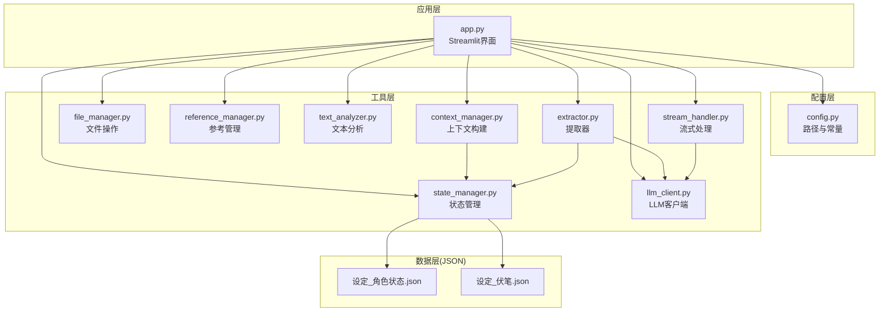
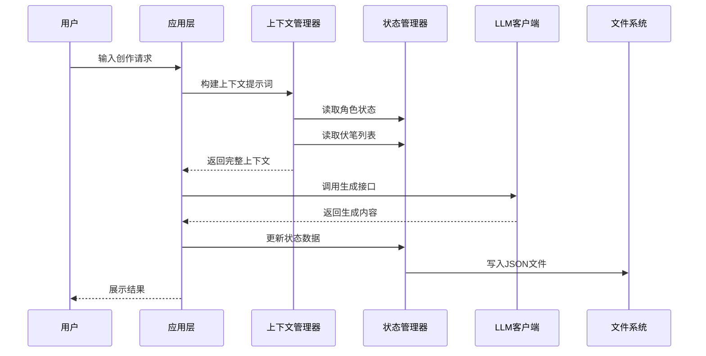
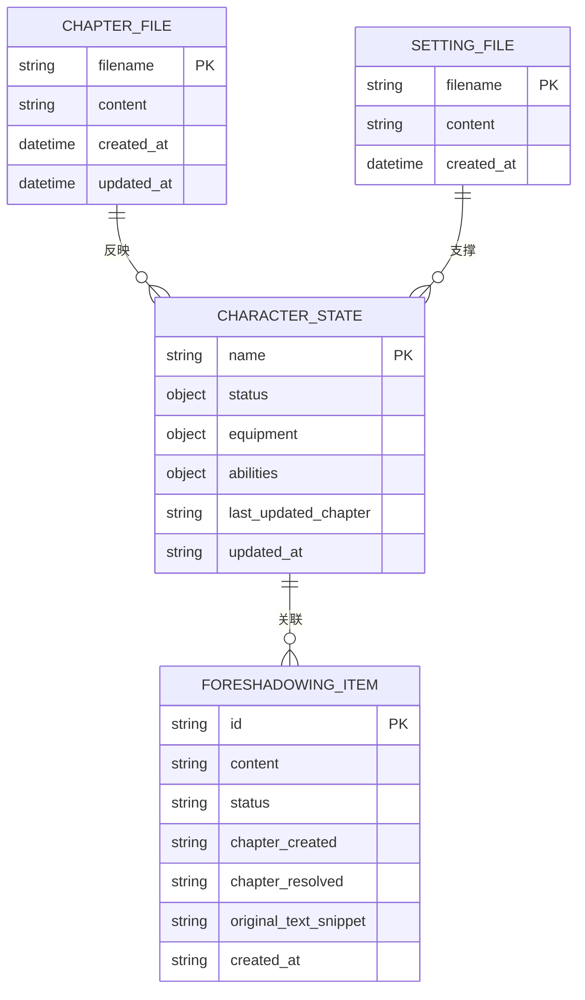
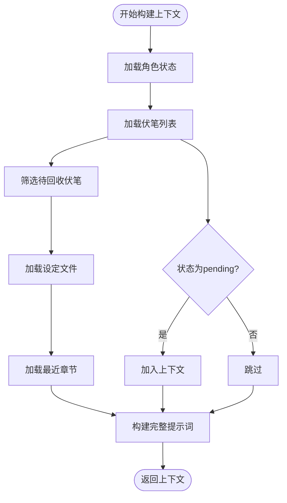
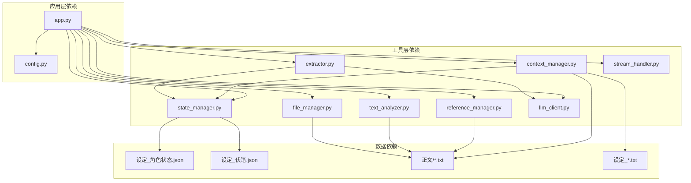

# 数据模型

<cite>
**本文档引用的文件**
- [app.py](file://app.py)
- [config.py](file://config.py)
- [设定/设定_角色状态.json](file://设定/设定_角色状态.json)
- [设定/设定_伏笔.json](file://设定/设定_伏笔.json)
- [utils/state_manager.py](file://utils/state_manager.py)
- [utils/context_manager.py](file://utils/context_manager.py)
- [utils/file_manager.py](file://utils/file_manager.py)
- [utils/reference_manager.py](file://utils/reference_manager.py)
- [utils/text_analyzer.py](file://utils/text_analyzer.py)
- [utils/extractor.py](file://utils/extractor.py)
- [utils/llm_client.py](file://utils/llm_client.py)
- [utils/stream_handler.py](file://utils/stream_handler.py)
- [requirements.txt](file://requirements.txt)
</cite>

## 目录
1. [简介](#简介)
2. [项目结构](#项目结构)
3. [核心组件](#核心组件)
4. [架构总览](#架构总览)
5. [详细组件分析](#详细组件分析)
6. [依赖关系分析](#依赖关系分析)
7. [性能考虑](#性能考虑)
8. [故障排除指南](#故障排除指南)
9. [结论](#结论)
10. [附录](#附录)

## 简介
本文件为镇妖狱创作引擎的数据模型文档，详细描述实体关系、字段定义和数据类型。文档涵盖角色状态模型（JSON格式）、伏笔列表模型、创作上下文模型和文件结构模型，说明主键/外键关系、索引和约束，解释数据验证规则和业务规则。同时提供数据库模式图和示例数据，记录数据访问模式、缓存策略和性能考虑，指定数据生命周期、保留策略和归档规则，包含数据迁移路径和版本管理，涉及数据安全、隐私要求和访问控制，说明JSON文件格式规范、字段命名约定和数据完整性保证。

## 项目结构
项目采用模块化设计，围绕创作流程的核心功能组织：
- 应用入口层：Streamlit界面与交互逻辑
- 工具层：状态管理、上下文构建、文件操作、LLM集成等
- 数据层：JSON文件存储的角色状态和伏笔数据
- 配置层：项目路径和文件常量定义



**图表来源**
- [app.py](file://app.py#L1-L713)
- [config.py](file://config.py#L1-L24)
- [utils/state_manager.py](file://utils/state_manager.py#L1-L77)
- [utils/context_manager.py](file://utils/context_manager.py#L1-L93)
- [utils/file_manager.py](file://utils/file_manager.py#L1-L108)
- [utils/reference_manager.py](file://utils/reference_manager.py#L1-L94)
- [utils/text_analyzer.py](file://utils/text_analyzer.py#L1-L63)
- [utils/extractor.py](file://utils/extractor.py#L1-L194)
- [utils/llm_client.py](file://utils/llm_client.py#L1-L203)
- [utils/stream_handler.py](file://utils/stream_handler.py#L1-L114)

**章节来源**
- [app.py](file://app.py#L1-L713)
- [config.py](file://config.py#L1-L24)

## 核心组件
本项目采用基于JSON文件的状态管理模式，通过Python模块实现数据的读取、写入、合并和快照管理。核心组件包括：
- 状态管理器：负责角色状态和伏笔数据的持久化
- 上下文管理器：构建创作所需的上下文提示词
- 文件管理器：处理正文文件的解析和章节保存
- 提取器：利用LLM从文本中抽取结构化信息
- LLM客户端：统一不同提供商的API调用

**章节来源**
- [utils/state_manager.py](file://utils/state_manager.py#L1-L77)
- [utils/context_manager.py](file://utils/context_manager.py#L1-L93)
- [utils/file_manager.py](file://utils/file_manager.py#L1-L108)
- [utils/extractor.py](file://utils/extractor.py#L1-L194)
- [utils/llm_client.py](file://utils/llm_client.py#L1-L203)

## 架构总览
系统采用分层架构，数据以JSON文件形式存储，通过Python模块进行访问和管理。整体流程包括：用户输入→上下文构建→LLM生成→状态更新→文件保存。



**图表来源**
- [utils/context_manager.py](file://utils/context_manager.py#L43-L92)
- [utils/state_manager.py](file://utils/state_manager.py#L54-L76)
- [utils/llm_client.py](file://utils/llm_client.py#L29-L142)

## 详细组件分析

### 数据模型概述
项目采用轻量级JSON文件存储方案，所有数据均以人类可读的JSON格式保存，便于版本控制和人工审查。



**图表来源**
- [utils/state_manager.py](file://utils/state_manager.py#L50-L76)
- [设定/设定_角色状态.json](file://设定/设定_角色状态.json#L1-L17)
- [设定/设定_伏笔.json](file://设定/设定_伏笔.json#L1-L23)

### 角色状态模型（JSON格式）
角色状态采用嵌套对象结构，每个角色作为顶级键，包含状态描述、装备信息和能力列表。

#### 字段定义
- **name**：字符串类型，角色唯一标识符
- **status**：字符串类型，角色当前状态、位置、伤势等描述
- **equipment**：字符串类型，角色携带的装备和道具描述
- **abilities**：字符串类型，角色掌握的功法、技能等能力描述
- **last_updated_chapter**：字符串类型，最后一次更新所处章节
- **updated_at**：ISO 8601时间戳，数据最后更新时间

#### 数据类型与约束
- 主键：角色名称（name）
- 约束：必需字段为status、equipment、abilities
- 时间格式：ISO 8601标准时间戳
- 编码：UTF-8无BOM格式

#### 示例数据
```json
{
  "沈仪": {
    "status": "气血境中期，肉身经过妖丹强化（妖骨韧性），身负血腥与煞气，正从临安城往西（柏杨城方向）逃亡",
    "equipment": "三百斤精金重刀“断山”、临安县令铜制腰牌、三颗八品妖丹（粗布包裹）、玄色劲装",
    "abilities": "《正阳气血经》（圆满）、《玄幽凝煞决》（入门）、《八荒镇魔斩》（入门）、肉身天赋：妖骨韧性",
    "last_updated_chapter": "第10章",
    "updated_at": "2026-02-02T09:43:44.054405"
  }
}
```

**章节来源**
- [utils/state_manager.py](file://utils/state_manager.py#L65-L76)
- [设定/设定_角色状态.json](file://设定/设定_角色状态.json#L1-L17)

### 伏笔列表模型
伏笔列表采用数组结构，每个元素代表一个待回收的伏笔线索。

#### 字段定义
- **id**：UUID字符串，伏笔唯一标识符
- **content**：字符串类型，伏笔内容的具体描述
- **status**：枚举类型，状态值（pending/resolved）
- **chapter_created**：字符串类型，首次出现的章节标识
- **chapter_resolved**：字符串类型，已回收的章节标识（可为空）
- **original_text_snippet**：字符串类型，原始文本片段（可为空）
- **created_at**：ISO 8601时间戳，创建时间

#### 数据类型与约束
- 主键：UUID（id）
- 约束：必需字段为content、status、chapter_created、created_at
- 状态枚举：pending（待回收）、resolved（已回收）
- 时间格式：ISO 8601标准时间戳
- 编码：UTF-8无BOM格式

#### 示例数据
```json
[
  {
    "content": "临安县令临死前透露赤狐王背后有朝中势力庇护，沈仪的真正对手可能不仅是妖魔，还有大乾朝廷的某些大人物。",
    "status": "pending",
    "chapter_created": "第9章",
    "id": "0bac3ad8-3b2d-4ba7-97bb-3a8b95957d06",
    "created_at": "2026-02-02T09:43:44.054405"
  },
  {
    "content": "沈苍天之死的真正原因及背后涉及的“大人”身份。",
    "status": "pending",
    "chapter_created": "第4章、第9章",
    "id": "c7e292d8-20a5-49d3-9868-22e767db2198",
    "created_at": "2026-02-02T09:43:44.055394"
  }
]
```

**章节来源**
- [utils/state_manager.py](file://utils/state_manager.py#L50-L63)
- [设定/设定_伏笔.json](file://设定/设定_伏笔.json#L1-L23)

### 创作上下文模型
上下文模型用于构建LLM生成所需的完整提示词，包含角色状态、伏笔信息、设定总结和最近剧情回顾。

#### 结构组成
- **角色状态**：当前所有角色的详细状态信息
- **待回收伏笔**：筛选后的未解决伏笔列表
- **世界观与设定**：各设定文件的汇总内容
- **最近剧情回顾**：最近N章正文内容
- **当前任务**：具体的创作指令或问题

#### 数据流处理


**图表来源**
- [utils/context_manager.py](file://utils/context_manager.py#L43-L92)

**章节来源**
- [utils/context_manager.py](file://utils/context_manager.py#L1-L93)

### 文件结构模型
项目采用标准化的目录结构，确保数据的有序管理和版本控制友好性。

#### 目录结构
- **根目录**：项目根路径
- **参考/**：参考资料目录
- **设定/**：创作设定目录
- **正文/**：已完成章节目录
- **细纲/**：剧情大纲目录
- **历史版本/**：状态快照目录

#### 关键文件
- **我的正文.txt**：原始正文文件
- **大神素材样本.txt**：文风参考样本
- **从斩妖除魔开始长生不死.txt**：参考原著
- **设定_角色状态.json**：角色状态数据
- **设定_伏笔.json**：伏笔线索数据

#### 文件命名约定
- 章节文件：`第XX章 名称.txt`
- 快照文件：`状态_章节名_时间戳.json`
- 设定文件：`设定_类别.txt`

**章节来源**
- [config.py](file://config.py#L6-L24)
- [utils/file_manager.py](file://utils/file_manager.py#L16-L99)

### 数据访问模式
系统采用直接文件访问模式，通过Python内置的JSON模块进行数据读写。

#### 访问模式
- **读取模式**：文件存在则解析JSON，否则返回默认值
- **写入模式**：序列化数据为JSON并写入文件
- **合并模式**：将新数据与现有数据合并后保存
- **快照模式**：复制当前状态到历史版本目录

#### 缓存策略
- **内存缓存**：Streamlit会话状态缓存用户输入
- **文件缓存**：JSON文件作为持久化存储
- **无外部缓存**：未使用Redis或其他外部缓存系统

**章节来源**
- [utils/state_manager.py](file://utils/state_manager.py#L8-L20)
- [utils/context_manager.py](file://utils/context_manager.py#L22-L32)

## 依赖关系分析



**图表来源**
- [app.py](file://app.py#L11-L11)
- [utils/context_manager.py](file://utils/context_manager.py#L4-L4)
- [utils/extractor.py](file://utils/extractor.py#L4-L4)

### 外部依赖
项目依赖以下外部库：
- **streamlit**：Web界面框架
- **google-generativeai**：Google Gemini API客户端
- **python-dotenv**：环境变量管理
- **tenacity**：重试机制
- **openai**：OpenAI兼容API客户端

**章节来源**
- [requirements.txt](file://requirements.txt#L1-L6)

## 性能考虑
基于当前的JSON文件存储方案，系统在不同场景下的性能表现如下：

### 存储性能
- **小规模数据**：JSON文件读写开销极小，响应时间通常小于100ms
- **中等规模数据**：角色状态约1KB，伏笔列表约2KB，性能表现良好
- **大规模数据**：建议分批处理或采用数据库方案

### 内存优化
- **流式处理**：大文本分块处理，避免一次性加载全部内容
- **增量更新**：只更新变化的部分，减少IO操作
- **缓存策略**：合理利用会话状态缓存用户输入

### 并发考虑
- **单用户模式**：Streamlit默认单用户，无需并发控制
- **文件锁机制**：当前实现未使用文件锁，建议在多进程场景下增加锁机制

## 故障排除指南

### 常见问题
1. **API密钥配置错误**
   - 检查环境变量是否正确设置
   - 验证API密钥格式和有效期
   
2. **文件读写异常**
   - 确认文件路径和权限
   - 检查磁盘空间和文件锁定状态

3. **LLM调用失败**
   - 检查网络连接和代理设置
   - 验证模型名称和提供商配置

### 调试方法
- 查看详细的错误日志输出
- 使用最小化示例重现问题
- 检查JSON文件格式的有效性

**章节来源**
- [utils/llm_client.py](file://utils/llm_client.py#L9-L28)
- [utils/state_manager.py](file://utils/state_manager.py#L11-L15)

## 结论
镇妖狱创作引擎采用简洁高效的JSON文件存储方案，通过模块化的Python组件实现了完整的创作辅助功能。该方案具有以下优势：
- 实现简单，易于维护和扩展
- 数据可读性强，便于人工审查和版本控制
- 与LLM集成紧密，支持智能化创作流程

建议在未来版本中考虑：
- 引入数据库支持以提升大规模数据处理能力
- 增加数据校验和约束机制
- 实现更完善的并发控制和事务管理

## 附录

### 数据验证规则
- JSON格式验证：确保文件符合JSON标准
- 字段完整性：必需字段必须存在且非空
- 数据类型验证：严格区分字符串、数字、布尔等类型
- 时间戳格式：强制使用ISO 8601标准

### 业务规则
- 角色状态更新：每次更新都会记录时间和章节信息
- 伏笔状态管理：只能在pending和resolved之间转换
- 章节排序：按章节编号进行自然排序
- 快照命名：遵循统一的命名约定

### 数据迁移路径
由于当前采用文件存储，建议的迁移策略：
1. **版本1到版本2**：添加chapter_resolved字段
2. **版本2到版本3**：引入历史版本快照功能
3. **长期演进**：考虑迁移到SQLite或其他轻量级数据库

### 安全与隐私
- API密钥存储：通过环境变量管理，不在代码中硬编码
- 文件权限：确保JSON文件的适当访问权限
- 日志脱敏：避免在日志中输出敏感信息