# 架构设计

<cite>
**本文引用的文件**
- [app.py](file://app.py)
- [config.py](file://config.py)
- [requirements.txt](file://requirements.txt)
- [test_company_api.py](file://test_company_api.py)
- [utils/context_manager.py](file://utils/context_manager.py)
- [utils/state_manager.py](file://utils/state_manager.py)
- [utils/llm_client.py](file://utils/llm_client.py)
- [utils/file_manager.py](file://utils/file_manager.py)
- [utils/text_analyzer.py](file://utils/text_analyzer.py)
- [utils/reference_manager.py](file://utils/reference_manager.py)
- [utils/extractor.py](file://utils/extractor.py)
</cite>

## 目录
1. [引言](#引言)
2. [项目结构](#项目结构)
3. [核心组件](#核心组件)
4. [架构总览](#架构总览)
5. [详细组件分析](#详细组件分析)
6. [依赖分析](#依赖分析)
7. [性能考量](#性能考量)
8. [故障排查指南](#故障排查指南)
9. [结论](#结论)
10. [附录](#附录)

## 引言
本架构设计文档面向“镇妖狱创作引擎”，目标是为基于 Streamlit 的小说创作辅助系统提供清晰的高层设计、架构模式与组件边界说明。系统围绕模块化设计、统一的 LLM 客户端抽象、事件驱动的页面流程以及状态持久化展开，覆盖从正文续写、细纲探讨、设定完善到冲突检测与状态管理的全流程。

## 项目结构
系统采用“入口应用 + 工具模块 + 配置 + 资源目录”的组织方式：
- 应用入口：app.py 负责页面布局、侧边栏配置、会话状态管理与功能路由。
- 工具模块：位于 utils/ 目录，分别承担文件管理、状态管理、上下文构建、LLM 客户端、参考素材解析、文本分析与抽取等职责。
- 配置：config.py 定义项目根目录、各工作目录与关键文件路径，确保模块间共享一致的路径契约。
- 资源：参考、设定、正文、细纲、历史版本等目录由 file_manager 确保存在；.env 用于加载环境变量。

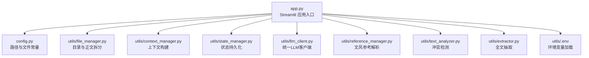

图表来源
- [app.py](file://app.py#L1-L690)
- [config.py](file://config.py#L1-L24)
- [utils/file_manager.py](file://utils/file_manager.py#L1-L108)
- [utils/context_manager.py](file://utils/context_manager.py#L1-L93)
- [utils/state_manager.py](file://utils/state_manager.py#L1-L77)
- [utils/llm_client.py](file://utils/llm_client.py#L1-L192)
- [utils/reference_manager.py](file://utils/reference_manager.py#L1-L94)
- [utils/text_analyzer.py](file://utils/text_analyzer.py#L1-L63)
- [utils/extractor.py](file://utils/extractor.py#L1-L106)

章节来源
- [app.py](file://app.py#L1-L690)
- [config.py](file://config.py#L1-L24)

## 核心组件
- 应用入口与页面控制流
  - 通过 st.sidebar 提供大模型提供商选择、API Key 与模型配置，动态设置环境变量并影响 LLM 客户端行为。
  - 通过单选框 app_mode 实现“初始化/探讨设定/探讨细纲/续写正文/改文与冲突提示”五类功能的路由。
  - 使用 st.session_state 维护消息历史、当前章节内容、参考文本等会话状态。
- 文件与资源管理
  - file_manager 负责目录创建、正文拆分与章节保存、资源文件存在性检查。
- 上下文与状态
  - context_manager 聚合最近章节、角色状态、待回收伏笔与设定摘要，构建 LLM 输入上下文。
  - state_manager 负责 JSON 文件的读写、快照创建、新增伏笔与角色状态更新。
- LLM 客户端
  - llm_client 抽象不同提供商（Gemini、OpenAI 兼容、公司内测平台）的调用差异，统一 generate_content 与 chat 接口，内置重试与超时控制。
- 参考与抽取
  - reference_manager 解析“大神素材样本”并定位原著中的参考片段，辅助文风仿写。
  - extractor 将全文交给 LLM 进行结构化抽取，产出角色状态、伏笔、设定与剧情回顾，并落地到文件。
- 文本分析
  - text_analyzer 对比编辑前后的正文，识别被删除的关键短语，并扫描后续章节是否存在残留引用，提示潜在冲突。

章节来源
- [app.py](file://app.py#L28-L278)
- [utils/file_manager.py](file://utils/file_manager.py#L1-L108)
- [utils/context_manager.py](file://utils/context_manager.py#L1-L93)
- [utils/state_manager.py](file://utils/state_manager.py#L1-L77)
- [utils/llm_client.py](file://utils/llm_client.py#L1-L192)
- [utils/reference_manager.py](file://utils/reference_manager.py#L1-L94)
- [utils/extractor.py](file://utils/extractor.py#L1-L106)
- [utils/text_analyzer.py](file://utils/text_analyzer.py#L1-L63)

## 架构总览
系统采用“页面即控制器”的 Streamlit 架构，结合工具模块实现职责分离。整体交互遵循“配置-路由-上下文-调用-持久化-展示”的闭环。

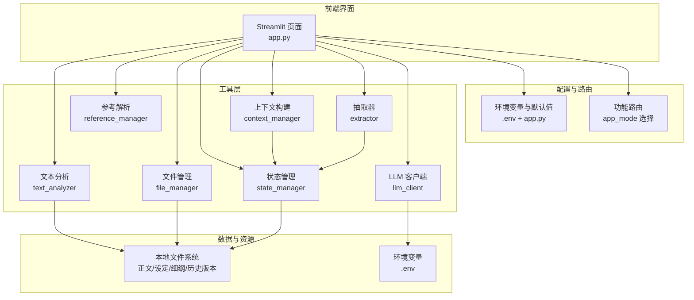

图表来源
- [app.py](file://app.py#L1-L690)
- [utils/file_manager.py](file://utils/file_manager.py#L1-L108)
- [utils/context_manager.py](file://utils/context_manager.py#L1-L93)
- [utils/state_manager.py](file://utils/state_manager.py#L1-L77)
- [utils/llm_client.py](file://utils/llm_client.py#L1-L192)
- [utils/reference_manager.py](file://utils/reference_manager.py#L1-L94)
- [utils/text_analyzer.py](file://utils/text_analyzer.py#L1-L63)
- [utils/extractor.py](file://utils/extractor.py#L1-L106)

## 详细组件分析

### 组件A：Streamlit 应用与页面控制流
- 页面配置：设置页面标题、布局与侧边栏初始状态。
- 侧边栏配置区：根据环境变量与用户选择动态切换 LLM 提供商，设置 API Key、Base URL、模型名称，并在会话状态中标记 API 配置状态。
- 功能路由：通过 app_mode 在五个功能页之间切换，每个功能页独立维护其会话状态与 UI 行为。
- 事件驱动：用户输入（选择、点击、文本框）触发 UI 更新与后续的数据处理流程。

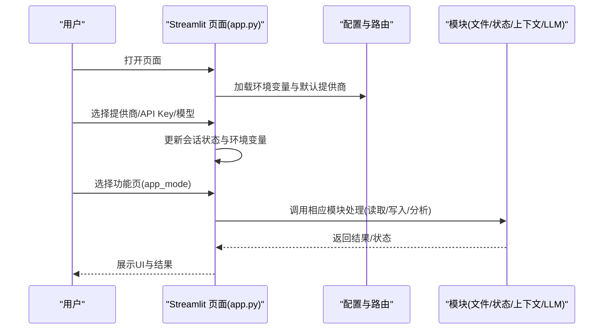

图表来源
- [app.py](file://app.py#L14-L278)

章节来源
- [app.py](file://app.py#L14-L278)

### 组件B：LLM 客户端与多提供商适配
- 抽象策略：通过环境变量 LLM_PROVIDER 选择提供商，统一 generate_content 与 chat 接口。
- 重试与超时：对 OpenAI 兼容接口使用 tenacity 实现固定间隔重试，统一设置较长超时时间。
- 特例处理：公司内测平台动态拼接端点、构造请求头与负载，兼容非标准路径。
- 错误日志：在异常分支打印详细上下文，便于调试。

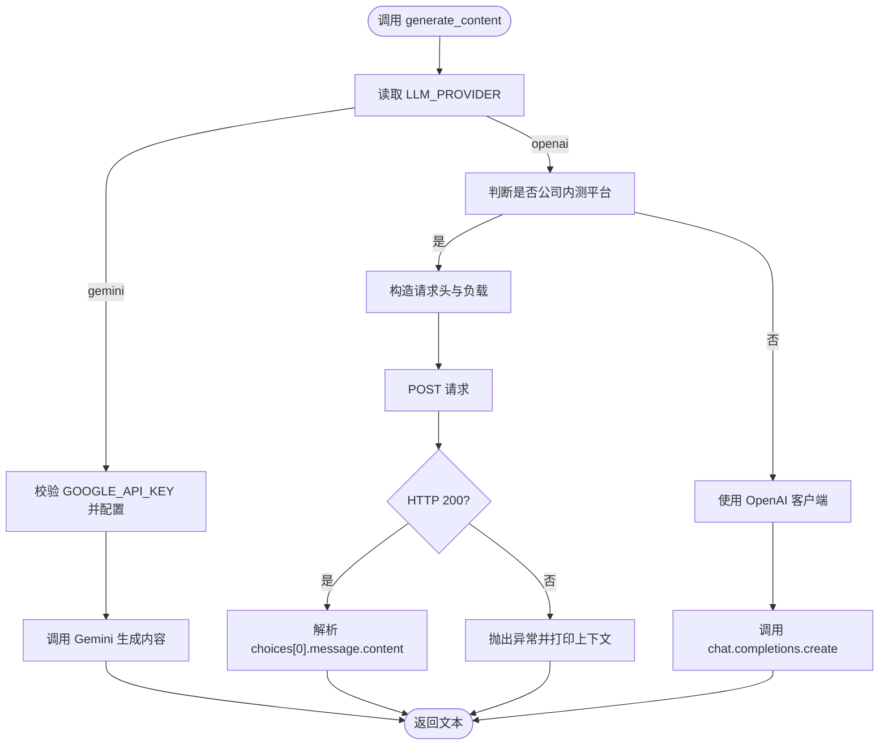

图表来源
- [utils/llm_client.py](file://utils/llm_client.py#L9-L131)

章节来源
- [utils/llm_client.py](file://utils/llm_client.py#L1-L192)
- [test_company_api.py](file://test_company_api.py#L1-L25)

### 组件C：状态管理与持久化
- 数据模型：角色状态为键为角色名的对象集合；伏笔为带状态与时间戳的条目数组。
- 快照机制：章节完成后创建快照，保留历史版本，便于回溯与审计。
- 原子操作：新增伏笔与更新角色状态均以追加/合并方式写回 JSON 文件。

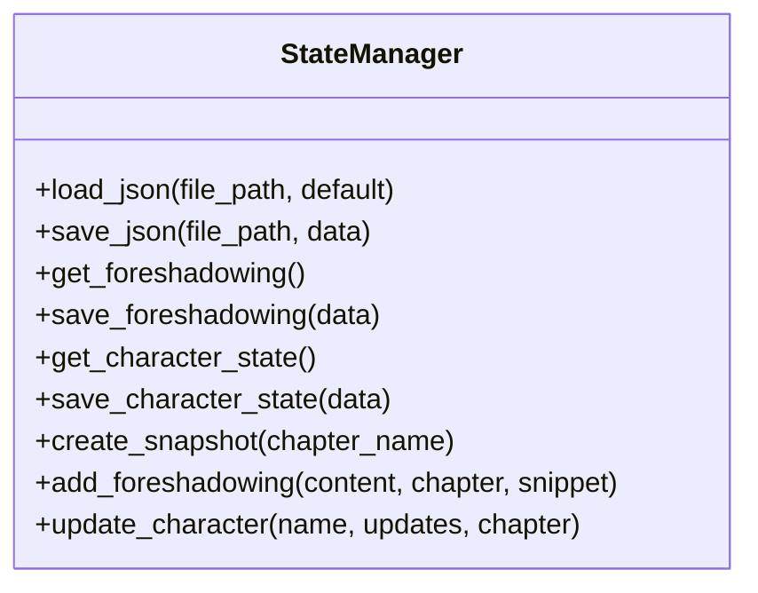

图表来源
- [utils/state_manager.py](file://utils/state_manager.py#L1-L77)

章节来源
- [utils/state_manager.py](file://utils/state_manager.py#L1-L77)

### 组件D：上下文构建与提示工程
- 上下文组成：角色状态、待回收伏笔、设定摘要、最近 N 章正文、当前任务。
- 排序与筛选：章节按编号排序，伏笔仅筛选“待回收”状态，保证上下文聚焦。
- 输出格式：将各部分拼接为结构化提示，供 LLM 生成细纲或回答问题。

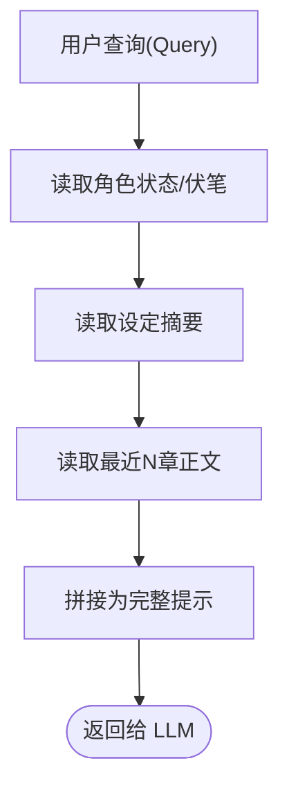

图表来源
- [utils/context_manager.py](file://utils/context_manager.py#L43-L92)

章节来源
- [utils/context_manager.py](file://utils/context_manager.py#L1-L93)

### 组件E：正文拆分与资源检查
- 正文拆分：基于章节标题正则分割，生成(标题, 内容)元组列表，再写入独立章节文件。
- 资源检查：检查“原著”“素材样本”“我的正文”是否存在，辅助引导用户准备素材。

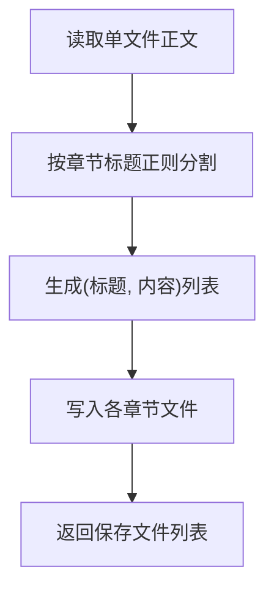

图表来源
- [utils/file_manager.py](file://utils/file_manager.py#L16-L99)

章节来源
- [utils/file_manager.py](file://utils/file_manager.py#L1-L108)

### 组件F：参考解析与文风仿写
- 样本解析：从“大神素材样本.txt”中提取“出自哪一章”与“关键词”指引，形成可选参考项。
- 原著检索：在原著中定位章节与关键词，返回上下文片段，供用户预览与仿写。

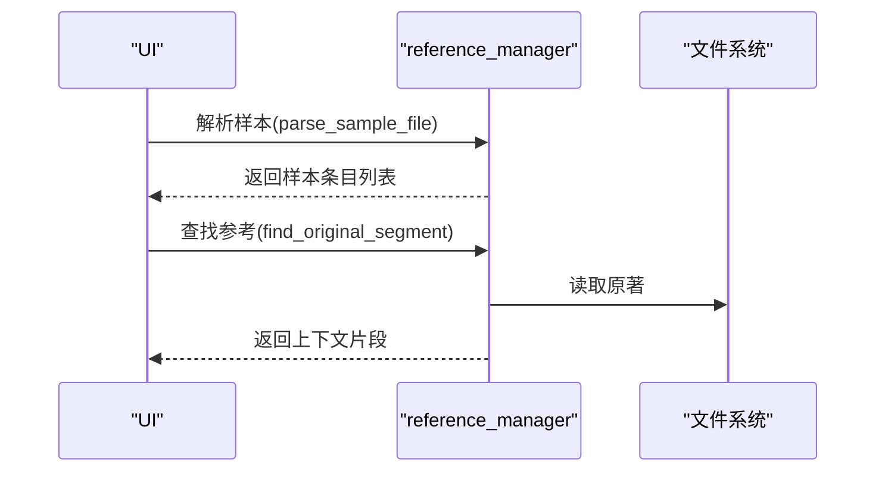

图表来源
- [utils/reference_manager.py](file://utils/reference_manager.py#L5-L94)

章节来源
- [utils/reference_manager.py](file://utils/reference_manager.py#L1-L94)

### 组件G：全文抽取与落地
- 结构化抽取：向 LLM 提交抽取提示，期望返回 JSON，清洗后写入角色状态、伏笔、设定与剧情回顾。
- 容错处理：捕获异常并打印堆栈，避免中断流程。

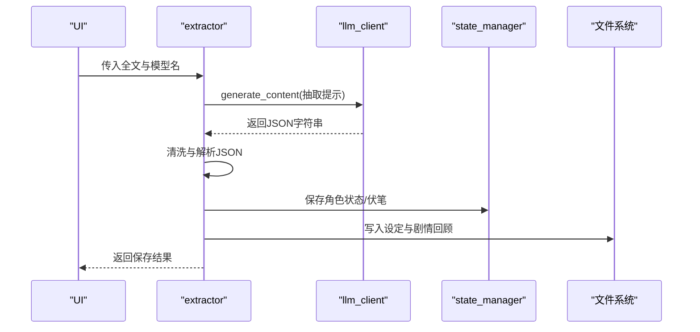

图表来源
- [utils/extractor.py](file://utils/extractor.py#L6-L106)
- [utils/llm_client.py](file://utils/llm_client.py#L30-L55)
- [utils/state_manager.py](file://utils/state_manager.py#L17-L31)

章节来源
- [utils/extractor.py](file://utils/extractor.py#L1-L106)

### 组件H：冲突检测与后续扫描
- 差异计算：使用序列相似度对比旧/新文本，提取被删除片段。
- 后续扫描：遍历后续章节，匹配删除片段，提示潜在冲突。

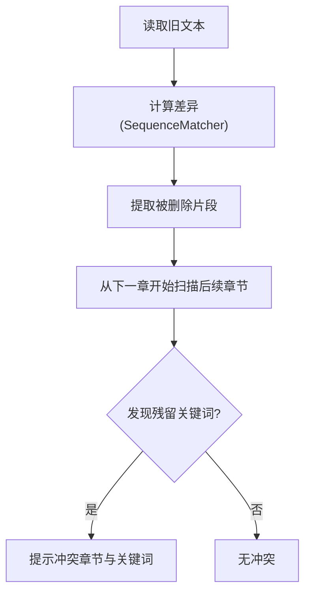

图表来源
- [utils/text_analyzer.py](file://utils/text_analyzer.py#L7-L63)

章节来源
- [utils/text_analyzer.py](file://utils/text_analyzer.py#L1-L63)

## 依赖分析
- 模块耦合
  - app.py 作为编排者，依赖 config.py 的路径常量与各工具模块；工具模块之间尽量低耦合，通过 config 协同。
  - llm_client 与 provider 解耦，通过环境变量切换；公司内测平台通过特例分支处理，避免污染通用逻辑。
  - context_manager 依赖 state_manager 读取状态；extractor 依赖 state_manager 写入状态。
- 外部依赖
  - Streamlit：页面渲染与交互。
  - google-generativeai/openai：LLM 调用。
  - python-dotenv：环境变量加载。
  - tenacity：重试控制。
- 可能的循环依赖
  - 当前模块间无直接循环导入；若未来扩展，应避免在工具模块中反向依赖 app.py。

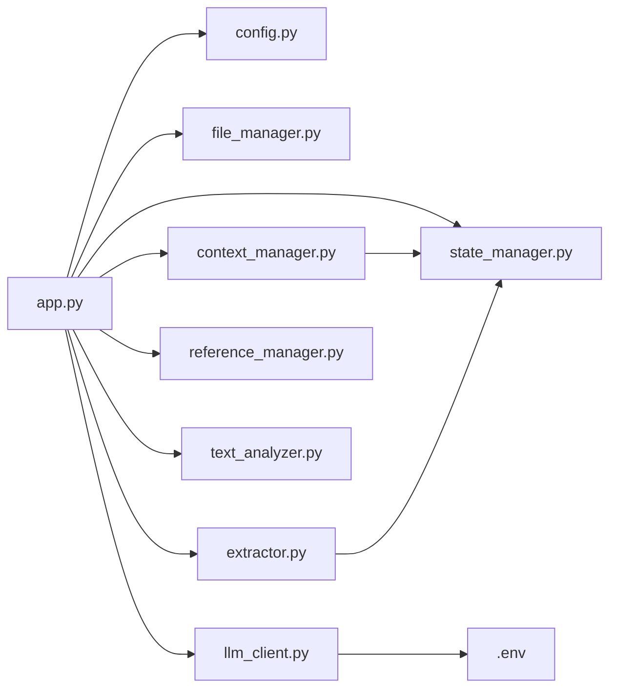

图表来源
- [app.py](file://app.py#L1-L690)
- [config.py](file://config.py#L1-L24)
- [utils/llm_client.py](file://utils/llm_client.py#L1-L192)

章节来源
- [requirements.txt](file://requirements.txt#L1-L6)

## 性能考量
- LLM 调用
  - 使用 tenacity 固定间隔重试，降低瞬时失败率；对长文本与复杂提示适当缩短上下文长度，提升响应速度。
  - 公司内测平台请求头与负载构造需避免重复拼接，建议缓存必要字段。
- 文件 I/O
  - 正文拆分与章节保存采用顺序写入，建议在批量保存时合并写入缓冲。
  - 原著检索窗口限制为固定大小，避免大文件全量扫描；可考虑章节偏移缓存以进一步优化。
- UI 体验
  - 使用 st.spinner 与 st.progress 提示长耗时操作；对大文件读取与 LLM 调用增加分片处理或增量输出。

## 故障排查指南
- LLM 连接失败
  - 检查环境变量：GOOGLE_API_KEY 或 OPENAI_API_KEY 是否正确设置；LLM_PROVIDER 与模型名是否匹配。
  - 使用 test_company_api.py 快速验证公司内测平台连通性与响应格式。
- 提示词异常
  - extractor 对 LLM 返回进行清洗与 JSON 解析，若失败打印堆栈，优先检查提示词与模型兼容性。
- 文件路径问题
  - 使用 file_manager.ensure_directories 确保目录存在；检查 config.py 中路径常量与实际目录是否一致。
- 冲突检测无效
  - 确认删除片段长度阈值与后续扫描范围；对于模糊匹配可引入关键词权重或正则增强。

章节来源
- [test_company_api.py](file://test_company_api.py#L1-L25)
- [utils/llm_client.py](file://utils/llm_client.py#L79-L102)
- [utils/extractor.py](file://utils/extractor.py#L51-L55)
- [utils/file_manager.py](file://utils/file_manager.py#L7-L14)

## 结论
该系统以 Streamlit 为前端框架，通过模块化工具实现“配置-路由-上下文-调用-持久化-展示”的闭环。LLM 客户端抽象屏蔽了多提供商差异，状态管理与上下文构建保障创作过程的连贯性，冲突检测与抽取能力提升内容质量与一致性。建议后续增强监控埋点、错误上报与配置热更新，以支撑更大规模的创作协作场景。

## 附录
- 基础设施要求
  - Python 运行时与 pip 依赖（见 requirements.txt）。
  - 本地磁盘空间：满足正文、设定、细纲与历史版本目录容量。
  - 网络访问：可访问所选 LLM 提供商的 API 端点。
- 可扩展性考虑
  - 提供商扩展：新增提供商时在 llm_client 中添加分支，保持 generate_content 接口不变。
  - 插件化提示：将提示模板化，支持外部配置文件或数据库管理。
  - 并发与缓存：对高频读取（如原著检索）引入缓存与索引。
- 部署拓扑
  - 单机部署：Streamlit 本地运行，依赖本地文件系统与网络 LLM API。
  - 远程部署：将应用打包为容器镜像，挂载持久卷存储正文与状态文件，暴露 Web 访问。
- 横切关注点
  - 安全性：敏感信息（API Key）避免硬编码，使用 .env 管理；对内测平台请求头与负载进行最小授权。
  - 监控：在关键路径（LLM 调用、文件写入、冲突扫描）埋点计数与耗时统计。
  - 灾难恢复：定期备份历史版本快照；对关键 JSON 文件进行校验与回滚策略。
- 技术栈与版本兼容
  - Streamlit、google-generativeai、openai、python-dotenv、tenacity。
  - 建议锁定依赖版本，确保跨环境一致性。
- 配置管理与状态管理
  - 配置：通过 .env 与 app.py 会话状态共同管理；优先级为环境变量 > 默认值 > 用户输入。
  - 状态：JSON 文件作为事实源，state_manager 提供统一读写接口；快照机制保障可追溯。
- 错误处理策略
  - LLM 调用：捕获异常并打印上下文，重试有限次数；对内测平台构造详细日志。
  - 文件 I/O：对缺失文件与非法路径进行降级提示与默认值填充。
  - UI 反馈：使用 st.error/st.warning/st.info 提示用户采取下一步行动。