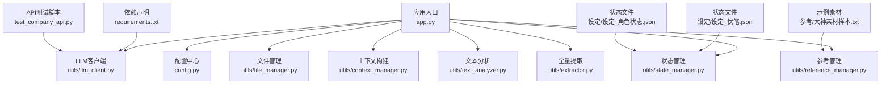
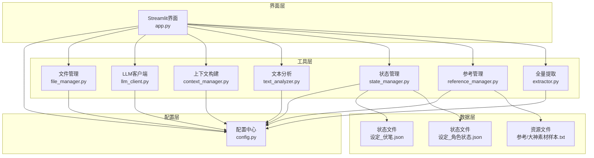
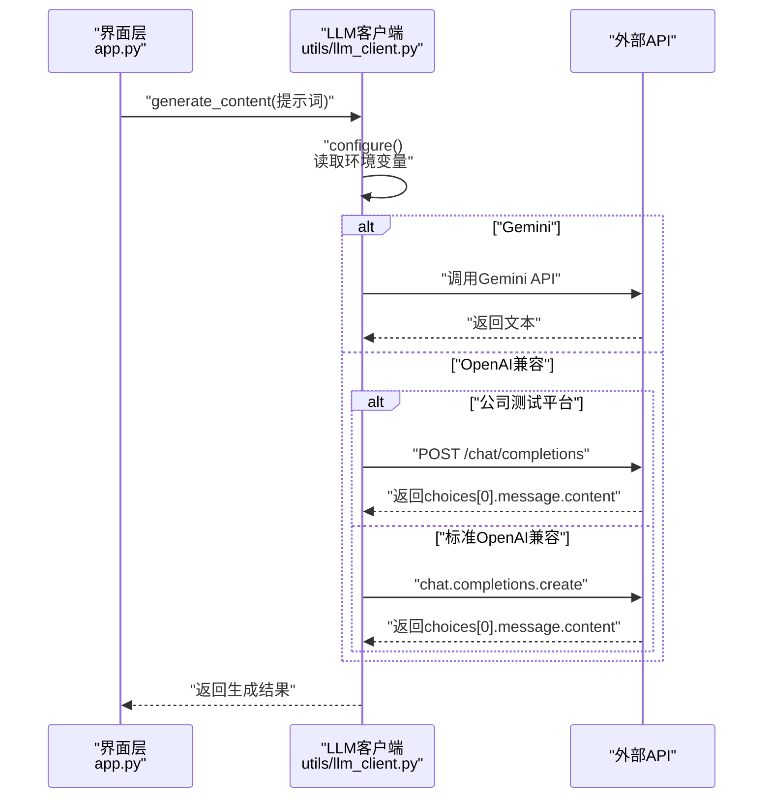
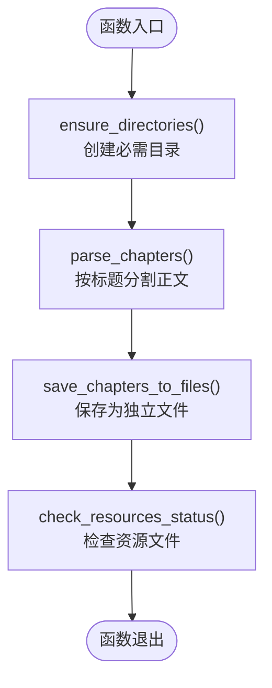
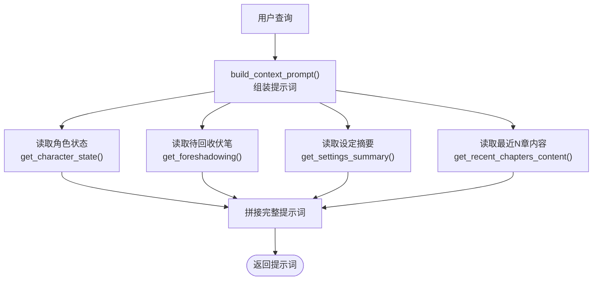
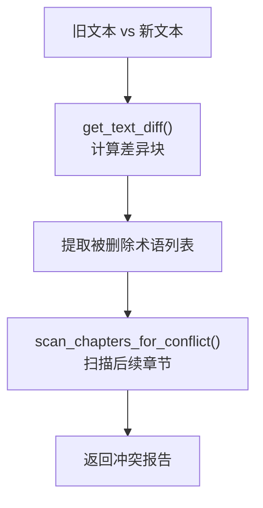
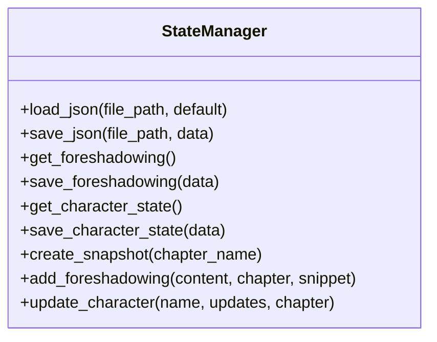
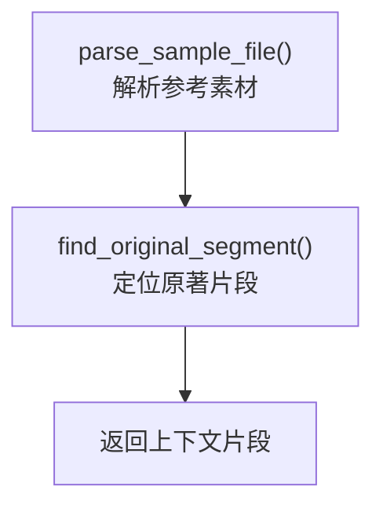
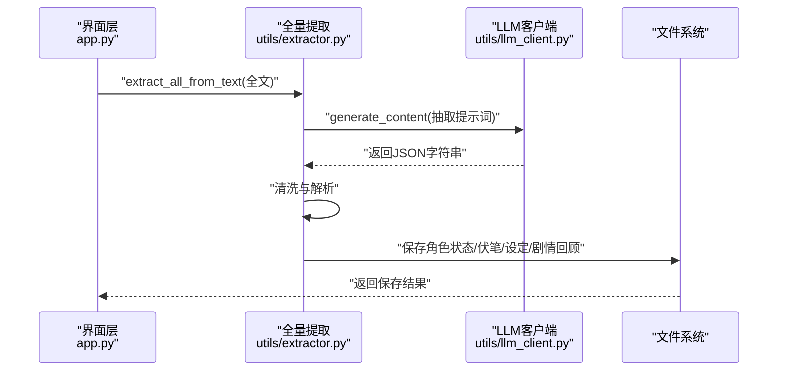
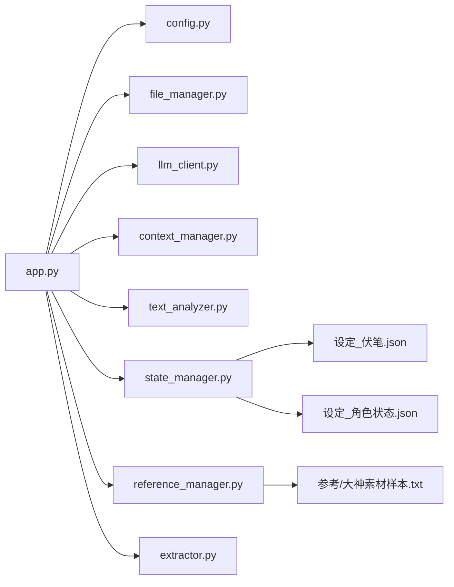

# 故障排除

<cite>
**本文引用的文件**
- [app.py](file://app.py)
- [config.py](file://config.py)
- [requirements.txt](file://requirements.txt)
- [test_company_api.py](file://test_company_api.py)
- [utils/file_manager.py](file://utils/file_manager.py)
- [utils/llm_client.py](file://utils/llm_client.py)
- [utils/context_manager.py](file://utils/context_manager.py)
- [utils/text_analyzer.py](file://utils/text_analyzer.py)
- [utils/state_manager.py](file://utils/state_manager.py)
- [utils/reference_manager.py](file://utils/reference_manager.py)
- [utils/extractor.py](file://utils/extractor.py)
- [参考/大神素材样本.txt](file://参考/大神素材样本.txt)
- [设定/设定_伏笔.json](file://设定/设定_伏笔.json)
- [设定/设定_角色状态.json](file://设定/设定_角色状态.json)
</cite>

## 目录
1. [简介](#简介)
2. [项目结构](#项目结构)
3. [核心组件](#核心组件)
4. [架构总览](#架构总览)
5. [详细组件分析](#详细组件分析)
6. [依赖关系分析](#依赖关系分析)
7. [性能考虑](#性能考虑)
8. [故障排除指南](#故障排除指南)
9. [结论](#结论)
10. [附录](#附录)

## 简介
本指南面向不同技术背景的用户，系统化梳理本项目的常见问题与解决方案，涵盖API连接问题、文件读写错误、性能瓶颈、环境配置与依赖冲突、权限问题、日志与错误追踪、以及预防性维护与健康监控建议。文档基于实际源码与配置文件，提供可操作的诊断步骤与可视化图示。

## 项目结构
项目采用模块化设计，入口为应用主程序，核心逻辑分布在工具模块中，数据与状态通过配置文件集中管理。关键目录与文件职责如下：
- 应用入口与UI：app.py
- 配置中心：config.py
- 依赖声明：requirements.txt
- API连通性测试：test_company_api.py
- 工具模块：
  - 文件管理：utils/file_manager.py
  - LLM客户端：utils/llm_client.py
  - 上下文构建：utils/context_manager.py
  - 文本分析：utils/text_analyzer.py
  - 状态管理：utils/state_manager.py
  - 参考管理：utils/reference_manager.py
  - 全量提取：utils/extractor.py
- 示例数据：
  - 参考素材：参考/大神素材样本.txt
  - 状态文件：设定/设定_伏笔.json、设定/设定_角色状态.json

图表来源
- [app.py](file://app.py#L1-L690)
- [config.py](file://config.py#L1-L24)
- [requirements.txt](file://requirements.txt#L1-L6)
- [test_company_api.py](file://test_company_api.py#L1-L25)
- [utils/file_manager.py](file://utils/file_manager.py#L1-L108)
- [utils/llm_client.py](file://utils/llm_client.py#L1-L189)
- [utils/context_manager.py](file://utils/context_manager.py#L1-L93)
- [utils/text_analyzer.py](file://utils/text_analyzer.py#L1-L63)
- [utils/state_manager.py](file://utils/state_manager.py#L1-L77)
- [utils/reference_manager.py](file://utils/reference_manager.py#L1-L94)
- [utils/extractor.py](file://utils/extractor.py#L1-L106)
- [参考/大神素材样本.txt](file://参考/大神素材样本.txt#L1-L614)
- [设定/设定_伏笔.json](file://设定/设定_伏笔.json#L1-L23)
- [设定/设定_角色状态.json](file://设定/设定_角色状态.json#L1-L17)

章节来源
- [app.py](file://app.py#L1-L690)
- [config.py](file://config.py#L1-L24)
- [requirements.txt](file://requirements.txt#L1-L6)

## 核心组件
- 应用入口与UI交互：负责侧边栏配置、功能切换、资源状态检查、以及各功能模块的触发与结果展示。
- 配置中心：统一管理项目根路径、目录与关键文件路径，确保模块间路径一致性。
- 工具模块：
  - 文件管理：目录创建、正文拆分与保存、资源文件存在性检查。
  - LLM客户端：统一API封装，支持Gemini与OpenAI兼容服务，内置重试与超时控制。
  - 上下文构建：整合角色状态、待回收伏笔、设定摘要与最近章节内容，形成完整提示词。
  - 文本分析：差异对比与后续章节冲突扫描。
  - 状态管理：JSON读写、快照创建、新增伏笔与角色状态更新。
  - 参考管理：解析参考素材，定位原著段落。
  - 全量提取：调用LLM抽取角色状态、伏笔、设定与剧情回顾，并落盘保存。

章节来源
- [app.py](file://app.py#L1-L690)
- [utils/file_manager.py](file://utils/file_manager.py#L1-L108)
- [utils/llm_client.py](file://utils/llm_client.py#L1-L189)
- [utils/context_manager.py](file://utils/context_manager.py#L1-L93)
- [utils/text_analyzer.py](file://utils/text_analyzer.py#L1-L63)
- [utils/state_manager.py](file://utils/state_manager.py#L1-L77)
- [utils/reference_manager.py](file://utils/reference_manager.py#L1-L94)
- [utils/extractor.py](file://utils/extractor.py#L1-L106)

## 架构总览
应用采用“入口驱动+工具模块”的分层架构。UI层通过会话状态与环境变量驱动工具模块，工具模块通过配置中心访问文件系统与外部API。

图表来源
- [app.py](file://app.py#L1-L690)
- [config.py](file://config.py#L1-L24)
- [utils/file_manager.py](file://utils/file_manager.py#L1-L108)
- [utils/llm_client.py](file://utils/llm_client.py#L1-L189)
- [utils/context_manager.py](file://utils/context_manager.py#L1-L93)
- [utils/text_analyzer.py](file://utils/text_analyzer.py#L1-L63)
- [utils/state_manager.py](file://utils/state_manager.py#L1-L77)
- [utils/reference_manager.py](file://utils/reference_manager.py#L1-L94)
- [utils/extractor.py](file://utils/extractor.py#L1-L106)
- [参考/大神素材样本.txt](file://参考/大神素材样本.txt#L1-L614)
- [设定/设定_伏笔.json](file://设定/设定_伏笔.json#L1-L23)
- [设定/设定_角色状态.json](file://设定/设定_角色状态.json#L1-L17)

## 详细组件分析

### LLM客户端与API连接
- 统一入口：根据环境变量选择提供商（Gemini或OpenAI兼容），并进行配置校验。
- 重试机制：对生成接口启用固定间隔重试，提升网络波动下的稳定性。
- 超时控制：默认较长超时，适配大模型推理耗时。
- 特殊平台：公司测试平台URL包含特定路径时，使用HTTP请求直连并打印详细错误信息，便于定位。

图表来源
- [utils/llm_client.py](file://utils/llm_client.py#L1-L189)
- [app.py](file://app.py#L420-L442)

章节来源
- [utils/llm_client.py](file://utils/llm_client.py#L1-L189)
- [test_company_api.py](file://test_company_api.py#L1-L25)

### 文件管理与资源状态
- 目录创建：确保必需目录存在，避免运行时报错。
- 正文拆分：按章节标题模式分割单文件正文，生成独立章节文件。
- 资源检查：检查关键文件是否存在，辅助用户定位缺失项。

图表来源
- [utils/file_manager.py](file://utils/file_manager.py#L1-L108)

章节来源
- [utils/file_manager.py](file://utils/file_manager.py#L1-L108)
- [app.py](file://app.py#L289-L307)

### 上下文构建与提示词
- 合成提示词：整合角色状态、待回收伏笔、设定摘要与最近N章内容，作为LLM输入。
- 排序与拼接：按章节编号排序，保证时间线连贯。

图表来源
- [utils/context_manager.py](file://utils/context_manager.py#L1-L93)
- [utils/state_manager.py](file://utils/state_manager.py#L1-L77)

章节来源
- [utils/context_manager.py](file://utils/context_manager.py#L1-L93)
- [utils/state_manager.py](file://utils/state_manager.py#L1-L77)

### 文本分析与冲突检测
- 差异检测：使用序列相似算法识别删除/替换片段。
- 冲突扫描：在后续章节中检索被删除关键词，提示潜在冲突。

图表来源
- [utils/text_analyzer.py](file://utils/text_analyzer.py#L1-L63)

章节来源
- [utils/text_analyzer.py](file://utils/text_analyzer.py#L1-L63)
- [app.py](file://app.py#L628-L648)

### 状态管理与快照
- JSON读写：统一异常处理，避免因文件损坏导致崩溃。
- 快照创建：章节变更时复制当前状态文件到历史目录，命名包含章节名与时间戳。

图表来源
- [utils/state_manager.py](file://utils/state_manager.py#L1-L77)

章节来源
- [utils/state_manager.py](file://utils/state_manager.py#L1-L77)

### 参考管理与原著检索
- 解析参考：从参考素材中提取“章节提示+关键词”。
- 原著定位：在原著文件中定位章节与关键词，返回上下文片段。

图表来源
- [utils/reference_manager.py](file://utils/reference_manager.py#L1-L94)

章节来源
- [utils/reference_manager.py](file://utils/reference_manager.py#L1-L94)
- [参考/大神素材样本.txt](file://参考/大神素材样本.txt#L1-L614)

### 全量提取与落盘
- LLM抽取：调用LLM生成JSON，清洗并解析。
- 落盘保存：分别写入角色状态、伏笔列表、设定总结与剧情回顾。

图表来源
- [utils/extractor.py](file://utils/extractor.py#L1-L106)
- [utils/llm_client.py](file://utils/llm_client.py#L1-L189)

章节来源
- [utils/extractor.py](file://utils/extractor.py#L1-L106)

## 依赖关系分析
- 应用入口依赖配置中心与工具模块；工具模块之间通过配置中心共享路径；状态管理与文件系统耦合；参考管理依赖示例素材；全量提取依赖LLM客户端与状态管理。
- 依赖图如下：

图表来源
- [app.py](file://app.py#L1-L690)
- [config.py](file://config.py#L1-L24)
- [utils/file_manager.py](file://utils/file_manager.py#L1-L108)
- [utils/llm_client.py](file://utils/llm_client.py#L1-L189)
- [utils/context_manager.py](file://utils/context_manager.py#L1-L93)
- [utils/text_analyzer.py](file://utils/text_analyzer.py#L1-L63)
- [utils/state_manager.py](file://utils/state_manager.py#L1-L77)
- [utils/reference_manager.py](file://utils/reference_manager.py#L1-L94)
- [utils/extractor.py](file://utils/extractor.py#L1-L106)
- [参考/大神素材样本.txt](file://参考/大神素材样本.txt#L1-L614)
- [设定/设定_伏笔.json](file://设定/设定_伏笔.json#L1-L23)
- [设定/设定_角色状态.json](file://设定/设定_角色状态.json#L1-L17)

章节来源
- [app.py](file://app.py#L1-L690)
- [config.py](file://config.py#L1-L24)

## 性能考虑
- I/O密集：章节读取、状态文件读写、参考素材解析均涉及磁盘I/O，建议：
  - 对大文件采用分块读取与缓存策略（如章节偏移缓存）。
  - 合理控制上下文长度，避免提示词过长导致API超时。
- 网络延迟：LLM调用默认较长超时，建议：
  - 在不稳定网络环境下启用重试机制，避免单次失败中断流程。
  - 对公司测试平台等特殊URL，关注HTTP状态码与响应体，及时调整超时与重试策略。
- 计算复杂度：差异检测与冲突扫描为O(N*M)（N为章节数，M为关键词数），建议：
  - 对关键词集合建立索引或前缀树，加速检索。
  - 限制扫描范围（如仅扫描未来N章）。

[本节为通用性能建议，无需列出章节来源]

## 故障排除指南

### 一、API连接问题
- 症状
  - 生成内容失败，界面提示错误信息。
  - 终端打印详细错误与堆栈。
- 常见原因
  - 缺少或错误的API密钥（Gemini或OpenAI兼容）。
  - Base URL配置错误或不可达。
  - 公司测试平台URL包含特定路径但鉴权失败。
  - 网络超时或防火墙拦截。
- 诊断步骤
  1. 检查环境变量是否正确设置（提供商、API Key、Base URL、模型名）。
  2. 使用API测试脚本验证连通性与鉴权。
  3. 查看终端输出的错误类型、状态码与堆栈信息。
  4. 对公司测试平台，确认URL中是否包含特定路径，核对API Key格式（是否已包含Bearer前缀）。
- 解决方案
  - 补充或修正环境变量，确保与平台要求一致。
  - 更换Base URL或代理，确保可达。
  - 调整超时参数与重试次数。
  - 若为公司平台，按要求保留或去除Bearer前缀。
- 相关实现参考
  - [utils/llm_client.py](file://utils/llm_client.py#L9-L29)
  - [utils/llm_client.py](file://utils/llm_client.py#L48-L99)
  - [test_company_api.py](file://test_company_api.py#L1-L25)

章节来源
- [utils/llm_client.py](file://utils/llm_client.py#L1-L189)
- [test_company_api.py](file://test_company_api.py#L1-L25)

### 二、文件读写错误
- 症状
  - 初始化或导入正文时报错，提示文件不存在或编码错误。
  - 保存章节失败或文件损坏。
- 常见原因
  - 关键文件缺失（我的正文.txt、参考原著、大神素材样本）。
  - 目录不存在或权限不足。
  - 编码问题（非UTF-8）。
- 诊断步骤
  1. 使用资源状态检查功能确认关键文件是否存在。
  2. 检查必需目录是否创建成功。
  3. 确认文件编码为UTF-8。
  4. 检查目标目录写权限。
- 解决方案
  1. 通过界面“创建/修复目录结构”与“初始化空白状态文件”完成基础准备。
  2. 将示例文件放入指定目录，确保文件名与格式符合预期。
  3. 修改文件编码或在读写时指定正确编码。
  4. 以管理员权限运行或调整目录权限。
- 相关实现参考
  - [app.py](file://app.py#L289-L307)
  - [utils/file_manager.py](file://utils/file_manager.py#L7-L14)
  - [utils/file_manager.py](file://utils/file_manager.py#L22-L26)
  - [utils/file_manager.py](file://utils/file_manager.py#L94-L96)

章节来源
- [app.py](file://app.py#L289-L307)
- [utils/file_manager.py](file://utils/file_manager.py#L1-L108)

### 三、性能问题
- 症状
  - LLM调用耗时过长、界面卡顿。
  - 大文件读取/保存缓慢。
- 常见原因
  - 提示词过长、上下文过多。
  - 磁盘I/O瓶颈、网络抖动。
- 诊断步骤
  1. 控制最近章节上下文数量，减少提示词长度。
  2. 分批处理大文件，避免一次性读取全部内容。
  3. 检查网络状况与代理设置。
- 解决方案
  1. 调整上下文构建参数（最近N章）。
  2. 优化文件拆分与保存策略，减少频繁I/O。
  3. 在公司平台场景下适当提高超时与重试次数。
- 相关实现参考
  - [utils/context_manager.py](file://utils/context_manager.py#L22-L32)
  - [utils/llm_client.py](file://utils/llm_client.py#L105-L106)

章节来源
- [utils/context_manager.py](file://utils/context_manager.py#L1-L93)
- [utils/llm_client.py](file://utils/llm_client.py#L1-L189)

### 四、环境配置问题
- 症状
  - 运行时报模块导入错误或依赖缺失。
  - Streamlit界面无法启动。
- 常见原因
  - Python虚拟环境未激活或依赖未安装。
  - .env文件未正确加载或变量名不匹配。
- 诊断步骤
  1. 确认requirements中声明的依赖均已安装。
  2. 检查.env文件是否存在，变量是否与代码读取一致。
  3. 确认Python解释器指向正确的虚拟环境。
- 解决方案
  1. 使用pip安装requirements.txt中声明的依赖。
  2. 确保环境变量加载顺序正确，优先级满足UI配置覆盖逻辑。
  3. 重启应用以刷新环境变量。
- 相关实现参考
  - [requirements.txt](file://requirements.txt#L1-L6)
  - [app.py](file://app.py#L8-L9)

章节来源
- [requirements.txt](file://requirements.txt#L1-L6)
- [app.py](file://app.py#L1-L690)

### 五、依赖包冲突
- 症状
  - 导入第三方库时报错，版本不兼容。
- 常见原因
  - 不同模块对同一库的不同版本要求冲突。
- 诊断步骤
  1. 使用pip list查看已安装版本。
  2. 检查各模块对库的版本需求。
- 解决方案
  1. 统一升级或降级到兼容版本。
  2. 使用虚拟环境隔离不同版本。
  3. 在requirements中锁定版本。
- 相关实现参考
  - [requirements.txt](file://requirements.txt#L1-L6)

章节来源
- [requirements.txt](file://requirements.txt#L1-L6)

### 六、权限问题
- 症状
  - 创建目录或写文件失败，提示权限不足。
- 常见原因
  - 当前用户对目标目录无写权限。
- 诊断步骤
  1. 检查工作目录权限。
  2. 确认目标路径是否存在且可写。
- 解决方案
  1. 以管理员权限运行或调整目录权限。
  2. 将项目移动到有写权限的路径。
- 相关实现参考
  - [utils/file_manager.py](file://utils/file_manager.py#L10-L13)
  - [utils/file_manager.py](file://utils/file_manager.py#L94-L96)

章节来源
- [utils/file_manager.py](file://utils/file_manager.py#L1-L108)

### 七、日志分析与错误追踪
- 日志输出
  - LLM调用失败时，客户端打印详细的错误类型、URL、Key长度与堆栈信息。
  - 公司测试平台调用失败时，打印请求与响应详情。
- 追踪方法
  1. 关注终端输出的错误类型与状态码。
  2. 结合堆栈定位具体调用点。
  3. 对比环境变量与实际请求参数。
- 相关实现参考
  - [utils/llm_client.py](file://utils/llm_client.py#L86-L98)
  - [utils/llm_client.py](file://utils/llm_client.py#L114-L127)
  - [utils/llm_client.py](file://utils/llm_client.py#L175-L186)

章节来源
- [utils/llm_client.py](file://utils/llm_client.py#L1-L189)

### 八、不同技术水平的故障排除策略
- 新手用户
  - 优先使用界面提供的“创建/修复目录结构”“初始化空白状态文件”等一键操作。
  - 按提示检查关键文件是否存在，确保UTF-8编码。
  - 使用API测试脚本快速验证连通性。
- 进阶用户
  - 自定义Base URL与模型名，结合重试与超时参数优化稳定性。
  - 通过日志与堆栈定位问题根因，针对性调整环境变量与网络配置。
- 高级用户
  - 扩展状态管理与文件管理的异常处理与缓存策略。
  - 对文本分析与冲突扫描进行索引优化，提升大体量数据处理效率。

[本节为通用指导，无需列出章节来源]

### 九、预防性维护与系统健康监控
- 预防措施
  - 定期备份状态文件与历史快照。
  - 控制提示词长度与上下文规模，避免API超时。
  - 保持依赖版本稳定，避免频繁升级引入冲突。
- 健康监控
  - 监控关键文件存在性与编码完整性。
  - 监控API可用性与响应时延，异常时自动告警。
  - 定期清理历史快照，避免磁盘空间膨胀。

[本节为通用建议，无需列出章节来源]

## 结论
本指南基于实际源码与配置，提供了从API连接、文件读写、性能优化到环境配置与日志分析的系统化故障排除方法。建议用户在日常使用中遵循预防性维护与健康监控策略，结合本指南的诊断步骤与可视化图示，快速定位并解决问题，保障创作流程的稳定性与连续性。

## 附录
- 关键路径速查
  - 配置中心：[config.py](file://config.py#L1-L24)
  - 目录与文件：[utils/file_manager.py](file://utils/file_manager.py#L1-L108)
  - LLM客户端：[utils/llm_client.py](file://utils/llm_client.py#L1-L189)
  - 上下文构建：[utils/context_manager.py](file://utils/context_manager.py#L1-L93)
  - 文本分析：[utils/text_analyzer.py](file://utils/text_analyzer.py#L1-L63)
  - 状态管理：[utils/state_manager.py](file://utils/state_manager.py#L1-L77)
  - 参考管理：[utils/reference_manager.py](file://utils/reference_manager.py#L1-L94)
  - 全量提取：[utils/extractor.py](file://utils/extractor.py#L1-L106)
  - 示例素材：[参考/大神素材样本.txt](file://参考/大神素材样本.txt#L1-L614)
  - 状态文件：[设定/设定_伏笔.json](file://设定/设定_伏笔.json#L1-L23)、[设定/设定_角色状态.json](file://设定/设定_角色状态.json#L1-L17)
  - API测试：[test_company_api.py](file://test_company_api.py#L1-L25)
  - 依赖声明：[requirements.txt](file://requirements.txt#L1-L6)