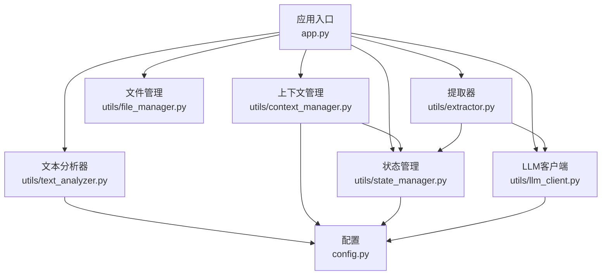
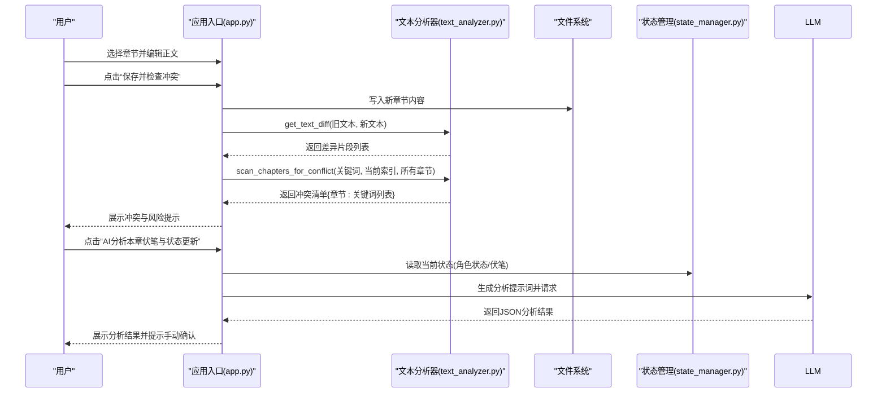
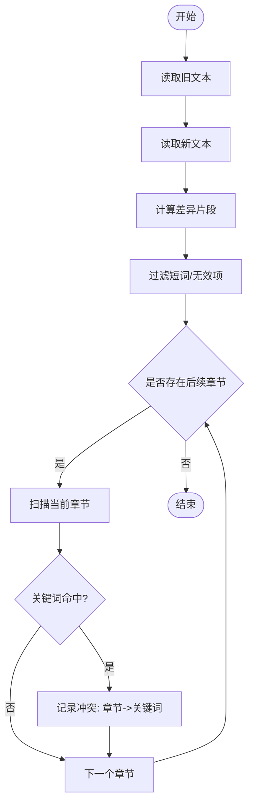
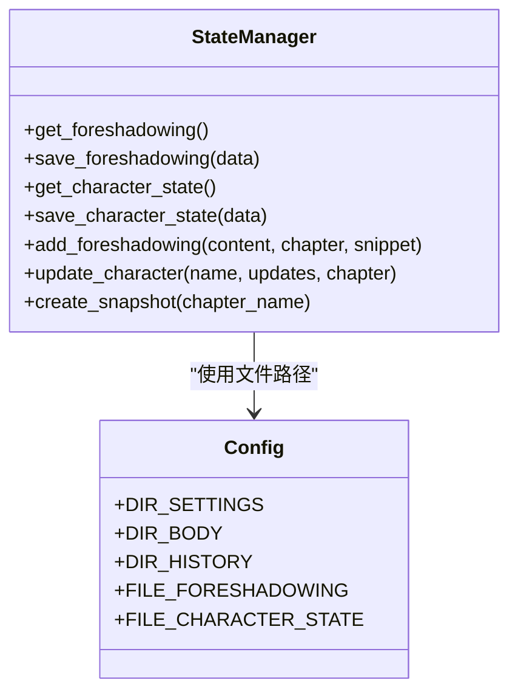
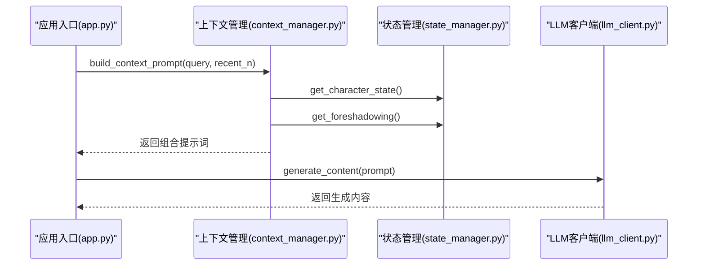
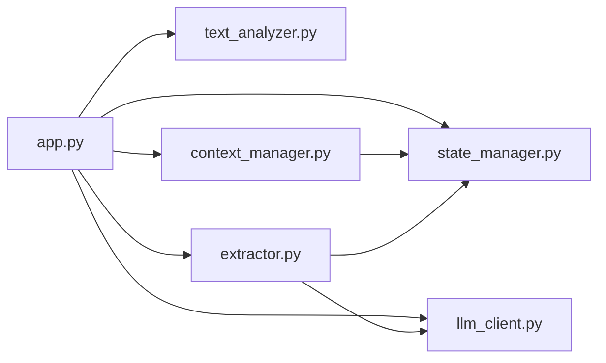

# 冲突检测机制

<cite>
**本文引用的文件**
- [app.py](file://app.py)
- [text_analyzer.py](file://utils/text_analyzer.py)
- [state_manager.py](file://utils/state_manager.py)
- [context_manager.py](file://utils/context_manager.py)
- [config.py](file://config.py)
- [file_manager.py](file://utils/file_manager.py)
- [llm_client.py](file://utils/llm_client.py)
- [extractor.py](file://utils/extractor.py)
- [设定_伏笔.json](file://设定/设定_伏笔.json)
- [设定_角色状态.json](file://设定/设定_角色状态.json)
- [我的正文1-11章.txt](file://正文/我的正文1-11章.txt)
- [大神素材样本.txt](file://参考/大神素材样本.txt)
</cite>

## 目录
1. [简介](#简介)
2. [项目结构](#项目结构)
3. [核心组件](#核心组件)
4. [架构总览](#架构总览)
5. [详细组件分析](#详细组件分析)
6. [依赖关系分析](#依赖关系分析)
7. [性能考量](#性能考量)
8. [故障排查指南](#故障排查指南)
9. [结论](#结论)
10. [附录](#附录)

## 简介
本文件面向“冲突检测机制”的技术文档，聚焦于文本差异分析、冲突扫描策略与逻辑一致性检查方法。系统通过对比章节文本的差异，提取被删除/修改的关键术语，并在后续章节中进行关键词检索，以识别潜在的伏笔破坏、角色状态矛盾与情节逻辑冲突。同时，结合状态管理系统与上下文构建，为创作流程提供闭环反馈与优化建议。

## 项目结构
项目采用模块化设计，围绕“正文编辑—差异检测—冲突扫描—状态更新—上下文构建—创作建议”形成闭环。关键模块包括：
- 应用入口与界面：负责章节选择、正文编辑、触发冲突检测与状态更新
- 文本分析器：提供文本差异提取与后续章节扫描
- 状态管理：维护伏笔与角色状态的历史快照与当前状态
- 上下文管理：整合角色状态、待回收伏笔、设定与近期剧情，构建LLM提示词
- 文件与配置：统一目录与文件命名规范，确保数据一致性
- LLM客户端：统一调用不同提供商的模型，支撑抽取与分析
- 提取器：基于LLM的全量状态抽取与保存

图表来源
- [app.py](file://app.py#L621-L713)
- [text_analyzer.py](file://utils/text_analyzer.py#L1-L63)
- [state_manager.py](file://utils/state_manager.py#L1-L77)
- [context_manager.py](file://utils/context_manager.py#L1-L93)
- [config.py](file://config.py#L1-L24)
- [file_manager.py](file://utils/file_manager.py#L1-L108)
- [llm_client.py](file://utils/llm_client.py#L1-L203)
- [extractor.py](file://utils/extractor.py#L1-L194)

章节来源
- [app.py](file://app.py#L621-L713)
- [config.py](file://config.py#L1-L24)

## 核心组件
- 文本差异分析器
  - 基于序列相似度算法，定位被替换/删除的文本片段，作为后续冲突扫描的“关键词集合”
- 冲突扫描器
  - 对后续章节进行关键词检索，输出“章节名: 关键词列表”的冲突清单
- 状态管理器
  - 维护“伏笔列表”和“角色状态”，支持创建历史快照，便于回溯与审计
- 上下文构建器
  - 融合角色状态、待回收伏笔、设定与近期剧情，为LLM提供结构化提示词
- LLM客户端与提取器
  - 统一模型调用接口，支持标准与兼容模式；提供全量状态抽取与保存

章节来源
- [text_analyzer.py](file://utils/text_analyzer.py#L7-L63)
- [state_manager.py](file://utils/state_manager.py#L21-L77)
- [context_manager.py](file://utils/context_manager.py#L43-L93)
- [llm_client.py](file://utils/llm_client.py#L29-L142)
- [extractor.py](file://utils/extractor.py#L6-L56)

## 架构总览
冲突检测流程在应用入口中被触发：用户编辑章节后保存，系统对比旧/新文本，提取差异关键词，扫描后续章节，汇总冲突并提示风险。同时，系统支持AI分析本章状态更新，辅助完善伏笔与角色状态。

图表来源
- [app.py](file://app.py#L645-L713)
- [text_analyzer.py](file://utils/text_analyzer.py#L7-L63)
- [state_manager.py](file://utils/state_manager.py#L21-L77)
- [llm_client.py](file://utils/llm_client.py#L29-L142)

## 详细组件分析

### 文本差异分析与冲突扫描
- 差异提取
  - 使用序列相似度算法，识别“替换/删除”片段，作为冲突扫描的关键词来源
  - 保留差异片段，供UI/LLM进一步分析或直接用于扫描
- 冲突扫描
  - 从当前章节之后的章节开始遍历
  - 对每个关键词进行“忽略单字符、精确包含”匹配
  - 输出“章节名: 关键词列表”的冲突清单

图表来源
- [text_analyzer.py](file://utils/text_analyzer.py#L7-L63)
- [app.py](file://app.py#L645-L676)

章节来源
- [text_analyzer.py](file://utils/text_analyzer.py#L7-L63)
- [app.py](file://app.py#L645-L676)

### 文本分析器核心算法
- 字符串匹配
  - 基于序列相似度的差异定位，保证对“删除/替换”场景的稳健识别
- 冲突识别
  - 逐关键词在后续章节中检索，采用“包含”匹配，避免误报过多
- 冲突严重程度评估
  - 当前实现以“命中即告警”，未内置权重/相似度阈值
  - 建议：引入关键词与章节文本的相似度阈值、上下文窗口评分、关键词类型权重（角色名/地名/物品名）

章节来源
- [text_analyzer.py](file://utils/text_analyzer.py#L7-L63)

### 状态管理与历史快照
- 伏笔管理
  - 支持新增、保存、读取与合并更新
  - 每个伏笔包含内容、创建章节、状态、创建时间等字段
- 角色状态
  - 以角色名为键，存储状态、装备、能力等信息
- 历史快照
  - 在章节更新或保存后创建快照，便于回溯与审计

图表来源
- [state_manager.py](file://utils/state_manager.py#L21-L77)
- [config.py](file://config.py#L18-L21)

章节来源
- [state_manager.py](file://utils/state_manager.py#L21-L77)
- [config.py](file://config.py#L18-L21)

### 上下文构建与创作建议
- 上下文构建
  - 融合角色状态、待回收伏笔、设定摘要与最近N章正文
  - 为“探讨细纲”与“智能设定探讨”提供结构化提示词
- LLM交互
  - 统一模型调用接口，支持Gemini与OpenAI兼容服务
  - 提供聊天与内容生成两种模式

图表来源
- [context_manager.py](file://utils/context_manager.py#L43-L93)
- [state_manager.py](file://utils/state_manager.py#L21-L31)
- [llm_client.py](file://utils/llm_client.py#L29-L142)
- [app.py](file://app.py#L516-L528)

章节来源
- [context_manager.py](file://utils/context_manager.py#L43-L93)
- [state_manager.py](file://utils/state_manager.py#L21-L31)
- [llm_client.py](file://utils/llm_client.py#L29-L142)
- [app.py](file://app.py#L516-L528)

### 全量状态抽取与保存
- 抽取范围
  - 角色状态、伏笔列表、世界设定、剧情回顾
- 流式处理
  - 支持分块处理长文本，降低内存占用
- 结果合并与保存
  - 合并角色状态、追加伏笔、拼接设定与大纲，并保存到对应文件

章节来源
- [extractor.py](file://utils/extractor.py#L6-L56)
- [extractor.py](file://utils/extractor.py#L57-L142)
- [extractor.py](file://utils/extractor.py#L145-L194)

## 依赖关系分析
- 组件耦合
  - 应用入口依赖文本分析器与上下文管理器；状态管理器独立但被上下文管理器引用
  - LLM客户端与提取器相互协作，共同完成状态抽取
- 外部依赖
  - Google Gemini与OpenAI兼容服务；文件系统与JSON持久化
- 潜在循环依赖
  - 当前模块间无循环导入；状态管理器仅读写JSON文件，无反向依赖

图表来源
- [app.py](file://app.py#L11-L11)
- [context_manager.py](file://utils/context_manager.py#L1-L5)
- [state_manager.py](file://utils/state_manager.py#L1-L6)
- [extractor.py](file://utils/extractor.py#L1-L4)

章节来源
- [app.py](file://app.py#L11-L11)
- [context_manager.py](file://utils/context_manager.py#L1-L5)
- [state_manager.py](file://utils/state_manager.py#L1-L6)
- [extractor.py](file://utils/extractor.py#L1-L4)

## 性能考量
- 差异扫描
  - 时间复杂度与关键词数量与后续章节数量成正比；建议限制关键词数量与扫描范围
- 文件I/O
  - 逐章节读取文本，建议在大规模章节时启用增量扫描（仅扫描新增/修改章节）
- LLM调用
  - 提示词长度与上下文融合量成正比；建议控制最近章节数量与设定摘要长度
- 流式抽取
  - 分块处理可显著降低内存峰值；建议根据网络与模型能力调整分块大小

[本节为通用性能讨论，无需列出章节来源]

## 故障排查指南
- API配置错误
  - 检查LLM提供商与密钥配置；确认模型名称与Base URL正确
- 文件缺失
  - 确认“我的正文.txt”“大神素材样本.txt”“从斩妖除魔开始长生不死.txt”存在
- 冲突检测无结果
  - 检查差异提取是否返回关键词；确认后续章节中存在关键词
- 状态更新未生效
  - 确认AI分析返回的JSON结构符合预期；手动确认状态文件内容

章节来源
- [llm_client.py](file://utils/llm_client.py#L9-L142)
- [app.py](file://app.py#L290-L307)
- [app.py](file://app.py#L681-L713)

## 结论
本冲突检测机制以“差异提取+后续章节扫描”为核心，结合状态管理与上下文构建，形成从创作到反馈的闭环。当前实现简洁可靠，适合早期验证与迭代。建议后续引入关键词权重、相似度阈值与上下文评分，以提升检测精度与减少误报；同时完善自动写入状态文件的能力，进一步优化创作流程。

[本节为总结性内容，无需列出章节来源]

## 附录

### 使用示例：检测与修复常见冲突
- 伏笔破坏
  - 现象：章节中删除了某条伏笔描述
  - 检测：保存后触发差异提取与后续扫描，若后续章节出现该伏笔关键词，则提示风险
  - 修复：补充伏笔描述或在AI分析中更新状态
- 角色状态矛盾
  - 现象：角色状态与后续章节描述不一致
  - 检测：在“探讨细纲”中构建上下文，结合角色状态与待回收伏笔，提示潜在矛盾
  - 修复：更新角色状态文件，必要时回溯历史快照
- 情节逻辑冲突
  - 现象：章节改动导致前后逻辑断裂
  - 检测：通过差异扫描与上下文构建，识别前后不一致的关键词
  - 修复：在“续写正文”中修正逻辑，或在“探讨细纲”中重新规划

章节来源
- [app.py](file://app.py#L645-L676)
- [context_manager.py](file://utils/context_manager.py#L43-L93)
- [state_manager.py](file://utils/state_manager.py#L33-L77)

### 数据模型与文件
- 伏笔列表
  - 字段：内容、状态、创建章节、唯一ID、创建时间
- 角色状态
  - 字段：状态、装备、能力、最后更新章节、更新时间
- 示例文件
  - 伏笔：[设定_伏笔.json](file://设定/设定_伏笔.json#L1-L23)
  - 角色状态：[设定_角色状态.json](file://设定/设定_角色状态.json#L1-L17)

章节来源
- [设定_伏笔.json](file://设定/设定_伏笔.json#L1-L23)
- [设定_角色状态.json](file://设定/设定_角色状态.json#L1-L17)

### 示例正文与参考
- 正文示例：[我的正文1-11章.txt](file://正文/我的正文1-11章.txt#L1-L200)
- 参考样本：[大神素材样本.txt](file://参考/大神素材样本.txt#L1-L614)

章节来源
- [我的正文1-11章.txt](file://正文/我的正文1-11章.txt#L1-L200)
- [大神素材样本.txt](file://参考/大神素材样本.txt#L1-L614)