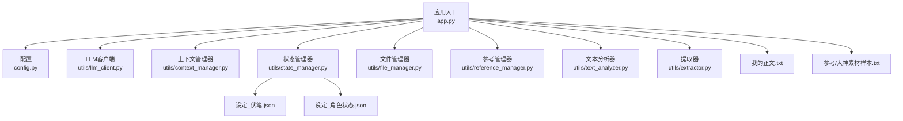
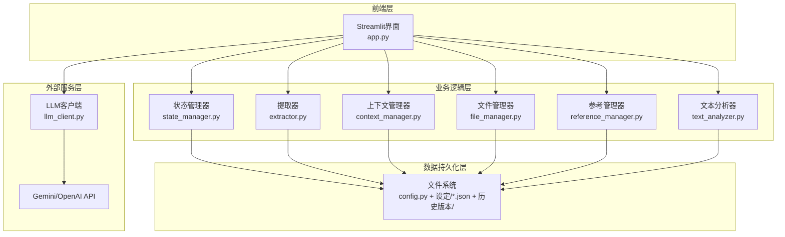
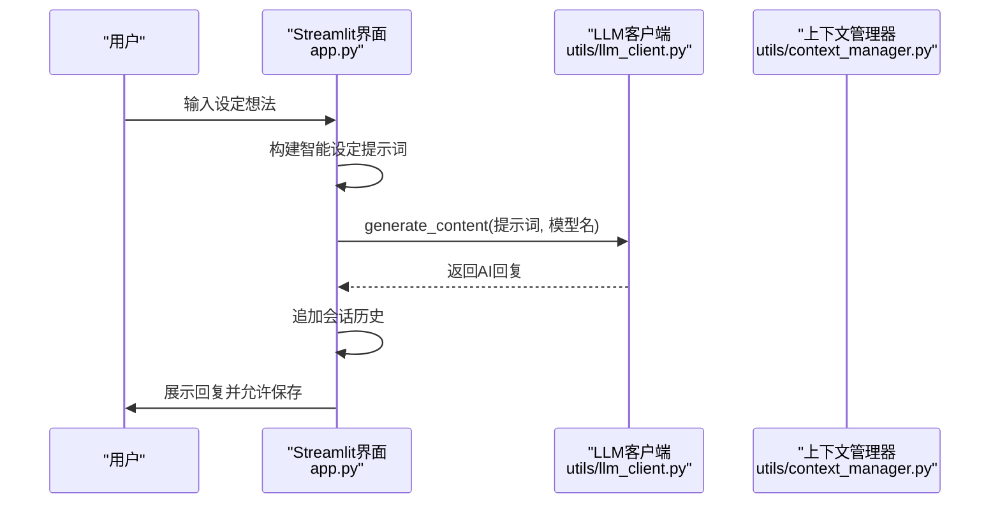
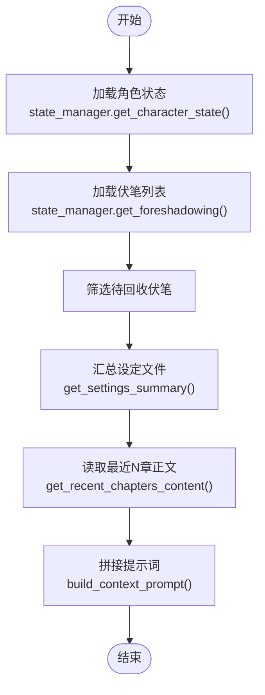
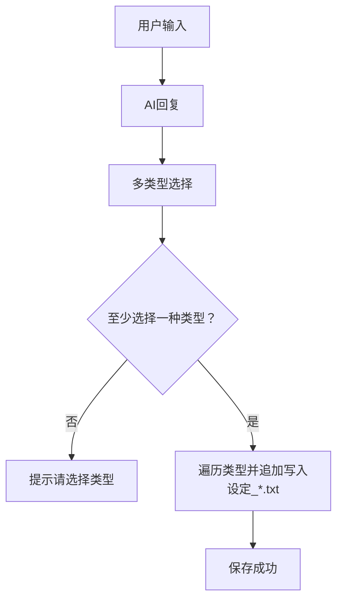
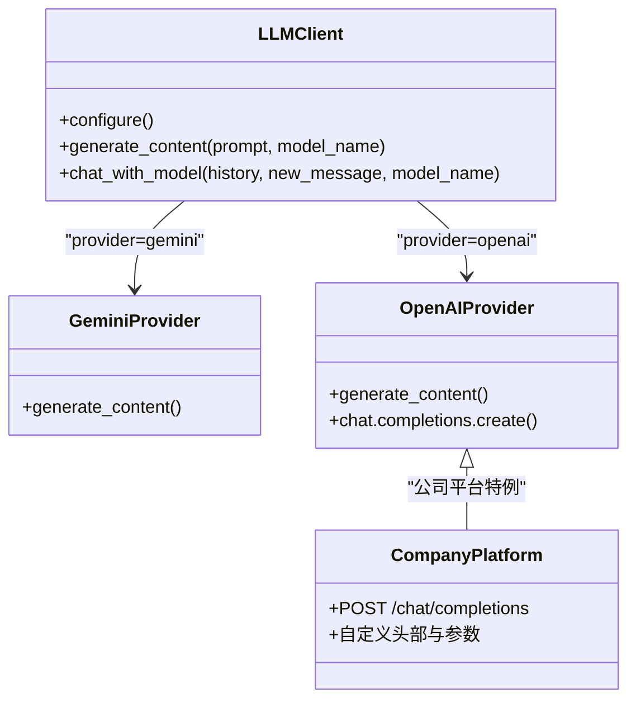
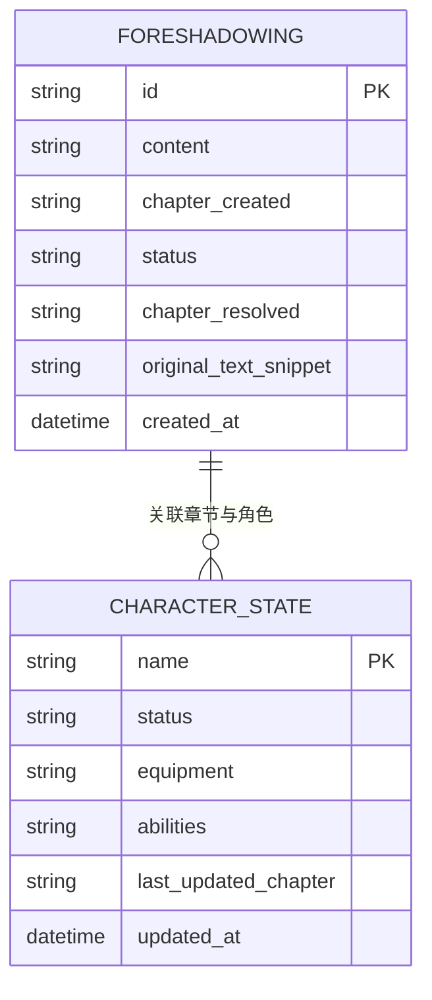
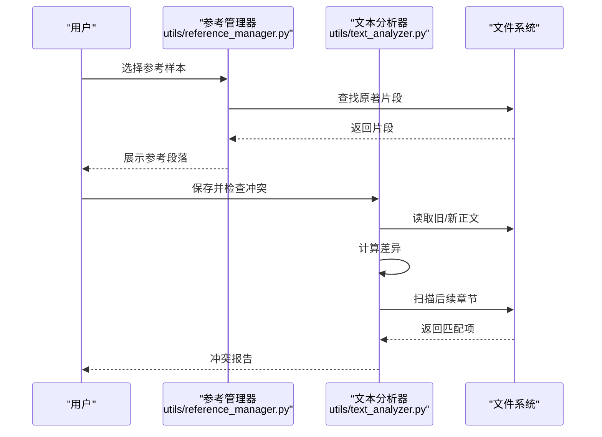
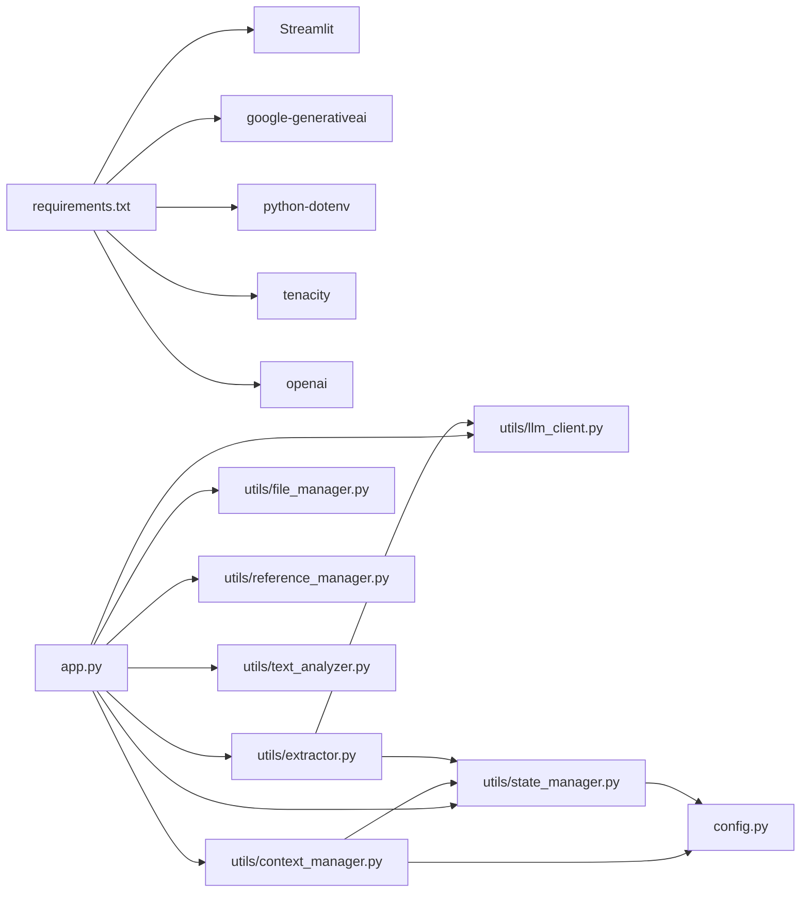

# 智能设定探讨

<cite>
**本文引用的文件**
- [app.py](file://app.py)
- [config.py](file://config.py)
- [utils/context_manager.py](file://utils/context_manager.py)
- [utils/llm_client.py](file://utils/llm_client.py)
- [utils/state_manager.py](file://utils/state_manager.py)
- [utils/file_manager.py](file://utils/file_manager.py)
- [utils/reference_manager.py](file://utils/reference_manager.py)
- [utils/text_analyzer.py](file://utils/text_analyzer.py)
- [utils/extractor.py](file://utils/extractor.py)
- [requirements.txt](file://requirements.txt)
- [设定/设定_伏笔.json](file://设定/设定_伏笔.json)
- [设定/设定_角色状态.json](file://设定/设定_角色状态.json)
- [参考/大神素材样本.txt](file://参考/大神素材样本.txt)
- [我的正文.txt](file://我的正文.txt)
</cite>

## 目录
1. [简介](#简介)
2. [项目结构](#项目结构)
3. [核心组件](#核心组件)
4. [架构总览](#架构总览)
5. [详细组件分析](#详细组件分析)
6. [依赖关系分析](#依赖关系分析)
7. [性能考量](#性能考量)
8. [故障排查指南](#故障排查指南)
9. [结论](#结论)
10. [附录](#附录)

## 简介
本功能围绕“智能设定探讨”展开，旨在通过AI助手帮助用户完善网络小说的各类设定，包括但不限于世界观、人物、势力、战力、物品、历史、规则等。系统采用对话式交互，结合上下文管理器与状态管理器，实现设定的智能分类、生成与保存，并提供与LLM客户端的无缝集成，确保设定的一致性与完整性。

## 项目结构
项目采用模块化设计，前端界面基于Streamlit，核心逻辑集中在utils包中，数据持久化通过JSON文件与目录结构实现。关键目录与文件如下：
- 应用入口：app.py
- 配置：config.py
- 工具模块：utils/*
- 设定与状态：设定/*.json、历史版本/
- 参考素材：参考/*.txt
- 正文：我的正文.txt

图表来源
- [app.py](file://app.py#L1-L690)
- [config.py](file://config.py#L1-L24)
- [utils/llm_client.py](file://utils/llm_client.py#L1-L192)
- [utils/context_manager.py](file://utils/context_manager.py#L1-L93)
- [utils/state_manager.py](file://utils/state_manager.py#L1-L77)
- [utils/file_manager.py](file://utils/file_manager.py#L1-L108)
- [utils/reference_manager.py](file://utils/reference_manager.py#L1-L94)
- [utils/text_analyzer.py](file://utils/text_analyzer.py#L1-L63)
- [utils/extractor.py](file://utils/extractor.py#L1-L106)
- [设定/设定_伏笔.json](file://设定/设定_伏笔.json#L1-L23)
- [设定/设定_角色状态.json](file://设定/设定_角色状态.json#L1-L17)
- [参考/大神素材样本.txt](file://参考/大神素材样本.txt#L1-L614)
- [我的正文.txt](file://我的正文.txt#L1-L200)

章节来源
- [app.py](file://app.py#L1-L690)
- [config.py](file://config.py#L1-L24)

## 核心组件
- 应用入口与界面：负责提供API提供商选择、模型配置、功能导航、对话界面与保存策略。
- LLM客户端：统一封装Gemini与OpenAI兼容接口，支持重试与错误日志。
- 上下文管理器：整合角色状态、伏笔、设定与近期章节内容，构建完整提示词。
- 状态管理器：负责伏笔与角色状态的读取、写入与快照。
- 文件管理器：确保目录结构、章节拆分与导入。
- 参考管理器：解析“大神素材样本”，提供文风参考。
- 文本分析器：对比正文差异，扫描后续章节潜在冲突。
- 提取器：从全文中抽取角色状态、伏笔、设定与剧情回顾。

章节来源
- [app.py](file://app.py#L398-L475)
- [utils/llm_client.py](file://utils/llm_client.py#L1-L192)
- [utils/context_manager.py](file://utils/context_manager.py#L43-L92)
- [utils/state_manager.py](file://utils/state_manager.py#L1-L77)
- [utils/file_manager.py](file://utils/file_manager.py#L1-L108)
- [utils/reference_manager.py](file://utils/reference_manager.py#L1-L94)
- [utils/text_analyzer.py](file://utils/text_analyzer.py#L1-L63)
- [utils/extractor.py](file://utils/extractor.py#L1-L106)

## 架构总览
系统采用“前端界面 + 工具模块 + 数据持久化”的分层架构。前端通过Streamlit提供交互，工具模块负责与LLM通信、构建上下文、管理状态与文件，数据持久化通过JSON与目录结构实现。

图表来源
- [app.py](file://app.py#L1-L690)
- [utils/context_manager.py](file://utils/context_manager.py#L1-L93)
- [utils/state_manager.py](file://utils/state_manager.py#L1-L77)
- [utils/extractor.py](file://utils/extractor.py#L1-L106)
- [utils/file_manager.py](file://utils/file_manager.py#L1-L108)
- [utils/reference_manager.py](file://utils/reference_manager.py#L1-L94)
- [utils/text_analyzer.py](file://utils/text_analyzer.py#L1-L63)
- [utils/llm_client.py](file://utils/llm_client.py#L1-L192)
- [config.py](file://config.py#L1-L24)

## 详细组件分析

### 智能设定探讨对话流程
- 用户输入设定想法，系统构建提示词并调用LLM生成回复。
- 将对话历史保存在会话状态中，便于后续保存与追溯。
- 支持多类型设定选择与批量保存，确保设定分类明确。

图表来源
- [app.py](file://app.py#L412-L443)
- [utils/llm_client.py](file://utils/llm_client.py#L29-L131)
- [utils/context_manager.py](file://utils/context_manager.py#L43-L92)

章节来源
- [app.py](file://app.py#L398-L475)

### 上下文构建与提示词工程
- 上下文管理器整合角色状态、待回收伏笔、设定汇总与最近N章正文，形成结构化提示词。
- 该提示词作为LLM的输入，确保生成内容与现有设定保持一致。

图表来源
- [utils/context_manager.py](file://utils/context_manager.py#L43-L92)
- [utils/state_manager.py](file://utils/state_manager.py#L21-L31)

章节来源
- [utils/context_manager.py](file://utils/context_manager.py#L43-L92)

### 设定保存策略
- 支持多类型设定选择（如世界观/地图设定、人物设定、势力/组织设定、战力/功法设定、物品/道具设定、历史/背景设定、规则/制度设定、其他特殊设定）。
- 将最后一次AI回复与用户输入组合，追加写入对应类型的文本文件，便于后续查阅与整理。

图表来源
- [app.py](file://app.py#L448-L474)

章节来源
- [app.py](file://app.py#L448-L474)

### 与LLM客户端的集成
- 支持Gemini与OpenAI兼容服务，自动根据环境变量选择提供商与模型。
- 对公司内部测试平台进行特殊处理，动态构造请求端点与头部。
- 统一异常处理与重试机制，提升稳定性。

图表来源
- [utils/llm_client.py](file://utils/llm_client.py#L9-L131)

章节来源
- [utils/llm_client.py](file://utils/llm_client.py#L1-L192)

### 设定状态与一致性保障
- 通过状态管理器维护“伏笔”与“角色状态”，支持新增、更新与快照。
- 结合提取器从全文中抽取设定，自动写入对应文件，减少手工维护成本。
- 历史版本目录用于保存状态快照，便于回溯与审计。

图表来源
- [utils/state_manager.py](file://utils/state_manager.py#L50-L76)
- [utils/extractor.py](file://utils/extractor.py#L57-L105)
- [设定/设定_伏笔.json](file://设定/设定_伏笔.json#L1-L23)
- [设定/设定_角色状态.json](file://设定/设定_角色状态.json#L1-L17)

章节来源
- [utils/state_manager.py](file://utils/state_manager.py#L1-L77)
- [utils/extractor.py](file://utils/extractor.py#L1-L106)

### 文风参考与冲突检测
- 参考管理器解析“大神素材样本”，提供文风参考与关键词定位。
- 文本分析器对比正文差异，扫描后续章节是否存在被删除/修改的关键信息，辅助冲突检测。

图表来源
- [utils/reference_manager.py](file://utils/reference_manager.py#L1-L94)
- [utils/text_analyzer.py](file://utils/text_analyzer.py#L1-L63)

章节来源
- [utils/reference_manager.py](file://utils/reference_manager.py#L1-L94)
- [utils/text_analyzer.py](file://utils/text_analyzer.py#L1-L63)

## 依赖关系分析
- 外部依赖：Streamlit、google-generativeai、python-dotenv、tenacity、openai。
- 内部模块耦合：app.py依赖utils包中的所有模块；utils/llm_client.py独立性强，其他模块均通过其进行LLM交互；utils/context_manager.py依赖utils/state_manager.py与config.py；utils/state_manager.py依赖config.py；utils/extractor.py依赖utils/llm_client.py与utils/state_manager.py。

图表来源
- [requirements.txt](file://requirements.txt#L1-L6)
- [app.py](file://app.py#L1-L11)
- [utils/llm_client.py](file://utils/llm_client.py#L1-L192)
- [utils/context_manager.py](file://utils/context_manager.py#L1-L93)
- [utils/state_manager.py](file://utils/state_manager.py#L1-L77)
- [utils/file_manager.py](file://utils/file_manager.py#L1-L108)
- [utils/reference_manager.py](file://utils/reference_manager.py#L1-L94)
- [utils/text_analyzer.py](file://utils/text_analyzer.py#L1-L63)
- [utils/extractor.py](file://utils/extractor.py#L1-L106)
- [config.py](file://config.py#L1-L24)

章节来源
- [requirements.txt](file://requirements.txt#L1-L6)
- [app.py](file://app.py#L1-L11)

## 性能考量
- LLM调用超时与重试：llm_client.py设置较长超时与重试策略，减少网络波动影响。
- 上下文长度控制：上下文管理器按需加载最近N章正文与设定摘要，避免一次性加载过多文本导致性能下降。
- 文件I/O优化：状态文件与设定文件采用增量写入与快照机制，降低频繁写入带来的开销。
- 建议：在大规模正文场景下，可考虑对正文进行分块处理与缓存，减少重复读取。

[本节为通用指导，无需特定文件引用]

## 故障排查指南
- API配置错误：检查环境变量LLM_PROVIDER、OPENAI_API_KEY、OPENAI_BASE_URL、GOOGLE_API_KEY等是否正确设置。
- LLM调用异常：查看llm_client.py中的详细错误日志，关注模型名、Base URL与API Key长度等信息。
- 设定保存失败：确认目标目录存在且具备写权限；检查多类型选择是否为空。
- 上下文构建异常：确认角色状态、伏笔与设定文件存在且格式正确；检查最近章节文件命名与排序。
- 冲突检测无效：确认后续章节中确实包含被删除/修改的关键词；适当调整关键词匹配策略。

章节来源
- [utils/llm_client.py](file://utils/llm_client.py#L89-L130)
- [app.py](file://app.py#L448-L474)
- [utils/context_manager.py](file://utils/context_manager.py#L43-L92)
- [utils/text_analyzer.py](file://utils/text_analyzer.py#L39-L62)

## 结论
“智能设定探讨”功能通过对话式交互与上下文管理，实现了网络小说设定的智能化生成与保存。结合LLM客户端的统一接口与状态管理器的数据持久化，系统能够在保证设定一致性的同时，提升创作效率。建议在实际使用中持续优化提示词工程与上下文长度控制，并定期进行状态快照与冲突检测，以确保设定的完整性与可追溯性。

[本节为总结性内容，无需特定文件引用]

## 附录

### 使用示例
- 与LLM客户端集成：在“智能设定探讨”页面输入设定想法，系统自动构建提示词并调用LLM生成回复，随后可选择多类型设定进行保存。
- 选择与保存不同类型的设定：在保存界面勾选所需类型（如人物设定、战力/功法设定、物品/道具设定等），点击保存后追加写入对应文本文件。
- 全量状态提取：在“初始化”功能中，可对现有正文进行全量提取，自动生成角色状态、伏笔列表、设定与剧情回顾，并保存到相应文件。

章节来源
- [app.py](file://app.py#L344-L380)
- [utils/extractor.py](file://utils/extractor.py#L6-L55)

### 最佳实践建议
- 提示词优化：在“智能设定探讨”对话中，尽量提供具体、可操作的设定需求，避免过于宽泛的描述，以提高生成质量。
- 设定质量控制：定期检查“设定_*.txt”文件与“设定_伏笔.json”“设定_角色状态.json”，确保设定与正文一致；必要时进行人工审核与修订。
- 上下文管理：合理设置最近N章正文的数量，避免上下文过长导致LLM响应不稳定；同时保持角色状态与伏笔的实时更新。
- 快照与回溯：在关键节点（如章节完结、重大情节转折）创建状态快照，便于后续回溯与审计。

[本节为通用指导，无需特定文件引用]