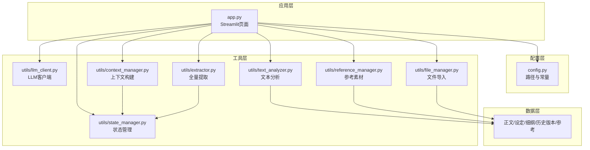
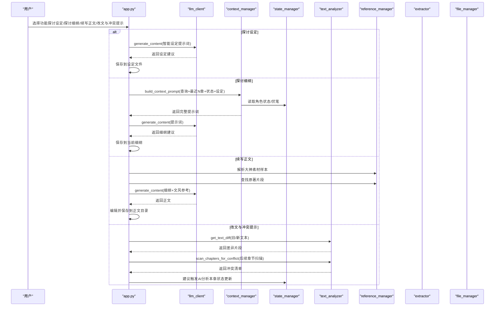
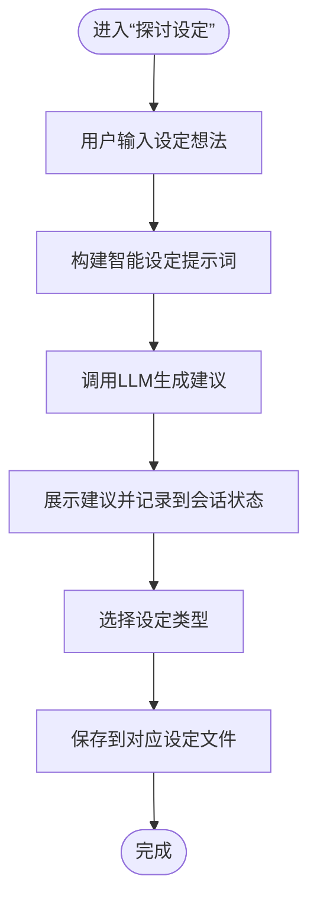
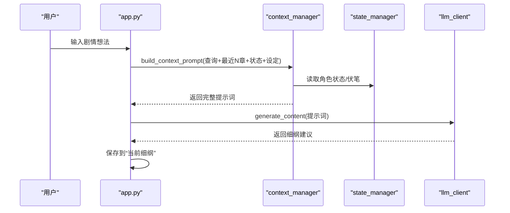
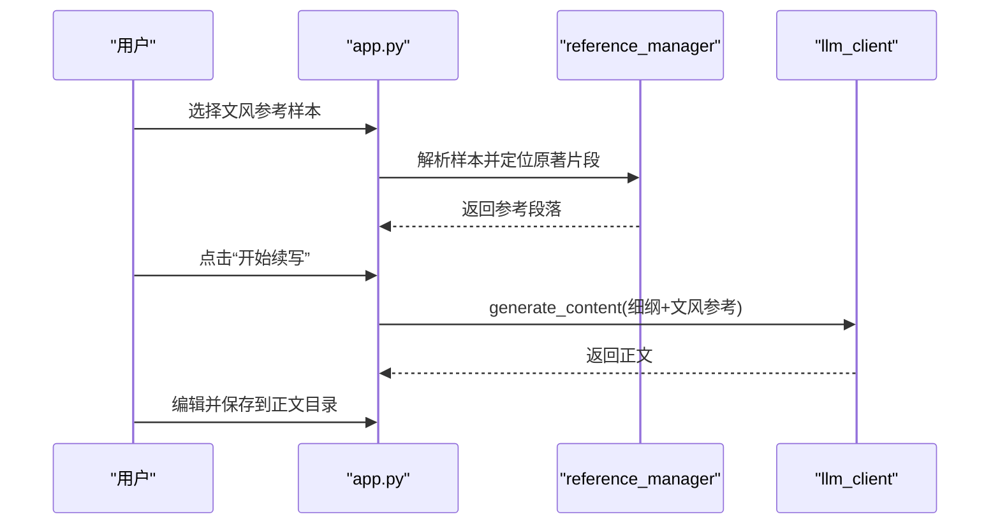
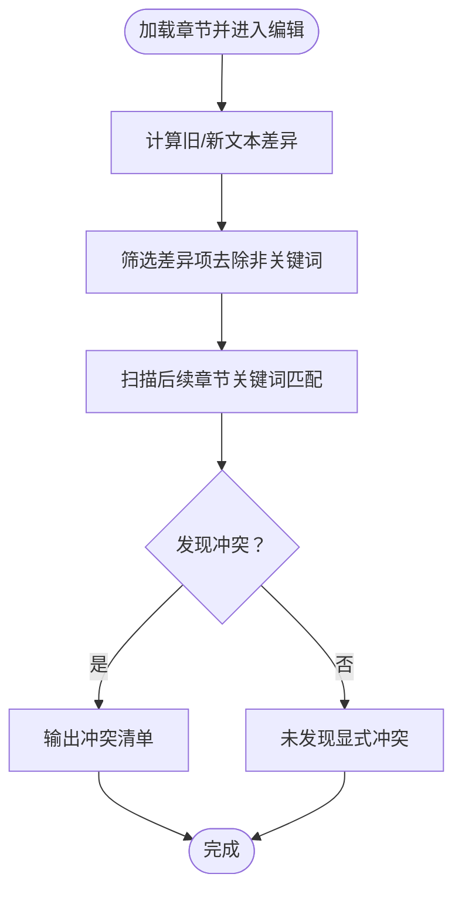
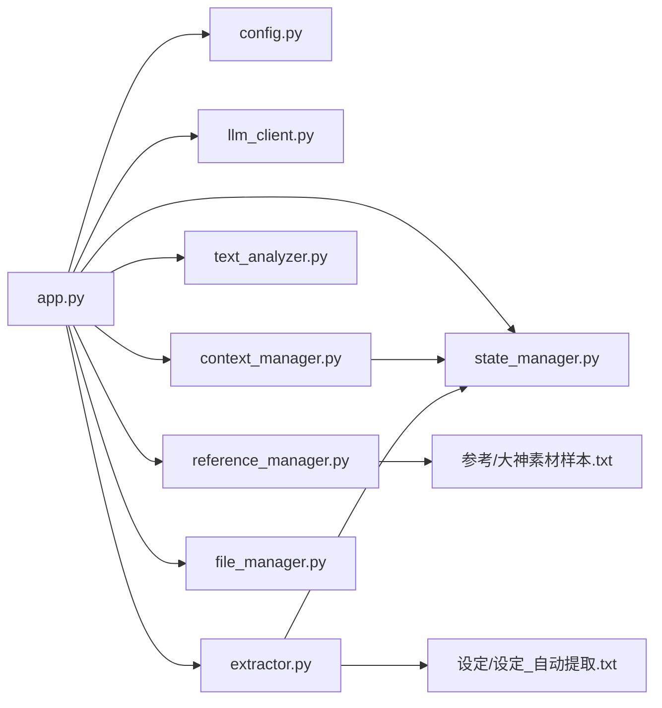

# 核心功能模块

<cite>
**本文引用的文件**
- [app.py](file://app.py)
- [config.py](file://config.py)
- [requirements.txt](file://requirements.txt)
- [utils/context_manager.py](file://utils/context_manager.py)
- [utils/state_manager.py](file://utils/state_manager.py)
- [utils/text_analyzer.py](file://utils/text_analyzer.py)
- [utils/llm_client.py](file://utils/llm_client.py)
- [utils/reference_manager.py](file://utils/reference_manager.py)
- [utils/extractor.py](file://utils/extractor.py)
- [utils/file_manager.py](file://utils/file_manager.py)
- [参考/大神素材样本.txt](file://参考/大神素材样本.txt)
- [设定/设定_自动提取.txt](file://设定/设定_自动提取.txt)
</cite>

## 目录
1. [简介](#简介)
2. [项目结构](#项目结构)
3. [核心组件](#核心组件)
4. [架构总览](#架构总览)
5. [详细组件分析](#详细组件分析)
6. [依赖关系分析](#依赖关系分析)
7. [性能考量](#性能考量)
8. [故障排除指南](#故障排除指南)
9. [结论](#结论)
10. [附录](#附录)

## 简介
本项目为“镇妖狱创作引擎”，围绕四大核心功能构建：
- 智能设定探讨：基于对话的设定生成与保存，融合多类设定要素。
- 细纲规划系统：结合角色状态、伏笔、设定与近期正文，生成可执行的细纲。
- 正文续写引擎：以细纲与文风参考为输入，驱动大模型生成完整章节正文。
- 冲突检测机制：对比修改前后文本差异，扫描后续章节是否存在冲突关键词，辅助作者规避逻辑漏洞。

系统通过统一的 LLM 客户端适配多提供商（Gemini、OpenAI 兼容、公司内部平台等），并通过状态管理器持久化“伏笔”和“角色状态”，形成可追溯的历史版本与冲突检测基础。

## 项目结构
项目采用“应用入口 + 工具模块 + 配置 + 数据文件”的组织方式：
- 应用入口：Streamlit 页面，负责界面交互与流程编排。
- 工具模块：封装 LLM 调用、上下文构建、状态管理、文本分析、参考素材解析、文件导入等。
- 配置模块：集中管理目录与文件路径。
- 数据文件：正文、设定、细纲、历史版本、参考素材等。

图表来源
- [app.py](file://app.py#L1-L690)
- [config.py](file://config.py#L1-L24)
- [utils/context_manager.py](file://utils/context_manager.py#L1-L93)
- [utils/state_manager.py](file://utils/state_manager.py#L1-L77)
- [utils/text_analyzer.py](file://utils/text_analyzer.py#L1-L63)
- [utils/llm_client.py](file://utils/llm_client.py#L1-L189)
- [utils/reference_manager.py](file://utils/reference_manager.py#L1-L94)
- [utils/extractor.py](file://utils/extractor.py#L1-L106)
- [utils/file_manager.py](file://utils/file_manager.py#L1-L108)

章节来源
- [app.py](file://app.py#L1-L690)
- [config.py](file://config.py#L1-L24)

## 核心组件
- LLM 客户端：统一生成与聊天接口，支持 Gemini、OpenAI 兼容、公司内部平台，具备重试与超时控制。
- 上下文构建器：整合角色状态、待回收伏笔、设定摘要、近期正文，形成结构化提示词。
- 状态管理器：读写“伏笔”和“角色状态”JSON 文件，支持快照与增量更新。
- 文本分析器：基于 difflib 的差异检测与后续章节冲突扫描。
- 参考素材管理器：解析“大神素材样本”，定位原著片段作为文风参考。
- 全量提取器：调用 LLM 对全文进行角色状态、伏笔、设定、剧情回顾的抽取与落盘。
- 文件管理器：确保目录结构、章节拆分与导入。

章节来源
- [utils/llm_client.py](file://utils/llm_client.py#L1-L189)
- [utils/context_manager.py](file://utils/context_manager.py#L1-L93)
- [utils/state_manager.py](file://utils/state_manager.py#L1-L77)
- [utils/text_analyzer.py](file://utils/text_analyzer.py#L1-L63)
- [utils/reference_manager.py](file://utils/reference_manager.py#L1-L94)
- [utils/extractor.py](file://utils/extractor.py#L1-L106)
- [utils/file_manager.py](file://utils/file_manager.py#L1-L108)

## 架构总览
四大功能在 Streamlit 页面中通过“功能选择”切换，各功能内部通过工具模块协同工作，数据通过状态管理器与文件系统持久化。

图表来源
- [app.py](file://app.py#L398-L690)
- [utils/llm_client.py](file://utils/llm_client.py#L29-L189)
- [utils/context_manager.py](file://utils/context_manager.py#L43-L92)
- [utils/state_manager.py](file://utils/state_manager.py#L21-L76)
- [utils/text_analyzer.py](file://utils/text_analyzer.py#L7-L62)
- [utils/reference_manager.py](file://utils/reference_manager.py#L5-L94)
- [utils/extractor.py](file://utils/extractor.py#L6-L105)
- [utils/file_manager.py](file://utils/file_manager.py#L16-L107)

## 详细组件分析

### 智能设定探讨（探讨设定）
- 功能目标：通过对话引导完善各类设定（世界观、人物、势力、战力、物品、规则等），并支持一键保存到对应设定文件。
- 技术要点：
  - 使用 LLM 客户端生成设定建议。
  - 将对话历史保存到会话状态，便于后续保存。
  - 保存时根据用户选择的设定类型，追加到对应的“设定_*.txt”文件末尾。
- 使用场景：在创作初期快速扩展设定维度，沉淀为可复用的知识库。
- 最佳实践：
  - 明确设定类型，避免过于宽泛的输入导致生成内容分散。
  - 结合“全量提取”功能，先建立基础设定，再进行细化探讨。

图表来源
- [app.py](file://app.py#L398-L475)
- [utils/llm_client.py](file://utils/llm_client.py#L29-L40)

章节来源
- [app.py](file://app.py#L398-L475)

### 细纲规划系统（探讨细纲）
- 功能目标：结合角色状态、待回收伏笔、设定摘要与最近 N 章正文，生成可执行的细纲建议。
- 技术要点：
  - 上下文构建器整合多源信息，形成结构化提示词。
  - 读取“角色状态”和“伏笔”JSON 文件，过滤“pending”状态的伏笔。
  - 读取“设定_*.txt”汇总设定要点。
  - 读取最近 N 章正文作为故事回顾。
- 使用场景：在推进剧情时，确保主线、伏笔回收与角色发展保持一致。
- 最佳实践：
  - 保持“角色状态”和“伏笔”实时更新，避免生成与历史脱节的细纲。
  - 将最终建议保存为“当前细纲”，作为续写正文的依据。

图表来源
- [app.py](file://app.py#L477-L515)
- [utils/context_manager.py](file://utils/context_manager.py#L43-L92)
- [utils/state_manager.py](file://utils/state_manager.py#L21-L31)

章节来源
- [app.py](file://app.py#L477-L515)
- [utils/context_manager.py](file://utils/context_manager.py#L1-L93)
- [utils/state_manager.py](file://utils/state_manager.py#L1-L77)

### 正文续写引擎（续写正文）
- 功能目标：以“当前细纲”和“文风参考”为输入，生成完整章节正文，并允许编辑与保存。
- 技术要点：
  - 读取“当前细纲”作为任务指令。
  - 解析“大神素材样本”，定位原著片段作为文风参考。
  - 调用 LLM 生成正文，支持多提供商与模型选择。
  - 编辑后保存到“正文/”目录，文件名规范化。
- 使用场景：在确定细纲后，快速产出高质量正文，减少重复劳动。
- 最佳实践：
  - 优先选择与目标文风相近的参考样本。
  - 生成后进行二次编辑，确保节奏与细节符合预期。

图表来源
- [app.py](file://app.py#L517-L597)
- [utils/reference_manager.py](file://utils/reference_manager.py#L5-L94)
- [utils/llm_client.py](file://utils/llm_client.py#L29-L113)

章节来源
- [app.py](file://app.py#L517-L597)
- [utils/reference_manager.py](file://utils/reference_manager.py#L1-L94)
- [参考/大神素材样本.txt](file://参考/大神素材样本.txt#L1-L614)

### 冲突检测机制（改文与冲突提示）
- 功能目标：检测正文修改后的差异，扫描后续章节是否存在冲突关键词，辅助规避逻辑漏洞。
- 技术要点：
  - 使用 difflib 计算旧/新文本差异，提取被删除/替换的片段。
  - 对差异项进行筛选（忽略短词），在后续章节中检索关键词。
  - 输出冲突清单，提示作者修正。
- 使用场景：在修改章节或新增内容后，快速发现与后续剧情的潜在矛盾。
- 最佳实践：
  - 修改后及时保存并触发冲突检测。
  - 对冲突清单逐条核验，必要时调整后续章节或补充说明。

图表来源
- [app.py](file://app.py#L599-L690)
- [utils/text_analyzer.py](file://utils/text_analyzer.py#L7-L62)

章节来源
- [app.py](file://app.py#L599-L690)
- [utils/text_analyzer.py](file://utils/text_analyzer.py#L1-L63)

### 全量提取与状态初始化（初始化）
- 功能目标：读取全文，调用 LLM 自动生成角色状态、伏笔、设定与剧情回顾，并创建空白状态文件。
- 技术要点：
  - 读取“正文/”目录下的章节文件或单文件“我的正文.txt”。
  - 调用全量提取器，解析并清洗 LLM 返回的 JSON。
  - 将结果分别保存到“设定/”和“细纲/”目录。
  - 初始化“设定_伏笔.json”和“设定_角色状态.json”。
- 使用场景：首次导入正文或需要重建创作状态时。
- 最佳实践：
  - 确保正文格式规范，章节标题清晰，便于后续导入与排序。
  - 提取完成后，建议人工核对并补充缺失信息。

章节来源
- [app.py](file://app.py#L309-L396)
- [utils/extractor.py](file://utils/extractor.py#L6-L105)
- [utils/file_manager.py](file://utils/file_manager.py#L16-L107)
- [utils/state_manager.py](file://utils/state_manager.py#L1-L77)

## 依赖关系分析
- 组件耦合：
  - app.py 作为编排中心，依赖 config.py、各工具模块与文件系统。
  - 上下文构建器依赖状态管理器与设定文件集合。
  - 全量提取器依赖 LLM 客户端与状态管理器。
  - 文本分析器独立运行，但与正文文件存在强耦合。
- 外部依赖：
  - Streamlit、Google Generative AI、OpenAI SDK、tenacity（重试）、python-dotenv（环境变量）。
- 潜在风险：
  - LLM 调用失败或超时会影响整体体验，需完善错误处理与重试策略。
  - 文件路径与命名规范需统一，避免解析异常。

图表来源
- [app.py](file://app.py#L1-L690)
- [config.py](file://config.py#L1-L24)
- [utils/context_manager.py](file://utils/context_manager.py#L1-L93)
- [utils/state_manager.py](file://utils/state_manager.py#L1-L77)
- [utils/text_analyzer.py](file://utils/text_analyzer.py#L1-L63)
- [utils/llm_client.py](file://utils/llm_client.py#L1-L189)
- [utils/reference_manager.py](file://utils/reference_manager.py#L1-L94)
- [utils/extractor.py](file://utils/extractor.py#L1-L106)
- [utils/file_manager.py](file://utils/file_manager.py#L1-L108)
- [参考/大神素材样本.txt](file://参考/大神素材样本.txt#L1-L614)
- [设定/设定_自动提取.txt](file://设定/设定_自动提取.txt#L1-L1)

章节来源
- [requirements.txt](file://requirements.txt#L1-L6)

## 性能考量
- LLM 调用优化：
  - 使用 tenacity 实现指数退避重试，降低网络抖动影响。
  - 控制提示词长度，避免超出模型上下文限制。
  - 对公司内部平台请求增加超时与错误日志，便于定位问题。
- 文件读写优化：
  - 章节排序使用正则提取编号，避免字符串排序偏差。
  - 参考素材解析采用行级扫描与关键词定位，减少全文扫描成本。
- 文本分析优化：
  - 差异检测使用 difflib，复杂度 O(n+m)，适合中等规模正文。
  - 后续章节扫描按关键词匹配，建议对关键词进行去噪与归一化。

[本节为通用指导，无需特定文件来源]

## 故障排除指南
- API 配置问题：
  - 确认环境变量已正确设置（GOOGLE_API_KEY、OPENAI_API_KEY、OPENAI_BASE_URL、LLM_PROVIDER）。
  - 不同提供商的 Base URL 与鉴权方式不同，需按界面提示正确填写。
- LLM 调用失败：
  - 检查网络连接与超时设置，查看终端打印的详细错误信息。
  - 对公司内部平台，确认 URL 包含“/chat/completions”，并正确处理 Bearer 前缀。
- 文件路径与命名：
  - 使用“初始化”功能确保目录结构完整，避免“未找到正文文件”等提示。
  - 章节标题需遵循“[第x章... ]”格式，便于解析与排序。
- 冲突检测无效：
  - 确认差异项非空，且后续章节确实包含关键词。
  - 对于语义替换而非字面替换的情况，建议结合 LLM 进行二次分析。

章节来源
- [app.py](file://app.py#L28-L277)
- [utils/llm_client.py](file://utils/llm_client.py#L29-L128)
- [utils/file_manager.py](file://utils/file_manager.py#L16-L107)
- [utils/text_analyzer.py](file://utils/text_analyzer.py#L7-L62)

## 结论
“镇妖狱创作引擎”通过统一的 LLM 客户端与工具模块，将设定探讨、细纲规划、正文续写与冲突检测有机串联，形成可迭代的创作闭环。建议在实际使用中：
- 保持状态文件的实时更新，确保上下文质量。
- 合理选择文风参考与提供商，提升生成一致性。
- 对冲突检测结果进行人工复核，确保故事逻辑严密。
- 持续优化提示词与解析策略，提升自动化程度与稳定性。

[本节为总结，无需特定文件来源]

## 附录
- 配置项与环境变量：
  - LLM_PROVIDER：选择提供商（gemini/openai）。
  - GOOGLE_API_KEY：Gemini API Key。
  - OPENAI_API_KEY：OpenAI 兼容 API Key。
  - OPENAI_BASE_URL：OpenAI 兼容 Base URL。
  - DEFAULT_MODEL_NAME：默认模型名称。
- 关键文件与目录：
  - 正文/、设定/、细纲/、历史版本/、参考/
  - 设定_伏笔.json、设定_角色状态.json、设定_自动提取.txt、剧情回顾.txt
- 示例参考：
  - 参考/大神素材样本.txt：包含对话、极限反杀、修炼、日常、打脸、杀伐果断、夺宝/刷副本等分类与定位指引。

章节来源
- [config.py](file://config.py#L1-L24)
- [参考/大神素材样本.txt](file://参考/大神素材样本.txt#L1-L614)
- [设定/设定_自动提取.txt](file://设定/设定_自动提取.txt#L1-L1)