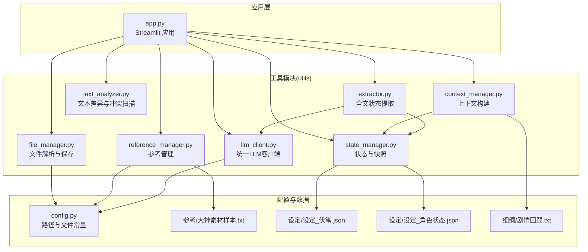
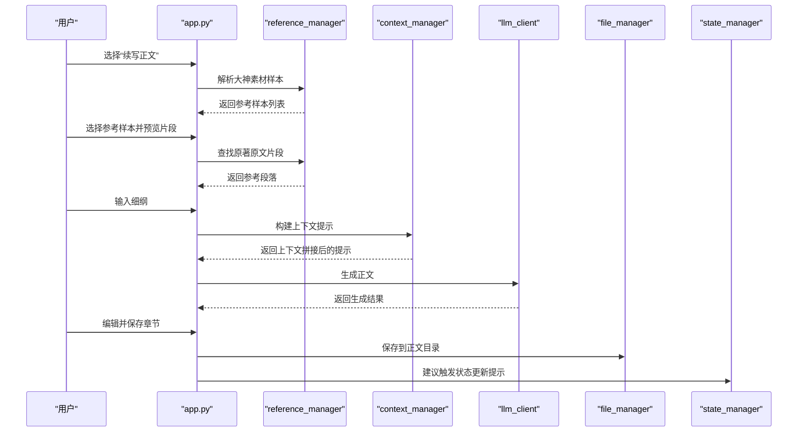
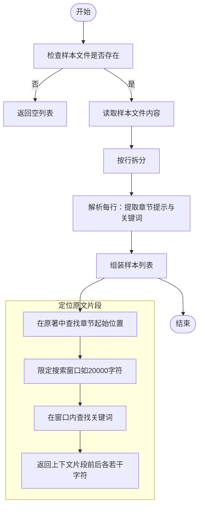
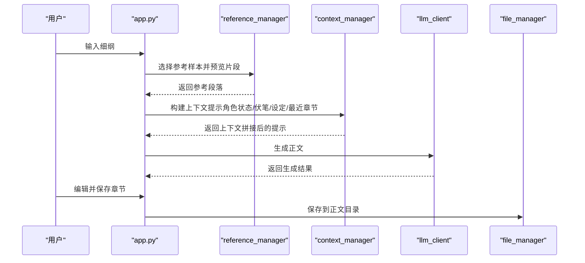
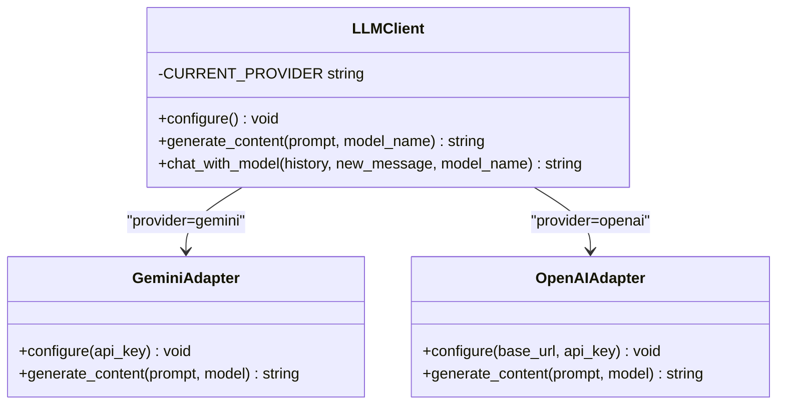
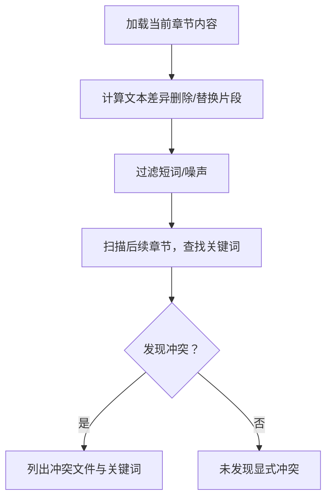
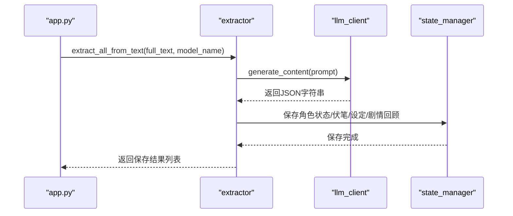
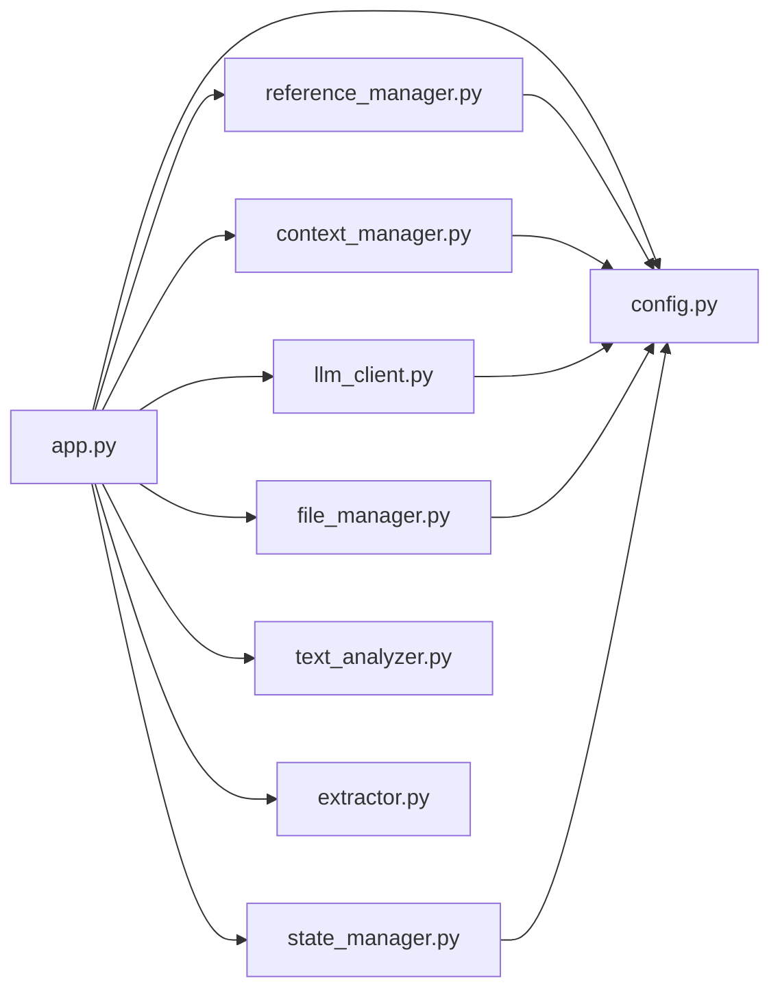

# 正文续写引擎

<cite>
**本文引用的文件**
- [app.py](file://app.py)
- [config.py](file://config.py)
- [utils/reference_manager.py](file://utils/reference_manager.py)
- [utils/text_analyzer.py](file://utils/text_analyzer.py)
- [utils/context_manager.py](file://utils/context_manager.py)
- [utils/state_manager.py](file://utils/state_manager.py)
- [utils/llm_client.py](file://utils/llm_client.py)
- [utils/file_manager.py](file://utils/file_manager.py)
- [utils/extractor.py](file://utils/extractor.py)
- [参考/大神素材样本.txt](file://参考/大神素材样本.txt)
- [设定/设定_伏笔.json](file://设定/设定_伏笔.json)
- [设定/设定_角色状态.json](file://设定/设定_角色状态.json)
- [细纲/剧情回顾.txt](file://细纲/剧情回顾.txt)
- [requirements.txt](file://requirements.txt)
</cite>

## 目录
1. [简介](#简介)
2. [项目结构](#项目结构)
3. [核心组件](#核心组件)
4. [架构总览](#架构总览)
5. [详细组件分析](#详细组件分析)
6. [依赖关系分析](#依赖关系分析)
7. [性能考虑](#性能考虑)
8. [故障排查指南](#故障排查指南)
9. [结论](#结论)
10. [附录](#附录)

## 简介
本项目为“正文续写引擎”，围绕“基于文风参考的智能续写”目标，提供从参考素材管理、文风模仿、续写提示词设计到生成、编辑、归档的完整工作流。系统通过解析大神素材样本，抽取可复用的文风片段，结合细纲与上下文，驱动大模型生成符合作者意图与文风一致性的正文章节，并提供冲突检测与状态归档能力，确保创作过程可控、可追溯、可持续迭代。

## 项目结构
项目采用模块化组织，入口为 Streamlit 应用，核心逻辑分布在 utils 子模块中，配置集中于 config.py，参考素材与状态文件位于参考、设定、细纲等目录。

**图示来源**
- [app.py](file://app.py#L1-L690)
- [config.py](file://config.py#L1-L24)
- [utils/reference_manager.py](file://utils/reference_manager.py#L1-L94)
- [utils/context_manager.py](file://utils/context_manager.py#L1-L93)
- [utils/state_manager.py](file://utils/state_manager.py#L1-L77)
- [utils/llm_client.py](file://utils/llm_client.py#L1-L192)
- [utils/file_manager.py](file://utils/file_manager.py#L1-L108)
- [utils/text_analyzer.py](file://utils/text_analyzer.py#L1-L63)
- [utils/extractor.py](file://utils/extractor.py#L1-L106)

**章节来源**
- [app.py](file://app.py#L1-L690)
- [config.py](file://config.py#L1-L24)

## 核心组件
- 参考管理器：解析“大神素材样本.txt”，抽取参考样本，定位原著原文片段，供续写时作为文风参照。
- 上下文管理器：聚合角色状态、伏笔、设定与最近章节内容，构建续写任务的完整上下文提示。
- LLM 客户端：统一适配 Gemini 与 OpenAI 兼容服务，提供内容生成与对话接口。
- 文件管理器：负责目录结构维护、正文拆分与章节保存。
- 状态管理器：管理“伏笔”和“角色状态”两类 JSON 状态文件，支持快照与增量更新。
- 文本分析器：对比旧/新文本差异，扫描后续章节是否存在被删除/替换的关键字，辅助冲突检测。
- 全文提取器：调用 LLM 对整部正文进行一次性状态提取，产出角色状态、伏笔、设定总结与剧情回顾。

**章节来源**
- [utils/reference_manager.py](file://utils/reference_manager.py#L1-L94)
- [utils/context_manager.py](file://utils/context_manager.py#L1-L93)
- [utils/llm_client.py](file://utils/llm_client.py#L1-L192)
- [utils/file_manager.py](file://utils/file_manager.py#L1-L108)
- [utils/state_manager.py](file://utils/state_manager.py#L1-L77)
- [utils/text_analyzer.py](file://utils/text_analyzer.py#L1-L63)
- [utils/extractor.py](file://utils/extractor.py#L1-L106)

## 架构总览
续写引擎以“续写正文”功能为核心，串联参考选择、上下文构建、LLM 生成、人工编辑与保存归档。下图展示了从界面交互到数据落盘的关键调用链。

**图示来源**
- [app.py](file://app.py#L517-L597)
- [utils/reference_manager.py](file://utils/reference_manager.py#L49-L94)
- [utils/context_manager.py](file://utils/context_manager.py#L43-L92)
- [utils/llm_client.py](file://utils/llm_client.py#L29-L132)
- [utils/file_manager.py](file://utils/file_manager.py#L82-L99)
- [utils/state_manager.py](file://utils/state_manager.py#L33-L49)

## 详细组件分析

### 参考管理器（基于文风参考的素材抽取与匹配）
参考管理器负责：
- 解析“大神素材样本.txt”，提取“出自哪一章”与“搜索关键词”等元信息，形成可选择的参考样本列表。
- 在选定样本后，定位原著原文片段，返回上下文窗口，作为续写时的文风参照。

**图示来源**
- [utils/reference_manager.py](file://utils/reference_manager.py#L5-L47)
- [utils/reference_manager.py](file://utils/reference_manager.py#L49-L94)

**章节来源**
- [utils/reference_manager.py](file://utils/reference_manager.py#L1-L94)
- [参考/大神素材样本.txt](file://参考/大神素材样本.txt#L1-L614)

### 上下文构建（细纲输入、参考选择、AI生成、人工编辑、保存归档）
续写正文流程的关键步骤：
- 加载当前细纲，允许用户微调。
- 从参考管理器选择样本并预览原文片段，作为文风参照。
- 构建提示词：包含细纲、文风参考、生成要求。
- 调用 LLM 生成正文，支持多提供商切换。
- 用户在界面上编辑生成结果，保存到正文目录。

**图示来源**
- [app.py](file://app.py#L517-L597)
- [utils/context_manager.py](file://utils/context_manager.py#L43-L92)
- [utils/llm_client.py](file://utils/llm_client.py#L29-L132)
- [utils/file_manager.py](file://utils/file_manager.py#L82-L99)

**章节来源**
- [app.py](file://app.py#L517-L597)

### LLM 客户端（统一生成与对话接口）
LLM 客户端支持 Gemini 与 OpenAI 兼容服务，具备：
- 自动配置：根据环境变量选择提供商与模型。
- 统一生成：提供 generate_content 与 chat_with_model 两个接口。
- 错误处理：打印详细调用信息，便于调试。

**图示来源**
- [utils/llm_client.py](file://utils/llm_client.py#L9-L132)

**章节来源**
- [utils/llm_client.py](file://utils/llm_client.py#L1-L192)

### 状态与冲突检测（伏笔与角色状态、文本差异与后续扫描）
- 状态管理：提供“伏笔”和“角色状态”两类 JSON 的读写与快照能力，支持增量更新与历史归档。
- 冲突检测：对比旧/新文本差异，扫描后续章节是否仍包含被删除/替换的关键字，辅助发现显式冲突。

**图示来源**
- [utils/text_analyzer.py](file://utils/text_analyzer.py#L7-L63)
- [app.py](file://app.py#L622-L653)

**章节来源**
- [utils/state_manager.py](file://utils/state_manager.py#L1-L77)
- [utils/text_analyzer.py](file://utils/text_analyzer.py#L1-L63)
- [app.py](file://app.py#L599-L690)

### 全文状态提取（一次性分析与归档）
- 全文提取器调用 LLM，产出角色状态、伏笔列表、设定总结与剧情回顾，并保存到相应文件。
- 该能力可用于初始化阶段，快速建立创作状态基线。

**图示来源**
- [utils/extractor.py](file://utils/extractor.py#L6-L106)
- [utils/llm_client.py](file://utils/llm_client.py#L29-L132)
- [utils/state_manager.py](file://utils/state_manager.py#L17-L32)

**章节来源**
- [utils/extractor.py](file://utils/extractor.py#L1-L106)

## 依赖关系分析
- 应用层依赖工具模块与配置常量，实现“配置即代码”的可移植性。
- 工具模块之间耦合度低，职责清晰：参考管理负责素材抽取，上下文管理负责提示拼接，LLM 客户端负责统一调用，文件与状态管理负责持久化。
- 数据文件（参考、设定、细纲）与目录结构通过 config.py 统一管理，便于扩展与迁移。

**图示来源**
- [app.py](file://app.py#L1-L11)
- [config.py](file://config.py#L1-L24)

**章节来源**
- [app.py](file://app.py#L1-L11)
- [config.py](file://config.py#L1-L24)

## 性能考虑
- 参考片段定位：当前实现为全文检索，建议对原著文件建立章节偏移缓存，减少重复 IO。
- LLM 调用：统一客户端已内置重试机制与超时设置，建议在 UI 层增加“生成进度”反馈与取消机制。
- 文本差异扫描：当前按后续章节顺序线性扫描，建议引入更高效的索引策略（如关键词倒排）以提升大体量正文的扫描效率。
- 目录与文件操作：批量保存章节时，建议使用并发写入与原子落盘策略，避免部分失败导致的数据不一致。

## 故障排查指南
- API 配置错误
  - 症状：调用 LLM 抛出“API Key 未设置”或“平台调用错误”。
  - 处理：检查环境变量 LLM_PROVIDER、OPENAI_API_KEY、GOOGLE_API_KEY，确认 Base URL 与模型名称正确。
  - 参考：[utils/llm_client.py](file://utils/llm_client.py#L9-L132)
- 参考素材缺失
  - 症状：无法解析样本或找不到原著片段。
  - 处理：确认“参考/大神素材样本.txt”存在且格式正确；检查原著文件路径与章节标题匹配。
  - 参考：[utils/reference_manager.py](file://utils/reference_manager.py#L5-L94)
- 状态文件异常
  - 症状：角色状态或伏笔 JSON 读取失败。
  - 处理：检查 JSON 格式与编码；必要时重建空文件。
  - 参考：[utils/state_manager.py](file://utils/state_manager.py#L8-L32)
- 细纲或正文未生成
  - 症状：续写正文界面提示“未找到当前细纲”或“未检测到正文文件”。
  - 处理：先在“探讨细纲”中生成并保存细纲；在“初始化”中导入正文或创建空白状态文件。
  - 参考：[app.py](file://app.py#L517-L597), [utils/file_manager.py](file://utils/file_manager.py#L101-L108)

**章节来源**
- [utils/llm_client.py](file://utils/llm_client.py#L9-L132)
- [utils/reference_manager.py](file://utils/reference_manager.py#L5-L94)
- [utils/state_manager.py](file://utils/state_manager.py#L8-L32)
- [app.py](file://app.py#L517-L597)
- [utils/file_manager.py](file://utils/file_manager.py#L101-L108)

## 结论
本续写引擎以“文风参考 + 上下文提示 + LLM 生成 + 人工编辑 + 状态归档”为主线，提供了从素材到成品的闭环工作流。通过模块化设计与统一的提示词模板，既保证了文风一致性，也为创作者留出了充分的创意空间。建议在后续迭代中增强参考片段缓存、冲突扫描索引与生成进度可视化，进一步提升规模化创作体验。

## 附录

### 提示词设计要点（续写正文）
- 明确任务与边界：在提示词中明确“请撰写完整的章节内容”，避免过度发散。
- 强化文风约束：将参考片段置于“文风参考”区块，强调“模仿笔法、节奏”。
- 结构化上下文：将角色状态、待回收伏笔、设定摘要与最近章节内容纳入提示，提升一致性。
- 示例路径（不含具体代码内容）：
  - [app.py 中续写正文提示词构建](file://app.py#L558-L571)
  - [app.py 中“探讨细纲”上下文构建](file://app.py#L494-L505)
  - [utils/context_manager 构建上下文提示](file://utils/context_manager.py#L43-L92)

### 性能优化清单
- 参考片段：建立原著章节偏移缓存，限制搜索窗口大小。
- 冲突扫描：为后续章节建立关键词索引，支持快速命中。
- 生成调优：在 UI 层增加“温度/采样”参数调节入口，平衡创意与稳定性。
- 并发落盘：批量保存章节时采用并发写入与原子落盘，降低失败率。

### 质量控制方法
- 人工编辑：生成后由作者逐章审阅，确保情节连贯与文风一致。
- 冲突检测：删除/替换后自动扫描后续章节，及时发现显式冲突。
- 状态归档：每次章节更新后建议触发状态更新与快照，形成可追溯的历史版本。