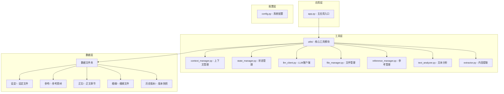
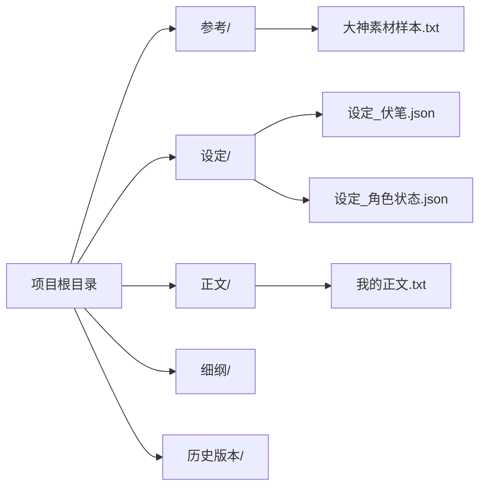
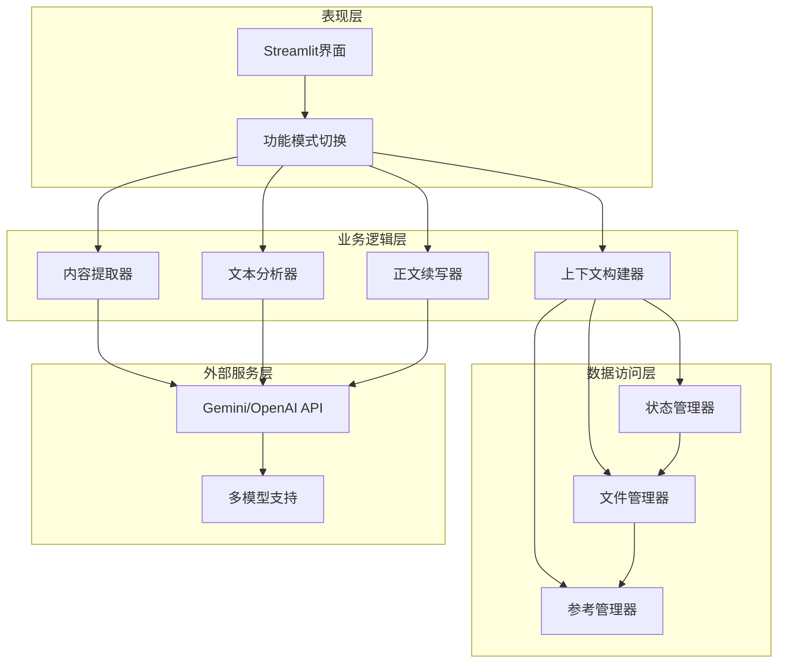
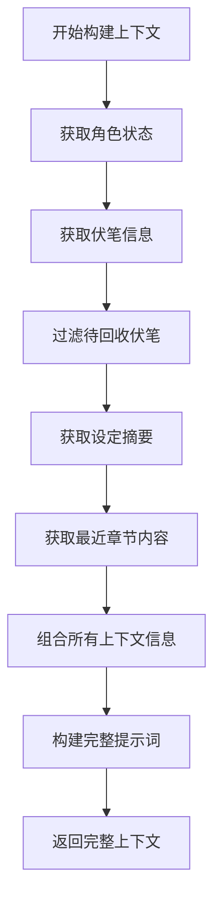
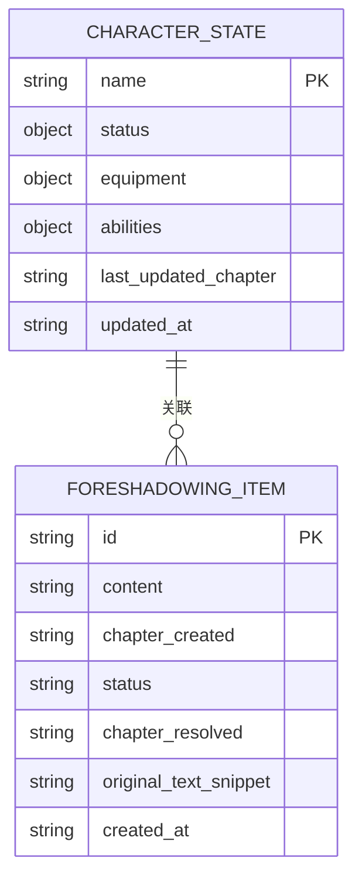
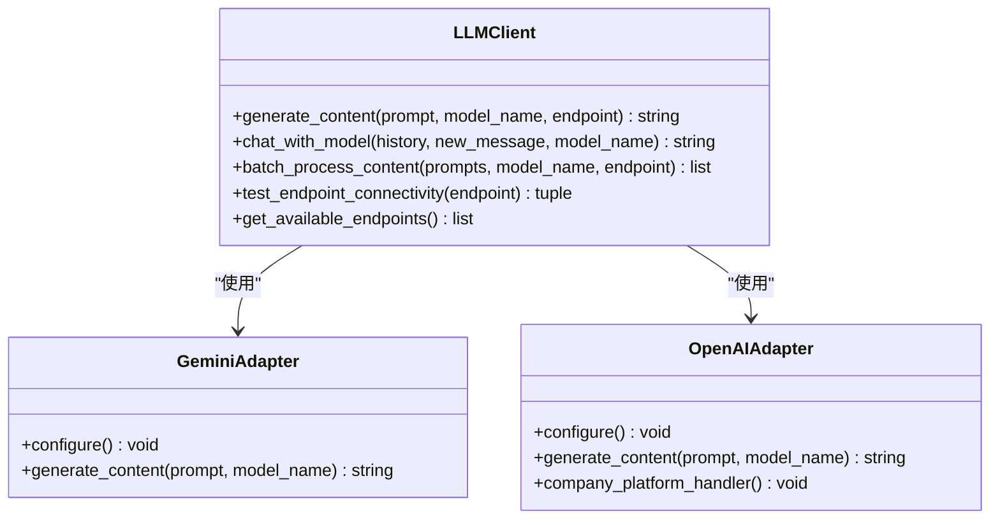
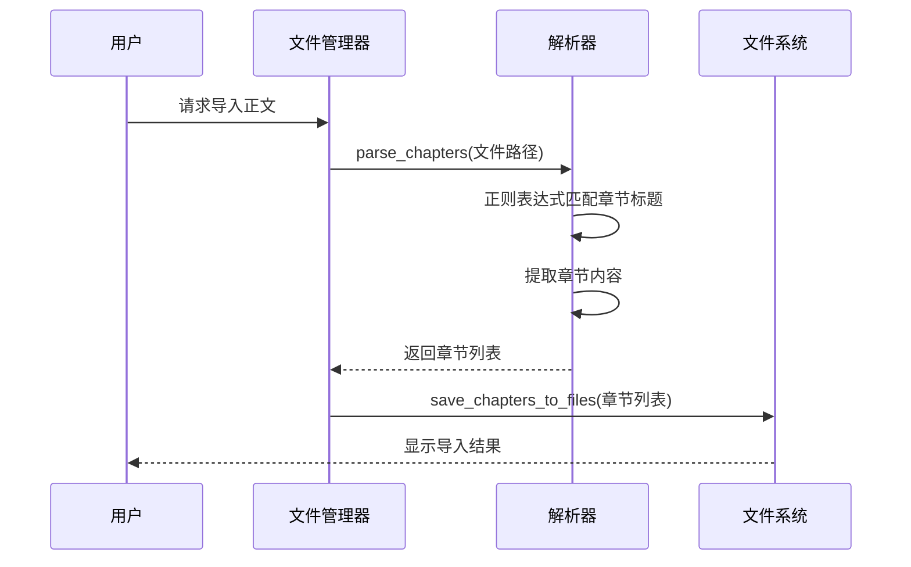
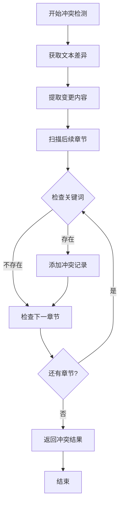
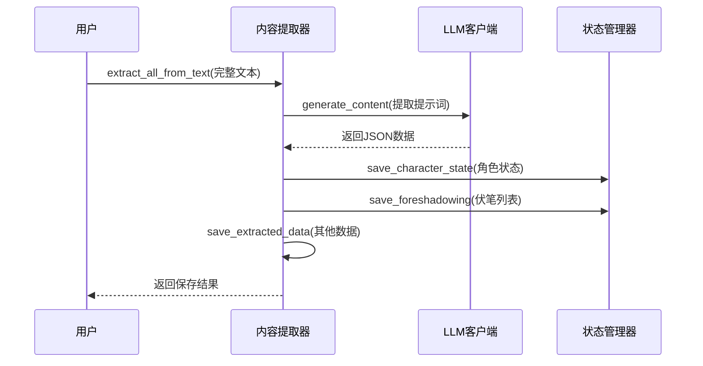
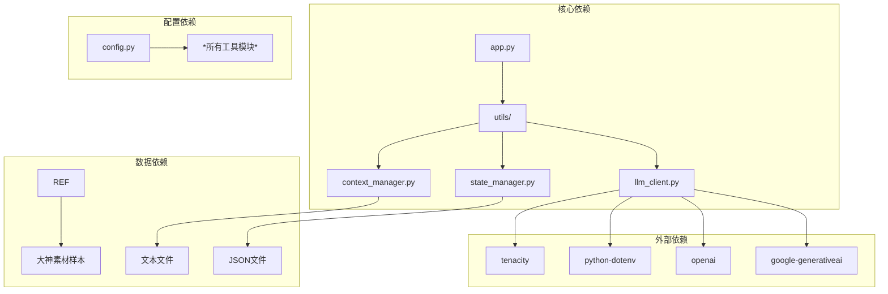

# 细纲规划系统

<cite>
**本文档引用的文件**
- [app.py](file://app.py)
- [config.py](file://config.py)
- [utils/context_manager.py](file://utils/context_manager.py)
- [utils/state_manager.py](file://utils/state_manager.py)
- [utils/llm_client.py](file://utils/llm_client.py)
- [utils/file_manager.py](file://utils/file_manager.py)
- [utils/reference_manager.py](file://utils/reference_manager.py)
- [utils/text_analyzer.py](file://utils/text_analyzer.py)
- [utils/extractor.py](file://utils/extractor.py)
- [requirements.txt](file://requirements.txt)
- [设定/设定_伏笔.json](file://设定/设定_伏笔.json)
- [设定/设定_角色状态.json](file://设定/设定_角色状态.json)
- [参考/大神素材样本.txt](file://参考/大神素材样本.txt)
</cite>

## 目录
1. [简介](#简介)
2. [项目结构](#项目结构)
3. [核心组件](#核心组件)
4. [架构概览](#架构概览)
5. [详细组件分析](#详细组件分析)
6. [依赖关系分析](#依赖关系分析)
7. [性能考虑](#性能考虑)
8. [故障排除指南](#故障排除指南)
9. [结论](#结论)

## 简介

细纲规划系统是一个基于上下文感知的智能创作辅助工具，专为网络文学创作设计。该系统通过集成大语言模型、状态管理和多维度信息整合技术，实现了自动化的剧情规划和细纲生成功能。

系统的核心特色包括：
- **智能上下文感知**：自动加载最近章节、角色状态、伏笔信息等上下文数据
- **多维度信息整合**：统一管理设定、角色、剧情等各类创作素材
- **AI辅助创作**：提供智能提示词工程和多模型支持
- **版本控制机制**：完整的状态快照和冲突检测功能
- **实际使用案例**：基于《从斩妖除魔开始长生不死》的完整创作流程

## 项目结构

该项目采用模块化设计，按照功能层次清晰组织代码结构：

**图表来源**
- [app.py](file://app.py#L1-L711)
- [config.py](file://config.py#L1-L24)

**章节来源**
- [app.py](file://app.py#L1-L711)
- [config.py](file://config.py#L1-L24)

## 核心组件

### 应用程序入口 (app.py)

主应用程序采用Streamlit框架构建，提供了完整的用户界面和交互逻辑。系统支持五种核心功能模式：

1. **初始化模式**：项目环境搭建和状态文件创建
2. **探讨设定**：智能设定讨论和保存
3. **探讨细纲**：基于上下文的细纲生成
4. **续写正文**：AI辅助的正文续写
5. **改文与冲突提示**：文本修改和冲突检测

应用程序的核心特性包括：
- **多模型支持**：支持Gemini、OpenAI兼容、SiliconFlow等多种大语言模型
- **智能API配置**：动态配置不同服务商的API参数
- **状态持久化**：完整的会话状态管理和数据保存
- **错误处理**：完善的异常捕获和用户友好的错误提示

### 配置管理系统 (config.py)

系统配置采用集中式管理，定义了所有必要的目录结构和文件路径：

**图表来源**
- [config.py](file://config.py#L6-L24)

**章节来源**
- [config.py](file://config.py#L1-L24)

## 架构概览

系统采用分层架构设计，确保各组件职责明确、耦合度低：

**图表来源**
- [app.py](file://app.py#L330-L711)
- [utils/context_manager.py](file://utils/context_manager.py#L43-L92)

## 详细组件分析

### 上下文管理器 (Context Manager)

上下文管理器是系统的核心组件，负责构建完整的创作上下文信息：

#### 上下文构建算法

**图表来源**
- [utils/context_manager.py](file://utils/context_manager.py#L43-L92)

#### 多维度信息整合策略

系统采用分层整合策略，确保不同类型的信息能够有效结合：

1. **角色状态整合**：JSON格式存储，包含状态、装备、能力等信息
2. **伏笔信息管理**：结构化存储，支持状态跟踪和章节关联
3. **设定文件汇总**：文本格式整合，支持多文件合并
4. **剧情回顾构建**：最近N章内容的智能拼接

**章节来源**
- [utils/context_manager.py](file://utils/context_manager.py#L1-L93)

### 状态管理器 (State Manager)

状态管理器提供完整的数据持久化和版本控制功能：

#### 数据结构设计

**图表来源**
- [utils/state_manager.py](file://utils/state_manager.py#L50-L76)

#### 版本控制机制

系统实现了完整的版本控制系统，支持状态快照和冲突检测：

1. **自动快照**：每次章节更新时自动创建状态快照
2. **时间戳管理**：精确的时间戳记录确保版本顺序
3. **冲突检测**：基于关键词的冲突扫描和提醒
4. **历史追踪**：完整的修改历史记录

**章节来源**
- [utils/state_manager.py](file://utils/state_manager.py#L1-L77)

### LLM客户端 (LLM Client)

LLM客户端提供统一的多模型接口，支持多种大语言模型：

#### 多模型适配架构

**图表来源**
- [utils/llm_client.py](file://utils/llm_client.py#L29-L186)

#### 提示词工程策略

系统采用精心设计的提示词模板，确保AI输出的质量和一致性：

1. **任务明确化**：清晰的任务描述和期望输出格式
2. **上下文丰富化**：完整的背景信息和相关数据
3. **约束条件化**：严格的输出格式和内容限制
4. **示例引导化**：具体的示例和参考格式

**章节来源**
- [utils/llm_client.py](file://utils/llm_client.py#L1-L303)

### 文件管理器 (File Manager)

文件管理器负责处理所有文件相关的操作：

#### 文件解析和保存流程

**图表来源**
- [utils/file_manager.py](file://utils/file_manager.py#L16-L100)

**章节来源**
- [utils/file_manager.py](file://utils/file_manager.py#L1-L108)

### 参考管理器 (Reference Manager)

参考管理器专门处理大神素材样本的解析和查找：

#### 参考素材解析算法

系统采用智能解析算法，能够准确提取参考素材的关键信息：

1. **格式识别**：自动识别参考素材的结构化格式
2. **关键词提取**：从参考线索中提取搜索关键词
3. **章节定位**：根据章节提示快速定位原文片段
4. **上下文提取**：返回关键词周围的上下文内容

**章节来源**
- [utils/reference_manager.py](file://utils/reference_manager.py#L1-L94)

### 文本分析器 (Text Analyzer)

文本分析器提供智能的文本差异检测和冲突扫描功能：

#### 冲突检测算法

**图表来源**
- [utils/text_analyzer.py](file://utils/text_analyzer.py#L39-L62)

**章节来源**
- [utils/text_analyzer.py](file://utils/text_analyzer.py#L1-L63)

### 内容提取器 (Extractor)

内容提取器负责从完整文本中自动提取创作所需的各种信息：

#### 全量状态提取流程

**图表来源**
- [utils/extractor.py](file://utils/extractor.py#L6-L106)

**章节来源**
- [utils/extractor.py](file://utils/extractor.py#L1-L106)

## 依赖关系分析

系统采用松耦合的设计原则，各组件之间的依赖关系清晰明确：

**图表来源**
- [requirements.txt](file://requirements.txt#L1-L6)
- [app.py](file://app.py#L11)

### 组件耦合度分析

系统在设计时充分考虑了组件间的耦合度控制：

1. **低耦合设计**：各模块通过明确定义的接口进行交互
2. **单一职责**：每个模块专注于特定的功能领域
3. **可替换性**：LLM客户端支持多种模型提供商
4. **扩展性**：易于添加新的功能模块和数据源

**章节来源**
- [requirements.txt](file://requirements.txt#L1-L6)

## 性能考虑

### 优化策略

系统在多个层面实施了性能优化措施：

#### 内存管理优化
- **延迟加载**：仅在需要时加载文件内容
- **增量处理**：支持大文件的分块处理
- **缓存机制**：重复使用的数据进行内存缓存

#### 网络通信优化
- **连接复用**：LLM客户端支持连接池复用
- **超时控制**：合理的超时设置避免长时间等待
- **重试机制**：自动重试失败的请求

#### 算法效率优化
- **正则表达式优化**：预编译常用的正则表达式
- **文件I/O优化**：批量文件操作减少系统调用
- **JSON处理优化**：高效的JSON序列化和反序列化

### 性能监控建议

1. **API调用统计**：监控LLM API的使用情况
2. **内存使用监控**：定期检查内存占用情况
3. **响应时间监控**：跟踪关键操作的响应时间
4. **错误率统计**：监控系统错误的发生频率

## 故障排除指南

### 常见问题诊断

#### API配置问题
**症状**：LLM调用失败或返回错误
**解决方案**：
1. 检查API密钥是否正确配置
2. 验证网络连接状态
3. 确认模型名称和端点设置
4. 查看详细的错误日志

#### 文件读写问题
**症状**：文件保存失败或读取为空
**解决方案**：
1. 检查目标目录的写权限
2. 验证文件路径的有效性
3. 确认磁盘空间充足
4. 检查文件是否被其他程序占用

#### 内存不足问题
**症状**：系统运行缓慢或崩溃
**解决方案**：
1. 优化大文件的处理方式
2. 实施适当的缓存策略
3. 增加系统内存容量
4. 检查内存泄漏问题

### 调试工具使用

系统提供了多种调试工具帮助开发者定位问题：

1. **详细错误日志**：完整的异常堆栈跟踪
2. **API调用详情**：详细的请求和响应信息
3. **性能指标监控**：实时的系统性能数据
4. **状态检查工具**：验证系统各组件的运行状态

**章节来源**
- [utils/llm_client.py](file://utils/llm_client.py#L144-L157)
- [utils/llm_client.py](file://utils/llm_client.py#L234-L246)

## 结论

细纲规划系统是一个功能完整、架构清晰的智能创作辅助工具。系统通过集成多种先进技术，为网络文学创作者提供了强大的技术支持。

### 主要优势

1. **智能化程度高**：基于上下文感知的智能创作体验
2. **扩展性强**：模块化设计支持功能扩展和定制
3. **用户体验友好**：直观的界面设计和流畅的操作流程
4. **数据管理完善**：完整的状态管理和版本控制机制

### 技术创新点

1. **多模型支持**：统一接口支持多种大语言模型
2. **智能上下文构建**：自动整合多维度创作信息
3. **冲突检测机制**：智能的文本一致性检查
4. **版本控制集成**：完整的创作历史追踪

### 发展建议

1. **增强AI能力**：集成更多先进的AI模型和技术
2. **优化用户体验**：持续改进界面设计和交互流程
3. **扩展功能范围**：支持更多类型的创作需求
4. **提升系统性能**：进一步优化处理速度和资源使用

该系统为网络文学创作提供了一个坚实的技术基础，通过持续的优化和改进，将成为创作者不可或缺的智能伙伴。