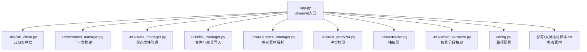
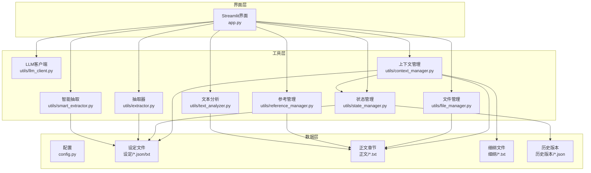
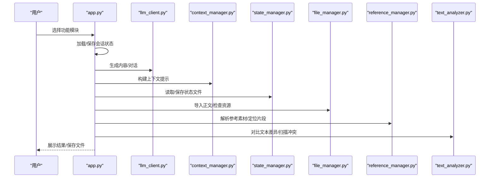
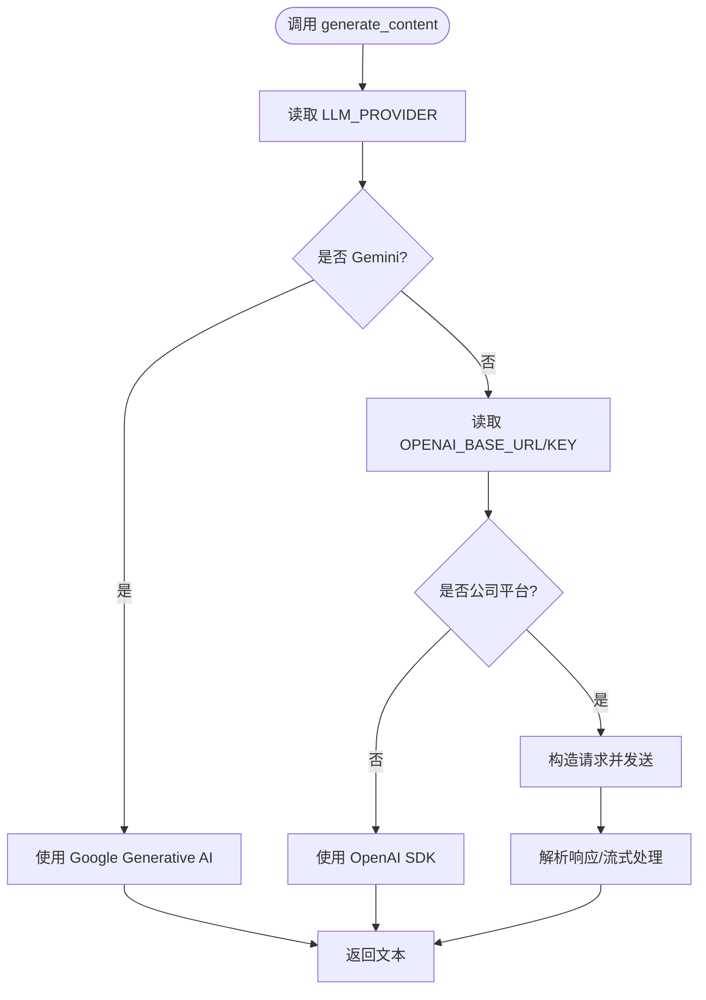
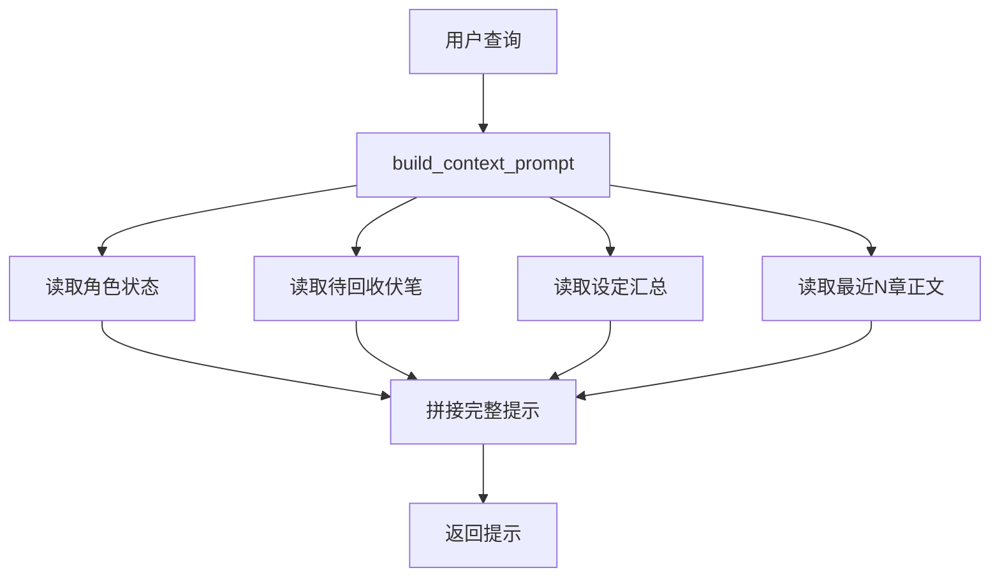
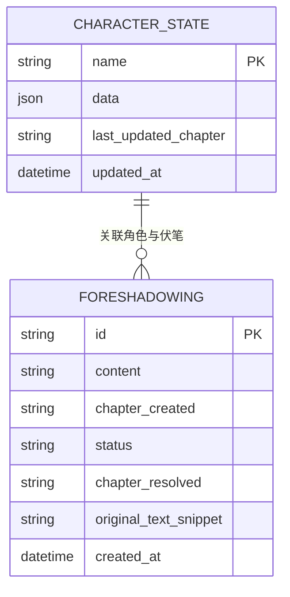
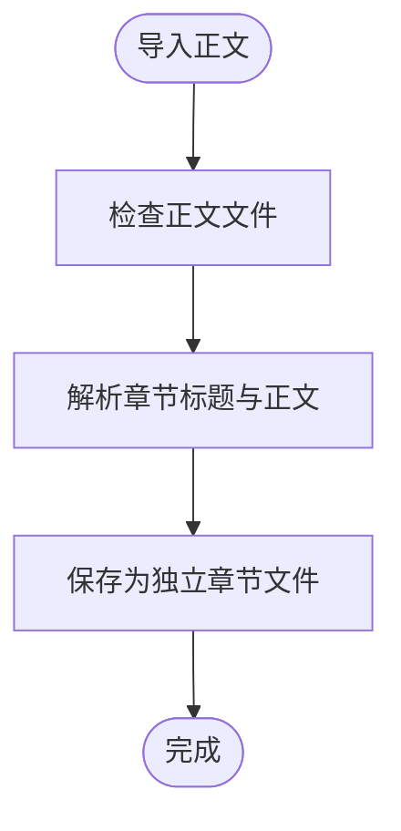
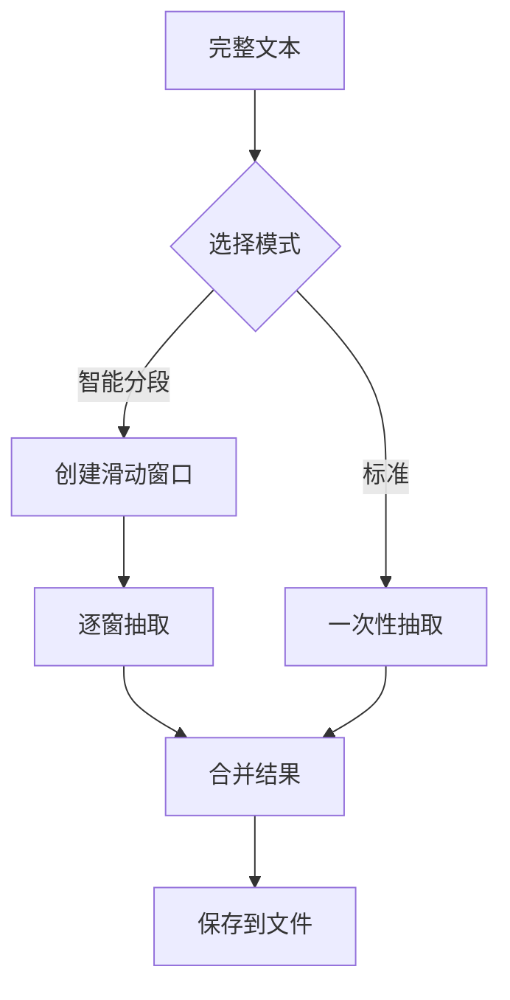
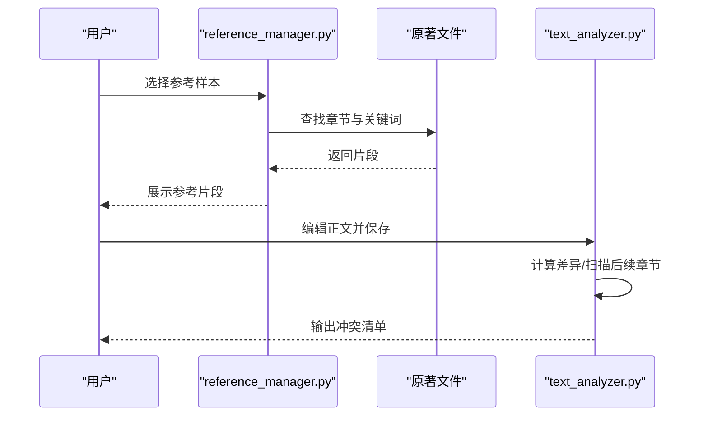
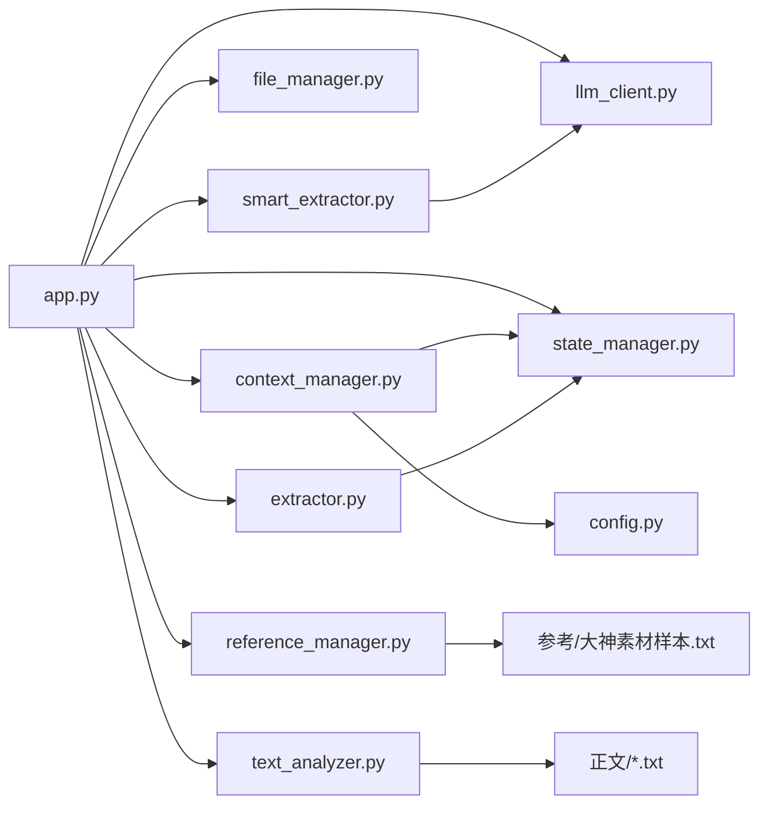

# 使用技巧与最佳实践

<cite>
**本文引用的文件**
- [app.py](file://app.py)
- [config.py](file://config.py)
- [utils/llm_client.py](file://utils/llm_client.py)
- [utils/context_manager.py](file://utils/context_manager.py)
- [utils/state_manager.py](file://utils/state_manager.py)
- [utils/reference_manager.py](file://utils/reference_manager.py)
- [utils/text_analyzer.py](file://utils/text_analyzer.py)
- [utils/file_manager.py](file://utils/file_manager.py)
- [utils/extractor.py](file://utils/extractor.py)
- [utils/smart_extractor.py](file://utils/smart_extractor.py)
- [参考/大神素材样本.txt](file://参考/大神素材样本.txt)
- [requirements.txt](file://requirements.txt)
</cite>

## 目录
1. [简介](#简介)
2. [项目结构](#项目结构)
3. [核心组件](#核心组件)
4. [架构总览](#架构总览)
5. [详细组件分析](#详细组件分析)
6. [依赖关系分析](#依赖关系分析)
7. [性能与成本优化](#性能与成本优化)
8. [创作效率提升方法](#创作效率提升方法)
9. [提示词优化技巧](#提示词优化技巧)
10. [AI服务选择建议](#ai服务选择建议)
11. [不同创作类型的使用建议](#不同创作类型的使用建议)
12. [常见陷阱与规避策略](#常见陷阱与规避策略)
13. [团队协作模式](#团队协作模式)
14. [专家级使用经验与高级技巧](#专家级使用经验与高级技巧)
15. [故障排查指南](#故障排查指南)
16. [结论](#结论)

## 简介
本系统是一个面向网络小说创作的智能辅助引擎，围绕“设定—细纲—正文—冲突检测—状态管理—资料抽取”全流程提供AI驱动的创作支持。通过统一的LLM客户端适配多家服务，结合状态文件与上下文构建，帮助作者在不同题材与体量下保持一致性、连贯性与可扩展性。

## 项目结构
系统采用“应用入口 + 工具模块 + 配置 + 资源目录”的组织方式：
- 应用入口：Streamlit界面，负责API提供商选择、配置、功能切换与交互
- 工具模块：LLM客户端、上下文管理、状态管理、文件与抽取工具、参考与文本分析
- 配置：集中定义目录与文件路径
- 资源：参考素材、设定、正文、细纲、历史版本等

图表来源
- [app.py](file://app.py#L1-L719)
- [utils/llm_client.py](file://utils/llm_client.py#L1-L203)
- [utils/context_manager.py](file://utils/context_manager.py#L1-L93)
- [utils/state_manager.py](file://utils/state_manager.py#L1-L77)
- [utils/file_manager.py](file://utils/file_manager.py#L1-L108)
- [utils/reference_manager.py](file://utils/reference_manager.py#L1-L94)
- [utils/text_analyzer.py](file://utils/text_analyzer.py#L1-L63)
- [utils/extractor.py](file://utils/extractor.py#L1-L194)
- [utils/smart_extractor.py](file://utils/smart_extractor.py#L1-L313)
- [config.py](file://config.py#L1-L24)
- [参考/大神素材样本.txt](file://参考/大神素材样本.txt#L1-L614)

章节来源
- [app.py](file://app.py#L1-L719)
- [config.py](file://config.py#L1-L24)

## 核心组件
- Streamlit界面与功能模块：提供API提供商选择、模型配置、初始化、设定探讨、细纲讨论、正文续写、冲突检测与状态更新等功能
- LLM客户端：统一适配Gemini与OpenAI兼容服务，支持重试与错误日志
- 上下文管理：整合角色状态、伏笔、设定与近期章节，构建任务提示
- 状态管理：维护角色状态与伏笔列表，支持快照与增量更新
- 文件与抽取：章节导入、资源状态检查、全文抽取与智能分段抽取
- 参考与文本分析：解析参考素材、定位原文片段、对比文本差异并扫描后续章节

章节来源
- [app.py](file://app.py#L310-L719)
- [utils/llm_client.py](file://utils/llm_client.py#L1-L203)
- [utils/context_manager.py](file://utils/context_manager.py#L1-L93)
- [utils/state_manager.py](file://utils/state_manager.py#L1-L77)
- [utils/file_manager.py](file://utils/file_manager.py#L1-L108)
- [utils/extractor.py](file://utils/extractor.py#L1-L194)
- [utils/smart_extractor.py](file://utils/smart_extractor.py#L1-L313)
- [utils/reference_manager.py](file://utils/reference_manager.py#L1-L94)
- [utils/text_analyzer.py](file://utils/text_analyzer.py#L1-L63)

## 架构总览
系统采用“界面层—工具层—数据层”的分层设计，界面层负责交互与流程编排，工具层封装LLM调用、上下文构建、状态与文件操作，数据层通过JSON文件持久化状态与抽取结果。

图表来源
- [app.py](file://app.py#L1-L719)
- [utils/llm_client.py](file://utils/llm_client.py#L1-L203)
- [utils/context_manager.py](file://utils/context_manager.py#L1-L93)
- [utils/state_manager.py](file://utils/state_manager.py#L1-L77)
- [utils/file_manager.py](file://utils/file_manager.py#L1-L108)
- [utils/extractor.py](file://utils/extractor.py#L1-L194)
- [utils/smart_extractor.py](file://utils/smart_extractor.py#L1-L313)
- [utils/reference_manager.py](file://utils/reference_manager.py#L1-L94)
- [utils/text_analyzer.py](file://utils/text_analyzer.py#L1-L63)
- [config.py](file://config.py#L1-L24)

## 详细组件分析

### 组件A：Streamlit界面与工作流
- 功能模块：初始化、设定探讨、细纲讨论、续写正文、冲突检测与状态更新
- 关键流程：API提供商选择与模型配置、资源状态检查、正文导入、抽取与保存、正文续写与编辑、冲突扫描与状态更新

图表来源
- [app.py](file://app.py#L310-L719)
- [utils/llm_client.py](file://utils/llm_client.py#L1-L203)
- [utils/context_manager.py](file://utils/context_manager.py#L1-L93)
- [utils/state_manager.py](file://utils/state_manager.py#L1-L77)
- [utils/file_manager.py](file://utils/file_manager.py#L1-L108)
- [utils/reference_manager.py](file://utils/reference_manager.py#L1-L94)
- [utils/text_analyzer.py](file://utils/text_analyzer.py#L1-L63)

章节来源
- [app.py](file://app.py#L310-L719)

### 组件B：LLM客户端与多服务适配
- 统一接口：generate_content/chat_with_model
- 适配服务：Gemini官方API、OpenAI兼容服务、NewAPI聚合、SiliconFlow、公司内部测试平台
- 错误处理：重试机制、详细日志打印、异常堆栈追踪

图表来源
- [utils/llm_client.py](file://utils/llm_client.py#L1-L203)

章节来源
- [utils/llm_client.py](file://utils/llm_client.py#L1-L203)

### 组件C：上下文构建与提示工程
- 上下文组成：角色状态、待回收伏笔、设定汇总、最近N章正文
- 任务提示：将查询与上下文拼接，形成完整的任务提示

图表来源
- [utils/context_manager.py](file://utils/context_manager.py#L43-L92)

章节来源
- [utils/context_manager.py](file://utils/context_manager.py#L1-L93)

### 组件D：状态管理与快照
- 角色状态：字典结构，支持增量更新与时间戳
- 伏笔列表：数组结构，支持新增、去重与状态流转
- 快照：章节完成后复制状态文件到历史版本目录

图表来源
- [utils/state_manager.py](file://utils/state_manager.py#L21-L77)

章节来源
- [utils/state_manager.py](file://utils/state_manager.py#L1-L77)

### 组件E：文件管理与正文导入
- 目录创建：确保必要目录存在
- 正文导入：按章节标题分割并保存为独立文件
- 资源检查：检查参考、样本、正文是否存在

图表来源
- [utils/file_manager.py](file://utils/file_manager.py#L16-L108)

章节来源
- [utils/file_manager.py](file://utils/file_manager.py#L1-L108)

### 组件F：抽取器与智能分段抽取
- 标准抽取：一次性处理全文，返回角色状态、伏笔、设定、大纲
- 智能分段：滑动窗口保持上下文，合并结果，适合长文本
- 结果保存：分别写入状态文件与设定/细纲目录

图表来源
- [utils/extractor.py](file://utils/extractor.py#L6-L194)
- [utils/smart_extractor.py](file://utils/smart_extractor.py#L5-L313)

章节来源
- [utils/extractor.py](file://utils/extractor.py#L1-L194)
- [utils/smart_extractor.py](file://utils/smart_extractor.py#L1-L313)

### 组件G：参考素材与冲突检测
- 参考素材：解析“大神素材样本.txt”，提取章节提示与关键词，定位原文片段
- 冲突检测：对比旧/新文本，扫描后续章节中是否仍包含被删除/修改的关键字

图表来源
- [utils/reference_manager.py](file://utils/reference_manager.py#L1-L94)
- [utils/text_analyzer.py](file://utils/text_analyzer.py#L1-L63)
- [参考/大神素材样本.txt](file://参考/大神素材样本.txt#L1-L614)

章节来源
- [utils/reference_manager.py](file://utils/reference_manager.py#L1-L94)
- [utils/text_analyzer.py](file://utils/text_analyzer.py#L1-L63)
- [参考/大神素材样本.txt](file://参考/大神素材样本.txt#L1-L614)

## 依赖关系分析
- 应用入口依赖各工具模块与配置
- 上下文管理依赖状态管理与设定/正文目录
- 抽取器依赖LLM客户端与状态管理
- 参考管理依赖原著文件
- 文本分析依赖正文文件

图表来源
- [app.py](file://app.py#L1-L719)
- [utils/llm_client.py](file://utils/llm_client.py#L1-L203)
- [utils/context_manager.py](file://utils/context_manager.py#L1-L93)
- [utils/state_manager.py](file://utils/state_manager.py#L1-L77)
- [utils/file_manager.py](file://utils/file_manager.py#L1-L108)
- [utils/extractor.py](file://utils/extractor.py#L1-L194)
- [utils/smart_extractor.py](file://utils/smart_extractor.py#L1-L313)
- [utils/reference_manager.py](file://utils/reference_manager.py#L1-L94)
- [utils/text_analyzer.py](file://utils/text_analyzer.py#L1-L63)
- [config.py](file://config.py#L1-L24)
- [参考/大神素材样本.txt](file://参考/大神素材样本.txt#L1-L614)

章节来源
- [app.py](file://app.py#L1-L719)
- [config.py](file://config.py#L1-L24)

## 性能与成本优化
- 选择合适模型
  - Gemini：适合多模态与复杂推理，1.5 Pro在创作与分析上表现更优
  - OpenAI兼容：根据服务特性选择模型，NewAPI聚合多家模型，SiliconFlow提供开源模型
- 智能分段抽取
  - 长文本使用智能分段模式，合理设置窗口大小与重叠，平衡上下文完整性与Token消耗
- 重试与超时
  - LLM客户端内置重试与较长超时，减少网络波动影响
- 资源检查
  - 初始化阶段检查资源文件，避免无效调用

章节来源
- [app.py](file://app.py#L82-L278)
- [utils/llm_client.py](file://utils/llm_client.py#L29-L142)
- [utils/smart_extractor.py](file://utils/smart_extractor.py#L5-L58)

## 创作效率提升方法
- 明确创作阶段
  - 设定探讨：聚焦设定类型，快速完善世界观、人物、势力、规则等
  - 细纲讨论：基于上下文与状态，生成可执行的细纲
  - 正文续写：结合参考素材与细纲，提高写作一致性
- 使用参考素材
  - 通过“大神素材样本”定位原文片段，模仿文风与节奏
- 冲突检测
  - 修改正文后及时扫描后续章节，避免前后矛盾
- 状态更新
  - 保存章节后建议触发状态与伏笔更新，便于系统记录历史版本

章节来源
- [app.py](file://app.py#L427-L719)
- [utils/reference_manager.py](file://utils/reference_manager.py#L1-L94)
- [utils/text_analyzer.py](file://utils/text_analyzer.py#L1-L63)
- [utils/state_manager.py](file://utils/state_manager.py#L33-L77)

## 提示词优化技巧
- 设定探讨
  - 明确输入主题与风格要求，引导AI产出具体、生动的设定
- 细纲讨论
  - 将任务描述与上下文拼接，确保AI理解当前状态与目标
- 正文续写
  - 提供细纲与参考片段，明确笔法与节奏要求
- 抽取与分析
  - 使用结构化JSON提示，减少歧义，便于后续解析与保存

章节来源
- [app.py](file://app.py#L451-L459)
- [app.py](file://app.py#L589-L599)
- [utils/extractor.py](file://utils/extractor.py#L11-L33)
- [utils/smart_extractor.py](file://utils/smart_extractor.py#L114-L162)

## AI服务选择建议
- Gemini官方：适合多模态与复杂推理，模型选择建议1.5 Pro
- NewAPI：聚合多家模型，适合多模型对比与切换
- SiliconFlow：开源模型平台，价格实惠，适合预算有限场景
- 公司内部测试平台：支持多种模型，注意Token前缀处理
- OpenAI兼容：自定义Base URL与模型名称，注意超时与重试

章节来源
- [app.py](file://app.py#L36-L278)
- [utils/llm_client.py](file://utils/llm_client.py#L1-L203)

## 不同创作类型的使用建议
- 仙侠类
  - 设定重点：修炼体系、宗门势力、法宝功法、境界划分
  - 参考素材：选取“极限反杀”“修炼剧情”等片段，模仿高能爆发与成长节奏
- 都市类
  - 设定重点：社会关系、职场生态、利益博弈、人物心理
  - 参考素材：选取“日常剧情”“打脸剧情”等片段，增强生活气息与冲突张力
- 悬疑类
  - 设定重点：案件线索、调查手法、心理博弈、反转节奏
  - 参考素材：选取“推动剧情的对话”“杀伐果断”等片段，强化叙事推进与紧张感

章节来源
- [参考/大神素材样本.txt](file://参考/大神素材样本.txt#L1-L614)

## 常见陷阱与规避策略
- API配置错误
  - 确认API Key与Base URL正确，注意公司平台Token前缀处理
- Token超限
  - 使用智能分段抽取，合理设置窗口大小与重叠
- 上下文缺失
  - 确保角色状态、伏笔、设定与近期章节齐全，避免提示不完整
- 冲突检测遗漏
  - 删除/修改后及时扫描后续章节，关注关键字残留
- 文件命名与路径
  - 使用安全的文件名，避免非法字符导致保存失败

章节来源
- [utils/llm_client.py](file://utils/llm_client.py#L9-L28)
- [utils/smart_extractor.py](file://utils/smart_extractor.py#L5-L58)
- [utils/text_analyzer.py](file://utils/text_analyzer.py#L39-L63)
- [utils/file_manager.py](file://utils/file_manager.py#L88-L98)

## 团队协作模式
- 统一API配置
  - 团队成员共享LLM_PROVIDER与模型选择，确保输出一致性
- 角色分工
  - 设定负责人：维护设定文件与状态
  - 细纲负责人：基于上下文生成与评审细纲
  - 正文负责人：结合参考素材与细纲续写
  - 质检负责人：使用冲突检测与状态更新保障一致性
- 版本管理
  - 使用历史版本目录保存状态快照，便于回溯与对比

章节来源
- [app.py](file://app.py#L290-L308)
- [utils/state_manager.py](file://utils/state_manager.py#L33-L49)

## 专家级使用经验与高级技巧
- 智能分段抽取参数调优
  - 根据文本长度选择窗口大小与重叠，平衡上下文与Token消耗
- JSON解析容错
  - 对LLM返回的JSON进行清洗与修复，提升稳定性
- 流式处理
  - 对超长文本采用流式抽取，降低内存占用
- 提示词模板化
  - 将常用提示词固化为模板，减少重复劳动
- 多轮对话与上下文
  - 在设定探讨与细纲讨论中充分利用会话历史，提升连贯性

章节来源
- [utils/smart_extractor.py](file://utils/smart_extractor.py#L298-L313)
- [utils/extractor.py](file://utils/extractor.py#L57-L74)
- [utils/llm_client.py](file://utils/llm_client.py#L144-L203)

## 故障排查指南
- API调用错误
  - 查看详细日志与堆栈，确认模型、Base URL、Key与超时设置
- 资源文件缺失
  - 使用资源状态检查功能，确认参考、样本、正文文件是否存在
- 抽取失败
  - 检查JSON解析与清洗逻辑，必要时调整提示词或模型
- 冲突检测无结果
  - 确认删除/修改的关键词是否仍存在于后续章节

章节来源
- [utils/llm_client.py](file://utils/llm_client.py#L99-L142)
- [app.py](file://app.py#L290-L308)
- [utils/extractor.py](file://utils/extractor.py#L35-L55)
- [utils/text_analyzer.py](file://utils/text_analyzer.py#L39-L63)

## 结论
本系统通过统一的LLM客户端与完善的工具链，实现了从设定到正文的全流程创作支持。通过合理的API选择、提示词优化、智能分段抽取与冲突检测，能够在不同题材与体量下提升创作效率与质量。团队协作中建议统一配置与流程，配合状态快照与历史版本管理，确保作品的一致性与可维护性。