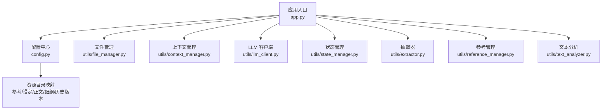
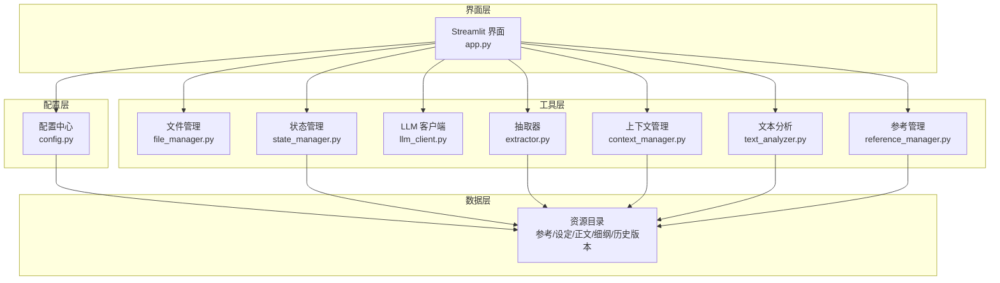
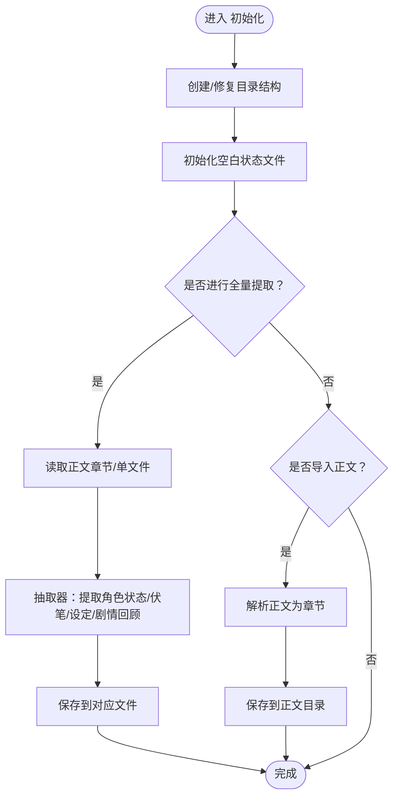
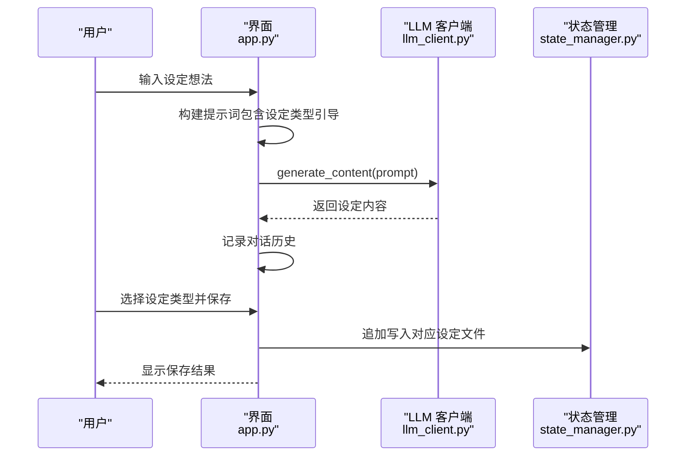
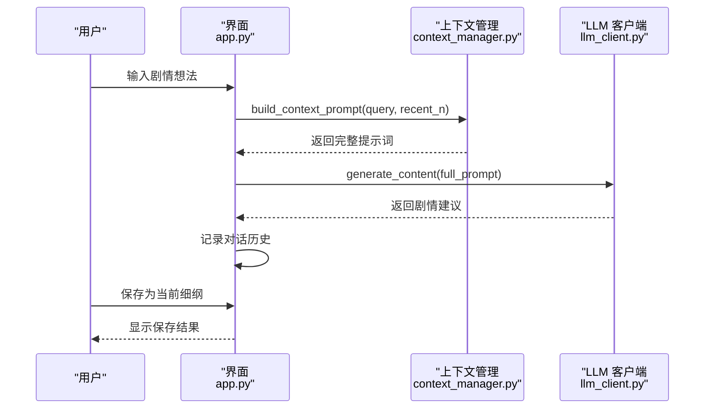
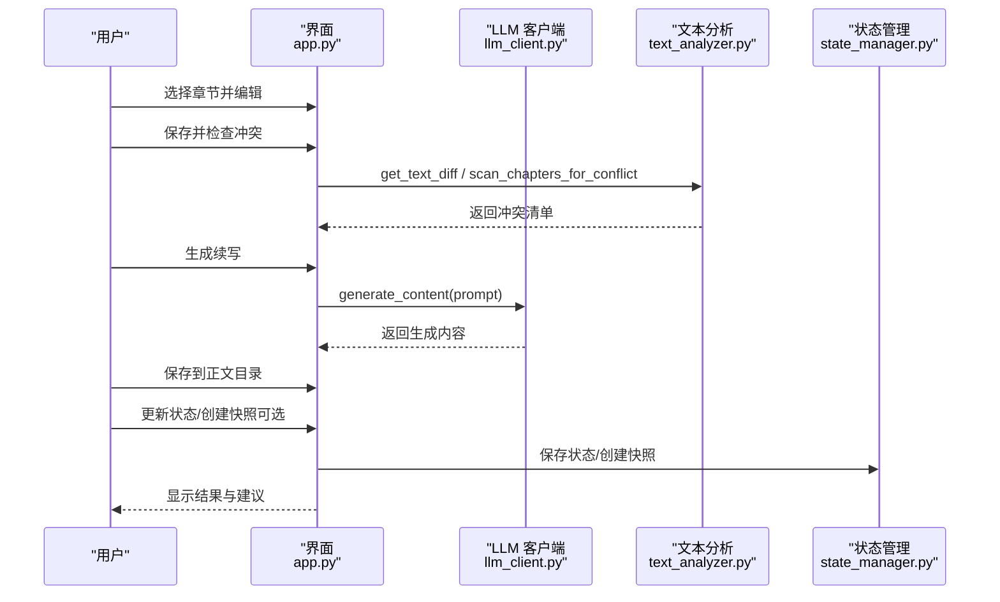
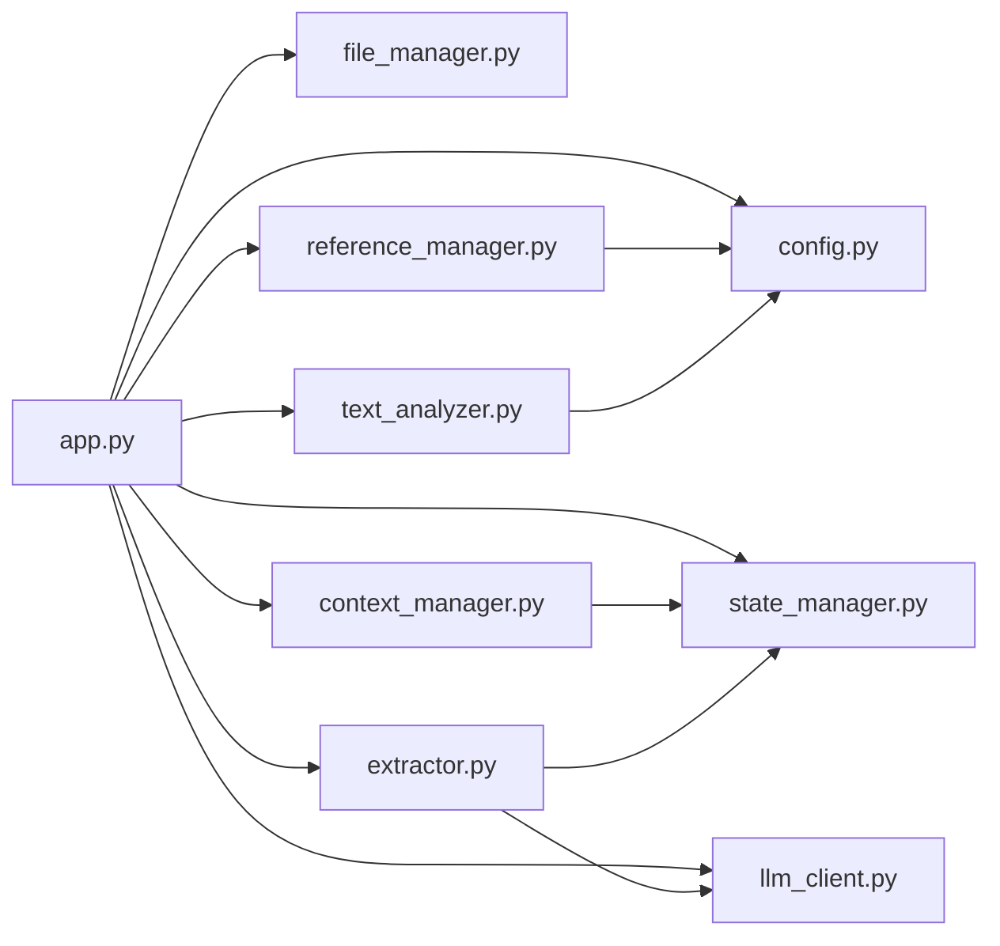
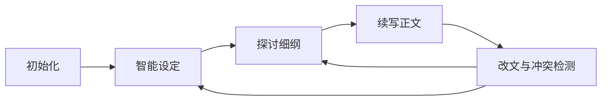

# 创作工作流程

<cite>
**本文引用的文件**
- [app.py](file://app.py)
- [config.py](file://config.py)
- [requirements.txt](file://requirements.txt)
- [utils/context_manager.py](file://utils/context_manager.py)
- [utils/extractor.py](file://utils/extractor.py)
- [utils/file_manager.py](file://utils/file_manager.py)
- [utils/llm_client.py](file://utils/llm_client.py)
- [utils/reference_manager.py](file://utils/reference_manager.py)
- [utils/state_manager.py](file://utils/state_manager.py)
- [utils/text_analyzer.py](file://utils/text_analyzer.py)
</cite>

## 目录
1. [简介](#简介)
2. [项目结构](#项目结构)
3. [核心组件](#核心组件)
4. [架构总览](#架构总览)
5. [详细组件分析](#详细组件分析)
6. [依赖关系分析](#依赖关系分析)
7. [性能考量](#性能考量)
8. [故障排查指南](#故障排查指南)
9. [结论](#结论)
10. [附录](#附录)

## 简介
本指南面向使用“镇妖狱创作引擎”的创作者，提供从项目初始化到最终成品的完整工作流程。系统围绕四大阶段展开：
1) 项目初始化与环境准备
2) 智能设定探讨与构建
3) 细纲规划与剧情设计
4) 正文续写与改文优化

系统通过统一的 Streamlit 界面串联各工具模块，结合 LLM 客户端与状态管理，实现“状态驱动”的创作闭环：正文导入与拆分、设定与状态提取、细纲讨论、正文续写、冲突检测与状态快照。

## 项目结构
项目采用“功能模块化 + 配置集中化”的组织方式：
- 应用入口与界面：app.py
- 配置中心：config.py
- 工具模块：utils/*（文件管理、上下文构建、LLM 客户端、状态管理、抽取器、参考管理、文本分析）
- 资源目录：参考、设定、正文、细纲、历史版本
- 依赖声明：requirements.txt

图表来源
- [app.py](file://app.py#L1-L690)
- [config.py](file://config.py#L1-L24)

章节来源
- [app.py](file://app.py#L1-L690)
- [config.py](file://config.py#L1-L24)

## 核心组件
- 应用入口与界面：负责侧边栏配置、四大功能页签、会话状态维护与资源状态监控。
- 文件管理：确保目录结构、解析单文件正文为多章节、校验资源文件。
- 上下文管理：聚合角色状态、伏笔、设定与最近正文，构建 LLM 的完整上下文提示。
- LLM 客户端：统一适配 Gemini 与 OpenAI 兼容服务，含重试与错误日志。
- 状态管理：读写“伏笔”和“角色状态”JSON 文件，支持章节级快照。
- 抽取器：对全文进行一次性综合抽取，产出角色状态、伏笔、设定与剧情回顾。
- 参考管理：解析“大神素材样本”，定位原著中的参考片段。
- 文本分析：对比编辑前后差异，扫描后续章节是否存在冲突关键词。

章节来源
- [app.py](file://app.py#L1-L690)
- [utils/file_manager.py](file://utils/file_manager.py#L1-L108)
- [utils/context_manager.py](file://utils/context_manager.py#L1-L93)
- [utils/llm_client.py](file://utils/llm_client.py#L1-L202)
- [utils/state_manager.py](file://utils/state_manager.py#L1-L77)
- [utils/extractor.py](file://utils/extractor.py#L1-L106)
- [utils/reference_manager.py](file://utils/reference_manager.py#L1-L94)
- [utils/text_analyzer.py](file://utils/text_analyzer.py#L1-L63)

## 架构总览
系统以“配置中心 + 工具模块 + 资源目录”为核心，通过应用入口串联四大功能页签，形成“状态驱动”的创作流程闭环。

图表来源
- [app.py](file://app.py#L1-L690)
- [config.py](file://config.py#L1-L24)
- [utils/file_manager.py](file://utils/file_manager.py#L1-L108)
- [utils/context_manager.py](file://utils/context_manager.py#L1-L93)
- [utils/llm_client.py](file://utils/llm_client.py#L1-L202)
- [utils/state_manager.py](file://utils/state_manager.py#L1-L77)
- [utils/extractor.py](file://utils/extractor.py#L1-L106)
- [utils/reference_manager.py](file://utils/reference_manager.py#L1-L94)
- [utils/text_analyzer.py](file://utils/text_analyzer.py#L1-L63)

## 详细组件分析

### 初始化与环境准备（阶段一）
目标：建立项目目录结构、准备状态文件、导入正文、全量提取设定与状态。

- 目录与状态文件
  - 创建必要目录：参考、设定、正文、细纲、历史版本。
  - 初始化空白状态文件：伏笔列表与角色状态字典。
- 全量提取（AI）
  - 读取正文（优先按章节目录排序，否则读取单文件）。
  - 调用抽取器生成角色状态、伏笔、设定与剧情回顾，并保存至相应文件。
- 正文导入（单文件拆分）
  - 解析“我的正文.txt”，按章节标题拆分并保存至“正文/”目录。

图表来源
- [app.py](file://app.py#L309-L396)
- [utils/file_manager.py](file://utils/file_manager.py#L7-L108)
- [utils/extractor.py](file://utils/extractor.py#L6-L106)

章节来源
- [app.py](file://app.py#L309-L396)
- [utils/file_manager.py](file://utils/file_manager.py#L7-L108)
- [utils/extractor.py](file://utils/extractor.py#L6-L106)

最佳实践
- 在首次使用前先创建目录与状态文件，确保后续功能可用。
- 若已有正文，优先执行全量提取，以获得初始角色状态与伏笔。
- 正文导入前检查标题格式，保证章节拆分正确。

注意事项
- 若未检测到“我的正文.txt”，导入功能会提示错误。
- 全量提取依赖 LLM，需确保 API 配置正确且网络稳定。

---

### 智能设定探讨与构建（阶段二）
目标：围绕设定类型进行智能探讨，自动融合多类设定要素，并保存到对应文件。

- 对话交互
  - 用户输入设定想法，系统拼装提示词并调用 LLM 生成详细设定。
  - 支持多轮对话，消息保存于会话状态。
- 设定保存
  - 选择设定类型（如世界观/地图、人物、势力、战力/功法、物品/道具、历史/背景、规则/制度、其他特殊设定）。
  - 追加保存至“设定/设定_{类型}.txt”。

图表来源
- [app.py](file://app.py#L398-L475)
- [utils/llm_client.py](file://utils/llm_client.py#L29-L141)
- [utils/state_manager.py](file://utils/state_manager.py#L17-L31)

章节来源
- [app.py](file://app.py#L398-L475)
- [utils/llm_client.py](file://utils/llm_client.py#L29-L141)
- [utils/state_manager.py](file://utils/state_manager.py#L17-L31)

最佳实践
- 设定类型尽量覆盖故事所需维度，便于后续细纲与正文引用。
- 保存前先预览上一轮回复，确保内容符合预期。

注意事项
- 若未配置 API，保存会失败；请先在侧边栏完成提供商与模型选择。

---

### 细纲规划与剧情设计（阶段三）
目标：基于上下文（角色状态、伏笔、近期正文、相关设定）进行剧情探讨，生成并保存当前细纲。

- 上下文构建
  - 读取最近 N 章正文、角色状态、待回收伏笔、相关设定，拼装完整提示词。
- 对话交互
  - 用户输入剧情想法（如“下一场战斗怎么打”），系统生成建议。
- 细纲保存
  - 将最后一条回复保存为“当前细纲.txt”，供续写正文使用。

图表来源
- [app.py](file://app.py#L477-L515)
- [utils/context_manager.py](file://utils/context_manager.py#L43-L92)
- [utils/llm_client.py](file://utils/llm_client.py#L29-L141)

章节来源
- [app.py](file://app.py#L477-L515)
- [utils/context_manager.py](file://utils/context_manager.py#L43-L92)

最佳实践
- 细纲应聚焦“可执行”的动作与转折，避免空泛描述。
- 结合“待回收伏笔”与“角色状态”，确保剧情推进有据可依。

注意事项
- 若未生成细纲，续写正文阶段会提示缺少细纲。

---

### 正文续写与改文优化（阶段四）
目标：基于细纲与文风参考生成正文，支持编辑与冲突检测，更新状态与快照。

- 续写正文
  - 加载“当前细纲.txt”，选择文风参考样本，生成完整章节内容。
  - 编辑后保存至“正文/”目录。
- 改文与冲突检测
  - 保存修改后的正文，计算删改差异，扫描后续章节是否残留冲突关键词。
  - 建议：保存后进行状态更新或触发后台分析。
- 状态与快照
  - 可选：对本章状态进行分析并更新“伏笔/角色状态”，并创建历史快照。

图表来源
- [app.py](file://app.py#L517-L690)
- [utils/llm_client.py](file://utils/llm_client.py#L29-L141)
- [utils/text_analyzer.py](file://utils/text_analyzer.py#L7-L63)
- [utils/state_manager.py](file://utils/state_manager.py#L33-L77)

章节来源
- [app.py](file://app.py#L517-L690)
- [utils/text_analyzer.py](file://utils/text_analyzer.py#L7-L63)
- [utils/state_manager.py](file://utils/state_manager.py#L33-L77)

最佳实践
- 续写前先明确细纲与文风参考，提升一致性。
- 修改正文后务必进行冲突检测，避免后续章节出现逻辑断裂。
- 定期创建状态快照，便于回溯与对比。

注意事项
- 若未找到细纲或正文，界面会给出明确提示。
- 状态更新与快照创建在当前实现中为建议性流程，可按需执行。

---

## 依赖关系分析
- 应用入口依赖配置中心与全部工具模块。
- 上下文管理依赖状态管理与设定/正文目录。
- 抽取器依赖 LLM 客户端与状态管理。
- 参考管理依赖原著与样本文件。
- 文本分析依赖正文目录与章节排序。

图表来源
- [app.py](file://app.py#L1-L690)
- [config.py](file://config.py#L1-L24)
- [utils/context_manager.py](file://utils/context_manager.py#L1-L93)
- [utils/extractor.py](file://utils/extractor.py#L1-L106)
- [utils/file_manager.py](file://utils/file_manager.py#L1-L108)
- [utils/llm_client.py](file://utils/llm_client.py#L1-L202)
- [utils/reference_manager.py](file://utils/reference_manager.py#L1-L94)
- [utils/state_manager.py](file://utils/state_manager.py#L1-L77)
- [utils/text_analyzer.py](file://utils/text_analyzer.py#L1-L63)

章节来源
- [app.py](file://app.py#L1-L690)
- [config.py](file://config.py#L1-L24)

## 性能考量
- LLM 调用耗时与并发
  - 全量提取与续写属于长文本生成，建议在低峰时段执行。
  - LLM 客户端内置重试机制，但频繁失败仍会影响体验。
- 正文拆分与章节扫描
  - 单文件拆分采用正则切分，章节标题需规范以避免误判。
  - 冲突扫描按后续章节线性检索，章节过多时建议分批处理。
- 资源读写
  - 状态文件与抽取结果均为小/中规模 JSON，读写开销较低。
  - 建议定期清理历史版本目录，避免磁盘压力。

## 故障排查指南
- API 配置问题
  - 症状：保存失败、全量提取报错。
  - 处理：在侧边栏确认提供商、Base URL、API Key 设置正确；检查网络连通性。
- 正文未找到
  - 症状：初始化导入失败、细纲/续写提示未找到正文。
  - 处理：确认“我的正文.txt”存在，或在“正文/”目录下按规范命名章节文件。
- LLM 调用异常
  - 症状：接口超时、返回为空。
  - 处理：查看终端打印的详细错误信息（包含模型、URL、Key 长度等），核对服务端点与鉴权。
- 冲突检测无结果
  - 症状：删改后未发现冲突。
  - 处理：确认后续章节确实包含相关关键词；必要时扩大搜索范围或调整关键词粒度。

章节来源
- [app.py](file://app.py#L261-L278)
- [utils/llm_client.py](file://utils/llm_client.py#L83-L141)
- [utils/text_analyzer.py](file://utils/text_analyzer.py#L39-L63)

## 结论
本工作流程以“状态驱动”为核心，通过初始化、设定、细纲、正文四个阶段的有序迭代，配合 LLM 的智能辅助与冲突检测，帮助创作者高效推进长篇网文创作。建议在每次完成阶段成果后，及时保存状态与快照，确保故事世界的一致性与可追溯性。

## 附录

### 四阶段执行顺序与依赖关系
- 初始化 → 智能设定 → 细纲 → 正文 → 改文与冲突检测
- 关键依赖：正文导入与拆分是细纲与正文的基础；状态文件（角色状态/伏笔）贯穿全过程。

图表来源
- [app.py](file://app.py#L309-L690)

### 实际案例演示（步骤化）
- 案例场景：已有单文件正文，希望快速建立设定与细纲并开始续写。
- 步骤
  1) 初始化：创建目录与状态文件，执行全量提取。
  2) 智能设定：围绕“人物/势力/功法”类型进行多轮探讨并保存。
  3) 探讨细纲：输入“下一场战斗如何展开”，生成并保存当前细纲。
  4) 续写正文：选择文风参考，生成章节内容并保存。
  5) 改文与冲突检测：编辑后扫描后续章节，修复潜在冲突。

章节来源
- [app.py](file://app.py#L309-L690)