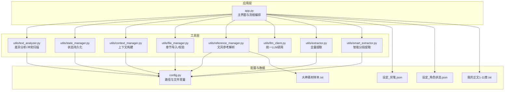
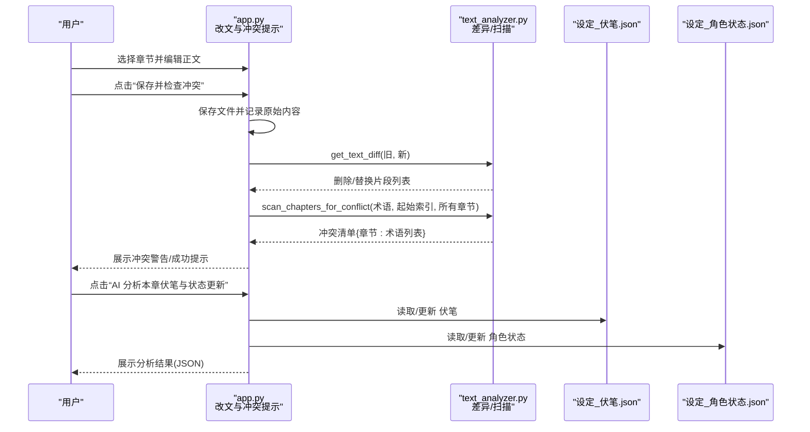
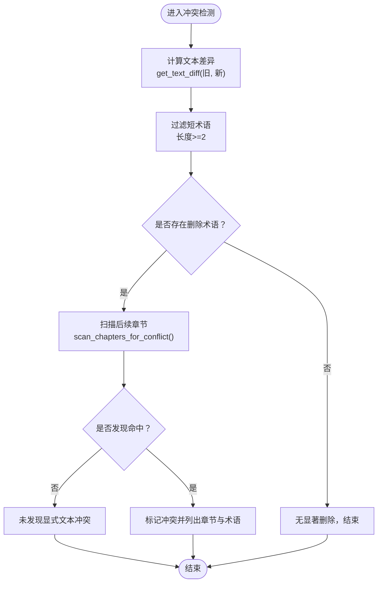
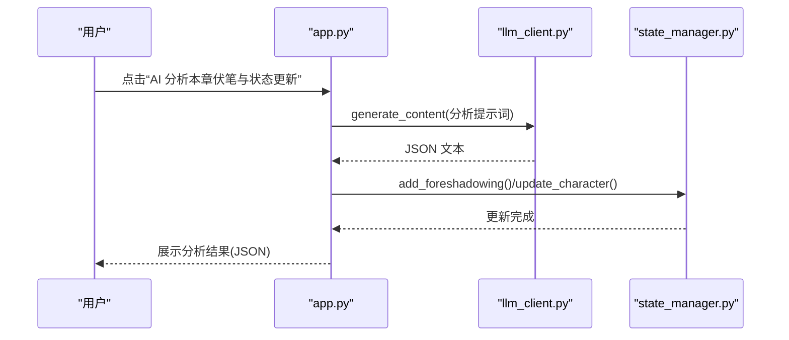
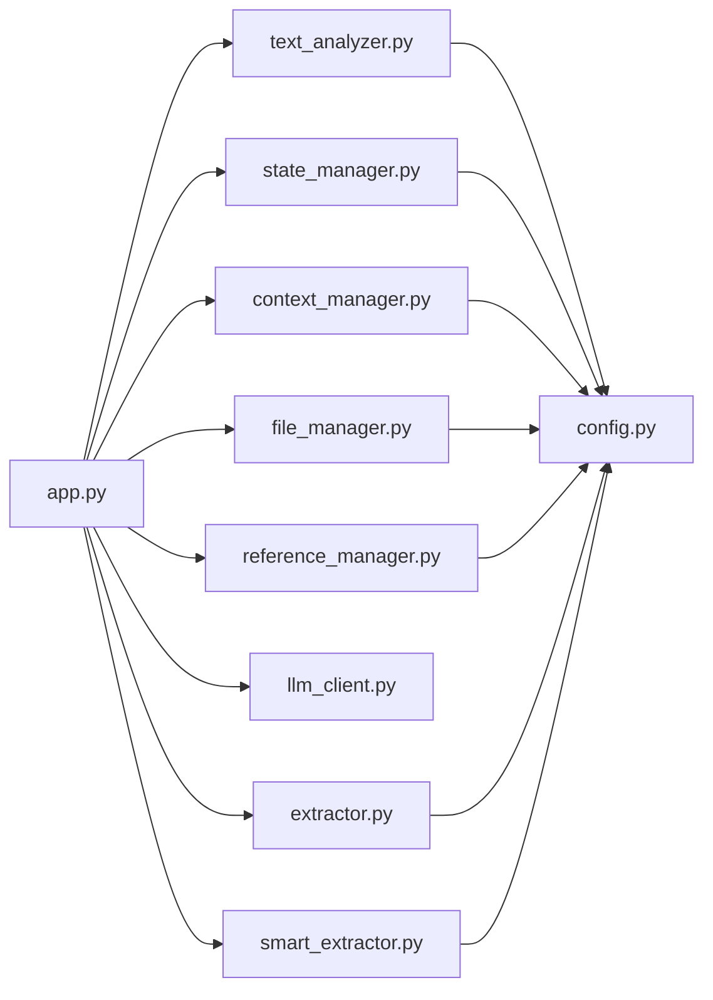

# 改文与冲突检测

<cite>
**本文引用的文件**
- [app.py](file://app.py)
- [text_analyzer.py](file://utils/text_analyzer.py)
- [state_manager.py](file://utils/state_manager.py)
- [context_manager.py](file://utils/context_manager.py)
- [config.py](file://config.py)
- [file_manager.py](file://utils/file_manager.py)
- [reference_manager.py](file://utils/reference_manager.py)
- [llm_client.py](file://utils/llm_client.py)
- [extractor.py](file://utils/extractor.py)
- [smart_extractor.py](file://utils/smart_extractor.py)
- [设定_伏笔.json](file://设定/设定_伏笔.json)
- [设定_角色状态.json](file://设定/设定_角色状态.json)
- [大神素材样本.txt](file://参考/大神素材样本.txt)
- [我的正文1-11章.txt](file://正文/我的正文1-11章.txt)
</cite>

## 目录
1. [简介](#简介)
2. [项目结构](#项目结构)
3. [核心组件](#核心组件)
4. [架构总览](#架构总览)
5. [详细组件分析](#详细组件分析)
6. [依赖关系分析](#依赖关系分析)
7. [性能考量](#性能考量)
8. [故障排查指南](#故障排查指南)
9. [结论](#结论)
10. [附录](#附录)

## 简介
本指南聚焦“改文与冲突检测”功能，帮助创作者在编辑正文章节时，安全地进行文本变更、检测潜在冲突、扫描后续章节中的冲突、更新角色状态与伏笔信息。文档涵盖：
- 文本差异分析算法与实现思路
- 冲突检测机制与未来章节扫描策略
- 冲突类型识别与检测精度说明
- 状态更新流程与最佳实践
- 文本编辑技巧、冲突规避方法与状态管理建议

## 项目结构
该应用采用模块化设计，围绕“正文编辑—差异检测—冲突扫描—状态更新”闭环工作流组织功能。关键目录与文件：
- 应用入口与界面：app.py
- 工具模块：utils/ 下的 text_analyzer、state_manager、context_manager、file_manager、reference_manager、llm_client、extractor、smart_extractor
- 配置与常量：config.py
- 状态文件：设定/ 下的 设定_伏笔.json、设定_角色状态.json
- 示例数据：参考/、正文/、细纲/、历史版本/

图表来源
- [app.py](file://app.py#L628-L719)
- [text_analyzer.py](file://utils/text_analyzer.py#L1-L63)
- [state_manager.py](file://utils/state_manager.py#L1-L77)
- [context_manager.py](file://utils/context_manager.py#L1-L93)
- [config.py](file://config.py#L1-L24)
- [file_manager.py](file://utils/file_manager.py#L1-L108)
- [reference_manager.py](file://utils/reference_manager.py#L1-L94)
- [llm_client.py](file://utils/llm_client.py#L1-L203)
- [extractor.py](file://utils/extractor.py#L1-L194)
- [smart_extractor.py](file://utils/smart_extractor.py#L1-L313)

章节来源
- [app.py](file://app.py#L628-L719)
- [config.py](file://config.py#L1-L24)

## 核心组件
- 改文与冲突检测主流程：在 app.py 的“改文与冲突提示”页面中，提供章节选择、编辑、保存与冲突检测、状态更新建议。
- 文本差异分析：基于 difflib 的序列相似度比较，提取被删除/替换的片段集合。
- 冲突扫描：对后续章节逐字匹配搜索已删除的关键术语，返回冲突清单。
- 状态管理：提供角色状态与伏笔的读取、保存、快照与更新接口。
- 上下文构建：整合角色状态、待回收伏笔、设定与近期章节，形成讨论细纲的上下文。
- LLM 统一客户端：支持 Gemini 与 OpenAI 兼容服务，提供内容生成与聊天接口。

章节来源
- [app.py](file://app.py#L628-L719)
- [text_analyzer.py](file://utils/text_analyzer.py#L7-L63)
- [state_manager.py](file://utils/state_manager.py#L21-L77)
- [context_manager.py](file://utils/context_manager.py#L43-L93)
- [llm_client.py](file://utils/llm_client.py#L29-L142)

## 架构总览
改文与冲突检测的端到端流程如下：

图表来源
- [app.py](file://app.py#L628-L719)
- [text_analyzer.py](file://utils/text_analyzer.py#L7-L63)
- [state_manager.py](file://utils/state_manager.py#L21-L77)

## 详细组件分析

### 文本差异分析与冲突扫描
- 差异分析算法
  - 使用 difflib.SequenceMatcher 对旧文本与新文本进行序列级比较，合并“replace/delete”类型的片段，作为“被删除/替换”的候选术语集合。
  - 该方法对句子级差异敏感，适合检测“删除句”“替换名”等场景；对语义等价但表达不同的改动可能漏检。
- 冲突扫描策略
  - 从当前章节之后的章节列表开始遍历，逐章读取内容，对每个术语执行包含判断，过滤长度小于2的术语，保留命中术语清单。
  - 返回格式为 {章节名: [术语列表]}，便于前端直观呈现。
- 冲突类型识别
  - 显式文本冲突：术语在后续章节中直接出现。
  - 名称替换冲突：术语为角色名/物品名等关键标识，替换后导致后续章节引用不一致。
  - 逻辑冲突：术语代表事件/设定，删除后后续章节仍沿用旧设定。
- 检测精度说明
  - 基于精确包含匹配，不进行语义消歧或同义词扩展，因此：
    - 高精度：能准确定位“删改了什么”，避免误报。
    - 低召回：对语义等价但字面不同的改动可能漏报。
  - 建议：结合人工复核与更细粒度的术语抽取（如命名实体识别）提升召回。

图表来源
- [app.py](file://app.py#L651-L681)
- [text_analyzer.py](file://utils/text_analyzer.py#L7-L63)

章节来源
- [text_analyzer.py](file://utils/text_analyzer.py#L7-L63)
- [app.py](file://app.py#L651-L681)

### 状态与伏笔更新流程
- 角色状态更新
  - 读取现有状态字典，若角色不存在则初始化；合并传入的更新字段，记录最后更新章节与时间戳；保存到 JSON 文件。
- 伏笔管理
  - 读取伏笔列表，新增项包含唯一 ID、内容、创建章节、状态、创建时间等；保存到 JSON 文件。
- 快照与历史
  - 基于当前章节名与时间戳复制当前状态文件到历史版本目录，便于回溯。
- AI 辅助分析
  - app.py 中提供“AI 分析本章伏笔与状态更新”按钮，构造提示词调用 LLM 输出 JSON，提示当前章节中新增/回收的伏笔与角色状态变更，供人工确认与写入。

图表来源
- [app.py](file://app.py#L687-L719)
- [llm_client.py](file://utils/llm_client.py#L29-L142)
- [state_manager.py](file://utils/state_manager.py#L50-L77)

章节来源
- [state_manager.py](file://utils/state_manager.py#L21-L77)
- [app.py](file://app.py#L687-L719)

### 上下文构建与细纲讨论
- 上下文构建
  - 读取角色状态与待回收伏笔，拼接设定摘要与最近 N 章内容，形成 LLM 的完整提示词。
- 细纲讨论
  - 在“探讨细纲”页面，加载上下文并生成回复，支持保存为当前细纲文件，便于续写正文时参考。

章节来源
- [context_manager.py](file://utils/context_manager.py#L43-L93)
- [app.py](file://app.py#L506-L544)

### 文风参考与正文续写
- 文风参考
  - 解析“大神素材样本.txt”，提取章节提示与关键词，支持在续写时选择参考段落。
- 正文续写
  - 读取当前细纲，结合文风参考生成完整章节内容，支持编辑与保存到正文目录。

章节来源
- [reference_manager.py](file://utils/reference_manager.py#L5-L94)
- [app.py](file://app.py#L546-L626)

### 初始化与正文导入
- 目录与状态文件初始化
  - 创建必要目录与空的状态文件。
- 全量状态提取
  - 支持标准模式与智能分段模式，将全文拆分为窗口，保持上下文连续性，合并结果并保存到对应文件。
- 正文导入
  - 将单文件正文按章节标题拆分并保存到正文目录。

章节来源
- [app.py](file://app.py#L310-L425)
- [file_manager.py](file://utils/file_manager.py#L16-L108)
- [smart_extractor.py](file://utils/smart_extractor.py#L5-L58)
- [extractor.py](file://utils/extractor.py#L6-L56)

## 依赖关系分析
- 组件耦合
  - app.py 作为编排器，依赖 utils 下各模块与 config 常量；text_analyzer 与 state_manager 独立性强，便于单元测试与扩展。
- 外部依赖
  - LLM 客户端支持 Gemini 与 OpenAI 兼容服务，通过环境变量切换；文件系统用于读写正文与状态文件。
- 潜在风险
  - 冲突扫描为精确包含匹配，易受文本风格影响；建议在大规模文本中引入术语抽取与规范化流程。

图表来源
- [app.py](file://app.py#L11-L12)
- [config.py](file://config.py#L1-L24)

章节来源
- [app.py](file://app.py#L11-L12)
- [config.py](file://config.py#L1-L24)

## 性能考量
- 冲突扫描复杂度
  - 对后续 N 章逐章扫描，时间复杂度约为 O(N × M × T)，其中 N 为后续章节数、M 为每章字符数、T 为术语数。可通过缓存/索引优化。
- LLM 调用成本
  - 全量提取与智能分段均会产生 Token 消耗，建议合理设置窗口大小与重叠，平衡准确性与成本。
- 文件 I/O
  - 大文件读写与频繁 JSON 读取可能成为瓶颈，建议在批量操作时合并写入与使用增量更新。

## 故障排查指南
- API 配置问题
  - 确认 LLM_PROVIDER、OPENAI_API_KEY、OPENAI_BASE_URL（或 GOOGLE_API_KEY）已正确设置；不同提供商的 Base URL 与鉴权方式不同。
- 冲突检测无效
  - 检查术语过滤阈值（长度<2 的术语会被忽略）；确认删除术语确实在后续章节中出现。
- 状态文件为空
  - 初始化阶段未创建状态文件或提取失败；检查 JSON 文件是否存在与可读写。
- 正文导入失败
  - 确认章节标题格式与正文章节匹配；检查文件编码与换行符。
- LLM 返回异常
  - 查看终端输出的详细错误信息，确认网络连通性与模型可用性。

章节来源
- [app.py](file://app.py#L310-L425)
- [llm_client.py](file://utils/llm_client.py#L9-L142)
- [text_analyzer.py](file://utils/text_analyzer.py#L54-L62)
- [state_manager.py](file://utils/state_manager.py#L8-L20)

## 结论
“改文与冲突检测”功能通过“差异分析 + 后续扫描 + 状态更新”的闭环，为创作者提供了可控、可追溯的改文流程。建议在实际使用中：
- 编辑时尽量保留关键术语（角色名、物品名、重要设定），减少后续冲突。
- 使用 AI 分析结果作为参考，手动确认并写入状态文件。
- 对大规模文本采用智能分段提取与术语规范化，提升检测召回率。
- 定期创建状态快照，保障历史可回溯。

## 附录

### 使用步骤速览
- 选择章节并编辑正文
- 点击“保存并检查冲突”，查看冲突清单
- 点击“AI 分析本章伏笔与状态更新”，确认并写入状态文件
- 如需，调整文风参考后续写正文

章节来源
- [app.py](file://app.py#L628-L719)