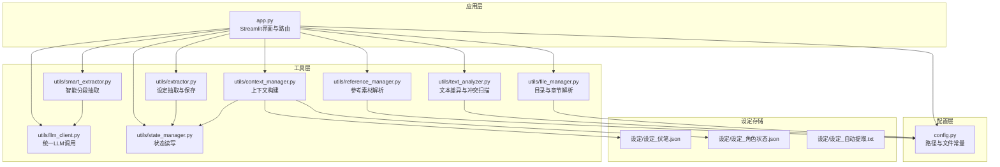
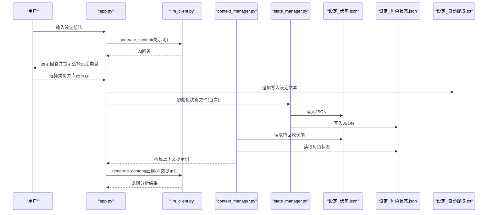
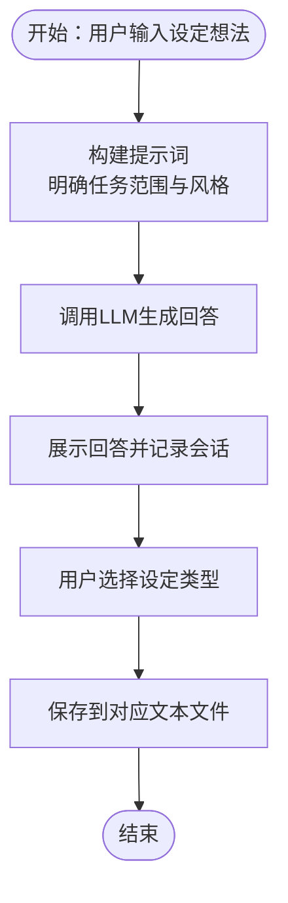
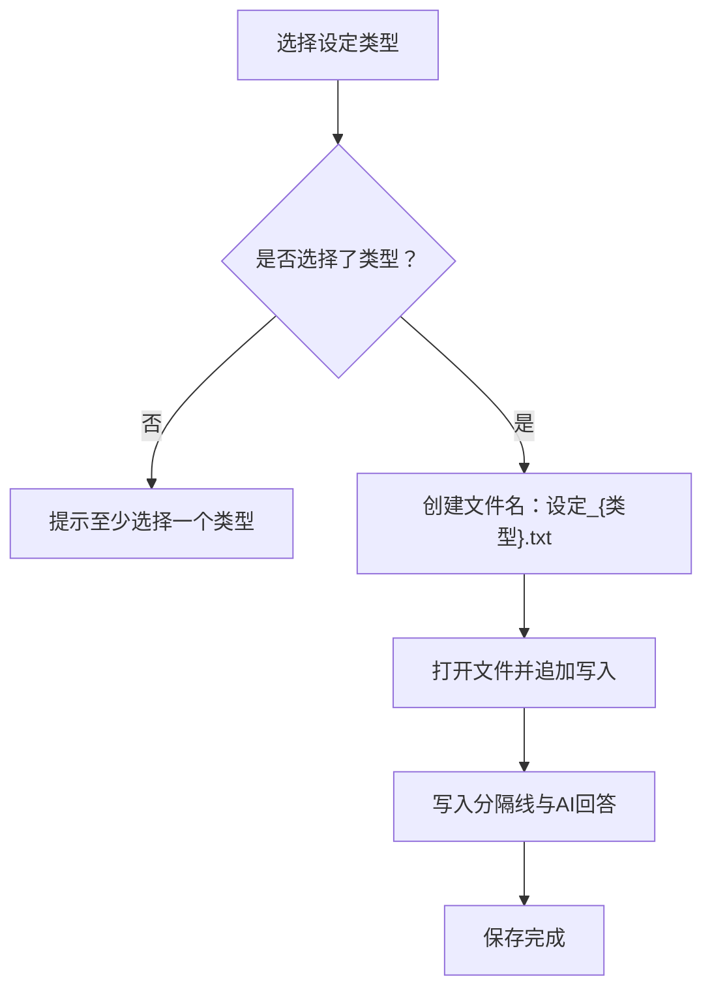
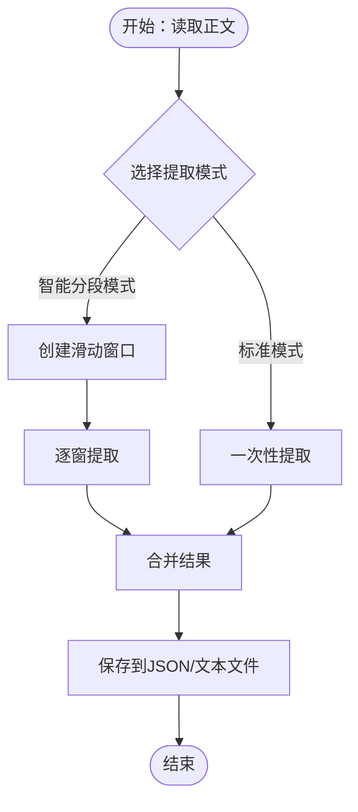
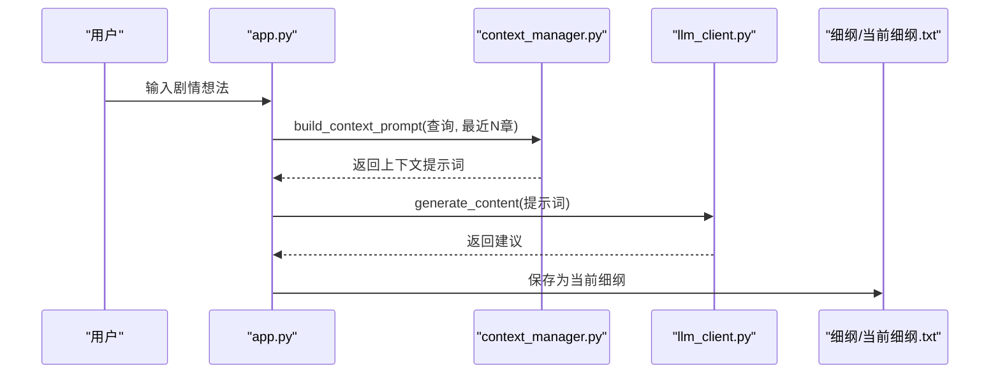
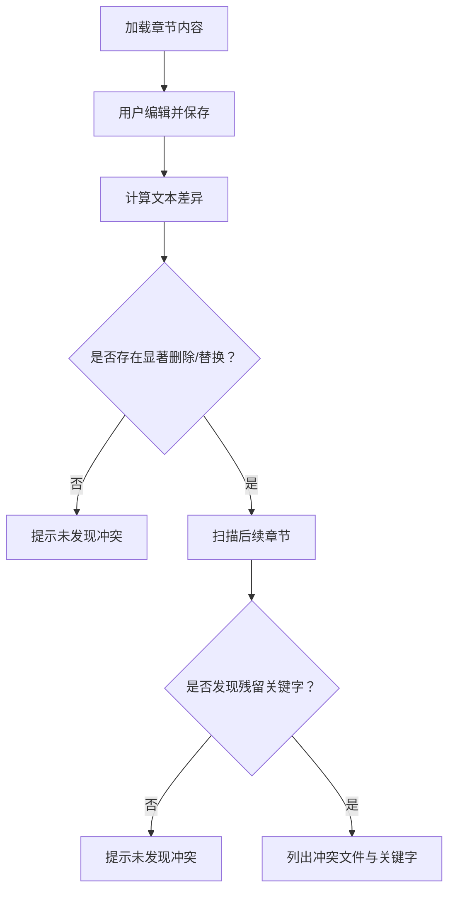
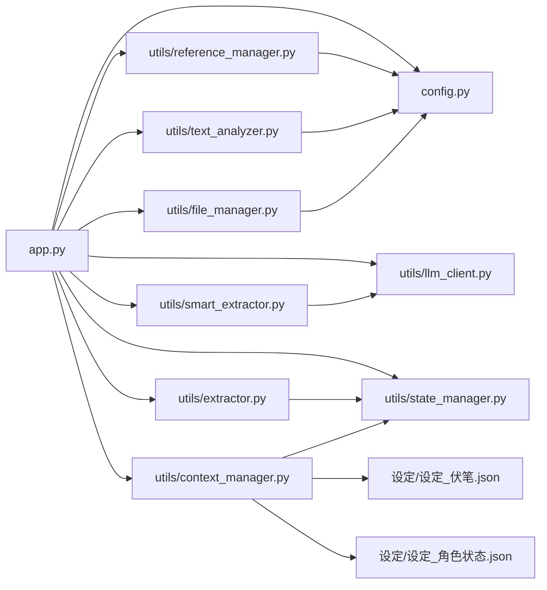

# 智能设定探讨

<cite>
**本文引用的文件**
- [app.py](file://app.py)
- [config.py](file://config.py)
- [utils/context_manager.py](file://utils/context_manager.py)
- [utils/llm_client.py](file://utils/llm_client.py)
- [utils/file_manager.py](file://utils/file_manager.py)
- [utils/state_manager.py](file://utils/state_manager.py)
- [utils/reference_manager.py](file://utils/reference_manager.py)
- [utils/text_analyzer.py](file://utils/text_analyzer.py)
- [utils/extractor.py](file://utils/extractor.py)
- [utils/smart_extractor.py](file://utils/smart_extractor.py)
- [设定/设定_伏笔.json](file://设定/设定_伏笔.json)
- [设定/设定_角色状态.json](file://设定/设定_角色状态.json)
- [设定/设定_自动提取.txt](file://设定/设定_自动提取.txt)
- [requirements.txt](file://requirements.txt)
</cite>

## 目录
1. [简介](#简介)
2. [项目结构](#项目结构)
3. [核心组件](#核心组件)
4. [架构总览](#架构总览)
5. [详细组件分析](#详细组件分析)
6. [依赖关系分析](#依赖关系分析)
7. [性能考量](#性能考量)
8. [故障排查指南](#故障排查指南)
9. [结论](#结论)
10. [附录](#附录)

## 简介
本指南面向希望使用“智能设定探讨”功能的创作者，围绕以下目标展开：
- 如何与AI助手进行设定讨论，获得高质量的设定内容
- AI提示词设计原理与对话流程
- 设定内容的自动识别与分类
- 将设定内容保存到不同类型的文件中（文本与JSON）
- 实际对话示例、设定分类建议与保存策略
- 设定创作最佳实践与常见问题解决方案

该系统以Streamlit为界面入口，结合多提供商LLM客户端、上下文管理器、状态管理器与文件管理器，形成“设定探讨—内容生成—状态记录—文件保存”的闭环。

## 项目结构
项目采用按功能域划分的模块化组织方式，核心目录与文件如下：
- 应用入口与UI：app.py
- 配置常量：config.py
- 工具模块：
  - LLM客户端：utils/llm_client.py
  - 上下文管理：utils/context_manager.py
  - 文件管理：utils/file_manager.py
  - 状态管理：utils/state_manager.py
  - 参考素材管理：utils/reference_manager.py
  - 文本分析：utils/text_analyzer.py
  - 设定抽取：utils/extractor.py、utils/smart_extractor.py
- 设定存储：
  - 伏笔清单：设定/设定_伏笔.json
  - 角色状态：设定/设定_角色状态.json
  - 自动提取文本：设定/设定_自动提取.txt
- 依赖声明：requirements.txt

图表来源
- [app.py](file://app.py#L1-L719)
- [config.py](file://config.py#L1-L24)
- [utils/llm_client.py](file://utils/llm_client.py#L1-L203)
- [utils/context_manager.py](file://utils/context_manager.py#L1-L93)
- [utils/file_manager.py](file://utils/file_manager.py#L1-L108)
- [utils/state_manager.py](file://utils/state_manager.py#L1-L77)
- [utils/reference_manager.py](file://utils/reference_manager.py#L1-L94)
- [utils/text_analyzer.py](file://utils/text_analyzer.py#L1-L63)
- [utils/extractor.py](file://utils/extractor.py#L1-L194)
- [utils/smart_extractor.py](file://utils/smart_extractor.py#L1-L313)
- [设定/设定_伏笔.json](file://设定/设定_伏笔.json#L1-L1)
- [设定/设定_角色状态.json](file://设定/设定_角色状态.json#L1-L1)
- [设定/设定_自动提取.txt](file://设定/设定_自动提取.txt#L1-L1)

章节来源
- [app.py](file://app.py#L1-L719)
- [config.py](file://config.py#L1-L24)

## 核心组件
- 应用入口与路由：负责页面布局、API提供商选择、会话状态维护、功能切换与交互逻辑。
- LLM客户端：统一处理Gemini与OpenAI兼容服务，支持重试、超时与公司内测平台适配。
- 上下文管理器：整合角色状态、待回收伏笔、设定摘要与最近章节内容，构建完整提示词。
- 文件管理器：确保目录结构、解析正文章节并保存到独立文件。
- 状态管理器：读写JSON格式的伏笔与角色状态文件，支持快照备份。
- 设定抽取器：从全文提取角色状态、伏笔、设定与剧情回顾，并保存到对应文件。
- 智能分段抽取器：针对长文本的滑动窗口处理，保持上下文完整性，提升准确性。
- 文本分析器：计算文本差异，扫描后续章节是否存在被删除/修改的关键字残留。
- 参考素材管理器：解析“大神素材样本”，定位原著中的参考片段。

章节来源
- [app.py](file://app.py#L427-L504)
- [utils/llm_client.py](file://utils/llm_client.py#L1-L203)
- [utils/context_manager.py](file://utils/context_manager.py#L1-L93)
- [utils/file_manager.py](file://utils/file_manager.py#L1-L108)
- [utils/state_manager.py](file://utils/state_manager.py#L1-L77)
- [utils/extractor.py](file://utils/extractor.py#L1-L194)
- [utils/smart_extractor.py](file://utils/smart_extractor.py#L1-L313)
- [utils/text_analyzer.py](file://utils/text_analyzer.py#L1-L63)
- [utils/reference_manager.py](file://utils/reference_manager.py#L1-L94)

## 架构总览
智能设定探讨的端到端流程如下：
- 用户在“探讨设定”页面输入设定想法
- 系统构建提示词并调用LLM生成回答
- 用户选择设定类型，将回答追加保存至对应文本文件
- 同时，系统可结合“初始化”功能进行全量状态提取，将结果写入JSON与文本文件
- “探讨细纲”与“改文与冲突提示”环节可联动状态与设定，保障一致性

图表来源
- [app.py](file://app.py#L427-L504)
- [utils/llm_client.py](file://utils/llm_client.py#L1-L203)
- [utils/context_manager.py](file://utils/context_manager.py#L1-L93)
- [utils/state_manager.py](file://utils/state_manager.py#L1-L77)
- [设定/设定_伏笔.json](file://设定/设定_伏笔.json#L1-L1)
- [设定/设定_角色状态.json](file://设定/设定_角色状态.json#L1-L1)
- [设定/设定_自动提取.txt](file://设定/设定_自动提取.txt#L1-L1)

## 详细组件分析

### 设定探讨对话流程与提示词设计
- 对话入口：在“探讨设定”页面，用户输入设定想法，系统自动构建提示词并调用LLM生成回答。
- 提示词要点：
  - 明确角色定位：强调“专业的网文设定助手”
  - 明确任务范围：要求涵盖“世界观、人物、势力、物品、规则、制度、历史背景”等多方面
  - 语言风格约束：保持网文创作的语言风格，内容具体、生动
- 会话状态：使用会话状态记录用户与AI的对话历史，便于保存与复用。

图表来源
- [app.py](file://app.py#L441-L472)
- [app.py](file://app.py#L477-L504)

章节来源
- [app.py](file://app.py#L427-L504)

### 设定类型自动识别与保存机制
- 类型选择：当前实现为手动多选类型（如“世界观/地图设定”、“人物设定”、“势力/组织设定”等），便于用户聚焦重点。
- 保存策略：
  - 文本文件：按类型命名“设定_{类型}.txt”，追加写入“--- 用户输入 ---”分隔与AI回答
  - JSON文件：用于“角色状态”和“伏笔”等结构化数据，分别写入“设定_角色状态.json”和“设定_伏笔.json”
- 初始化：在“初始化”功能中，若状态文件不存在则自动创建空结构，确保后续保存可用。

图表来源
- [app.py](file://app.py#L477-L504)
- [utils/state_manager.py](file://utils/state_manager.py#L1-L77)
- [设定/设定_伏笔.json](file://设定/设定_伏笔.json#L1-L1)
- [设定/设定_角色状态.json](file://设定/设定_角色状态.json#L1-L1)

章节来源
- [app.py](file://app.py#L477-L504)
- [utils/state_manager.py](file://utils/state_manager.py#L1-L77)

### 全量状态提取与智能分段抽取
- 全量提取：从完整正文出发，调用LLM一次性提取角色状态、伏笔、设定与剧情回顾，并保存到对应文件。
- 智能分段：针对超长文本，采用滑动窗口策略，保持上下文连续性，逐窗提取后再合并，减少上下文截断带来的误差。
- 合并策略：角色状态直接覆盖更新；伏笔去重；设定与剧情回顾按窗口上下文拼接，保留时间/位置线索。

图表来源
- [app.py](file://app.py#L342-L410)
- [utils/extractor.py](file://utils/extractor.py#L1-L194)
- [utils/smart_extractor.py](file://utils/smart_extractor.py#L1-L313)

章节来源
- [app.py](file://app.py#L342-L410)
- [utils/extractor.py](file://utils/extractor.py#L1-L194)
- [utils/smart_extractor.py](file://utils/smart_extractor.py#L1-L313)

### 上下文构建与细纲探讨
- 上下文构建：整合“角色状态”“待回收伏笔”“设定摘要”“最近N章正文”四类信息，形成完整提示词，供细纲探讨与续写正文使用。
- 细纲探讨：用户输入剧情想法，系统构建上下文并调用LLM生成建议，支持保存为“当前细纲.txt”。

图表来源
- [app.py](file://app.py#L506-L544)
- [utils/context_manager.py](file://utils/context_manager.py#L43-L92)
- [utils/llm_client.py](file://utils/llm_client.py#L1-L203)

章节来源
- [app.py](file://app.py#L506-L544)
- [utils/context_manager.py](file://utils/context_manager.py#L1-L93)

### 改文与冲突提示
- 冲突检测：比较编辑前后文本差异，提取被删除/替换的片段，扫描后续章节是否仍包含这些关键字，提示潜在冲突。
- 建议流程：保存修改后的章节后，触发冲突扫描，给出后续章节中可能存在的显式残留。

图表来源
- [app.py](file://app.py#L628-L719)
- [utils/text_analyzer.py](file://utils/text_analyzer.py#L1-L63)

章节来源
- [app.py](file://app.py#L628-L719)
- [utils/text_analyzer.py](file://utils/text_analyzer.py#L1-L63)

## 依赖关系分析
- 应用层依赖配置层与工具层，工具层之间存在清晰的职责边界：
  - LLM客户端负责统一调用，屏蔽提供商差异
  - 上下文管理器聚合状态与设定，形成提示词
  - 状态管理器负责JSON文件的读写与快照
  - 抽取器与智能分段抽取器负责从正文提取并保存
  - 文本分析器与文件管理器分别负责冲突检测与目录/章节管理
- 设定存储文件作为状态持久化载体，支撑后续创作与冲突检测。

图表来源
- [app.py](file://app.py#L1-L719)
- [config.py](file://config.py#L1-L24)
- [utils/llm_client.py](file://utils/llm_client.py#L1-L203)
- [utils/context_manager.py](file://utils/context_manager.py#L1-L93)
- [utils/file_manager.py](file://utils/file_manager.py#L1-L108)
- [utils/state_manager.py](file://utils/state_manager.py#L1-L77)
- [utils/extractor.py](file://utils/extractor.py#L1-L194)
- [utils/smart_extractor.py](file://utils/smart_extractor.py#L1-L313)
- [utils/text_analyzer.py](file://utils/text_analyzer.py#L1-L63)
- [utils/reference_manager.py](file://utils/reference_manager.py#L1-L94)
- [设定/设定_伏笔.json](file://设定/设定_伏笔.json#L1-L1)
- [设定/设定_角色状态.json](file://设定/设定_角色状态.json#L1-L1)

章节来源
- [app.py](file://app.py#L1-L719)
- [config.py](file://config.py#L1-L24)

## 性能考量
- LLM调用成本：提示词长度与上下文窗口直接影响Token消耗。建议：
  - 控制提示词长度，优先保留关键上下文
  - 使用智能分段抽取处理超长正文，平衡准确性与成本
- 重试与超时：LLM客户端内置重试与较长超时，降低网络波动影响
- 文件I/O：批量保存时尽量减少频繁打开/关闭文件，合并写入

[本节为通用指导，无需特定文件来源]

## 故障排查指南
- API配置问题
  - 确认已选择正确的提供商并填写API Key/Base URL
  - 检查环境变量是否正确写入会话状态
- LLM调用异常
  - 查看终端输出的详细错误信息（包含模型名、URL、Key长度、错误类型与堆栈）
  - 对公司内测平台，确认Base URL与Token格式（支持带/不带Bearer前缀）
- 设定保存失败
  - 确认已选择至少一种设定类型
  - 检查“设定/”目录是否存在且可写
- 全量提取失败
  - 检查正文文件是否存在
  - 尝试调整智能分段的窗口大小与重叠大小
- 冲突检测无结果
  - 确认删除/替换的片段足够长（默认忽略单字符）
  - 检查后续章节是否确实包含相同关键字

章节来源
- [utils/llm_client.py](file://utils/llm_client.py#L99-L113)
- [utils/llm_client.py](file://utils/llm_client.py#L128-L141)
- [app.py](file://app.py#L477-L504)
- [app.py](file://app.py#L342-L410)
- [utils/text_analyzer.py](file://utils/text_analyzer.py#L54-L62)

## 结论
“智能设定探讨”功能通过统一的LLM接口、完善的上下文构建与状态持久化机制，为创作者提供了从对话生成到文件落地的一体化体验。配合全量与智能分段抽取、冲突检测与参考素材管理，能够有效提升设定质量与创作效率。建议在实际使用中：
- 明确提示词边界，聚焦设定维度
- 合理选择保存类型，兼顾结构化与可读性
- 利用冲突检测与状态快照，保障故事连贯性
- 根据正文规模选择合适的抽取模式

[本节为总结性内容，无需特定文件来源]

## 附录

### 实际对话示例（概念性说明）
- 示例A：用户输入“主角的金手指是什么？”
  - 系统提示词包含“网文风格”“多维度设定”等约束
  - AI回答包含“金手指类型”“触发条件”“限制与代价”等要点
  - 用户选择“物品/道具设定”与“规则/制度设定”，保存至对应文本文件
- 示例B：用户输入“下一章如何安排一场关键战斗？”
  - 系统结合“角色状态”“待回收伏笔”“设定摘要”“最近章节”构建上下文
  - AI给出战斗节奏、关键转折与潜在风险提示
  - 用户将建议保存为“当前细纲.txt”

[本节为概念性示例，无需特定文件来源]

### 设定分类建议
- 建议优先覆盖以下类别，便于后续创作与冲突检测：
  - 世界观/地图设定
  - 人物设定
  - 势力/组织设定
  - 战力/功法设定
  - 物品/道具设定
  - 历史/背景设定
  - 规则/制度设定
  - 其他特殊设定

[本节为通用建议，无需特定文件来源]

### 保存策略
- 文本文件（便于人工审阅与二次加工）：
  - 命名规范：设定_{类型}.txt
  - 内容格式：以“--- 用户输入 ---”分隔，便于回溯
- JSON文件（便于程序读取与状态管理）：
  - 角色状态：键为角色名，值包含状态、装备、能力等字段
  - 伏笔：包含内容、状态、创建章节、创建时间等字段

[本节为通用策略，无需特定文件来源]