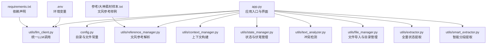
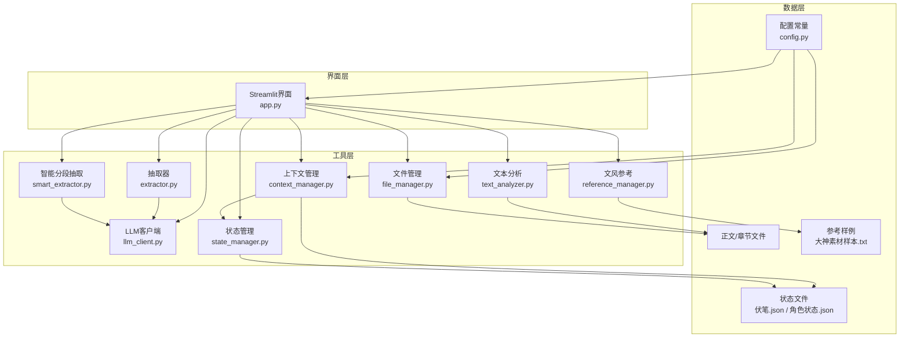
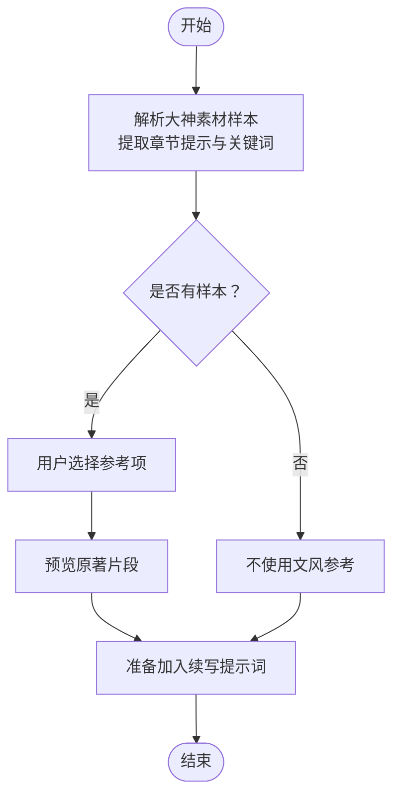
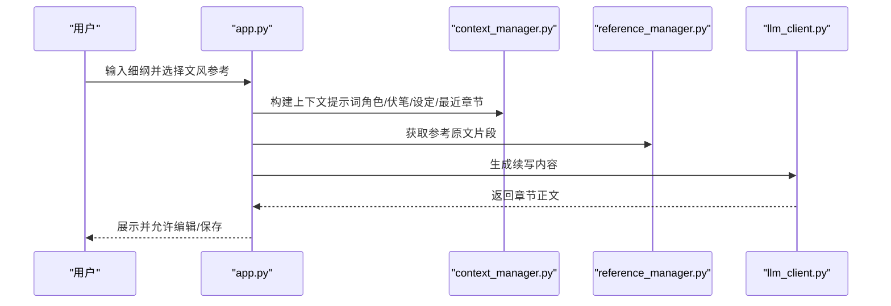
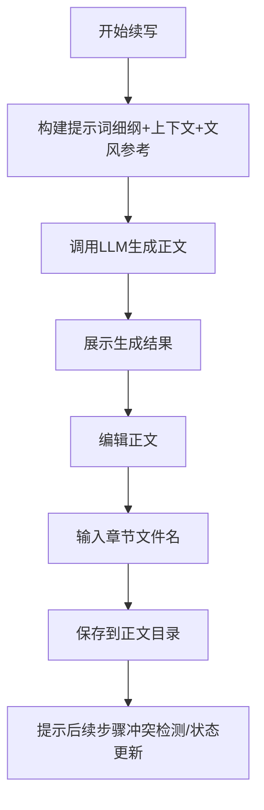
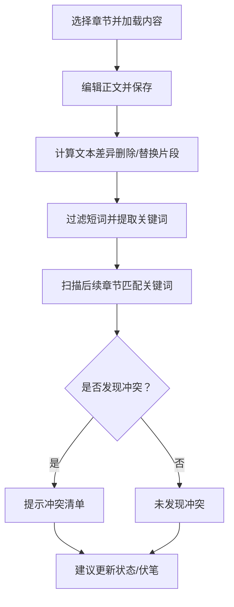
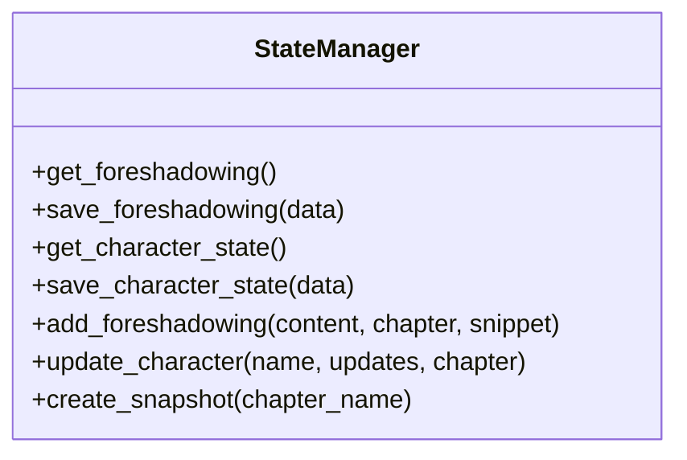
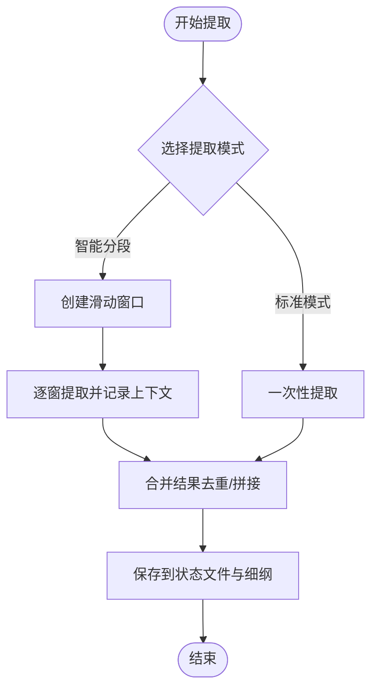
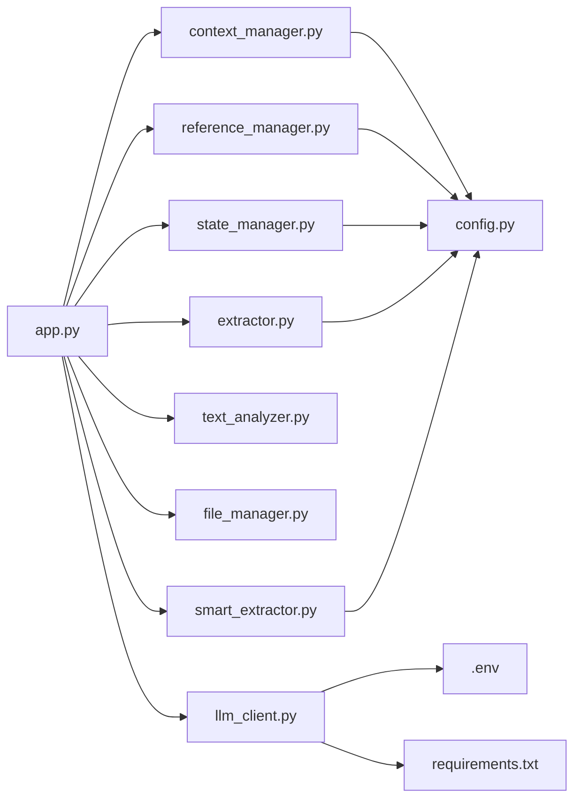

# 正文续写引擎

<cite>
**本文引用的文件**
- [app.py](file://app.py)
- [config.py](file://config.py)
- [utils/context_manager.py](file://utils/context_manager.py)
- [utils/reference_manager.py](file://utils/reference_manager.py)
- [utils/llm_client.py](file://utils/llm_client.py)
- [utils/state_manager.py](file://utils/state_manager.py)
- [utils/text_analyzer.py](file://utils/text_analyzer.py)
- [utils/file_manager.py](file://utils/file_manager.py)
- [utils/extractor.py](file://utils/extractor.py)
- [utils/smart_extractor.py](file://utils/smart_extractor.py)
- [.env](file://.env)
- [requirements.txt](file://requirements.txt)
- [参考/大神素材样本.txt](file://参考/大神素材样本.txt)
</cite>

## 目录
1. [简介](#简介)
2. [项目结构](#项目结构)
3. [核心组件](#核心组件)
4. [架构总览](#架构总览)
5. [详细组件分析](#详细组件分析)
6. [依赖关系分析](#依赖关系分析)
7. [性能与稳定性](#性能与稳定性)
8. [使用指南与最佳实践](#使用指南与最佳实践)
9. [故障排查](#故障排查)
10. [结论](#结论)

## 简介
本“正文续写引擎”是一个基于 Streamlit 的本地化创作辅助工具，围绕“细纲驱动 + 文风参考 + LLM 续写 + 状态管理 + 冲突检测”的工作流设计。用户可通过“探讨细纲”构建剧情上下文，选择“大神素材样本”作为文风参考，生成正文内容，并在“改文与冲突提示”中进行编辑与冲突扫描，实现高质量、可持续的长篇网文创作。

## 项目结构
- 应用入口与界面：app.py
- 配置与目录常量：config.py
- 工具模块（LLM 客户端、状态管理、上下文构建、参考解析、文件处理、文本分析、抽取器等）
- 示例数据：参考/大神素材样本.txt
- 环境变量与依赖：.env、requirements.txt

图表来源
- [app.py](file://app.py#L1-L719)
- [config.py](file://config.py#L1-L24)
- [utils/context_manager.py](file://utils/context_manager.py#L1-L93)
- [utils/reference_manager.py](file://utils/reference_manager.py#L1-L94)
- [utils/llm_client.py](file://utils/llm_client.py#L1-L203)
- [utils/state_manager.py](file://utils/state_manager.py#L1-L77)
- [utils/text_analyzer.py](file://utils/text_analyzer.py#L1-L63)
- [utils/file_manager.py](file://utils/file_manager.py#L1-L108)
- [utils/extractor.py](file://utils/extractor.py#L1-L194)
- [utils/smart_extractor.py](file://utils/smart_extractor.py#L1-L313)
- [.env](file://.env#L1-L22)
- [requirements.txt](file://requirements.txt#L1-L6)
- [参考/大神素材样本.txt](file://参考/大神素材样本.txt#L1-L614)

章节来源
- [app.py](file://app.py#L1-L719)
- [config.py](file://config.py#L1-L24)

## 核心组件
- 应用入口与界面：负责侧边栏配置、功能切换、正文续写流程编排、冲突检测与状态更新提示。
- LLM 客户端：统一处理 Gemini 与 OpenAI 兼容服务，支持重试、超时与公司测试平台适配。
- 上下文管理：聚合最近章节、角色状态、待回收伏笔、相关设定，构建续写提示词。
- 文风参考：解析“大神素材样本”，定位原著片段，作为文风模仿依据。
- 文件管理：导入单文件正文为多章节、检查资源状态、保证目录结构。
- 状态管理：维护“伏笔列表”和“角色状态”，支持快照与增量更新。
- 文本分析：对比编辑前后差异，扫描后续章节是否存在被删除关键词的残留引用。
- 抽取器：从全文一次性提取角色状态、伏笔、设定与剧情回顾；智能分段器支持长文本的上下文完整性。

章节来源
- [utils/llm_client.py](file://utils/llm_client.py#L1-L203)
- [utils/context_manager.py](file://utils/context_manager.py#L1-L93)
- [utils/reference_manager.py](file://utils/reference_manager.py#L1-L94)
- [utils/file_manager.py](file://utils/file_manager.py#L1-L108)
- [utils/state_manager.py](file://utils/state_manager.py#L1-L77)
- [utils/text_analyzer.py](file://utils/text_analyzer.py#L1-L63)
- [utils/extractor.py](file://utils/extractor.py#L1-L194)
- [utils/smart_extractor.py](file://utils/smart_extractor.py#L1-L313)

## 架构总览
应用采用“界面层 → 工具层 → 数据层”的分层设计。界面层通过 Streamlit 提供交互；工具层封装 LLM、状态、上下文、文件与分析逻辑；数据层由本地 JSON/文本文件承载状态与正文。

图表来源
- [app.py](file://app.py#L1-L719)
- [utils/context_manager.py](file://utils/context_manager.py#L1-L93)
- [utils/reference_manager.py](file://utils/reference_manager.py#L1-L94)
- [utils/llm_client.py](file://utils/llm_client.py#L1-L203)
- [utils/state_manager.py](file://utils/state_manager.py#L1-L77)
- [utils/text_analyzer.py](file://utils/text_analyzer.py#L1-L63)
- [utils/file_manager.py](file://utils/file_manager.py#L1-L108)
- [utils/extractor.py](file://utils/extractor.py#L1-L194)
- [utils/smart_extractor.py](file://utils/smart_extractor.py#L1-L313)
- [config.py](file://config.py#L1-L24)

## 详细组件分析

### 组件A：文风参考与匹配算法
- 解析“大神素材样本”：从样例中提取“出自哪一章”与“搜索关键词”，形成候选参考项。
- 原著片段定位：在原著文件中按章节提示与关键词进行范围限定与上下文截取，返回可复制到续写提示词的参考片段。
- 选择机制：界面提供下拉选择，支持预览参考段落，便于对比文风与节奏。

图表来源
- [utils/reference_manager.py](file://utils/reference_manager.py#L1-L94)
- [参考/大神素材样本.txt](file://参考/大神素材样本.txt#L1-L614)

章节来源
- [utils/reference_manager.py](file://utils/reference_manager.py#L1-L94)
- [参考/大神素材样本.txt](file://参考/大神素材样本.txt#L1-L614)

### 组件B：续写提示词构建策略
- 细纲来源：来自“探讨细纲”生成的“当前细纲.txt”，作为续写任务的明确指令。
- 上下文来源：最近N章正文、角色状态、待回收伏笔、相关设定，统一打包为提示词。
- 文风参考：将选定的原著片段作为“模仿笔法、节奏”的参考，置于提示词中。
- 生成策略：将上述要素整合为结构化提示词，调用 LLM 生成完整章节内容。

图表来源
- [app.py](file://app.py#L546-L626)
- [utils/context_manager.py](file://utils/context_manager.py#L43-L92)
- [utils/reference_manager.py](file://utils/reference_manager.py#L49-L94)
- [utils/llm_client.py](file://utils/llm_client.py#L29-L142)

章节来源
- [app.py](file://app.py#L546-L626)
- [utils/context_manager.py](file://utils/context_manager.py#L43-L92)

### 组件C：正文生成与保存流程
- 生成：根据提示词调用 LLM，生成完整章节内容，存入会话状态。
- 编辑：在文本域中进行二次编辑，支持章节标题输入。
- 保存：将编辑后正文保存至“正文/”目录，文件名建议遵循“第X章 名称.txt”的命名规范。

图表来源
- [app.py](file://app.py#L581-L626)

章节来源
- [app.py](file://app.py#L581-L626)

### 组件D：冲突检测与章节改文
- 差异对比：使用序列相似度计算，识别删除/替换的关键片段。
- 后续扫描：对后续章节逐个检索是否仍包含被删除/修改的关键词，提示潜在冲突。
- 保存与更新：保存修改后的正文，并提示进行状态与伏笔更新。

图表来源
- [utils/text_analyzer.py](file://utils/text_analyzer.py#L7-L63)
- [app.py](file://app.py#L628-L719)

章节来源
- [utils/text_analyzer.py](file://utils/text_analyzer.py#L7-L63)
- [app.py](file://app.py#L628-L719)

### 组件E：状态与伏笔管理
- 读取/保存：提供 JSON 文件的读写接口，支持角色状态与伏笔列表的持久化。
- 增量更新：新增/更新角色状态字段，记录最后更新章节与时间戳。
- 快照：章节完成后可创建状态快照，便于版本追踪与回溯。

图表来源
- [utils/state_manager.py](file://utils/state_manager.py#L1-L77)

章节来源
- [utils/state_manager.py](file://utils/state_manager.py#L1-L77)

### 组件F：全量状态提取与智能分段
- 全量提取：一次性读取正文，调用 LLM 提取角色状态、伏笔、设定与剧情回顾，并保存到相应文件。
- 智能分段：对超长文本采用滑动窗口，保持上下文连续性，合并各段结果，提升准确性与稳定性。

图表来源
- [utils/extractor.py](file://utils/extractor.py#L6-L194)
- [utils/smart_extractor.py](file://utils/smart_extractor.py#L5-L313)

章节来源
- [utils/extractor.py](file://utils/extractor.py#L6-L194)
- [utils/smart_extractor.py](file://utils/smart_extractor.py#L5-L313)

## 依赖关系分析
- 界面层依赖工具层：app.py 通过 import 方式使用各工具模块。
- 工具层依赖配置：config.py 提供目录与文件路径常量，被上下文、文件管理、抽取器等模块使用。
- LLM 客户端依赖环境变量：.env 与 requirements.txt 提供提供商、模型与依赖声明。
- 数据层依赖：状态文件、正文文件与参考样例文件共同构成系统运行的数据基础。

图表来源
- [app.py](file://app.py#L11-L12)
- [config.py](file://config.py#L1-L24)
- [.env](file://.env#L1-L22)
- [requirements.txt](file://requirements.txt#L1-L6)

章节来源
- [app.py](file://app.py#L11-L12)
- [config.py](file://config.py#L1-L24)
- [.env](file://.env#L1-L22)
- [requirements.txt](file://requirements.txt#L1-L6)

## 性能与稳定性
- LLM 调用稳定性：内置重试机制与较长超时，减少网络波动影响。
- 大文本处理：智能分段器通过窗口与重叠策略，兼顾上下文完整性与 Token 消耗。
- 本地化部署：无需云端存储，所有状态与正文均保存在本地，保障隐私与可控性。

[本节为通用性能讨论，不直接分析具体文件]

## 使用指南与最佳实践

### 1. 选择文风参考
- 在“续写正文”页面，从“大神素材样本”中选择参考项，点击“预览参考段落”核对文风与节奏，再开始续写。
- 若样本不足，可暂时不使用文风参考，或自行整理参考片段。

章节来源
- [app.py](file://app.py#L561-L580)
- [utils/reference_manager.py](file://utils/reference_manager.py#L1-L94)
- [参考/大神素材样本.txt](file://参考/大神素材样本.txt#L1-L614)

### 2. 构建续写提示词
- 细纲：在“探讨细纲”中生成“当前细纲.txt”，并在“续写正文”中直接使用。
- 上下文：系统自动聚合最近章节、角色状态、待回收伏笔与相关设定，无需手工拼接。
- 文风参考：将参考片段加入提示词，引导模型模仿目标文风。

章节来源
- [utils/context_manager.py](file://utils/context_manager.py#L43-L92)
- [app.py](file://app.py#L588-L606)

### 3. 生成正文内容
- 点击“开始续写”，等待 LLM 输出完整章节内容。
- 生成后可在文本域中进行二次编辑，确保节奏与细节符合预期。

章节来源
- [app.py](file://app.py#L581-L610)
- [utils/llm_client.py](file://utils/llm_client.py#L29-L142)

### 4. 编辑与保存章节
- 在编辑区调整内容，输入章节文件名（建议使用“第X章 名称.txt”格式）。
- 点击“保存到正文目录”，正文将保存至“正文/”目录。

章节来源
- [app.py](file://app.py#L607-L626)
- [config.py](file://config.py#L6-L11)

### 5. 文风模仿方法
- 优先选择与目标场景/节奏相近的参考片段。
- 在提示词中强调“模仿笔法、节奏”，并提供具体段落作为范例。
- 多次迭代：先生成初稿，再根据参考片段微调语言风格与叙述节奏。

章节来源
- [app.py](file://app.py#L588-L606)
- [utils/reference_manager.py](file://utils/reference_manager.py#L49-L94)

### 6. 章节保存流程与命名规范
- 保存路径：正文/（由配置常量决定）。
- 命名规范：建议使用“第X章 名称.txt”，便于排序与检索。
- 建议：保存后及时进行冲突检测与状态更新，确保后续创作一致性。

章节来源
- [config.py](file://config.py#L6-L11)
- [app.py](file://app.py#L612-L626)

### 7. 续写技巧
- 明确细纲：先确定本章目标与关键事件，再进行续写。
- 控制节奏：结合参考片段的节奏特征，合理安排铺垫、冲突与高潮。
- 保持一致性：通过上下文与状态文件，确保角色行为与世界设定前后一致。

章节来源
- [utils/context_manager.py](file://utils/context_manager.py#L43-L92)
- [app.py](file://app.py#L588-L606)

### 8. 质量控制建议
- 冲突检测：修改正文后，使用“改文与冲突提示”扫描后续章节，避免前后矛盾。
- 状态更新：章节完成后，建议进行状态与伏笔更新，形成历史快照。
- 分段提取：长文本建议使用智能分段模式，提高提取准确性与稳定性。

章节来源
- [app.py](file://app.py#L628-L719)
- [utils/smart_extractor.py](file://utils/smart_extractor.py#L5-L313)

## 故障排查
- API 配置问题
  - 确认环境变量已正确设置（提供商、Base URL、API Key、模型名）。
  - 不同提供商的配置项不同，需按界面提示填写。
- LLM 调用异常
  - 查看终端输出的详细错误信息，关注模型名、URL 与 Key 长度。
  - 对公司测试平台，确认 Base URL 与 Token 格式（可含 Bearer 前缀）。
- 文风参考缺失
  - 确认“参考/大神素材样本.txt”存在，且格式符合解析规则。
- 正文保存失败
  - 检查“正文/”目录权限与磁盘空间。
  - 确认文件名合法（不含非法字符），必要时自动补充“.txt”。

章节来源
- [.env](file://.env#L1-L22)
- [utils/llm_client.py](file://utils/llm_client.py#L9-L142)
- [utils/reference_manager.py](file://utils/reference_manager.py#L5-L47)
- [app.py](file://app.py#L612-L626)

## 结论
本“正文续写引擎”通过“细纲驱动 + 文风参考 + LLM 续写 + 状态管理 + 冲突检测”的闭环流程，为网文创作提供了高效、可控、可追溯的本地化解决方案。配合清晰的命名规范与质量控制建议，可显著提升创作效率与作品一致性。