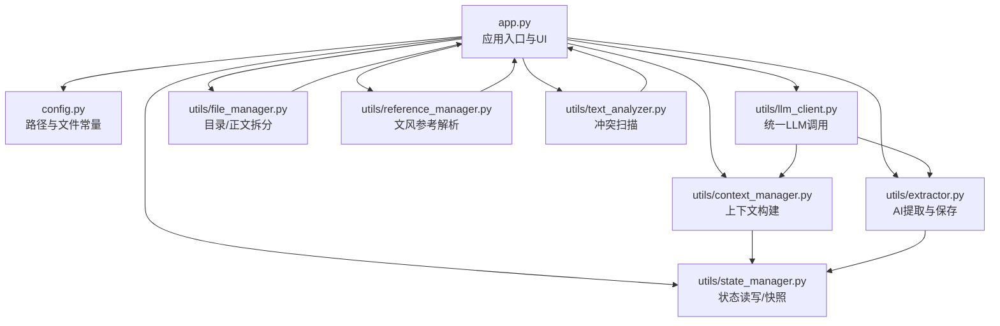
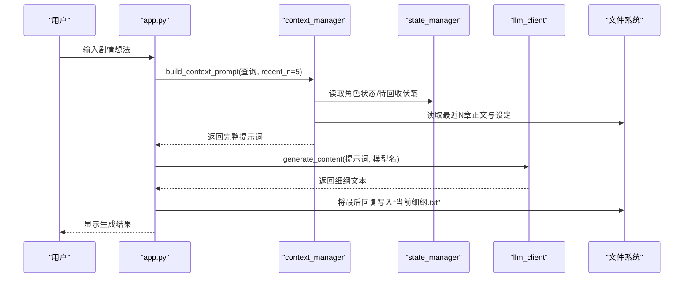
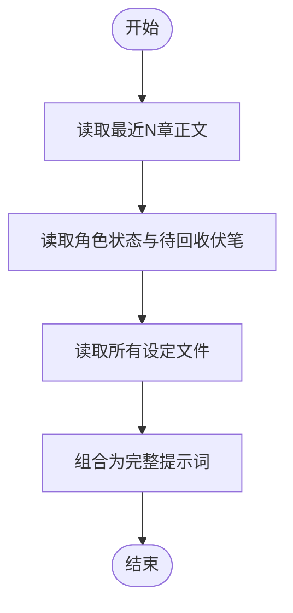
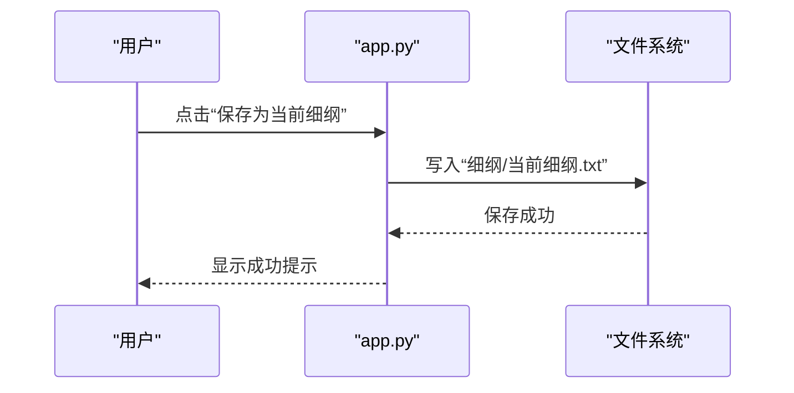
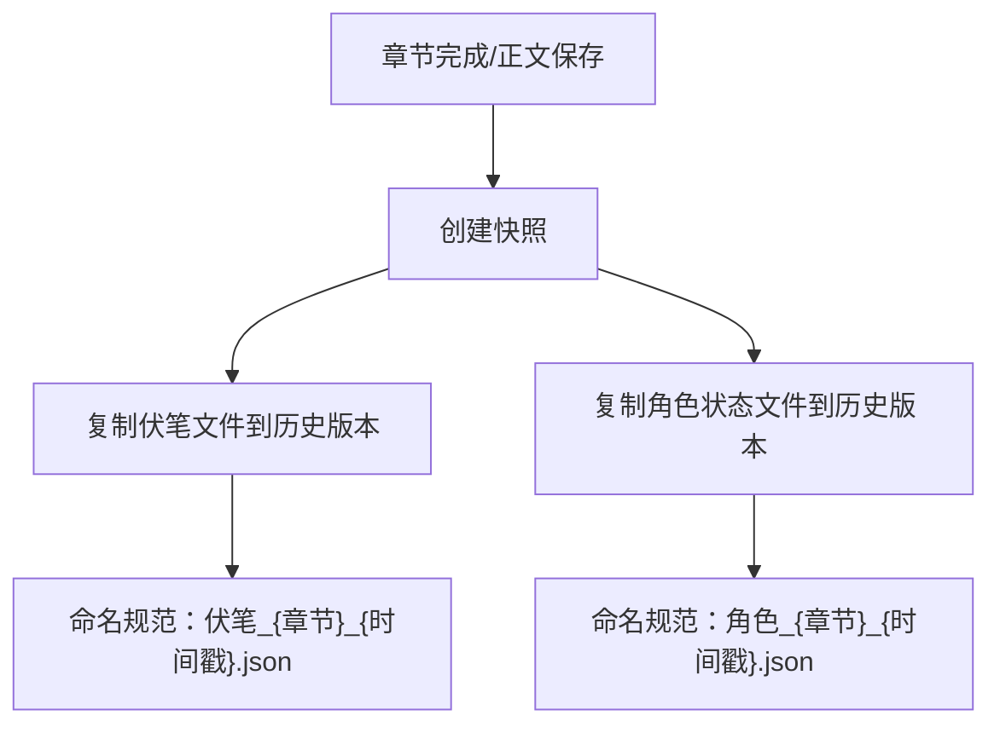
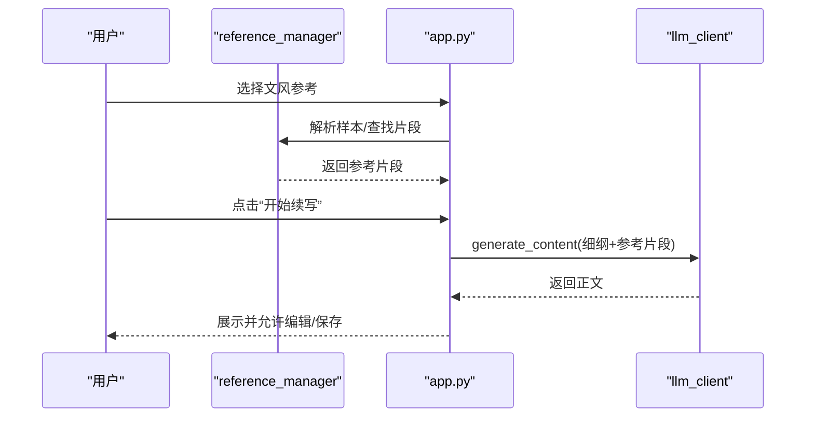
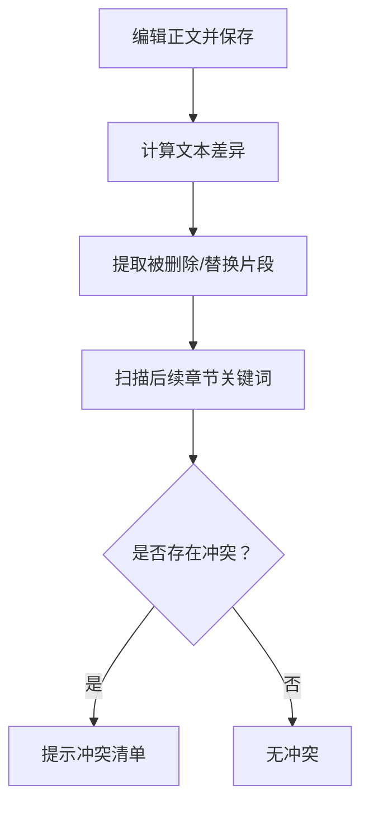
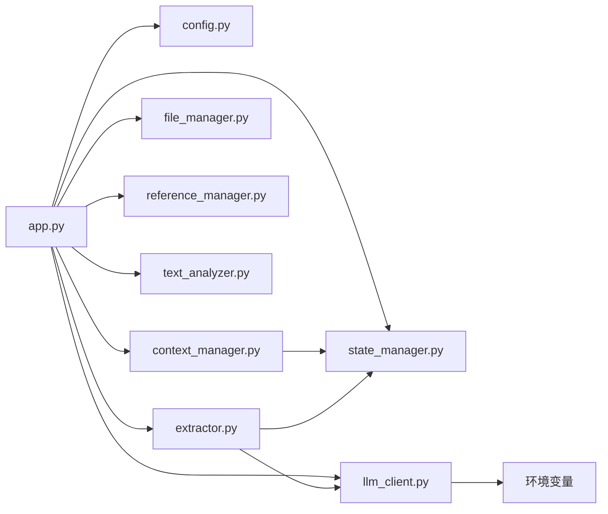

# 细纲规划系统

<cite>
**本文引用的文件**
- [app.py](file://app.py)
- [config.py](file://config.py)
- [utils/context_manager.py](file://utils/context_manager.py)
- [utils/state_manager.py](file://utils/state_manager.py)
- [utils/llm_client.py](file://utils/llm_client.py)
- [utils/file_manager.py](file://utils/file_manager.py)
- [utils/reference_manager.py](file://utils/reference_manager.py)
- [utils/text_analyzer.py](file://utils/text_analyzer.py)
- [utils/extractor.py](file://utils/extractor.py)
- [requirements.txt](file://requirements.txt)
- [参考/大神素材样本.txt](file://参考/大神素材样本.txt)
- [设定/设定_伏笔.json](file://设定/设定_伏笔.json)
- [设定/设定_角色状态.json](file://设定/设定_角色状态.json)
- [细纲/剧情回顾.txt](file://细纲/剧情回顾.txt)
</cite>

## 目录
1. [简介](#简介)
2. [项目结构](#项目结构)
3. [核心组件](#核心组件)
4. [架构总览](#架构总览)
5. [详细组件分析](#详细组件分析)
6. [依赖关系分析](#依赖关系分析)
7. [性能与稳定性](#性能与稳定性)
8. [故障排查指南](#故障排查指南)
9. [结论](#结论)
10. [附录](#附录)

## 简介
本系统面向网络文学创作，提供“细纲规划”全流程工具链：基于上下文信息生成剧情细纲、自动加载角色状态与伏笔回顾、保存当前细纲到文件、并支持与文风参考联动续写正文。系统通过统一的提示词工程与状态管理，实现“所想即所得”的创作体验，并为后续冲突检测与版本管理打下基础。

## 项目结构
系统采用模块化组织，核心入口为 Streamlit 应用，围绕“配置-上下文-状态-提示词-生成-保存-参考-分析”形成闭环。

图表来源
- [app.py](file://app.py#L1-L719)
- [config.py](file://config.py#L1-L24)
- [utils/context_manager.py](file://utils/context_manager.py#L1-L93)
- [utils/state_manager.py](file://utils/state_manager.py#L1-L77)
- [utils/llm_client.py](file://utils/llm_client.py#L1-L203)
- [utils/file_manager.py](file://utils/file_manager.py#L1-L108)
- [utils/reference_manager.py](file://utils/reference_manager.py#L1-L94)
- [utils/text_analyzer.py](file://utils/text_analyzer.py#L1-L63)
- [utils/extractor.py](file://utils/extractor.py#L1-L194)

章节来源
- [app.py](file://app.py#L1-L719)
- [config.py](file://config.py#L1-L24)

## 核心组件
- 应用入口与界面：负责提供“初始化/探讨设定/探讨细纲/续写正文/改文与冲突提示”等功能页面，统一配置大模型提供商与参数。
- 上下文管理器：自动聚合“最近N章正文、角色状态、待回收伏笔、相关设定”，形成结构化提示词。
- 状态管理器：提供角色状态与伏笔列表的读写与快照，支撑版本化管理。
- LLM 客户端：统一封装 Gemini/OpenAI 兼容接口，支持重试与流式处理。
- 文件与正文管理：确保目录结构、正文拆分与章节导入。
- 参考管理器：解析“大神素材样本”，提供文风参考定位。
- 文本分析器：对比编辑前后差异，扫描后续章节潜在冲突。
- 提取器：基于大模型一次性或分块提取角色状态、伏笔、设定与剧情回顾，并保存到相应文件。

章节来源
- [app.py](file://app.py#L310-L544)
- [utils/context_manager.py](file://utils/context_manager.py#L43-L92)
- [utils/state_manager.py](file://utils/state_manager.py#L21-L77)
- [utils/llm_client.py](file://utils/llm_client.py#L9-L142)
- [utils/file_manager.py](file://utils/file_manager.py#L7-L108)
- [utils/reference_manager.py](file://utils/reference_manager.py#L5-L94)
- [utils/text_analyzer.py](file://utils/text_analyzer.py#L7-L63)
- [utils/extractor.py](file://utils/extractor.py#L6-L194)

## 架构总览
系统以“提示词工程 + 状态驱动 + 文件持久化”为核心，形成“输入想法 -> 构建上下文 -> 生成细纲 -> 保存细纲 -> 续写正文 -> 冲突检测”的创作闭环。

图表来源
- [app.py](file://app.py#L506-L544)
- [utils/context_manager.py](file://utils/context_manager.py#L43-L92)
- [utils/state_manager.py](file://utils/state_manager.py#L21-L32)
- [utils/llm_client.py](file://utils/llm_client.py#L29-L44)

## 详细组件分析

### 组件A：上下文构建机制
- 自动聚合：
  - 最近N章正文（按章节名排序，拼接文件名与内容）
  - 角色状态（JSON）
  - 待回收伏笔（过滤状态为“pending”）
  - 相关设定（遍历“设定_*.txt”）
- 输出：结构化提示词，包含“当前任务”说明，便于LLM聚焦目标。

图表来源
- [utils/context_manager.py](file://utils/context_manager.py#L22-L92)

章节来源
- [utils/context_manager.py](file://utils/context_manager.py#L1-L93)

### 组件B：AI提示词设计
- 探讨细纲场景：
  - 以“当前任务”作为明确指令，结合上下文，引导LLM产出可操作的细纲要点。
- 续写正文场景：
  - 将“当前细纲”与“文风参考”拼接为提示词，约束生成风格与节奏。
- 全量提取场景：
  - 明确JSON字段结构与输出格式，提升解析成功率。

章节来源
- [app.py](file://app.py#L524-L534)
- [app.py](file://app.py#L588-L600)
- [utils/extractor.py](file://utils/extractor.py#L11-L33)

### 组件C：细纲保存流程
- 保存位置：细纲目录下的“当前细纲.txt”
- 触发方式：在“探讨细纲”页面点击“将最后回复保存为当前细纲”
- 版本管理：系统提供“历史版本”目录，可通过状态快照机制记录状态文件的历史版本，便于回溯。

图表来源
- [app.py](file://app.py#L538-L544)
- [config.py](file://config.py#L10-L11)

章节来源
- [app.py](file://app.py#L536-L544)
- [config.py](file://config.py#L10-L11)

### 组件D：状态与版本管理
- 角色状态与伏笔：
  - 读写JSON文件，支持新增/更新
  - 为每个伏笔生成唯一ID、创建时间与来源章节
- 历史快照：
  - 将当前“伏笔”和“角色状态”复制到“历史版本”目录，命名包含章节名与时间戳
- 建议：
  - 在保存正文或完成章节后，主动触发快照，确保冲突检测与回溯有据可依

图表来源
- [utils/state_manager.py](file://utils/state_manager.py#L33-L49)
- [config.py](file://config.py#L11)

章节来源
- [utils/state_manager.py](file://utils/state_manager.py#L33-L77)
- [config.py](file://config.py#L18-L24)

### 组件E：文风参考与续写
- 参考来源：解析“大神素材样本.txt”，提取“出自哪一章”与“关键词”指引
- 预览：根据指引在原著中定位片段，供作者参考
- 续写：将“当前细纲”与“参考片段”拼接为提示词，调用LLM生成正文

图表来源
- [utils/reference_manager.py](file://utils/reference_manager.py#L5-L94)
- [app.py](file://app.py#L563-L626)
- [utils/llm_client.py](file://utils/llm_client.py#L29-L44)

章节来源
- [utils/reference_manager.py](file://utils/reference_manager.py#L1-L94)
- [app.py](file://app.py#L546-L626)

### 组件F：冲突检测与改文
- 差异检测：基于文本差异算法，提取被删除/替换的片段
- 后续扫描：在后续章节中检索关键词，提示潜在冲突
- 建议：在保存正文后，优先进行冲突扫描，必要时回溯修改

图表来源
- [utils/text_analyzer.py](file://utils/text_analyzer.py#L7-L63)
- [app.py](file://app.py#L628-L682)

章节来源
- [utils/text_analyzer.py](file://utils/text_analyzer.py#L1-L63)
- [app.py](file://app.py#L628-L682)

### 组件G：全量状态提取（AI）
- 模式：
  - 标准模式：一次性输入全文
  - 智能分段模式：滑动窗口+重叠，保持上下文完整性
- 输出：
  - 角色状态（JSON）
  - 伏笔列表（JSON）
  - 设定总结（文本）
  - 剧情回顾（文本）
- 保存：自动写入对应文件，便于后续“探讨细纲”使用

章节来源
- [app.py](file://app.py#L342-L410)
- [utils/extractor.py](file://utils/extractor.py#L6-L194)

## 依赖关系分析
- 应用层依赖：
  - app.py 依赖 config.py 的路径常量，依赖各工具模块完成功能
- 工具层依赖：
  - context_manager 依赖 state_manager 与文件系统
  - llm_client 依赖环境变量与第三方SDK
  - extractor 依赖 llm_client 与 state_manager
  - reference_manager 依赖 config 与文件系统
  - text_analyzer 依赖文件系统与内置diff库
  - file_manager 依赖正则与文件系统

图表来源
- [app.py](file://app.py#L1-L12)
- [utils/context_manager.py](file://utils/context_manager.py#L1-L5)
- [utils/llm_client.py](file://utils/llm_client.py#L1-L8)
- [utils/extractor.py](file://utils/extractor.py#L1-L4)
- [config.py](file://config.py#L1-L24)

章节来源
- [app.py](file://app.py#L1-L12)
- [utils/context_manager.py](file://utils/context_manager.py#L1-L5)
- [utils/llm_client.py](file://utils/llm_client.py#L1-L8)
- [utils/extractor.py](file://utils/extractor.py#L1-L4)
- [config.py](file://config.py#L1-L24)

## 性能与稳定性
- LLM调用：
  - 统一重试机制，降低偶发网络波动影响
  - 支持流式处理（特定平台），提升交互体验
- 文本处理：
  - 全量提取支持分块模式，减少长文本一次性处理的内存压力
- 文件I/O：
  - 采用UTF-8编码与安全文件名，避免异常字符导致的解析失败
- 建议：
  - 长文本建议使用“智能分段模式”，合理设置窗口与重叠大小
  - 在高并发场景下，适当降低并发请求或增加重试间隔

章节来源
- [utils/llm_client.py](file://utils/llm_client.py#L29-L142)
- [utils/extractor.py](file://utils/extractor.py#L57-L74)

## 故障排查指南
- API配置问题：
  - 确认环境变量已正确设置（如 GOOGLE_API_KEY、OPENAI_API_KEY、OPENAI_BASE_URL、LLM_PROVIDER）
  - 不同提供商的参数项不同，按界面提示填写
- 提示词解析失败：
  - 全量提取场景需确保输出为纯JSON字符串，避免Markdown代码块包裹
  - 可尝试切换模型或调整提示词结构
- 文件缺失：
  - 使用“初始化”功能创建缺失目录与默认状态文件
  - 确认“我的正文.txt”“大神素材样本.txt”等资源文件存在
- 冲突检测无效：
  - 确认删除/替换片段足够长（至少2字符），避免误报
  - 后续章节扫描范围从当前章节之后开始

章节来源
- [app.py](file://app.py#L310-L425)
- [utils/extractor.py](file://utils/extractor.py#L35-L55)
- [utils/text_analyzer.py](file://utils/text_analyzer.py#L39-L63)

## 结论
本系统通过“上下文构建 + 状态驱动 + 文件持久化”的设计，实现了从“想法到细纲再到正文”的高效创作闭环。配合文风参考与冲突检测，能够显著提升剧情一致性与可读性。建议在创作过程中坚持“先细纲、后正文、再校对”的流程，并定期进行状态快照与冲突扫描，确保作品质量与可维护性。

## 附录

### A. 使用步骤速览
- 初始化
  - 创建目录结构与默认状态文件
  - 可选：全量提取正文，生成角色状态、伏笔、设定与剧情回顾
- 探讨细纲
  - 输入剧情想法，系统自动构建上下文并生成细纲
  - 保存为“当前细纲.txt”
- 续写正文
  - 选择文风参考，基于“当前细纲”生成正文
  - 编辑后保存到“正文/”目录
- 改文与冲突提示
  - 保存正文后扫描后续章节潜在冲突
  - 建议：保存后触发状态更新与快照

章节来源
- [app.py](file://app.py#L310-L682)

### B. 关键文件与路径
- 目录
  - 参考：参考/
  - 设定：设定/
  - 正文：正文/
  - 细纲：细纲/
  - 历史版本：历史版本/
- 关键文件
  - 设定_伏笔.json
  - 设定_角色状态.json
  - 设定_自动提取.txt
  - 剧情回顾.txt
  - 当前细纲.txt
  - 我的正文.txt
  - 大神素材样本.txt

章节来源
- [config.py](file://config.py#L6-L24)
- [设定/设定_伏笔.json](file://设定/设定_伏笔.json#L1-L1)
- [设定/设定_角色状态.json](file://设定/设定_角色状态.json#L1-L1)
- [细纲/剧情回顾.txt](file://细纲/剧情回顾.txt#L1-L1)
- [参考/大神素材样本.txt](file://参考/大神素材样本.txt#L1-L614)

### C. 环境与依赖
- Python包：streamlit、google-generativeai、python-dotenv、tenacity、openai
- 环境变量：根据所选提供商配置相应API Key与Base URL

章节来源
- [requirements.txt](file://requirements.txt#L1-L6)
- [utils/llm_client.py](file://utils/llm_client.py#L9-L28)