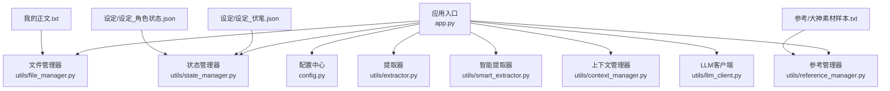
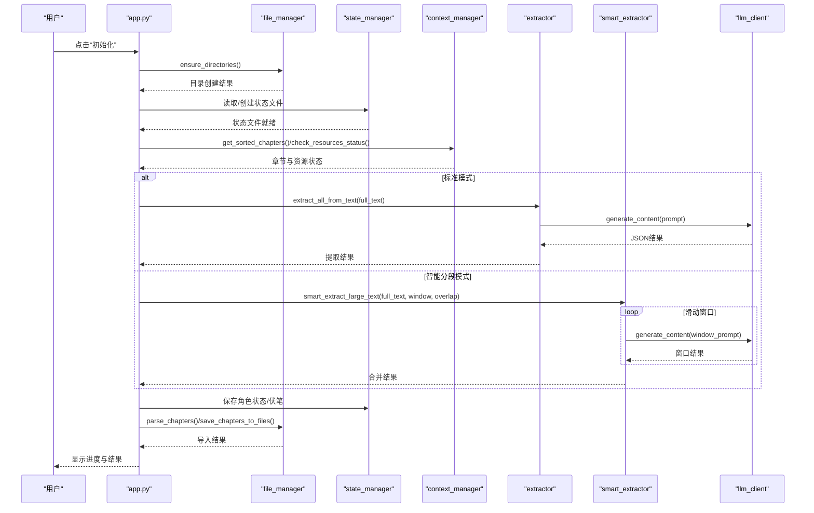
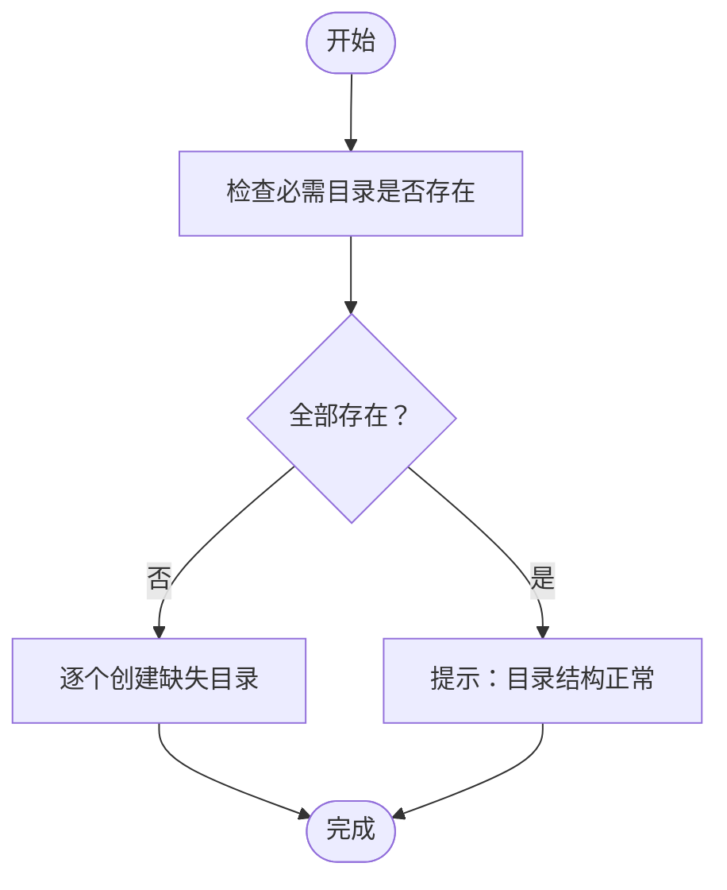
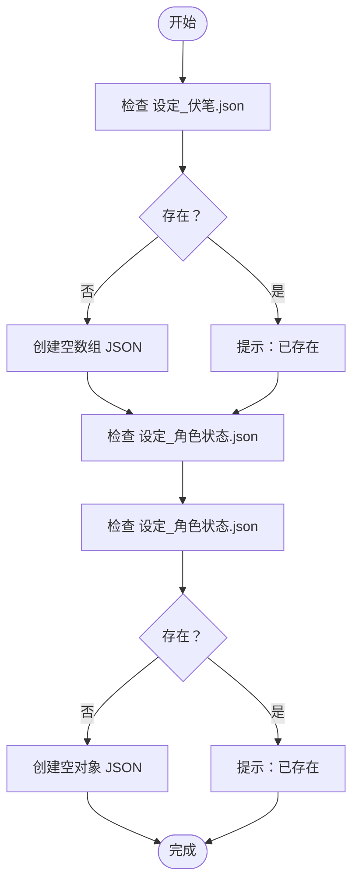
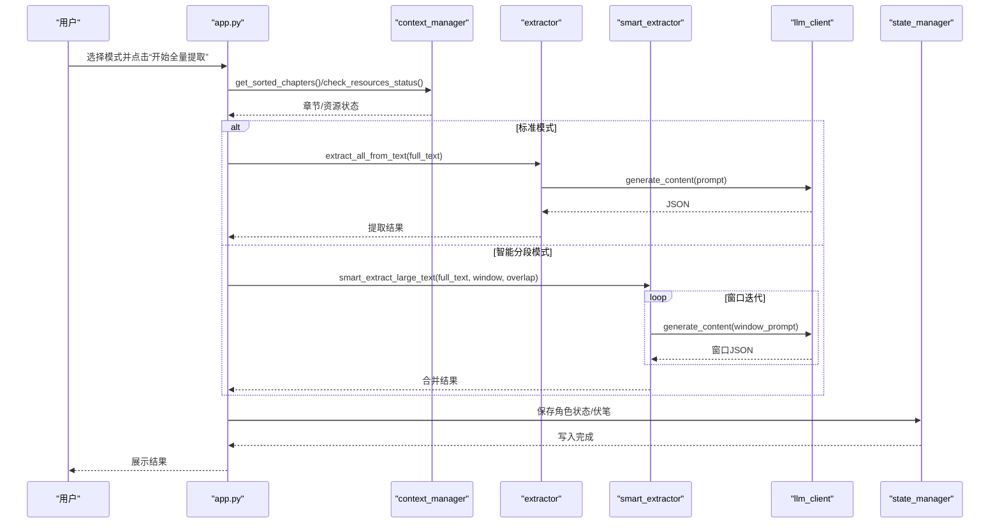
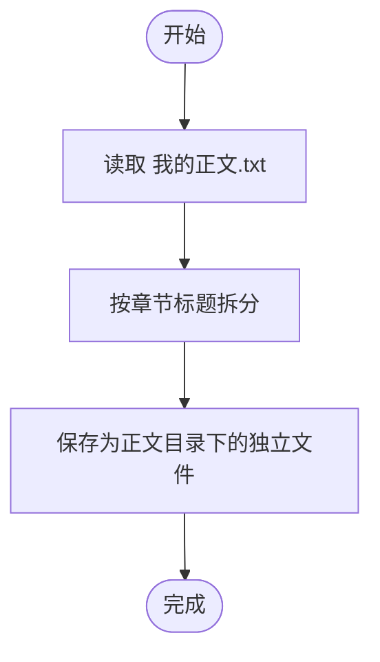
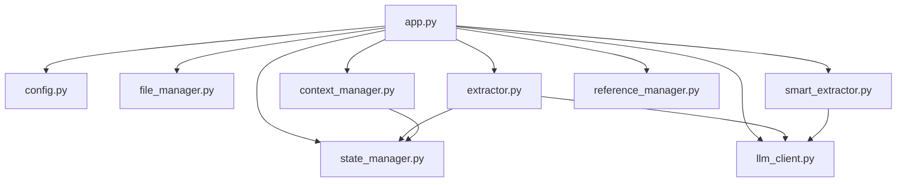

# 项目初始化

<cite>
**本文引用的文件**
- [app.py](file://app.py)
- [config.py](file://config.py)
- [utils/state_manager.py](file://utils/state_manager.py)
- [utils/extractor.py](file://utils/extractor.py)
- [utils/smart_extractor.py](file://utils/smart_extractor.py)
- [utils/file_manager.py](file://utils/file_manager.py)
- [utils/context_manager.py](file://utils/context_manager.py)
- [utils/reference_manager.py](file://utils/reference_manager.py)
- [utils/llm_client.py](file://utils/llm_client.py)
- [requirements.txt](file://requirements.txt)
- [参考/大神素材样本.txt](file://参考/大神素材样本.txt)
- [test_smart_extract.py](file://test_smart_extract.py)
</cite>

## 目录
1. [简介](#简介)
2. [项目结构](#项目结构)
3. [核心组件](#核心组件)
4. [架构总览](#架构总览)
5. [详细组件分析](#详细组件分析)
6. [依赖分析](#依赖分析)
7. [性能考虑](#性能考虑)
8. [故障排查指南](#故障排查指南)
9. [结论](#结论)
10. [附录](#附录)

## 简介
本指南面向首次使用“镇妖狱创作引擎”的用户，聚焦“项目初始化”阶段的完整操作流程。内容涵盖环境准备、目录结构创建与修复、空白状态文件初始化、全量状态提取（含标准模式与智能分段模式）、正文导入（单文件拆分）等步骤，明确前置条件、操作流程与预期结果，并提供常见问题排查与最佳实践建议。

## 项目结构
项目采用模块化设计，入口为 Streamlit 应用，核心逻辑分布在 utils 子模块中，配置集中于 config.py。初始化流程主要涉及以下目录与文件：
- 顶层目录：参考、设定、正文、细纲、历史版本
- 关键文件：我的正文.txt（待拆分导入）、.env（环境变量）
- 初始化相关工具：file_manager（目录与正文拆分）、state_manager（状态文件读写）、extractor/smart_extractor（AI提取）、context_manager（上下文构建）、llm_client（统一大模型调用）

图表来源
- [app.py](file://app.py#L310-L425)
- [config.py](file://config.py#L6-L24)
- [utils/file_manager.py](file://utils/file_manager.py#L7-L14)
- [utils/state_manager.py](file://utils/state_manager.py#L1-L77)
- [utils/extractor.py](file://utils/extractor.py#L6-L56)
- [utils/smart_extractor.py](file://utils/smart_extractor.py#L5-L58)
- [utils/context_manager.py](file://utils/context_manager.py#L6-L21)
- [utils/reference_manager.py](file://utils/reference_manager.py#L5-L47)
- [utils/llm_client.py](file://utils/llm_client.py#L9-L38)

章节来源
- [app.py](file://app.py#L310-L425)
- [config.py](file://config.py#L6-L24)

## 核心组件
- 目录与资源检查：确保参考、设定、正文、细纲、历史版本等目录存在；检查“我的正文.txt”“大神素材样本.txt”等关键文件是否存在。
- 状态文件：保证“设定_伏笔.json”“设定_角色状态.json”存在，不存在则创建空结构。
- 全量提取：支持标准模式与智能分段模式，将长文本按窗口切分并合并结果，写入状态文件与设定/细纲目录。
- 正文导入：解析单文件正文，按章节标题拆分为独立章节文件，保存至正文目录。
- 上下文构建：整合最近章节、角色状态、伏笔、设定等信息，供后续讨论与续写使用。
- LLM 客户端：统一处理 Gemini 与 OpenAI 兼容接口，支持重试与流式输出。

章节来源
- [utils/file_manager.py](file://utils/file_manager.py#L7-L14)
- [utils/state_manager.py](file://utils/state_manager.py#L17-L31)
- [utils/extractor.py](file://utils/extractor.py#L145-L194)
- [utils/smart_extractor.py](file://utils/smart_extractor.py#L237-L296)
- [utils/context_manager.py](file://utils/context_manager.py#L43-L92)
- [utils/llm_client.py](file://utils/llm_client.py#L29-L142)

## 架构总览
初始化流程在 Streamlit 页面中通过“初始化”功能入口触发，调用各工具模块完成目录修复、状态文件创建、正文提取与导入。整体流程如下：

图表来源
- [app.py](file://app.py#L310-L425)
- [utils/file_manager.py](file://utils/file_manager.py#L16-L99)
- [utils/state_manager.py](file://utils/state_manager.py#L17-L31)
- [utils/context_manager.py](file://utils/context_manager.py#L6-L21)
- [utils/extractor.py](file://utils/extractor.py#L6-L56)
- [utils/smart_extractor.py](file://utils/smart_extractor.py#L5-L58)
- [utils/llm_client.py](file://utils/llm_client.py#L29-L142)

## 详细组件分析

### 1. 环境准备与前置条件
- Python 环境与依赖：安装 requirements.txt 中的包，确保 Streamlit、google-generativeai、python-dotenv、tenacity、openai 可用。
- 环境变量：根据所选大模型服务商设置相应环境变量（例如 GOOGLE_API_KEY、OPENAI_API_KEY、OPENAI_BASE_URL、LLM_PROVIDER 等）。
- 资源文件：准备“我的正文.txt”“参考/大神素材样本.txt”等文件，以便后续导入与参考。

章节来源
- [requirements.txt](file://requirements.txt#L1-L6)
- [app.py](file://app.py#L8-L11)
- [utils/llm_client.py](file://utils/llm_client.py#L9-L28)

### 2. 创建/修复目录结构
- 目标：确保参考、设定、正文、细纲、历史版本等目录存在。
- 行为：若缺失则创建；若已存在则提示“目录结构正常”。
- 结果：初始化页面显示创建成功的目录列表或提示信息。

图表来源
- [utils/file_manager.py](file://utils/file_manager.py#L7-L14)
- [config.py](file://config.py#L22-L24)

章节来源
- [utils/file_manager.py](file://utils/file_manager.py#L7-L14)
- [config.py](file://config.py#L22-L24)

### 3. 初始化空白状态文件
- 目标：确保“设定_伏笔.json”“设定_角色状态.json”存在。
- 行为：若不存在则创建空结构（空数组或空字典），并写入 UTF-8 编码文件。
- 结果：初始化页面分别提示“已创建”或“已存在”。

图表来源
- [app.py](file://app.py#L325-L340)
- [utils/state_manager.py](file://utils/state_manager.py#L17-L31)

章节来源
- [app.py](file://app.py#L325-L340)
- [utils/state_manager.py](file://utils/state_manager.py#L17-L31)

### 4. 全量状态提取（AI）
- 适用场景：已有正文全文，希望通过 AI 自动生成角色状态、伏笔列表、设定总结与剧情回顾。
- 模式选择：
  - 标准模式：一次性将完整文本送入模型提取。
  - 智能分段模式：按窗口大小与重叠切分文本，保持上下文完整性，适合长文本。
- 参数配置（智能分段模式）：
  - 窗口大小：字符数，默认 8000，范围 5000–15000。
  - 重叠大小：字符数，默认 1500，范围 500–3000。
- 提取流程：
  1) 优先读取正文目录中的章节文件；若无则读取“我的正文.txt”。
  2) 根据选择的模式调用对应提取函数。
  3) 将提取结果保存到状态文件与设定/细纲目录。
- 预期结果：页面显示“提取完成”，列出写入的文件；可展开查看 JSON 内容。

图表来源
- [app.py](file://app.py#L342-L410)
- [utils/context_manager.py](file://utils/context_manager.py#L6-L21)
- [utils/extractor.py](file://utils/extractor.py#L6-L56)
- [utils/smart_extractor.py](file://utils/smart_extractor.py#L5-L58)
- [utils/llm_client.py](file://utils/llm_client.py#L29-L142)
- [utils/state_manager.py](file://utils/state_manager.py#L17-L31)

章节来源
- [app.py](file://app.py#L342-L410)
- [utils/extractor.py](file://utils/extractor.py#L6-L56)
- [utils/smart_extractor.py](file://utils/smart_extractor.py#L5-L58)
- [utils/context_manager.py](file://utils/context_manager.py#L6-L21)
- [utils/state_manager.py](file://utils/state_manager.py#L17-L31)

### 5. 导入正文（单文件拆分）
- 前置条件：存在“我的正文.txt”，且包含章节标题格式（如“[第x章... ]”）。
- 行为：
  - 解析正文：按章节标题分割为若干章节。
  - 保存章节：将每个章节写入正文目录，文件名为“[章节标题].txt”。
- 预期结果：页面提示“成功导入 N 章”，并在正文目录生成对应文件。

图表来源
- [app.py](file://app.py#L412-L425)
- [utils/file_manager.py](file://utils/file_manager.py#L16-L99)

章节来源
- [app.py](file://app.py#L412-L425)
- [utils/file_manager.py](file://utils/file_manager.py#L16-L99)

### 6. 状态文件格式与全量提取工作原理
- 状态文件格式：
  - 设定_伏笔.json：数组，元素为对象，包含内容、状态、章节来源、创建时间等字段。
  - 设定_角色状态.json：对象，键为角色名，值为包含状态、装备、能力等信息的对象。
- 全量提取工作原理：
  - 标准模式：将完整文本作为提示词，请求模型返回 JSON，清洗并解析后写入状态文件。
  - 智能分段模式：计算滑动窗口，逐窗提取并合并结果，避免长文本越界与上下文断裂。

章节来源
- [utils/state_manager.py](file://utils/state_manager.py#L21-L77)
- [utils/extractor.py](file://utils/extractor.py#L6-L56)
- [utils/smart_extractor.py](file://utils/smart_extractor.py#L5-L58)

### 7. 上下文构建与后续使用
- 上下文构建：整合最近 N 章正文、角色状态、待回收伏笔、设定汇总，形成完整的提示词，供“探讨细纲”“续写正文”等功能使用。
- 使用场景：在“探讨细纲”中构建上下文并生成建议；在“续写正文”中结合文风参考与细纲生成内容。

章节来源
- [utils/context_manager.py](file://utils/context_manager.py#L43-L92)
- [app.py](file://app.py#L506-L544)

## 依赖分析
- 外部依赖：Streamlit、google-generativeai、python-dotenv、tenacity、openai。
- 内部模块耦合：
  - app.py 依赖 config、utils 下各模块。
  - extractor/smart_extractor 依赖 llm_client 与 state_manager。
  - file_manager 依赖 config。
  - context_manager 依赖 state_manager 与 config。
  - reference_manager 依赖 config。

图表来源
- [app.py](file://app.py#L11-L12)
- [utils/extractor.py](file://utils/extractor.py#L1-L4)
- [utils/smart_extractor.py](file://utils/smart_extractor.py#L1-L3)
- [utils/context_manager.py](file://utils/context_manager.py#L1-L4)

章节来源
- [app.py](file://app.py#L11-L12)
- [utils/extractor.py](file://utils/extractor.py#L1-L4)
- [utils/smart_extractor.py](file://utils/smart_extractor.py#L1-L3)
- [utils/context_manager.py](file://utils/context_manager.py#L1-L4)

## 性能考虑
- 智能分段模式的窗口大小与重叠大小直接影响提取质量与成本。窗口越大，上下文越完整，但 Token 消耗越高；重叠越大，跨窗一致性越好，但处理次数增加。
- 对于超长文本，建议优先使用智能分段模式，并根据实际效果调整窗口与重叠参数。
- 提取前尽量确保“我的正文.txt”或正文目录中的章节文件格式规范，减少解析失败与重复处理。

## 故障排查指南
- API 配置错误
  - 症状：提取失败，页面提示“请检查 API Key 或重试”。
  - 排查：确认 LLM_PROVIDER、OPENAI_API_KEY、OPENAI_BASE_URL（或 GOOGLE_API_KEY）是否正确设置；检查网络连通性与服务商配额。
  - 参考：LLM 客户端在调用失败时会打印详细错误信息，便于定位。
- 资源文件缺失
  - 症状：页面提示缺少“我的正文.txt”“大神素材样本.txt”等。
  - 排查：将对应文件放入参考/或项目根目录，刷新页面后状态监控应显示存在。
- 正文拆分失败
  - 症状：导入正文后无新增文件或提示“解析失败，请检查格式”。
  - 排查：确认“我的正文.txt”中章节标题格式为“[第x章... ]”；必要时调整标题格式或手动分章。
- 提取结果为空或异常
  - 症状：提取完成但状态文件未更新或内容异常。
  - 排查：检查模型返回的 JSON 是否包含非法字符，必要时在智能分段模式下减小窗口或增大重叠；查看终端输出的错误堆栈。

章节来源
- [app.py](file://app.py#L383-L410)
- [utils/llm_client.py](file://utils/llm_client.py#L9-L28)
- [utils/file_manager.py](file://utils/file_manager.py#L16-L99)
- [utils/smart_extractor.py](file://utils/smart_extractor.py#L164-L236)

## 结论
通过“项目初始化”流程，用户可以快速完成目录结构修复、状态文件准备、正文导入与全量提取，为后续“探讨设定”“探讨细纲”“续写正文”等创作环节打下坚实基础。建议在首次使用时优先采用智能分段模式处理长文本，并根据实际效果优化窗口与重叠参数。

## 附录
- 最佳实践建议
  - 在开始提取前，先在“初始化”中创建/修复目录并创建空白状态文件，确保后续步骤顺利进行。
  - 若正文较长，优先使用智能分段模式，并根据模型响应质量微调窗口与重叠大小。
  - 提取完成后，建议在“改文与冲突提示”中扫描后续章节，及时更新状态与伏笔。
  - 参考“大神素材样本.txt”中的示例，有助于提升文风参考的质量与一致性。