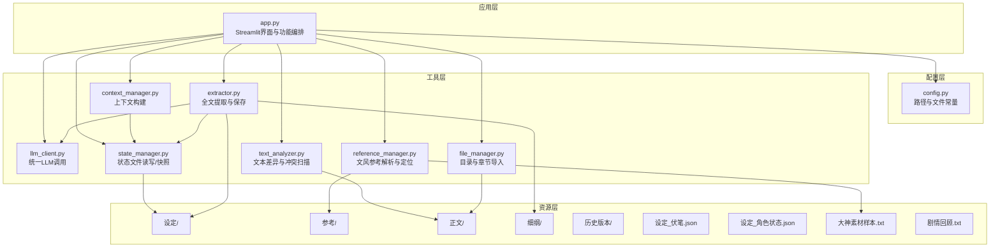
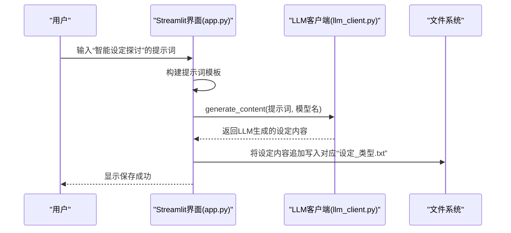
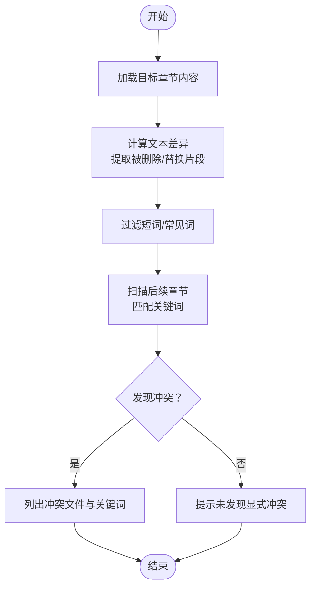
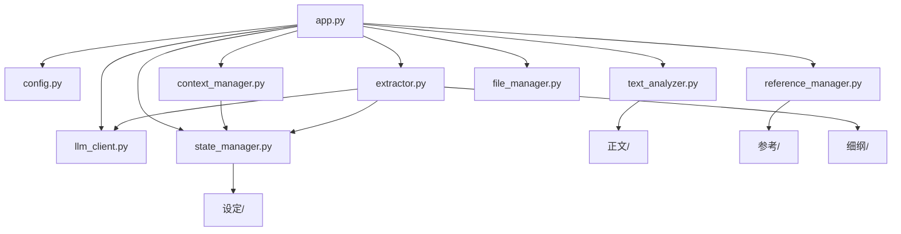

# 功能模块教程

<cite>
**本文档引用的文件**
- [app.py](file://app.py)
- [config.py](file://config.py)
- [requirements.txt](file://requirements.txt)
- [utils/context_manager.py](file://utils/context_manager.py)
- [utils/llm_client.py](file://utils/llm_client.py)
- [utils/text_analyzer.py](file://utils/text_analyzer.py)
- [utils/state_manager.py](file://utils/state_manager.py)
- [utils/reference_manager.py](file://utils/reference_manager.py)
- [utils/extractor.py](file://utils/extractor.py)
- [utils/file_manager.py](file://utils/file_manager.py)
- [设定/设定_伏笔.json](file://设定/设定_伏笔.json)
- [设定/设定_角色状态.json](file://设定/设定_角色状态.json)
- [参考/大神素材样本.txt](file://参考/大神素材样本.txt)
- [细纲/剧情回顾.txt](file://细纲/剧情回顾.txt)
</cite>

## 目录
1. [简介](#简介)
2. [项目结构](#项目结构)
3. [核心组件](#核心组件)
4. [架构总览](#架构总览)
5. [详细组件分析](#详细组件分析)
6. [依赖关系分析](#依赖关系分析)
7. [性能考虑](#性能考虑)
8. [故障排除指南](#故障排除指南)
9. [结论](#结论)
10. [附录](#附录)

## 简介
本教程面向小说创作者，系统讲解“镇妖狱创作引擎”的四大核心功能模块：智能设定探讨、细纲规划、正文续写、冲突检测与改文。文档提供每个功能的操作步骤、参数配置、效果展示与实现原理，帮助用户高效完成从设定到正文的全流程创作。

## 项目结构
项目采用模块化设计，前端基于 Streamlit，后端围绕 LLM 客户端、状态管理、上下文构建、文本分析与资源管理等工具模块协同工作。核心目录与文件如下：
- 应用入口：app.py
- 配置中心：config.py
- 工具模块：utils/*
- 资源文件：设定、参考、正文、细纲、历史版本
- 示例数据：设定_伏笔.json、设定_角色状态.json、大神素材样本.txt、剧情回顾.txt

图表来源
- [app.py](file://app.py#L1-L713)
- [config.py](file://config.py#L1-L24)
- [utils/context_manager.py](file://utils/context_manager.py#L1-L93)
- [utils/llm_client.py](file://utils/llm_client.py#L1-L203)
- [utils/text_analyzer.py](file://utils/text_analyzer.py#L1-L63)
- [utils/state_manager.py](file://utils/state_manager.py#L1-L77)
- [utils/reference_manager.py](file://utils/reference_manager.py#L1-L94)
- [utils/extractor.py](file://utils/extractor.py#L1-L194)
- [utils/file_manager.py](file://utils/file_manager.py#L1-L108)

章节来源
- [app.py](file://app.py#L1-L713)
- [config.py](file://config.py#L1-L24)

## 核心组件
- Streamlit 应用入口：负责页面布局、功能切换、API 配置、资源状态监控与各功能模块的交互编排。
- LLM 客户端：统一处理 Gemini 与 OpenAI 兼容服务，支持重试、超时与公司内部测试平台适配。
- 上下文管理器：聚合角色状态、待回收伏笔、设定摘要与最近章节内容，构建细纲讨论的上下文提示词。
- 文本分析器：基于 difflib 的文本差异检测与后续章节冲突扫描。
- 状态管理器：读写 JSON 状态文件（伏笔、角色状态），并生成历史版本快照。
- 参考管理器：解析“大神素材样本”，定位原著中的参考片段。
- 提取器：调用 LLM 从全文提取角色状态、伏笔、设定与剧情回顾，并保存到相应文件。
- 文件管理器：确保目录结构、解析单文件正文为章节并保存到正文目录。

章节来源
- [app.py](file://app.py#L1-L713)
- [utils/llm_client.py](file://utils/llm_client.py#L1-L203)
- [utils/context_manager.py](file://utils/context_manager.py#L1-L93)
- [utils/text_analyzer.py](file://utils/text_analyzer.py#L1-L63)
- [utils/state_manager.py](file://utils/state_manager.py#L1-L77)
- [utils/reference_manager.py](file://utils/reference_manager.py#L1-L94)
- [utils/extractor.py](file://utils/extractor.py#L1-L194)
- [utils/file_manager.py](file://utils/file_manager.py#L1-L108)

## 架构总览
下面的序列图展示了“探讨设定”功能的典型调用链：用户输入提示词 → 构建提示词 → LLM 生成内容 → 保存设定到文件。

图表来源
- [app.py](file://app.py#L421-L498)
- [utils/llm_client.py](file://utils/llm_client.py#L29-L44)

章节来源
- [app.py](file://app.py#L421-L498)
- [utils/llm_client.py](file://utils/llm_client.py#L29-L44)

## 详细组件分析

### 智能设定探讨（对话技巧与提示词优化）
- 功能目标：帮助用户完善设定内容，涵盖世界观、人物、势力、战力、物品、历史、规则等多维度。
- 对话技巧要点
  - 明确设定类型：在保存时选择“设定类型”，便于归档与检索。
  - 使用具体场景：例如“如何在现有设定下安排一场战斗”，引导系统给出可执行的细节。
  - 结合文风：在“续写正文”中可引入“文风参考”，提升设定与正文风格一致性。
- 提示词优化建议
  - 结构化指令：明确要求“内容具体、避免空泛、融合多种设定元素、保持网文语言风格”。
  - 上下文注入：在“探讨细纲”中可先讨论剧情需求，再回到设定层面细化。
- 参数配置
  - API 服务商与模型：在侧边栏选择提供商（Gemini、NewAPI、SiliconFlow、公司测试平台、OpenAI 兼容），并设置模型名称。
  - API Key 与 Base URL：根据所选提供商填写相应密钥与服务地址。
- 效果展示
  - 设定内容追加写入“设定/设定_类型.txt”，便于后续查阅与迭代。
  - 保存后可在“探讨细纲”中直接引用这些设定作为上下文。

章节来源
- [app.py](file://app.py#L421-L498)
- [utils/llm_client.py](file://utils/llm_client.py#L1-L203)

### 细纲规划（上下文构建方法）
- 功能目标：基于最近章节、角色状态、伏笔与设定，构建高质量的细纲讨论上下文。
- 上下文构建流程
  - 加载最近 N 章正文（默认 5 章），并按章节编号排序。
  - 读取角色状态与待回收伏笔（仅筛选“pending”状态）。
  - 汇总所有“设定_*.txt”文件内容。
  - 将任务查询（用户输入）拼接到上下文末尾。
- 使用示例
  - 用户输入“下一场战斗怎么打”，系统自动注入角色状态、伏笔与设定，生成可执行的战术方案。
- 参数配置
  - 模型名称：从会话状态读取，默认从侧边栏配置。
  - 最近章节数量：可在构建函数中调整（当前固定为 5）。
- 效果展示
  - 将最后一条回复保存为“当前细纲.txt”，供“续写正文”使用。

章节来源
- [utils/context_manager.py](file://utils/context_manager.py#L43-L92)
- [app.py](file://app.py#L500-L538)

### 正文续写（文风参考使用）
- 功能目标：在细纲基础上，结合“大神素材样本”的文风参考，生成符合风格的正文。
- 文风参考流程
  - 解析“参考/大神素材样本.txt”，提取“出自哪一章”与“搜索关键词”。
  - 从“参考/从斩妖除魔开始长生不死.txt”中定位关键词片段，返回上下文窗口。
  - 将参考片段注入续写提示词，指导模型模仿文风与节奏。
- 使用示例
  - 选择一段“极限反杀”或“杀伐果断”的片段作为参考，生成类似风格的战斗场景。
- 参数配置
  - 细纲文本：可直接编辑“当前细纲.txt”或在界面输入。
  - 文风参考：从样本中选择，支持预览与复制到会话。
- 效果展示
  - 生成正文内容可在编辑区二次修改，保存到“正文/”目录，文件名为用户指定的章节标题。

章节来源
- [app.py](file://app.py#L540-L620)
- [utils/reference_manager.py](file://utils/reference_manager.py#L5-L94)
- [utils/context_manager.py](file://utils/context_manager.py#L43-L92)

### 冲突检测与改文（分析流程）
- 功能目标：检测修改章节后是否存在与后续章节的显式冲突，辅助维护故事一致性。
- 分析流程
  - 加载目标章节内容，与原始版本进行文本差异对比，提取被删除/替换的片段。
  - 过滤短词与常见词，仅保留有意义的关键词。
  - 从当前章节之后的后续章节中扫描关键词，标记潜在冲突。
- 使用示例
  - 修改角色名称或关键物品描述后，系统扫描后续章节，提示是否出现“旧关键词”。
- 参数配置
  - 无需额外参数，自动扫描后续章节。
- 效果展示
  - 若发现冲突，列出冲突文件与关键词；未发现则提示“未在后续章节中发现显式文本冲突”。

图表来源
- [utils/text_analyzer.py](file://utils/text_analyzer.py#L7-L62)
- [app.py](file://app.py#L622-L713)

章节来源
- [utils/text_analyzer.py](file://utils/text_analyzer.py#L1-L63)
- [app.py](file://app.py#L622-L713)

### 全量状态提取（AI 驱动的创作辅助）
- 功能目标：读取全文，自动生成角色状态、伏笔列表、设定总结与剧情回顾。
- 提取流程
  - 读取正文（优先按章节目录，其次单文件）。
  - 调用 LLM 生成 JSON 结构化数据。
  - 保存到对应文件：角色状态、伏笔、设定（自动提取）、剧情回顾。
- 模式选择
  - 标准模式：一次性处理全文。
  - 流式模式：分块处理，节省内存，适合长文本。
- 参数配置
  - 模型名称：从会话状态读取。
  - 分块大小：仅在流式模式生效。
- 效果展示
  - 自动生成“设定_角色状态.json”、“设定_伏笔.json”、“设定_自动提取.txt”、“细纲/剧情回顾.txt”。

章节来源
- [app.py](file://app.py#L309-L420)
- [utils/extractor.py](file://utils/extractor.py#L6-L194)

### 初始化与资源管理
- 功能目标：确保目录结构完整、状态文件存在，并支持将单文件正文拆分为章节。
- 操作步骤
  - 创建/修复目录结构：确保“参考/、设定/、正文/、细纲/、历史版本/”存在。
  - 初始化空白状态文件：创建“设定_伏笔.json”和“设定_角色状态.json”。
  - 全量状态提取：选择模式与分块大小，触发 AI 提取并保存。
  - 导入正文：解析单文件正文为章节并保存到“正文/”。
- 参数配置
  - 目录与文件路径：由 config.py 统一管理。
  - 分块大小：1000-5000 字符，步长 500。
- 效果展示
  - 成功创建缺失目录与状态文件；导入后可在“改文与冲突提示”中选择章节。

章节来源
- [app.py](file://app.py#L309-L420)
- [utils/file_manager.py](file://utils/file_manager.py#L1-L108)
- [config.py](file://config.py#L1-L24)

## 依赖关系分析

图表来源
- [app.py](file://app.py#L1-L713)
- [config.py](file://config.py#L1-L24)
- [utils/context_manager.py](file://utils/context_manager.py#L1-L93)
- [utils/llm_client.py](file://utils/llm_client.py#L1-L203)
- [utils/text_analyzer.py](file://utils/text_analyzer.py#L1-L63)
- [utils/state_manager.py](file://utils/state_manager.py#L1-L77)
- [utils/reference_manager.py](file://utils/reference_manager.py#L1-L94)
- [utils/extractor.py](file://utils/extractor.py#L1-L194)
- [utils/file_manager.py](file://utils/file_manager.py#L1-L108)

章节来源
- [app.py](file://app.py#L1-L713)
- [config.py](file://config.py#L1-L24)

## 性能考虑
- LLM 调用
  - 统一重试机制（最多 3 次，间隔 2 秒），减少网络波动影响。
  - 超时设置为 300 秒，适用于长文本与复杂提示词。
  - 公司测试平台采用动态端点与请求头，确保兼容性。
- 文本处理
  - 文本差异采用 difflib 的 SequenceMatcher，时间复杂度 O(N+M)，适合中等规模文本。
  - 冲突扫描按后续章节顺序线性扫描，建议控制关键词长度与数量。
- 内存优化
  - 全量提取支持流式模式，按分块处理，降低峰值内存占用。
- I/O 优化
  - 目录与文件操作集中于 file_manager，确保路径安全与异常处理。

章节来源
- [utils/llm_client.py](file://utils/llm_client.py#L29-L142)
- [utils/text_analyzer.py](file://utils/text_analyzer.py#L1-L63)
- [utils/extractor.py](file://utils/extractor.py#L57-L74)
- [utils/file_manager.py](file://utils/file_manager.py#L1-L108)

## 故障排除指南
- API 配置问题
  - 缺少 API Key：Gemini 需 GOOGLE_API_KEY；OpenAI 兼容需 OPENAI_API_KEY；公司测试平台需完整 Token。
  - Base URL 不正确：检查 NewAPI、SiliconFlow 或自定义服务地址。
  - 模型名称无效：确保模型名与服务商支持列表一致。
- LLM 调用错误
  - 查看终端输出的详细堆栈与错误信息，确认模型、URL、Key 长度与状态码。
  - 尝试切换提供商或降低提示词复杂度。
- 文本冲突检测无效
  - 确认修改内容包含足够长度的关键词；过滤逻辑会忽略长度小于 2 的片段。
  - 检查后续章节是否确实包含相同关键词。
- 全量提取失败
  - 检查正文文件是否存在；流式模式下适当增大分块大小。
  - 确认 LLM 返回的 JSON 格式规范，必要时清理多余字符。

章节来源
- [utils/llm_client.py](file://utils/llm_client.py#L130-L141)
- [app.py](file://app.py#L358-L403)
- [utils/text_analyzer.py](file://utils/text_analyzer.py#L39-L62)

## 结论
本教程系统梳理了“镇妖狱创作引擎”的四大功能模块：智能设定探讨、细纲规划、正文续写与冲突检测。通过合理的提示词设计、上下文构建与状态管理，用户可以高效完成从设定到正文的全流程创作。建议在实际使用中：
- 先完成“初始化”与“全量状态提取”，建立稳定的创作基线。
- 在“探讨细纲”中沉淀可执行的战术与情节节点。
- 使用“文风参考”保证正文风格一致性。
- 在“改文与冲突提示”中及时发现并修正潜在冲突。

## 附录
- 环境依赖：Streamlit、google-generativeai、python-dotenv、tenacity、openai。
- 关键文件路径：config.py 统一管理目录与文件常量；各模块通过 config.py 访问资源。
- 示例数据：参考“设定_伏笔.json”“设定_角色状态.json”“大神素材样本.txt”“剧情回顾.txt”，可直接用于验证功能与风格参考。

章节来源
- [requirements.txt](file://requirements.txt#L1-L6)
- [config.py](file://config.py#L1-L24)
- [设定/设定_伏笔.json](file://设定/设定_伏笔.json#L1-L23)
- [设定/设定_角色状态.json](file://设定/设定_角色状态.json#L1-L17)
- [参考/大神素材样本.txt](file://参考/大神素材样本.txt#L1-L614)
- [细纲/剧情回顾.txt](file://细纲/剧情回顾.txt#L1-L1)