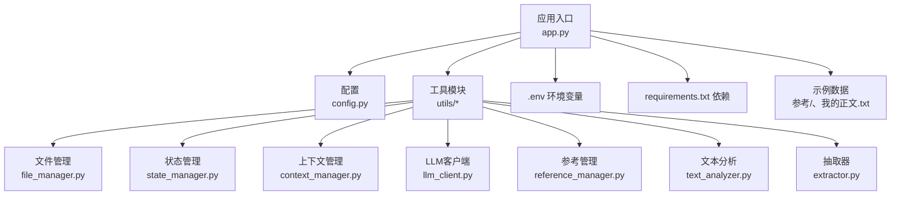
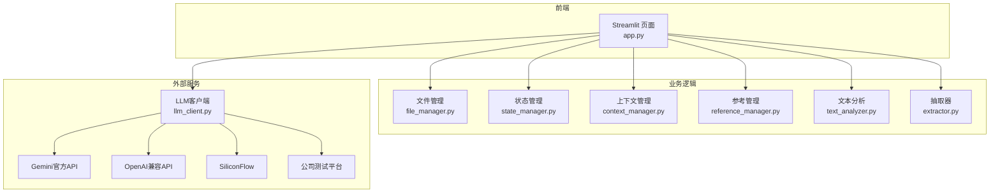
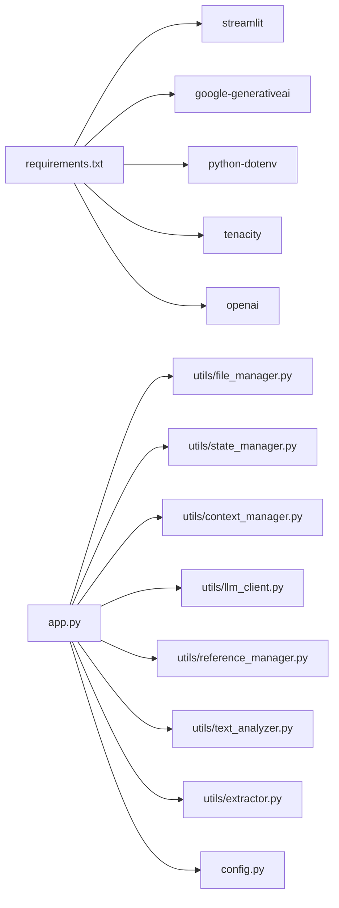

# 快速开始

<cite>
**本文引用的文件**
- [app.py](file://app.py)
- [config.py](file://config.py)
- [requirements.txt](file://requirements.txt)
- [.env](file://.env)
- [test_company_api.py](file://test_company_api.py)
- [utils/file_manager.py](file://utils/file_manager.py)
- [utils/state_manager.py](file://utils/state_manager.py)
- [utils/context_manager.py](file://utils/context_manager.py)
- [utils/llm_client.py](file://utils/llm_client.py)
- [utils/reference_manager.py](file://utils/reference_manager.py)
- [utils/text_analyzer.py](file://utils/text_analyzer.py)
- [utils/extractor.py](file://utils/extractor.py)
- [参考/大神素材样本.txt](file://参考/大神素材样本.txt)
- [我的正文.txt](file://我的正文.txt)
</cite>

## 目录
1. [简介](#简介)
2. [项目结构](#项目结构)
3. [核心组件](#核心组件)
4. [架构总览](#架构总览)
5. [详细组件分析](#详细组件分析)
6. [依赖分析](#依赖分析)
7. [性能考虑](#性能考虑)
8. [故障排除指南](#故障排除指南)
9. [结论](#结论)
10. [附录](#附录)

## 简介
本指南面向首次使用“镇妖狱创作引擎”的创作者，目标是在30分钟内完成从环境准备到首次运行的全流程。你将学会：
- 搭建Python开发环境与依赖安装
- 获取并配置各AI服务提供商的API密钥（Gemini、NewAPI、SiliconFlow、公司测试平台）
- 初始化项目、创建目录结构与状态文件
- 首次使用核心功能：探讨设定、探讨细纲、续写正文、冲突检测与状态更新

## 项目结构
项目采用“功能模块化 + 配置集中化”的组织方式：
- 应用入口与界面：app.py
- 配置与路径：config.py
- 依赖声明：requirements.txt
- 环境变量模板：.env
- 工具模块：utils/（文件管理、状态管理、上下文、LLM客户端、参考、文本分析、抽取）
- 示例与数据：参考/、我的正文.txt、细纲/、设定/

图表来源
- [app.py](file://app.py#L1-L690)
- [config.py](file://config.py#L1-L24)
- [requirements.txt](file://requirements.txt#L1-L6)
- [.env](file://.env#L1-L16)

章节来源
- [app.py](file://app.py#L1-L690)
- [config.py](file://config.py#L1-L24)

## 核心组件
- 应用入口与UI：Streamlit页面、侧边栏配置、功能导航、资源状态监控
- 工具模块：
  - 文件管理：创建目录、解析正文、检查资源
  - 状态管理：角色状态、伏笔列表、历史快照
  - 上下文管理：最近章节、设定汇总、构建上下文提示词
  - LLM客户端：统一调用Gemini/OpenAI兼容接口，含重试与错误打印
  - 参考管理：解析“大神素材样本”，定位原著片段
  - 文本分析：差异对比、后续章节冲突扫描
  - 抽取器：基于LLM的全文状态提取与保存

章节来源
- [app.py](file://app.py#L1-L690)
- [utils/file_manager.py](file://utils/file_manager.py#L1-L108)
- [utils/state_manager.py](file://utils/state_manager.py#L1-L77)
- [utils/context_manager.py](file://utils/context_manager.py#L1-L93)
- [utils/llm_client.py](file://utils/llm_client.py#L1-L247)
- [utils/reference_manager.py](file://utils/reference_manager.py#L1-L94)
- [utils/text_analyzer.py](file://utils/text_analyzer.py#L1-L63)
- [utils/extractor.py](file://utils/extractor.py#L1-L106)

## 架构总览
应用采用“前端界面 + 工具模块 + LLM服务”的分层架构。Streamlit负责交互，工具模块封装业务逻辑，LLM客户端统一对接不同供应商。

图表来源
- [app.py](file://app.py#L1-L690)
- [utils/llm_client.py](file://utils/llm_client.py#L1-L247)

## 详细组件分析

### 环境准备与依赖安装
- Python环境
  - 建议使用Python 3.10+，确保pip可用
- 安装依赖
  - 在项目根目录执行：pip install -r requirements.txt
- 启动应用
  - 在项目根目录执行：streamlit run app.py

章节来源
- [requirements.txt](file://requirements.txt#L1-L6)
- [app.py](file://app.py#L1-L690)

### 配置AI服务提供商
应用支持以下提供商，可在侧边栏“大模型配置”中切换与配置：

- Gemini官方API
  - 在“LLM配置”中选择“Gemini官方API”
  - 填写Google API Key（从官方平台获取）
  - 选择模型（gemini-1.5-flash/1.5-pro/1.0-pro）
  - 环境变量：LLM_PROVIDER=gemini，GOOGLE_API_KEY=your_key，GEMINI_MODEL_NAME=模型名

- NewAPI中转服务
  - 在“LLM配置”中选择“NewAPI中转服务”
  - 选择或自定义Base URL（如api.newapi.ai/v1）
  - 填写API Key
  - 选择模型（gpt-3.5-turbo/gpt-4等）

- SiliconFlow
  - 在“LLM配置”中选择“SiliconFlow”
  - Base URL默认为api.siliconflow.com/v1
  - 填写SiliconFlow API Key
  - 选择开源模型（如GLM-4.7、Qwen2-7B-Instruct等）

- 公司内部测试平台
  - 在“LLM配置”中选择“公司内部测试平台”
  - Base URL默认为 http://45.78.235.165:9005/v1
  - 填写API Token（可含Bearer前缀）
  - 选择测试模型（如gemini-3-flash-preview、gpt-4等）

- 环境变量模板
  - 参考 .env 文件，按需取消注释并填写对应键值

章节来源
- [app.py](file://app.py#L30-L278)
- [.env](file://.env#L1-L16)

### 首次使用：项目初始化
- 创建/修复目录结构
  - 在“初始化”功能中，点击“创建/修复目录结构”
  - 自动生成参考、设定、正文、细纲、历史版本等目录
- 初始化空白状态文件
  - 在“初始化”功能中，点击“初始化空白状态文件”
  - 生成“设定_伏笔.json”和“设定_角色状态.json”
- 全量状态提取（AI）
  - 若已有“我的正文.txt”，可点击“开始全量提取”
  - AI将分析全文并生成角色状态、伏笔列表、设定总结、剧情回顾
- 导入正文（单文件拆分）
  - 若已有“我的正文.txt”，可点击“执行正文导入”
  - 将单文件按章节拆分并保存至“正文/”目录

章节来源
- [app.py](file://app.py#L309-L396)
- [utils/file_manager.py](file://utils/file_manager.py#L7-L108)
- [utils/state_manager.py](file://utils/state_manager.py#L17-L31)
- [utils/extractor.py](file://utils/extractor.py#L6-L106)

### 探讨设定
- 功能说明
  - 系统自动识别设定类型，专注创作内容
  - 支持多类型保存（世界观/地图设定、人物设定、势力/组织设定、战力/功法设定、物品/道具设定、历史/背景设定、规则/制度设定、其他特殊设定）
- 使用流程
  - 在“探讨设定”中输入你的设定想法
  - 点击发送，系统调用LLM生成回复
  - 在“设定保存”中选择类型并保存

章节来源
- [app.py](file://app.py#L398-L475)

### 探讨细纲
- 功能说明
  - 自动加载最近5章正文、角色状态、伏笔信息、相关设定
  - 构建上下文提示词，结合LLM生成细纲建议
- 使用流程
  - 在“探讨细纲”中输入剧情想法
  - 点击发送，系统调用LLM生成回复
  - 将最后回复保存为“当前细纲.txt”

章节来源
- [app.py](file://app.py#L477-L515)
- [utils/context_manager.py](file://utils/context_manager.py#L43-L93)

### 续写正文
- 功能说明
  - 加载“当前细纲.txt”，结合文风参考生成正文
  - 支持选择“大神素材样本”作为文风参考
- 使用流程
  - 在“续写正文”中输入本次写作细纲
  - 选择参考样本并预览
  - 点击“开始续写”，生成正文
  - 编辑后保存到“正文/”目录

章节来源
- [app.py](file://app.py#L517-L597)
- [utils/reference_manager.py](file://utils/reference_manager.py#L5-L94)

### 改文与冲突提示
- 功能说明
  - 编辑章节正文，保存后检测删改内容
  - 扫描后续章节，提示潜在冲突关键词
  - 建议更新伏笔与角色状态（提示：自动写入功能尚未完全启用）
- 使用流程
  - 在“改文与冲突提示”中选择章节
  - 编辑正文，点击“保存并检查冲突”
  - 查看冲突提示，必要时进行调整

章节来源
- [app.py](file://app.py#L599-L690)
- [utils/text_analyzer.py](file://utils/text_analyzer.py#L7-L63)

### 状态与历史快照
- 功能说明
  - 角色状态与伏笔列表以JSON形式存储
  - 可创建历史版本快照，便于回溯
- 使用流程
  - 在合适节点调用“创建快照”（如章节完成后）
  - 快照文件保存在“历史版本/”目录

章节来源
- [utils/state_manager.py](file://utils/state_manager.py#L33-L49)

## 依赖分析
- 运行时依赖
  - streamlit：界面与交互
  - google-generativeai：Gemini官方API
  - python-dotenv：加载.env环境变量
  - tenacity：重试机制
  - openai：OpenAI兼容API
- 项目内依赖
  - app.py 依赖 utils/* 与 config.py
  - utils/* 依赖 config.py 的路径与文件名常量

图表来源
- [requirements.txt](file://requirements.txt#L1-L6)
- [app.py](file://app.py#L1-L11)
- [config.py](file://config.py#L1-L24)

章节来源
- [requirements.txt](file://requirements.txt#L1-L6)
- [app.py](file://app.py#L1-L11)
- [config.py](file://config.py#L1-L24)

## 性能考虑
- LLM调用
  - 默认启用重试机制，建议合理设置模型与提示词长度，避免超时
  - 公司测试平台与SiliconFlow等第三方服务可能存在网络延迟
- 文本处理
  - 全文状态提取与章节拆分涉及IO与正则匹配，建议控制单次处理规模
- UI交互
  - 大量文本输入与生成建议时，建议分批提交，避免界面卡顿

## 故障排除指南
- 环境与依赖
  - 依赖安装失败：检查网络与pip源，确保Python版本满足要求
  - Streamlit启动失败：确认端口未被占用，或更换端口运行
- API配置
  - Gemini：确认GOOGLE_API_KEY正确，模型名称与配额可用
  - NewAPI/SiliconFlow/OpenAI兼容：确认OPENAI_API_KEY与OPENAI_BASE_URL正确
  - 公司测试平台：确认Token含Bearer前缀（如适用），Base URL与模型名正确
- LLM调用错误
  - 检查网络连通性与代理设置
  - 查看终端打印的详细错误信息（包含模型、URL、Key长度、错误类型与堆栈）
  - 可使用 test_company_api.py 进行快速连通性测试
- 资源缺失
  - 使用“资源状态”检查“我的正文.txt”“参考原著”“大神素材样本”是否存在
  - 使用“创建/修复目录结构”与“初始化空白状态文件”补齐缺失项
- 提取失败
  - 确认已配置API密钥与模型
  - 减少一次性处理的正文长度，分批提取
  - 检查终端输出的异常堆栈，定位具体环节

章节来源
- [app.py](file://app.py#L280-L299)
- [utils/llm_client.py](file://utils/llm_client.py#L29-L186)
- [test_company_api.py](file://test_company_api.py#L1-L25)

## 结论
通过本指南，你可以在30分钟内完成环境准备、API配置与项目初始化，并开始使用“探讨设定”“探讨细纲”“续写正文”“冲突检测与状态更新”等核心功能。建议在正式创作前，先用“全量状态提取”生成初始设定与状态文件，再逐步完善正文与细纲。

## 附录

### 快速开始清单
- ✅ 安装Python与依赖
- ✅ 配置任一AI提供商（Gemini/NewAPI/SiliconFlow/公司测试平台）
- ✅ 启动Streamlit应用
- ✅ 在“初始化”中创建目录与状态文件
- ✅ 在“探讨设定/细纲/续写正文/冲突检测”中体验核心功能

### 关键文件路径速查
- 应用入口：app.py
- 配置与路径：config.py
- 依赖：requirements.txt
- 环境变量：.env
- 示例数据：参考/大神素材样本.txt、我的正文.txt
- 工具模块：utils/*