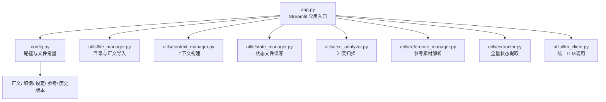
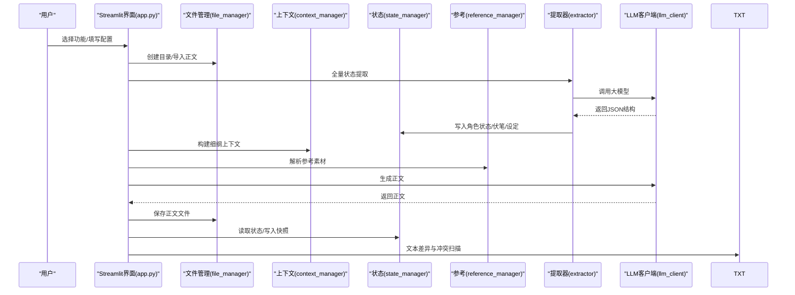
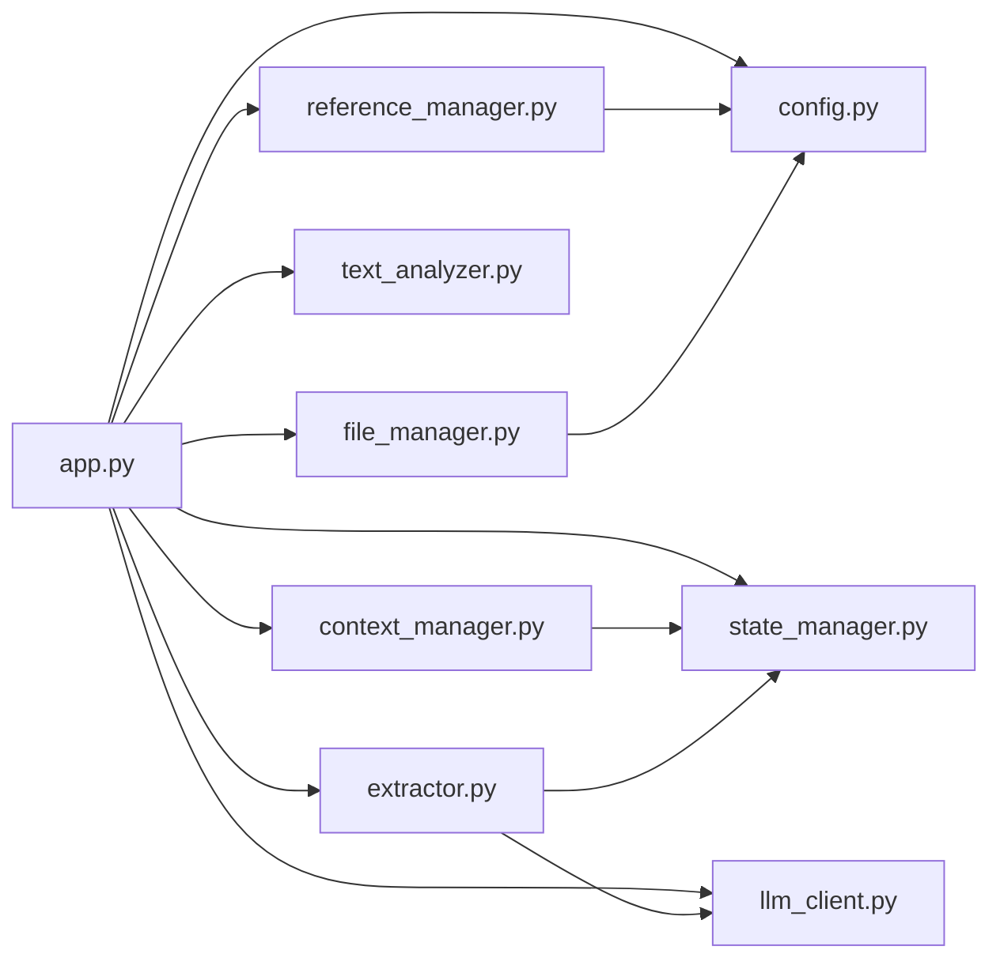

# 用户指南

<cite>
**本文引用的文件**
- [app.py](file://app.py)
- [config.py](file://config.py)
- [requirements.txt](file://requirements.txt)
- [.env](file://.env)
- [utils/context_manager.py](file://utils/context_manager.py)
- [utils/file_manager.py](file://utils/file_manager.py)
- [utils/state_manager.py](file://utils/state_manager.py)
- [utils/text_analyzer.py](file://utils/text_analyzer.py)
- [utils/reference_manager.py](file://utils/reference_manager.py)
- [utils/extractor.py](file://utils/extractor.py)
- [utils/llm_client.py](file://utils/llm_client.py)
</cite>

## 目录
1. [简介](#简介)
2. [项目结构](#项目结构)
3. [核心组件](#核心组件)
4. [架构总览](#架构总览)
5. [详细组件分析](#详细组件分析)
6. [依赖关系分析](#依赖关系分析)
7. [性能与稳定性建议](#性能与稳定性建议)
8. [故障排查指南](#故障排查指南)
9. [结论](#结论)
10. [附录](#附录)

## 简介
本指南面向“镇妖狱创作引擎”的使用者，围绕 Streamlit 界面的四大核心工作流进行系统讲解：项目初始化、智能设定探讨、细纲探讨、正文续写、改文与冲突检测。文档提供步骤化操作说明、界面要点提示、功能间关联性与推荐流程顺序、创作技巧与注意事项，以及常见问题的解决方案。

## 项目结构
该工程采用“应用入口 + 工具模块 + 配置 + 数据文件”的清晰分层：
- 应用入口：Streamlit 应用，负责侧边栏配置、功能切换与主界面交互
- 工具模块：封装文件管理、上下文构建、状态管理、文本分析、参考提取、LLM 客户端等
- 配置模块：集中管理路径、默认文件名与必需目录
- 数据文件：正文、设定、细纲、参考素材、状态文件（角色状态、伏笔）

图表来源
- [app.py](file://app.py#L1-L690)
- [config.py](file://config.py#L1-L24)
- [utils/file_manager.py](file://utils/file_manager.py#L1-L108)
- [utils/context_manager.py](file://utils/context_manager.py#L1-L93)
- [utils/state_manager.py](file://utils/state_manager.py#L1-L77)
- [utils/text_analyzer.py](file://utils/text_analyzer.py#L1-L63)
- [utils/reference_manager.py](file://utils/reference_manager.py#L1-L94)
- [utils/extractor.py](file://utils/extractor.py#L1-L106)
- [utils/llm_client.py](file://utils/llm_client.py#L1-L135)

章节来源
- [app.py](file://app.py#L1-L690)
- [config.py](file://config.py#L1-L24)

## 核心组件
- 侧边栏配置与导航：提供大模型服务商选择、API 密钥与模型配置、功能切换、资源状态监控
- 初始化：创建目录结构、初始化状态文件、全量状态提取、导入正文
- 智能设定探讨：基于对话的设定完善与保存
- 探讨细纲：结合上下文与状态生成细纲建议并保存
- 续写正文：基于细纲与文风参考生成正文并保存
- 改文与冲突检测：编辑正文、检测删改、扫描后续章节冲突、建议更新状态

章节来源
- [app.py](file://app.py#L28-L307)
- [app.py](file://app.py#L309-L396)
- [app.py](file://app.py#L398-L475)
- [app.py](file://app.py#L477-L515)
- [app.py](file://app.py#L517-L597)
- [app.py](file://app.py#L599-L690)

## 架构总览
下图展示从用户操作到数据文件与状态文件的完整链路：

图表来源
- [app.py](file://app.py#L309-L396)
- [app.py](file://app.py#L398-L515)
- [app.py](file://app.py#L517-L597)
- [app.py](file://app.py#L599-L690)
- [utils/file_manager.py](file://utils/file_manager.py#L1-L108)
- [utils/context_manager.py](file://utils/context_manager.py#L1-L93)
- [utils/state_manager.py](file://utils/state_manager.py#L1-L77)
- [utils/reference_manager.py](file://utils/reference_manager.py#L1-L94)
- [utils/extractor.py](file://utils/extractor.py#L1-L106)
- [utils/llm_client.py](file://utils/llm_client.py#L1-L135)

## 详细组件分析

### 侧边栏配置与导航
- 功能入口：通过“功能选择”单选框切换到四大工作流
- API 配置：支持 Gemini 官方、NewAPI、SiliconFlow、公司内部测试平台、OpenAI 兼容服务；根据环境变量自动选择默认提供商
- 资源状态：显示“我的正文.txt”“参考原著”“大神素材样本”的存在状态，缺失时给出放置路径提示

操作要点
- 在首次使用前务必完成 API 配置，否则会提示“请配置API密钥”
- 不同提供商的模型列表与特性不同，建议根据任务复杂度选择合适模型

章节来源
- [app.py](file://app.py#L28-L307)
- [config.py](file://config.py#L13-L24)
- [.env](file://.env#L1-L16)

### 初始化工作流
目标：建立项目基础环境，准备创作所需的状态文件与正文数据。

步骤
1) 创建/修复目录结构
- 确保“参考/设定/正文/细纲/历史版本”等目录存在
2) 初始化空白状态文件
- 生成“设定_伏笔.json”“设定_角色状态.json”，便于后续记录
3) 全量状态提取（AI）
- 读取正文全文，调用大模型抽取角色状态、伏笔、设定与剧情回顾，并保存到对应文件
4) 导入正文（单文件拆分）
- 将“我的正文.txt”按章节标题拆分并保存至“正文/”目录

最佳实践
- 若已有大量正文，优先执行“全量状态提取”，可节省后续手工维护成本
- 正文拆分需遵循统一的章节标题格式，便于后续流程识别

章节来源
- [app.py](file://app.py#L309-L396)
- [utils/file_manager.py](file://utils/file_manager.py#L16-L108)
- [utils/extractor.py](file://utils/extractor.py#L6-L106)
- [utils/state_manager.py](file://utils/state_manager.py#L21-L32)

### 智能设定探讨
目标：通过对话完善各类设定（世界观、人物、势力、战力、物品、规则等）。

步骤
1) 输入设定想法
- 在对话框输入你的设定思路，系统自动拼装提示词并调用大模型生成建议
2) 保存设定
- 选择设定类型（多选），将最后一次回复追加到对应“设定_*.txt”文件末尾

注意
- 设定类型由系统自动识别，但也可手动选择以确保归档准确
- 建议将讨论后的设定及时保存，避免会话丢失

章节来源
- [app.py](file://app.py#L398-L475)
- [utils/context_manager.py](file://utils/context_manager.py#L34-L41)

### 探讨细纲
目标：结合上下文与状态，生成当前剧情推进的细纲建议。

步骤
1) 加载上下文
- 自动加载最近N章正文、角色状态、待回收伏笔、相关设定
2) 输入剧情想法
- 在对话框输入“下一场战斗怎么打”“如何引入新势力”等具体想法
3) 保存细纲
- 将最后一次回复保存为“当前细纲.txt”，供后续续写正文使用

注意
- 若未生成“当前细纲.txt”，请先在本模块生成后再进入续写流程

章节来源
- [app.py](file://app.py#L477-L515)
- [utils/context_manager.py](file://utils/context_manager.py#L43-L92)

### 续写正文
目标：基于细纲与文风参考生成正文，并进行编辑与保存。

步骤
1) 加载细纲
- 自动读取“当前细纲.txt”，也可手动编辑
2) 选择文风参考
- 从“大神素材样本.txt”中选择参考条目，预览原著片段，作为仿写依据
3) 生成正文
- 点击“开始续写”，系统调用大模型生成完整章节内容
4) 编辑与保存
- 在文本区编辑生成内容，输入章节文件名，保存至“正文/”目录

最佳实践
- 使用文风参考可提升仿写一致性
- 生成后建议立即保存，避免刷新页面导致会话丢失

章节来源
- [app.py](file://app.py#L517-L597)
- [utils/reference_manager.py](file://utils/reference_manager.py#L5-L94)
- [utils/llm_client.py](file://utils/llm_client.py#L29-L74)

### 改文与冲突检测
目标：编辑正文后检测删改项，扫描后续章节是否存在冲突关键词，辅助更新状态与伏笔。

步骤
1) 选择章节
- 从“正文/”中选择需要编辑的章节
2) 编辑正文
- 在文本区修改内容，点击“保存并检查冲突”
3) 冲突检测
- 系统对比旧/新文本，提取被删除/替换的关键短语，并扫描后续章节是否仍包含这些关键词
4) 更新状态与伏笔
- 建议对本章进行“AI 分析本章伏笔与状态更新”，获得新增/回收伏笔与角色状态变更建议

注意
- 若检测到冲突，应尽快调整后续章节或补充说明，避免读者困惑
- “AI 分析本章伏笔与状态更新”目前为建议性功能，需人工确认有效性

章节来源
- [app.py](file://app.py#L599-L690)
- [utils/text_analyzer.py](file://utils/text_analyzer.py#L7-L63)
- [utils/state_manager.py](file://utils/state_manager.py#L33-L77)

## 依赖关系分析
- app.py 作为控制中枢，依赖 config.py 的路径常量，调用 utils 子模块实现具体功能
- 上下文构建依赖状态管理与设定汇总
- 正文导入依赖文件管理器的章节解析与保存逻辑
- 冲突检测依赖 difflib 对比与后续章节扫描
- LLM 客户端统一大模型调用，屏蔽提供商差异

图表来源
- [app.py](file://app.py#L1-L690)
- [config.py](file://config.py#L1-L24)
- [utils/context_manager.py](file://utils/context_manager.py#L1-L93)
- [utils/file_manager.py](file://utils/file_manager.py#L1-L108)
- [utils/state_manager.py](file://utils/state_manager.py#L1-L77)
- [utils/text_analyzer.py](file://utils/text_analyzer.py#L1-L63)
- [utils/reference_manager.py](file://utils/reference_manager.py#L1-L94)
- [utils/extractor.py](file://utils/extractor.py#L1-L106)
- [utils/llm_client.py](file://utils/llm_client.py#L1-L135)

## 性能与稳定性建议
- 选择合适的模型：复杂创作与分析建议使用更强推理能力的模型；日常对话与简单任务可用快速模型
- 控制上下文长度：细纲探讨与正文续写时，尽量精简提示词与上下文，有助于降低 Token 消耗与提高响应速度
- 合理拆分正文：章节命名规范有助于排序与检索，减少解析与保存开销
- 网络与超时：OpenAI 兼容接口设置了较长超时时间，若网络波动较大，建议在弱网环境下减少并发请求

## 故障排查指南
常见问题与解决
- API 配置无效
  - 确认侧边栏已显示“API 已配置”，并正确填写密钥与模型名称
  - 检查 .env 文件中的环境变量是否与当前选择的提供商匹配
- 无法加载正文或细纲
  - 确认“我的正文.txt”或“当前细纲.txt”存在且可读
  - 若使用导入功能，请检查章节标题格式是否符合预期
- 续写正文无响应
  - 检查模型名称与提供商是否正确，必要时更换模型
  - 减少提示词长度，避免过长上下文导致超时
- 冲突检测未发现冲突
  - 系统按“关键词包含”扫描，若修改为近义词或语义变化，可能不会被检测到
  - 建议同时结合人工审阅与后续章节补充说明

章节来源
- [app.py](file://app.py#L261-L278)
- [app.py](file://app.py#L344-L380)
- [app.py](file://app.py#L553-L577)
- [app.py](file://app.py#L622-L648)
- [.env](file://.env#L1-L16)

## 结论
“镇妖狱创作引擎”通过清晰的功能划分与稳定的工具链，为网文创作提供了从设定、细纲到正文续写的全流程支持。建议按照“初始化 → 探讨设定 → 探讨细纲 → 续写正文 → 改文与冲突检测”的顺序推进，配合文风参考与状态文件管理，可显著提升创作效率与故事一致性。

## 附录

### 推荐工作流程顺序
- 项目初始化：创建目录、初始化状态文件、导入正文、全量提取
- 智能设定探讨：完善设定并保存到对应文件
- 探讨细纲：结合上下文生成当前细纲
- 续写正文：基于细纲与参考素材生成正文并保存
- 改文与冲突检测：编辑后检测冲突并更新状态/伏笔

### 关键文件与目录说明
- 目录
  - 参考/：存放参考素材与原著
  - 设定/：存放设定文件与状态文件
  - 正文/：存放分章正文
  - 细纲/：存放细纲与剧情回顾
  - 历史版本/：存放状态快照
- 关键文件
  - 我的正文.txt：单文件正文入口
  - 设定_伏笔.json：伏笔列表
  - 设定_角色状态.json：角色状态
  - 设定_自动提取.txt：全量提取生成的设定摘要
  - 剧情回顾.txt：已完成剧情总结

章节来源
- [config.py](file://config.py#L6-L24)