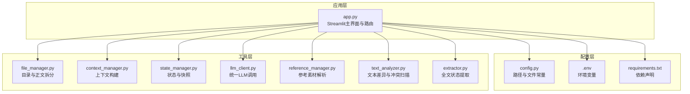
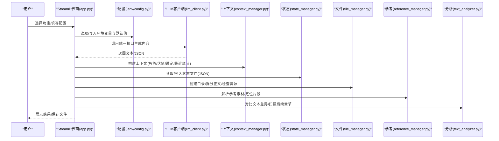
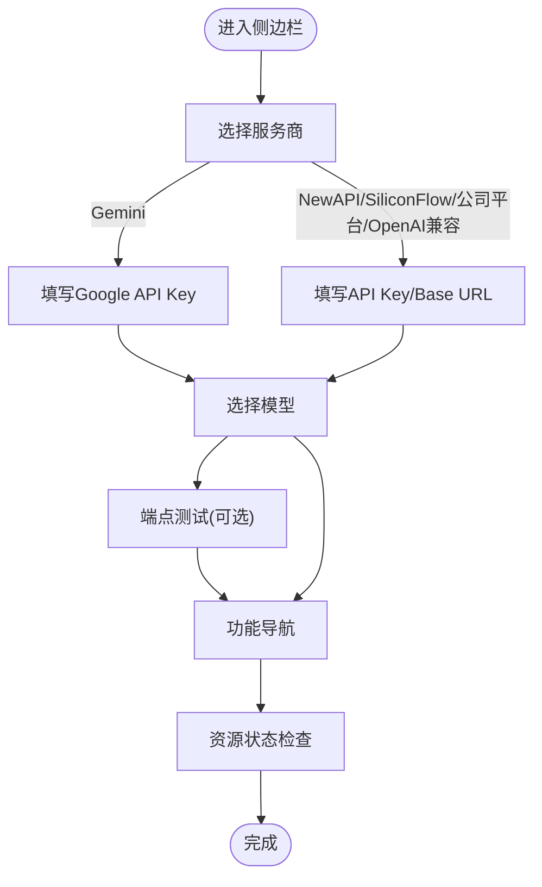
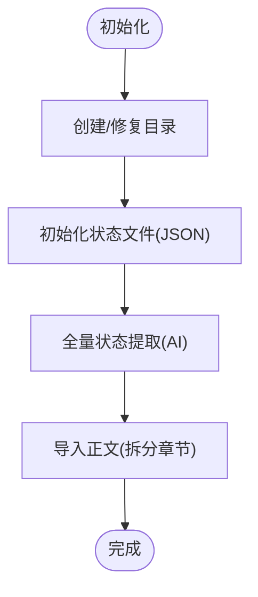
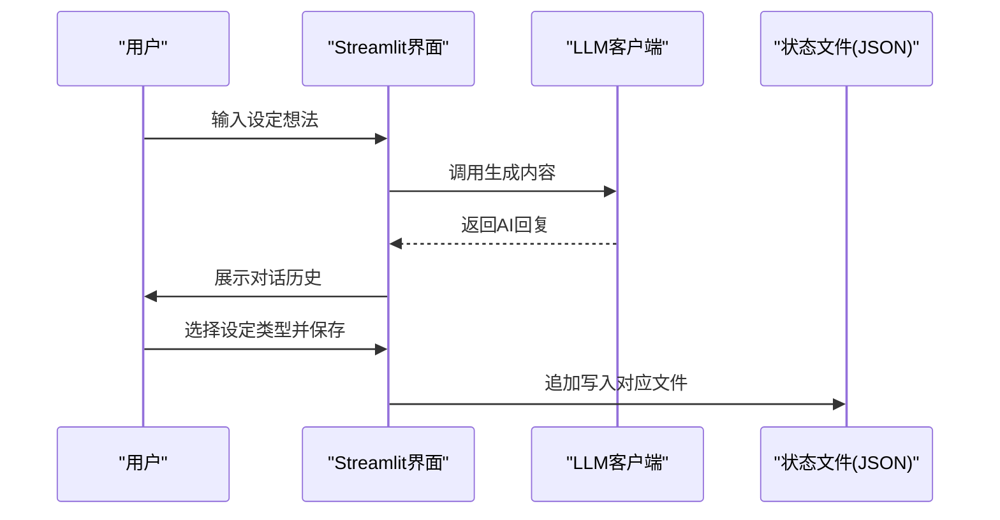
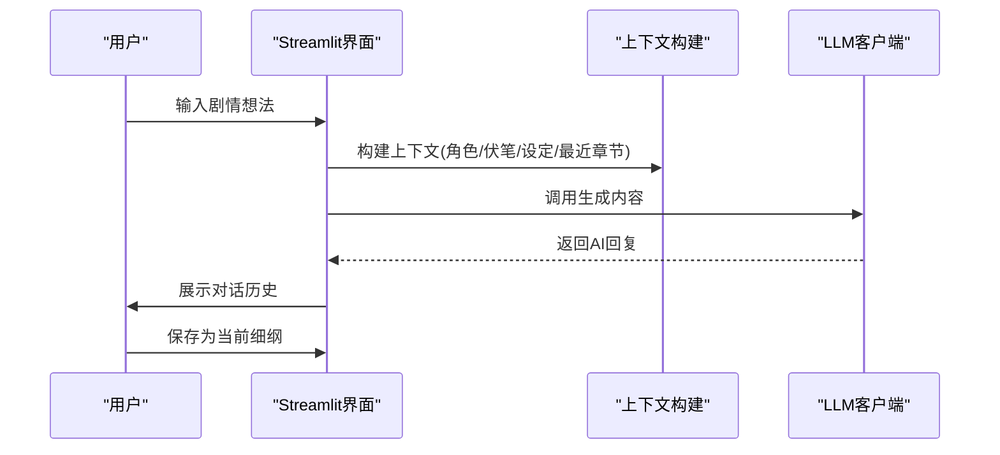
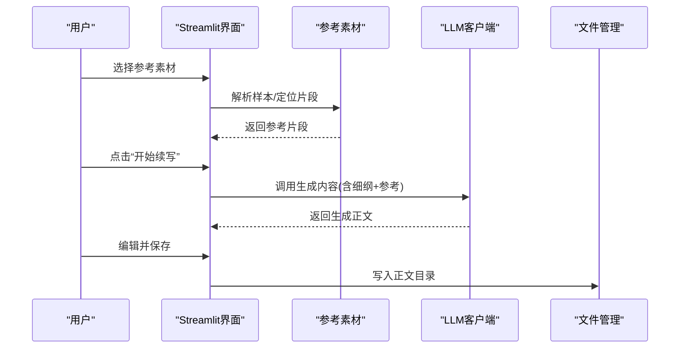
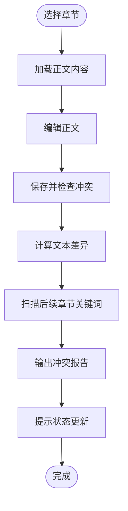
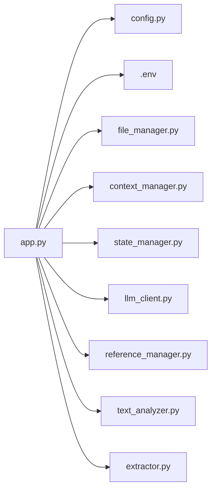

# 界面导航与配置

<cite>
**本文引用的文件**
- [app.py](file://app.py)
- [config.py](file://config.py)
- [.env](file://.env)
- [requirements.txt](file://requirements.txt)
- [utils/file_manager.py](file://utils/file_manager.py)
- [utils/context_manager.py](file://utils/context_manager.py)
- [utils/state_manager.py](file://utils/state_manager.py)
- [utils/llm_client.py](file://utils/llm_client.py)
- [utils/reference_manager.py](file://utils/reference_manager.py)
- [utils/text_analyzer.py](file://utils/text_analyzer.py)
- [utils/extractor.py](file://utils/extractor.py)
</cite>

## 目录
1. [简介](#简介)
2. [项目结构](#项目结构)
3. [核心组件](#核心组件)
4. [架构总览](#架构总览)
5. [详细组件分析](#详细组件分析)
6. [依赖关系分析](#依赖关系分析)
7. [性能与稳定性建议](#性能与稳定性建议)
8. [故障排查指南](#故障排查指南)
9. [结论](#结论)
10. [附录：界面操作步骤与截图说明](#附录界面操作步骤与截图说明)

## 简介
本指南面向首次使用“镇妖狱创作引擎”的用户，聚焦于Streamlit界面的使用方法与配置流程。文档将带你：
- 快速掌握侧边栏配置区域的各项设置（AI服务提供商、API密钥、模型参数等）
- 熟悉主界面四大功能模块：项目初始化、智能设定探讨、细纲探讨、正文续写、改文与冲突检测
- 明确各模块之间的切换逻辑与适用场景
- 提供操作步骤与界面截图说明，帮助你快速上手

## 项目结构
项目采用“主应用 + 工具模块 + 配置”的清晰分层：
- 主应用入口负责UI渲染与业务流程编排
- 工具模块封装文件管理、上下文构建、状态管理、LLM客户端、参考与分析等功能
- 配置模块集中管理目录与文件路径常量

图表来源
- [app.py](file://app.py#L1-L711)
- [config.py](file://config.py#L1-L24)
- [.env](file://.env#L1-L16)
- [requirements.txt](file://requirements.txt#L1-L6)
- [utils/file_manager.py](file://utils/file_manager.py#L1-L108)
- [utils/context_manager.py](file://utils/context_manager.py#L1-L93)
- [utils/state_manager.py](file://utils/state_manager.py#L1-L77)
- [utils/llm_client.py](file://utils/llm_client.py#L1-L303)
- [utils/reference_manager.py](file://utils/reference_manager.py#L1-L94)
- [utils/text_analyzer.py](file://utils/text_analyzer.py#L1-L63)
- [utils/extractor.py](file://utils/extractor.py#L1-L106)

章节来源
- [app.py](file://app.py#L1-L711)
- [config.py](file://config.py#L1-L24)

## 核心组件
- 侧边栏配置区：提供AI服务提供商选择、API密钥与模型参数配置、端点连通性测试、功能导航与资源状态监控
- 四大功能模块：
  - 初始化：目录结构创建、空白状态文件初始化、全文状态提取、正文导入
  - 探讨设定：智能设定对话与保存
  - 探讨细纲：基于上下文的剧情讨论与细纲保存
  - 续写正文：结合细纲与参考素材生成正文并保存
  - 改文与冲突检测：章节编辑、冲突扫描与状态更新提示
- 工具链：文件管理、上下文构建、状态持久化、LLM统一调用、参考素材解析、文本差异与冲突扫描、全文状态提取

章节来源
- [app.py](file://app.py#L28-L328)
- [app.py](file://app.py#L330-L417)
- [app.py](file://app.py#L419-L496)
- [app.py](file://app.py#L498-L536)
- [app.py](file://app.py#L538-L618)
- [app.py](file://app.py#L620-L711)

## 架构总览
下图展示从用户交互到数据落盘的关键流程，以及模块间的依赖关系。

图表来源
- [app.py](file://app.py#L1-L711)
- [utils/llm_client.py](file://utils/llm_client.py#L1-L303)
- [utils/context_manager.py](file://utils/context_manager.py#L1-L93)
- [utils/state_manager.py](file://utils/state_manager.py#L1-L77)
- [utils/file_manager.py](file://utils/file_manager.py#L1-L108)
- [utils/reference_manager.py](file://utils/reference_manager.py#L1-L94)
- [utils/text_analyzer.py](file://utils/text_analyzer.py#L1-L63)

## 详细组件分析

### 侧边栏配置区域
- 作用：统一管理AI服务提供商、API密钥、模型参数、端点测试与功能导航
- 关键要点
  - 服务商选择：支持Gemini官方、NewAPI中转、OpenAI兼容、SiliconFlow、公司内部测试平台
  - API密钥与模型：根据所选服务商显示相应配置项；默认值来自环境变量
  - 端点测试：列出可用端点，一键测试连通性
  - 功能导航：初始化、探讨设定、探讨细纲、续写正文、改文与冲突提示
  - 资源状态：检查“我的正文.txt”“参考原著”“大神素材样本”是否存在

图表来源
- [app.py](file://app.py#L28-L328)
- [.env](file://.env#L1-L16)
- [config.py](file://config.py#L1-L24)

章节来源
- [app.py](file://app.py#L28-L328)
- [.env](file://.env#L1-L16)
- [config.py](file://config.py#L1-L24)

### 初始化模块
- 作用：准备创作所需的基础目录与状态文件，支持全文状态提取与正文导入
- 主要功能
  - 创建/修复目录结构
  - 初始化空白状态文件（角色状态、伏笔列表）
  - 全量状态提取（AI分析正文并生成角色状态、伏笔、设定、剧情回顾）
  - 正文导入（将单文件正文按章节拆分并保存至正文目录）

图表来源
- [app.py](file://app.py#L330-L417)
- [utils/file_manager.py](file://utils/file_manager.py#L1-L108)
- [utils/extractor.py](file://utils/extractor.py#L1-L106)
- [utils/state_manager.py](file://utils/state_manager.py#L1-L77)

章节来源
- [app.py](file://app.py#L330-L417)
- [utils/file_manager.py](file://utils/file_manager.py#L1-L108)
- [utils/extractor.py](file://utils/extractor.py#L1-L106)
- [utils/state_manager.py](file://utils/state_manager.py#L1-L77)

### 探讨设定模块
- 作用：通过智能对话完善各类设定（世界观、人物、势力、战力、物品、历史、规则等）
- 主要功能
  - 对话界面：历史消息展示与实时输入
  - 保存设定：选择设定类型并追加保存到对应文件

图表来源
- [app.py](file://app.py#L419-L496)
- [utils/llm_client.py](file://utils/llm_client.py#L1-L303)
- [utils/state_manager.py](file://utils/state_manager.py#L1-L77)

章节来源
- [app.py](file://app.py#L419-L496)
- [utils/llm_client.py](file://utils/llm_client.py#L1-L303)
- [utils/state_manager.py](file://utils/state_manager.py#L1-L77)

### 探讨细纲模块
- 作用：在上下文中进行剧情讨论，生成并保存当前细纲
- 主要功能
  - 加载上下文：最近N章正文、角色状态、待回收伏笔、相关设定
  - 对话生成：基于构建的上下文进行创作思考
  - 保存细纲：将最后一条AI回复保存为“当前细纲”

图表来源
- [app.py](file://app.py#L498-L536)
- [utils/context_manager.py](file://utils/context_manager.py#L1-L93)
- [utils/llm_client.py](file://utils/llm_client.py#L1-L303)

章节来源
- [app.py](file://app.py#L498-L536)
- [utils/context_manager.py](file://utils/context_manager.py#L1-L93)
- [utils/llm_client.py](file://utils/llm_client.py#L1-L303)

### 续写正文模块
- 作用：基于当前细纲与参考素材生成正文，并支持编辑与保存
- 主要功能
  - 加载细纲：读取“当前细纲.txt”
  - 选择参考：从“大神素材样本”中挑选参考片段
  - 生成正文：拼装提示词并调用LLM生成
  - 编辑与保存：对生成内容进行编辑并保存到正文目录

图表来源
- [app.py](file://app.py#L538-L618)
- [utils/reference_manager.py](file://utils/reference_manager.py#L1-L94)
- [utils/llm_client.py](file://utils/llm_client.py#L1-L303)
- [utils/file_manager.py](file://utils/file_manager.py#L1-L108)

章节来源
- [app.py](file://app.py#L538-L618)
- [utils/reference_manager.py](file://utils/reference_manager.py#L1-L94)
- [utils/llm_client.py](file://utils/llm_client.py#L1-L303)
- [utils/file_manager.py](file://utils/file_manager.py#L1-L108)

### 改文与冲突检测模块
- 作用：编辑章节、检测删改并扫描后续章节中的潜在冲突，同时提供状态更新提示
- 主要功能
  - 选择章节：从正文目录按顺序选择
  - 编辑与保存：保存修改后的正文
  - 冲突检测：对比旧/新文本，扫描后续章节是否仍包含被删除/修改的关键词
  - 状态更新：提示对本章进行伏笔与角色状态分析（当前为提示，未自动写入）

图表来源
- [app.py](file://app.py#L620-L711)
- [utils/text_analyzer.py](file://utils/text_analyzer.py#L1-L63)
- [utils/context_manager.py](file://utils/context_manager.py#L1-L93)

章节来源
- [app.py](file://app.py#L620-L711)
- [utils/text_analyzer.py](file://utils/text_analyzer.py#L1-L63)
- [utils/context_manager.py](file://utils/context_manager.py#L1-L93)

## 依赖关系分析
- 应用层依赖配置层与工具层
- 工具层内部模块职责清晰，耦合度低
- LLM客户端对不同服务商提供统一接口，便于扩展

图表来源
- [app.py](file://app.py#L1-L711)
- [config.py](file://config.py#L1-L24)
- [.env](file://.env#L1-L16)
- [utils/file_manager.py](file://utils/file_manager.py#L1-L108)
- [utils/context_manager.py](file://utils/context_manager.py#L1-L93)
- [utils/state_manager.py](file://utils/state_manager.py#L1-L77)
- [utils/llm_client.py](file://utils/llm_client.py#L1-L303)
- [utils/reference_manager.py](file://utils/reference_manager.py#L1-L94)
- [utils/text_analyzer.py](file://utils/text_analyzer.py#L1-L63)
- [utils/extractor.py](file://utils/extractor.py#L1-L106)

章节来源
- [app.py](file://app.py#L1-L711)

## 性能与稳定性建议
- 选择合适的模型：根据任务复杂度选择更高推理能力的模型，但注意Token消耗
- 控制上下文长度：细纲探讨与正文续写时尽量精简提示词，避免过长上下文导致延迟
- 端点测试：定期使用“端点测试”确保网络与鉴权配置正确
- 超时与重试：LLM调用具备重试机制，若出现超时请检查网络与API配额
- 状态文件备份：使用“状态更新”提示后及时备份或手动核验状态文件

[本节为通用建议，无需特定文件引用]

## 故障排查指南
- API配置问题
  - 确认所选服务商与API密钥/Base URL匹配
  - 使用“端点测试”验证连通性
  - 查看终端输出的详细错误信息
- 资源缺失
  - “我的正文.txt”“参考原著”“大神素材样本”缺失会导致部分功能不可用
  - 使用“初始化”模块创建/修复目录并检查资源状态
- 正文导入失败
  - 检查正文文件格式是否符合章节标题规范
- 细纲/正文为空
  - 在“探讨细纲”中生成“当前细纲”，在“续写正文”中使用该细纲
- 冲突检测无结果
  - 确保删除/修改的关键词足够明显且后续章节确实包含相关内容

章节来源
- [app.py](file://app.py#L267-L298)
- [utils/file_manager.py](file://utils/file_manager.py#L101-L108)
- [utils/llm_client.py](file://utils/llm_client.py#L144-L157)

## 结论
本指南围绕Streamlit界面的侧边栏配置与五大功能模块进行了系统讲解。通过合理配置AI服务与模型、遵循模块化的创作流程，你可以高效完成从设定到正文的全流程创作。建议在正式写作前完成“初始化”与“全量状态提取”，并在每次修改正文后使用“冲突检测”确保故事一致性。

[本节为总结性内容，无需特定文件引用]

## 附录：界面操作步骤与截图说明
以下为常见操作步骤与界面元素说明，帮助你快速熟悉系统布局与基本操作。

- 侧边栏配置区
  - 服务商选择：在“选择API服务商”中选择目标平台
  - API密钥与模型：根据所选平台填写密钥与模型名称
  - 端点测试：在“API端点测试”中选择端点并点击“测试端点连通性”
  - 功能导航：在“功能选择”中切换到目标模块
  - 资源状态：查看“我的正文.txt”“参考原著”“大神素材样本”的存在状态

- 初始化模块
  - 创建/修复目录结构：点击“创建/修复目录结构”
  - 初始化空白状态文件：点击“初始化空白状态文件”
  - 全量状态提取：点击“开始全量提取 (消耗 Token)”并等待AI分析
  - 导入正文：点击“执行正文导入”将单文件正文拆分保存

- 探讨设定模块
  - 输入设定想法：在“创作对话”区域输入内容
  - 保存设定：选择设定类型并点击“保存设定”

- 探讨细纲模块
  - 输入剧情想法：在“创作对话”区域输入内容
  - 保存细纲：点击“将最后回复保存为当前细纲”

- 续写正文模块
  - 选择参考素材：在“文风参考”中选择样本并点击“预览参考段落”
  - 开始续写：点击“开始续写”生成正文
  - 编辑与保存：在“编辑正文”中编辑并点击“保存到正文目录”

- 改文与冲突检测模块
  - 选择章节：在“选择章节”中选择目标文件
  - 保存并检查冲突：点击“保存并检查冲突”查看冲突报告
  - 状态更新：点击“AI 分析本章伏笔与状态更新”查看分析结果（当前为提示）

[本节为操作性说明，无需特定文件引用]