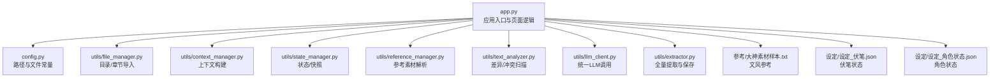
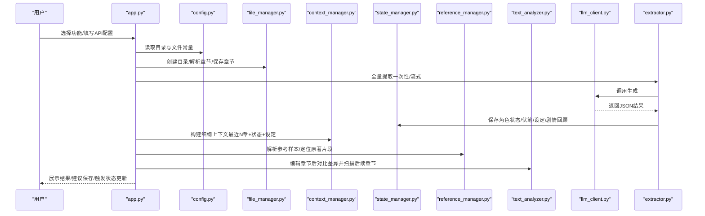
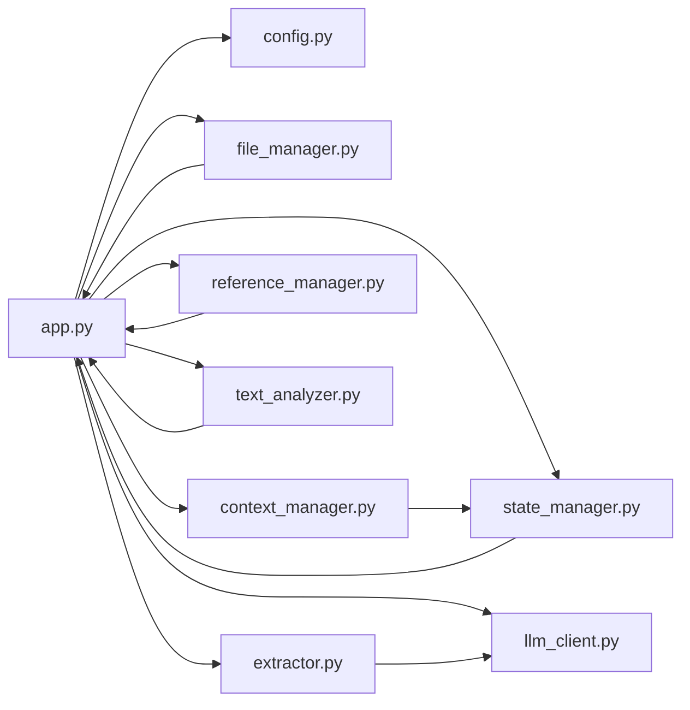

# 使用场景

<cite>
**本文引用的文件**
- [app.py](file://app.py)
- [config.py](file://config.py)
- [requirements.txt](file://requirements.txt)
- [utils/file_manager.py](file://utils/file_manager.py)
- [utils/context_manager.py](file://utils/context_manager.py)
- [utils/state_manager.py](file://utils/state_manager.py)
- [utils/reference_manager.py](file://utils/reference_manager.py)
- [utils/text_analyzer.py](file://utils/text_analyzer.py)
- [utils/llm_client.py](file://utils/llm_client.py)
- [utils/extractor.py](file://utils/extractor.py)
- [参考/大神素材样本.txt](file://参考/大神素材样本.txt)
- [设定/设定_伏笔.json](file://设定/设定_伏笔.json)
- [设定/设定_角色状态.json](file://设定/设定_角色状态.json)
</cite>

## 目录
1. [简介](#简介)
2. [项目结构](#项目结构)
3. [核心组件](#核心组件)
4. [架构总览](#架构总览)
5. [详细使用场景](#详细使用场景)
6. [依赖关系分析](#依赖关系分析)
7. [性能与成本考量](#性能与成本考量)
8. [故障排查指南](#故障排查指南)
9. [结论](#结论)
10. [附录](#附录)

## 简介
本文件面向“镇妖狱创作引擎”的使用者，提供从新手入门到日常创作再到质量把控的完整使用场景与最佳实践。文档基于仓库现有实现，梳理典型用户路径、常见组合用法、适用范围与局限性，帮助用户在不同阶段合理预期项目能力并高效使用。

## 项目结构
项目采用“Streamlit 应用 + 工具模块 + 配置 + 数据文件”的组织方式：
- 应用入口与界面：app.py
- 配置与目录常量：config.py
- 依赖声明：requirements.txt
- 工具模块：
  - 文件与目录管理：utils/file_manager.py
  - 上下文构建：utils/context_manager.py
  - 状态与快照：utils/state_manager.py
  - 参考素材解析与定位：utils/reference_manager.py
  - 文本差异与冲突扫描：utils/text_analyzer.py
  - LLM 客户端与统一生成接口：utils/llm_client.py
  - 全量状态提取与保存：utils/extractor.py

图表来源
- [app.py](file://app.py#L1-L713)
- [config.py](file://config.py#L1-L24)
- [utils/file_manager.py](file://utils/file_manager.py#L1-L108)
- [utils/context_manager.py](file://utils/context_manager.py#L1-L93)
- [utils/state_manager.py](file://utils/state_manager.py#L1-L77)
- [utils/reference_manager.py](file://utils/reference_manager.py#L1-L94)
- [utils/text_analyzer.py](file://utils/text_analyzer.py#L1-L63)
- [utils/llm_client.py](file://utils/llm_client.py#L1-L203)
- [utils/extractor.py](file://utils/extractor.py#L1-L194)

章节来源
- [app.py](file://app.py#L1-L713)
- [config.py](file://config.py#L1-L24)

## 核心组件
- 应用入口与页面控制：负责侧边栏配置、功能切换、资源状态提示与各功能页面渲染。
- 配置中心：集中管理项目根目录、各工作目录与关键文件路径。
- 工具模块：
  - 文件管理：确保目录结构、解析单文件正文为章节、保存章节到独立文件。
  - 上下文管理：聚合最近N章正文、角色状态、待回收伏笔、设定汇总，构建LLM提示词。
  - 状态管理：读写伏笔与角色状态JSON，支持章节级快照。
  - 参考管理：解析“大神素材样本”，定位原著对应片段，作为文风参考。
  - 文本分析：计算前后文本差异，扫描后续章节是否存在被删除/修改的关键字残留。
  - LLM 客户端：统一适配 Gemini/OpenAI 兼容服务，支持重试与错误打印。
  - 全量提取：从全文一次性或分块流式提取角色状态、伏笔、设定与剧情回顾，并保存到对应文件。

章节来源
- [utils/file_manager.py](file://utils/file_manager.py#L1-L108)
- [utils/context_manager.py](file://utils/context_manager.py#L1-L93)
- [utils/state_manager.py](file://utils/state_manager.py#L1-L77)
- [utils/reference_manager.py](file://utils/reference_manager.py#L1-L94)
- [utils/text_analyzer.py](file://utils/text_analyzer.py#L1-L63)
- [utils/llm_client.py](file://utils/llm_client.py#L1-L203)
- [utils/extractor.py](file://utils/extractor.py#L1-L194)

## 架构总览
整体流程围绕“配置 → 初始化 → 探讨设定/细纲 → 续写正文 → 改文与冲突提示 → 状态更新”的创作闭环展开。LLM 客户端贯穿提示词构建与内容生成，状态管理与参考管理为上下文与文风提供支撑。

图表来源
- [app.py](file://app.py#L1-L713)
- [config.py](file://config.py#L1-L24)
- [utils/file_manager.py](file://utils/file_manager.py#L1-L108)
- [utils/context_manager.py](file://utils/context_manager.py#L1-L93)
- [utils/state_manager.py](file://utils/state_manager.py#L1-L77)
- [utils/reference_manager.py](file://utils/reference_manager.py#L1-L94)
- [utils/text_analyzer.py](file://utils/text_analyzer.py#L1-L63)
- [utils/llm_client.py](file://utils/llm_client.py#L1-L203)
- [utils/extractor.py](file://utils/extractor.py#L1-L194)

## 详细使用场景

### 新手入门场景
目标：快速建立项目环境，完成首次正文导入与状态提取，熟悉基本功能。

典型步骤
1. 配置大模型
   - 在侧边栏选择服务商（Gemini/NewAPI/SiliconFlow/公司测试平台/OpenAI兼容），填写相应密钥与Base URL，确认模型名称。
   - 关注“API 已配置”提示与当前模型显示。
2. 初始化项目
   - 点击“创建/修复目录结构”，确保参考、设定、正文、细纲、历史版本等目录齐全。
   - 点击“初始化空白状态文件”，生成空的伏笔与角色状态JSON。
   - 若已有“我的正文.txt”，可选择“标准模式”或“流式模式（节省内存）”进行全量提取，分块大小可调。
   - 提取完成后，系统会保存角色状态、伏笔列表、自动提取的设定与剧情回顾。
3. 导入正文
   - 若正文为单文件，点击“执行正文导入”，系统按章节标题拆分并保存到“正文/”目录。

最佳实践
- 首次运行建议使用“标准模式”以保证上下文完整性；长文本可用“流式模式”，适当调小分块大小以平衡内存占用。
- 提取完成后，建议立即查看“设定/剧情回顾.txt”和“设定_自动提取.txt”，核对关键信息是否准确。
- 保存后可在“改文与冲突提示”中触发AI分析，辅助完善状态文件。

章节来源
- [app.py](file://app.py#L309-L420)
- [utils/file_manager.py](file://utils/file_manager.py#L7-L108)
- [utils/extractor.py](file://utils/extractor.py#L6-L194)
- [utils/state_manager.py](file://utils/state_manager.py#L17-L31)

### 日常创作场景
目标：围绕“细纲讨论—正文续写—文风参考—保存章节”的流水线推进创作。

典型步骤
1. 探讨细纲
   - 系统自动加载最近5章正文、角色状态、待回收伏笔与相关设定，构建上下文提示词。
   - 输入剧情想法，LLM给出建议，可将最后回复保存为“当前细纲.txt”。
2. 续写正文
   - 加载“当前细纲.txt”，可选择“大神素材样本”中的参考片段作为文风参考。
   - 点击“开始续写”，生成完整章节内容，进入编辑与保存环节。
3. 保存章节
   - 编辑生成内容，输入章节文件名（自动补“.txt”），保存到“正文/”目录。
   - 保存后建议前往“改文与冲突提示”或等待后台更新伏笔状态。

最佳实践
- 细纲尽量具体，包含关键事件、角色互动与节奏安排，有助于LLM产出更贴合的正文。
- 文风参考建议选择与当前章节风格相近的样本，提升一致性。
- 保存章节后及时更新角色状态与伏笔，便于后续冲突检测与上下文构建。

章节来源
- [app.py](file://app.py#L500-L620)
- [utils/context_manager.py](file://utils/context_manager.py#L43-L93)
- [utils/reference_manager.py](file://utils/reference_manager.py#L5-L94)

### 质量把控场景
目标：在修改正文后，检测潜在冲突并更新状态文件，确保故事连贯性。

典型步骤
1. 选择章节
   - 从“正文/”目录选择已保存的章节，系统加载原文并允许编辑。
2. 保存并检查冲突
   - 点击“保存并检查冲突”，系统计算文本差异，过滤短词后扫描后续章节是否仍包含被删除/修改的关键字。
   - 若发现冲突，提示后续章节中出现的关键词列表；若无冲突，提示未发现显式文本冲突。
3. 更新状态与伏笔
   - 点击“AI 分析本章伏笔与状态更新”，系统生成分析结果（JSON格式），提示“自动写入状态文件功能尚未完全启用，请手动确认以上信息有效”。

最佳实践
- 修改正文时，优先关注关键人名、地名、物品与事件节点，这些往往是冲突高发区。
- 对于“删改内容较多”的章节，建议结合LLM分析结果与人工复核，必要时回溯上游章节调整。
- 将AI分析结果作为参考，逐步完善“设定_伏笔.json”与“设定_角色状态.json”。

章节来源
- [app.py](file://app.py#L621-L713)
- [utils/text_analyzer.py](file://utils/text_analyzer.py#L7-L63)
- [utils/state_manager.py](file://utils/state_manager.py#L33-L77)

### 常见使用模式与组合
- 模式一：从零起步
  - 初始化 → 全量提取 → 导入正文 → 探讨细纲 → 续写正文 → 保存章节 → 改文与冲突提示 → 状态更新
- 模式二：增量维护
  - 探讨细纲 → 续写正文 → 保存章节 → 改文与冲突提示 → 状态更新
- 模式三：文风统一
  - 参考样本解析 → 选择文风参考 → 续写正文 → 保存章节
- 模式四：冲突预防
  - 修改正文 → 检查冲突 → 扫描后续章节 → 人工修正 → 保存并更新状态

章节来源
- [app.py](file://app.py#L309-L713)
- [utils/reference_manager.py](file://utils/reference_manager.py#L49-L94)
- [utils/text_analyzer.py](file://utils/text_analyzer.py#L39-L63)

## 依赖关系分析
- 应用层依赖配置中心与工具模块，形成清晰的职责分离。
- LLM 客户端对不同服务商提供统一接口，便于切换与扩展。
- 状态管理与参考管理为上下文构建与文风参考提供数据支撑。
- 文件管理与提取器负责数据输入与初始状态建立。

图表来源
- [app.py](file://app.py#L1-L713)
- [config.py](file://config.py#L1-L24)
- [utils/llm_client.py](file://utils/llm_client.py#L1-L203)
- [utils/extractor.py](file://utils/extractor.py#L1-L194)
- [utils/context_manager.py](file://utils/context_manager.py#L1-L93)
- [utils/state_manager.py](file://utils/state_manager.py#L1-L77)
- [utils/reference_manager.py](file://utils/reference_manager.py#L1-L94)
- [utils/text_analyzer.py](file://utils/text_analyzer.py#L1-L63)
- [utils/file_manager.py](file://utils/file_manager.py#L1-L108)

章节来源
- [requirements.txt](file://requirements.txt#L1-L6)

## 性能与成本考量
- LLM 调用成本
  - 全量提取与续写均会产生Token消耗，建议根据服务商计费策略合理规划使用频次。
- 内存与时间
  - 长文本“流式模式”可降低内存峰值，但分块过多可能影响上下文连贯性；可根据正文长度与模型能力权衡分块大小。
- 网络与稳定性
  - LLM 客户端内置重试机制，但仍建议在网络波动环境下预留重试空间与充足超时时间。

章节来源
- [utils/llm_client.py](file://utils/llm_client.py#L29-L142)
- [utils/extractor.py](file://utils/extractor.py#L57-L74)

## 故障排查指南
- API 配置问题
  - 确认服务商选择与密钥/Base URL填写正确；查看侧边栏“API 已配置”提示与当前模型显示。
  - 若提示“请配置API密钥”，请在对应服务商区域重新填写并保存。
- 提取失败
  - 查看错误提示与终端输出，检查密钥有效性、模型名称与网络连接。
  - 尝试切换模型或服务商，或缩短输入文本长度后重试。
- 章节导入失败
  - 检查“我的正文.txt”格式是否符合章节标题规范；确认“正文/”目录存在且可写。
- 冲突检测无结果
  - 确认删除/修改内容较长且具备检索价值；适当放宽关键词匹配策略或人工复核。
- 状态更新未生效
  - 当前实现提示“自动写入状态文件功能尚未完全启用”，请手动核对并更新“设定_伏笔.json”与“设定_角色状态.json”。

章节来源
- [app.py](file://app.py#L261-L278)
- [app.py](file://app.py#L358-L404)
- [app.py](file://app.py#L645-L676)
- [app.py](file://app.py#L706-L712)

## 结论
“镇妖狱创作引擎”通过统一的LLM接口与完善的上下文管理，为网文创作提供了从初始化、细纲讨论、正文续写到冲突检测与状态维护的全流程支持。新手可按“初始化—提取—导入—细纲—续写—保存—冲突—更新”的主线快速上手；日常创作可将“文风参考”与“状态文件”作为质量保障手段；质量把控阶段则以“差异检测+后续扫描+人工复核”为核心策略。建议在实际使用中结合自身文本规模与服务商能力，优化分块大小与调用策略，持续完善状态文件以提升创作效率与故事一致性。

## 附录
- 示例参考素材：参考/大神素材样本.txt
- 初始状态样例：设定/设定_伏笔.json、设定/设定_角色状态.json
- 关键文件与目录：config.py 中定义的路径与文件常量

章节来源
- [参考/大神素材样本.txt](file://参考/大神素材样本.txt#L1-L614)
- [设定/设定_伏笔.json](file://设定/设定_伏笔.json#L1-L23)
- [设定/设定_角色状态.json](file://设定/设定_角色状态.json#L1-L17)
- [config.py](file://config.py#L6-L24)