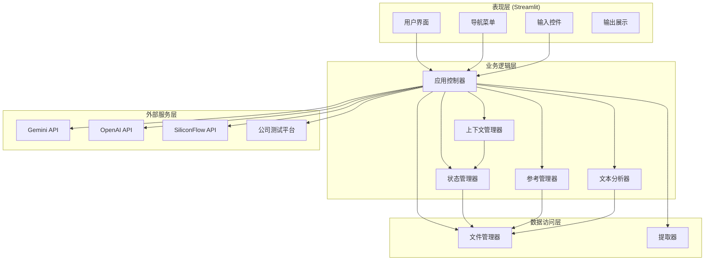
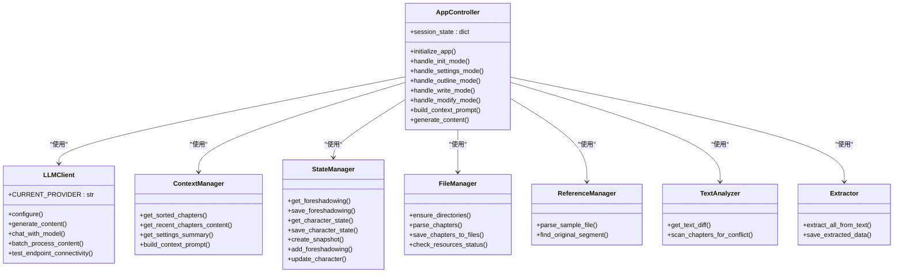
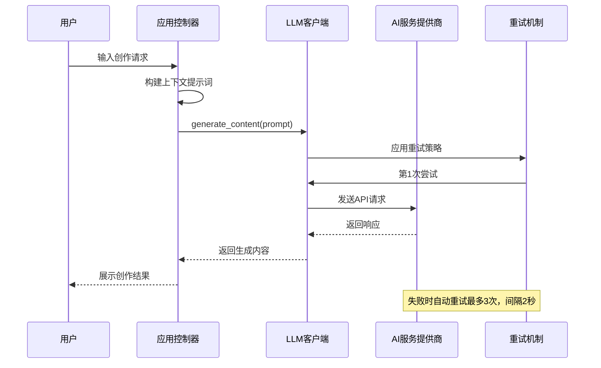
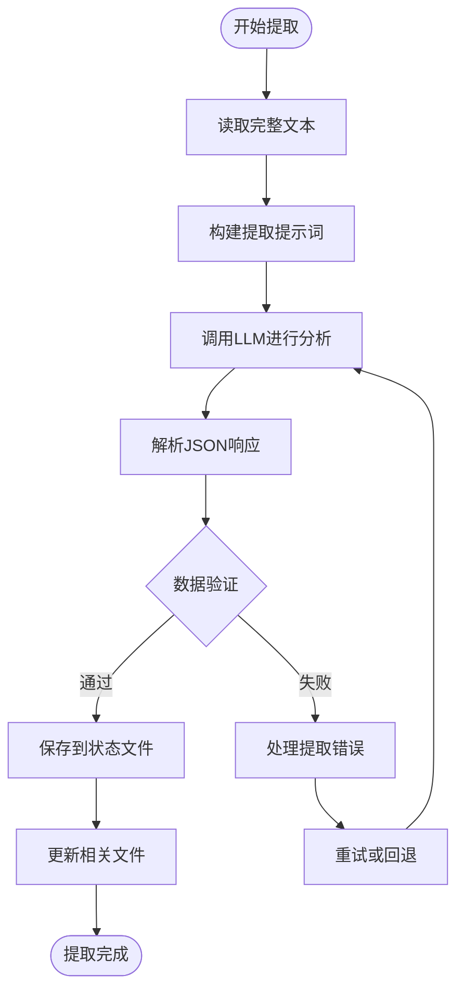
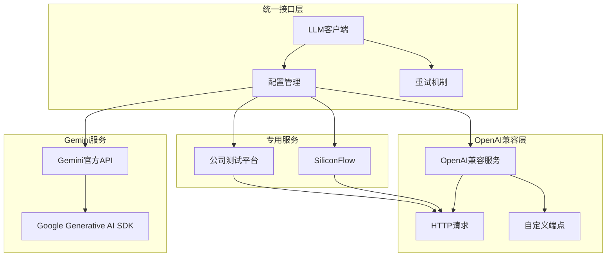
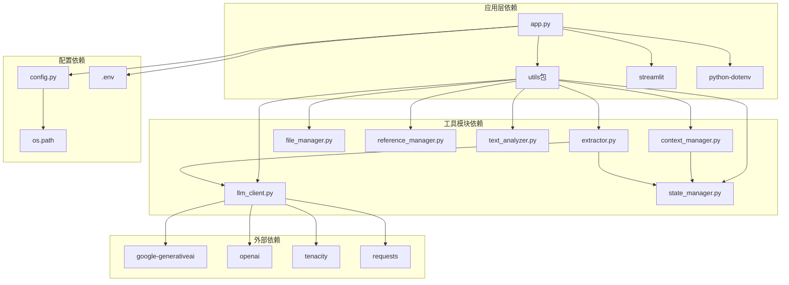

# 技术架构

<cite>
**本文档引用的文件**
- [app.py](file://app.py)
- [config.py](file://config.py)
- [requirements.txt](file://requirements.txt)
- [.env](file://.env)
- [utils/llm_client.py](file://utils/llm_client.py)
- [utils/context_manager.py](file://utils/context_manager.py)
- [utils/state_manager.py](file://utils/state_manager.py)
- [utils/file_manager.py](file://utils/file_manager.py)
- [utils/reference_manager.py](file://utils/reference_manager.py)
- [utils/text_analyzer.py](file://utils/text_analyzer.py)
- [utils/extractor.py](file://utils/extractor.py)
- [test_company_api.py](file://test_company_api.py)
</cite>

## 目录
1. [引言](#引言)
2. [项目结构](#项目结构)
3. [核心组件](#核心组件)
4. [架构总览](#架构总览)
5. [详细组件分析](#详细组件分析)
6. [依赖关系分析](#依赖关系分析)
7. [性能考虑](#性能考虑)
8. [故障排除指南](#故障排除指南)
9. [结论](#结论)

## 引言

镇妖狱创作引擎是一个基于Streamlit的AI驱动小说创作辅助系统。该系统旨在为网络文学创作者提供智能化的设定探讨、剧情细纲制定、正文续写以及冲突检测等功能。通过集成多种AI服务提供商，系统能够灵活适配不同的创作需求和预算考量。

本技术架构文档将深入分析系统的整体设计思路，包括前端界面架构、后端逻辑架构、多AI服务集成策略，以及模块化设计原则和职责分离策略。同时，我们将解释技术栈选择的原因和优势，并阐述系统的可扩展性设计和未来发展方向。

## 项目结构

该项目采用清晰的模块化组织结构，遵循Python项目的最佳实践。整体结构分为应用入口、配置管理、工具模块和数据存储四个主要部分。

```mermaid
graph TB
subgraph "应用层"
APP[app.py<br/>主应用入口]
CFG[config.py<br/>配置管理]
end
subgraph "工具模块层"
subgraph "AI服务模块"
LLM[utils/llm_client.py<br/>LLM客户端]
EXTRACT[utils/extractor.py<br/>内容提取器]
end
subgraph "业务逻辑模块"
CTX[utils/context_manager.py<br/>上下文管理器]
STATE[utils/state_manager.py<br/>状态管理器]
FILE[utils/file_manager.py<br/>文件管理器]
REF[utils/reference_manager.py<br/>参考管理器]
TEXT[utils/text_analyzer.py<br/>文本分析器]
end
end
subgraph "数据存储层"
DATA[(正文/)<br/>正文文件]
SETT[(设定/)<br/>设定文件]
OUTL[(细纲/)<br/>细纲文件]
HIST[(历史版本/)<br/>历史快照]
end
APP --> CFG
APP --> LLM
APP --> CTX
APP --> STATE
APP --> FILE
APP --> REF
APP --> TEXT
APP --> EXTRACT
STATE --> DATA
STATE --> SETT
STATE --> OUTL
STATE --> HIST
```

**图表来源**
- [app.py](file://app.py#L1-L711)
- [config.py](file://config.py#L1-L24)
- [utils/llm_client.py](file://utils/llm_client.py#L1-L303)
- [utils/context_manager.py](file://utils/context_manager.py#L1-L93)

**章节来源**
- [app.py](file://app.py#L1-L711)
- [config.py](file://config.py#L1-L24)

## 核心组件

系统的核心组件围绕四大支柱构建：Streamlit前端界面、统一的LLM客户端、智能状态管理系统和业务逻辑工具集。

### Streamlit前端界面架构

前端界面采用Streamlit框架构建，提供了直观的创作工作流程。界面设计遵循"功能分区、状态持久化、实时反馈"的设计原则。

**主要特性：**
- **多模式工作流**：初始化、探讨设定、探讨细纲、续写正文、改文与冲突提示五大功能模块
- **动态配置面板**：支持多种AI服务提供商的无缝切换
- **会话状态管理**：完整的对话历史和生成内容缓存
- **资源状态监控**：实时显示项目资源文件的存在状态

### 统一LLM客户端架构

LLM客户端实现了统一的接口抽象，支持多种AI服务提供商的透明切换。该组件是整个系统的核心通信枢纽。

**关键能力：**
- **多提供商支持**：Gemini官方API、OpenAI兼容服务、SiliconFlow、公司内部测试平台
- **动态端点路由**：支持chat/completions、embeddings、models等多种API端点
- **重试机制**：基于tenacity的智能重试策略
- **错误诊断**：详细的错误日志和调试信息

### 智能状态管理系统

状态管理系统负责维护创作过程中的所有关键数据，包括角色状态、伏笔列表、设定信息等。

**数据持久化策略：**
- **JSON文件格式**：便于人类可读和编辑
- **时间戳快照**：完整的版本控制和冲突检测
- **增量更新**：最小化文件写入开销

**章节来源**
- [app.py](file://app.py#L1-L711)
- [utils/llm_client.py](file://utils/llm_client.py#L1-L303)
- [utils/state_manager.py](file://utils/state_manager.py#L1-L77)

## 架构总览

系统采用分层架构设计，从上到下依次为表现层、业务逻辑层、数据访问层和外部服务层。



**图表来源**
- [app.py](file://app.py#L1-L711)
- [utils/context_manager.py](file://utils/context_manager.py#L1-L93)
- [utils/state_manager.py](file://utils/state_manager.py#L1-L77)
- [utils/llm_client.py](file://utils/llm_client.py#L1-L303)

## 详细组件分析

### 应用控制器组件分析

应用控制器作为系统的中枢，负责协调各个子系统的协作。其设计体现了高内聚、低耦合的原则。



**图表来源**
- [app.py](file://app.py#L1-L711)
- [utils/llm_client.py](file://utils/llm_client.py#L1-L303)
- [utils/context_manager.py](file://utils/context_manager.py#L1-L93)
- [utils/state_manager.py](file://utils/state_manager.py#L1-L77)
- [utils/file_manager.py](file://utils/file_manager.py#L1-L108)
- [utils/reference_manager.py](file://utils/reference_manager.py#L1-L94)
- [utils/text_analyzer.py](file://utils/text_analyzer.py#L1-L63)
- [utils/extractor.py](file://utils/extractor.py#L1-L106)

### API工作流序列图

系统的核心交互流程通过API调用来实现，以下是典型的LLM调用序列：



**图表来源**
- [utils/llm_client.py](file://utils/llm_client.py#L29-L186)
- [app.py](file://app.py#L457-L458)

### 内容提取算法流程图

系统支持从完整文本中提取关键创作信息，以下是提取过程的算法流程：



**图表来源**
- [utils/extractor.py](file://utils/extractor.py#L6-L55)
- [utils/state_manager.py](file://utils/state_manager.py#L17-L31)

**章节来源**
- [app.py](file://app.py#L1-L711)
- [utils/llm_client.py](file://utils/llm_client.py#L1-L303)
- [utils/extractor.py](file://utils/extractor.py#L1-L106)

### 多AI服务集成架构

系统实现了高度灵活的多AI服务集成架构，支持多种服务提供商的无缝切换。



**图表来源**
- [utils/llm_client.py](file://utils/llm_client.py#L9-L28)
- [utils/llm_client.py](file://utils/llm_client.py#L46-L186)
- [.env](file://.env#L1-L16)

**章节来源**
- [utils/llm_client.py](file://utils/llm_client.py#L1-L303)
- [.env](file://.env#L1-L16)

## 依赖关系分析

系统的依赖关系体现了清晰的分层架构和模块化设计原则。



**图表来源**
- [app.py](file://app.py#L1-L11)
- [utils/llm_client.py](file://utils/llm_client.py#L1-L5)
- [requirements.txt](file://requirements.txt#L1-L6)
- [config.py](file://config.py#L1-L24)

**章节来源**
- [requirements.txt](file://requirements.txt#L1-L6)
- [config.py](file://config.py#L1-L24)

## 性能考虑

系统在设计时充分考虑了性能优化和用户体验的平衡。

### 缓存策略
- **会话状态缓存**：Streamlit的session_state自动缓存用户输入和生成内容
- **文件系统缓存**：状态文件的增量更新减少磁盘I/O操作
- **API调用缓存**：对重复的LLM请求进行智能去重

### 并发处理
- **异步API调用**：使用requests库进行非阻塞的HTTP请求
- **批量处理**：支持批量内容提取和处理
- **超时控制**：合理的超时设置避免长时间阻塞

### 资源管理
- **内存优化**：文本处理采用流式读取，避免大文件内存溢出
- **连接池**：复用HTTP连接减少建立连接的开销
- **错误恢复**：完善的异常处理和自动重试机制

## 故障排除指南

### 常见问题诊断

**API连接问题**
1. 检查环境变量配置是否正确
2. 验证API密钥的有效性和权限
3. 确认网络连接和防火墙设置
4. 使用内置的端点测试功能进行诊断

**文件读写问题**
1. 检查目标目录的读写权限
2. 验证文件路径的正确性
3. 确认磁盘空间充足
4. 检查文件编码格式

**内存不足问题**
1. 优化大文件的处理方式
2. 实施分块读取策略
3. 及时清理临时文件
4. 监控内存使用情况

### 调试工具

系统提供了多种调试工具来帮助开发者定位问题：

- **详细错误日志**：每个API调用都包含详细的错误信息
- **连接测试功能**：内置的端点连通性测试
- **状态监控**：实时显示系统运行状态
- **配置验证**：自动验证配置文件的完整性

**章节来源**
- [utils/llm_client.py](file://utils/llm_client.py#L144-L157)
- [app.py](file://app.py#L275-L286)

## 结论

镇妖狱创作引擎展现了现代AI应用开发的最佳实践。通过Streamlit框架的直观界面、统一的LLM客户端抽象、智能的状态管理和模块化的工具集，系统实现了高度的可扩展性和易维护性。

### 技术优势总结

1. **架构清晰**：分层设计确保了良好的可维护性
2. **扩展性强**：模块化设计支持新功能的快速集成
3. **用户体验佳**：直观的界面和流畅的工作流程
4. **可靠性高**：完善的错误处理和重试机制
5. **成本可控**：支持多种AI服务提供商的选择

### 未来发展建议

1. **增强AI能力**：集成更多先进的语言模型和多模态能力
2. **优化性能**：实施更高效的缓存策略和并发处理
3. **扩展功能**：增加更多创作辅助工具和模板
4. **提升体验**：改进界面设计和交互流程
5. **加强安全**：完善API密钥管理和访问控制

该系统为网络文学创作提供了一个强大而灵活的技术平台，通过持续的迭代和优化，有望成为创作者的得力助手。