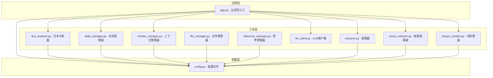
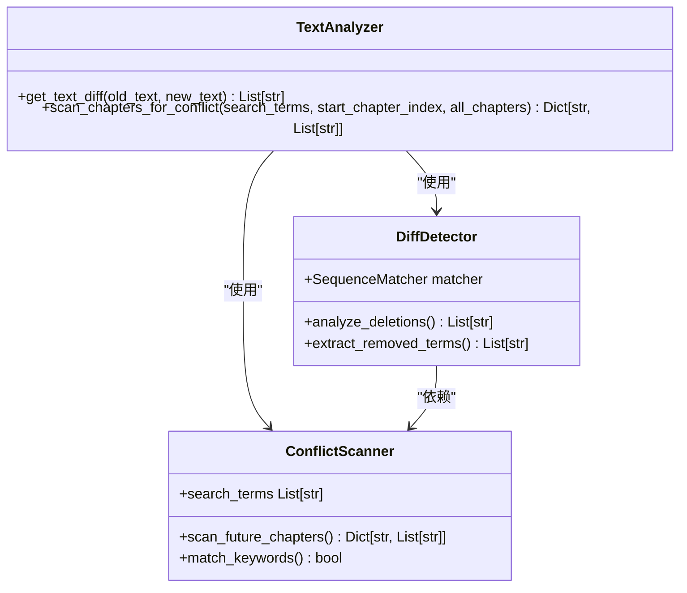
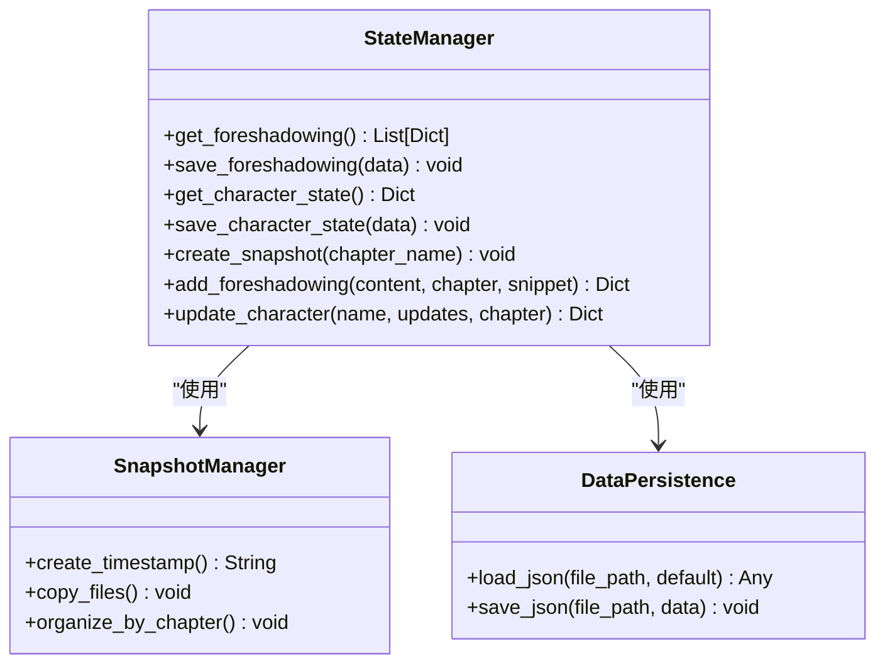
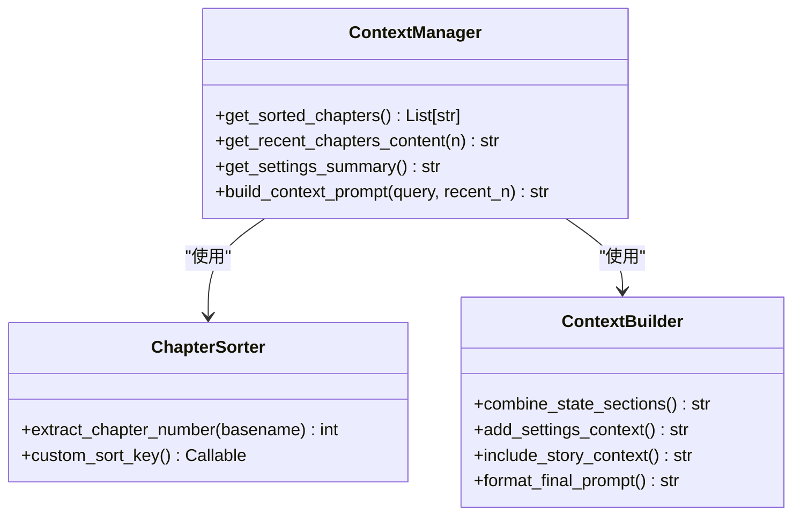
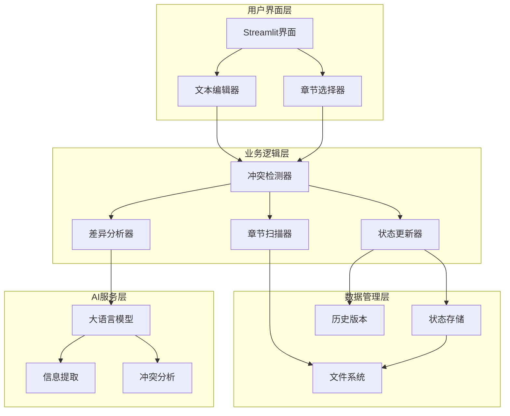
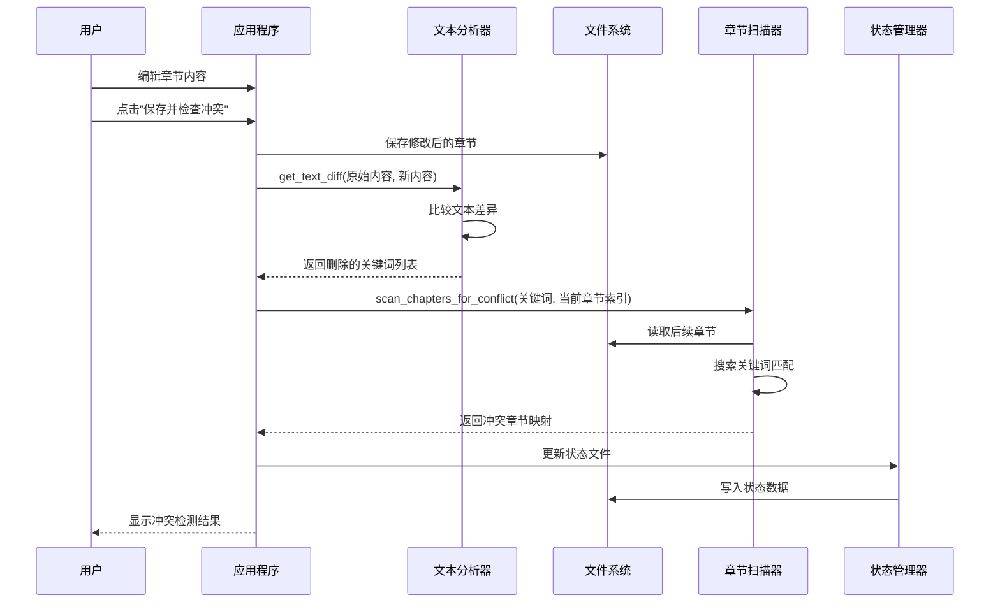
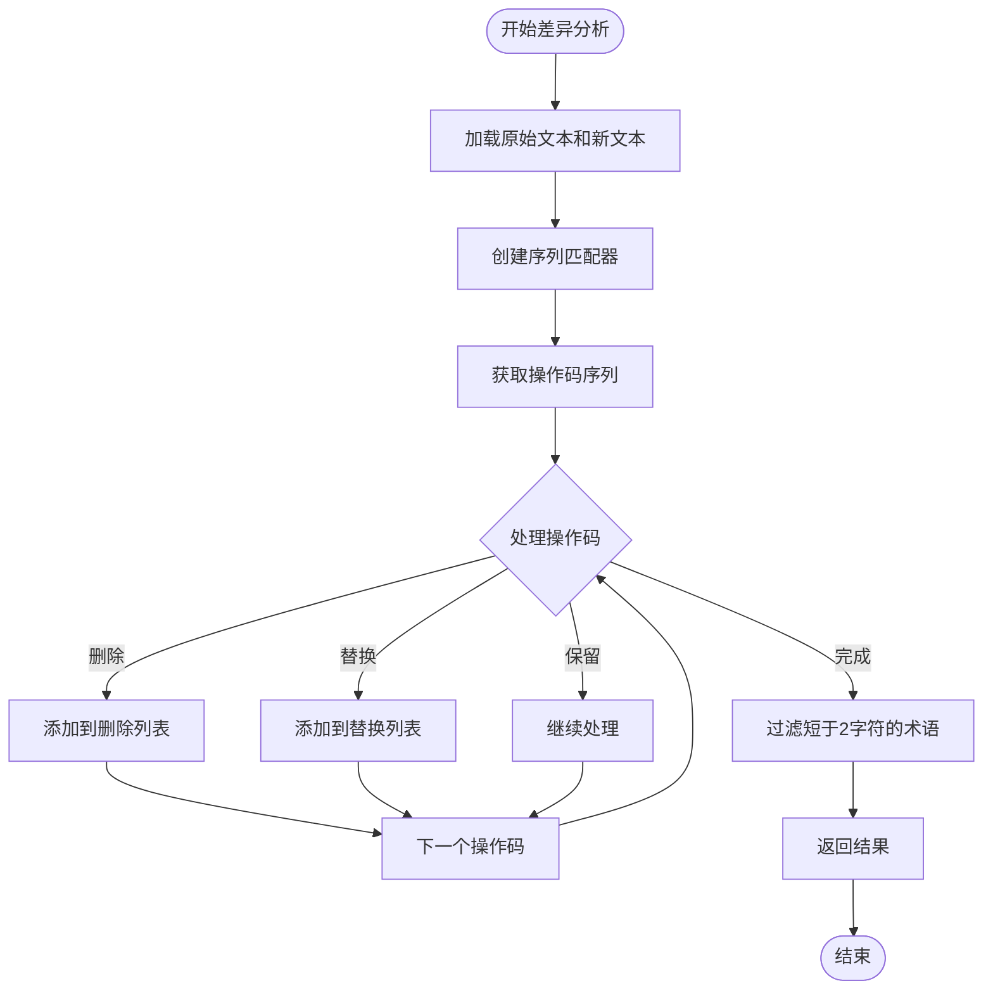
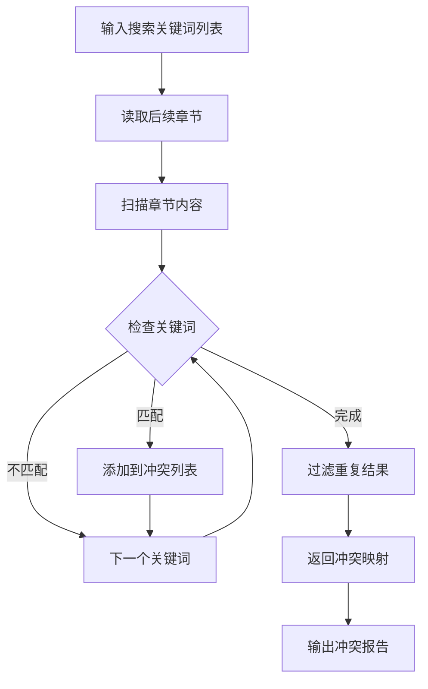
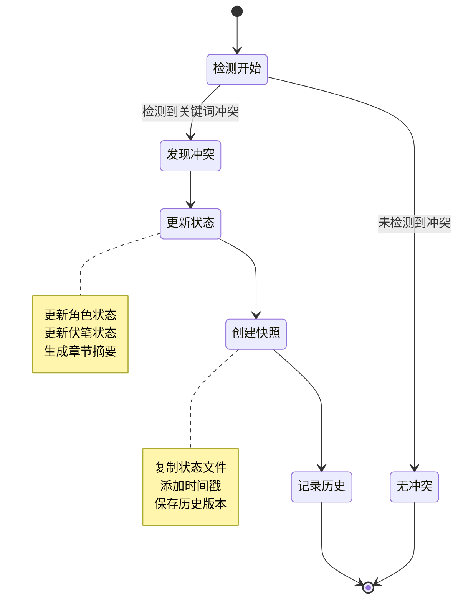
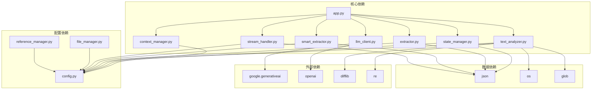

# 冲突检测机制

<cite>
**本文档引用的文件**
- [app.py](file://app.py)
- [text_analyzer.py](file://utils/text_analyzer.py)
- [state_manager.py](file://utils/state_manager.py)
- [context_manager.py](file://utils/context_manager.py)
- [llm_client.py](file://utils/llm_client.py)
- [config.py](file://config.py)
- [file_manager.py](file://utils/file_manager.py)
- [reference_manager.py](file://utils/reference_manager.py)
- [extractor.py](file://utils/extractor.py)
- [smart_extractor.py](file://utils/smart_extractor.py)
- [stream_handler.py](file://utils/stream_handler.py)
</cite>

## 目录
1. [简介](#简介)
2. [项目结构](#项目结构)
3. [核心组件](#核心组件)
4. [架构概览](#架构概览)
5. [详细组件分析](#详细组件分析)
6. [依赖关系分析](#依赖关系分析)
7. [性能考虑](#性能考虑)
8. [故障排除指南](#故障排除指南)
9. [结论](#结论)

## 简介

冲突检测机制是小说创作辅助系统中的关键功能模块，专门用于识别和提醒作者在创作过程中可能出现的逻辑冲突。该系统通过文本差异分析、关键词提取和后续章节扫描等核心技术，帮助作者及时发现并修正创作中的逻辑问题，确保故事的连贯性和一致性。

该机制的核心价值在于：
- **自动化冲突识别**：通过算法自动检测潜在的逻辑冲突
- **上下文感知**：结合角色状态、伏笔信息和设定背景进行综合分析
- **智能提示**：提供具体的冲突位置和修改建议
- **历史追踪**：记录每次冲突检测的历史版本，便于追溯

## 项目结构

该项目采用模块化设计，将不同功能职责清晰分离：

**图表来源**
- [app.py](file://app.py#L1-L719)
- [config.py](file://config.py#L1-L24)

**章节来源**
- [app.py](file://app.py#L1-L719)
- [config.py](file://config.py#L1-L24)

## 核心组件

### 文本差异分析器 (Text Analyzer)

文本差异分析器是冲突检测机制的核心组件，负责比较修改前后的文本差异并识别潜在的逻辑冲突。

**图表来源**
- [text_analyzer.py](file://utils/text_analyzer.py#L7-L63)

### 状态管理系统 (State Manager)

状态管理系统负责维护和更新角色状态、伏笔信息等关键数据，为冲突检测提供上下文支持。

**图表来源**
- [state_manager.py](file://utils/state_manager.py#L1-L77)

### 上下文管理器 (Context Manager)

上下文管理器负责构建和维护创作过程中的上下文信息，包括最近章节内容、角色状态和设定信息。

**图表来源**
- [context_manager.py](file://utils/context_manager.py#L1-L93)

**章节来源**
- [text_analyzer.py](file://utils/text_analyzer.py#L1-L63)
- [state_manager.py](file://utils/state_manager.py#L1-L77)
- [context_manager.py](file://utils/context_manager.py#L1-L93)

## 架构概览

冲突检测机制的整体架构采用分层设计，各组件职责明确且相互协作：

**图表来源**
- [app.py](file://app.py#L628-L719)
- [text_analyzer.py](file://utils/text_analyzer.py#L7-L63)
- [state_manager.py](file://utils/state_manager.py#L33-L77)

## 详细组件分析

### 冲突检测工作流程

冲突检测机制遵循严格的处理流程，确保能够准确识别和报告潜在的逻辑冲突：

**图表来源**
- [app.py](file://app.py#L651-L682)
- [text_analyzer.py](file://utils/text_analyzer.py#L7-L63)

### 文本差异分析算法

文本差异分析采用序列匹配算法，能够精确识别文本中的删除和替换操作：

**图表来源**
- [text_analyzer.py](file://utils/text_analyzer.py#L31-L37)

### 关键词提取与冲突扫描

冲突扫描功能通过关键词匹配实现，能够识别后续章节中可能存在的逻辑冲突：

**图表来源**
- [text_analyzer.py](file://utils/text_analyzer.py#L39-L62)

### 状态更新与历史追踪

当检测到冲突时，系统会自动更新相关的状态文件并创建历史版本快照：

**图表来源**
- [state_manager.py](file://utils/state_manager.py#L33-L49)
- [app.py](file://app.py#L687-L719)

**章节来源**
- [app.py](file://app.py#L628-L719)
- [text_analyzer.py](file://utils/text_analyzer.py#L1-L63)
- [state_manager.py](file://utils/state_manager.py#L1-L77)

## 依赖关系分析

系统各组件之间的依赖关系清晰明确，形成了稳定的模块化架构：

**图表来源**
- [app.py](file://app.py#L11-L12)
- [llm_client.py](file://utils/llm_client.py#L1-L5)
- [text_analyzer.py](file://utils/text_analyzer.py#L1-L5)

**章节来源**
- [app.py](file://app.py#L1-L719)
- [llm_client.py](file://utils/llm_client.py#L1-L203)

## 性能考虑

### 时间复杂度分析

冲突检测机制的时间复杂度主要取决于以下因素：

- **文本差异分析**：O(n+m)，其中n和m分别为原始文本和新文本的长度
- **关键词匹配**：O(k×c×l)，其中k为关键词数量，c为后续章节数量，l为平均章节长度
- **整体性能**：主要瓶颈在于后续章节的全文扫描

### 内存优化策略

系统采用了多项内存优化措施：

1. **增量处理**：只在需要时读取和处理章节内容
2. **流式处理**：对于大文本采用流式处理方式
3. **智能缓存**：缓存常用的配置和状态信息
4. **延迟加载**：按需加载章节文件，避免一次性加载所有文件

### 并发处理能力

系统支持并发处理多个章节的冲突检测，通过异步处理提高整体效率。

## 故障排除指南

### 常见问题及解决方案

#### API配置问题
- **症状**：LLM调用失败或返回错误
- **原因**：API密钥配置不正确或网络连接问题
- **解决**：检查环境变量配置，验证API密钥有效性

#### 文本编码问题
- **症状**：中文字符显示异常或乱码
- **原因**：文件编码格式不正确
- **解决**：确保所有文本文件使用UTF-8编码

#### 冲突检测不准确
- **症状**：未能检测到明显的逻辑冲突
- **原因**：关键词提取不够精确或阈值设置不当
- **解决**：调整关键词提取策略，优化冲突检测阈值

#### 性能问题
- **症状**：冲突检测过程缓慢
- **原因**：处理大量章节或大文本文件
- **解决**：启用智能分段模式，优化窗口参数

**章节来源**
- [llm_client.py](file://utils/llm_client.py#L9-L142)
- [text_analyzer.py](file://utils/text_analyzer.py#L1-L63)

## 结论

冲突检测机制通过精心设计的算法和架构，为小说创作提供了强有力的逻辑保障。该系统不仅能够准确识别潜在的逻辑冲突，还能提供智能化的状态管理和历史追踪功能。

### 主要优势

1. **准确性**：基于序列匹配算法的文本差异分析，确保冲突检测的准确性
2. **智能化**：结合AI分析和人工审核，提供多层次的冲突识别
3. **可扩展性**：模块化设计支持功能扩展和定制化需求
4. **易用性**：直观的用户界面和清晰的操作流程

### 技术创新点

- **关键词驱动的冲突检测**：通过关键词匹配实现高效的冲突识别
- **上下文感知分析**：结合角色状态、伏笔信息和设定背景进行综合分析
- **智能分段处理**：支持大文本的智能分段和上下文保持
- **历史版本追踪**：完整的版本管理和冲突历史记录

### 未来发展

该系统具备良好的扩展基础，未来可以在以下方面进一步完善：
- 增强语义层面的冲突检测能力
- 集成更多的AI分析功能
- 优化性能表现，支持更大规模的文本处理
- 提供更丰富的可视化和交互功能

通过持续的技术改进和功能扩展，冲突检测机制将成为小说创作过程中的重要智能助手，帮助作者创作出更加严谨和精彩的作品。