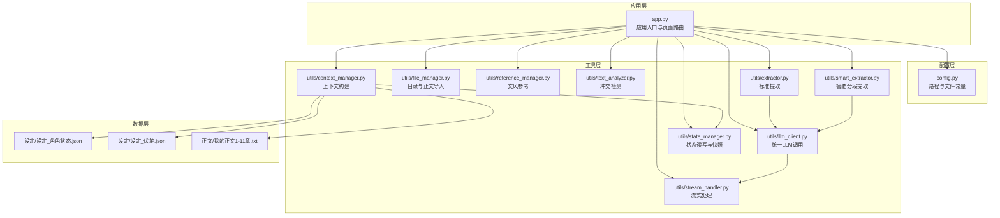
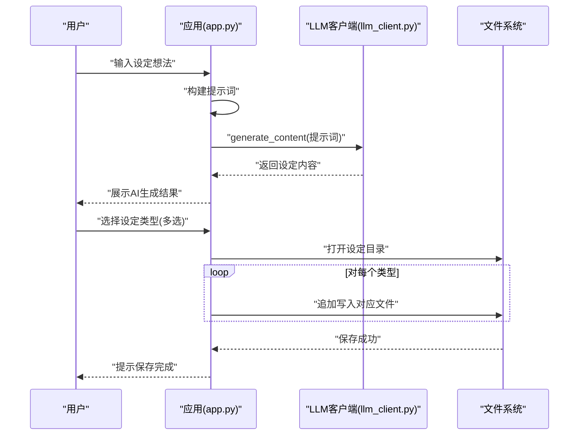
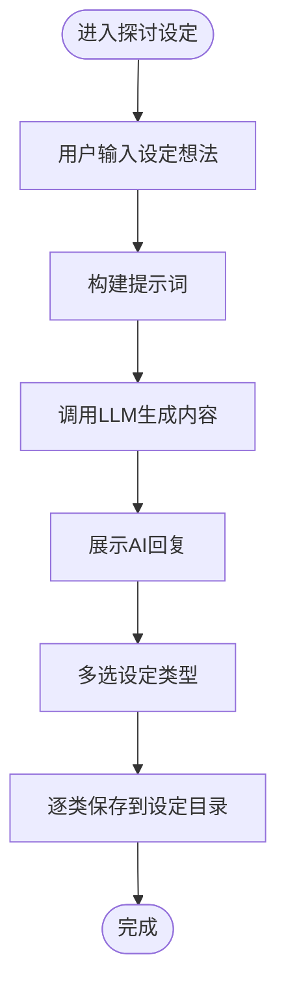
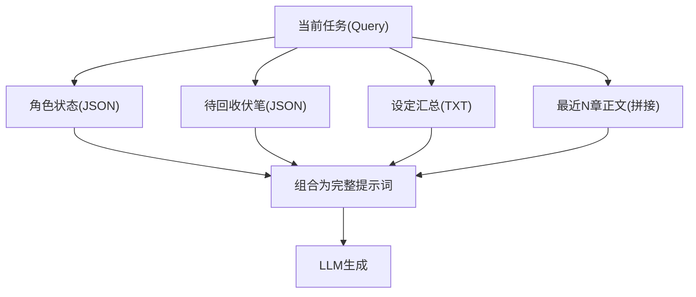
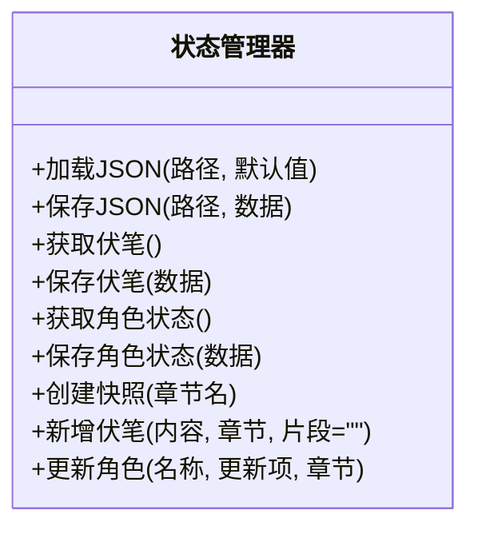
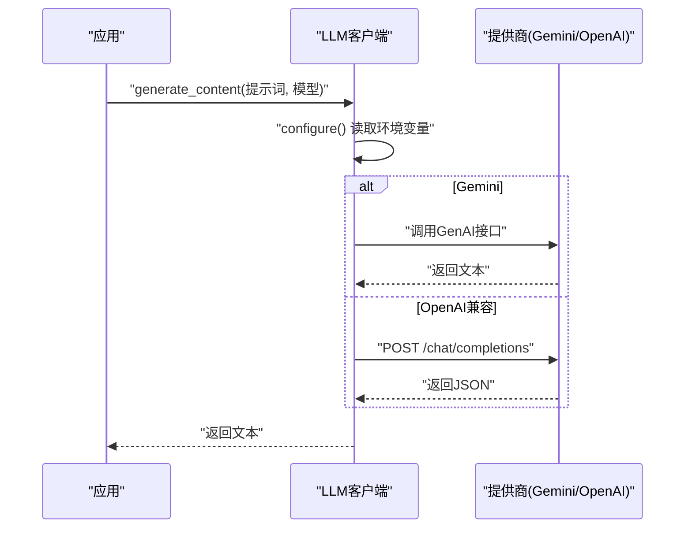
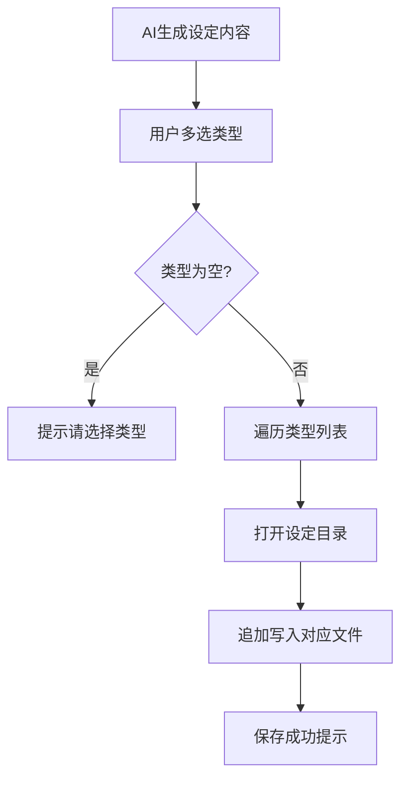
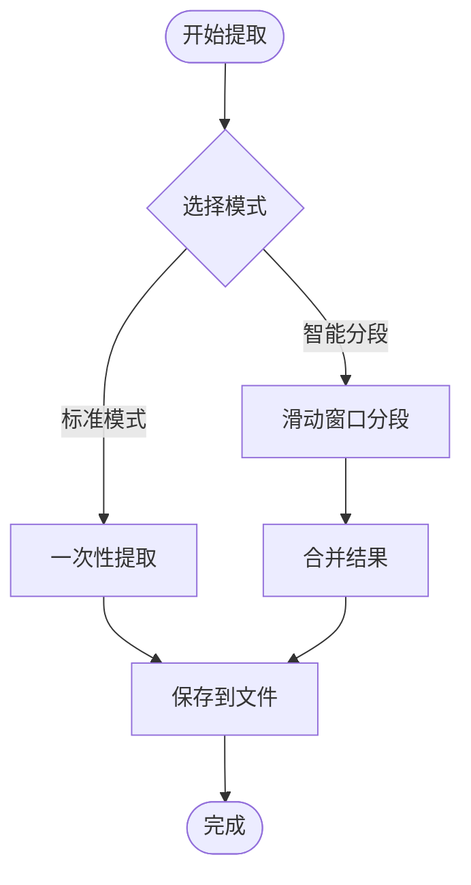
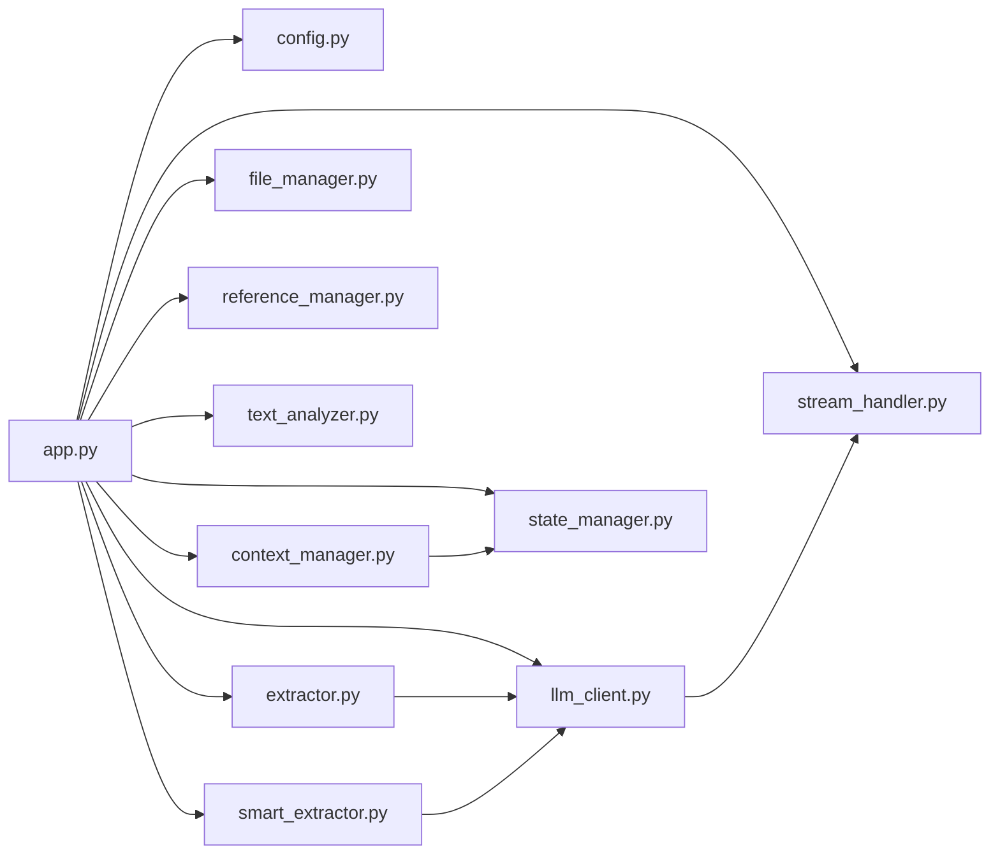

# 智能设定探讨

<cite>
**本文引用的文件**
- [app.py](file://app.py)
- [config.py](file://config.py)
- [utils/context_manager.py](file://utils/context_manager.py)
- [utils/state_manager.py](file://utils/state_manager.py)
- [utils/llm_client.py](file://utils/llm_client.py)
- [utils/file_manager.py](file://utils/file_manager.py)
- [utils/reference_manager.py](file://utils/reference_manager.py)
- [utils/text_analyzer.py](file://utils/text_analyzer.py)
- [utils/extractor.py](file://utils/extractor.py)
- [utils/smart_extractor.py](file://utils/smart_extractor.py)
- [utils/stream_handler.py](file://utils/stream_handler.py)
- [设定/设定_角色状态.json](file://设定/设定_角色状态.json)
- [设定/设定_伏笔.json](file://设定/设定_伏笔.json)
- [正文/我的正文1-11章.txt](file://正文/我的正文1-11章.txt)
</cite>

## 目录
1. [简介](#简介)
2. [项目结构](#项目结构)
3. [核心组件](#核心组件)
4. [架构总览](#架构总览)
5. [详细组件分析](#详细组件分析)
6. [依赖关系分析](#依赖关系分析)
7. [性能考量](#性能考量)
8. [故障排查指南](#故障排查指南)
9. [结论](#结论)
10. [附录](#附录)

## 简介
本功能围绕“智能设定探讨”展开，旨在通过AI助手帮助创作者完善小说设定，覆盖世界观、人物、势力、战力、物品、历史背景、规则制度等多个维度。系统采用对话式交互，结合上下文管理与状态持久化，实现“边聊边记、即设即存”的创作体验。同时，系统内置智能分类提示词与多类型设定保存策略，确保生成内容可被有序归档与复用。

## 项目结构
项目采用模块化设计，入口为应用主程序，核心逻辑分布在工具模块与配置模块中；设定相关的数据文件位于“设定”目录，正文与细纲分别存放于“正文”和“细纲”目录。

图表来源
- [app.py](file://app.py#L1-L719)
- [config.py](file://config.py#L1-L24)
- [utils/context_manager.py](file://utils/context_manager.py#L1-L93)
- [utils/state_manager.py](file://utils/state_manager.py#L1-L77)
- [utils/llm_client.py](file://utils/llm_client.py#L1-L203)
- [utils/file_manager.py](file://utils/file_manager.py#L1-L108)
- [utils/reference_manager.py](file://utils/reference_manager.py#L1-L94)
- [utils/text_analyzer.py](file://utils/text_analyzer.py#L1-L63)
- [utils/extractor.py](file://utils/extractor.py#L1-L194)
- [utils/smart_extractor.py](file://utils/smart_extractor.py#L1-L313)
- [utils/stream_handler.py](file://utils/stream_handler.py#L1-L114)

章节来源
- [app.py](file://app.py#L1-L719)
- [config.py](file://config.py#L1-L24)

## 核心组件
- 应用入口与页面路由：负责渲染界面、收集用户输入、触发LLM生成与保存流程。
- LLM客户端：统一处理不同提供商（Gemini/OpenAI兼容）的调用，支持标准与流式响应。
- 上下文管理器：整合角色状态、伏笔、设定与近期正文，构建完整提示词。
- 状态管理器：负责角色状态与伏笔的读取、写入与历史快照。
- 文件管理器：确保目录结构、正文导入与资源状态检查。
- 参考管理器：提供文风参考样本解析与原文片段检索。
- 文本分析器：计算文本差异并扫描后续章节潜在冲突。
- 提取器：从全文提取角色状态、伏笔、设定与剧情回顾，并保存到对应文件。
- 智能提取器：对长文本进行滑动窗口分段提取，保持上下文完整性并合并结果。
- 流处理器：处理流式响应，拼接增量内容。

章节来源
- [app.py](file://app.py#L426-L504)
- [utils/llm_client.py](file://utils/llm_client.py#L1-L203)
- [utils/context_manager.py](file://utils/context_manager.py#L43-L92)
- [utils/state_manager.py](file://utils/state_manager.py#L1-L77)
- [utils/file_manager.py](file://utils/file_manager.py#L1-L108)
- [utils/reference_manager.py](file://utils/reference_manager.py#L1-L94)
- [utils/text_analyzer.py](file://utils/text_analyzer.py#L1-L63)
- [utils/extractor.py](file://utils/extractor.py#L1-L194)
- [utils/smart_extractor.py](file://utils/smart_extractor.py#L1-L313)
- [utils/stream_handler.py](file://utils/stream_handler.py#L1-L114)

## 架构总览
智能设定探讨功能的运行流程如下：
- 用户在“探讨设定”页面输入自然语言的设定想法。
- 应用构建提示词，调用LLM生成设定内容。
- 用户选择设定类型（多选），将AI生成内容追加保存到“设定”目录下的对应文件中。
- 系统同时支持“全量状态提取”与“智能分段提取”，将提取结果写入状态文件与设定文件，便于后续细纲讨论与正文续写。

图表来源
- [app.py](file://app.py#L441-L504)
- [utils/llm_client.py](file://utils/llm_client.py#L30-L50)

## 详细组件分析

### 组件A：智能设定探讨对话流程
- 对话界面：用户输入自然语言设定想法，系统以专业、详细的口吻回应，并自然融入多方面设定元素。
- 生成策略：根据会话状态构建提示词，调用LLM生成内容并缓存到会话消息中。
- 保存策略：用户选择设定类型（如“世界观/地图设定”、“人物设定”等），系统将最后一条AI回复追加写入对应文件，形成“时间线+主题”的归档。

图表来源
- [app.py](file://app.py#L427-L504)

章节来源
- [app.py](file://app.py#L427-L504)

### 组件B：上下文构建与提示词工程
- 上下文来源：角色状态（JSON）、待回收伏笔（JSON）、各设定文件（TXT汇总）、最近N章正文（按章节排序拼接）。
- 提示词结构：明确任务目标、状态摘要、设定概要与故事上下文，确保LLM在生成时具备全局视角。
- 关键函数：构建上下文提示词、读取最近章节内容、汇总设定文件。

图表来源
- [utils/context_manager.py](file://utils/context_manager.py#L43-L92)

章节来源
- [utils/context_manager.py](file://utils/context_manager.py#L1-L93)

### 组件C：状态管理与历史快照
- 角色状态：以JSON存储，键为角色名，值包含状态、装备、能力等字段；更新时自动记录章节与时间戳。
- 伏笔管理：新增伏笔时分配唯一ID、记录创建章节与时间，支持查询与筛选。
- 快照机制：章节完成后可创建状态快照，复制当前状态文件到历史版本目录，命名包含章节名与时间戳。

图表来源
- [utils/state_manager.py](file://utils/state_manager.py#L1-L77)

章节来源
- [utils/state_manager.py](file://utils/state_manager.py#L1-L77)
- [设定/设定_角色状态.json](file://设定/设定_角色状态.json#L1-L1)
- [设定/设定_伏笔.json](file://设定/设定_伏笔.json#L1-L1)

### 组件D：LLM客户端与多提供商适配
- 提供商选择：Gemini官方API、OpenAI兼容（NewAPI、SiliconFlow、公司内部平台等）。
- 统一接口：generate_content/chat_with_model，自动根据环境变量选择提供商与模型。
- 错误处理：打印详细调用信息（模型、URL、Key长度、异常类型、堆栈），便于调试。
- 流式处理：支持SSE流式响应，拼接增量内容并返回完整文本。

图表来源
- [utils/llm_client.py](file://utils/llm_client.py#L9-L142)

章节来源
- [utils/llm_client.py](file://utils/llm_client.py#L1-L203)

### 组件E：设定保存策略与智能分类
- 智能分类：系统在提示词中强调“自然融入各种设定元素”，减少用户手动分类负担。
- 多类型保存：用户多选设定类型，系统将AI回复追加写入对应文件，形成“主题+内容”的归档。
- 文件命名：按“设定_类型.txt”命名，便于后续检索与汇总。

图表来源
- [app.py](file://app.py#L476-L504)

章节来源
- [app.py](file://app.py#L476-L504)

### 组件F：全量状态提取与智能分段提取
- 全量提取：读取正文全文，调用LLM一次性提取角色状态、伏笔、设定与剧情回顾，并保存到对应文件。
- 智能分段：对长文本使用滑动窗口，保持上下文连续性，逐段提取后合并结果，提升准确性与稳定性。
- 流式处理：分块调用LLM并拼接响应，降低内存占用。

图表来源
- [utils/extractor.py](file://utils/extractor.py#L6-L56)
- [utils/smart_extractor.py](file://utils/smart_extractor.py#L5-L58)
- [utils/stream_handler.py](file://utils/stream_handler.py#L58-L114)

章节来源
- [utils/extractor.py](file://utils/extractor.py#L1-L194)
- [utils/smart_extractor.py](file://utils/smart_extractor.py#L1-L313)
- [utils/stream_handler.py](file://utils/stream_handler.py#L1-L114)

## 依赖关系分析
- 应用层依赖配置层与工具层；工具层内部模块耦合度较低，职责清晰。
- 上下文管理器依赖状态管理器与设定文件；提取器依赖LLM客户端与状态管理器。
- LLM客户端对提供商SDK与HTTP库有外部依赖；流处理器依赖requests库处理SSE。

图表来源
- [app.py](file://app.py#L1-L12)
- [utils/context_manager.py](file://utils/context_manager.py#L1-L5)
- [utils/extractor.py](file://utils/extractor.py#L1-L4)
- [utils/smart_extractor.py](file://utils/smart_extractor.py#L1-L3)
- [utils/llm_client.py](file://utils/llm_client.py#L1-L4)
- [utils/stream_handler.py](file://utils/stream_handler.py#L1-L1)

章节来源
- [app.py](file://app.py#L1-L12)
- [utils/context_manager.py](file://utils/context_manager.py#L1-L5)
- [utils/extractor.py](file://utils/extractor.py#L1-L4)
- [utils/smart_extractor.py](file://utils/smart_extractor.py#L1-L3)
- [utils/llm_client.py](file://utils/llm_client.py#L1-L4)
- [utils/stream_handler.py](file://utils/stream_handler.py#L1-L1)

## 性能考量
- 模型选择：不同提供商与模型在响应速度与推理能力上存在差异，建议根据任务复杂度选择合适模型。
- 提取模式：长文本优先使用智能分段模式，平衡上下文完整性与Token消耗；必要时调整窗口大小与重叠大小。
- 流式处理：对长文本分块处理可显著降低内存峰值，提升稳定性。
- 缓存与快照：定期创建状态快照，有助于回溯与对比，但需注意磁盘空间与清理策略。

## 故障排查指南
- API配置问题：检查环境变量（提供商、Base URL、API Key、模型名）是否正确设置。
- LLM调用异常：查看终端打印的详细错误信息（模型、URL、Key长度、异常类型、堆栈），定位问题来源。
- 文件保存失败：确认“设定”目录存在且可写；检查文件名合法性与编码。
- 上下文缺失：确保“设定_角色状态.json”“设定_伏笔.json”存在；正文导入后“正文”目录应包含章节文件。

章节来源
- [utils/llm_client.py](file://utils/llm_client.py#L9-L28)
- [utils/llm_client.py](file://utils/llm_client.py#L100-L142)
- [utils/file_manager.py](file://utils/file_manager.py#L7-L14)
- [utils/context_manager.py](file://utils/context_manager.py#L34-L41)

## 结论
“智能设定探讨”功能通过对话式交互与上下文工程，将AI生成的设定内容以多维度、可追溯的方式归档保存。配合状态管理与历史快照，系统能够持续维护设定一致性与可复用性。对于长文本场景，智能分段与流式处理进一步提升了稳定性与效率。建议在实际使用中结合自身提供商与模型特点，合理配置参数并定期备份状态文件。

## 附录
- 使用示例
  - 在“探讨设定”页面输入自然语言描述（如“这个世界观中有哪些势力分布？”“主角的战力体系如何设定？”），系统将生成包含多维度设定的回复。
  - 选择“人物设定”“势力/组织设定”“战力/功法设定”等类型，点击“保存设定”，即可将AI回复追加写入对应文件。
  - 若正文较长，可在“初始化”中选择“智能分段模式（保持上下文）”，调整窗口大小与重叠大小后执行“全量提取”，系统将自动保存角色状态、伏笔、设定与剧情回顾。

章节来源
- [app.py](file://app.py#L427-L504)
- [utils/smart_extractor.py](file://utils/smart_extractor.py#L5-L58)
- [utils/extractor.py](file://utils/extractor.py#L145-L194)
- [utils/context_manager.py](file://utils/context_manager.py#L43-L92)
- [utils/state_manager.py](file://utils/state_manager.py#L33-L49)
- [utils/file_manager.py](file://utils/file_manager.py#L16-L80)
- [正文/我的正文1-11章.txt](file://正文/我的正文1-11章.txt#L1-L200)