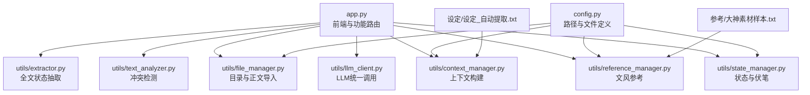
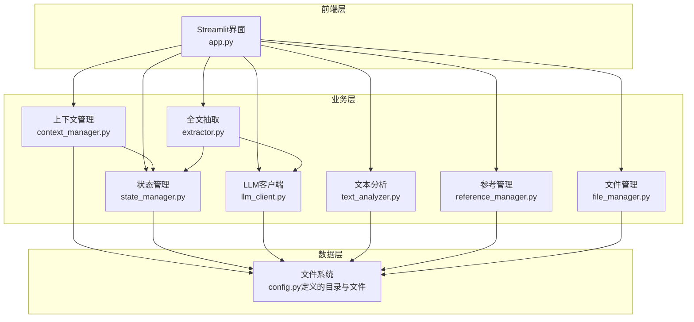
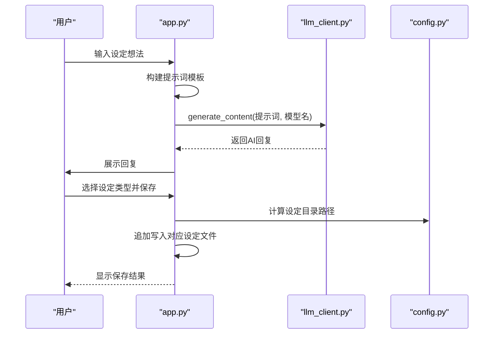
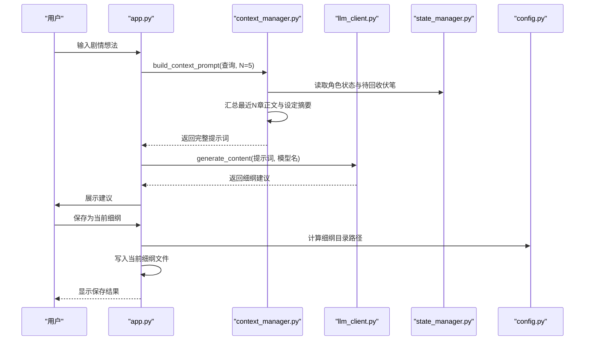
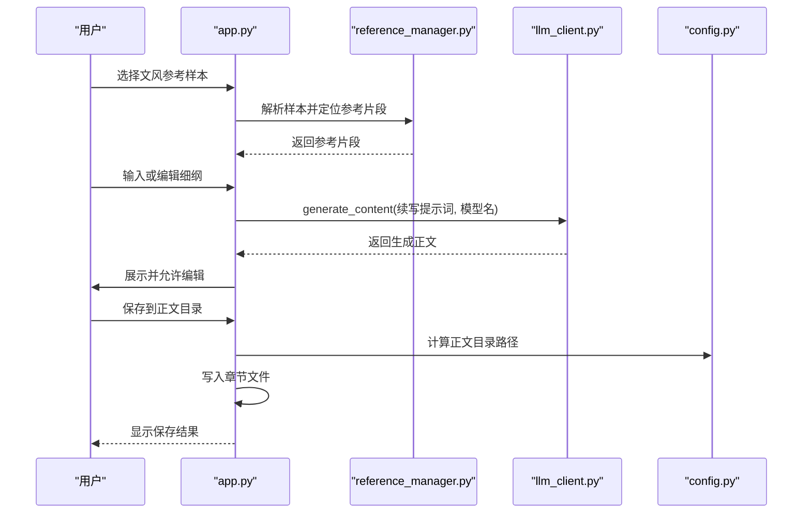
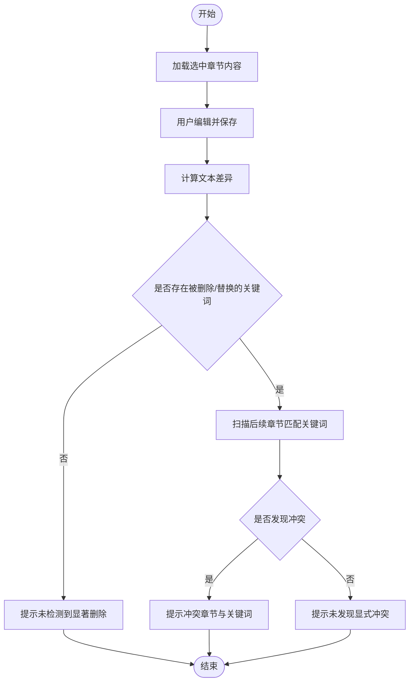
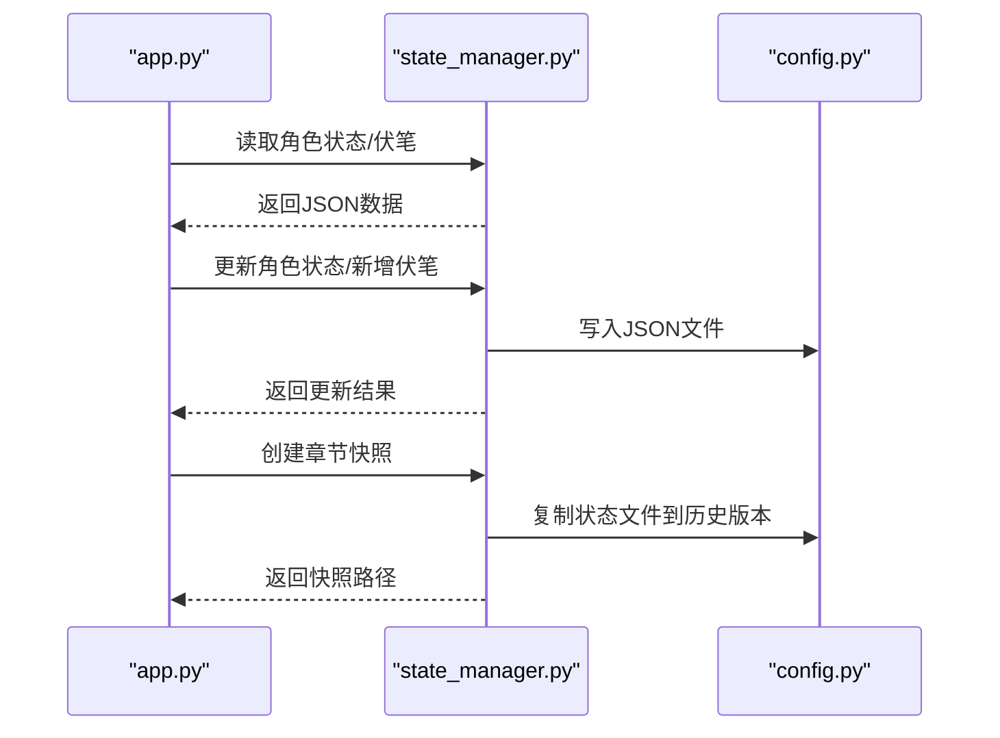
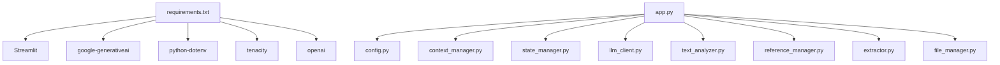

# 核心功能

<cite>
**本文引用的文件**
- [app.py](file://app.py)
- [config.py](file://config.py)
- [requirements.txt](file://requirements.txt)
- [utils/context_manager.py](file://utils/context_manager.py)
- [utils/state_manager.py](file://utils/state_manager.py)
- [utils/llm_client.py](file://utils/llm_client.py)
- [utils/text_analyzer.py](file://utils/text_analyzer.py)
- [utils/reference_manager.py](file://utils/reference_manager.py)
- [utils/extractor.py](file://utils/extractor.py)
- [utils/file_manager.py](file://utils/file_manager.py)
- [参考/大神素材样本.txt](file://参考/大神素材样本.txt)
- [设定/设定_自动提取.txt](file://设定/设定_自动提取.txt)
</cite>

## 目录
1. [简介](#简介)
2. [项目结构](#项目结构)
3. [核心组件](#核心组件)
4. [架构总览](#架构总览)
5. [详细组件分析](#详细组件分析)
6. [依赖关系分析](#依赖关系分析)
7. [性能考量](#性能考量)
8. [故障排查指南](#故障排查指南)
9. [结论](#结论)
10. [附录](#附录)

## 简介
本项目为“镇妖狱创作引擎”，旨在为网络小说作者提供一套智能化的创作辅助系统。系统围绕五大核心功能模块展开：
- 智能设定探讨：基于大模型的设定问答与分类保存
- 细纲规划系统：结合上下文与状态的剧情讨论与细纲沉淀
- 正文续写引擎：在细纲与文风参考驱动下生成正文章节
- 冲突检测机制：基于文本差异扫描后续章节的潜在冲突
- 状态管理系统：维护角色状态与伏笔回收的结构化数据

系统通过统一的前端界面串联上述模块，形成从“设定—细纲—正文—冲突—状态”的完整创作闭环，帮助作者在复杂叙事中保持一致性与可扩展性。

## 项目结构
项目采用“应用入口 + 工具模块 + 配置 + 资源目录”的组织方式：
- 应用入口：app.py 提供 Streamlit 前端与功能路由
- 工具模块：utils 下的各模块分别承担上下文构建、状态管理、LLM 调用、文本分析、参考管理、抽取与文件管理
- 配置：config.py 定义项目根路径、目录与关键文件路径
- 资源目录：参考、设定、正文、细纲、历史版本等

图表来源
- [app.py](file://app.py#L1-L690)
- [config.py](file://config.py#L1-L24)
- [utils/context_manager.py](file://utils/context_manager.py#L1-L93)
- [utils/state_manager.py](file://utils/state_manager.py#L1-L77)
- [utils/llm_client.py](file://utils/llm_client.py#L1-L192)
- [utils/text_analyzer.py](file://utils/text_analyzer.py#L1-L63)
- [utils/reference_manager.py](file://utils/reference_manager.py#L1-L94)
- [utils/extractor.py](file://utils/extractor.py#L1-L106)
- [utils/file_manager.py](file://utils/file_manager.py#L1-L108)
- [参考/大神素材样本.txt](file://参考/大神素材样本.txt#L1-L614)
- [设定/设定_自动提取.txt](file://设定/设定_自动提取.txt#L1-L1)

章节来源
- [app.py](file://app.py#L1-L690)
- [config.py](file://config.py#L1-L24)

## 核心组件
- 智能设定探讨（app.py 中“探讨设定”）
  - 核心价值：以对话形式产出具体、生动的设定内容，自动识别设定类型并保存到对应文件
  - 实现原理：构建提示词模板，调用 LLM 生成内容，支持多类型设定标签保存
  - 使用场景：在创作初期快速完善世界观、人物、势力、战力、物品、历史、规则等设定
- 细纲规划系统（app.py 中“探讨细纲”）
  - 核心价值：将最近章节、角色状态、伏笔与相关设定整合为上下文，指导后续剧情规划
  - 实现原理：通过上下文管理器聚合最近 N 章正文、角色状态、待回收伏笔与设定摘要，构建完整提示词
  - 使用场景：在推进剧情时，基于已有信息进行“下一步如何发展”的讨论与细纲沉淀
- 正文续写引擎（app.py 中“续写正文”）
  - 核心价值：在细纲与文风参考的双重约束下，生成完整章节正文
  - 实现原理：结合用户输入的细纲与参考片段，构造续写提示词，调用 LLM 生成正文并允许编辑保存
  - 使用场景：在确定章节走向后，快速产出高质量正文内容
- 冲突检测机制（app.py 中“改文与冲突提示”）
  - 核心价值：在修改正文时，自动扫描后续章节是否存在被删除/替换的关键信息，提示潜在冲突
  - 实现原理：对比修改前后文本差异，提取被删除/替换的关键词，逐章扫描后续章节匹配
  - 使用场景：在修订章节时，确保前后文一致，避免逻辑断裂
- 状态管理系统（utils/state_manager.py + utils/context_manager.py）
  - 核心价值：以结构化 JSON 文件维护角色状态与伏笔回收，支撑细纲与冲突检测
  - 实现原理：提供角色状态与伏笔的读取、保存、新增、更新与快照创建；上下文管理器负责拼接状态与设定
  - 使用场景：在抽取、续写、修订等环节，持续更新与回溯状态，保证创作一致性

章节来源
- [app.py](file://app.py#L398-L690)
- [utils/context_manager.py](file://utils/context_manager.py#L1-L93)
- [utils/state_manager.py](file://utils/state_manager.py#L1-L77)

## 架构总览
系统采用“前端路由 + 工具模块 + 状态文件”的分层设计。前端负责交互与流程编排，工具模块封装业务逻辑，状态文件作为持久化存储。

图表来源
- [app.py](file://app.py#L1-L690)
- [utils/context_manager.py](file://utils/context_manager.py#L1-L93)
- [utils/state_manager.py](file://utils/state_manager.py#L1-L77)
- [utils/llm_client.py](file://utils/llm_client.py#L1-L192)
- [utils/text_analyzer.py](file://utils/text_analyzer.py#L1-L63)
- [utils/reference_manager.py](file://utils/reference_manager.py#L1-L94)
- [utils/extractor.py](file://utils/extractor.py#L1-L106)
- [utils/file_manager.py](file://utils/file_manager.py#L1-L108)
- [config.py](file://config.py#L1-L24)

## 详细组件分析

### 智能设定探讨（app.py 中“探讨设定”）
- 功能要点
  - 对话式生成：用户输入设定想法，系统构建提示词并调用 LLM 输出
  - 类型分类：支持多类设定标签（如世界观、人物、势力、战力、物品、历史、规则、其他）
  - 保存机制：将最后一次 AI 回复按选定类型追加写入对应设定文件
- 关键流程

图表来源
- [app.py](file://app.py#L398-L475)
- [utils/llm_client.py](file://utils/llm_client.py#L29-L40)
- [config.py](file://config.py#L7-L20)

章节来源
- [app.py](file://app.py#L398-L475)

### 细纲规划系统（app.py 中“探讨细纲”）
- 功能要点
  - 上下文构建：聚合最近 N 章正文、角色状态、待回收伏笔与设定摘要
  - 对话式规划：用户输入剧情想法，系统以完整上下文引导 LLM 输出细纲建议
  - 结果沉淀：将最后一条 AI 回复保存为“当前细纲”
- 关键流程

图表来源
- [app.py](file://app.py#L477-L515)
- [utils/context_manager.py](file://utils/context_manager.py#L43-L92)
- [utils/state_manager.py](file://utils/state_manager.py#L21-L31)
- [utils/llm_client.py](file://utils/llm_client.py#L29-L40)
- [config.py](file://config.py#L8-L11)

章节来源
- [app.py](file://app.py#L477-L515)
- [utils/context_manager.py](file://utils/context_manager.py#L1-L93)

### 正文续写引擎（app.py 中“续写正文”）
- 功能要点
  - 细纲驱动：读取“当前细纲”作为续写任务
  - 文风参考：从“大神素材样本”中选取参考片段，模拟文风与节奏
  - 生成与编辑：调用 LLM 生成正文，支持二次编辑与保存到正文目录
- 关键流程

图表来源
- [app.py](file://app.py#L517-L597)
- [utils/reference_manager.py](file://utils/reference_manager.py#L5-L94)
- [utils/llm_client.py](file://utils/llm_client.py#L29-L40)
- [config.py](file://config.py#L9-L16)

章节来源
- [app.py](file://app.py#L517-L597)
- [utils/reference_manager.py](file://utils/reference_manager.py#L1-L94)

### 冲突检测机制（app.py 中“改文与冲突提示”）
- 功能要点
  - 修改对比：计算旧文本与新文本的差异，提取被删除/替换的片段
  - 后续扫描：在后续章节中检索关键词，提示潜在冲突
  - 状态更新：提供 AI 分析本章伏笔与状态更新的建议（当前为提示手动确认）
- 关键流程

图表来源
- [app.py](file://app.py#L599-L690)
- [utils/text_analyzer.py](file://utils/text_analyzer.py#L7-L62)

章节来源
- [app.py](file://app.py#L599-L690)
- [utils/text_analyzer.py](file://utils/text_analyzer.py#L1-L63)

### 状态管理系统（utils/state_manager.py + utils/context_manager.py）
- 功能要点
  - 角色状态：以 JSON 存储角色的当前状态、装备、能力等，支持增量更新与时间戳记录
  - 伏笔回收：以数组形式维护待回收伏笔，支持新增、状态变更与章节关联
  - 快照管理：在章节完成后创建状态快照，便于回溯与审计
- 关键流程

图表来源
- [utils/state_manager.py](file://utils/state_manager.py#L1-L77)
- [config.py](file://config.py#L18-L24)

章节来源
- [utils/state_manager.py](file://utils/state_manager.py#L1-L77)
- [utils/context_manager.py](file://utils/context_manager.py#L1-L93)

## 依赖关系分析
- 外部依赖
  - Streamlit：前端界面与交互
  - Google Generative AI / OpenAI：大模型调用
  - python-dotenv：环境变量加载
  - tenacity：重试机制
- 内部依赖
  - app.py 依赖 config.py 的路径定义，依赖各工具模块
  - 各工具模块相互协作：上下文管理依赖状态管理；抽取模块依赖 LLM 客户端与状态管理；冲突检测依赖文件系统与文本分析；参考管理依赖原著与样本文件；文件管理负责目录与正文导入

图表来源
- [requirements.txt](file://requirements.txt#L1-L6)
- [app.py](file://app.py#L1-L11)
- [config.py](file://config.py#L1-L24)

章节来源
- [requirements.txt](file://requirements.txt#L1-L6)
- [app.py](file://app.py#L1-L11)

## 性能考量
- LLM 调用
  - 采用统一客户端封装，支持 Gemini 与 OpenAI 兼容接口，具备重试机制
  - 建议合理控制提示词长度与上下文规模，避免超出模型上下文限制
- 文件 I/O
  - 正文与设定文件读写频繁，建议在大规模章节时优化批量写入与缓存策略
- 文本分析
  - 冲突检测基于关键词匹配，建议在样本较大时考虑分块处理与索引优化

## 故障排查指南
- API 配置问题
  - 确认环境变量已正确设置（如 GOOGLE_API_KEY、OPENAI_API_KEY、OPENAI_BASE_URL、LLM_PROVIDER）
  - 不同提供商的 Base URL 与鉴权方式不同，需按界面提示正确填写
- 文件缺失
  - 初始化功能会检查关键资源文件是否存在，若缺失请根据提示放入相应文件
- LLM 调用异常
  - 查看终端输出的详细错误信息，关注模型名、Base URL、API Key 长度与错误类型
- 冲突检测无效
  - 确认删除/替换的关键词长度与后续章节中的实际匹配情况
  - 建议在修改后及时保存并触发冲突扫描

章节来源
- [app.py](file://app.py#L28-L278)
- [utils/llm_client.py](file://utils/llm_client.py#L89-L102)
- [utils/text_analyzer.py](file://utils/text_analyzer.py#L39-L62)

## 结论
“镇妖狱创作引擎”通过五大核心功能模块，构建了从设定到正文、从规划到修订的完整创作闭环。系统以结构化状态管理为基础，结合上下文与文风参考，借助 LLM 实现智能化创作辅助。建议在实际使用中：
- 先完成初始化与状态文件创建
- 以“设定—细纲—正文—冲突—状态”顺序推进
- 在修订阶段充分利用冲突检测与状态快照
- 根据提供商与模型特性调整提示词与参数

## 附录
- 使用场景建议
  - 设定探讨：适合在创作初期快速完善世界观与人物设定
  - 细纲规划：适合在推进剧情时，基于已有信息进行下一步讨论
  - 正文续写：适合在确定章节走向后，快速产出高质量正文
  - 冲突检测：适合在修订章节时，确保前后文一致
  - 状态管理：适合在抽取、续写、修订等环节，持续更新与回溯状态