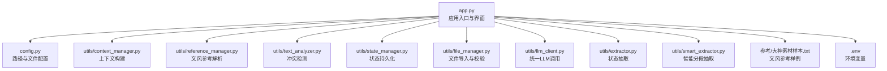
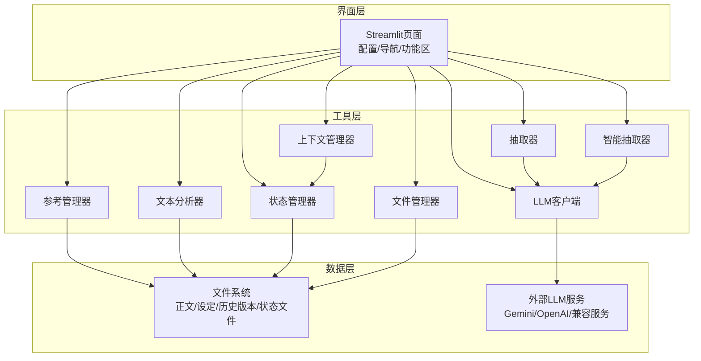
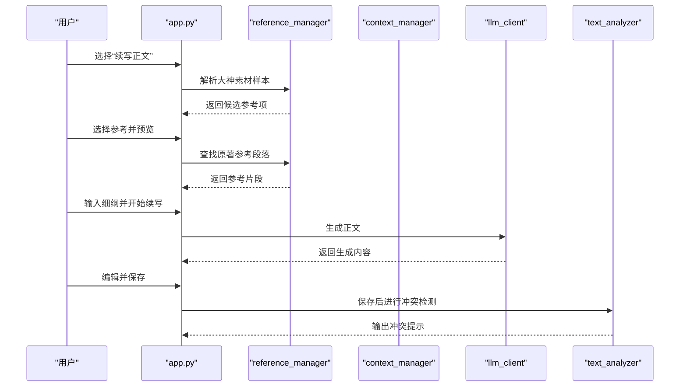
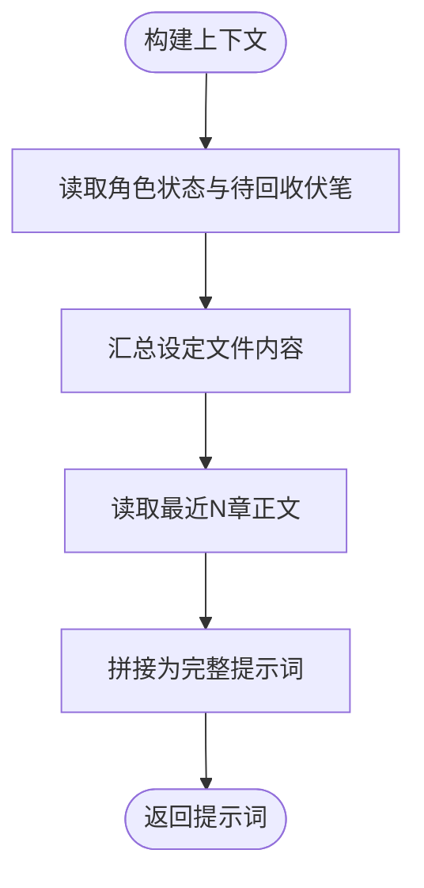
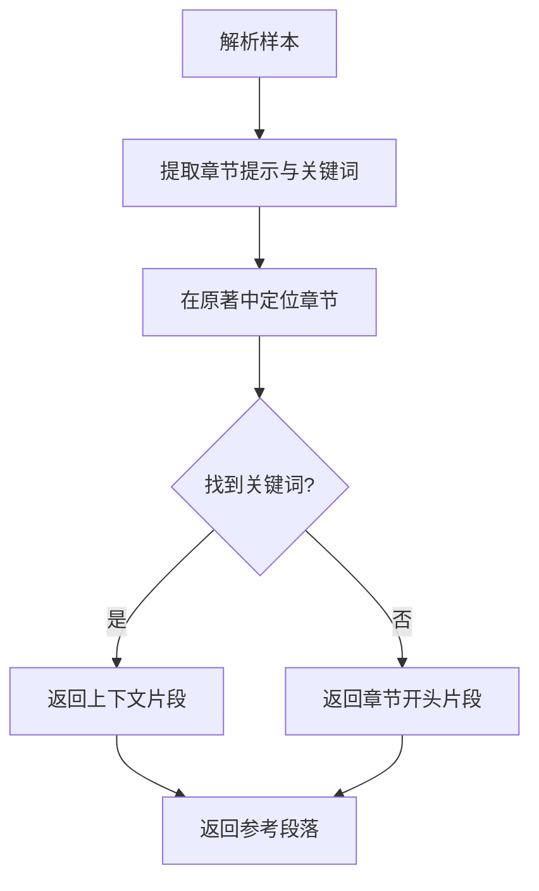
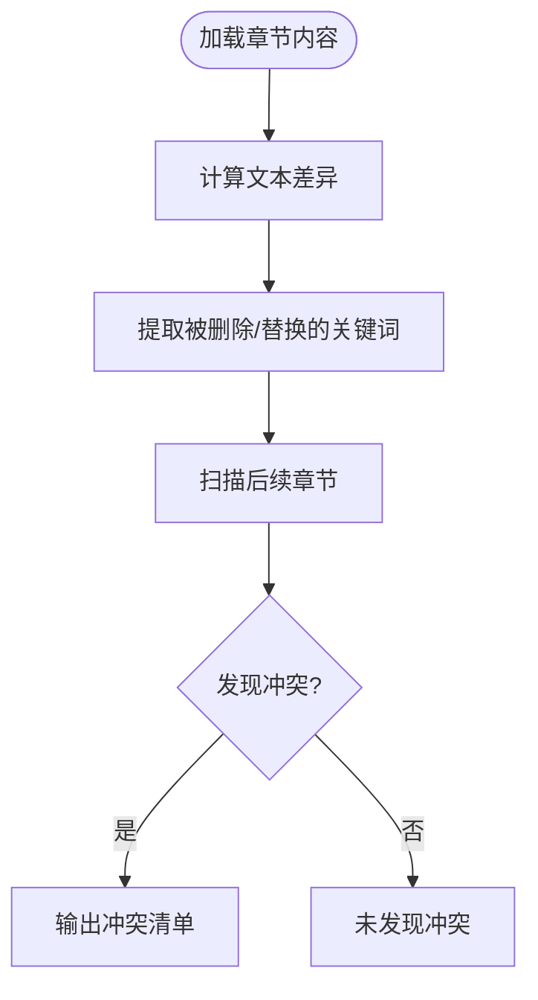
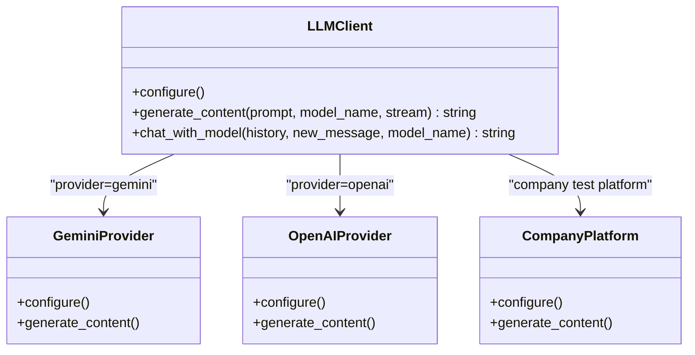
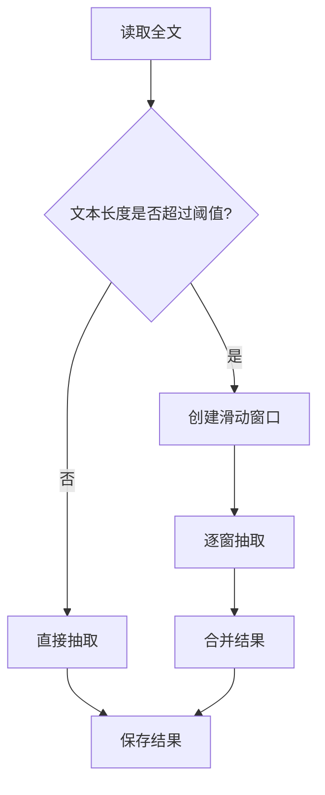
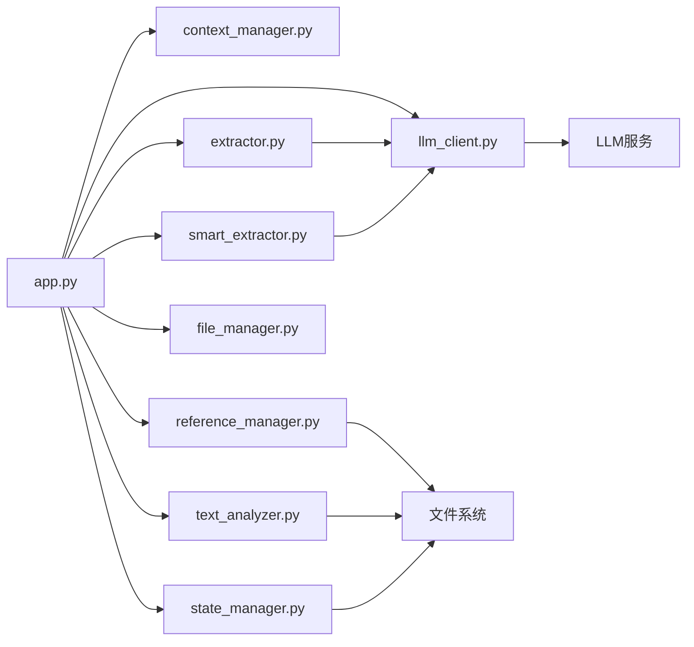

# 正文续写引擎

<cite>
**本文引用的文件**
- [app.py](file://app.py)
- [config.py](file://config.py)
- [utils/context_manager.py](file://utils/context_manager.py)
- [utils/reference_manager.py](file://utils/reference_manager.py)
- [utils/text_analyzer.py](file://utils/text_analyzer.py)
- [utils/state_manager.py](file://utils/state_manager.py)
- [utils/file_manager.py](file://utils/file_manager.py)
- [utils/llm_client.py](file://utils/llm_client.py)
- [utils/extractor.py](file://utils/extractor.py)
- [utils/smart_extractor.py](file://utils/smart_extractor.py)
- [参考/大神素材样本.txt](file://参考/大神素材样本.txt)
- [.env](file://.env)
</cite>

## 目录
1. [简介](#简介)
2. [项目结构](#项目结构)
3. [核心组件](#核心组件)
4. [架构总览](#架构总览)
5. [详细组件分析](#详细组件分析)
6. [依赖关系分析](#依赖关系分析)
7. [性能考量](#性能考量)
8. [故障排查指南](#故障排查指南)
9. [结论](#结论)
10. [附录](#附录)

## 简介
本项目是一个面向网络小说创作的“正文续写引擎”，围绕“文风参考驱动”的续写机制，提供从大神素材样本解析、参考段落检索、续写提示词构建，到生成内容编辑与保存的完整工作流。系统通过多提供商大模型适配、上下文构建、状态管理与冲突检测，帮助作者在保持文风一致性的前提下高效产出高质量正文。

## 项目结构
项目采用模块化设计，入口为 Streamlit 应用，核心逻辑分布在 utils 子模块中，配合配置文件与资源目录，形成清晰的功能边界：
- 应用入口与界面：app.py
- 配置与路径：config.py
- 工具模块：llm_client、context_manager、reference_manager、text_analyzer、state_manager、file_manager、extractor、smart_extractor
- 资源与样例：.env、参考/大神素材样本.txt、我的正文.txt（示例）

图表来源
- [app.py](file://app.py#L1-L719)
- [config.py](file://config.py#L1-L24)
- [utils/context_manager.py](file://utils/context_manager.py#L1-L93)
- [utils/reference_manager.py](file://utils/reference_manager.py#L1-L94)
- [utils/text_analyzer.py](file://utils/text_analyzer.py#L1-L63)
- [utils/state_manager.py](file://utils/state_manager.py#L1-L77)
- [utils/file_manager.py](file://utils/file_manager.py#L1-L108)
- [utils/llm_client.py](file://utils/llm_client.py#L1-L203)
- [utils/extractor.py](file://utils/extractor.py#L1-L194)
- [utils/smart_extractor.py](file://utils/smart_extractor.py#L1-L313)
- [参考/大神素材样本.txt](file://参考/大神素材样本.txt#L1-L614)
- [.env](file://.env#L1-L22)

章节来源
- [app.py](file://app.py#L1-L719)
- [config.py](file://config.py#L1-L24)

## 核心组件
- 应用入口与界面：负责提供配置面板、功能切换、资源状态监控、正文续写、改文与冲突检测等交互。
- LLM 客户端：统一适配 Gemini 与 OpenAI 兼容服务，支持重试、超时与公司测试平台特例。
- 上下文管理器：整合角色状态、待回收伏笔、设定与最近章节内容，构建续写/细纲讨论的上下文提示。
- 参考管理器：解析“大神素材样本”，定位原著中的参考段落，支持预览与匹配。
- 文本分析器：基于 difflib 的差异检测与后续章节扫描，辅助冲突提示。
- 状态管理器：提供角色状态与伏笔列表的读写与快照，支撑创作状态追踪。
- 文件管理器：负责目录创建、正文导入（单文件拆分）、资源状态检查。
- 抽取器：从全文中抽取角色状态、伏笔、设定与剧情回顾，支持标准与智能分段两种模式。

章节来源
- [app.py](file://app.py#L310-L719)
- [utils/llm_client.py](file://utils/llm_client.py#L1-L203)
- [utils/context_manager.py](file://utils/context_manager.py#L43-L92)
- [utils/reference_manager.py](file://utils/reference_manager.py#L5-L94)
- [utils/text_analyzer.py](file://utils/text_analyzer.py#L7-L63)
- [utils/state_manager.py](file://utils/state_manager.py#L21-L77)
- [utils/file_manager.py](file://utils/file_manager.py#L7-L108)
- [utils/extractor.py](file://utils/extractor.py#L6-L194)
- [utils/smart_extractor.py](file://utils/smart_extractor.py#L5-L313)

## 架构总览
系统采用“界面层-工具层-数据层”的分层架构：
- 界面层：Streamlit 页面与交互控件，负责用户输入与结果展示。
- 工具层：各工具模块封装业务逻辑，如上下文构建、参考解析、状态管理、LLM 调用等。
- 数据层：本地文件系统（正文、设定、历史版本、状态文件）与外部 LLM 服务。

图表来源
- [app.py](file://app.py#L1-L719)
- [utils/context_manager.py](file://utils/context_manager.py#L1-L93)
- [utils/reference_manager.py](file://utils/reference_manager.py#L1-L94)
- [utils/text_analyzer.py](file://utils/text_analyzer.py#L1-L63)
- [utils/state_manager.py](file://utils/state_manager.py#L1-L77)
- [utils/file_manager.py](file://utils/file_manager.py#L1-L108)
- [utils/llm_client.py](file://utils/llm_client.py#L1-L203)
- [utils/extractor.py](file://utils/extractor.py#L1-L194)
- [utils/smart_extractor.py](file://utils/smart_extractor.py#L1-L313)

## 详细组件分析

### 续写流程与文风参考机制
- 文风参考解析：解析“大神素材样本.txt”，提取“出自哪一章”与“搜索关键词”，生成候选参考项。
- 参考段落匹配：根据章节提示与关键词在原著中定位段落，返回上下文片段供预览与选择。
- 续写提示词构建：将“细纲”与“文风参考”组合为提示词，调用 LLM 生成正文。
- 生成内容编辑与保存：支持在线编辑与保存到正文目录，建议保存后进行冲突检测与状态更新。

图表来源
- [app.py](file://app.py#L546-L626)
- [utils/reference_manager.py](file://utils/reference_manager.py#L5-L94)
- [utils/context_manager.py](file://utils/context_manager.py#L43-L92)
- [utils/llm_client.py](file://utils/llm_client.py#L30-L142)
- [utils/text_analyzer.py](file://utils/text_analyzer.py#L39-L63)

章节来源
- [app.py](file://app.py#L546-L626)
- [utils/reference_manager.py](file://utils/reference_manager.py#L5-L94)
- [utils/context_manager.py](file://utils/context_manager.py#L43-L92)
- [utils/llm_client.py](file://utils/llm_client.py#L30-L142)
- [utils/text_analyzer.py](file://utils/text_analyzer.py#L39-L63)

### 上下文构建与提示词策略
- 上下文组成：角色状态（JSON）、待回收伏笔（JSON）、相关设定（文本集合）、最近N章正文（拼接）。
- 任务提示：在末尾明确写出当前任务（如“探讨细纲”中的具体问题）。
- 优点：保证生成内容与已有设定、角色状态、剧情脉络一致，减少前后矛盾。

图表来源
- [utils/context_manager.py](file://utils/context_manager.py#L43-L92)

章节来源
- [utils/context_manager.py](file://utils/context_manager.py#L43-L92)

### 文风模仿算法与参考匹配
- 参考样本解析：从“大神素材样本.txt”中提取“出自哪一章”与“搜索关键词”，形成候选参考。
- 原著段落定位：在原著文件中按章节提示与关键词定位，返回上下文片段（限定范围，避免全量扫描）。
- 文风模仿：将参考片段作为“文风参考”注入续写提示词，引导模型模仿节奏、用词与叙事风格。

图表来源
- [utils/reference_manager.py](file://utils/reference_manager.py#L5-L94)

章节来源
- [utils/reference_manager.py](file://utils/reference_manager.py#L5-L94)

### 生成内容编辑与保存机制
- 编辑界面：使用文本域展示生成内容，允许用户直接编辑。
- 保存策略：将编辑后的内容写入正文目录，文件名为用户输入的章节标题（自动补“.txt”）。
- 建议流程：保存后建议进行冲突检测与状态更新，确保后续章节一致性。

章节来源
- [app.py](file://app.py#L608-L626)

### 冲突检测与状态更新
- 冲突检测：基于 difflib 对比旧/新文本，提取被删除/替换的片段，扫描后续章节是否存在相同关键词。
- 状态更新：提供“AI分析本章伏笔与状态更新”的接口，提示以 JSON 形式返回新增/回收伏笔与角色状态变更，便于后续集成。

图表来源
- [utils/text_analyzer.py](file://utils/text_analyzer.py#L7-L63)
- [app.py](file://app.py#L628-L719)

章节来源
- [utils/text_analyzer.py](file://utils/text_analyzer.py#L7-L63)
- [app.py](file://app.py#L628-L719)

### LLM 客户端与多提供商适配
- 适配方案：统一 generate_content/chat_with_model 接口，自动根据环境变量选择提供商（Gemini/OpenAI 兼容/公司测试平台）。
- 重试与超时：内置重试与较长超时，提升稳定性。
- 公司测试平台特例：动态构造端点与请求头，支持流式与非流式两种模式。

图表来源
- [utils/llm_client.py](file://utils/llm_client.py#L9-L142)

章节来源
- [utils/llm_client.py](file://utils/llm_client.py#L9-L142)

### 状态管理与历史版本
- 角色状态与伏笔：以 JSON 文件形式存储，支持读取、更新与快照。
- 历史版本：保存到“历史版本”目录，命名包含章节名与时间戳，便于回溯。

章节来源
- [utils/state_manager.py](file://utils/state_manager.py#L21-L77)
- [config.py](file://config.py#L18-L24)

### 全量状态抽取与智能分段
- 标准抽取：一次性将全文送入 LLM，返回角色状态、伏笔、设定与剧情回顾。
- 智能分段：按窗口大小与重叠度滑动分段，分别抽取后再合并，提升长文本处理的准确性与稳定性。

图表来源
- [utils/extractor.py](file://utils/extractor.py#L6-L194)
- [utils/smart_extractor.py](file://utils/smart_extractor.py#L5-L313)

章节来源
- [utils/extractor.py](file://utils/extractor.py#L6-L194)
- [utils/smart_extractor.py](file://utils/smart_extractor.py#L5-L313)

## 依赖关系分析
- 模块耦合：app.py 作为协调者，依赖各工具模块；工具模块之间低耦合，职责清晰。
- 外部依赖：LLM 服务（Gemini/OpenAI 兼容/公司平台）、文件系统。
- 潜在风险：参考段落定位依赖原著格式与关键词稳定性；抽取器对 LLM 输出的 JSON 解析依赖提示词严格性。

图表来源
- [app.py](file://app.py#L1-L719)
- [utils/context_manager.py](file://utils/context_manager.py#L1-L93)
- [utils/reference_manager.py](file://utils/reference_manager.py#L1-L94)
- [utils/text_analyzer.py](file://utils/text_analyzer.py#L1-L63)
- [utils/state_manager.py](file://utils/state_manager.py#L1-L77)
- [utils/file_manager.py](file://utils/file_manager.py#L1-L108)
- [utils/llm_client.py](file://utils/llm_client.py#L1-L203)
- [utils/extractor.py](file://utils/extractor.py#L1-L194)
- [utils/smart_extractor.py](file://utils/smart_extractor.py#L1-L313)

## 性能考量
- LLM 调用：统一重试与较长超时，减少失败率；公司平台支持流式响应，改善交互体验。
- 文本处理：智能分段抽取避免一次性发送超长文本，降低 Token 消耗与失败概率。
- 文件 IO：批量保存章节时尽量减少重复读写；冲突检测扫描后续章节时可考虑缓存章节内容以提升效率。

## 故障排查指南
- API 配置错误：检查 .env 中的提供商、Base URL、API Key 设置是否正确；确保环境变量生效。
- 参考段落未找到：确认“大神素材样本.txt”格式与原著文件命名/章节提示一致；关键词需在原著中可检索。
- 生成内容异常：检查提示词是否包含细纲与文风参考；必要时调整模型参数或更换模型。
- 冲突检测无效：确认删除/替换的关键词足够明显；后续章节扫描基于关键词匹配，需保证关键词唯一性与稳定性。

章节来源
- [.env](file://.env#L1-L22)
- [utils/llm_client.py](file://utils/llm_client.py#L144-L203)
- [utils/reference_manager.py](file://utils/reference_manager.py#L49-L94)
- [utils/text_analyzer.py](file://utils/text_analyzer.py#L39-L63)

## 结论
本引擎通过“文风参考驱动”的续写机制，结合上下文构建、状态管理与冲突检测，为网络小说创作提供了从素材解析到正文产出的闭环工具链。建议在实际使用中：
- 选择高质量的文风参考样本，确保关键词与章节提示准确；
- 优化续写提示词，明确细纲与文风要求；
- 保存后及时进行冲突检测与状态更新，维持故事一致性；
- 根据文本规模选择智能分段抽取，平衡准确性与成本。

## 附录
- 使用指南
  - 初始化：创建目录结构、生成空白状态文件、导入正文（单文件拆分）。
  - 探讨设定：与 AI 对话完善设定，支持多类型设定保存。
  - 探讨细纲：构建上下文，与 AI 讨论剧情走向，保存当前细纲。
  - 续写正文：选择文风参考，输入细纲，生成正文并编辑保存。
  - 改文与冲突提示：编辑章节，保存后进行冲突检测，建议更新状态文件。
- 最佳实践
  - 文风参考：优先选择与目标场景相似的段落，关键词尽量具体。
  - 提示词：明确细纲与文风参考，限制生成长度，避免歧义。
  - 状态维护：定期更新角色状态与伏笔，保存历史版本快照。