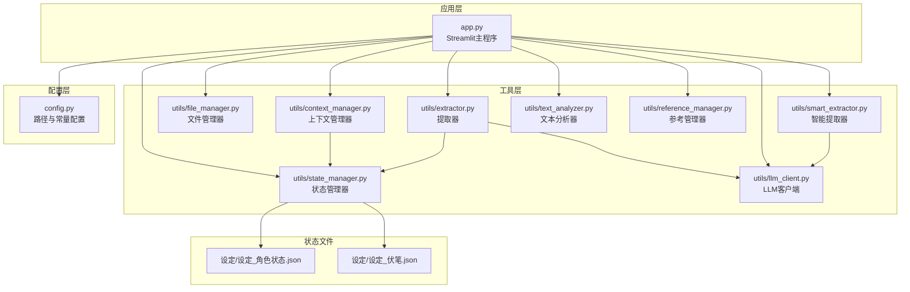
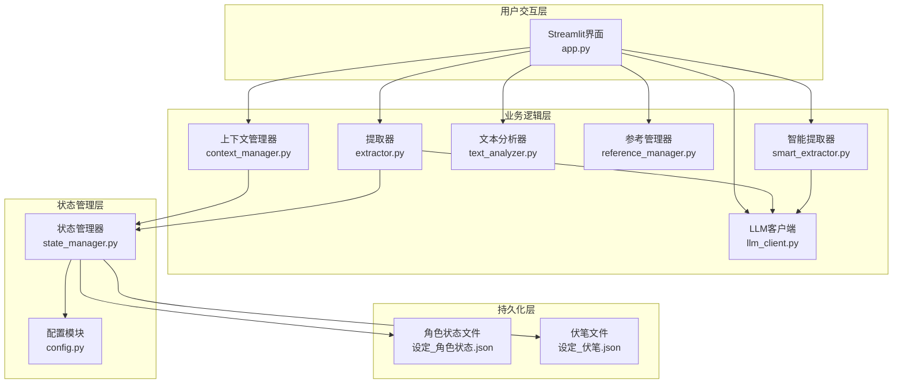
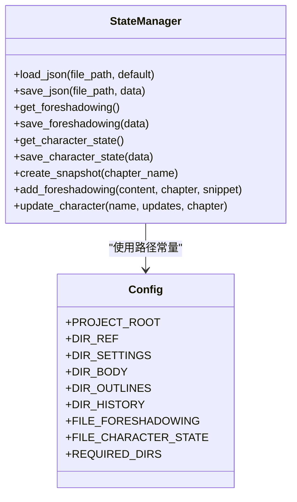
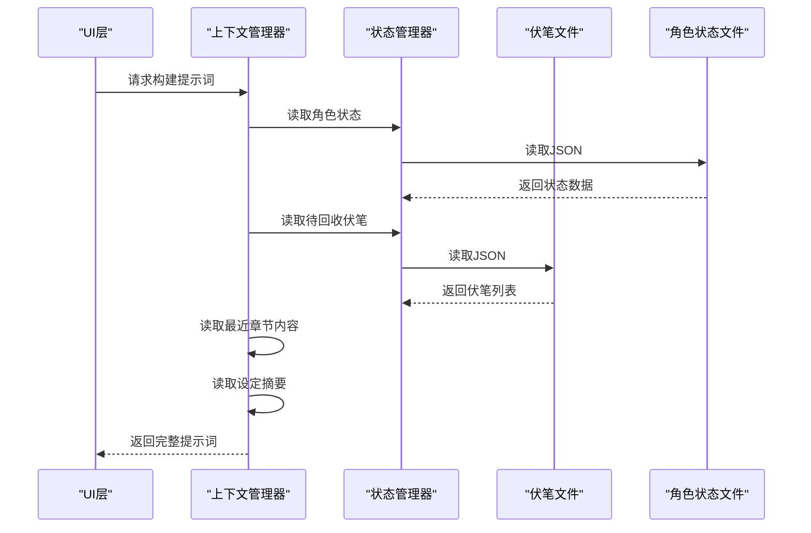
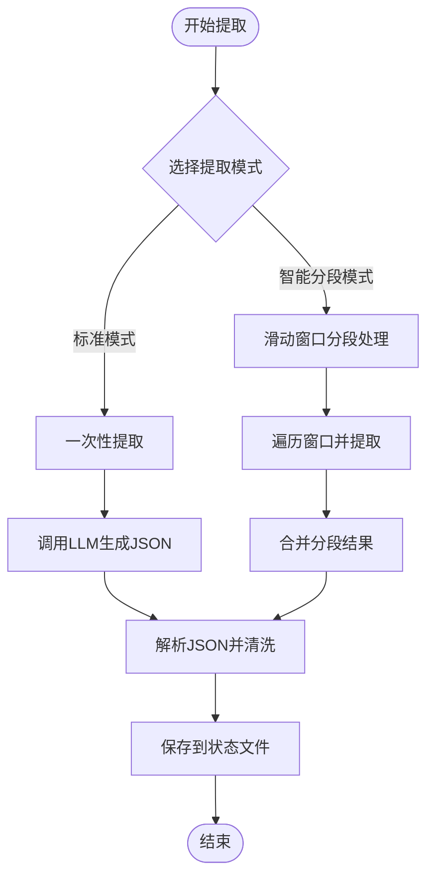
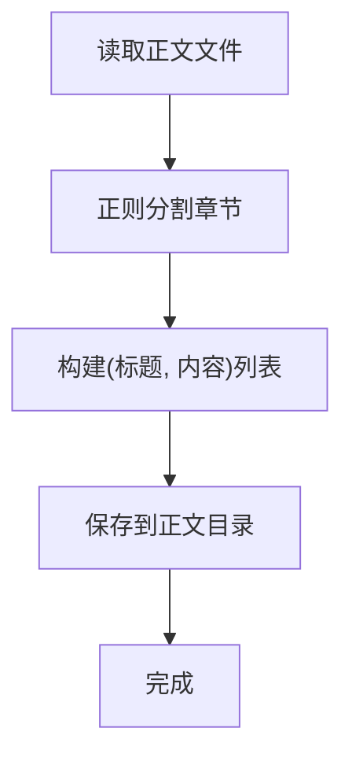
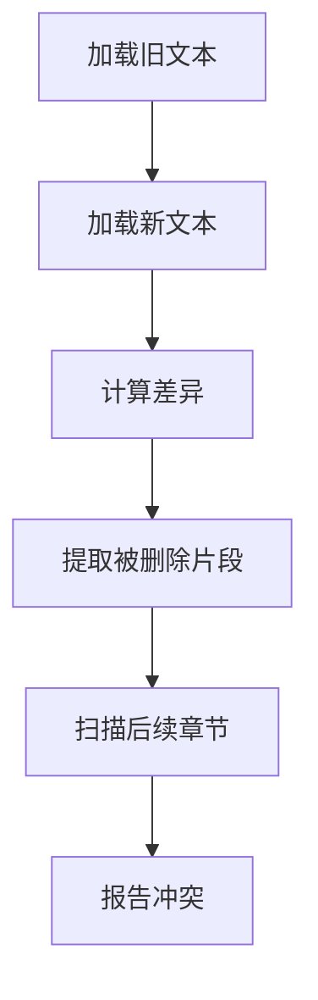
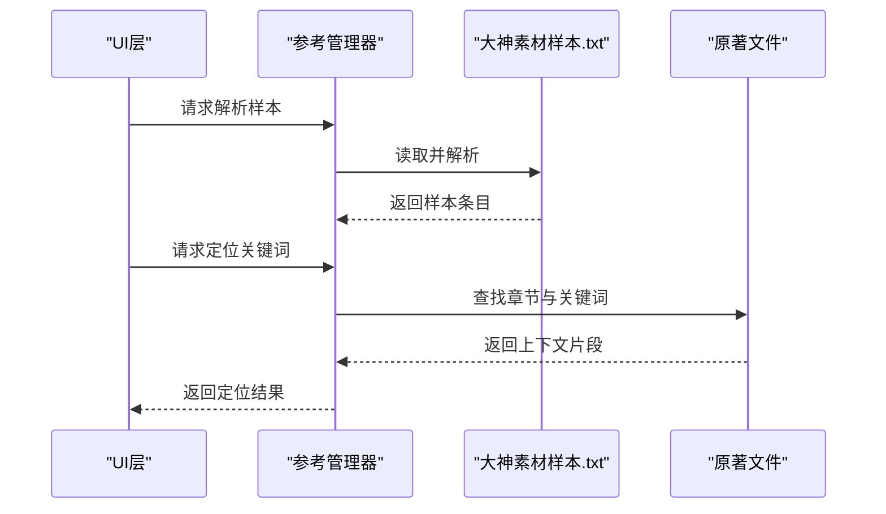
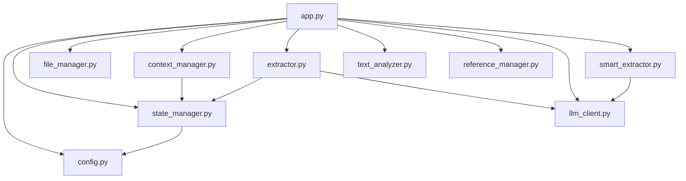

# 状态管理系统

<cite>
**本文档引用的文件**
- [config.py](file://config.py)
- [app.py](file://app.py)
- [utils/state_manager.py](file://utils/state_manager.py)
- [utils/file_manager.py](file://utils/file_manager.py)
- [utils/context_manager.py](file://utils/context_manager.py)
- [utils/extractor.py](file://utils/extractor.py)
- [utils/text_analyzer.py](file://utils/text_analyzer.py)
- [utils/reference_manager.py](file://utils/reference_manager.py)
- [utils/llm_client.py](file://utils/llm_client.py)
- [utils/smart_extractor.py](file://utils/smart_extractor.py)
- [设定/设定_角色状态.json](file://设定/设定_角色状态.json)
- [设定/设定_伏笔.json](file://设定/设定_伏笔.json)
</cite>

## 目录
1. [简介](#简介)
2. [项目结构](#项目结构)
3. [核心组件](#核心组件)
4. [架构总览](#架构总览)
5. [详细组件分析](#详细组件分析)
6. [依赖关系分析](#依赖关系分析)
7. [性能考虑](#性能考虑)
8. [故障排除指南](#故障排除指南)
9. [结论](#结论)
10. [附录](#附录)

## 简介
本系统是一个面向网络小说创作的状态管理系统，围绕JSON格式的状态存储机制构建，重点实现以下功能：
- 角色状态管理：以键值对形式维护角色的属性、装备、能力等信息，并记录最后更新章节与时间戳。
- 伏笔列表跟踪：以数组形式维护待回收的伏笔项，包含唯一标识、创建章节、状态、原始文本片段等字段。
- 状态文件结构设计：分别使用设定_角色状态.json和设定_伏笔.json两个独立的JSON文件进行持久化存储。
- 状态更新机制：提供添加伏笔、更新角色状态的接口，并自动记录时间戳与章节信息。
- 历史版本控制：支持将当前状态文件复制到历史版本目录，形成带时间戳的快照文件。
- 状态快照创建：在章节保存或分析后，可创建包含角色状态与伏笔的快照，便于回溯与对比。

该系统通过Streamlit界面提供可视化操作入口，结合LLM客户端与文本分析工具，实现从正文到状态数据的自动化提取与更新。

## 项目结构
项目采用模块化的Python包结构，核心状态管理逻辑集中在utils子模块中，配置文件统一管理路径与常量，状态文件位于设定目录。

图表来源
- [app.py](file://app.py#L1-L719)
- [config.py](file://config.py#L1-L24)
- [utils/state_manager.py](file://utils/state_manager.py#L1-L77)
- [utils/file_manager.py](file://utils/file_manager.py#L1-L108)
- [utils/context_manager.py](file://utils/context_manager.py#L1-L93)
- [utils/extractor.py](file://utils/extractor.py#L1-L194)
- [utils/text_analyzer.py](file://utils/text_analyzer.py#L1-L63)
- [utils/reference_manager.py](file://utils/reference_manager.py#L1-L94)
- [utils/llm_client.py](file://utils/llm_client.py#L1-L203)
- [utils/smart_extractor.py](file://utils/smart_extractor.py#L1-L37)
- [设定/设定_角色状态.json](file://设定/设定_角色状态.json#L1-L1)
- [设定/设定_伏笔.json](file://设定/设定_伏笔.json#L1-L1)

章节来源
- [config.py](file://config.py#L1-L24)
- [app.py](file://app.py#L1-L719)

## 核心组件
本节概述状态管理系统的核心组件及其职责：
- 配置模块：集中定义项目根目录、各子目录路径、关键文件路径与必需目录集合。
- 状态管理器：负责JSON文件的读取、写入、状态更新与历史快照创建。
- 文件管理器：负责章节解析、文件保存与资源状态检查。
- 上下文管理器：负责构建LLM提示词，整合角色状态、伏笔、设定与最近章节内容。
- 提取器与智能提取器：基于LLM从正文提取角色状态、伏笔、设定与剧情回顾，并保存到对应文件。
- 文本分析器：比较章节前后差异，扫描后续章节中的冲突关键词。
- 参考管理器：解析大神素材样本，定位关键词所在段落。
- LLM客户端：统一管理不同提供商的API配置与调用。

章节来源
- [config.py](file://config.py#L1-L24)
- [utils/state_manager.py](file://utils/state_manager.py#L1-L77)
- [utils/file_manager.py](file://utils/file_manager.py#L1-L108)
- [utils/context_manager.py](file://utils/context_manager.py#L1-L93)
- [utils/extractor.py](file://utils/extractor.py#L1-L194)
- [utils/text_analyzer.py](file://utils/text_analyzer.py#L1-L63)
- [utils/reference_manager.py](file://utils/reference_manager.py#L1-L94)
- [utils/llm_client.py](file://utils/llm_client.py#L1-L203)
- [utils/smart_extractor.py](file://utils/smart_extractor.py#L1-L37)

## 架构总览
系统采用分层架构，应用层通过Streamlit提供交互界面，工具层封装业务逻辑，状态文件作为持久化存储。LLM客户端贯穿提取与分析流程，文本分析器辅助冲突检测。

图表来源
- [app.py](file://app.py#L1-L719)
- [utils/context_manager.py](file://utils/context_manager.py#L1-L93)
- [utils/extractor.py](file://utils/extractor.py#L1-L194)
- [utils/text_analyzer.py](file://utils/text_analyzer.py#L1-L63)
- [utils/reference_manager.py](file://utils/reference_manager.py#L1-L94)
- [utils/llm_client.py](file://utils/llm_client.py#L1-L203)
- [utils/smart_extractor.py](file://utils/smart_extractor.py#L1-L37)
- [utils/state_manager.py](file://utils/state_manager.py#L1-L77)
- [config.py](file://config.py#L1-L24)
- [设定/设定_角色状态.json](file://设定/设定_角色状态.json#L1-L1)
- [设定/设定_伏笔.json](file://设定/设定_伏笔.json#L1-L1)

## 详细组件分析

### 状态管理器（JSON状态存储与历史快照）
状态管理器是系统的核心，负责：
- JSON文件读取与写入：提供通用的load_json与save_json方法，确保UTF-8编码与缩进格式。
- 伏笔管理：提供获取与保存伏笔列表的方法；新增伏笔时自动分配UUID、记录创建章节、状态、时间戳与原始文本片段。
- 角色状态管理：提供获取与保存角色状态的方法；更新角色状态时自动合并传入的更新字段，并记录最后更新章节与时间戳。
- 历史快照：将当前的伏笔与角色状态文件复制到历史版本目录，命名包含章节名与时间戳，便于版本对比与回溯。

图表来源
- [utils/state_manager.py](file://utils/state_manager.py#L1-L77)
- [config.py](file://config.py#L1-L24)

章节来源
- [utils/state_manager.py](file://utils/state_manager.py#L1-L77)
- [config.py](file://config.py#L1-L24)

### 上下文管理器（提示词构建与状态整合）
上下文管理器负责：
- 章节排序与最近章节内容读取：根据文件名中的数字进行排序，读取最近N章内容作为上下文。
- 设定摘要读取：遍历设定目录下的所有txt文件，汇总为提示词的一部分。
- 提示词构建：将角色状态、待回收伏笔、设定摘要与最近剧情回顾整合为完整的提示词，供LLM生成使用。

图表来源
- [utils/context_manager.py](file://utils/context_manager.py#L1-L93)
- [utils/state_manager.py](file://utils/state_manager.py#L1-L77)
- [设定/设定_角色状态.json](file://设定/设定_角色状态.json#L1-L1)
- [设定/设定_伏笔.json](file://设定/设定_伏笔.json#L1-L1)

章节来源
- [utils/context_manager.py](file://utils/context_manager.py#L1-L93)

### 提取器与智能提取器（从正文提取状态数据）
提取器与智能提取器负责：
- 标准提取：一次性将全文送入LLM，返回包含角色状态、伏笔、设定与剧情回顾的JSON结构。
- 智能分段提取：对超长文本进行滑动窗口分段处理，保持上下文连续性，再合并各段结果。
- 结果保存：将提取到的角色状态、伏笔列表、设定与剧情回顾分别保存到对应文件。

图表来源
- [utils/extractor.py](file://utils/extractor.py#L1-L194)
- [utils/smart_extractor.py](file://utils/smart_extractor.py#L1-L37)
- [utils/llm_client.py](file://utils/llm_client.py#L1-L203)

章节来源
- [utils/extractor.py](file://utils/extractor.py#L1-L194)
- [utils/smart_extractor.py](file://utils/smart_extractor.py#L1-L37)
- [utils/llm_client.py](file://utils/llm_client.py#L1-L203)

### 文件管理器（章节解析与保存）
文件管理器负责：
- 章节解析：通过正则表达式匹配章节标题格式，将正文拆分为多个章节。
- 章节保存：将解析后的章节保存到正文目录，文件名为章节标题。
- 资源状态检查：检查关键文件是否存在，便于初始化与导入流程。

图表来源
- [utils/file_manager.py](file://utils/file_manager.py#L1-L108)

章节来源
- [utils/file_manager.py](file://utils/file_manager.py#L1-L108)

### 文本分析器（冲突检测）
文本分析器负责：
- 文本差异计算：使用序列相似度算法比较旧文本与新文本，识别被删除或替换的片段。
- 后续章节扫描：在后续章节中查找被删除的关键字，报告潜在冲突。

图表来源
- [utils/text_analyzer.py](file://utils/text_analyzer.py#L1-L63)

章节来源
- [utils/text_analyzer.py](file://utils/text_analyzer.py#L1-L63)

### 参考管理器（大神素材样本解析与定位）
参考管理器负责：
- 样本解析：从大神素材样本文件中提取章节提示与关键词。
- 原著定位：在原著文件中定位关键词所在段落，返回上下文片段供参考。

图表来源
- [utils/reference_manager.py](file://utils/reference_manager.py#L1-L94)

章节来源
- [utils/reference_manager.py](file://utils/reference_manager.py#L1-L94)

## 依赖关系分析
系统各模块之间的依赖关系清晰，状态管理器与配置模块耦合度低，通过常量路径进行解耦；提取器与智能提取器依赖LLM客户端；上下文管理器依赖状态管理器；文本分析器与参考管理器相对独立。

图表来源
- [app.py](file://app.py#L1-L719)
- [config.py](file://config.py#L1-L24)
- [utils/state_manager.py](file://utils/state_manager.py#L1-L77)
- [utils/file_manager.py](file://utils/file_manager.py#L1-L108)
- [utils/context_manager.py](file://utils/context_manager.py#L1-L93)
- [utils/extractor.py](file://utils/extractor.py#L1-L194)
- [utils/text_analyzer.py](file://utils/text_analyzer.py#L1-L63)
- [utils/reference_manager.py](file://utils/reference_manager.py#L1-L94)
- [utils/llm_client.py](file://utils/llm_client.py#L1-L203)
- [utils/smart_extractor.py](file://utils/smart_extractor.py#L1-L37)

章节来源
- [app.py](file://app.py#L1-L719)
- [config.py](file://config.py#L1-L24)

## 性能考虑
- JSON读写：使用UTF-8编码与缩进格式，保证可读性与跨平台兼容性。
- 历史快照：复制现有状态文件到历史目录，避免频繁写入导致的I/O压力。
- 提取模式：智能分段模式通过滑动窗口减少上下文丢失，提高提取准确性。
- LLM调用：统一的LLM客户端封装不同提供商的API，支持重试与超时控制，提升稳定性。

## 故障排除指南
- API配置问题：检查环境变量是否正确设置，LLM提供商与模型名称是否匹配。
- 文件路径问题：确认配置模块中的路径常量与实际目录一致，必要时使用目录创建功能修复。
- JSON解析异常：检查状态文件格式是否正确，避免包含非法字符或Markdown标记。
- 提取失败：查看LLM返回内容是否包含JSON结构，必要时清理多余标记并重试。

章节来源
- [utils/llm_client.py](file://utils/llm_client.py#L1-L203)
- [utils/extractor.py](file://utils/extractor.py#L1-L194)
- [config.py](file://config.py#L1-L24)

## 结论
本状态管理系统通过清晰的模块划分与稳定的JSON存储机制，实现了角色状态与伏笔的全生命周期管理。结合LLM驱动的提取与分析能力，系统能够自动化地从正文生成状态数据，并通过历史快照与冲突检测保障创作过程的连贯性与一致性。建议在实际使用中：
- 定期创建历史快照，保留关键节点的状态文件。
- 在章节保存后及时更新角色状态与伏笔，确保数据时效性。
- 使用冲突检测功能避免后续章节出现逻辑矛盾。

## 附录

### 状态文件结构说明
- 设定_角色状态.json
  - 结构：对象（键为角色名，值为包含状态、装备、能力等字段的对象）
  - 用途：记录角色的当前状态、位置、伤势、装备与已知能力等信息
  - 更新策略：通过更新接口合并传入的更新字段，并记录最后更新章节与时间戳

- 设定_伏笔.json
  - 结构：数组（元素为包含内容、创建章节、状态、原始文本片段等字段的对象）
  - 用途：记录待回收的伏笔项，支持唯一标识、创建时间与章节追踪
  - 更新策略：通过添加接口自动分配UUID、记录创建章节与时间戳

章节来源
- [utils/state_manager.py](file://utils/state_manager.py#L1-L77)
- [设定/设定_角色状态.json](file://设定/设定_角色状态.json#L1-L1)
- [设定/设定_伏笔.json](file://设定/设定_伏笔.json#L1-L1)