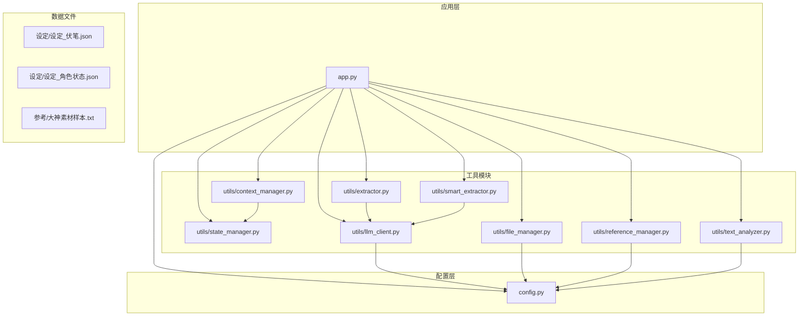
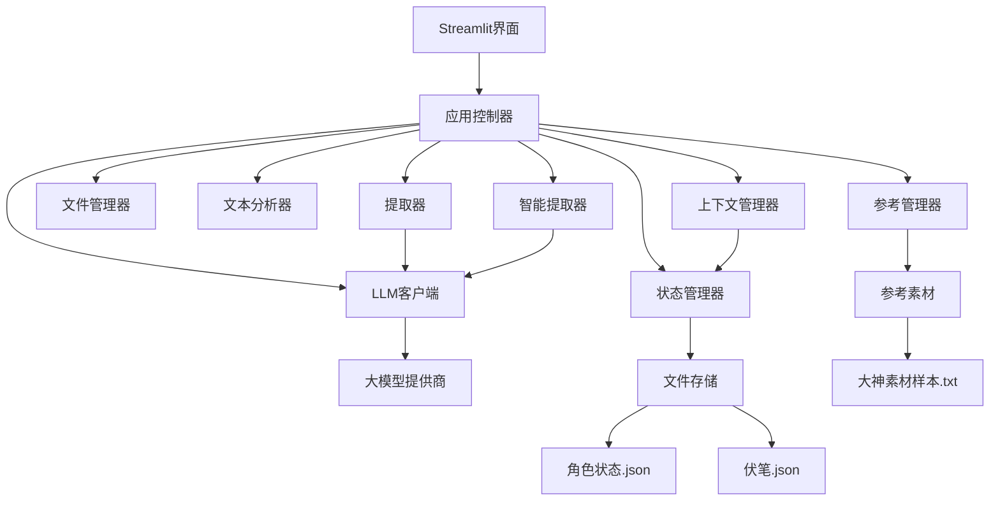
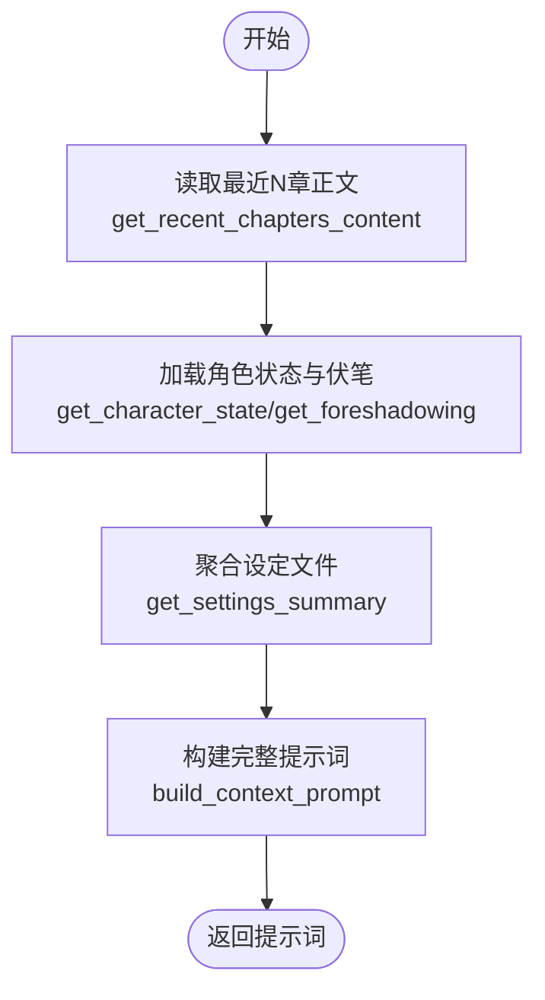
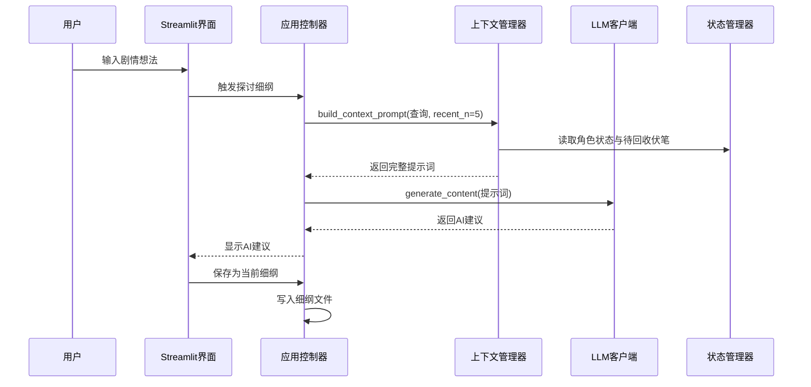
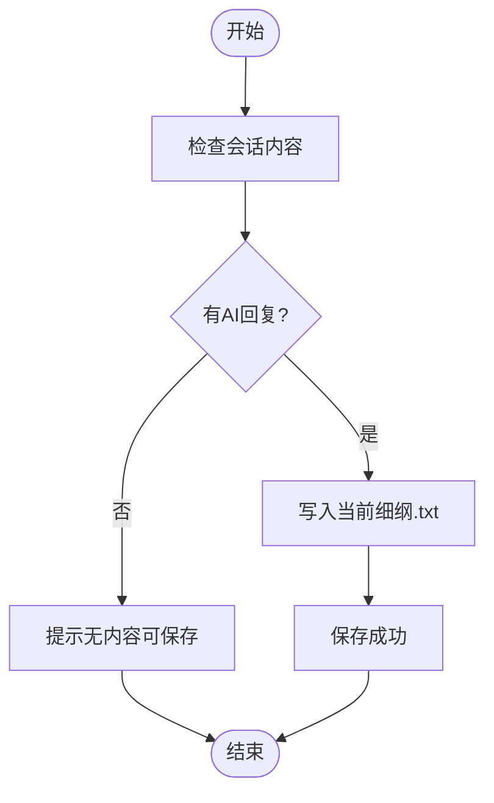
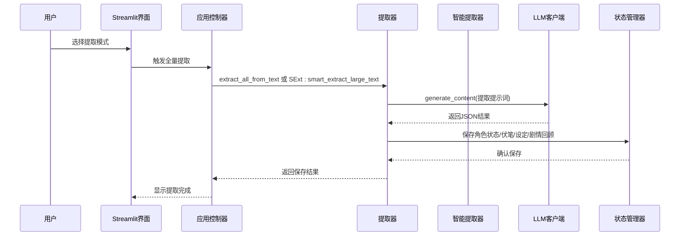
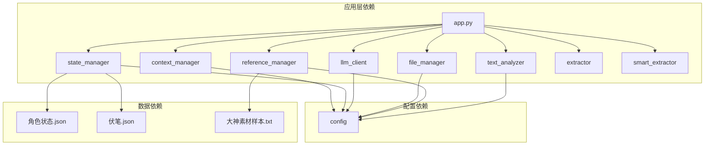

# 细纲规划系统

<cite>
**本文档引用的文件**
- [app.py](file://app.py)
- [config.py](file://config.py)
- [utils/context_manager.py](file://utils/context_manager.py)
- [utils/state_manager.py](file://utils/state_manager.py)
- [utils/llm_client.py](file://utils/llm_client.py)
- [utils/file_manager.py](file://utils/file_manager.py)
- [utils/text_analyzer.py](file://utils/text_analyzer.py)
- [utils/reference_manager.py](file://utils/reference_manager.py)
- [utils/extractor.py](file://utils/extractor.py)
- [utils/smart_extractor.py](file://utils/smart_extractor.py)
- [设定/设定_伏笔.json](file://设定/设定_伏笔.json)
- [设定/设定_角色状态.json](file://设定/设定_角色状态.json)
- [参考/大神素材样本.txt](file://参考/大神素材样本.txt)
</cite>

## 目录
1. [简介](#简介)
2. [项目结构](#项目结构)
3. [核心组件](#核心组件)
4. [架构总览](#架构总览)
5. [详细组件分析](#详细组件分析)
6. [依赖关系分析](#依赖关系分析)
7. [性能考虑](#性能考虑)
8. [故障排除指南](#故障排除指南)
9. [结论](#结论)
10. [附录](#附录)

## 简介
本系统是一个基于上下文感知的智能细纲规划工具，旨在帮助创作者自动整合最近5章正文、角色状态、伏笔信息及相关设定，构建完整的创作上下文。系统通过统一的LLM客户端对接多家大模型服务商，实现AI驱动的剧情规划与细纲保存，支持从初始化、设定探讨、细纲讨论到正文续写与冲突检测的全流程创作工作流。

## 项目结构
项目采用模块化设计，核心逻辑集中在应用入口与工具模块中，配置集中管理，数据文件按功能分类存放。

**图表来源**
- [app.py](file://app.py#L1-L719)
- [config.py](file://config.py#L1-L24)
- [utils/context_manager.py](file://utils/context_manager.py#L1-L93)
- [utils/state_manager.py](file://utils/state_manager.py#L1-L77)
- [utils/llm_client.py](file://utils/llm_client.py#L1-L203)
- [utils/file_manager.py](file://utils/file_manager.py#L1-L108)
- [utils/text_analyzer.py](file://utils/text_analyzer.py#L1-L63)
- [utils/reference_manager.py](file://utils/reference_manager.py#L1-L94)
- [utils/extractor.py](file://utils/extractor.py#L1-L194)
- [utils/smart_extractor.py](file://utils/smart_extractor.py#L1-L313)

**章节来源**
- [app.py](file://app.py#L1-L719)
- [config.py](file://config.py#L1-L24)

## 核心组件
- 应用入口与界面：提供API配置、功能导航、资源状态监控与四大功能模块（初始化、探讨设定、探讨细纲、续写正文、改文与冲突提示）。
- 上下文管理器：负责读取最近N章正文、聚合设定文件、构建完整的LLM提示词。
- 状态管理器：维护角色状态与伏笔列表的JSON文件，支持快照与更新。
- LLM客户端：统一适配Gemini与OpenAI兼容服务，支持重试与流式处理。
- 文件管理器：创建目录结构、解析正文章节、检查资源状态。
- 文本分析器：计算文本差异、扫描后续章节中的冲突关键词。
- 参考管理器：解析大神素材样本，定位原著片段。
- 提取器：从全文提取角色状态、伏笔、设定与剧情回顾，支持标准与智能分段两种模式。

**章节来源**
- [app.py](file://app.py#L310-L719)
- [utils/context_manager.py](file://utils/context_manager.py#L43-L93)
- [utils/state_manager.py](file://utils/state_manager.py#L21-L77)
- [utils/llm_client.py](file://utils/llm_client.py#L29-L142)
- [utils/file_manager.py](file://utils/file_manager.py#L7-L108)
- [utils/text_analyzer.py](file://utils/text_analyzer.py#L7-L63)
- [utils/reference_manager.py](file://utils/reference_manager.py#L5-L94)
- [utils/extractor.py](file://utils/extractor.py#L6-L194)
- [utils/smart_extractor.py](file://utils/smart_extractor.py#L5-L313)

## 架构总览
系统采用分层架构，UI层通过Streamlit提供交互，业务逻辑封装在工具模块中，数据持久化通过JSON文件实现，LLM调用通过统一客户端抽象。

**图表来源**
- [app.py](file://app.py#L21-L287)
- [utils/context_manager.py](file://utils/context_manager.py#L43-L93)
- [utils/state_manager.py](file://utils/state_manager.py#L21-L77)
- [utils/llm_client.py](file://utils/llm_client.py#L29-L142)
- [utils/extractor.py](file://utils/extractor.py#L6-L194)
- [utils/smart_extractor.py](file://utils/smart_extractor.py#L5-L313)

## 详细组件分析

### 上下文构建算法
系统通过上下文管理器将多源信息整合为统一提示词，算法流程如下：

**图表来源**
- [utils/context_manager.py](file://utils/context_manager.py#L22-L93)
- [utils/state_manager.py](file://utils/state_manager.py#L21-L31)

**章节来源**
- [utils/context_manager.py](file://utils/context_manager.py#L43-L93)
- [utils/state_manager.py](file://utils/state_manager.py#L21-L31)

### AI剧情规划流程
探讨细纲功能的完整流程如下：

**图表来源**
- [app.py](file://app.py#L506-L544)
- [utils/context_manager.py](file://utils/context_manager.py#L43-L93)
- [utils/llm_client.py](file://utils/llm_client.py#L29-L142)

**章节来源**
- [app.py](file://app.py#L506-L544)
- [utils/context_manager.py](file://utils/context_manager.py#L43-L93)
- [utils/llm_client.py](file://utils/llm_client.py#L29-L142)

### 细纲保存机制
系统提供两种细纲保存方式：
- 实时保存：在探讨细纲界面，将最后一次AI回复直接保存为当前细纲文件
- 手动保存：在续写正文界面，将用户编辑的细纲保存到指定文件

保存流程：

**图表来源**
- [app.py](file://app.py#L538-L544)

**章节来源**
- [app.py](file://app.py#L538-L544)

### 全量状态提取（AI）
系统支持从完整正文提取角色状态、伏笔列表、设定与剧情回顾：

**图表来源**
- [app.py](file://app.py#L342-L410)
- [utils/extractor.py](file://utils/extractor.py#L6-L194)
- [utils/smart_extractor.py](file://utils/smart_extractor.py#L5-L313)
- [utils/llm_client.py](file://utils/llm_client.py#L29-L142)

**章节来源**
- [app.py](file://app.py#L342-L410)
- [utils/extractor.py](file://utils/extractor.py#L6-L194)
- [utils/smart_extractor.py](file://utils/smart_extractor.py#L5-L313)
- [utils/llm_client.py](file://utils/llm_client.py#L29-L142)

### 文风参考与续写
续写正文功能支持文风参考：
- 解析大神素材样本，提取章节提示与关键词
- 在原著中定位参考片段，提供文风借鉴
- 将细纲与参考片段组合生成续写提示词

**章节来源**
- [app.py](file://app.py#L546-L626)
- [utils/reference_manager.py](file://utils/reference_manager.py#L5-L94)

### 冲突检测与状态更新
改文与冲突提示功能：
- 编辑章节内容，保存并检测文本差异
- 扫描后续章节中是否存在被删除/修改的关键词
- 提供AI分析建议，指导手动更新状态文件

**章节来源**
- [app.py](file://app.py#L628-L719)
- [utils/text_analyzer.py](file://utils/text_analyzer.py#L7-L63)

## 依赖关系分析

**图表来源**
- [app.py](file://app.py#L11-L12)
- [utils/context_manager.py](file://utils/context_manager.py#L1-L5)
- [utils/state_manager.py](file://utils/state_manager.py#L1-L6)
- [utils/llm_client.py](file://utils/llm_client.py#L1-L5)
- [utils/file_manager.py](file://utils/file_manager.py#L1-L5)
- [utils/text_analyzer.py](file://utils/text_analyzer.py#L1-L5)
- [utils/reference_manager.py](file://utils/reference_manager.py#L1-L3)
- [utils/extractor.py](file://utils/extractor.py#L1-L4)
- [utils/smart_extractor.py](file://utils/smart_extractor.py#L1-L3)

**章节来源**
- [app.py](file://app.py#L11-L12)
- [utils/context_manager.py](file://utils/context_manager.py#L1-L5)
- [utils/state_manager.py](file://utils/state_manager.py#L1-L6)
- [utils/llm_client.py](file://utils/llm_client.py#L1-L5)
- [utils/file_manager.py](file://utils/file_manager.py#L1-L5)
- [utils/text_analyzer.py](file://utils/text_analyzer.py#L1-L5)
- [utils/reference_manager.py](file://utils/reference_manager.py#L1-L3)
- [utils/extractor.py](file://utils/extractor.py#L1-L4)
- [utils/smart_extractor.py](file://utils/smart_extractor.py#L1-L3)

## 性能考虑
- 智能分段提取：针对长文本采用滑动窗口策略，平衡上下文完整性与Token消耗
- 窗口参数优化：根据文本长度自动选择最优窗口大小与重叠比例
- LLM调用重试：内置指数退避重试机制，提升API稳定性
- 流式处理：支持流式响应，改善用户体验
- 文件I/O优化：批量读取章节文件，减少磁盘访问次数

## 故障排除指南
- API配置问题：检查环境变量LLM_PROVIDER、OPENAI_API_KEY、GOOGLE_API_KEY
- 文件缺失：使用初始化功能创建必要目录与空状态文件
- 提取失败：调整窗口参数，检查网络连接与模型可用性
- 文本冲突：使用冲突检测功能扫描后续章节，及时修正不一致内容

**章节来源**
- [app.py](file://app.py#L310-L410)
- [utils/llm_client.py](file://utils/llm_client.py#L29-L142)
- [utils/text_analyzer.py](file://utils/text_analyzer.py#L39-L63)

## 结论
本细纲规划系统通过模块化设计实现了从上下文构建到AI规划再到细纲保存的完整工作流。系统具备良好的扩展性与稳定性，能够有效辅助创作者进行智能化的剧情规划与内容创作。

## 附录

### 使用案例
1. **输入剧情想法获得细纲建议**
   - 在探讨细纲界面输入"下一场战斗怎么打"
   - 系统自动整合最近5章正文、角色状态、伏笔与设定
   - AI生成针对性的剧情建议
   - 保存为当前细纲文件

2. **全量状态提取**
   - 选择标准模式或智能分段模式
   - 设置窗口大小与重叠比例
   - AI分析全文提取角色状态、伏笔、设定与剧情回顾
   - 自动生成相关文件

3. **文风参考续写**
   - 选择大神素材样本
   - 预览参考片段
   - 结合细纲生成续写内容
   - 保存章节文件

**章节来源**
- [app.py](file://app.py#L506-L626)
- [utils/reference_manager.py](file://utils/reference_manager.py#L5-L94)
- [utils/extractor.py](file://utils/extractor.py#L145-L194)