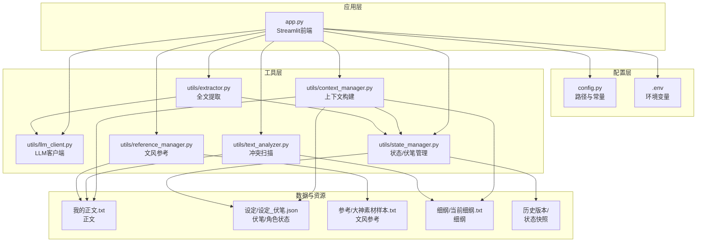
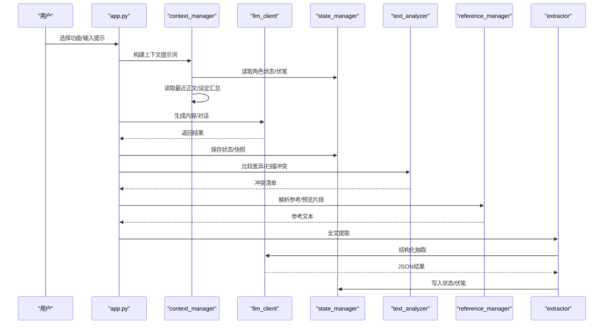
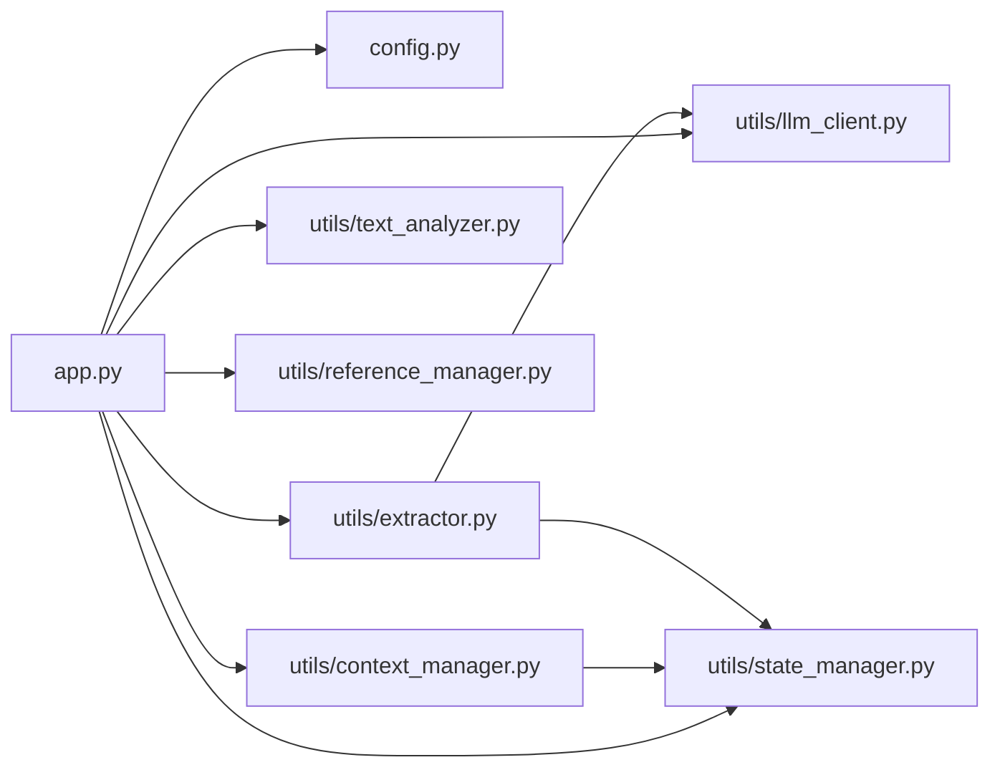

# 项目介绍

<cite>
**本文引用的文件**
- [app.py](file://app.py)
- [config.py](file://config.py)
- [requirements.txt](file://requirements.txt)
- [.env](file://.env)
- [utils/context_manager.py](file://utils/context_manager.py)
- [utils/state_manager.py](file://utils/state_manager.py)
- [utils/llm_client.py](file://utils/llm_client.py)
- [utils/text_analyzer.py](file://utils/text_analyzer.py)
- [utils/reference_manager.py](file://utils/reference_manager.py)
- [utils/extractor.py](file://utils/extractor.py)
- [参考/大神素材样本.txt](file://参考/大神素材样本.txt)
- [设定/设定_伏笔.json](file://设定/设定_伏笔.json)
- [我的正文.txt](file://我的正文.txt)
</cite>

## 目录
1. [简介](#简介)
2. [项目结构](#项目结构)
3. [核心组件](#核心组件)
4. [架构总览](#架构总览)
5. [详细组件分析](#详细组件分析)
6. [依赖关系分析](#依赖关系分析)
7. [性能与可用性考量](#性能与可用性考量)
8. [故障排查指南](#故障排查指南)
9. [结论](#结论)
10. [附录](#附录)

## 简介
镇妖狱创作引擎是一个面向网络小说创作的智能辅助系统，旨在通过“AI驱动的智能创作 + 多维度内容管理 + 冲突检测机制”的一体化方案，帮助创作者在“创作效率、内容质量、创作流程标准化”三个层面实现显著提升。系统围绕“正文续写、细纲探讨、设定深化、冲突检测、状态与伏笔管理”五大核心场景，提供从“灵感触发、结构梳理、文风参考、AI生成、冲突扫描、状态更新”到“历史快照”的闭环工作流，既适合初学者快速上手，也为资深作者提供专业、可扩展的创作支撑。

## 项目结构
项目采用“应用入口 + 配置 + 工具模块 + 数据与资源”的分层组织方式：
- 应用入口：Streamlit前端应用，统一承载配置、导航、功能切换与交互。
- 配置模块：集中管理项目根目录、关键目录与文件路径，确保各模块对资源定位一致。
- 工具模块：封装LLM客户端、上下文构建、状态管理、文本分析、参考解析、批量提取等能力。
- 数据与资源：正文、设定、细纲、历史版本、参考素材等数据文件与样例。

图表来源
- [app.py](file://app.py#L1-L690)
- [config.py](file://config.py#L1-L24)
- [utils/context_manager.py](file://utils/context_manager.py#L1-L93)
- [utils/state_manager.py](file://utils/state_manager.py#L1-L77)
- [utils/llm_client.py](file://utils/llm_client.py#L1-L192)
- [utils/text_analyzer.py](file://utils/text_analyzer.py#L1-L63)
- [utils/reference_manager.py](file://utils/reference_manager.py#L1-L94)
- [utils/extractor.py](file://utils/extractor.py#L1-L106)

章节来源
- [app.py](file://app.py#L1-L690)
- [config.py](file://config.py#L1-L24)

## 核心组件
- Streamlit前端应用：提供“配置与导航”“功能选择”“资源状态监控”等界面，串联各功能模块。
- LLM客户端：统一适配Gemini与OpenAI兼容服务，支持重试、超时、错误日志与多平台适配。
- 上下文构建器：整合“最近正文、角色状态、待回收伏笔、设定汇总、任务查询”构建高质量提示词。
- 状态与伏笔管理：提供角色状态、伏笔列表的读取、保存、新增、更新与历史快照。
- 文本分析器：基于差异算法与关键词扫描，检测修改项并提示后续章节潜在冲突。
- 参考解析器：解析“大神素材样本”，提供文风参考段落检索与预览。
- 全文提取器：调用LLM对全文进行结构化抽取，产出角色状态、伏笔、设定总结与剧情回顾。

章节来源
- [app.py](file://app.py#L1-L690)
- [utils/llm_client.py](file://utils/llm_client.py#L1-L192)
- [utils/context_manager.py](file://utils/context_manager.py#L1-L93)
- [utils/state_manager.py](file://utils/state_manager.py#L1-L77)
- [utils/text_analyzer.py](file://utils/text_analyzer.py#L1-L63)
- [utils/reference_manager.py](file://utils/reference_manager.py#L1-L94)
- [utils/extractor.py](file://utils/extractor.py#L1-L106)

## 架构总览
系统采用“前端交互 + 工具模块 + 数据持久化”的分层架构。前端负责用户交互与状态管理，工具模块负责业务逻辑与外部服务集成，数据层负责正文、设定、状态、历史版本等文件化存储。上下文构建器将多源信息整合为提示词，LLM客户端负责生成内容，状态管理器负责维护创作状态，文本分析器负责冲突检测，参考解析器负责文风参考，全文提取器负责一次性结构化抽取。

图表来源
- [app.py](file://app.py#L1-L690)
- [utils/context_manager.py](file://utils/context_manager.py#L43-L92)
- [utils/llm_client.py](file://utils/llm_client.py#L29-L131)
- [utils/state_manager.py](file://utils/state_manager.py#L21-L76)
- [utils/text_analyzer.py](file://utils/text_analyzer.py#L39-L62)
- [utils/reference_manager.py](file://utils/reference_manager.py#L49-L93)
- [utils/extractor.py](file://utils/extractor.py#L6-L55)

## 详细组件分析

### 组件A：Streamlit前端应用（app.py）
- 功能定位：统一入口，提供“配置与导航”“功能选择”“资源状态监控”，并承载四大核心功能页面。
- 关键特性：
  - 多提供商API配置：Gemini、NewAPI、SiliconFlow、公司内部测试平台、OpenAI兼容服务。
  - 会话状态管理：维护“讨论设定/细纲”的消息历史、当前章节内容、参考文本等。
  - 资源状态监控：检查正文、参考原著、大神素材样本是否存在。
  - 四大功能页面：
    - 初始化：创建目录结构、初始化状态文件、导入正文、全量提取。
    - 探讨设定：智能分类与保存，支持多类型设定。
    - 探讨细纲：自动构建上下文，结合角色状态、伏笔、设定与最近正文。
    - 续写正文：文风参考、细纲驱动、生成与保存。
    - 改文与冲突提示：冲突检测、状态与伏笔更新建议。
- 用户价值：
  - 初学者：一键配置API、自动资源检查、可视化操作，降低上手成本。
  - 专家作者：细纲与正文联动、冲突检测、状态快照，保障创作一致性与可追溯性。

章节来源
- [app.py](file://app.py#L1-L690)

### 组件B：LLM客户端（utils/llm_client.py）
- 功能定位：统一LLM调用接口，适配Gemini与OpenAI兼容服务，支持重试、超时与错误日志。
- 关键特性：
  - 供应商切换：根据环境变量动态选择Gemini或OpenAI兼容服务。
  - 公司测试平台适配：针对特定端点与鉴权格式进行动态构造与请求。
  - 重试与超时：内置重试策略与较长超时，提升稳定性。
  - 错误日志：打印详细错误信息与堆栈，便于调试。
- 用户价值：在不同服务间无缝切换，保证生成质量与稳定性。

章节来源
- [utils/llm_client.py](file://utils/llm_client.py#L1-L192)

### 组件C：上下文构建器（utils/context_manager.py）
- 功能定位：将“角色状态、待回收伏笔、设定汇总、最近正文”整合为高质量提示词。
- 关键特性：
  - 章节排序：按章节编号排序，确保上下文顺序正确。
  - 状态读取：读取角色状态与待回收伏笔，过滤活跃伏笔。
  - 设定汇总：聚合所有设定文件内容。
  - 上下文拼装：将状态、设定、最近正文与任务查询拼接为完整提示词。
- 用户价值：确保AI生成内容与当前创作状态一致，减少重复劳动。

章节来源
- [utils/context_manager.py](file://utils/context_manager.py#L1-L93)

### 组件D：状态与伏笔管理（utils/state_manager.py）
- 功能定位：提供角色状态与伏笔列表的读取、保存、新增、更新与历史快照。
- 关键特性：
  - JSON读写：封装load/save，异常安全。
  - 伏笔管理：新增时自动分配ID、记录创建时间与章节来源。
  - 角色状态：按角色名更新字段，记录最后更新章节与时间。
  - 历史快照：将当前状态复制到历史目录，命名包含章节与时间戳。
- 用户价值：结构化管理创作状态，支持回溯与对比。

章节来源
- [utils/state_manager.py](file://utils/state_manager.py#L1-L77)

### 组件E：文本分析器（utils/text_analyzer.py）
- 功能定位：基于差异算法与关键词扫描，检测修改项并提示后续章节潜在冲突。
- 关键特性：
  - 文本差异：使用序列匹配算法，提取被删除/替换的片段。
  - 冲突扫描：在后续章节中扫描被删除关键词，返回冲突清单。
- 用户价值：在改文时及时发现前后文矛盾，避免逻辑漏洞。

章节来源
- [utils/text_analyzer.py](file://utils/text_analyzer.py#L1-L63)

### 组件F：参考解析器（utils/reference_manager.py）
- 功能定位：解析“大神素材样本”，提供文风参考段落检索与预览。
- 关键特性：
  - 样本解析：从样本文件中提取“章节提示+关键词”条目。
  - 原著检索：在原著文件中定位章节与关键词，返回上下文片段。
- 用户价值：为续写提供文风参考，提升风格一致性。

章节来源
- [utils/reference_manager.py](file://utils/reference_manager.py#L1-L94)

### 组件G：全文提取器（utils/extractor.py）
- 功能定位：调用LLM对全文进行结构化抽取，产出角色状态、伏笔、设定总结与剧情回顾。
- 关键特性：
  - 结构化提示：明确要求返回JSON结构，避免格式偏差。
  - 结果清洗：去除控制字符与代码块标记，确保可解析。
  - 结果落盘：分别写入角色状态、伏笔列表、设定总结、剧情回顾。
- 用户价值：一键完成状态与设定的全量提取，节省手工整理成本。

章节来源
- [utils/extractor.py](file://utils/extractor.py#L1-L106)

## 依赖关系分析
- 模块耦合：
  - app.py依赖config.py、utils/*，形成“入口-配置-工具”的清晰依赖。
  - utils/context_manager.py依赖utils/state_manager.py与config.py，用于读取状态与路径。
  - utils/llm_client.py独立性强，通过环境变量与外部服务交互。
  - utils/text_analyzer.py与utils/reference_manager.py与正文/样本文件耦合。
  - utils/extractor.py依赖utils/llm_client.py与utils/state_manager.py。
- 外部依赖：
  - Streamlit、google-generativeai、python-dotenv、tenacity、openai。
- 潜在风险：
  - LLM调用失败或超时会影响生成流程。
  - 文件路径与权限问题可能导致状态读写失败。
  - 不同LLM提供商的API差异可能影响一致性。

图表来源
- [app.py](file://app.py#L1-L11)
- [utils/context_manager.py](file://utils/context_manager.py#L1-L4)
- [utils/extractor.py](file://utils/extractor.py#L1-L4)

章节来源
- [requirements.txt](file://requirements.txt#L1-L6)
- [app.py](file://app.py#L1-L11)

## 性能与可用性考量
- 生成性能：
  - LLM调用默认超时较长，适合复杂提示词；建议在提示词中明确“简洁、直接”的要求，减少Token消耗。
  - 对于公司测试平台，注意端点与鉴权格式，避免不必要的重试失败。
- 数据读写：
  - 状态与伏笔文件为JSON，读写频繁；建议定期备份，避免并发写入导致的数据损坏。
  - 历史快照按章节与时间命名，便于回溯。
- 用户体验：
  - Streamlit界面提供进度提示与状态反馈，建议在关键步骤添加“完成/失败”提示。
  - 文风参考与冲突检测建议在保存/提交后自动触发，减少人工干预。

[本节为通用指导，无需列出章节来源]

## 故障排查指南
- API配置问题：
  - 检查.env中LLM_PROVIDER、API Key与模型名称是否正确。
  - 不同提供商的Base URL与鉴权格式不同，确保与实际服务一致。
- 生成失败：
  - 查看终端输出的详细错误信息与堆栈，定位具体环节（提示词格式、模型名称、网络超时等）。
  - 尝试调整提示词长度与结构，减少复杂度。
- 文件读写失败：
  - 确认config.py中路径与实际目录一致，检查文件权限。
  - 若状态文件缺失，使用“初始化”功能创建默认文件。
- 冲突检测无效：
  - 确认修改项被正确识别（关键词或删除片段），并在后续章节中存在相同关键词。
  - 建议在保存后立即触发冲突扫描，避免遗漏。

章节来源
- [utils/llm_client.py](file://utils/llm_client.py#L89-L102)
- [app.py](file://app.py#L340-L380)

## 结论
镇妖狱创作引擎以“AI驱动 + 多维度内容管理 + 冲突检测”为核心，围绕创作全流程提供标准化与智能化支撑。通过清晰的功能划分与模块化设计，系统既能满足初学者的快速上手需求，也能为资深作者提供专业、可扩展的创作工具集。建议在团队协作中引入“状态快照”与“冲突检测”作为质量保障手段，持续迭代提示词与提取模板，进一步提升自动化水平与内容一致性。

[本节为总结性内容，无需列出章节来源]

## 附录
- 快速上手建议：
  - 在.env中配置首选LLM提供商与API Key。
  - 使用“初始化”功能创建目录与状态文件。
  - 在“探讨设定”中沉淀关键设定，形成可复用的知识库。
  - 使用“探讨细纲”构建剧情蓝图，再以“续写正文”生成章节。
  - 在“改文与冲突提示”中进行冲突扫描与状态更新。
- 示例数据：
  - 参考样例：参考/大神素材样本.txt
  - 正文样例：我的正文.txt
  - 伏笔样例：设定/设定_伏笔.json

章节来源
- [.env](file://.env#L1-L16)
- [参考/大神素材样本.txt](file://参考/大神素材样本.txt#L1-L614)
- [我的正文.txt](file://我的正文.txt#L1-L947)
- [设定/设定_伏笔.json](file://设定/设定_伏笔.json#L1-L23)