# 项目概述

<cite>
**本文档引用的文件**
- [app.py](file://app.py)
- [config.py](file://config.py)
- [requirements.txt](file://requirements.txt)
- [.env](file://.env)
- [utils/llm_client.py](file://utils/llm_client.py)
- [utils/state_manager.py](file://utils/state_manager.py)
- [utils/context_manager.py](file://utils/context_manager.py)
- [utils/reference_manager.py](file://utils/reference_manager.py)
- [utils/text_analyzer.py](file://utils/text_analyzer.py)
- [utils/file_manager.py](file://utils/file_manager.py)
- [utils/extractor.py](file://utils/extractor.py)
- [参考/大神素材样本.txt](file://参考/大神素材样本.txt)
- [我的正文.txt](file://我的正文.txt)
- [设定/设定_角色状态.json](file://设定/设定_角色状态.json)
- [设定/设定_伏笔.json](file://设定/设定_伏笔.json)
</cite>

## 目录
1. [简介](#简介)
2. [项目结构](#项目结构)
3. [核心组件](#核心组件)
4. [架构总览](#架构总览)
5. [详细组件分析](#详细组件分析)
6. [依赖关系分析](#依赖关系分析)
7. [性能考量](#性能考量)
8. [故障排查指南](#故障排查指南)
9. [结论](#结论)
10. [附录](#附录)

## 简介
“镇妖狱创作引擎 - 小说创作辅助系统”是一个面向网络小说作者的AI驱动创作平台，旨在提供从“智能设定探讨”“细纲规划”到“正文续写”的一体化创作流程。系统通过Streamlit构建直观易用的前端界面，结合多AI服务（Gemini、OpenAI兼容、SiliconFlow、公司内部测试平台等）与本地状态管理，实现：
- 设定与角色状态的结构化沉淀
- 基于上下文的细纲讨论
- 基于文风参考的正文续写
- 正文修改后的冲突检测与提示
- 全量状态提取与历史版本快照

项目定位独特：既满足初学者快速上手的可视化操作，也为有经验的创作者提供可扩展的AI集成与状态管理能力。

## 项目结构
项目采用“前端界面 + 工具模块 + 配置 + 数据文件”的分层组织方式：
- 前端入口：Streamlit应用入口文件负责页面布局、交互与工作流编排
- 工具模块：封装LLM客户端、状态管理、上下文构建、参考解析、文本分析、文件管理、全量提取等能力
- 配置与环境：集中管理目录路径、文件名、默认模型与API密钥来源
- 数据文件：正文、设定、细纲、历史版本等创作资产

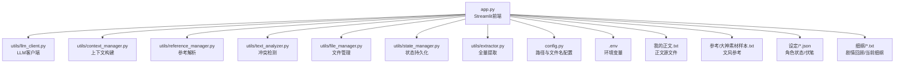

图表来源
- [app.py](file://app.py#L1-L690)
- [config.py](file://config.py#L1-L24)
- [utils/llm_client.py](file://utils/llm_client.py#L1-L135)
- [utils/context_manager.py](file://utils/context_manager.py#L1-L93)
- [utils/reference_manager.py](file://utils/reference_manager.py#L1-L94)
- [utils/text_analyzer.py](file://utils/text_analyzer.py#L1-L63)
- [utils/file_manager.py](file://utils/file_manager.py#L1-L108)
- [utils/state_manager.py](file://utils/state_manager.py#L1-L77)
- [utils/extractor.py](file://utils/extractor.py#L1-L106)

章节来源
- [app.py](file://app.py#L1-L690)
- [config.py](file://config.py#L1-L24)

## 核心组件
- Streamlit前端应用：提供API提供商选择、模型配置、四大功能模式（初始化、探讨设定、探讨细纲、续写正文、改文与冲突提示）与资源状态监控
- LLM客户端：统一适配Gemini与OpenAI兼容服务，内置重试与详细错误日志
- 上下文管理器：聚合角色状态、待回收伏笔、设定与最近章节内容，构建完整提示词
- 参考解析器：解析“大神素材样本”，抽取章节与关键词，支持在续写时引入文风参考
- 文本分析器：基于序列差异检测正文修改，扫描后续章节是否存在被删除内容的残留引用
- 文件管理器：确保目录结构、解析单文件正文为多章节、检查资源文件存在性
- 状态管理器：维护角色状态与伏笔列表，支持历史版本快照
- 全量提取器：调用LLM从全文中抽取角色状态、伏笔、设定与剧情回顾，并保存为文件

章节来源
- [app.py](file://app.py#L1-L690)
- [utils/llm_client.py](file://utils/llm_client.py#L1-L135)
- [utils/context_manager.py](file://utils/context_manager.py#L1-L93)
- [utils/reference_manager.py](file://utils/reference_manager.py#L1-L94)
- [utils/text_analyzer.py](file://utils/text_analyzer.py#L1-L63)
- [utils/file_manager.py](file://utils/file_manager.py#L1-L108)
- [utils/state_manager.py](file://utils/state_manager.py#L1-L77)
- [utils/extractor.py](file://utils/extractor.py#L1-L106)

## 架构总览
系统采用“前端-工具层-数据层”的分层架构：
- 前端层：Streamlit页面与交互逻辑，负责工作流编排与状态展示
- 工具层：各功能模块封装独立职责，通过统一的LLM客户端与状态管理器协作
- 数据层：本地文件系统承载正文、设定、细纲与历史版本，配合.env与config.py进行配置管理

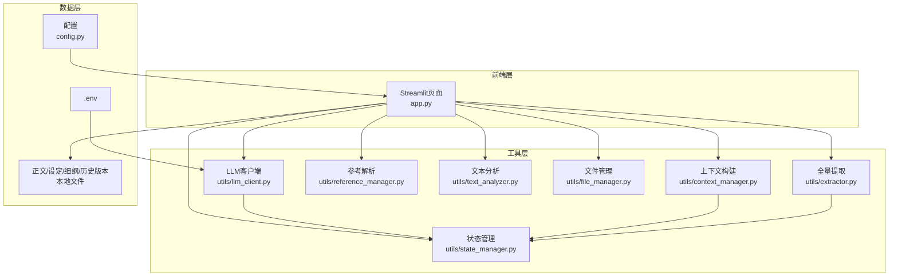

图表来源
- [app.py](file://app.py#L1-L690)
- [utils/llm_client.py](file://utils/llm_client.py#L1-L135)
- [utils/context_manager.py](file://utils/context_manager.py#L1-L93)
- [utils/reference_manager.py](file://utils/reference_manager.py#L1-L94)
- [utils/text_analyzer.py](file://utils/text_analyzer.py#L1-L63)
- [utils/file_manager.py](file://utils/file_manager.py#L1-L108)
- [utils/state_manager.py](file://utils/state_manager.py#L1-L77)
- [utils/extractor.py](file://utils/extractor.py#L1-L106)
- [config.py](file://config.py#L1-L24)

## 详细组件分析

### Streamlit前端应用（app.py）
- 页面配置与会话状态：设置页面标题、布局与侧边栏，初始化消息与当前章节内容等会话状态
- API提供商与模型配置：支持Gemini、NewAPI、SiliconFlow、OpenAI兼容与公司内部测试平台，动态渲染配置项并写入环境变量
- 功能模式：
  - 初始化：创建目录结构、生成空白状态文件、全量提取正文状态、导入单文件正文为多章节
  - 探讨设定：智能分类设定类型，支持多类型保存
  - 探讨细纲：自动加载最近N章正文、角色状态、伏笔与相关设定，构建上下文提示词
  - 续写正文：选择文风参考样本，基于细纲与参考文风生成正文，支持编辑与保存
  - 改文与冲突提示：对比修改前后正文，扫描后续章节潜在冲突，建议更新状态与创建快照

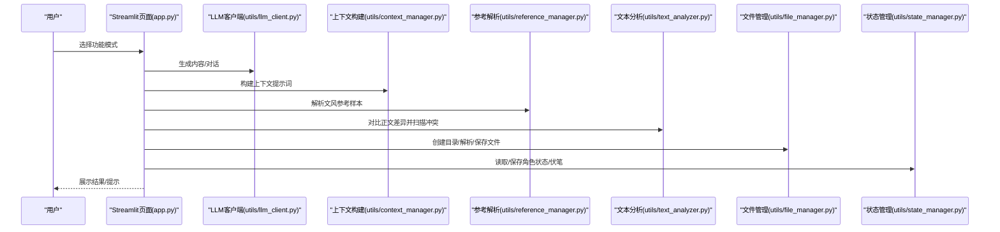

图表来源
- [app.py](file://app.py#L1-L690)
- [utils/llm_client.py](file://utils/llm_client.py#L1-L135)
- [utils/context_manager.py](file://utils/context_manager.py#L1-L93)
- [utils/reference_manager.py](file://utils/reference_manager.py#L1-L94)
- [utils/text_analyzer.py](file://utils/text_analyzer.py#L1-L63)
- [utils/file_manager.py](file://utils/file_manager.py#L1-L108)
- [utils/state_manager.py](file://utils/state_manager.py#L1-L77)

章节来源
- [app.py](file://app.py#L1-L690)

### LLM客户端（utils/llm_client.py）
- 统一配置：根据环境变量选择Gemini或OpenAI兼容提供商，校验API密钥
- 生成接口：支持一次性生成与对话式调用，内置重试策略
- 错误处理：打印详细错误信息与堆栈，便于调试

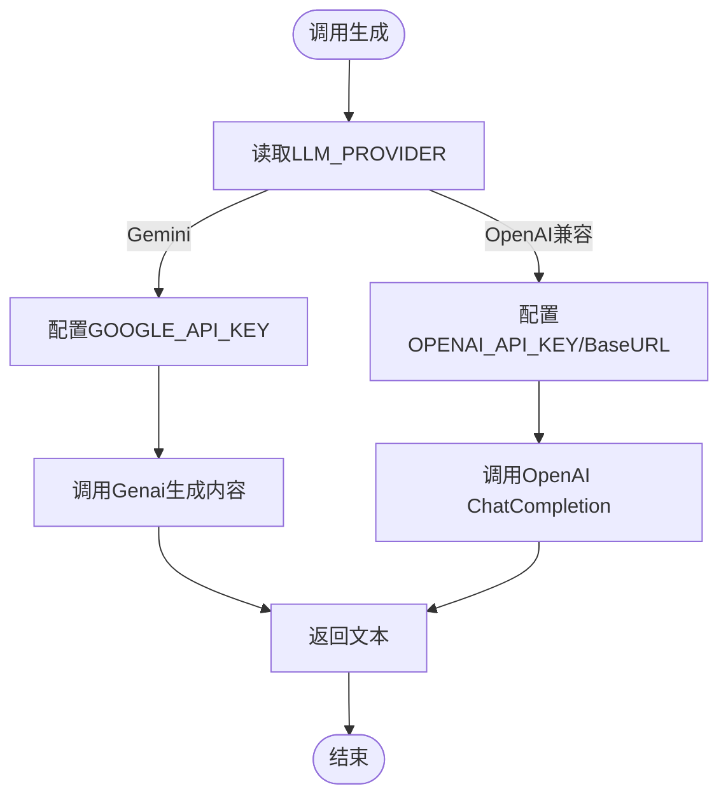

图表来源
- [utils/llm_client.py](file://utils/llm_client.py#L1-L135)

章节来源
- [utils/llm_client.py](file://utils/llm_client.py#L1-L135)

### 上下文管理器（utils/context_manager.py）
- 章节排序与内容拼接：按章节编号排序，拼接最近N章正文
- 设定汇总：读取所有“设定_*.txt”文件内容
- 提示词构建：整合角色状态、待回收伏笔、设定与最近上下文，形成完整提示词

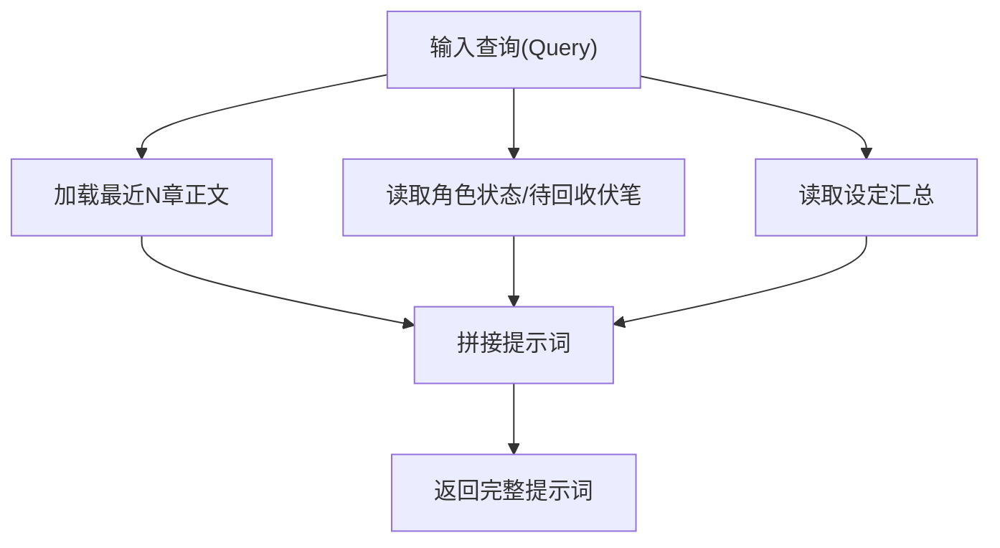

图表来源
- [utils/context_manager.py](file://utils/context_manager.py#L1-L93)

章节来源
- [utils/context_manager.py](file://utils/context_manager.py#L1-L93)

### 参考解析器（utils/reference_manager.py）
- 解析样本：从“大神素材样本.txt”中抽取章节提示与关键词
- 查找片段：在原著中定位章节与关键词，返回上下文片段供续写参考

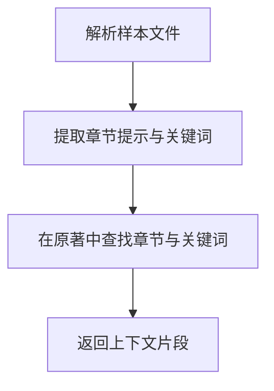

图表来源
- [utils/reference_manager.py](file://utils/reference_manager.py#L1-L94)
- [参考/大神素材样本.txt](file://参考/大神素材样本.txt#L1-L614)

章节来源
- [utils/reference_manager.py](file://utils/reference_manager.py#L1-L94)

### 文本分析器（utils/text_analyzer.py）
- 差异检测：基于序列相似性检测删除/替换片段
- 冲突扫描：在后续章节中检索被删除关键词，提示潜在冲突

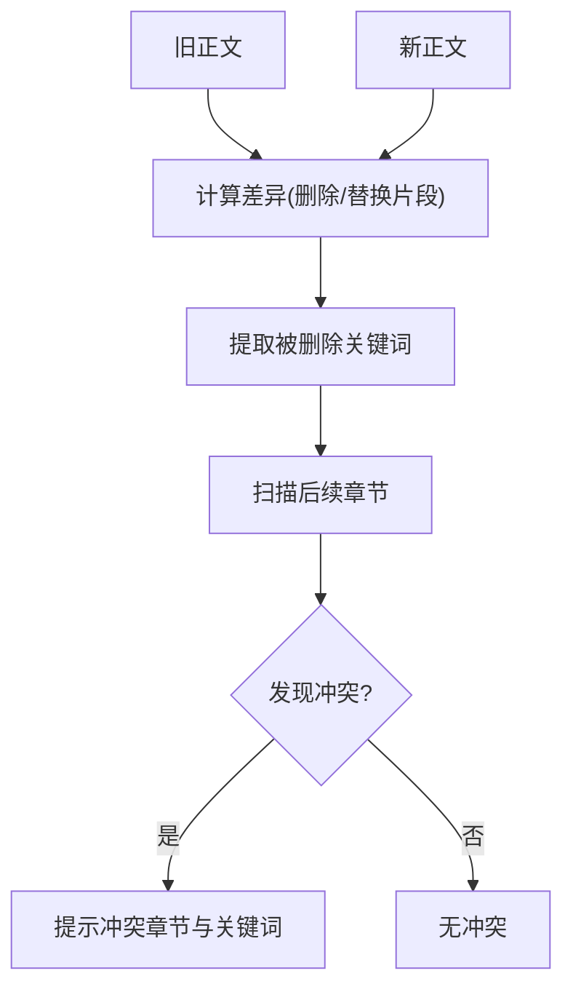

图表来源
- [utils/text_analyzer.py](file://utils/text_analyzer.py#L1-L63)

章节来源
- [utils/text_analyzer.py](file://utils/text_analyzer.py#L1-L63)

### 文件管理器（utils/file_manager.py）
- 目录保障：确保必需目录存在
- 正文拆分：按章节标题正则拆分单文件正文
- 资源检查：检查原著、样本与正文文件是否存在

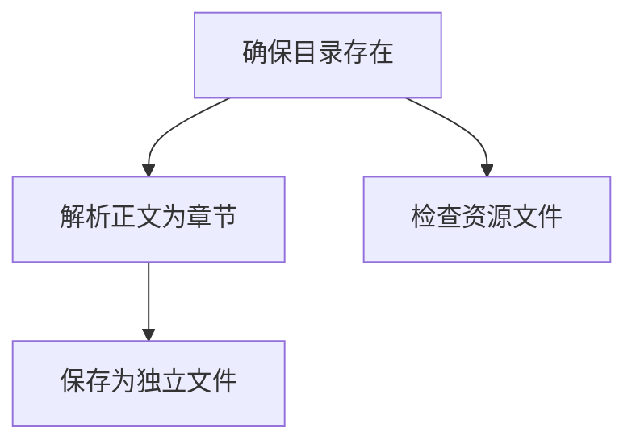

图表来源
- [utils/file_manager.py](file://utils/file_manager.py#L1-L108)

章节来源
- [utils/file_manager.py](file://utils/file_manager.py#L1-L108)

### 状态管理器（utils/state_manager.py）
- JSON读写：封装加载与保存
- 伏笔管理：新增、保存与查询待回收伏笔
- 角色状态：新增/更新角色状态字段
- 历史快照：复制当前状态文件到历史目录

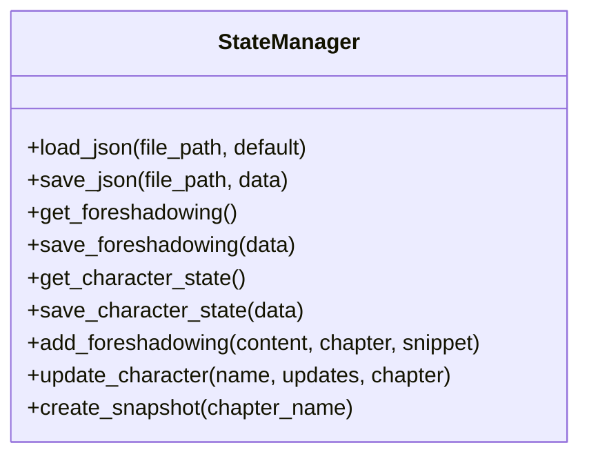

图表来源
- [utils/state_manager.py](file://utils/state_manager.py#L1-L77)

章节来源
- [utils/state_manager.py](file://utils/state_manager.py#L1-L77)

### 全量提取器（utils/extractor.py）
- 提取提示：构造LLM提示词，要求返回角色状态、伏笔、设定与剧情回顾
- 结果清洗：去除Markdown标记与控制字符，解析JSON
- 保存结果：分别写入角色状态、伏笔列表、设定与剧情回顾文件

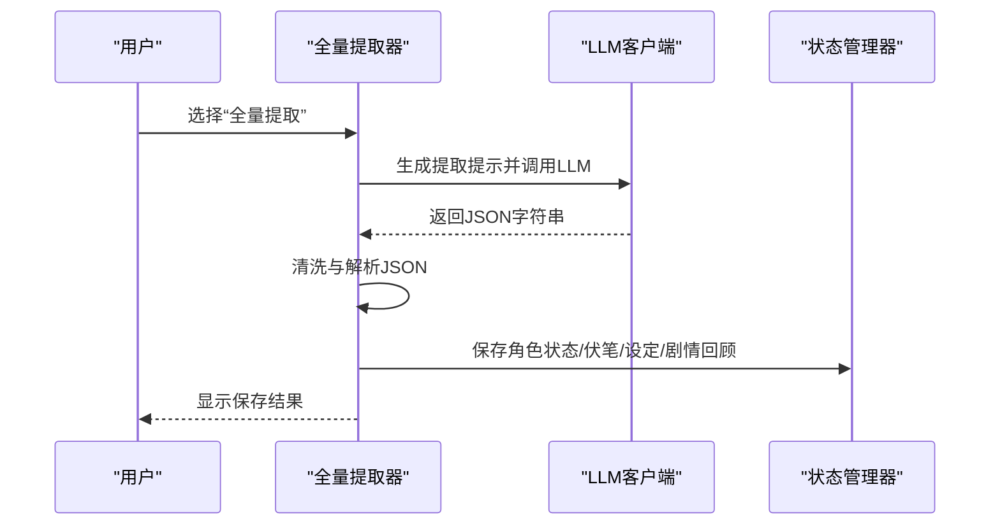

图表来源
- [utils/extractor.py](file://utils/extractor.py#L1-L106)
- [utils/llm_client.py](file://utils/llm_client.py#L1-L135)
- [utils/state_manager.py](file://utils/state_manager.py#L1-L77)

章节来源
- [utils/extractor.py](file://utils/extractor.py#L1-L106)

## 依赖关系分析
- 外部依赖：Streamlit、google-generativeai、python-dotenv、tenacity、openai
- 环境变量：通过.env配置LLM提供商、API密钥与模型名称
- 模块耦合：前端通过统一的LLM客户端与状态管理器访问工具模块；上下文构建依赖状态管理器；参考解析依赖原著文件；文本分析依赖后续章节文件

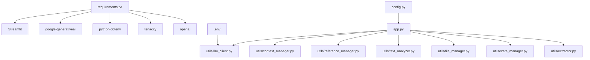

图表来源
- [requirements.txt](file://requirements.txt#L1-L6)
- [.env](file://.env#L1-L16)
- [config.py](file://config.py#L1-L24)
- [app.py](file://app.py#L1-L690)
- [utils/llm_client.py](file://utils/llm_client.py#L1-L135)

章节来源
- [requirements.txt](file://requirements.txt#L1-L6)
- [.env](file://.env#L1-L16)
- [config.py](file://config.py#L1-L24)

## 性能考量
- LLM调用超时与重试：OpenAI客户端设置较长超时，内置重试策略提升稳定性
- 上下文长度控制：细纲讨论与全量提取均对提示词长度进行合理控制，避免超出模型上下文限制
- 文件IO优化：章节排序采用正则匹配章节编号，避免全量扫描；文本分析仅在修改后触发
- 缓存建议：参考解析可在原著较大时考虑章节偏移缓存，减少重复扫描

## 故障排查指南
- API配置错误
  - 症状：调用LLM时报错或返回异常
  - 排查：检查.env中LLM_PROVIDER、API密钥与BaseURL是否正确；确认模型名称可用
  - 参考：LLM客户端错误日志打印详细信息
- 资源文件缺失
  - 症状：初始化或功能模式提示缺少文件
  - 排查：使用“资源状态”检查缺失文件；通过“创建/修复目录结构”与“导入正文”完成初始化
- 正文冲突检测无效
  - 症状：修改后未提示冲突
  - 排查：确认删除关键词长度大于阈值；检查后续章节是否包含相同关键词
- 全量提取失败
  - 症状：提取结果非JSON或为空
  - 排查：检查LLM返回是否包含Markdown标记；确认API密钥与模型可用

章节来源
- [utils/llm_client.py](file://utils/llm_client.py#L1-L135)
- [app.py](file://app.py#L1-L690)
- [utils/text_analyzer.py](file://utils/text_analyzer.py#L1-L63)

## 结论
“镇妖狱创作引擎”通过Streamlit前端与模块化工具层，实现了从设定到正文的全流程创作辅助。其核心价值在于：
- 一体化创作流程：从设定探讨、细纲规划到正文续写与冲突检测闭环
- 多AI服务集成：统一适配多家模型服务商，满足不同成本与性能需求
- 结构化状态管理：角色状态与伏笔的持久化与历史快照，保障故事一致性
- 实用性与可扩展性：初学者可快速上手，开发者可按需扩展模块与提示词

## 附录
- 实际使用场景
  - 设定探讨：在“探讨设定”中输入想法，系统自动融合多类设定要素并保存
  - 细纲规划：在“探讨细纲”中基于上下文与角色状态生成可执行的剧情要点
  - 正文续写：选择文风参考样本，结合细纲生成符合风格的章节内容
  - 冲突检测：在“改文与冲突提示”中对比修改并扫描后续章节，避免前后矛盾
- 价值主张
  - 降低创作心智负担：AI自动分析与提示，聚焦创意而非繁琐校对
  - 提升创作效率：从设定到正文的无缝衔接，加速迭代与产出
  - 保障故事质量：冲突检测与状态管理帮助维持复杂叙事的连贯性